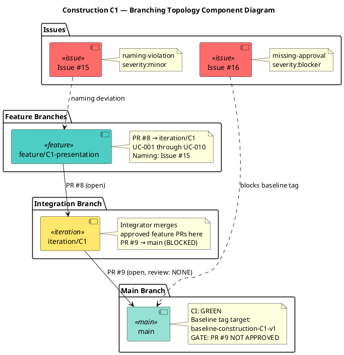
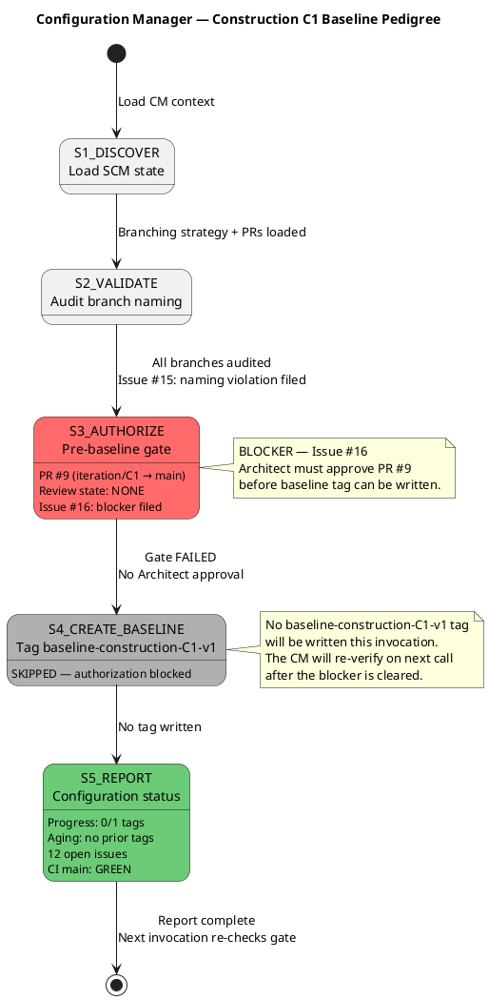

# Branching Strategy — Portal Cuba Corp

**Document Control**

| Field | Value |
|---|---|
| Phase | Construction |
| Status | Active |
| Milestone Target | End of Construction (IOC) |
| Owner | Configuration Manager |
| Last Updated | 2026-08-28 |
| Prior Phase | Elaboration — E1 baseline DEFERRED (mechanism not merged to main) |
| Current Iteration | Construction Iter 1 (C1) |
| C1 Baseline Status | BLOCKED — PR #9 missing Architect approval (Issue #16) |

---

## 1. Purpose

This document defines the canonical branching model, naming conventions, baseline
procedure, and change-control integration for the Portal Cuba Corp project. It is
**config-as-code**: it lives in the repository and is consumed directly by the
Integrator, Implementer, Code Reviewer, and Configuration Manager.

Updates to this file are committed **directly to `main`** via `scm_commit_files` —
no pull request is required. The file is documentation; a PR would gate a Markdown
change behind a Reviewer with nothing actionable to inspect and would delay
downstream consumers.

---

## 2. Configuration Item Identification

| CI Type | Location | Naming / Versioning |
|---|---|---|
| Source code | `src/` | .NET 10, C# conventions |
| Artifacts (RUP) | `docs/artifacts/` | Canonical RUP names (Vision Document, Use Case Model, etc.) |
| Branching strategy | `docs/BRANCHING_STRATEGY.md` | This file — direct commit to main |
| CI/CD config | `.github/workflows/` | YAML, branch-triggered |
| UI design reference | `docs/inputs/employee-portal-design.html` | MANDATORY (CON-011) — read-only input |
| Baseline tags | Git tags | `baseline-{phase}{n}-v{x}` |

---

## 3. Branch Naming Conventions

| Pattern | Phase | Purpose |
|---|---|---|
| `feature/E{n}-{risk-id}[-{mechanism}]` | Elaboration | Evolutionary architectural mechanism |
| `feature/C{n}-{uc-id}-{subject}` | Construction | UC realization feature branch |
| `iteration/E{n}` \| `iteration/C{n}` | All | Integration workspace per iteration |
| `hotfix/{issue-id}` | Transition | Hotfix from main |
| `chore/{subject}` | All | Non-functional repo maintenance |

### Naming Violations

Non-conforming branches are surfaced as SCM issues with `severity:minor` +
`nature:defect` + `naming-violation` labels.

**Current violations:**
- Issue #15: `feature/C1-presentation` — missing UC identifiers (should follow
  `feature/C{n}-{uc-id}-{subject}` or `feature/C{n}-{uc-range}-{subject}` for multi-UC branches)

---

## 4. Branching Topology — Construction Phase

The following component diagram shows the canonical branching topology for
Construction C1, including the workspace hierarchy (feature → iteration → main)
and the roles that operate at each level.

### Cross-Phase Invariants

- Only the Integrator writes to `iteration/*` and `main` — no other role pushes there.
- `ready-for-review` is the Implementer → Code Reviewer handoff label.
- A baseline tag freezes ONLY an APPROVED + CI-green commit.
- Feature branches derive from `iteration/C{n}`, NOT from `main`.

---

## 5. Baseline Procedure — Construction Phase

The following state machine diagram shows the Configuration Manager's baseline
pedigree workflow for Construction C1, including the current gate failure.

### Pre-Tag Gate Checklist

Before writing `baseline-construction-C{n}-v{x}`:

1. **Review Gate:** `scm_get_pull_request_review_state(PR #)` on the iteration-close
   PR (`iteration/C{n} → main`) must return `APPROVED`.
2. **CI Gate:** `scm_get_build_status("main")` must return `green` AFTER the merge.
3. **Tag Message:** Must contain iteration-close PR number, head commit SHA,
   Architect approval review ID, `main` CI run URL, and notable findings.

Either gate fails → file an Issue (`severity:blocker` + `nature:defect`) and DO NOT tag.

---

## 6. Construction C1 — CM Status Reports

### Progress

| Metric | Value |
|---|---|
| Tags created this phase | 0 |
| Tags target | 1 (`baseline-construction-C1-v1`) |
| Prior phase tags | 0 (Elaboration E1 DEFERRED) |

### Aging

| Metric | Value |
|---|---|
| Days since last baseline tag | N/A — no baseline tags exist project-wide |
| Open naming-violation Issue age | Issue #15 — created 2026-08-28 |
| Open blocker Issue age | Issue #16 — created 2026-08-28 |

### Distribution

| Category | Count | Items |
|---|---|---|
| Tags per phase | Inception: 0, Elaboration: 0 (deferred), Construction: 0 (blocked) | — |
| Open Issues — Blocker | 2 | #16 (missing-approval), #6 (prototype not merged) |
| Open Issues — Major | 4 | #11 (idempotency), #10 (IsFeatured), #3 (audit trail), #2 (offline retry) |
| Open Issues — Minor | 3 | #15 (naming), #13 (test assertion), #12 (CSV export) |
| Open Issues — Trivial | 1 | #14 (placeholder test) |
| Open Issues — Other | 2 | #5 (deferred record), #1 (LDAP PoC CR) |

### Trends

| Metric | Elaboration E2 | Construction C1 | Delta |
|---|---|---|---|
| Open Issues | ~6 | 12 | +6 (6 new CRs from code review + 2 CM gate issues) |
| Baseline tags | 0 | 0 | 0 |
| Open PRs | 2 | 2 | 0 |
| Closed PRs | 2 | 2 | 0 |

---

## 7. Elaboration Phase — Historical Record

### E1 Baseline Status: DEFERRED

The Elaboration E1 baseline tag was not written because the architectural
prototype mechanism (PR #4) was not merged to `main`. The stakeholder sanction
was REFUSED. E2 was intended to absorb E1 scope, but the E1 close PR (#7) was
closed without merge. Issue #6 tracks the unmerged prototype.

### Elaboration Branching Model

- `feature/E{n}-{risk-id}[-{mechanism}]` — evolutionary architectural mechanism
- `iteration/E{n}` — integration workspace
- Architect records PoC decision: `analysis-only` | `single-mechanism` | `candidates`
- Code Reviewer opens + reviews each mechanism PR (base `iteration/E{n}`)
- Integrator merges APPROVED mechanism into `iteration/E{n}`
- At LAM close: Integrator opens `iteration/E{n} → main`

---

## 8. Traceability

| Element | Traces From | Link Type | Traces To |
|---|---|---|---|
| `feature/C1-presentation` | FR-001 through FR-010 | Realizes | PR #8 → iteration/C1 |
| `iteration/C1` | RUP Ch.13 + IARI convention | Refines | PR #9 → main |
| `baseline-construction-C1-v1` (pending) | RUP Ch.13 baseline discipline | Refines | `scm_create_tag` (blocked) |
| Pre-tag gate | RUP Ch.13 Fig 13-6 | Refines | `scm_get_pull_request_review_state`, `scm_get_build_status` |
| Issue #15 (naming violation) | Branch naming conventions | DependsOn | `feature/C1-presentation` |
| Issue #16 (missing approval) | Pre-tag gate | DependsOn | PR #9 review state |
| CI gating on .NET 10 | CON-001 | DependsOn | `.github/workflows/` |
| OIDC client pre-requisite | CON-004 | DependsOn | Integration test environment |
| Mandatory design CI | CON-011 | DependsOn | `docs/inputs/employee-portal-design.html` |
| Audit trail requirement | NFR-004 | Refines | Tag message audit record |
| E1 baseline DEFERRED | Review Record (stakeholder sanction REFUSED) | Derives | E2/C1 absorbs E1 scope |
| Blocker issue #6 | PR #4 not merged | DependsOn | Construction baseline gate |
| Baseline pedigree state machine | RUP Ch.13 baseline discipline | Refines | Pre-tag gate, `scm_create_tag` |