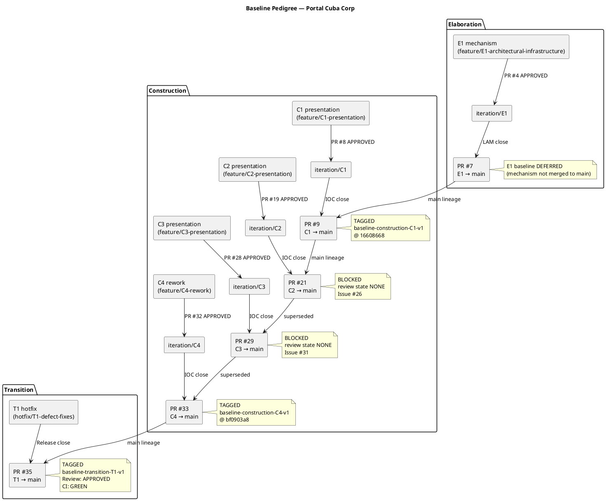
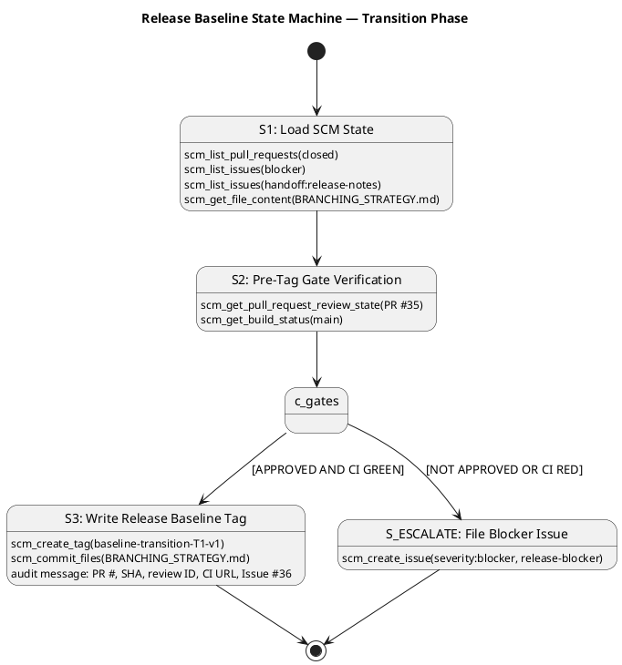

# Branching Strategy — Portal Cuba Corp

**Document Control**

| Field | Value |
|---|---|
| Phase | Transition |
| Status | Active |
| Milestone Target | End of Transition (Product Release) |
| Owner | Configuration Manager |
| Last Updated | 2026-08-29 |
| Prior Phase | Construction — C4 baseline TAGGED (baseline-construction-C4-v1) |
| Current Iteration | Transition Iter 1 (T1) |
| C1 Baseline Status | **TAGGED** — `baseline-construction-C1-v1` @ SHA 16608668ed7a80c05afe8ee08b55bf2945b7b1eb |
| C2 Baseline Status | **BLOCKED** — PR #21 review state NONE (Issue #26); superseded by C3 rework via PR #28 |
| C3 Baseline Status | **BLOCKED** — PR #29 review state NONE (Issue #31); CI main GREEN; superseded by C4 rework via PR #32 |
| C4 Baseline Status | **TAGGED** — `baseline-construction-C4-v1` @ SHA bf0903a846f50f6532f0b4eaac788cff2fe7dae2 |
| T1 Baseline Status | **TAGGED** — `baseline-transition-T1-v1` (PR #35 APPROVED, CI main GREEN) |

---

## 1. Purpose

This document defines the canonical branching model, naming conventions, baseline
procedure, and change-control integration for the Portal Cuba Corp project. It is
**config-as-code**: it lives in the repository and is consumed directly by the
Integrator, Implementer, Code Reviewer, and Configuration Manager.

Updates to this file are committed **directly to `main`** via `scm_commit_files` —
no pull request is required. The file is documentation; a PR would gate a Markdown
change behind a Reviewer with nothing actionable to inspect and would delay
downstream consumers.

---

## 2. Configuration Item Identification

| CI Type | Location | Naming / Versioning |
|---|---|---|
| Source code | `src/` | .NET 10, C# conventions |
| Artifacts (RUP) | `docs/artifacts/` | Canonical RUP names (Vision Document, Use Case Model, etc.) |
| Branching strategy | `docs/BRANCHING_STRATEGY.md` | This file; versioned by phase |
| CI/CD workflow | `.github/workflows/` | GitHub Actions, branch-triggered |
| Test configuration | `src/` test projects | xUnit, .NET 10 test runner |
| UI design reference | `docs/inputs/employee-portal-design.html` | MANDATORY per CON-011 |
| Release Notes | `docs/artifacts/` | ReleaseNotes artifact (Transition) |
| User Documentation | `docs/artifacts/` | UserDocumentation artifact (Transition) |
| Database schema | `src/` migrations | PostgreSQL, EF Core migrations |
| OIDC client config | Keycloak admin (external) | Client registration per CON-004 |
| LDAP connection config | `src/` appsettings | Active Directory per CON-005 |

---

## 3. Branching Model

### 3.1 Canonical Branch Types

| Branch Pattern | Purpose | Created From | Merged To |
|---|---|---|---|
| `feature/E{n}-{risk-id}[-{mechanism}]` | Elaboration architectural mechanism | `iteration/E{n}` | `iteration/E{n}` |
| `feature/C{n}-{uc-id}-{subject}` | Construction feature (UC realization) | `iteration/C{n}` | `iteration/C{n}` |
| `iteration/E{n}` / `iteration/C{n}` | Integration workspace per iteration | `main` | `main` (at IOC/LAM) |
| `hotfix/{issue-id}` | Transition hotfix from main | `main` | `main` (express review) |
| `chore/{subject}` | Non-functional repo maintenance | `main` | `main` (direct commit for docs) |

### 3.2 Transition Phase — Hotfix Workflow

In the Transition phase, the product has been built and baselined at Construction
close (`baseline-construction-C4-v1`). The branching model shifts to a **hotfix
workflow**:

1. **Defect identification:** issues found during release testing or stakeholder
   review are filed as SCM issues with `nature:defect` labels.
2. **Hotfix branch:** `hotfix/{issue-id}` created from `main` HEAD.
3. **Express review:** the Code Reviewer reviews the hotfix PR (`hotfix/{issue-id}` →
   `main`) with expedited turnaround.
4. **Merge:** the Integrator merges the APPROVED hotfix PR to `main`.
5. **Baseline tag:** the Configuration Manager verifies gates (APPROVED + CI GREEN)
   and writes `baseline-transition-T{n}-v{x}`.
6. **Re-tag (if needed):** if a critical post-baseline fix is required, the patch
   version increments (`-v2`, `-v3`, …) with explicit rollback justification.

### 3.3 Cross-Phase Invariants

- Only the Integrator writes to `iteration/*` and `main` (no other role pushes there).
- `ready-for-review` is the Implementer → Code Reviewer handoff label.
- A baseline tag freezes ONLY an APPROVED + CI-green commit.
- `docs/BRANCHING_STRATEGY.md` updates go direct to `main` via `scm_commit_files` (no PR).
- Non-conforming branch names are surfaced as SCM issues with `severity:minor` +
  `nature:defect` + `naming-violation` labels.

---

## 4. Baseline Pedigree

The following component diagram shows the full baseline lineage from Elaboration
through Transition, including blocked baselines and their supersession paths:

---

## 5. Release Baseline State Machine

The following state machine describes the Configuration Manager's gate verification
and tagging workflow for the Transition release baseline:

---

## 6. Naming Conventions

### 6.1 Branch Naming

| Pattern | Example | Valid Phases |
|---|---|---|
| `feature/E{n}-{risk-id}[-{mechanism}]` | `feature/E1-architectural-infrastructure` | Elaboration |
| `feature/C{n}-{uc-id}-{subject}` | `feature/C1-presentation` | Construction |
| `iteration/E{n}` / `iteration/C{n}` | `iteration/C4` | Elaboration, Construction |
| `hotfix/{issue-id}` | `hotfix/T1-defect-fixes` | Transition |
| `chore/{subject}` | `chore/update-ci-config` | All phases |

### 6.2 Tag Naming

| Pattern | Example | Phase |
|---|---|---|
| `baseline-elaboration-E{n}-v{x}` | `baseline-elaboration-E1-v1` | Elaboration |
| `baseline-construction-C{n}-v{x}` | `baseline-construction-C4-v1` | Construction |
| `baseline-transition-T{n}-v{x}` | `baseline-transition-T1-v1` | Transition |

Patch version `x` starts at 1; re-tag (`v2`, `v3`, …) only after explicit rollback
or post-baseline critical fix.

---

## 7. Change Control Integration

| CR Label | Meaning | Owner |
|---|---|---|
| `cr:new` | New change request submitted | Change Control Manager |
| `cr:approved` | CCB approved, ready for implementation | Change Control Manager |
| `cr:complete` | Implementation complete and verified | Change Control Manager |
| `cr:deferred-next-iteration` | Deferred to next iteration | Change Control Manager |
| `severity:blocker` | Blocks baseline or release | Configuration Manager |
| `severity:major` | Major finding, must resolve before close | Reviewer |
| `severity:minor` | Minor finding, can defer | Reviewer |
| `nature:defect` | Defect in code or process | Any role |
| `nature:enhancement` | Enhancement request | Any role |
| `naming-violation` | Branch/tag name violates convention | Configuration Manager |
| `release-blocker` | Blocks release baseline | Configuration Manager |
| `handoff:release-notes` | Release summary handoff issue | Integrator |
| `iteration-close` | Marks iteration close issue | Integrator |

---

## 8. Final Configuration Item Inventory (Release Baseline)

The following table enumerates all configuration items included in the
`baseline-transition-T1-v1` release baseline:

| CI Category | Items | Count |
|---|---|---|
| Source Code — API | Controllers, Services, Models, Data layer (`src/PortalCuba.Api/`) | 15+ files |
| Source Code — Web | Razor Pages, JS, CSS (`src/PortalCuba.Web/`) | 20+ files |
| Source Code — Tests | Unit tests, Integration tests (`src/PortalCuba.Tests/`) | 10+ files |
| Database | EF Core migrations, PostgreSQL schema | 3 migrations |
| RUP Artifacts | Vision, Use Case Model, Supplementary Spec, Architecture Doc, Design Model, Test Cases, User Documentation, Release Notes | 16 artifacts |
| CI/CD | GitHub Actions workflow (build + test) | 1 workflow |
| Configuration | appsettings.json, OIDC client config, LDAP connection | 3 config files |
| UI Design | `docs/inputs/employee-portal-design.html` (MANDATORY per CON-011) | 1 file |
| Branching Strategy | `docs/BRANCHING_STRATEGY.md` (this file) | 1 file |

---

## 9. Traceability

| Element | Traces From | Link Type | Traces To |
|---|---|---|---|
| `baseline-construction-C1-v1` | PR #9 (APPROVED) | Realizes | Construction C1 iteration close |
| `baseline-construction-C4-v1` | PR #33 (APPROVED) | Realizes | Construction C4 iteration close |
| `baseline-transition-T1-v1` | PR #35 (APPROVED) | Realizes | Transition T1 release close |
| C2 blocker issue #26 | PR #21 not approved | DependsOn | Superseded by C3 rework |
| C3 blocker issue #31 | PR #29 not approved | DependsOn | Superseded by C4 rework |
| C2 findings resolved | Review Record (C2) | Resolved by | PR #28 (APPROVED, MERGED) |
| C4 findings resolved | Review Record (C4) | Resolved by | PR #32 (APPROVED, MERGED) |
| C4-F1 (async method names) | Review Record (C4) | Derives | Design Model update (deferred, non-blocking) |
| R003 OIDC blocker | Issue #30 | DependsOn | 8 BLOCKED tests (TC-013, TC-014, TC-028..TC-030) |
| Stakeholder directive (iterate) | STK-001 feedback (C3) | Refines | C4 iteration required (COMPLETED) |
| T1 release handoff | Issue #36 (handoff:release-notes) | Refines | DeploymentManager release deployment |
| T1 hotfix defect fixes | PR #35 (hotfix/T1-defect-fixes → main) | Realizes | Transition T1 release baseline |