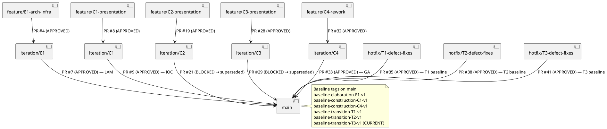
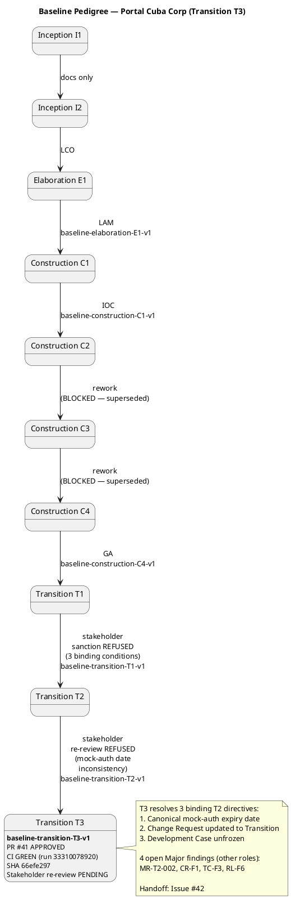

# Branching Strategy — Portal Cuba Corp

**Document Control**

| Field | Value |
|---|---|
| Phase | Transition |
| Status | Active |
| Milestone Target | End of Transition (Product Release) |
| Owner | Configuration Manager |
| Last Updated | 2026-08-30 |
| Prior Phase | Construction — C4 baseline TAGGED (baseline-construction-C4-v1) |
| Current Iteration | Transition Iter 3 (T3) |
| C1 Baseline Status | **TAGGED** — `baseline-construction-C1-v1` @ SHA 16608668ed7a80c05afe8ee08b55bf2945b7b1eb |
| C2 Baseline Status | **BLOCKED** — PR #21 review state NONE (Issue #26); superseded by C3 rework via PR #28 |
| C3 Baseline Status | **BLOCKED** — PR #29 review state NONE (Issue #31); CI main GREEN; superseded by C4 rework via PR #32 |
| C4 Baseline Status | **TAGGED** — `baseline-construction-C4-v1` @ SHA bf0903a846f50f6532f0b4eaac788cff2fe7dae2 |
| T1 Baseline Status | **TAGGED** — `baseline-transition-T1-v1` (PR #35 APPROVED, CI main GREEN) — stakeholder sanction REFUSED (3 binding conditions unmet) |
| T2 Baseline Status | **TAGGED** — `baseline-transition-T2-v1` @ SHA c6a1304b2d22fdbcd9fb6918b3febdde0284a421 (PR #38 APPROVED, CI main GREEN run 33262804733) — stakeholder re-review REFUSED (mock-auth date inconsistency across 7 artifacts) |
| T3 Baseline Status | **TAGGED** — `baseline-transition-T3-v1` @ SHA 66efe297bdae781ad085ac87b1e05f3237798ea8 (PR #41 APPROVED, CI main GREEN run 33310078920) — stakeholder re-review PENDING |

---

## 1. Purpose

This document defines the canonical branching model, naming conventions, baseline
procedure, and change-control integration for the Portal Cuba Corp project. It is
**config-as-code**: it lives in the repository and is consumed directly by the
Integrator, Implementer, Code Reviewer, and Configuration Manager.

Updates to this file are committed **directly to `main`** via `scm_commit_files` —
no pull request is required. The file is documentation; a PR would gate a Markdown
change behind a Reviewer with nothing actionable to inspect, and the file would
not reach downstream consumers (Integrator, Implementer, Reviewer) until the PR
is handled. PRs are for source code; docs are commits.

---

## 2. Naming Conventions

| CI Type | Pattern | Example |
|---|---|---|
| Feature branch (Construction) | `feature/C{n}-{uc-id}-{subject}` | `feature/C1-uc001-clock-in` |
| Feature branch (Elaboration) | `feature/E{n}-{risk-id}[-{mechanism}]` | `feature/E1-architectural-infrastructure` |
| Integration branch | `iteration/E{n}` \| `iteration/C{n}` | `iteration/C1` |
| Hotfix branch (Transition) | `hotfix/{issue-id}` \| `hotfix/T{n}-defect-fixes` | `hotfix/T3-defect-fixes` |
| Chore branch | `chore/{subject}` | `chore/update-ci-config` |
| Baseline tag | `baseline-{phase}{n}-v{x}` | `baseline-transition-T3-v1` |

**Phase encoding in tags:** `elaboration` \| `construction` \| `transition`.
`<n>` is the iteration number (integer). `<x>` is the patch version starting at 1;
re-tag `v2, v3…` only after an explicit rollback or post-baseline critical fix.

---

## 3. Branching Model

### 3.1 Workspace Hierarchy



### 3.2 Cross-Phase Invariants

- Only the Integrator writes `iteration/*` and `main` (no other role pushes there).
- `ready-for-review` is the Implementer → Code Reviewer handoff label.
- A baseline tag freezes only an APPROVED + CI-green commit.
- Hotfix branches in Transition: `hotfix/T{n}-defect-fixes` from `main`, express review, merge to `main` with a patch baseline tag.
- `docs/BRANCHING_STRATEGY.md` updates go directly to `main` via `scm_commit_files` — no PR.

---

## 4. Baseline Pedigree



### 4.1 Baseline Audit Summary

| Baseline | Tag | PR | Review State | CI Run | SHA | Stakeholder Sanction |
|---|---|---|---|---|---|---|
| Elaboration E1 | `baseline-elaboration-E1-v1` | #7 | APPROVED | GREEN | (LAM) | N/A |
| Construction C1 | `baseline-construction-C1-v1` | #9 | APPROVED | GREEN | 16608668ed7a80c05afe8ee08b55bf2945b7b1eb | N/A |
| Construction C2 | — | #21 | NONE (BLOCKED) | — | — | Superseded by C3 |
| Construction C3 | — | #29 | NONE (BLOCKED) | — | — | Superseded by C4 |
| Construction C4 | `baseline-construction-C4-v1` | #33 | APPROVED | GREEN | bf0903a846f50f6532f0b4eaac788cff2fe7dae2 | N/A |
| Transition T1 | `baseline-transition-T1-v1` | #35 | APPROVED | GREEN | (T1) | REFUSED (3 binding conditions) |
| Transition T2 | `baseline-transition-T2-v1` | #38 | APPROVED | GREEN (33262804733) | c6a1304b2d22fdbcd9fb6918b3febdde0284a421 | REFUSED (mock-auth date inconsistency) |
| Transition T3 | `baseline-transition-T3-v1` | #41 | APPROVED | GREEN (33310078920) | 66efe297bdae781ad085ac87b1e05f3237798ea8 | PENDING |

---

## 5. Configuration Items — Final Inventory (Transition T3)

| CI Category | Items | Storage |
|---|---|---|
| Source Code | `src/` — .NET 10 REST API + Razor Pages frontend | Git `main` |
| Database Schema | PostgreSQL DDL scripts | Git `main` |
| Test Code | Unit + integration tests (xUnit) | Git `main` |
| CI Configuration | GitHub Actions workflow | Git `main` |
| Documentation | RUP artifacts (16 artifacts across disciplines) | Git `main` (SCM-backed) |
| Branching Strategy | `docs/BRANCHING_STRATEGY.md` | Git `main` |
| UI Design | `docs/inputs/employee-portal-design.html` | Git `main` |
| Release Notes | Release Notes artifact (Transition) | Git `main` (SCM-backed) |
| User Documentation | User Documentation artifact (Transition) | Git `main` (SCM-backed) |

---

## 6. Change Control Integration

- Change Requests are tracked as GitHub Issues with labels `cr:new`, `cr:approved`, `cr:complete`.
- The Change Control Manager (CCM) owns the CR state machine and CCB triage.
- The Configuration Manager consumes CCM-triaged outcomes via branches and PRs.
- Naming-convention violations are filed as Issues with `severity:minor` + `nature:defect` + `naming-violation`.
- Gate failures (missing approval, red CI) are filed as Issues with `severity:blocker` + `nature:defect`.

---

## 7. Transition Hotfix Workflow

```plantuml
@startuml Hotfix_Workflow_Transition
title Transition Hotfix Workflow

state "Defect identified" as s1
state "hotfix/T{n}-defect-fixes\nbranch from main" as s2
state "Code Reviewer\nexpress review" as s3
state "PR to main" as s4
state "CM gate check:\nreview == APPROVED\nAND CI == GREEN" as s5
state "Tag baseline-transition-T{n}-v{x}" as s6
state "Stakeholder\nre-review" as s7

s1 --> s2 : branch
s2 --> s3 : ready-for-review label
s3 --> s4 : APPROVED
s4 --> s5 : merged to main
s5 --> s6 : both gates GREEN
s5 --> "File blocker Issue" : gate FAILS
s6 --> s7 : tag written
s7 --> "Product Release\nsanction" : APPROVED
s7 --> s1 : REFUSED — iterate

@enduml
```

---

## 8. Traceability

| Element | Traces From | Link Type | Traces To |
|---|---|---|---|
| baseline-elaboration-E1-v1 | PR #7 (APPROVED) | Realizes | LAM milestone |
| baseline-construction-C1-v1 | PR #9 (APPROVED) | Realizes | IOC milestone |
| baseline-construction-C4-v1 | PR #33 (APPROVED) | Realizes | GA milestone |
| baseline-transition-T1-v1 | PR #35 (APPROVED), CI GREEN | Realizes | T1 release (sanction REFUSED) |
| baseline-transition-T2-v1 | PR #38 (APPROVED), CI GREEN (33262804733) | Realizes | T2 release (sanction REFUSED) |
| baseline-transition-T3-v1 | PR #41 (APPROVED), CI GREEN (33310078920) | Realizes | T3 release (sanction PENDING) |
| T3 release handoff | Issue #42 (handoff:release-notes) | Refines | DeploymentManager release deployment |
| T3 hotfix defect fixes | PR #41 (hotfix/T3-defect-fixes → main) | Realizes | Transition T3 release baseline |
| T3 stakeholder directives | STK-001 directive (T2 refusal) | Refines | (1) Canonical mock-auth expiry, (2) CR updated to Transition, (3) Development Case unfrozen |
| T3 stakeholder sanction | STK-001, AC-001..AC-005 | Refines | PENDING re-review with T3 evidence |
| CR-T2-001 (Minor) | Review Record (T2) | Derives | Mock-auth expiry date consistency (documentation) — ADDRESSED in T3 |
| DM-F2 (Open Minor) | Review Record (T1) | Derives | Design Model traceability update (Designer owns) |