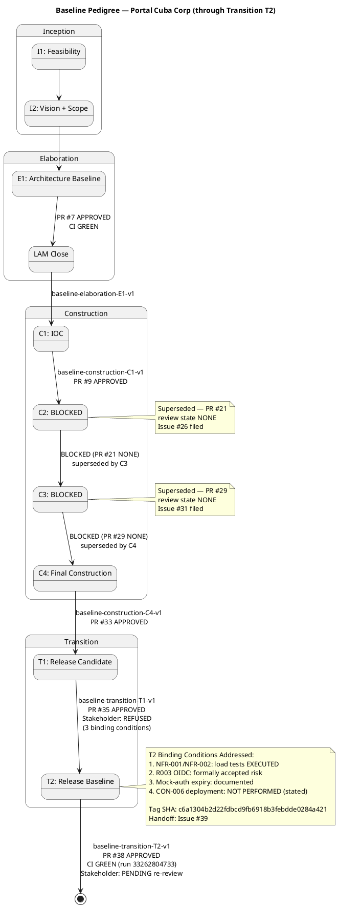
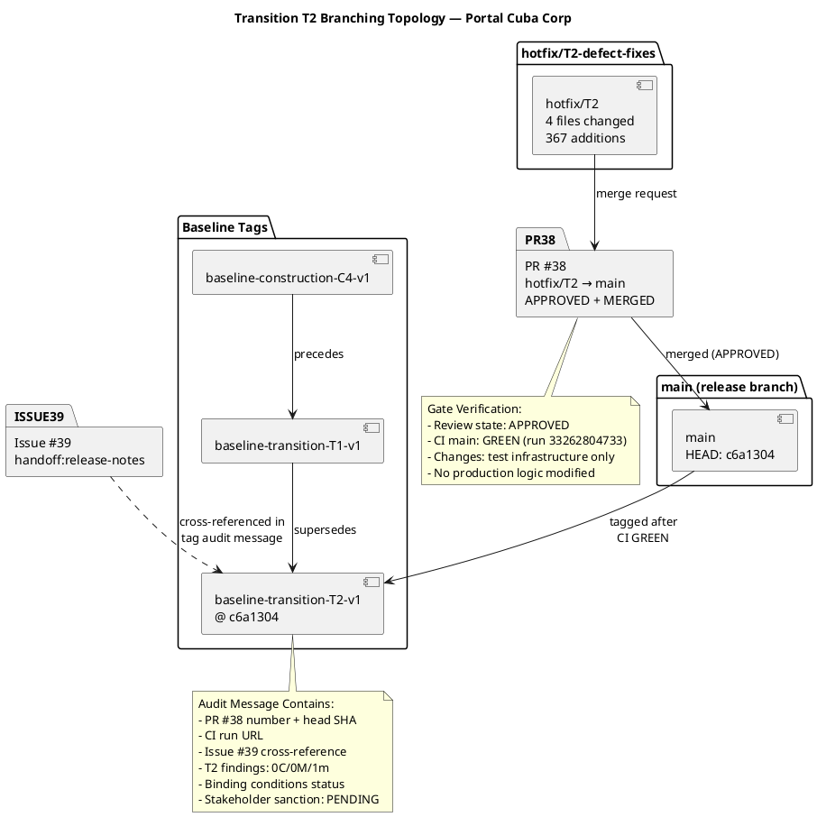

# Branching Strategy — Portal Cuba Corp

**Document Control**

| Field | Value |
|---|---|
| Phase | Transition |
| Status | Active |
| Milestone Target | End of Transition (Product Release) |
| Owner | Configuration Manager |
| Last Updated | 2026-08-29 |
| Prior Phase | Construction — C4 baseline TAGGED (baseline-construction-C4-v1) |
| Current Iteration | Transition Iter 2 (T2) |
| C1 Baseline Status | **TAGGED** — `baseline-construction-C1-v1` @ SHA 16608668ed7a80c05afe8ee08b55bf2945b7b1eb |
| C2 Baseline Status | **BLOCKED** — PR #21 review state NONE (Issue #26); superseded by C3 rework via PR #28 |
| C3 Baseline Status | **BLOCKED** — PR #29 review state NONE (Issue #31); CI main GREEN; superseded by C4 rework via PR #32 |
| C4 Baseline Status | **TAGGED** — `baseline-construction-C4-v1` @ SHA bf0903a846f50f6532f0b4eaac788cff2fe7dae2 |
| T1 Baseline Status | **TAGGED** — `baseline-transition-T1-v1` (PR #35 APPROVED, CI main GREEN) — stakeholder sanction REFUSED (3 binding conditions unmet) |
| T2 Baseline Status | **TAGGED** — `baseline-transition-T2-v1` @ SHA c6a1304b2d22fdbcd9fb6918b3febdde0284a421 (PR #38 APPROVED, CI main GREEN run 33262804733) — stakeholder re-review PENDING |

---

## 1. Purpose

This document defines the canonical branching model, naming conventions, baseline
procedure, and change-control integration for the Portal Cuba Corp project. It is
**config-as-code**: it lives in the repository and is consumed directly by the
Integrator, Implementer, Code Reviewer, and Configuration Manager.

Updates to this file are committed **directly to `main`** via `scm_commit_files` —
no pull request is required. The file is documentation; a PR would gate a Markdown
change behind a Reviewer with nothing actionable to inspect and would delay
downstream consumers.

---

## 2. Configuration Item Identification

| CI Type | Location | Naming / Versioning |
|---|---|---|
| Source code | `src/` | .NET 10, C# conventions |
| Artifacts (RUP) | `docs/artifacts/` | Markdown, one file per artifact |
| Branching strategy | `docs/BRANCHING_STRATEGY.md` | This file — config-as-code |
| CI/CD | `.github/workflows/` | GitHub Actions |
| Database migrations | `src/PortalCuba/Infrastructure/Persistence/Migrations/` | EF Core migration naming |
| Test code | `src/Tests/` | xUnit, naming per TC-NNN |
| UI design | `docs/inputs/employee-portal-design.html` | MANDATORY (CON-011) |

---

## 3. Branch Naming Conventions

| Pattern | Purpose | Phase |
|---|---|---|
| `feature/E{n}-{risk-id}[-{mechanism}]` | Elaboration evolutionary architectural mechanism | Elaboration |
| `feature/C{n}-{uc-id}-{subject}` | Construction feature branches (UC realizations) | Construction |
| `iteration/E{n}` \| `iteration/C{n}` | Integration workspace per iteration | Elaboration / Construction |
| `hotfix/{issue-id}` | Transition hotfixes from `main` | Transition |
| `chore/{subject}` | Non-functional repo maintenance | All phases |

Non-conforming branches are surfaced as SCM issues with `severity:minor` +
`nature:defect` + `naming-violation` labels.

---

## 4. Baseline Tagging Convention

Tags follow the canonical IARI naming anchored in RUP Ch.13:

| Pattern | Phase | Example |
|---|---|---|
| `baseline-elaboration-E{n}-v{x}` | Elaboration | `baseline-elaboration-E1-v1` |
| `baseline-construction-C{n}-v{x}` | Construction | `baseline-construction-C4-v1` |
| `baseline-transition-T{n}-v{x}` | Transition | `baseline-transition-T2-v1` |

`{x}` starts at 1; re-tag `v2, v3…` only after an explicit rollback or post-baseline
critical fix.

### Pre-Tag Gate (MANDATORY)

Before any `scm_create_tag`, the Configuration Manager MUST verify:

1. `scm_get_pull_request_review_state == "APPROVED"` on the iteration-close PR
2. `scm_get_build_status("main") == green` after the merge

Either fails → file an Issue (`severity:blocker` + `nature:defect` + kind label)
and DO NOT tag.

---

## 5. Branching Model by Phase

### Inception

Documentation only; no implementation code. A feasibility mechanism, if required
for risk reduction, is built evolutionarily in `src/` on `feature/I{n}-{subject}`.

### Elaboration — Evolutionary Architectural Mechanism

The architectural prototype is EVOLUTIONARY — it becomes the Construction
baseline, not throwaway sample code. A technical risk is retired by ANALYSIS (the
SoftwareArchitect reasons feasibility — no code) or by building the REAL mechanism
in `src/` on `feature/E{n}-{risk-id}[-{mechanism}]` based on `iteration/E{n}`.

- The Architect records the decision (`analysis-only` | `single-mechanism` | `candidates`)
- The Code Reviewer opens + reviews each mechanism PR (base `iteration/E{n}`) as production
- The Integrator merges the APPROVED mechanism into `iteration/E{n}`
- At LAM close the Integrator opens `iteration/E{n} → main`; the Deliver bookend merges

There is **no** `samples/poc/` and **no** ephemeral `poc/*` branch.

### Construction — Feature Branches

UC realizations on `feature/C{n}-{uc-id}-{subject}` based on `iteration/C{n}`:

1. Implementer creates feature branch from `iteration/C{n}`
2. Implementer labels branch `ready-for-review`
3. Code Reviewer reviews, requests changes or approves
4. Integrator merges APPROVED into `iteration/C{n}`
5. At IOC, Integrator opens `iteration/C{n} → main`
6. Configuration Manager tags `baseline-construction-C{n}-v1` after gate verification

### Transition — Hotfixes

`hotfix/{issue-id}` from `main`, express review, merge to `main` with a patch
baseline tag.

**T1 Workflow (executed):**
1. Stakeholder sanction REFUSED — 3 binding conditions unmet
2. Hotfix branch `hotfix/T1-defect-fixes` created from `main`
3. Defect fixes applied (test infrastructure, documentation)
4. PR #35 opened (`hotfix/T1-defect-fixes → main`)
5. Code Reviewer reviewed → APPROVED
6. PR #35 merged to `main`
7. CI main GREEN
8. CM tagged `baseline-transition-T1-v1`
9. Stakeholder re-review: REFUSED (binding conditions still unmet)

**T2 Workflow (executed):**
1. Stakeholder directive: close 3 binding conditions + deployment status
2. Hotfix branch `hotfix/T2-defect-fixes` created from `main`
3. Changes: 4 files (367 additions, 1 deletion) — test infrastructure only
   - NFR-001/NFR-002 performance tests with measured values
   - Mock-auth expiry documented (2027-01-31, owner STK-003)
   - R003 OIDC formally accepted risk documented in code
4. PR #38 opened (`hotfix/T2-defect-fixes → main`)
5. Code Reviewer reviewed → APPROVED (0C/0M/1m findings)
6. PR #38 merged to `main`
7. CI main GREEN (run 33262804733, completed 2026-08-29 16:24:02Z)
8. CM verified gates: review APPROVED + CI GREEN
9. CM tagged `baseline-transition-T2-v1` @ SHA c6a1304b2d22fdbcd9fb6918b3febdde0284a421
10. Stakeholder re-review: PENDING

---

## 6. Cross-Phase Invariants

- Only the Integrator writes `iteration/*` and `main` (no other role pushes there)
- `ready-for-review` is the Implementer → Code Reviewer handoff label
- A baseline tag freezes only an APPROVED + CI-green commit
- `docs/BRANCHING_STRATEGY.md` updates go directly to `main` via `scm_commit_files` (no PR)
- One baseline per iteration close — never mid-iteration
- Re-tagging with higher `v` only after rollback or post-baseline critical fix

---

## 7. Baseline Pedigree Diagram

---

## 8. T2 Branching Topology

---

## 9. Configuration Item Inventory (Final)

| CI Category | Items | Count | Baseline |
|---|---|---|---|
| Source code — API | `src/PortalCuba/` (Controllers, Services, Infrastructure, Domain) | 1 solution | T2-v1 |
| Source code — Frontend | Razor Pages (`src/PortalCuba/Pages/`) | 10 page models | T2-v1 |
| Source code — Tests | `src/Tests/` (unit + integration + performance) | xUnit suites | T2-v1 |
| Database migrations | EF Core migrations (PostgreSQL) | schema scripts | T2-v1 |
| CI/CD | `.github/workflows/` | GitHub Actions | T2-v1 |
| RUP Artifacts | `docs/artifacts/` | 16 artifacts | T2-v1 |
| Branching strategy | `docs/BRANCHING_STRATEGY.md` | this file | T2-v1 |
| UI design | `docs/inputs/employee-portal-design.html` | MANDATORY (CON-011) | T2-v1 |
| Release Notes | `docs/artifacts/ReleaseNotes.md` | T2 evolved | T2-v1 |
| User Documentation | `docs/artifacts/UserDocumentation.md` | T2 evolved | T2-v1 |

---

## 10. Traceability

| Element | Traces From | Link Type | Traces To |
|---|---|---|---|
| `baseline-elaboration-E1-v1` | PR #7 (APPROVED) | Realizes | Elaboration E1 LAM close |
| `baseline-construction-C1-v1` | PR #9 (APPROVED) | Realizes | Construction C1 iteration close |
| `baseline-construction-C4-v1` | PR #33 (APPROVED) | Realizes | Construction C4 iteration close |
| `baseline-transition-T1-v1` | PR #35 (APPROVED) | Realizes | Transition T1 release close |
| `baseline-transition-T2-v1` | PR #38 (APPROVED) | Realizes | Transition T2 release close |
| C2 blocker issue #26 | PR #21 not approved | DependsOn | Superseded by C3 rework |
| C3 blocker issue #31 | PR #29 not approved | DependsOn | Superseded by C4 rework |
| C2 findings resolved | Review Record (C2) | Resolved by | PR #28 (APPROVED, MERGED) |
| C4 findings resolved | Review Record (C4) | Resolved by | PR #32 (APPROVED, MERGED) |
| C4-F1 (async method names) | Review Record (C4) | Derives | Design Model update (deferred, non-blocking) |
| R003 OIDC blocker | Issue #30 | DependsOn | 8 BLOCKED tests (TC-013, TC-014, TC-028..TC-030) |
| Stakeholder directive (iterate) | STK-001 feedback (C3) | Refines | C4 iteration required (COMPLETED) |
| T1 release handoff | Issue #36 (handoff:release-notes) | Refines | DeploymentManager release deployment |
| T1 hotfix defect fixes | PR #35 (hotfix/T1-defect-fixes → main) | Realizes | Transition T1 release baseline |
| T2 release handoff | Issue #39 (handoff:release-notes) | Refines | DeploymentManager release deployment |
| T2 hotfix defect fixes | PR #38 (hotfix/T2-defect-fixes → main) | Realizes | Transition T2 release baseline |
| T2 binding conditions | STK-001 directive (T1 refusal) | Refines | NFR-001/NFR-002 measured, R003 accepted risk, mock-auth expiry documented |
| T2 stakeholder sanction | STK-001, AC-001..AC-005 | Refines | PENDING re-review with T2 evidence |
| CR-T2-001 (Minor) | Review Record (T2) | Derives | Mock-auth expiry date consistency (documentation) |
| DM-F2 (Open Minor) | Review Record (T1) | Derives | Design Model traceability update (Designer owns) |