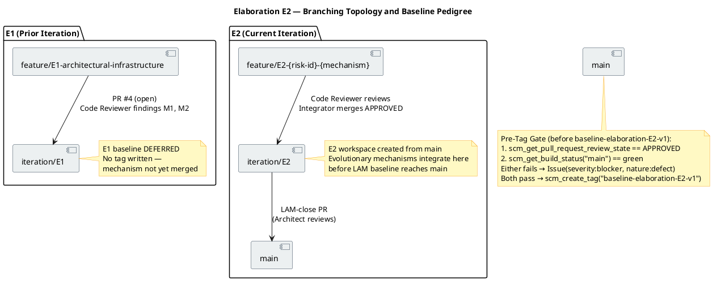
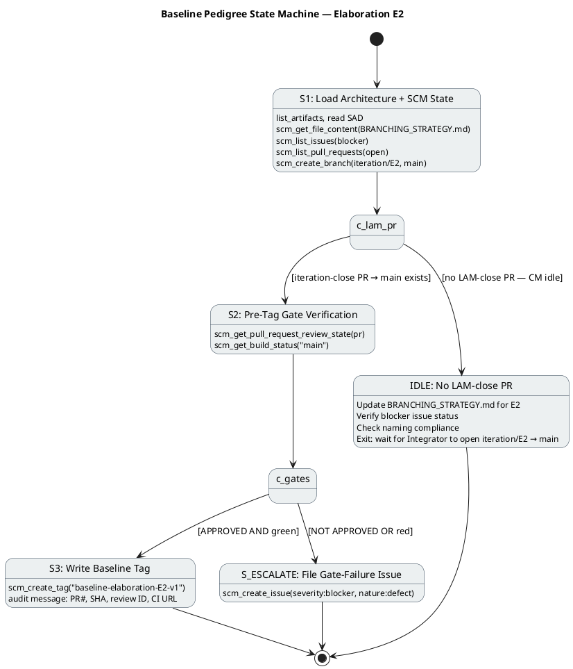

# Branching Strategy — Portal Cuba Corp

**Document Control**

| Field | Value |
|---|---|
| Phase | Elaboration |
| Status | Active |
| Milestone Target | End of Elaboration (LCA) |
| Owner | Configuration Manager |
| Last Updated | 2026-08-28 |
| Prior Phase | Inception — baseline strategy established |
| Current Iteration | Elaboration Iter 2 (E2) |
| E1 Baseline Status | DEFERRED — no tag written (mechanism not merged to main) |

---

## 1. Purpose

This document defines the canonical branching model, naming conventions, baseline
procedure, and change-control integration for the Portal Cuba Corp project. It is
**config-as-code**: it lives in the repository and is consumed directly by the
Integrator, Implementer, Code Reviewer, and Configuration Manager.

Updates to this file are committed **directly to `main`** via `scm_commit_files` —
no pull request is required. The file is documentation; a PR would gate a Markdown
change behind a Reviewer with nothing actionable to inspect and would delay
downstream consumers.

---

## 2. Configuration Item Identification

| CI Type | Location | Naming / Versioning |
|---|---|---|
| Source code | `src/` | .NET 10, C# conventions |
| Artifacts (RUP) | `docs/artifacts/` | Canonical RUP names (Vision Document, Use Case Model, etc.) |
| Branching strategy | `docs/BRANCHING_STRATEGY.md` | This file — direct commit to main |
| CI/CD config | `.github/workflows/` | YAML, branch-triggered |
| UI design reference | `docs/inputs/employee-portal-design.html` | MANDATORY (CON-011) — read-only input |
| Baseline tags | Git tags | `baseline-{phase}{n}-v{x}` |

---

## 3. Branch Naming Conventions

| Pattern | Phase | Purpose |
|---|---|---|
| `feature/E{n}-{risk-id}[-{mechanism}]` | Elaboration | Evolutionary architectural mechanism — real code in `src/`, based on `iteration/E{n}` |
| `feature/C{n}-{uc-id}-{subject}` | Construction | UC realizations |
| `iteration/E{n}` | Elaboration | Integration workspace per iteration |
| `iteration/C{n}` | Construction | Integration workspace per iteration |
| `hotfix/{issue-id}` | Transition | Hotfixes from main |
| `chore/{subject}` | Any | Non-functional repo maintenance |

Non-conforming branches are surfaced as SCM issues with `severity:minor` +
`nature:defect` + `naming-violation` labels.

---

## 4. Workspace Hierarchy

### 4.1 Elaboration — Evolutionary Architectural Mechanism

The architectural prototype is **evolutionary** — it becomes the Construction
baseline, not throwaway sample code. Technical risks are retired by:

- **Analysis** (the Software Architect reasons feasibility — no code), OR
- **Building the real mechanism** in `src/` on `feature/E{n}-{risk-id}[-{mechanism}]`
  based on `iteration/E{n}`

The Code Reviewer reviews each mechanism PR (base `iteration/E{n}`) as production.
The Integrator merges APPROVED mechanisms into `iteration/E{n}`. At LAM close,
the Integrator opens `iteration/E{n} → main`; the Deliver bookend merges the
reviewed baseline.

**There is NO `samples/poc/` directory and NO ephemeral `poc/*` branch.**

### 4.2 Current State — Elaboration Iter 2 (E2)

| Branch | Status | Notes |
|---|---|---|
| `iteration/E1` | Prior iteration | PR #4 (`feature/E1-architectural-infrastructure → iteration/E1`) still OPEN — Code Reviewer findings M1, M2 unresolved |
| `iteration/E2` | Active | Created from `main` — current integration workspace |
| `feature/E2-{risk-id}-{mechanism}` | Expected | Evolutionary mechanisms for E2 risks (R001 LDAP, R006 offline retry) |
| `main` | Stable | CI GREEN (success, 2026-08-28 10:50:54Z) — no E1 baseline tag (DEFERRED) |

### 4.3 E1 Baseline Deferral

No `baseline-elaboration-E1-v1` tag was written. The E1 architectural mechanism
(PR #4) has not been merged to `iteration/E1` (Code Reviewer findings M1/M2 open),
and no `iteration/E1 → main` PR exists. The E1 baseline is **DEFERRED** — the
architecture baseline will be established at E2 close when the LAM-close PR
(`iteration/E2 → main`) is APPROVED and `main` CI is GREEN.

---

## 5. Baseline Identification Scheme

### 5.1 Tag Naming Convention

| Phase | Tag Pattern | Example |
|---|---|---|
| Elaboration | `baseline-elaboration-E{n}-v{patch}` | `baseline-elaboration-E2-v1` |
| Construction | `baseline-construction-C{n}-v{patch}` | `baseline-construction-C1-v1` |
| Transition | `baseline-transition-T{n}-v{patch}` | `baseline-transition-T1-v1` |

`<patch>` starts at `1`; re-tag `v2, v3…` only after an explicit rollback or
post-baseline critical fix.

### 5.2 Pre-Tag Gate (MANDATORY)

Before any `scm_create_tag`, verify BOTH gates:

1. `scm_get_pull_request_review_state(projectId, prNumber) == "APPROVED"` on the
   iteration-close PR
2. `scm_get_build_status(projectId, "main") == green` after the merge

Either fails → file an Issue (`severity:blocker` + `nature:defect`) and DO NOT TAG.

### 5.3 Tag Message (Audit Record)

The tag body MUST contain:
- Iteration-close PR number and head commit SHA
- Architect approval review ID
- `main` CI run URL at tag time
- Any notable findings (naming violations, deferred items, re-tag justifications)

### 5.4 E2 Baseline Plan

| Item | Value |
|---|---|
| Target Tag | `baseline-elaboration-E2-v1` |
| Prerequisite PR | `iteration/E2 → main` (not yet opened by Integrator) |
| Prerequisite Review | Architect APPROVED on iteration-close PR |
| Prerequisite CI | `main` GREEN post-merge |
| E1 Baseline | DEFERRED — folded into E2 baseline |
| Blocker Issue | #6 — architectural prototype not merged to main |

---

## 6. Cross-Phase Invariants

- Only the Integrator writes `iteration/*` and `main` (no other role pushes there)
- `ready-for-review` is the Implementer → Code Reviewer handoff label
- A baseline tag freezes ONLY an APPROVED + CI-green commit
- One baseline per iteration close — never mid-iteration
- `docs/BRANCHING_STRATEGY.md` updates go directly to `main` via `scm_commit_files` — no PR

---

## 7. Elaboration E2 — Branching Topology

---

## 8. Baseline Pedigree State Machine

---

## 9. Change-Control Integration

Change Requests are managed by the Change Control Manager (CCM) via SCM issues
with the canonical label convention:

| Label | Meaning |
|---|---|
| `change-request` | Issue is a formal CR |
| `cr:new` | CR submitted, awaiting triage |
| `cr:approved` | CCB approved, implementation authorized |
| `cr:complete` | CR implemented and verified |
| `severity:blocker` | Blocks iteration close |
| `severity:major` | Significant impact, must resolve before milestone |
| `severity:minor` | Minor impact, resolve when feasible |
| `nature:defect` | Issue is a defect |
| `nature:enhancement` | Issue is an enhancement |
| `naming-violation` | Branch/PR/tag naming convention violation |

The Configuration Manager consumes CCM-triaged outcomes indirectly via the
branches and PRs they authorize. The CM does NOT triage CRs or evaluate impact.

---

## 10. Open Blockers and Issues

| Issue # | Title | Severity | Status | Impact on Baseline |
|---|---|---|---|---|
| #6 | CR: Architectural prototype (PR #4) not merged to main — all 20 test cases BLOCKED | blocker | open | E1 baseline DEFERRED; E2 baseline blocked until mechanism merged and LAM-close PR approved |

---

## 11. Traceability

| Element | Traces From | Link Type | Traces To |
|---|---|---|
| `baseline-elaboration-E2-v1` (planned) | RUP Ch.13 (Manage Baselines and Releases) | Refines | `scm_create_tag`, `scm_get_pull_request_review_state`, `scm_get_build_status` |
| `feature/E2-{risk-id}-{mechanism}` | R001 (AD LDAP risk), R006 (offline retry) | Derives | Elaboration evolutionary mechanism |
| `iteration/E2` | RUP Ch.13 + IARI convention | Refines | Integration workspace, LAM-close PR |
| E1 baseline DEFERRED | Review Record (stakeholder sanction REFUSED) | Derives | E2 baseline absorbs E1 scope |
| CI gating on .NET 10 | CON-001 | DependsOn | `.github/workflows/` |
| OIDC client pre-requisite | CON-004 | DependsOn | Integration test environment |
| Mandatory design CI | CON-011 | DependsOn | `docs/inputs/employee-portal-design.html` |
| Audit trail requirement | NFR-004 | Refines | Tag message audit record, PCA sign-off |
| Blocker issue #6 | PR #4 not merged | DependsOn | E2 baseline gate |
| Baseline pedigree state machine | RUP Ch.13 baseline discipline | Refines | Pre-tag gate, `scm_create_tag` |