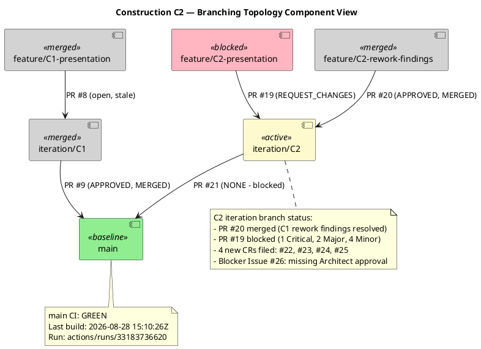
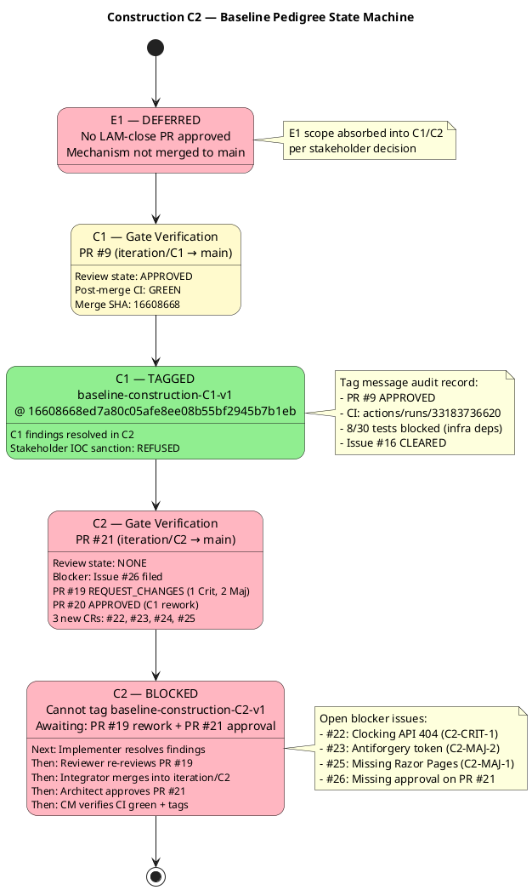

# Branching Strategy — Portal Cuba Corp

**Document Control**

| Field | Value |
|---|---|
| Phase | Construction |
| Status | Active |
| Milestone Target | End of Construction (IOC) |
| Owner | Configuration Manager |
| Last Updated | 2026-08-28 |
| Prior Phase | Elaboration — E1 baseline DEFERRED (mechanism not merged to main) |
| Current Iteration | Construction Iter 2 (C2) |
| C1 Baseline Status | **TAGGED** — `baseline-construction-C1-v1` @ SHA 16608668ed7a80c05afe8ee08b55bf2945b7b1eb |
| C2 Baseline Status | **BLOCKED** — PR #21 review state NONE (Issue #26) |

---

## 1. Purpose

This document defines the canonical branching model, naming conventions, baseline
procedure, and change-control integration for the Portal Cuba Corp project. It is
**config-as-code**: it lives in the repository and is consumed directly by the
Integrator, Implementer, Code Reviewer, and Configuration Manager.

Updates to this file are committed **directly to `main`** via `scm_commit_files` —
no pull request is required. The file is documentation; a PR would gate a Markdown
change behind a Reviewer with nothing actionable to inspect and would delay
downstream consumers.

---

## 2. Configuration Item Identification

| CI Type | Location | Naming / Versioning |
|---|---|---|
| Source code | `src/` | .NET 10, C# conventions |
| Artifacts (RUP) | `docs/artifacts/` | Canonical RUP names (Vision Document, Use Case Model, etc.) |
| Branching strategy | `docs/BRANCHING_STRATEGY.md` | This file — direct commit to main |
| CI/CD config | `.github/workflows/` | YAML, branch-triggered |
| UI design reference | `docs/inputs/employee-portal-design.html` | MANDATORY (CON-011) — read-only input |
| Baseline tags | Git tags | `baseline-{phase}{n}-v{x}` |

---

## 3. Branch Naming Conventions

| Pattern | Phase | Purpose |
|---|---|---|
| `feature/C{n}-{uc-id}-{subject}` | Construction | UC realization feature branch |
| `feature/C{n}-{subject}` | Construction | Cross-UC feature branch (e.g., presentation layer) |
| `feature/C{n}-rework-{subject}` | Construction | Rework branch for prior-iteration findings |
| `iteration/C{n}` | Construction | Integration workspace per iteration |
| `hotfix/{issue-id}` | Transition | Hotfix from main |
| `chore/{subject}` | All phases | Non-functional repo maintenance |

Non-conforming branches are surfaced as SCM issues with `severity:minor` +
`nature:defect` + `naming-violation` labels.

---

## 4. Workspace Hierarchy

### Cross-Phase Invariants

- Only the Integrator writes `iteration/*` and `main` (no other role pushes there)
- `ready-for-review` is the Implementer → Code Reviewer handoff label
- A baseline tag freezes only an APPROVED + CI-green commit
- Feature branches are based on `iteration/C{n}` (not `main`)
- The Integrator opens `iteration/C{n} → main` at iteration close

---

## 5. Baseline Pedigree

### Baseline Tag Audit Record

| Tag | Phase/Iter | PR | Review State | Merge SHA | CI Status | Date |
|---|---|---|---|---|---|---|
| `baseline-construction-C1-v1` | Construction C1 | #9 | APPROVED | `16608668ed7a80c05afe8ee08b55bf2945b7b1eb` | GREEN (run 33183736620) | 2026-08-28 |
| `baseline-construction-C2-v1` | Construction C2 | #21 | NONE (blocked) | — | — | — |

---

## 6. Pre-Tag Gate Procedure

The Configuration Manager verifies two gates before writing any baseline tag:

1. **Review Gate:** `scm_get_pull_request_review_state(projectId, pullNumber)` must return `APPROVED`
2. **CI Gate:** `scm_get_build_status(projectId, "main")` must return `success` (post-merge)

Either gate failing produces an SCM issue with `severity:blocker` + `nature:defect` +
kind label, and NO tag is written.

### Gate Results This Iteration

| Gate | C1 (PR #9) | C2 (PR #21) |
|---|---|---|
| Review | ✅ APPROVED | ❌ NONE |
| CI (main) | ✅ GREEN | N/A (PR not merged) |
| Outcome | **TAGGED** | **BLOCKED** (Issue #26) |

---

## 7. Configuration Status Report

### Progress

| Milestone | Target | Status |
|---|---|---|
| E1 baseline | LAM close | DEFERRED (no mechanism merged) |
| C1 baseline | IOC approach | **TAGGED** — `baseline-construction-C1-v1` |
| C2 baseline | IOC | **BLOCKED** — awaiting PR #21 approval |
| End-of-Construction | IOC | NOT ACHIEVED — deferred work remains |

### Aging

| Item | Age | Status |
|---|---|---|
| Issue #15 (naming violation) | 2 iterations | Deferred — `cr:deferred-next-iteration` |
| Issue #6 (PR #4 not merged) | 3 iterations | Approved, assigned to implementer |
| Issue #26 (C2 missing approval) | New | Blocker — just filed |

### Distribution

| Category | Count |
|---|---|
| Open Issues | 17 |
| Blocker severity | 3 (#6, #22, #26) |
| Major severity | 5 (#10, #11, #23, #25, #2) |
| Minor severity | 6 (#15, #17, #18, #24, #12, #13) |
| Trivial severity | 1 (#14) |
| Enhancement | 2 (#1, #3) |
| Integration record | 1 (#5) |
| Baseline tags this phase | 1 (`baseline-construction-C1-v1`) |

### Trends (C1 → C2)

| Metric | C1 Close | C2 Close | Delta |
|---|---|---|---|
| Baseline tags | 0 (blocked) | 1 (C1 tagged) | +1 |
| Open blocker issues | 2 (#6, #16) | 3 (#6, #22, #26) | +1 |
| Open PRs | 4 | 4 | 0 |
| Approved PRs merged | 0 | 2 (#9, #20) | +2 |
| CRs filed | 11 | 17 | +6 |

---

## 8. Change Control Integration

The Change Control Manager (CCM) owns the CR state machine (`cr:new` → `cr:approved` →
`cr:complete`). The Configuration Manager consumes CCM-triaged outcomes indirectly via
the branches and PRs they authorize. The CM does NOT triage CRs or evaluate impact.

### CR Workflow

1. CCM triages incoming CRs and assigns labels (`cr:new`, `cr:approved`, `cr:deferred-next-iteration`)
2. Approved CRs authorize feature branches or rework branches
3. The Implementer creates `feature/C{n}-...` branches for approved CRs
4. The Code Reviewer reviews and approves/rejects PRs
5. The Integrator merges approved PRs into `iteration/C{n}`
6. The CM verifies the gate and tags the baseline

---

## 9. Traceability

| Element | Traces From | Link Type | Traces To |
|---|---|---|---|
| `baseline-construction-C1-v1` | PR #9 (APPROVED) | Refines | `main` @ 16608668 |
| `baseline-construction-C2-v1` | PR #21 (NONE) | DependsOn | Issue #26 (blocker) |
| Pre-tag gate | RUP Ch.13 Fig 13-6 | Refines | `scm_get_pull_request_review_state`, `scm_get_build_status` |
| Issue #15 (naming violation) | Branch naming conventions | DependsOn | `feature/C1-presentation` |
| Issue #26 (missing approval) | Pre-tag gate | DependsOn | PR #21 review state |
| CI gating on .NET 10 | CON-001 | DependsOn | `.github/workflows/` |
| OIDC client pre-requisite | CON-004 | DependsOn | Integration test environment |
| Mandatory design CI | CON-011 | DependsOn | `docs/inputs/employee-portal-design.html` |
| Audit trail requirement | NFR-004 | Refines | Tag message audit record |
| E1 baseline DEFERRED | Review Record (stakeholder sanction REFUSED) | Derives | C1/C2 absorbs E1 scope |
| Blocker issue #6 | PR #4 not merged | DependsOn | Construction baseline gate |
| Baseline pedigree state machine | RUP Ch.13 baseline discipline | Refines | Pre-tag gate, `scm_create_tag` |
| C1 findings resolved | Review Record (C2) | Resolved by | PR #20 (APPROVED, MERGED) |
| C2-CRIT-1 (clocking API 404) | Review Record (C2) | Derives | Issue #22, PR #19 |
| C2-MAJ-1 (missing Razor Pages) | Review Record (C2) | Derives | Issue #25, PR #19 |
| C2-MAJ-2 (antiforgery token) | Review Record (C2) | Derives | Issue #23, PR #19 |