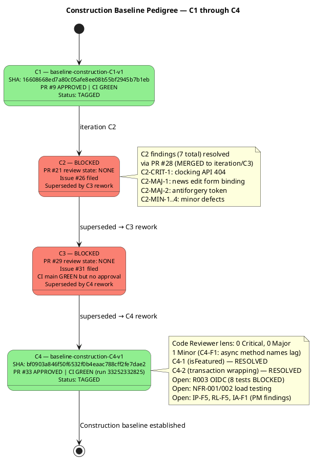

# Branching Strategy — Portal Cuba Corp

**Document Control**

| Field | Value |
|---|---|
| Phase | Construction |
| Status | Active |
| Milestone Target | End of Construction (IOC) |
| Owner | Configuration Manager |
| Last Updated | 2026-08-29 |
| Prior Phase | Elaboration — E1 baseline DEFERRED (mechanism not merged to main) |
| Current Iteration | Construction Iter 4 (C4) |
| C1 Baseline Status | **TAGGED** — `baseline-construction-C1-v1` @ SHA 16608668ed7a80c05afe8ee08b55bf2945b7b1eb |
| C2 Baseline Status | **BLOCKED** — PR #21 review state NONE (Issue #26); superseded by C3 rework via PR #28 |
| C3 Baseline Status | **BLOCKED** — PR #29 review state NONE (Issue #31); CI main GREEN; superseded by C4 rework via PR #32 |
| C4 Baseline Status | **TAGGED** — `baseline-construction-C4-v1` @ SHA bf0903a846f50f6532f0b4eaac788cff2fe7dae2 |

---

## 1. Purpose

This document defines the canonical branching model, naming conventions, baseline
procedure, and change-control integration for the Portal Cuba Corp project. It is
**config-as-code**: it lives in the repository and is consumed directly by the
Integrator, Implementer, Code Reviewer, and Configuration Manager.

Updates to this file are committed **directly to `main`** via `scm_commit_files` —
no pull request is required. The file is documentation; a PR would gate a Markdown
change behind a Reviewer with nothing actionable to inspect and would delay
downstream consumers.

---

## 2. Configuration Item Identification

| CI Type | Location | Naming / Versioning |
|---|---|---|
| Source code | `src/` | .NET 10, C# conventions |
| Artifacts (RUP) | `docs/artifacts/` | Canonical RUP names (Vision Document, Use Case Model, etc.) |
| Branching strategy | `docs/BRANCHING_STRATEGY.md` | This file — direct commit to main |
| CI/CD config | `.github/workflows/` | YAML, branch-triggered |
| UI design | `docs/inputs/employee-portal-design.html` | MANDATORY (CON-011) |
| Test code | `tests/` | xUnit, .NET 10 |
| Baseline tags | Git tags | `baseline-{phase}{n}-v{x}` |

---

## 3. Branching Model

### 3.1 Canonical Branch Patterns

| Pattern | Purpose | Created By |
|---|---|---|
| `feature/E{n}-{risk-id}[-{mechanism}]` | Elaboration evolutionary architectural mechanism | Implementer |
| `feature/C{n}-{uc-id}-{subject}` | Construction feature branch per UC realization | Implementer |
| `feature/C{n}-{subject}` | Construction rework/consolidation branch | Implementer |
| `iteration/E{n}` \| `iteration/C{n}` | Integration workspace per iteration | Integrator |
| `hotfix/{issue-id}` | Transition hotfix from main | Implementer |
| `chore/{subject}` | Non-functional repo maintenance | Configuration Manager |

### 3.2 Workspace Hierarchy

```
Developer workspace        Integration workspace       Release workspace
─────────────────────      ─────────────────────       ────────────────
feature/C{n}-...  ──merge→  iteration/C{n}  ──merge→     main (tagged)
feature/E{n}-...  ──merge→  iteration/E{n}  ──merge→     main (tagged)
hotfix/{issue-id} ──────────────────────────merge→     main (tagged)
```

**Invariants:**
- Only the Integrator writes to `iteration/*` and `main` (no other role pushes there).
- `ready-for-review` is the Implementer → Code Reviewer handoff label.
- A baseline tag freezes only an APPROVED + CI-green commit.
- Feature branches are short-lived; they are merged or superseded — never left dangling.

---

## 4. Baseline Procedure

### 4.1 Pre-Tag Gate (MANDATORY)

Before any `scm_create_tag`, the Configuration Manager MUST verify:

1. **Review Gate:** `scm_get_pull_request_review_state(projectId, pullNumber)` returns `APPROVED` on the iteration-close PR.
2. **CI Gate:** `scm_get_build_status(projectId, "main")` returns `success` (GREEN) post-merge.

Either gate fails → file an Issue (`severity:blocker` + `nature:defect`) and DO NOT tag.

### 4.2 Tag Naming Convention

| Phase | Pattern | Example |
|---|---|---|
| Elaboration | `baseline-elaboration-E{n}-v{x}` | `baseline-elaboration-E1-v1` |
| Construction | `baseline-construction-C{n}-v{x}` | `baseline-construction-C4-v1` |
| Transition | `baseline-transition-T{n}-v{x}` | `baseline-transition-T1-v1` |

`<patch>` starts at `1`; re-tag `v2, v3…` only after an explicit rollback.

### 4.3 Tag Message (Audit Record)

The tag message MUST contain:
- Iteration-close PR number and head commit SHA
- Architect/Reviewer approval reference
- `main` CI run URL at tag time
- Notable findings (resolved, deferred, open)

---

## 5. Construction Baseline Pedigree



---

## 6. Configuration Status Report — C4 Close

### 6.1 Progress

| Milestone | Target | Status |
|---|---|---|
| C1 baseline | `baseline-construction-C1-v1` | ✅ TAGGED |
| C2 baseline | `baseline-construction-C2-v1` | ❌ BLOCKED (superseded) |
| C3 baseline | `baseline-construction-C3-v1` | ❌ BLOCKED (superseded) |
| C4 baseline | `baseline-construction-C4-v1` | ✅ TAGGED |
| IOC milestone | End of Construction | ⏳ NOT ACHIEVED (R003 OIDC blocker, NFR load testing pending) |

### 6.2 Aging

| Item | Age | Notes |
|---|---|---|
| Last baseline tag | Current iteration | `baseline-construction-C4-v1` written this iteration |
| Issue #30 (R003 OIDC) | 4 escalation cycles | STK-003 has not confirmed OIDC registration; 8 tests BLOCKED |
| Issue #15 (naming violation) | Since C1 | `feature/C1-presentation` missing UC identifiers; deferred |
| Issue #5 (E1 deferred) | Since Elaboration | Elaboration E1 mechanism not merged to main |

### 6.3 Distribution

| Category | Count |
|---|---|
| Baseline tags this phase | 2 (C1, C4) |
| Blocked baselines this phase | 2 (C2, C3) |
| Open Issues — severity:blocker | 1 (#30 R003 OIDC) |
| Open Issues — severity:major | 2 (#1 LDAP PoC, #2 Offline retry) |
| Open Issues — severity:minor | 5 (#12, #13, #14, #15, #17, #18) |
| Open Issues — severity:trivial | 1 (#14) |
| Open PRs | 0 (all merged or closed) |
| Merged PRs this phase | 8 (#4, #7, #8, #9, #19, #20, #28, #32, #33) |

### 6.4 Trends

| Metric | C3 Close | C4 Close | Delta |
|---|---|---|---|
| Critical findings | 0 | 0 | 0 |
| Major findings | 0 | 0 | 0 |
| Minor findings | 0 | 1 (C4-F1) | +1 |
| Tests passing | 31/39 | 31/39 | 0 (8 still BLOCKED by R003) |
| Baseline tags | 1 (C1) | 2 (C1, C4) | +1 |
| Open blocker issues | 1 (#30) | 1 (#30) | 0 |
| PRs merged | 7 | 9 | +2 (#32, #33) |

---

## 7. Change-Control Integration

Change Requests are managed as GitHub Issues with the CR state machine:
`cr:new` → `cr:approved` → `cr:complete` (or `cr:deferred-next-iteration`).

The Configuration Manager does NOT triage CRs — that is the Change Control Manager's
responsibility. The CM consumes CCM decisions via the branches and PRs they authorize.

### 7.1 Open CRs (non-blocking for C4 baseline)

| Issue | Title | Severity | State |
|---|---|---|---|
| #30 | R003 OIDC infrastructure blocker | blocker | cr:deferred-next-iteration |
| #1 | LDAP Attribute Mapping PoC | major | cr:approved |
| #2 | Offline Clocking Retry Design | major | cr:approved |
| #3 | Audit Trail Pattern Validation | major | cr:deferred-next-iteration |
| #12 | CSV export TimeOut column | minor | cr:deferred-next-iteration |
| #13 | Test assertion contradicts name | minor | cr:deferred-next-iteration |
| #14 | Placeholder test UnitTest1.cs | trivial | cr:deferred-next-iteration |
| #15 | Naming violation feature/C1-presentation | minor | cr:deferred-next-iteration |
| #17 | Dead code RecordClockingRequest.EmployeeId | minor | cr:deferred-next-iteration |
| #18 | Test codifies idempotency collision | minor | cr:deferred-next-iteration |

---

## 8. Traceability

| Element | Traces From | Link Type | Traces To |
|---|---|---|---|
| `baseline-construction-C1-v1` | PR #9 (APPROVED) | Realizes | Construction C1 iteration close |
| `baseline-construction-C4-v1` | PR #33 (APPROVED) | Realizes | Construction C4 iteration close |
| C2 blocker issue #26 | PR #21 not approved | DependsOn | Superseded by C3 rework |
| C3 blocker issue #31 | PR #29 not approved | DependsOn | Superseded by C4 rework |
| C2 findings resolved | Review Record (C2) | Resolved by | PR #28 (APPROVED, MERGED) |
| C4 findings resolved | Review Record (C4) | Resolved by | PR #32 (APPROVED, MERGED) |
| C4-F1 (async method names) | Review Record (C4) | Derives | Design Model update (deferred, non-blocking) |
| R003 OIDC blocker | Issue #30 | DependsOn | 8 BLOCKED tests (TC-013, TC-014, TC-028..TC-030) |
| Stakeholder directive (iterate) | STK-001 feedback (C3) | Refines | C4 iteration required (COMPLETED) |