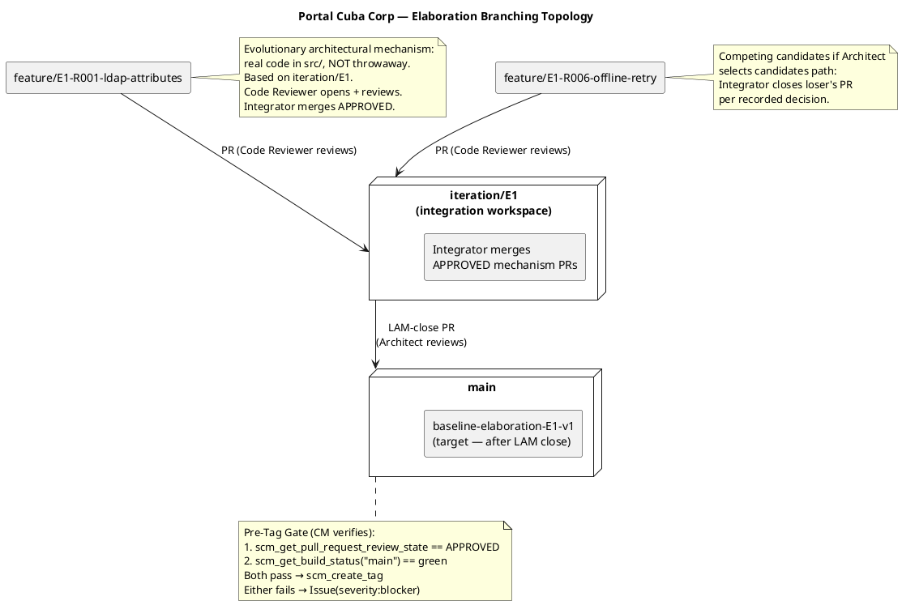
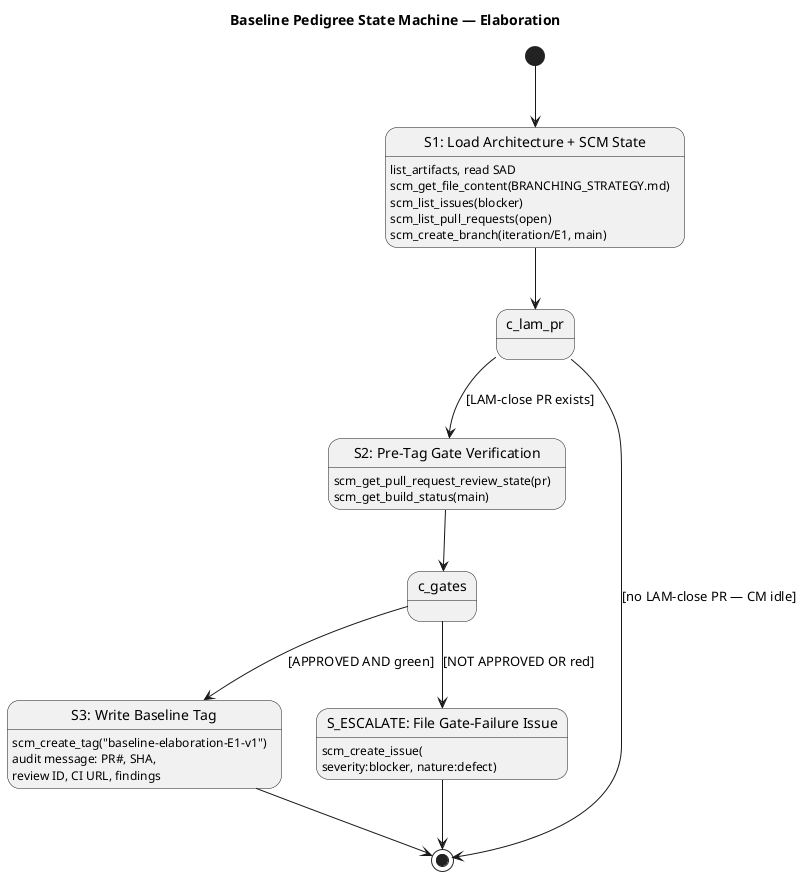

# Branching Strategy — Portal Cuba Corp

**Document Control**

| Field | Value |
|---|---|
| Phase | Elaboration |
| Status | Active |
| Milestone Target | End of Elaboration (LCA) |
| Owner | Configuration Manager |
| Last Updated | 2026-08-28 |
| Prior Phase | Inception — baseline strategy established |

---

## 1. Purpose

This document defines the canonical branching model, naming conventions, baseline
procedure, and change-control integration for the Portal Cuba Corp project. It is
**config-as-code**: it lives in the repository and is consumed directly by the
Integrator, Implementer, Code Reviewer, and Configuration Manager.

Updates to this file are committed **directly to `main`** via `scm_commit_files` —
no pull request is required. The file is documentation; a PR would gate a Markdown
change behind a Reviewer with nothing actionable to inspect and would delay
downstream consumers.

---

## 2. Configuration Item Identification

| CI Type | Location | Naming / Versioning |
|---|---|---|
| Source code | `src/` | .NET 10, C# conventions |
| Artifacts (RUP) | `docs/artifacts/` | Canonical RUP names (Vision Document, Use Case Model, etc.) |
| Branching strategy | `docs/BRANCHING_STRATEGY.md` | This file — direct commit to main |
| CI/CD config | `.github/workflows/` | YAML, branch-triggered |
| UI design reference | `docs/inputs/employee-portal-design.html` | MANDATORY (CON-011) — read-only input |
| Baseline tags | Git tags | `baseline-{phase}{n}-v{x}` |

---

## 3. Branch Naming Conventions

| Pattern | Phase | Purpose |
|---|---|---|
| `feature/E{n}-{risk-id}[-{mechanism}]` | Elaboration | Evolutionary architectural mechanism — real code in `src/`, based on `iteration/E{n}` |
| `feature/C{n}-{uc-id}-{subject}` | Construction | Use-case realization — based on `iteration/C{n}` |
| `iteration/E{n}` | Elaboration | Integration workspace per iteration |
| `iteration/C{n}` | Construction | Integration workspace per iteration |
| `hotfix/{issue-id}` | Transition | Hotfix from main, express review |
| `chore/{subject}` | All phases | Non-functional repo maintenance (branching strategy updates, CI config) |

**Non-conforming branches** are surfaced as SCM issues with `severity:minor` +
`nature:defect` + `naming-violation` labels. The Configuration Manager does NOT
auto-rename; the branch owner must correct the name.

---

## 4. Elaboration Branching Model — Evolutionary Architectural Mechanism

The Elaboration phase uses an **evolutionary** architectural prototype — the code
becomes the Construction baseline, NOT throwaway sample code. There is **no**
`samples/poc/` directory and **no** ephemeral `poc/*` branch.

### 4.1 Branching Topology

### 4.2 Mechanism Workflow

1. **Architect** identifies a technical risk (e.g., R001 — AD LDAP attribute
   consistency) and records the decision: `analysis-only` | `single-mechanism` |
   `candidates`.
2. **Implementer** creates `feature/E{n}-{risk-id}[-{mechanism}]` from
   `iteration/E{n}` and builds the REAL mechanism in `src/`.
3. **Code Reviewer** opens and reviews each mechanism PR (base `iteration/E{n}`)
   as production code.
4. **Integrator** merges the APPROVED mechanism into `iteration/E{n}`.
5. For competing `candidates`, the **Architect** selects the winner and the
   **Integrator** closes the loser's PR per the recorded decision.
6. At **LAM close**, the **Integrator** opens `iteration/E{n} → main`.
7. **Architect** reviews the LAM-close PR.
8. **Configuration Manager** verifies the pre-tag gate (see §6) and writes
   `baseline-elaboration-E{n}-v1`.

### 4.3 Active Iteration Workspace

| Branch | Status | Purpose |
|---|---|---|
| `iteration/E1` | **Active** | Elaboration iteration 1 integration workspace |
| `main` | Protected | Receives APPROVED LAM-close PR; carries baseline tag |

---

## 5. Baseline Tag Naming Convention

| Phase | Tag Pattern | Example |
|---|---|---|
| Elaboration | `baseline-elaboration-E{n}-v{patch}` | `baseline-elaboration-E1-v1` |
| Construction | `baseline-construction-C{n}-v{patch}` | `baseline-construction-C1-v1` |
| Transition | `baseline-transition-T{n}-v{patch}` | `baseline-transition-T1-v1` |

`{patch}` starts at `1`; re-tag `v2, v3…` only after an explicit rollback or
post-baseline critical fix. Routine iteration work targets the NEXT iteration's
tag, not a re-tag of the previous.

### 5.1 Baseline Pedigree State Machine

---

## 6. Pre-Tag Gate Procedure

The Configuration Manager verifies **two gates** before writing any baseline tag:

| Gate | Tool Call | Pass Condition |
|---|---|---|
| Review Approval | `scm_get_pull_request_review_state(projectId, prNumber)` | `APPROVED` |
| CI Build | `scm_get_build_status(projectId, "main")` | `green` |

**Either gate fails** → file an Issue with `severity:blocker` + `nature:defect` +
`missing-approval` or `ci-broken-on-main` label. DO NOT tag.

**Both gates pass** → write `baseline-elaboration-E{n}-v1` via `scm_create_tag`.

### 6.1 Tag Message Audit Record

The tag message MUST contain:

- Iteration-close PR number and head commit SHA
- Architect approval review ID
- `main` CI run URL at tag time
- Any notable findings (naming violations, deferred items, re-tag justifications)

---

## 7. Cross-Phase Invariants

| Invariant | Enforcement |
|---|---|
| Only the Integrator writes `iteration/*` and `main` | No other role pushes there |
| `ready-for-review` is the Implementer→Code Reviewer handoff label | `scm_add_label` on feature branch |
| A baseline tag freezes only an APPROVED + CI-green commit | Pre-tag gate (§6) verified before every `scm_create_tag` |
| `docs/BRANCHING_STRATEGY.md` updates go direct to `main` | `scm_commit_files` — no PR |
| No `poc/` branches or `samples/poc/` directory | Evolutionary mechanism is real code in `src/` |

---

## 8. Change Control Integration

Change Requests flow through the Change Control Manager (CCM) state machine:
`cr:new` → `cr:approved` → `cr:complete`. The Configuration Manager does NOT triage
CRs or evaluate impact — that is the CCM's responsibility. The CM consumes
CCM-triaged outcomes indirectly via the branches and PRs they authorize.

Status and measurement data (progress, aging, distribution, trends) flows to
dashboards that query the branch/PR/tag/Issue graph directly. No status report
artifact is produced.

---

## Traceability

| Element | Traces From | Link Type | Traces To |
|---|---|---|---|
| Branch naming conventions | RUP Ch.13 (Manage Baselines and Releases) | Refines | All feature/iteration/hotfix branches |
| Baseline tag procedure | RUP Ch.13 (Manage Baselines and Releases) | Refines | `scm_create_tag`, `scm_get_pull_request_review_state`, `scm_get_build_status` |
| `feature/E{n}-R001-ldap-attributes` | R001 (AD LDAP risk) | Derives | Elaboration evolutionary mechanism |
| `feature/E{n}-R006-offline-retry` | AC-005 (offline sync), R006 | Derives | Elaboration evolutionary mechanism |
| CI gating on .NET 10 | CON-001 | DependsOn | `.github/workflows/` |
| OIDC client pre-requisite | CON-004 | DependsOn | Integration test environment |
| Mandatory design CI | CON-011 | DependsOn | `docs/inputs/employee-portal-design.html` |
| Audit trail requirement | NFR-004 | Refines | Tag message audit record, PCA sign-off |
| Elaboration branching topology | RUP Ch.13 + IARI convention | Refines | `iteration/E1`, `feature/E1-*`, `main` |
| Baseline pedigree state machine | RUP Ch.13 baseline discipline | Refines | Pre-tag gate, `scm_create_tag` |