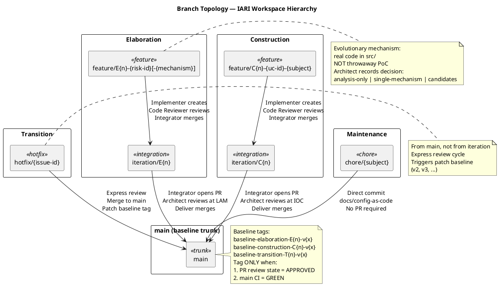
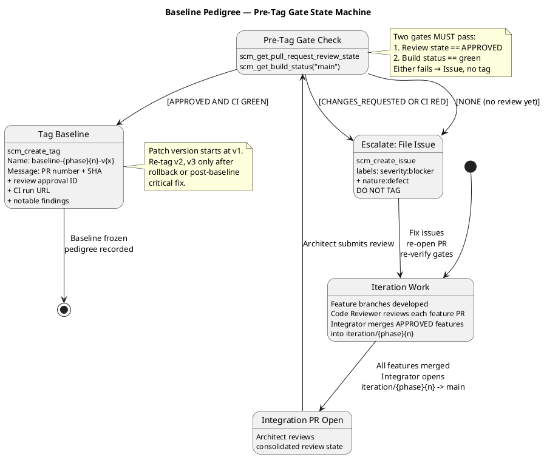

# Branching Strategy — Portal Cuba Corp

**Document Control**

| Field | Value |
|---|---|
| Phase | Inception |
| Status | Active |
| Milestone Target | End of Inception |
| Owner | Configuration Manager |
| Last Updated | 2026-08-28 |

---

## 1. Purpose

This document defines the canonical branching model, naming conventions, baseline
procedure, and change-control integration for the Portal Cuba Corp project. It is
**config-as-code**: it lives in the repository and is consumed directly by the
Integrator, Implementer, Code Reviewer, and Configuration Manager.

Updates to this file are committed **directly to `main`** via `scm_commit_files` —
no pull request is required. The file is documentation; a PR would gate a Markdown
change behind a Reviewer with nothing actionable to inspect and would delay
downstream consumers.

---

## 2. Configuration Item Identification

| CI Type | Location | Naming / Versioning |
|---|---|---|
| Source code | `src/` | .NET 10, C# conventions |
| Artifacts (RUP) | `docs/artifacts/` | Canonical RUP names (Vision Document, Use Case Model, etc.) |
| Branching strategy | `docs/BRANCHING_STRATEGY.md` | This file — direct commit to main |
| CI/CD config | `.github/workflows/` | YAML, branch-triggered |
| UI design reference | `docs/inputs/employee-portal-design.html` | MANDATORY (CON-011) — read-only input |
| Baseline tags | Git tags | `baseline-{phase}{n}-v{x}` |

---

## 3. Branch Naming Conventions

| Pattern | Phase | Purpose |
|---|---|---|
| `feature/E{n}-{risk-id}[-{mechanism}]` | Elaboration | Evolutionary architectural mechanism — real code in `src/`, based on `iteration/E{n}` |
| `feature/C{n}-{uc-id}-{subject}` | Construction | Use-case realization, based on `iteration/C{n}` |
| `iteration/E{n}` | Elaboration | Integration workspace per Elaboration iteration |
| `iteration/C{n}` | Construction | Integration workspace per Construction iteration |
| `hotfix/{issue-id}` | Transition | Hotfix from `main`, express review |
| `chore/{subject}` | Any | Non-functional repo maintenance (this file, CI config) |

**Non-conforming branches** are surfaced as SCM issues with labels
`severity:minor`, `nature:defect`, `naming-violation`. The Configuration Manager
does NOT auto-rename branches.

---

## 4. Branch Topology

The workspace hierarchy follows a three-tier model: **developer → integration →
trunk**. Only the Integrator writes to `iteration/*` and `main`; no other role
pushes there directly.

### 4.1 Per-Phase Branching Model

**Inception:**
- Documentation only; normally no implementation code.
- A feasibility mechanism, if genuinely required for risk reduction, is built
  evolutionarily in `src/` on `feature/I{n}-{subject}` (never throwaway).
- No baseline tags are written during Inception — architecture is not yet stable.

**Elaboration — Evolutionary Architectural Mechanism:**
- The architectural prototype is EVOLUTIONARY — it becomes the Construction
  baseline, not throwaway sample code.
- A technical risk is retired by ANALYSIS (the Software Architect reasons
  feasibility — no code) or by building the REAL mechanism in `src/` on
  `feature/E{n}-{risk-id}[-{mechanism}]` based on `iteration/E{n}`.
- The Architect records the decision: `analysis-only` | `single-mechanism` |
  `candidates`.
- The Code Reviewer opens + reviews each mechanism PR (base `iteration/E{n}`)
  as production code.
- The Integrator merges the APPROVED mechanism into `iteration/E{n}`.
- For competing `candidates`, the Architect selects the winner and the
  Integrator closes the loser's PR per the recorded decision.
- At LAM close, the Integrator opens `iteration/E{n} → main`; the Deliver
  bookend merges the reviewed baseline.
- There is **no** `samples/poc/` directory and **no** ephemeral `poc/*` branch.

**Construction — Feature Branches:**
- UC realizations on `feature/C{n}-{uc-id}-{subject}` based on `iteration/C{n}`.
- The Code Reviewer reviews each feature PR.
- The Integrator merges APPROVED features into `iteration/C{n}`.
- At IOC, the Integrator opens `iteration/C{n} → main`.

**Transition — Hotfixes:**
- `hotfix/{issue-id}` from `main`, express review.
- Merge to `main` with a patch baseline tag.

---

## 5. Baseline Pedigree

A baseline tag is written **only** at iteration close, never mid-iteration. The
pre-tag gate verifies two conditions before any `scm_create_tag`:

1. **Review gate:** `scm_get_pull_request_review_state` on the iteration-close PR
   returns `APPROVED`.
2. **CI gate:** `scm_get_build_status("main")` returns `green` after the merge.

Either fails → the Configuration Manager files an SCM issue
(`severity:blocker` + `nature:defect`) and **does NOT tag**.

### 5.1 Tag Naming

| Tag Pattern | Phase | Example |
|---|---|---|
| `baseline-elaboration-E{n}-v{x}` | Elaboration | `baseline-elaboration-E1-v1` |
| `baseline-construction-C{n}-v{x}` | Construction | `baseline-construction-C1-v1` |
| `baseline-transition-T{n}-v{x}` | Transition | `baseline-transition-T1-v1` |

- `{n}` = iteration number (integer, starting at 1)
- `{x}` = patch version (integer, starting at 1)
- Re-tag (`v2`, `v3`, …) only after an explicit rollback or post-baseline
  critical fix. Routine iteration work targets the NEXT iteration's tag.

### 5.2 Tag Message (Audit Record)

Every baseline tag message MUST contain:

- Iteration-close PR number and head commit SHA
- Architect approval review ID
- `main` CI run URL at tag time
- Notable findings (naming violations, deferred items, re-tag justifications)

---

## 6. Cross-Phase Invariants

1. **Only the Integrator writes `iteration/*` and `main`** — no other role
   pushes there directly.
2. **`ready-for-review`** is the Implementer → Code Reviewer handoff label.
3. **A baseline tag freezes only an APPROVED + CI-green commit** — no exceptions.
4. **`docs/BRANCHING_STRATEGY.md` updates go direct to `main`** via
   `scm_commit_files` — no PR, no review label.
5. **No `poc/` branches or `samples/poc/` directories** — evolutionary code
   lives in `src/` on `feature/` branches.
6. **Non-conforming branch names** yield an SCM issue, not an auto-rename.

---

## 7. Change Control Integration

The Change Control Manager (CCM) owns the Change Request state machine
(`cr:new` → `cr:approved` → `cr:complete`). The Configuration Manager does NOT
triage CRs or evaluate impact — that is the CCM's responsibility.

The Configuration Manager consumes CCM-triaged outcomes indirectly via the
branches and PRs they authorize:

- A CR approved by the CCB authorizes a feature branch or hotfix branch.
- The branch naming encodes the CR origin (`hotfix/{issue-id}`).
- The baseline tag message records which CRs were addressed in the iteration.

### 7.1 Escalation Paths

| Condition | Action | Issue Labels |
|---|---|---|
| Iteration-close PR not approved | File issue, do NOT tag | `severity:blocker`, `nature:defect` |
| `main` CI red after merge | File issue, do NOT tag | `severity:blocker`, `nature:defect` |
| Branch name violates convention | File issue, do NOT auto-rename | `severity:minor`, `nature:defect`, `naming-violation` |

---

## 8. Tooling

| Tool | Purpose |
|---|---|
| Git (SCM) | Version control, branching, tagging |
| GitHub Issues | Change Requests, gate-failure escalations |
| GitHub PR Reviews | Code Reviewer + Architect approval chain |
| CI/CD (GitHub Actions) | Build + test gating on `main` and feature branches |
| `scm_commit_files` | Direct commit of docs/config-as-code to `main` |
| `scm_create_tag` | Baseline tag creation (post-gate verification) |
| `scm_get_pull_request_review_state` | Pre-tag review gate check |
| `scm_get_build_status` | Pre-tag CI gate check |

---

## 9. Project-Specific Context

| Constraint | Impact on CM |
|---|---|
| CON-001: .NET 10 backend | CI must build .NET 10 projects |
| CON-002: Razor Pages frontend | No SPA build pipeline needed |
| CON-003: PostgreSQL database | CI must provision a test database |
| CON-004: Keycloak OIDC client | OIDC client registration must exist before integration testing |
| CON-006: Internal Windows Server | No cloud deployment CI targets |
| CON-007: No external network access | CI runs within corporate network |
| CON-011: Mandatory custom design | `docs/inputs/employee-portal-design.html` is a read-only CI |
| R001: AD LDAP attribute consistency | May trigger Elaboration evolutionary mechanism on `feature/E{n}-R001-ldap-attributes` |

---

## 10. Audit Procedures

### 10.1 Functional Configuration Audit (FCA)

Performed at each baseline tag: verify the tagged commit's features trace to the
use cases and requirements declared for the iteration. The tag message records
the PR that demonstrates the iteration's UCs.

### 10.2 Physical Configuration Audit (PCA)

Performed at each baseline tag: verify the tagged commit matches the approved
design (Architecture Document, Design Model). The Architect's APPROVED review on
the iteration-close PR is the PCA sign-off.

### 10.3 Status Accounting

Status and measurement data (progress, aging, distribution, trends) flows to
dashboards that query the branch/PR/tag/Issue graph directly. The Configuration
Manager ensures that graph is queryable by keeping labels, branch naming, and tag
conventions consistent. No status report artifact is produced.

---

## Traceability

| Element | Traces From | Link Type | Traces To |
|---|---|---|---|
| Branch naming conventions | RUP Ch.13 (Manage Baselines and Releases) | Refines | All feature/iteration/hotfix branches |
| Baseline tag procedure | RUP Ch.13 (Manage Baselines and Releases) | Refines | `scm_create_tag`, `scm_get_pull_request_review_state`, `scm_get_build_status` |
| `feature/E{n}-R001-ldap-attributes` | R001 (AD LDAP risk) | Derives | Elaboration evolutionary mechanism |
| CI gating on .NET 10 | CON-001 | DependsOn | `.github/workflows/` |
| OIDC client pre-requisite | CON-004 | DependsOn | Integration test environment |
| Mandatory design CI | CON-011 | DependsOn | `docs/inputs/employee-portal-design.html` |
| Audit trail requirement | NFR-004 | Refines | Tag message audit record, PCA sign-off |