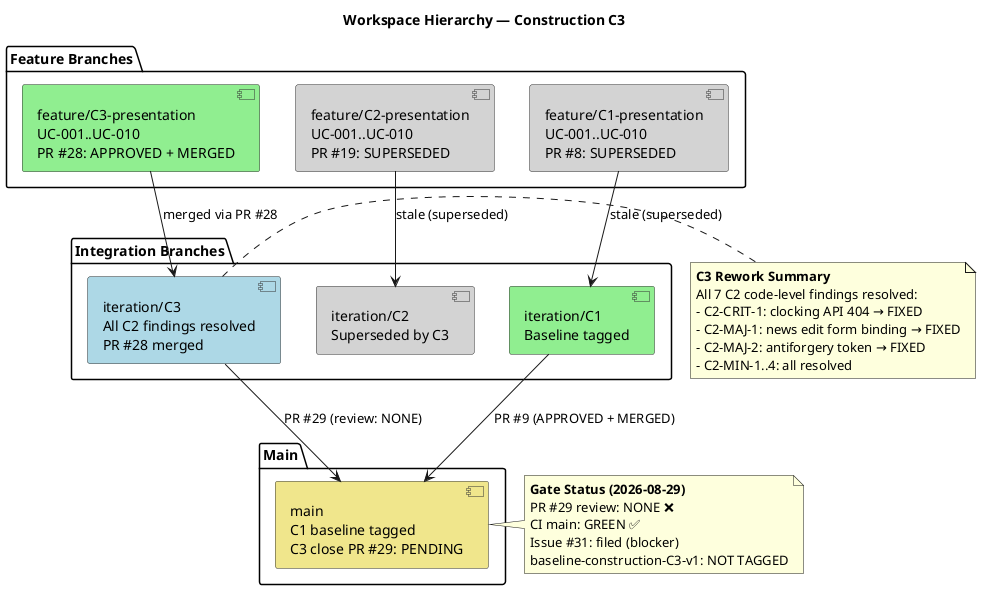
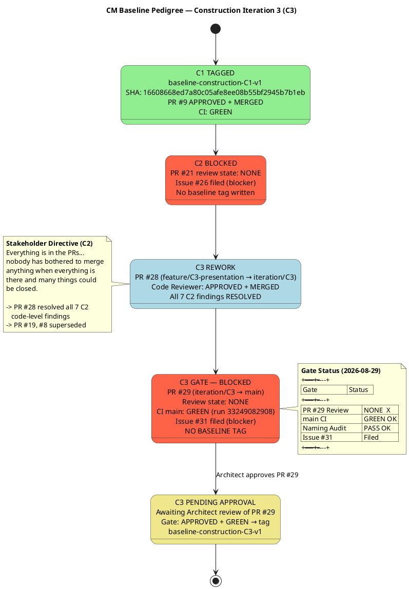

# Branching Strategy — Portal Cuba Corp

**Document Control**

| Field | Value |
|---|---|
| Phase | Construction |
| Status | Active |
| Milestone Target | End of Construction (IOC) |
| Owner | Configuration Manager |
| Last Updated | 2026-08-29 |
| Prior Phase | Elaboration — E1 baseline DEFERRED (mechanism not merged to main) |
| Current Iteration | Construction Iter 3 (C3) |
| C1 Baseline Status | **TAGGED** — `baseline-construction-C1-v1` @ SHA 16608668ed7a80c05afe8ee08b55bf2945b7b1eb |
| C2 Baseline Status | **BLOCKED** — PR #21 review state NONE (Issue #26); superseded by C3 rework via PR #28 |
| C3 Baseline Status | **BLOCKED** — PR #29 review state NONE (Issue #31); CI main GREEN; awaiting Architect approval |

---

## 1. Purpose

This document defines the canonical branching model, naming conventions, baseline
procedure, and change-control integration for the Portal Cuba Corp project. It is
**config-as-code**: it lives in the repository and is consumed directly by the
Integrator, Implementer, Code Reviewer, and Configuration Manager.

Updates to this file are committed **directly to `main`** via `scm_commit_files` —
no pull request is required. The file is documentation; a PR would gate a Markdown
change behind a Reviewer with nothing actionable to inspect and would delay
downstream consumers.

---

## 2. Configuration Item Identification

| CI Type | Location | Naming / Versioning |
|---|---|---|
| Source code | `src/` | .NET 10, C# conventions |
| Artifacts (RUP) | `docs/artifacts/` | Canonical RUP names (Vision Document, Use Case Model, etc.) |
| Branching strategy | `docs/BRANCHING_STRATEGY.md` | This file — direct commit to main |
| CI/CD config | `.github/workflows/` | YAML, branch-triggered |
| UI design reference | `docs/inputs/employee-portal-design.html` | MANDATORY (CON-011) — read-only input |
| Baseline tags | Git tags | `baseline-{phase}{n}-v{x}` |

---

## 3. Branch Naming Conventions

| Pattern | Phase | Purpose |
|---|---|---|
| `feature/E{n}-{risk-id}[-{mechanism}]` | Elaboration | Evolutionary architectural mechanism on `iteration/E{n}` |
| `feature/C{n}-{uc-id}-{subject}` | Construction | UC realization feature branch |
| `iteration/E{n}` \| `iteration/C{n}` | Elaboration/Construction | Integration workspace per iteration |
| `hotfix/{issue-id}` | Transition | Hotfix from `main` |
| `chore/{subject}` | Any | Non-functional repo maintenance |

**Non-conforming branches** are surfaced as SCM issues with `severity:minor` +
`nature:defect` + `naming-violation` labels.

---

## 4. Baseline Tagging Procedure

A baseline tag `baseline-{phase}{n}-v{x}` is written ONLY when BOTH gates pass:

1. **Review Gate:** `scm_get_pull_request_review_state` on the iteration-close PR
   (`iteration/C{n} → main`) returns `APPROVED`.
2. **CI Gate:** `scm_get_build_status("main")` returns `green` AFTER the merge.

Either gate fails → file an Issue (`severity:blocker` + `nature:defect` + kind label)
and DO NOT tag.

### Tag Message Audit Record

The tag message must contain:
- Iteration-close PR number and head commit SHA
- Architect approval review ID
- `main` CI run URL at tag time
- Any notable findings (naming violations, deferred items, re-tag justifications)

---

## 5. Workspace Hierarchy

---

## 6. Baseline Pedigree — Construction C3

---

## 7. CM Status Report — Construction C3 (2026-08-29)

### Progress

| Milestone | Target | Status |
|---|---|---|
| C1 baseline | `baseline-construction-C1-v1` | ✅ TAGGED (SHA 16608668) |
| C2 baseline | `baseline-construction-C2-v1` | ❌ BLOCKED — superseded by C3 rework |
| C3 baseline | `baseline-construction-C3-v1` | ❌ BLOCKED — PR #29 review NONE (Issue #31) |
| IOC milestone | End of Construction | NOT ACHIEVED |

### Aging

| Item | Age | Threshold |
|---|---|---|
| Last baseline tag (C1) | 1+ iteration | Stale — C2/C3 not yet baselined |
| Issue #31 (C3 missing approval) | New | Blocker — must clear before tag |
| Issue #26 (C2 missing approval) | 1 iteration | Stale — C2 superseded by C3; should be closed |

### Distribution

| Category | Count |
|---|---|
| Baseline tags this phase | 1 (C1 only) |
| Open blocker issues | 1 (Issue #31) |
| Open PRs | 3 (#29 iteration-close, #19 stale, #8 stale) |
| Closed PRs | 6 (#28, #21, #20, #9, #7, #4) |
| Naming violations | 0 new (C2/C1 stale branches noted but superseded) |

### Trends

| Metric | C1 | C2 | C3 (current) |
|---|---|---|---|
| Baseline tagged | ✅ | ❌ | ❌ (blocked) |
| Gate blocker type | — | missing-approval | missing-approval |
| Code findings resolved | — | 0 of 7 | 7 of 7 (PR #28) |
| CI on main | GREEN | GREEN | GREEN |
| Stakeholder sanction | Refused | Refused | Pending |

---

## 8. Cross-Phase Invariants

- Only the Integrator writes `iteration/*` and `main` (no other role pushes there).
- `ready-for-review` is the Implementer → Code Reviewer handoff label.
- A baseline tag freezes only an APPROVED + CI-green commit.
- `docs/BRANCHING_STRATEGY.md` updates go direct to `main` via `scm_commit_files` — no PR.
- Re-tagging (`-v2`) only after a rollback; routine work targets the NEXT iteration.

---

## 9. Traceability

| Element | Traces From | Link Type | Traces To |
|---|---|---|
| Branch naming conventions | RUP Ch.13 | Refines | `feature/C{n}-{uc-id}-{subject}`, `iteration/C{n}` |
| Baseline tag naming | RUP Ch.13 | Refines | `baseline-{phase}{n}-v{x}` |
| CI gating on .NET 10 | CON-001 | DependsOn | `.github/workflows/` |
| OIDC client pre-requisite | CON-004 | DependsOn | Integration test environment |
| Mandatory design CI | CON-011 | DependsOn | `docs/inputs/employee-portal-design.html` |
| Audit trail requirement | NFR-004 | Refines | Tag message audit record |
| E1 baseline DEFERRED | Review Record (stakeholder sanction REFUSED) | Derives | C1/C2/C3 absorbs E1 scope |
| C1 baseline tag | PR #9 (APPROVED) | Realizes | `baseline-construction-C1-v1` |
| C2 blocker issue #26 | PR #21 not approved | DependsOn | Superseded by C3 rework |
| C3 blocker issue #31 | PR #29 not approved | DependsOn | `baseline-construction-C3-v1` (pending) |
| C2 findings resolved | Review Record (C2) | Resolved by | PR #28 (APPROVED, MERGED) |
| C2-CRIT-1 (clocking API 404) | Review Record (C2) | Derives | PR #28 (RESOLVED) |
| C2-MAJ-1 (news edit form binding) | Review Record (C2) | Derives | PR #28 (RESOLVED) |
| C2-MAJ-2 (antiforgery token) | Review Record (C2) | Derives | PR #28 (RESOLVED) |
| C2-MIN-1..4 | Review Record (C2) | Derives | PR #28 (RESOLVED) |
| DM-F1 (INT-003 office param) | Design Model | Derives | PR #28 (RESOLVED) |
| TC-F2 (UnitTest1.cs removed) | Test Case | Derives | PR #28 (RESOLVED) |
| IP-F4 (Iteration Plan) | Review Record | Derives | Project Manager (OPEN) |
| RL-F2 (Risk List) | Review Record | Derives | Project Manager (OPEN) |
| Stakeholder directive (PR sync) | STK-001 feedback | Refines | Integrator work item: merge PR #28 (DONE) |