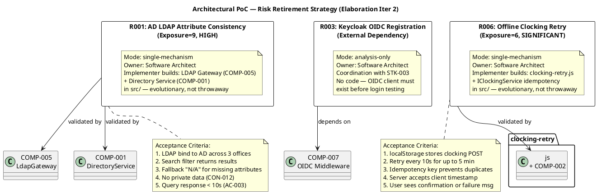

## Document Control

| Field | Value |
|---|---|
| Phase | Elaboration |
| Status | Draft |
| Milestone Target | End of Elaboration (LCA) |
| Iteration | 2 (Cycle 1) |
| Date | 2026-08-28 |
| Owner | Software Architect |
| Trigger | Elaboration phase + at least one technical risk requiring empirical validation (per Risk List) — fired by Development Case |

## Objective and Risks Addressed

This document records the architectural proof-of-concept strategy for retiring the technical risks identified in the Elaboration Risk List. Per the RUP principle that "an architecture that has not been prototyped and tested is a theory, not an architecture," each significant technical risk must be retired through empirical validation or reasoned analysis.

### Risks in Scope

| Risk ID | Description | Exposure | Magnitude | PoC Mode | Owner |
|---|---|---|---|---|---|
| R001 | AD LDAP attribute consistency across 3 offices | 9 | HIGH | single-mechanism | Software Architect |
| R006 | Offline clocking retry via localStorage + POST retry | 6 | SIGNIFICANT | single-mechanism | Software Architect |
| R003 | Keycloak OIDC client registration (external dependency) | — | MODERATE | analysis-only | Software Architect |

### Risks NOT in Scope (No PoC Required)

| Risk ID | Description | Rationale |
|---|---|---|
| R002 | Digital clocking adoption | Non-technical risk — Transition-phase mitigation (user communication, training) |
| R004 | Performance under load | Addressed by architecture (local PostgreSQL, no network hop) — no empirical validation needed at this scale (200 users) |
| R005 | UI design compliance | Addressed by mandatory custom design (CON-011) — UI Designer validates, not an architectural PoC |

## Approach

### R001 — AD LDAP Attribute Consistency (single-mechanism)

**Rationale:** The LDAP Gateway (COMP-005) and Directory Service (COMP-001) are the architectural mechanisms that retire this risk. A single mechanism is clearly correct (ADR-003: LDAP with attribute mapping and fallback), but it must be proven against real AD infrastructure across 3 offices. The Implementer builds the **evolutionary** LDAP Gateway in `src/` — this is production code that becomes the Construction baseline, not throwaway sample code.

**What the Implementer builds:**
- `ILdapGateway` implementation using Novell.Directory.Ldap.NETStandard (4.0.0)
- `IDirectoryService` implementation with attribute mapping and fallback values
- LDAP connection pooling for 3-office AD infrastructure
- Search filter construction for name, department, and office queries

**Acceptance Criteria:**
1. LDAP Gateway successfully binds to AD across all 3 offices
2. Search filter returns results for name, department, and office queries
3. Attribute mapping applies fallback "N/A" for any missing attribute (job title, extension, department, office, email)
4. No private personal data exposed (CON-012) — only corporate attributes returned
5. Query response time under 10 seconds (AC-003)
6. Test must use real AD infrastructure provided by STK-003 (Infrastructure team)

**Dependency:** STK-003 must provide test AD access with representative data from all 3 offices.

### R006 — Offline Clocking Retry (single-mechanism)

**Rationale:** The localStorage + POST retry mechanism (ADR-004) is the architectural mechanism that retires this risk. A single mechanism is clearly correct (no PWA/service worker per CON-002), but the client-side retry behavior and server-side idempotency key handling must be proven by running code. The Implementer builds the **evolutionary** clocking-retry.js and IClockingService idempotency handling in `src/`.

**What the Implementer builds:**
- `clocking-retry.js` on the Clocking Razor Page — stores clock press in localStorage, retries POST every 10s for up to 5 minutes
- `IClockingService.RecordClocking` with idempotency key parameter — server checks unique index on `clockings.idempotency_key`
- PostgreSQL UNIQUE INDEX on `clockings.idempotency_key`
- Client-side timestamp acceptance with server-side validation

**Acceptance Criteria:**
1. Clocking POST stored in localStorage when network is unavailable
2. Automatic retry every 10 seconds for up to 5 minutes
3. Successful POST when network is restored within 5 minutes
4. Idempotency key prevents duplicate records when the same clocking is retried
5. Server accepts client-side timestamp
6. User sees confirmation after successful retry
7. User sees "Clocking failed — contact HR" message if 5 minutes elapse without network recovery

**Dependency:** None — can be tested with simulated network drop/restoration.

### R003 — Keycloak OIDC Registration (analysis-only)

**Rationale:** This risk is retired by reasoning, not by code. Keycloak is already running (CON-004) and the OIDC client registration is a coordination task with STK-003 (Infrastructure team). The portal's OIDC middleware (COMP-007) uses standard ASP.NET Core OpenIdConnect middleware — no custom mechanism to prototype. The risk is that the OIDC client registration does not exist before login testing begins.

**Disposition:**
- STK-003 must register the OIDC client in Keycloak with the portal's redirect URI
- The portal's `Program.cs` configures `AddOpenIdConnect()` with the client ID, authority, and redirect URI
- Role claims are read from the OIDC token — no custom claim mapping needed
- This is a scheduling dependency, not a technical risk requiring a prototype

**Acceptance Criteria:**
1. Keycloak OIDC client registration exists with the portal's redirect URI
2. Portal can redirect to Keycloak login page
3. Portal receives and validates a valid OIDC token after login
4. Role claims (Employee, HR) are extractable from the token

## Results and Findings

### Status as of Elaboration Iteration 2

| Risk | Mode | Status | Evidence |
|---|---|---|---|
| R001 | single-mechanism | **PoC decision recorded** — Implementer to build evolutionary mechanism in src/ | ADR-003 (SAD); UC-009 sequence diagram validates design; acceptance criteria defined |
| R006 | single-mechanism | **PoC decision recorded** — Implementer to build evolutionary mechanism in src/ | ADR-004 (SAD); UC-001 sequence diagram + Process View activity diagram validate design; acceptance criteria defined |
| R003 | analysis-only | **Retired by analysis** — coordination dependency on STK-003 | ADR-005 (SAD); OIDC client registration is a configuration task, not a code mechanism |

### PoC Risk Retirement Diagram

## Architectural Implications

### For the Implementer
- **R001:** Build `LdapGateway` (COMP-005) and `DirectoryService` (COMP-001) as production code in `src/PortalCubaCorp.Infrastructure/` and `src/PortalCubaCorp.Application/` respectively. Use Novell.Directory.Ldap.NETStandard 4.0.0. Test against real AD provided by STK-003.
- **R006:** Build `clocking-retry.js` on the Clocking Razor Page and implement `IClockingService.RecordClocking` with idempotency key handling. Create PostgreSQL UNIQUE INDEX on `clockings.idempotency_key`. Test with simulated network drop/restoration.

### For the Integrator
- R001 and R006 mechanisms are evolutionary — they become the Construction baseline. No throwaway code.
- R003 is a coordination checkpoint — verify STK-003 has registered the OIDC client before integration testing begins.

### For the SAD
- The SAD §PoC Plan section is updated with the per-risk strategy (see SAD update this iteration).
- The SAD status changes from DRAFT to BASELINED once PoC decisions are recorded and interface consistency is verified.

## Traceability

| Element | Traces From | Link Type | Traces To |
|---|---|---|---|
| PoC-R001 | R001 (Risk List), ADR-003, CON-005, CON-009, CON-010, CON-012 | Derives | COMP-005, COMP-001, UC-009 |
| PoC-R006 | R006 (Risk List), ADR-004, AC-005, CON-002 | Derives | COMP-002, clocking-retry.js, UC-001 |
| PoC-R003 | R003 (Risk List), ADR-005, CON-004 | Derives | COMP-007, STK-003 |
| Acceptance Criteria (R001) | AC-003, CON-012 | Refines | PoC-R001 |
| Acceptance Criteria (R006) | AC-005 | Refines | PoC-R006 |