## Document Control

| Field | Value |
|---|---|
| Phase | Elaboration |
| Status | Draft |
| Milestone Target | End of Elaboration |
| Iteration | 1 (Cycle 1) |
| Date | 2026-08-28 |
| Contributors | User-Interface Designer (Boundary Classes and Navigation Map, UI Classes, UI Patterns) |

## Design Overview

> Placeholder — Designer owns this section. Will be populated with design architecture overview, layer mapping, and technology stack alignment in Elaboration.

## Domain Model

> Placeholder — Designer owns this section. Will be populated with domain class diagram and entity relationships.

## Use-Case Realizations

> Placeholder — Designer owns this section. Will be populated with use-case realizations (sequence diagrams, collaboration diagrams) for each UC.

## Design Packages and Classes

### UI View/Controller Classes

> **Contributed by:** User-Interface Designer (Analysis & Design Discipline)
> **Purpose:** UI view classes (Razor Page Models) and controller classes (page handlers) for each UC of UI significance. These define the UI layer structure that the Designer and Implementer must follow. Class-level implementation details (method bodies, DI wiring) belong to the Designer — this section defines the UI interaction structure only.

The following class diagram defines the UI view classes (stereotyped `<<view>>`) and their associated controller/handler classes (stereotyped `<<controller>>`). Each view class maps to a Razor Page and traces to one or more use cases.

```plantuml
@startuml
title Portal Cuba Corp — UI View/Controller Classes

skinparam classAttributeIconSize 0

package "UI Layer (Razor Pages)" {
  class "MainPageModel" as V001 <<view>> {
    + OnGetAsync() : Task
    + ClockingStatus : ClockStatus
    + NewsItems : List<NewsItem>
    + FeaturedNews : List<NewsItem>
  }
  
  class "ClockingPageModel" as V002 <<view>> {
    + OnGetAsync() : Task
    + ClockingHistory : List<ClockingRecord>
  }
  
  class "AllClockingsModel" as V003 <<view>> {
    + OnGetAsync() : Task
    + OnPostExportAsync(month) : FileResult
    + Clockings : List<ClockingRecord>
    + SelectedMonth : DateTime
  }
  
  class "PublishNewsModel" as V004 <<view>> {
    + OnGetAsync() : Task
    + OnPostAsync(newsItem) : ActionResult
    + NewsItem : NewsItem
  }
  
  class "EditNewsModel" as V005 <<view>> {
    + OnGetAsync(id) : Task
    + OnPostAsync(newsItem) : ActionResult
    + NewsItem : NewsItem
  }
  
  class "NewsManagementModel" as V006 <<view>> {
    + OnGetAsync() : Task
    + OnPostUnpublishAsync(id) : ActionResult
    + NewsItems : List<NewsItem>
  }
  
  class "DirectorySearchModel" as V007 <<view>> {
    + OnGetAsync() : Task
    + OnPostAsync(criteria) : ActionResult
    + SearchCriteria : DirectorySearchCriteria
    + Results : List<DirectoryEntry>
  }
  
  class "WorkerCategoryModel" as V008 <<view>> {
    + OnGetAsync() : Task
    + OnPostAsync(userId, category) : ActionResult
    + Assignments : List<WorkerCategory>
  }
}

package "UI Controllers (Page Handlers)" {
  class "ClockingHandler" as C001 <<controller>> {
    + RecordClocking(empId, timestamp, key) : ClockingResult
    + GetClockingStatus(empId) : ClockStatus
    + GetClockingHistory(empId, month) : List
  }
  
  class "NewsHandler" as C002 <<controller>> {
    + PublishNews(item, author) : NewsItem
    + EditNews(id, item, editor) : NewsItem
    + UnpublishNews(id, unpublisher) : void
    + GetPublishedNews() : List
    + GetNewsByCategory(cat) : List
  }
  
  class "DirectoryHandler" as C003 <<controller>> {
    + SearchDirectory(criteria) : List
    + GetEmployeeByADId(userId) : DirectoryEntry
  }
  
  class "CategoryHandler" as C004 <<controller>> {
    + GetCategories() : List
    + AssignCategory(userId, cat, author) : void
    + LookupADUser(userId) : DirectoryEntry
  }
  
  class "ExportHandler" as C005 <<controller>> {
    + GenerateCSV(month) : FileContentResult
  }
}

V001 --> C001 : clocking status
V001 --> C002 : news feed
V002 --> C001 : clocking history
V003 --> C001 : all clockings
V003 --> C005 : CSV export
V004 --> C002 : publish
V005 --> C002 : edit
V006 --> C002 : unpublish + list
V007 --> C003 : directory search
V008 --> C004 : category management

note bottom of V001
  CON-011: Mandatory design
  implements employee-portal-design.html
  Clock button: --accent (in) / --danger (out)
end note

note bottom of C001
  AC-005: offline retry logic
  lives in client-side script
  on MainPage (localStorage)
end note

note bottom of V007
  AC-003: <10s search target
  R001: LDAP attribute risk
  CON-005: read-only LDAP
end note

@enduml
```

**UI View Class Summary:**

| ID | View Class | Razor Page | UC Trace | Controller |
|---|---|---|---|---|
| V001 | MainPageModel | /Index | UC-001, UC-008 | C001, C002 |
| V002 | ClockingPageModel | /MyClockings | UC-002 | C001 |
| V003 | AllClockingsModel | /HR/AllClockings | UC-003, UC-004 | C001, C005 |
| V004 | PublishNewsModel | /HR/PublishNews | UC-005 | C002 |
| V005 | EditNewsModel | /HR/EditNews | UC-006 | C002 |
| V006 | NewsManagementModel | /HR/ManageNews | UC-007 | C002 |
| V007 | DirectorySearchModel | /Directory | UC-009 | C003 |
| V008 | WorkerCategoryModel | /HR/Categories | UC-010 | C004 |

### UI Patterns

> **Contributed by:** User-Interface Designer (Analysis & Design Discipline)
> **Purpose:** Interaction conventions, visual hierarchy, terminology, and accessibility rules that ALL roles (Designer detailing view classes, Implementer building screens, Technical Writer documenting features) must follow. These patterns are derived from the mandatory design (CON-011) and usability requirements (USA-001 through USA-006).

#### Visual Design Tokens (from CON-011)

| Token | Value | Usage |
|---|---|---|
| `--brand-900` | #0B3D5C | Header, strong accents |
| `--brand-700` | #145A82 | Secondary brand |
| `--brand-500` | #1E7FB5 | Primary action, links |
| `--brand-100` | #E3F0F8 | Soft backgrounds, active chips |
| `--accent` | #17A398 | Confirmations, "present" status, Clock In button |
| `--danger` | #C0392B | Clock Out button, errors |
| `--warn` | #E6A817 | Featured news banners, warnings |
| `--ink` | #1B2733 | Primary text |
| `--muted` | #5B6B7A | Secondary text |
| `--line` | #E2E8EE | Borders, dividers |
| `--bg` | #F4F7FA | App background |
| `--surface` | #FFFFFF | Cards |

#### Typography

| Property | Value |
|---|---|
| Font family | "Segoe UI", system-ui, sans-serif |
| Scale | 12 / 14 / 16 / 20 / 28 px |
| Line height | 1.5 |
| Weights | 400 (regular), 600 (semibold for titles) |

#### Interaction Conventions

| Pattern | Rule | Rationale |
|---|---|---|
| Clock button color | Clock In = `--accent` (teal-green); Clock Out = `--danger` (red) | CON-011: mandatory design; immediate visual recognition of state |
| Confirmation messages | Inline toast/banner on same page, not redirect | USA-005: employee clocks without help; no navigation disruption |
| Category filter chips | Horizontal chip bar: [All] [General] [HR] [IT] [Events] | CON-011: design reference; recognition over recall (Nielsen #6) |
| Featured news banner | `--warn` background at top of news feed | CON-011: design reference; visual hierarchy for priority content |
| Directory results | Card-based layout with all corporate fields visible | AC-003: find colleague <10s; no drill-down needed for basic info |
| HR navigation | Dashboard with action buttons, not nested menus | USA-006: HR publishes without technical assistance |
| Unpublish action | Confirmation dialog with "hidden but not deleted" message | CON-013: preserve audit trail; prevent accidental data loss |
| Error states | Inline error message on form, not separate error page | Nielsen #9: help users recover from errors |
| Session timeout | Modal dialog with "Login Again" redirect to Keycloak | Security: no silent session expiry |
| Offline clocking | Button press stored in localStorage, retry indicator shown | AC-005: 5-minute offline tolerance; user sees retry status |

#### Terminology (Consistent Across All Screens)

| Term | Usage | Avoid |
|---|---|---|
| Clock In / Clock Out | Button labels | "Check in", "Punch in" |
| My Clockings | Navigation link | "My attendance", "My records" |
| All Clockings | HR navigation link | "Time tracking", "Attendance log" |
| Publish / Edit / Unpublish | News action verbs | "Create", "Modify", "Delete" (never "delete" — CON-013) |
| Worker Categories | HR navigation link | "Employee types", "Staff classification" |
| Employee Directory | Navigation link | "Phone book", "Contact list" |
| Featured | News flag label | "Pinned", "Highlighted" |

#### Accessibility Rules

| Rule | Source | Application |
|---|---|---|
| Color contrast ≥ 4.5:1 | WCAG 2.1 AA (implied by CON-008 Chrome/Edge) | All text on backgrounds; `--ink` on `--surface` = 12.6:1 ✓ |
| Color is not sole indicator | WCAG 2.1 1.4.1 | Clock In/Out uses text label + color, not color alone |
| Keyboard navigable | WCAG 2.1 2.1.1 | All interactive elements reachable via Tab; Razor Pages server-rendered HTML |
| Form labels associated | WCAG 2.1 3.3.2 | All form inputs have `<label for>` associations |
| Error identification | WCAG 2.1 3.3.1 | Form validation errors displayed inline with field reference |

> **Note:** No explicit accessibility standard (WCAG, EN 301 549, Section 508) was declared by the stakeholder. The above rules follow WCAG 2.1 AA as a baseline best practice for Chrome/Edge compatibility (CON-008). If the stakeholder declares a specific standard, these rules must be updated to match.

## Interface Contracts

> Placeholder — Designer owns this section. Will be populated with service interfaces and API contracts.

## Persistent Data Classes

> Placeholder — Designer owns this section. Will be populated with EF Core entity classes and database schema.

## Boundary Classes and Navigation Map

> **Contributed by:** User-Interface Designer (Analysis & Design Discipline)
> **Purpose:** This section contains the interaction flows (activity diagrams per UC), the Navigation Topology (state machine of all screens), and Salt wireframes for primary screens. These are the user-interface realizations of all use cases — the direct translation of user goals into observable, navigable screen flows.

### Navigation Topology

The following state machine defines ALL screens in the system, their relationships, and the conditions under which transitions fire. Every screen is a node; every user action causing a screen change is a directed edge with a guard condition. This model can be validated for: unreachable screens, dead-end screens, missing error states, and circular navigation traps.

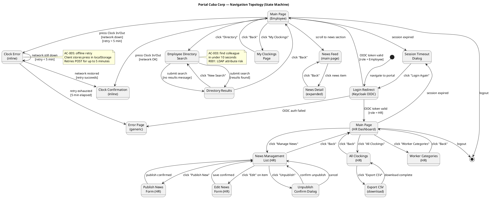

**Navigation completeness verification:**
- ✅ All screens reachable from Login (no orphan screens)
- ✅ No dead-end screens (every screen has a back/exit path)
- ✅ Error states covered: auth failure (ERROR), offline clocking failure (CLOCK_ERR → ERROR), session timeout (TIMEOUT)
- ✅ Terminal states explicit: logout (Employee and HR), session timeout → re-login
- ✅ Guard conditions on all conditional transitions (role-based, network status, retry timeout)

### Interaction Flows (Activity Diagrams per UC)

#### UC-001: Clock In / Clock Out

**Traces to:** FR-001, AC-001, AC-004, AC-005, NFR-002, USA-005
**Screen sequence:** Main Page → Clock Button Press → Confirmation Display

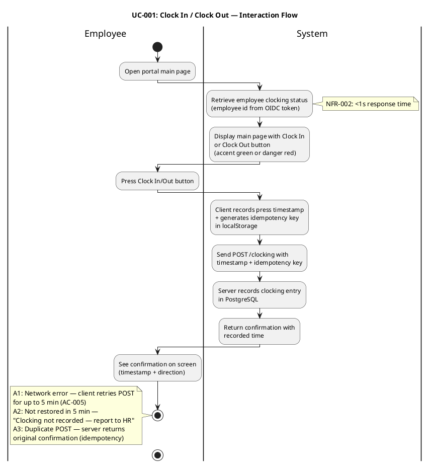

#### UC-002: View Own Clocking History

**Traces to:** FR-002
**Screen sequence:** Main Page → "My Clockings" Page → Clocking History Table

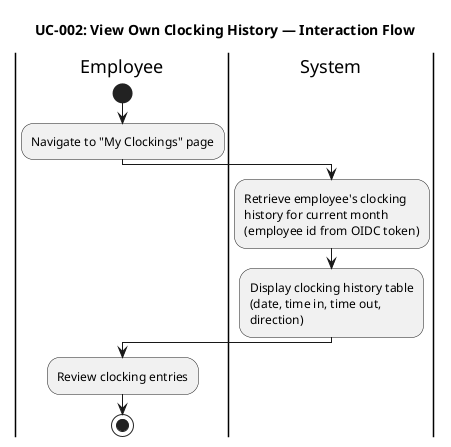

#### UC-003: View All Employee Clockings

**Traces to:** FR-003, CON-005
**Screen sequence:** HR Dashboard → "All Clockings" Page → Clockings Table (with filters)

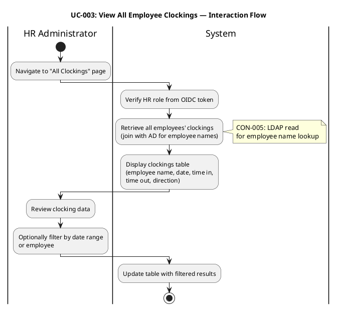

#### UC-004: Export Monthly Clocking Report

**Traces to:** FR-004
**Screen sequence:** HR Dashboard → "All Clockings" Page → Month Selector → CSV Export

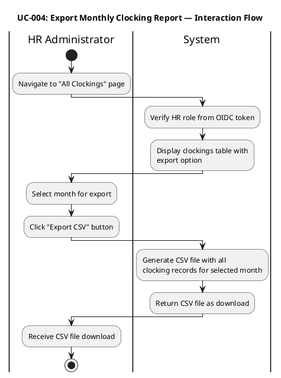

#### UC-005: Publish News

**Traces to:** FR-005, NFR-004, AC-002, USA-006
**Screen sequence:** HR Dashboard → "Publish News" Form → Publication Confirmation

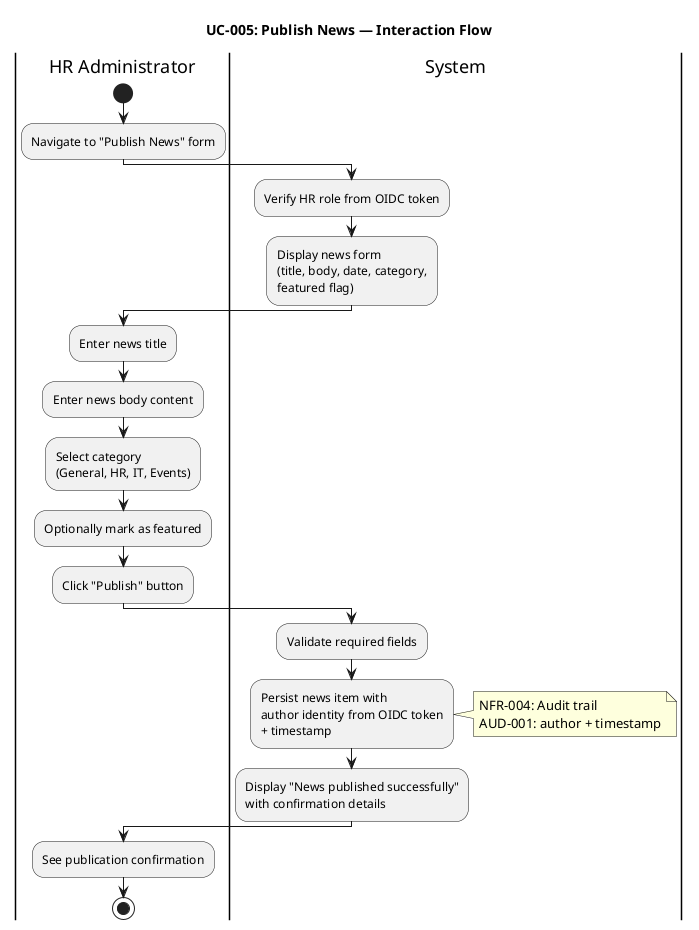

#### UC-006: Edit Published News

**Traces to:** FR-006, NFR-004
**Screen sequence:** HR Dashboard → News Management List → Edit Form → Update Confirmation

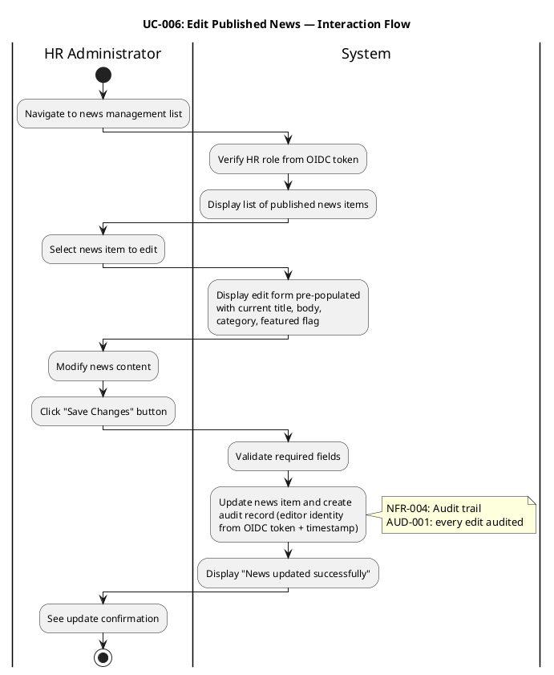

#### UC-007: Unpublish News

**Traces to:** FR-007, CON-013, NFR-004
**Screen sequence:** HR Dashboard → News Management List → Unpublish Confirmation Dialog → Unpublish Confirmation

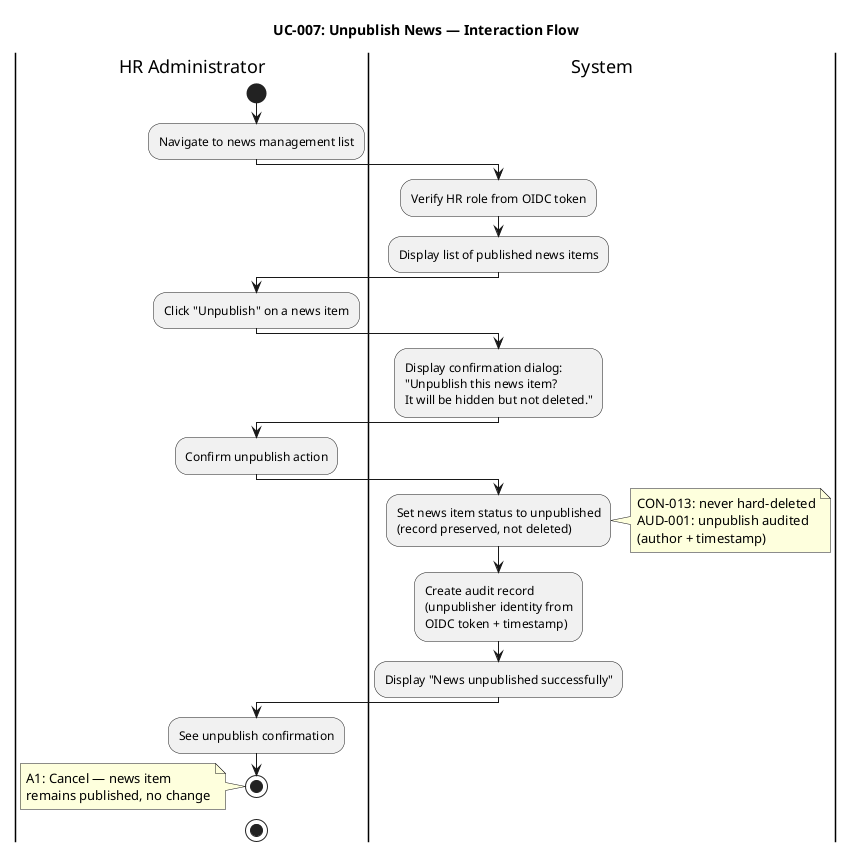

#### UC-008: Read and Filter News

**Traces to:** FR-008, USA-001
**Screen sequence:** Main Page → News Feed (with category filter) → News Detail

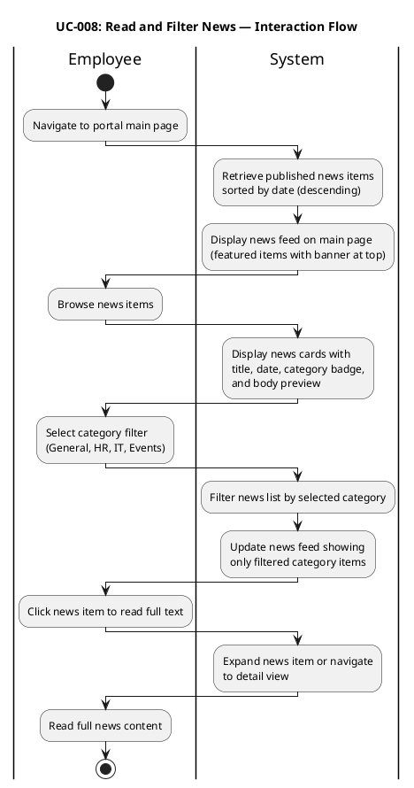

#### UC-009: Search Employee Directory

**Traces to:** FR-009, CON-005, CON-012, R001, AC-003, USA-003
**Screen sequence:** Main Page → Directory Search Form → Search Results → Colleague Detail Card

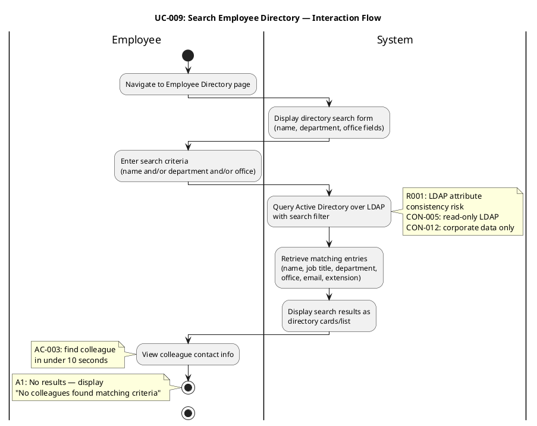

#### UC-010: Manage Worker Category

**Traces to:** FR-010, CON-009, NFR-004
**Screen sequence:** HR Dashboard → "Worker Categories" Page → Employee Search → Category Assignment → Confirmation

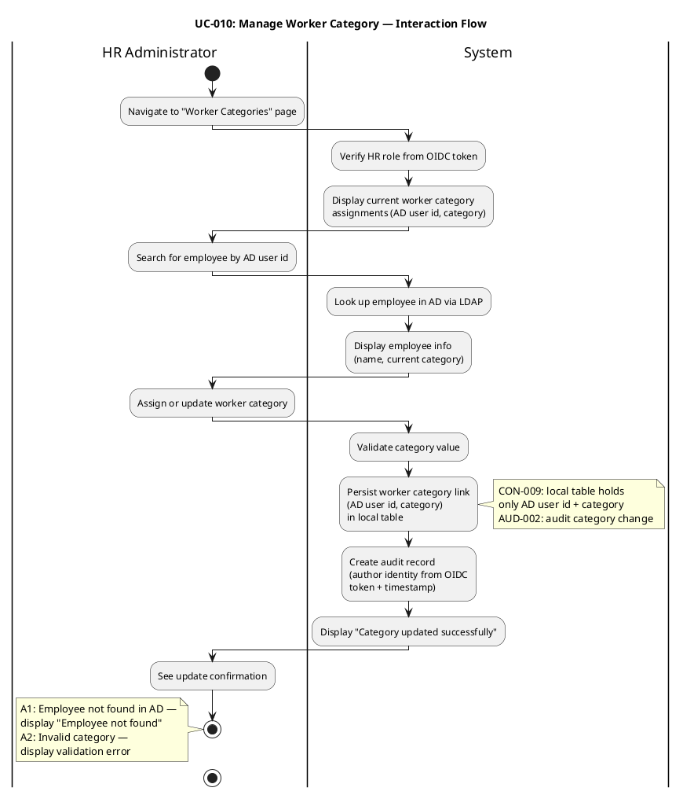

### Wireframes (Primary Screens)

#### Main Page (Employee) — Clock In/Out + News Feed

```plantuml
@startsalt
title Main Page (Employee) — Wireframe
{
  +----------------------------------------------------------+
  |d{"Portal Cuba Corp"                        [Logout] }|
  |  [Clock In]  or  [Clock Out]                             |
  |  Last clocking: 2026-08-28 08:32                         |
  +----------------------------------------------------------+
  |  Featured News                                           |
  |  +------------------------------------------------------+|
  |  | [FEATURED BANNER] Company Picnic Sept 15             ||
  |  | Category: Events | 2026-08-26                        ||
  |  +------------------------------------------------------+|
  |  News Feed                                               |
  |  [All] [General] [HR] [IT] [Events]                    |
  |  +------------------------------------------------------+|
  |  | New HR Policy Update                                 ||
  |  | Category: HR | 2026-08-27                            ||
  |  | Preview of news body text...                         ||
  |  +------------------------------------------------------+|
  |  | Network Maintenance Scheduled                        ||
  |  | Category: IT | 2026-08-25                            ||
  |  | Preview of news body text...                         ||
  |  +------------------------------------------------------+|
  |  [My Clockings]  [Employee Directory]                    |
  +----------------------------------------------------------+
}
@endsalt
```

#### Employee Directory Search

```plantuml
@startsalt
title Employee Directory Search — Wireframe
{
  +----------------------------------------------------------+
  |d{"Portal Cuba Corp"                        [Logout] }|
  |  < Back to Main Page                                     |
  +----------------------------------------------------------+
  |  Employee Directory                                      |
  |  Name: [____________]                                    |
  |  Department: [____________]                              |
  |  Office: [____________]                                  |
  |  [ Search ]                                              |
  +----------------------------------------------------------+
  |  Results (3 found)                                      |
  |  +------------------------------------------------------+|
  |  | Maria Rodriguez                                      ||
  |  | Job Title: Accountant | Dept: Finance               ||
  |  | Office: Havana | Ext: 2201                           ||
  |  | maria.rodriguez@cubacorp.cu                          ||
  |  +------------------------------------------------------+|
  |  | Carlos Perez                                         ||
  |  | Job Title: Developer | Dept: IT                     ||
  |  | Office: Santiago | Ext: 3305                         ||
  |  | carlos.perez@cubacorp.cu                             ||
  |  +------------------------------------------------------+|
  |  | Ana Gomez                                            ||
  |  | Job Title: HR Specialist | Dept: HR                 ||
  |  | Office: Havana | Ext: 2105                           ||
  |  | ana.gomez@cubacorp.cu                                ||
  |  +------------------------------------------------------+|
  +----------------------------------------------------------+
}
@endsalt
```

#### HR Dashboard — All Clockings + News Management

```plantuml
@startsalt
title HR Dashboard — Wireframe
{
  +----------------------------------------------------------+
  |d{"Portal Cuba Corp"            [HR Admin] [Logout] }   |
  +----------------------------------------------------------+
  |  HR Dashboard                                            |
  |  [All Clockings]  [Manage News]  [Worker Categories]    |
  +----------------------------------------------------------+
  |  All Clockings                                           |
  |  Month: [August 2026 v]  [Export CSV]                   |
  |  +------------------------------------------------------+|
  |  |Employee    | Date    | Time In | Time Out | Direction||
  |  |M. Rodriguez| 08/28   | 08:32   | ---      | In      ||
  |  |C. Perez    | 08/28   | 08:45   | ---      | In      ||
  |  |A. Gomez    | 08/27   | 08:30   | 17:15    | In/Out  ||
  |  +------------------------------------------------------+|
  +----------------------------------------------------------+
  |  Manage News                                             |
  |  [Publish New]                                           |
  |  +------------------------------------------------------+|
  |  |Title              | Category | Date    | Actions     ||
  |  |Company Picnic     | Events   | 08/26   |[Edit][Unpub]||
  |  |HR Policy Update   | HR       | 08/27   |[Edit][Unpub]||
  |  |Network Maint.     | IT       | 08/25   |[Edit][Unpub]||
  |  +------------------------------------------------------+|
  +----------------------------------------------------------+
}
@endsalt
```

## Capsules, Protocols and Signals

> Placeholder — Designer owns this section. Not applicable for Razor Pages architecture (no capsules/signals in this technology stack).

## Traceability

| Element | Traces From | Link Type | Traces To |
|---|---|---|---|
| V001 (MainPageModel) | UC-001, UC-008, CON-011 | Derives | C001, C002 |
| V002 (ClockingPageModel) | UC-002 | Derives | C001 |
| V003 (AllClockingsModel) | UC-003, UC-004 | Derives | C001, C005 |
| V004 (PublishNewsModel) | UC-005, AC-002 | Derives | C002 |
| V005 (EditNewsModel) | UC-006 | Derives | C002 |
| V006 (NewsManagementModel) | UC-007, CON-013 | Derives | C002 |
| V007 (DirectorySearchModel) | UC-009, AC-003, R001 | Derives | C003 |
| V008 (WorkerCategoryModel) | UC-010, CON-009 | Derives | C004 |
| C001 (ClockingHandler) | UC-001, UC-002, UC-003, NFR-002 | Derives | COMP-002 (SAD) |
| C002 (NewsHandler) | UC-005, UC-006, UC-007, NFR-004 | Derives | COMP-003 (SAD) |
| C003 (DirectoryHandler) | UC-009, CON-005, R001 | Derives | COMP-005 (SAD) |
| C004 (CategoryHandler) | UC-010, CON-009, NFR-004 | Derives | COMP-005 (SAD) |
| C005 (ExportHandler) | UC-004 | Derives | COMP-002 (SAD) |
| Navigation Topology | All UCs, CON-011 | Derives | V001–V008 |
| UI Patterns | CON-011, USA-001–USA-006 | Refines | V001–V008, Implementer |
| Wireframes | CON-011, All UCs | Derives | V001–V008 |