## Document Control

| Field | Value |
|---|---|
| Phase | Elaboration |
| Status | Draft |
| Milestone Target | End of Elaboration |
| Iteration | 1 (Cycle 1) |
| Date | 2026-08-28 |
| Contributors | User-Interface Designer (Boundary Classes and Navigation Map, UI Classes, UI Patterns) |

## Design Overview
| Field | Value |
|---|---|
| Phase | Elaboration |
| Status | Draft |
| Milestone Target | End of Elaboration (LCA) |
| Iteration | 1 (Cycle 1) |
| Date | 2026-08-28 |
| Contributors | Designer (Analysis Classes, Use-Case Realizations, Design Classes, Interface Contracts, State Machines); User-Interface Designer (UI View/Controller Classes, UI Patterns, Boundary Classes and Navigation Map) |

### Technology Stack Alignment

| Layer | Technology | Constraint | Design Mechanism |
|---|---|---|---|
| Presentation | Razor Pages (.NET 10) | CON-002 | Server-rendered HTML; no SPA; clocking-retry.js for offline retry only |
| Application Services | .NET 10 REST API | CON-001 | DI-injected services implementing component interfaces |
| Persistence | EF Core + PostgreSQL | CON-003 | Repository pattern via IPersistence; EF Core DbContext |
| Authentication | Keycloak OIDC client | CON-004 | OIDC middleware pipeline; role claims from token |
| Directory | AD over LDAP (Novell.Directory.Ldap) | CON-005, CON-009 | Read-only LDAP gateway; no local copy of employee data |
| Hosting | Internal Windows Server | CON-006, CON-007 | Single-server deployment; intranet-only |

### Layer Mapping

The design follows a three-layer architecture as defined in the SAD Logical View:

| Layer | Package | Design Classes | Interfaces |
|---|---|---|---|
| Presentation | Portal.UI | MainPageModel, ClockingPageModel, AllClockingsModel, PublishNewsModel, EditNewsModel, NewsManagementModel, DirectorySearchModel, WorkerCategoryModel | (Razor Page Models — see UI View/Controller Classes section) |
| Application Services | Portal.Services | ClockingService, NewsService, DirectoryService, WorkerCategoryService, AuditInterceptor | IClockingService, INewsService, IDirectoryService, IWorkerCategoryService, IAuditLogger |
| Infrastructure | Portal.Infrastructure | LdapGateway, PersistenceGateway, ClockingRepository, NewsRepository, CategoryRepository, AuditRepository | ILdapGateway, IPersistence |

### Design Mechanism Resolution (Three-Level Chain)

| Analysis Mechanism | Design Mechanism (Pattern + Properties) | Implementation Mechanism | Component |
|---|---|---|---|
| Persistence | Repository + Unit of Work via EF Core DbContext; transactional, with unique index on clockings.idempotency_key | EF Core 10 + Npgsql (PostgreSQL) | COMP-006 |
| LDAP Directory Access | Gateway pattern; read-only; connection pooling; attribute mapping with fallback for missing fields (R001) | Novell.Directory.Ldap.NETStandard | COMP-005 |
| Authentication | OIDC client; token validation; role extraction from claims; no local user store | Keycloak (existing) + ASP.NET Core OIDC middleware | COMP-007 |
| Audit Trail | Interceptor pattern; append-only; same DB transaction as business operation; author from OIDC token | EF Core SaveInterceptor + audit_records table | COMP-008 |
| Offline Retry | Client-side localStorage + POST retry with idempotency key; 5-min window; server accepts client timestamp | clocking-retry.js + IClockingService idempotencyKey param | COMP-002 |
| CSV Export | Streaming response; HR-only; date-range filtered | IClockingService.ExportCsv returns Stream → Razor Page writes to Response.Body | COMP-002 |
## Domain Model
Analysis classes identify the boundary, control, and entity stereotypes for each architecturally significant use case. These are the bridge from the Use-Case Model to design classes — each analysis class will be refined into one or more design classes in the Design Packages and Classes section.

### Analysis Class Catalog

| ID | Name | Stereotype | UC | Responsibility | SAD Component |
|---|---|---|---|---|---|
| ACL-001 | ClockingUI | <<boundary>> | UC-001 | Display clock in/out button; capture timestamp; show confirmation; manage localStorage retry | COMP-002 |
| ACL-002 | ClockingController | <<control>> | UC-001, UC-002, UC-003, UC-004 | Record clocking with idempotency; get current status; get history; get all clockings; export CSV | COMP-002 |
| ACL-003 | ClockingRecord | <<entity>> | UC-001 | Persist clocking entry: employeeId, timestamp, clockType, idempotencyKey | COMP-006 |
| ACL-004 | DirectorySearchUI | <<boundary>> | UC-009 | Display search form; display results; warn about missing AD attributes | COMP-001 |
| ACL-005 | DirectoryController | <<control>> | UC-009 | Search AD via LDAP; map LDAP attributes to DirectoryEntry; handle missing attributes (R001) | COMP-001, COMP-005 |
| ACL-006 | DirectoryEntry | <<entity>> | UC-009 | Value object: name, jobTitle, department, office, email, extension — projected from AD at read time | COMP-005 |
| ACL-007 | NewsUI | <<boundary>> | UC-005, UC-006, UC-007 | Display publish/edit forms; display news list; confirm unpublish | COMP-003 |
| ACL-008 | NewsController | <<control>> | UC-005, UC-006, UC-007 | Publish, edit, unpublish news; integrate audit trail; list published and all | COMP-003, COMP-008 |
| ACL-009 | NewsItem | <<entity>> | UC-005, UC-006, UC-007, UC-008 | News content: title, body, category, status, createdBy, createdAt, isFeatured | COMP-006 |
| ACL-010 | AuditRecord | <<entity>> | UC-005, UC-006, UC-007, UC-010 | Append-only audit: entityType, entityId, action, author, timestamp | COMP-008 |
| ACL-011 | CategoryUI | <<boundary>> | UC-010 | Display category list; display assign form; show confirmation | COMP-004 |
| ACL-012 | CategoryController | <<control>> | UC-010 | Assign category; list categories; lookup AD user | COMP-004, COMP-005 |
| ACL-013 | WorkerCategory | <<entity>> | UC-010 | AD user id → category link (two columns, nothing else) | COMP-006 |
| ACL-014 | NewsFeedUI | <<boundary>> | UC-008 | Display news feed; filter by category; display featured banners | COMP-003 |
| ACL-015 | NewsFeedController | <<control>> | UC-008 | Get published news; get featured news | COMP-003 |

### Analysis Class Diagram


```plantuml
@startuml
title Portal Cuba Corp — Analysis Classes (Elaboration)

skinparam classAttributeIconSize 0
skinparam packageStyle rectangle

package "UC-001: Clock In / Clock Out" {
  class "ClockingUI" as ACL001 <<boundary>> {
    + displayClockButton(status)
    + captureTimestamp()
    + showConfirmation(record)
    + storeLocalForRetry(data)
    + retryPost()
  }
  class "ClockingController" as ACL002 <<control>> {
    + recordClocking(empId, timestamp, type, idempotencyKey)
    + getCurrentStatus(empId)
    + getHistory(empId, month)
    + getAllClockings(month)
    + exportCsv(month)
  }
  class "ClockingRecord" as ACL003 <<entity>> {
    + employeeId : string
    + timestamp : DateTime
    + clockType : ClockType
    + idempotencyKey : string
  }
}

package "UC-009: Search Employee Directory" {
  class "DirectorySearchUI" as ACL004 <<boundary>> {
    + displaySearchForm()
    + displayResults(entries)
    + displayMissingAttrWarning()
  }
  class "DirectoryController" as ACL005 <<control>> {
    + search(query) : List<DirectoryEntry>
    + mapLdapAttributes(entry) : DirectoryEntry
  }
  class "DirectoryEntry" as ACL006 <<entity>> {
    + name : string
    + jobTitle : string
    + department : string
    + office : string
    + email : string
    + extension : string
  }
}

package "UC-005/006/007: News Lifecycle" {
  class "NewsUI" as ACL007 <<boundary>> {
    + displayPublishForm()
    + displayEditForm(item)
    + displayNewsList(items)
    + confirmUnpublish(id)
  }
  class "NewsController" as ACL008 <<control>> {
    + publish(title, body, category, authorId)
    + edit(id, title, body, category, authorId)
    + unpublish(id, authorId)
    + listPublished()
    + listAll()
  }
  class "NewsItem" as ACL009 <<entity>> {
    + id : Guid
    + title : string
    + body : string
    + category : NewsCategory
    + status : NewsStatus
    + createdBy : string
    + createdAt : DateTime
    + isFeatured : bool
  }
  class "AuditRecord" as ACL010 <<entity>> {
    + entityType : string
    + entityId : Guid
    + action : AuditAction
    + author : string
    + timestamp : DateTime
  }
}

package "UC-010: Manage Worker Category" {
  class "CategoryUI" as ACL011 <<boundary>> {
    + displayCategoryList()
    + displayAssignForm()
    + showConfirmation()
  }
  class "CategoryController" as ACL012 <<control>> {
    + assignCategory(adUserId, category, authorId)
    + listCategories()
    + lookupAdUser(query)
  }
  class "WorkerCategory" as ACL013 <<entity>> {
    + adUserId : string
    + category : string
  }
}

package "UC-008: Read and Filter News" {
  class "NewsFeedUI" as ACL014 <<boundary>> {
    + displayNewsFeed(items)
    + filterByCategory(cat)
    + displayFeatured(items)
  }
  class "NewsFeedController" as ACL015 <<control>> {
    + getPublishedNews(category?)
    + getFeaturedNews()
  }
}

ACL001 --> ACL002
ACL002 --> ACL003
ACL004 --> ACL005
ACL005 --> ACL006
ACL007 --> ACL008
ACL008 --> ACL009
ACL008 --> ACL010
ACL011 --> ACL012
ACL012 --> ACL013
ACL014 --> ACL015
ACL015 --> ACL009

note right of ACL005
  R001: LDAP attribute
  consistency risk —
  fallback to "N/A" for
  missing fields
end note

note right of ACL002
  AC-005: offline retry
  via localStorage +
  idempotency key
  NFR-002: <1s response
end note

note right of ACL008
  NFR-004: audit trail
  for publish/edit/unpublish
  AuditRecord is append-only
end note

@enduml
```

### Design Mechanism Resolution Summary

Each analysis mechanism from Inception is resolved to a design mechanism (pattern + properties). Implementation mechanisms are specified only where the stakeholder declared the technology.

| Analysis Mechanism | Design Mechanism | Properties | Implementation (where declared) |
|---|---|---|---|
| Persistence | Repository + Unit of Work (EF Core DbContext) | Transactional; unique index on clockings.idempotency_key; append-only audit_records | EF Core 10 + Npgsql (CON-001, CON-003) |
| LDAP Directory Access | Gateway (read-only) | Connection pooling; attribute mapping with fallback; no writes to AD | Novell.Directory.Ldap.NETStandard (CON-005) |
| Authentication | OIDC Client | Token validation; role extraction from claims; no local user store | Keycloak existing (CON-004) |
| Audit Trail | Interceptor (same transaction) | Append-only; author from OIDC token; timestamp from server; never hard-delete news | EF Core SaveInterceptor (CON-001) |
| Offline Retry | localStorage + POST Retry | 5-min window; idempotency key prevents duplicates; server accepts client timestamp; clocking only | clocking-retry.js (CON-002) |
| CSV Export | Streaming Response | HR-only; date-range filtered; streaming to Response.Body | .NET 10 FileStreamResult (CON-001) |
## Use-Case Realizations
Each architecturally significant use case is realized as a collaboration of design objects. Sequence diagrams show the message flow between boundary (UI), control (service), and entity (repository) objects for each UC's main flow and key alternative flows.

### Realization Index

| UC ID | UC Name | Priority | Seq ID | Key Risks/NFRs |
|---|---|---|---|---|
| UC-001 | Clock In / Clock Out | 2 | SEQ-001 | AC-005 offline retry, NFR-002 <1s |
| UC-002 | View Own Clocking History | 6 | SEQ-002 | — |
| UC-003 | View All Employee Clockings | 7 | SEQ-003 | LDAP name resolution (CON-009) |
| UC-004 | Export Monthly Clocking Report | 5 | SEQ-004 | PERF-004 streaming CSV |
| UC-005 | Publish News | 3 | SEQ-005 | NFR-004 audit trail |
| UC-006 | Edit Published News | 8 | SEQ-006 | NFR-004 audit trail |
| UC-007 | Unpublish News | 9 | SEQ-007 | CON-013 no hard delete |
| UC-008 | Read and Filter News | 10 | SEQ-008 | — |
| UC-009 | Search Employee Directory | 1 | SEQ-009 | R001 LDAP attribute risk |
| UC-010 | Manage Worker Category | 4 | SEQ-010 | Bridges DB + LDAP, NFR-004 audit |

### SEQ-001: UC-001 — Clock In / Clock Out

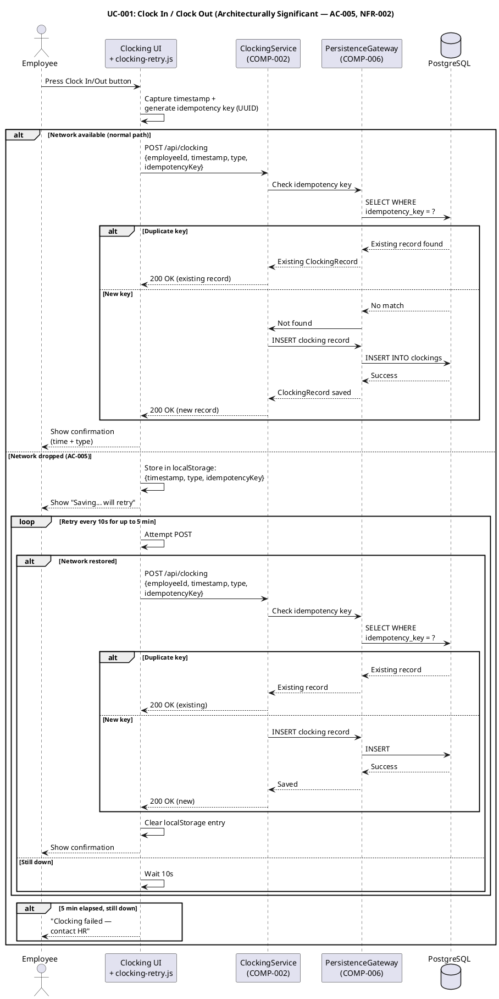
```plantuml
@startuml
title UC-001: Clock In / Clock Out (Architecturally Significant — AC-005, NFR-002)

actor Employee as EMP
participant "Clocking UI\n+ clocking-retry.js" as UI
participant "ClockingService\n(COMP-002)" as SVC
participant "PersistenceGateway\n(COMP-006)" as DB
database "PostgreSQL" as PG

EMP -> UI : Press Clock In/Out button
UI -> UI : Capture timestamp +\ngenerate idempotency key (UUID)

alt Network available (normal path)
  UI -> SVC : POST /api/clocking\n{employeeId, timestamp, type,\nidempotencyKey}
  SVC -> DB : Check idempotency key
  DB -> PG : SELECT WHERE\nidempotency_key = ?
  
  alt Duplicate key
    PG --> DB : Existing record found
    DB --> SVC : Existing ClockingRecord
    SVC --> UI : 200 OK (existing record)
  else New key
    PG --> DB : No match
    DB -> SVC : Not found
    SVC -> DB : INSERT clocking record
    DB -> PG : INSERT INTO clockings
    PG --> DB : Success
    DB --> SVC : ClockingRecord saved
    SVC --> UI : 200 OK (new record)
  end
  
  UI --> EMP : Show confirmation\n(time + type)
else Network dropped (AC-005)
  UI -> UI : Store in localStorage:\n{timestamp, type, idempotencyKey}
  UI --> EMP : Show "Saving... will retry"
  
  loop Retry every 10s for up to 5 min
    UI -> UI : Attempt POST
    alt Network restored
      UI -> SVC : POST /api/clocking\n{employeeId, timestamp, type,\nidempotencyKey}
      SVC -> DB : Check idempotency key
      DB -> PG : SELECT WHERE\nidempotency_key = ?
      alt Duplicate key
        PG --> DB : Existing record
        DB --> SVC : Existing record
        SVC --> UI : 200 OK (existing)
      else New key
        SVC -> DB : INSERT clocking record
        DB -> PG : INSERT
        PG --> DB : Success
        DB --> SVC : Saved
        SVC --> UI : 200 OK (new)
      end
      UI -> UI : Clear localStorage entry
      UI --> EMP : Show confirmation
    else Still down
      UI -> UI : Wait 10s
    end
  end
  
  alt 5 min elapsed, still down
    UI --> EMP : "Clocking failed —\ncontact HR"
  end
end

@enduml
```

### SEQ-002: UC-002 — View Own Clocking History

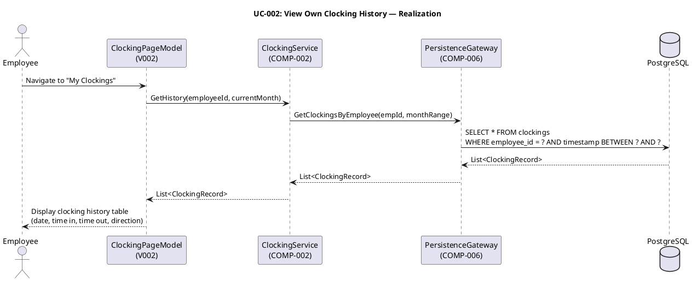
```plantuml
@startuml
title UC-002: View Own Clocking History — Realization

actor Employee as EMP
participant "ClockingPageModel\n(V002)" as UI
participant "ClockingService\n(COMP-002)" as SVC
participant "PersistenceGateway\n(COMP-006)" as DB
database "PostgreSQL" as PG

EMP -> UI : Navigate to "My Clockings"
UI -> SVC : GetHistory(employeeId, currentMonth)
SVC -> DB : GetClockingsByEmployee(empId, monthRange)
DB -> PG : SELECT * FROM clockings\nWHERE employee_id = ? AND timestamp BETWEEN ? AND ?
PG --> DB : List<ClockingRecord>
DB --> SVC : List<ClockingRecord>
SVC --> UI : List<ClockingRecord>
UI --> EMP : Display clocking history table\n(date, time in, time out, direction)

@enduml
```

### SEQ-003: UC-003 — View All Employee Clockings (HR Only)

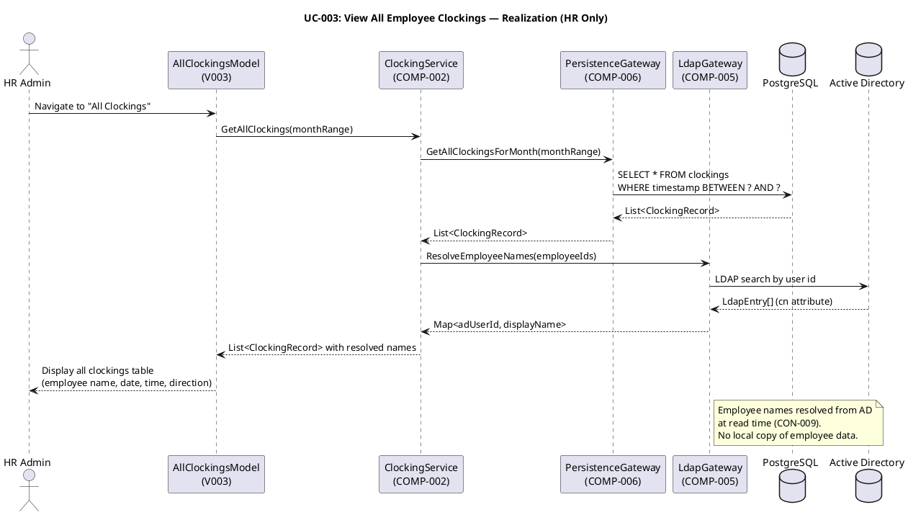
```plantuml
@startuml
title UC-003: View All Employee Clockings — Realization (HR Only)

actor "HR Admin" as HR
participant "AllClockingsModel\n(V003)" as UI
participant "ClockingService\n(COMP-002)" as SVC
participant "PersistenceGateway\n(COMP-006)" as DB
participant "LdapGateway\n(COMP-005)" as LDAP
database "PostgreSQL" as PG
database "Active Directory" as AD

HR -> UI : Navigate to "All Clockings"
UI -> SVC : GetAllClockings(monthRange)
SVC -> DB : GetAllClockingsForMonth(monthRange)
DB -> PG : SELECT * FROM clockings\nWHERE timestamp BETWEEN ? AND ?
PG --> DB : List<ClockingRecord>
DB --> SVC : List<ClockingRecord>

SVC -> LDAP : ResolveEmployeeNames(employeeIds)
LDAP -> AD : LDAP search by user id
AD --> LDAP : LdapEntry[] (cn attribute)
LDAP --> SVC : Map<adUserId, displayName>

SVC --> UI : List<ClockingRecord> with resolved names
UI --> HR : Display all clockings table\n(employee name, date, time, direction)

note right of LDAP
  Employee names resolved from AD
  at read time (CON-009).
  No local copy of employee data.
end note

@enduml
```

### SEQ-004: UC-004 — Export Monthly Clocking Report (CSV)

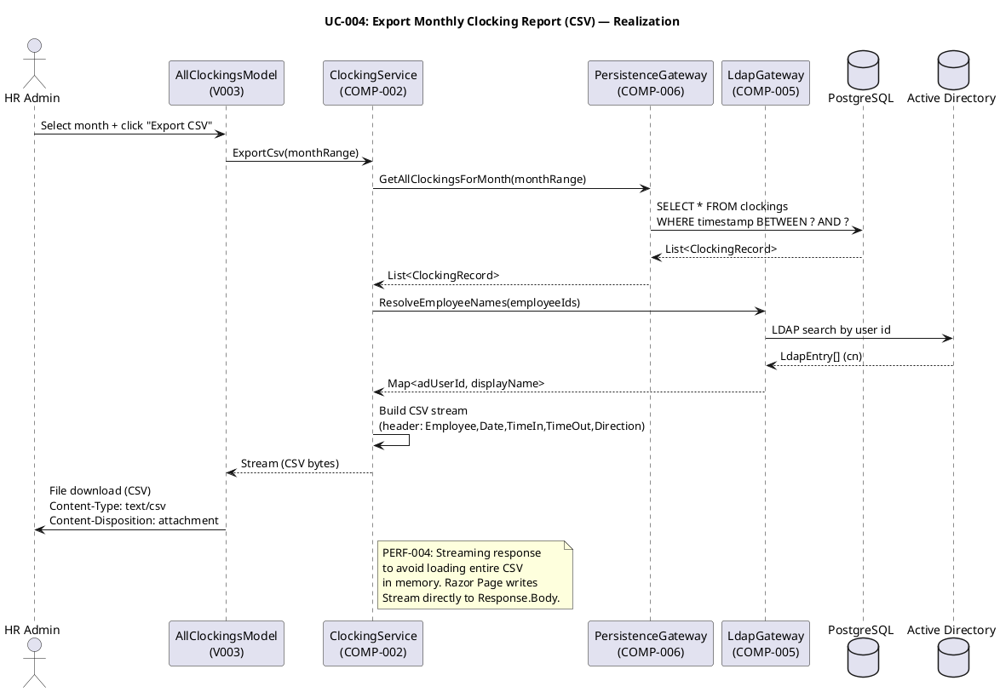
```plantuml
@startuml
title UC-004: Export Monthly Clocking Report (CSV) — Realization

actor "HR Admin" as HR
participant "AllClockingsModel\n(V003)" as UI
participant "ClockingService\n(COMP-002)" as SVC
participant "PersistenceGateway\n(COMP-006)" as DB
participant "LdapGateway\n(COMP-005)" as LDAP
database "PostgreSQL" as PG
database "Active Directory" as AD

HR -> UI : Select month + click "Export CSV"
UI -> SVC : ExportCsv(monthRange)
SVC -> DB : GetAllClockingsForMonth(monthRange)
DB -> PG : SELECT * FROM clockings\nWHERE timestamp BETWEEN ? AND ?
PG --> DB : List<ClockingRecord>
DB --> SVC : List<ClockingRecord>

SVC -> LDAP : ResolveEmployeeNames(employeeIds)
LDAP -> AD : LDAP search by user id
AD --> LDAP : LdapEntry[] (cn)
LDAP --> SVC : Map<adUserId, displayName>

SVC -> SVC : Build CSV stream\n(header: Employee,Date,TimeIn,TimeOut,Direction)
SVC --> UI : Stream (CSV bytes)
UI -> HR : File download (CSV)\nContent-Type: text/csv\nContent-Disposition: attachment

note right of SVC
  PERF-004: Streaming response
  to avoid loading entire CSV
  in memory. Razor Page writes
  Stream directly to Response.Body.
end note

@enduml
```

### SEQ-005: UC-005 — Publish News

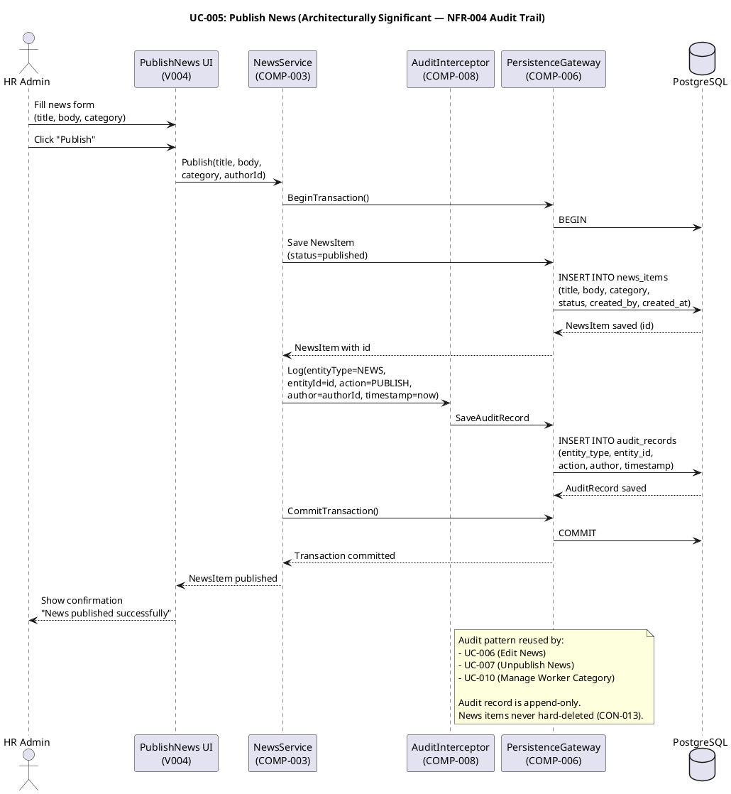
```plantuml
@startuml
title UC-005: Publish News (Architecturally Significant — NFR-004 Audit Trail)

actor "HR Admin" as HR
participant "PublishNews UI\n(V004)" as UI
participant "NewsService\n(COMP-003)" as SVC
participant "AuditInterceptor\n(COMP-008)" as AUDIT
participant "PersistenceGateway\n(COMP-006)" as DB
database "PostgreSQL" as PG

HR -> UI : Fill news form\n(title, body, category)
HR -> UI : Click "Publish"
UI -> SVC : Publish(title, body,\ncategory, authorId)

SVC -> DB : BeginTransaction()
DB -> PG : BEGIN

SVC -> DB : Save NewsItem\n(status=published)
DB -> PG : INSERT INTO news_items\n(title, body, category,\nstatus, created_by, created_at)
PG --> DB : NewsItem saved (id)
DB --> SVC : NewsItem with id

SVC -> AUDIT : Log(entityType=NEWS,\nentityId=id, action=PUBLISH,\nauthor=authorId, timestamp=now)
AUDIT -> DB : SaveAuditRecord
DB -> PG : INSERT INTO audit_records\n(entity_type, entity_id,\naction, author, timestamp)
PG --> DB : AuditRecord saved

SVC -> DB : CommitTransaction()
DB -> PG : COMMIT
DB --> SVC : Transaction committed

SVC --> UI : NewsItem published
UI --> HR : Show confirmation\n"News published successfully"

note right of AUDIT
  Audit pattern reused by:
  - UC-006 (Edit News)
  - UC-007 (Unpublish News)
  - UC-010 (Manage Worker Category)
  
  Audit record is append-only.
  News items never hard-deleted (CON-013).
end note

@enduml
```

### SEQ-006: UC-006 — Edit Published News

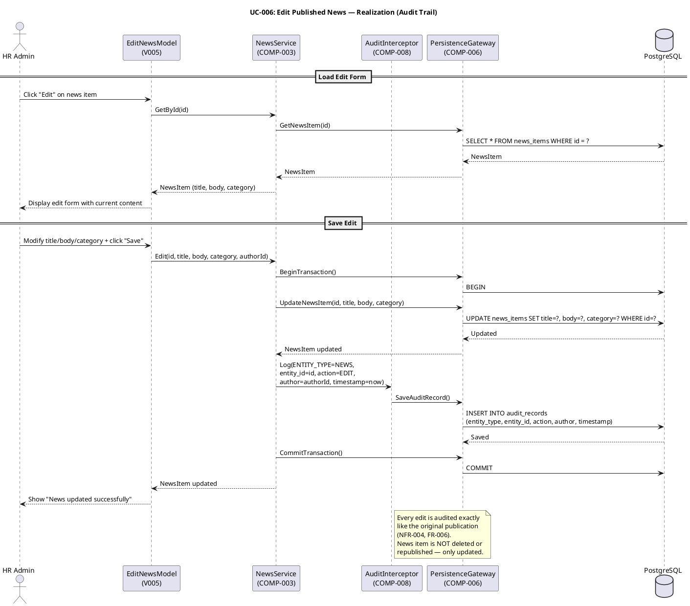
```plantuml
@startuml
title UC-006: Edit Published News — Realization (Audit Trail)

actor "HR Admin" as HR
participant "EditNewsModel\n(V005)" as UI
participant "NewsService\n(COMP-003)" as SVC
participant "AuditInterceptor\n(COMP-008)" as AUDIT
participant "PersistenceGateway\n(COMP-006)" as DB
database "PostgreSQL" as PG

== Load Edit Form ==
HR -> UI : Click "Edit" on news item
UI -> SVC : GetById(id)
SVC -> DB : GetNewsItem(id)
DB -> PG : SELECT * FROM news_items WHERE id = ?
PG --> DB : NewsItem
DB --> SVC : NewsItem
SVC --> UI : NewsItem (title, body, category)
UI --> HR : Display edit form with current content

== Save Edit ==
HR -> UI : Modify title/body/category + click "Save"
UI -> SVC : Edit(id, title, body, category, authorId)

SVC -> DB : BeginTransaction()
DB -> PG : BEGIN

SVC -> DB : UpdateNewsItem(id, title, body, category)
DB -> PG : UPDATE news_items SET title=?, body=?, category=? WHERE id=?
PG --> DB : Updated
DB --> SVC : NewsItem updated

SVC -> AUDIT : Log(ENTITY_TYPE=NEWS,\nentity_id=id, action=EDIT,\nauthor=authorId, timestamp=now)
AUDIT -> DB : SaveAuditRecord()
DB -> PG : INSERT INTO audit_records\n(entity_type, entity_id, action, author, timestamp)
PG --> DB : Saved

SVC -> DB : CommitTransaction()
DB -> PG : COMMIT

SVC --> UI : NewsItem updated
UI --> HR : Show "News updated successfully"

note right of AUDIT
  Every edit is audited exactly
  like the original publication
  (NFR-004, FR-006).
  News item is NOT deleted or
  republished — only updated.
end note

@enduml
```

### SEQ-007: UC-007 — Unpublish News (Soft Delete + Audit)

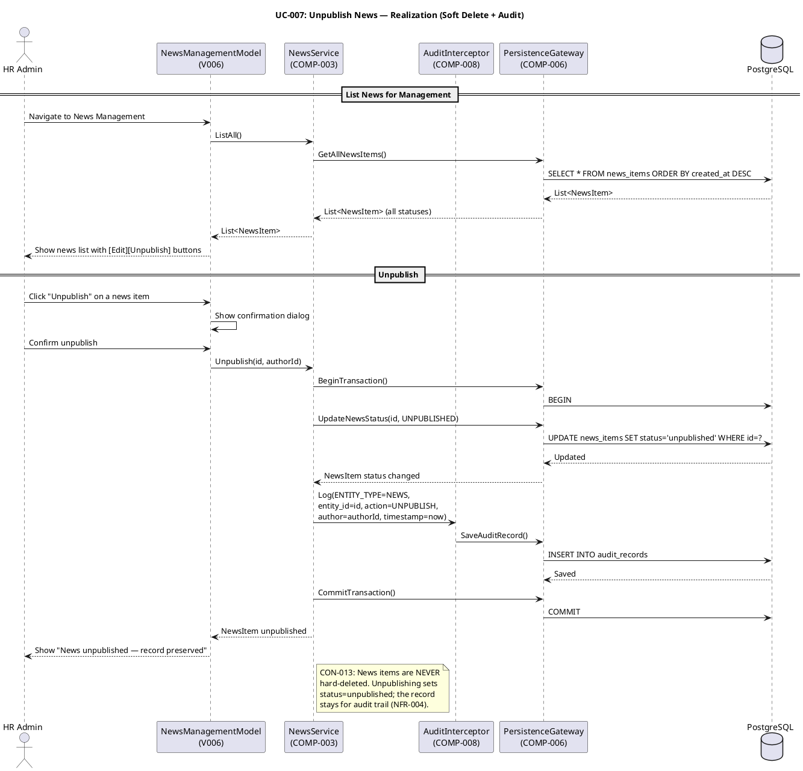
```plantuml
@startuml
title UC-007: Unpublish News — Realization (Soft Delete + Audit)

actor "HR Admin" as HR
participant "NewsManagementModel\n(V006)" as UI
participant "NewsService\n(COMP-003)" as SVC
participant "AuditInterceptor\n(COMP-008)" as AUDIT
participant "PersistenceGateway\n(COMP-006)" as DB
database "PostgreSQL" as PG

== List News for Management ==
HR -> UI : Navigate to News Management
UI -> SVC : ListAll()
SVC -> DB : GetAllNewsItems()
DB -> PG : SELECT * FROM news_items ORDER BY created_at DESC
PG --> DB : List<NewsItem>
DB --> SVC : List<NewsItem> (all statuses)
SVC --> UI : List<NewsItem>
UI --> HR : Show news list with [Edit][Unpublish] buttons

== Unpublish ==
HR -> UI : Click "Unpublish" on a news item
UI -> UI : Show confirmation dialog
HR -> UI : Confirm unpublish
UI -> SVC : Unpublish(id, authorId)

SVC -> DB : BeginTransaction()
DB -> PG : BEGIN

SVC -> DB : UpdateNewsStatus(id, UNPUBLISHED)
DB -> PG : UPDATE news_items SET status='unpublished' WHERE id=?
PG --> DB : Updated
DB --> SVC : NewsItem status changed

SVC -> AUDIT : Log(ENTITY_TYPE=NEWS,\nentity_id=id, action=UNPUBLISH,\nauthor=authorId, timestamp=now)
AUDIT -> DB : SaveAuditRecord()
DB -> PG : INSERT INTO audit_records
PG --> DB : Saved

SVC -> DB : CommitTransaction()
DB -> PG : COMMIT

SVC --> UI : NewsItem unpublished
UI --> HR : Show "News unpublished — record preserved"

note right of SVC
  CON-013: News items are NEVER
  hard-deleted. Unpublishing sets
  status=unpublished; the record
  stays for audit trail (NFR-004).
end note

@enduml
```

### SEQ-008: UC-008 — Read and Filter News

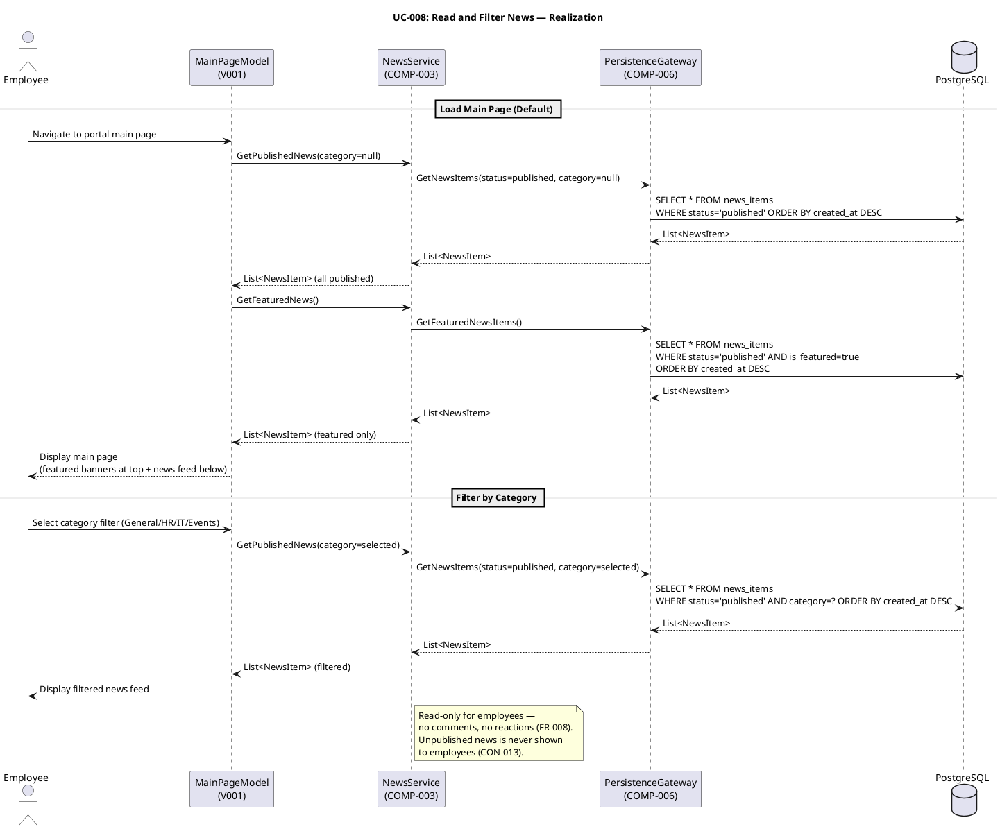
```plantuml
@startuml
title UC-008: Read and Filter News — Realization

actor Employee as EMP
participant "MainPageModel\n(V001)" as UI
participant "NewsService\n(COMP-003)" as SVC
participant "PersistenceGateway\n(COMP-006)" as DB
database "PostgreSQL" as PG

== Load Main Page (Default) ==
EMP -> UI : Navigate to portal main page
UI -> SVC : GetPublishedNews(category=null)
SVC -> DB : GetNewsItems(status=published, category=null)
DB -> PG : SELECT * FROM news_items\nWHERE status='published' ORDER BY created_at DESC
PG --> DB : List<NewsItem>
DB --> SVC : List<NewsItem>
SVC --> UI : List<NewsItem> (all published)

UI -> SVC : GetFeaturedNews()
SVC -> DB : GetFeaturedNewsItems()
DB -> PG : SELECT * FROM news_items\nWHERE status='published' AND is_featured=true\nORDER BY created_at DESC
PG --> DB : List<NewsItem>
DB --> SVC : List<NewsItem>
SVC --> UI : List<NewsItem> (featured only)
UI --> EMP : Display main page\n(featured banners at top + news feed below)

== Filter by Category ==
EMP -> UI : Select category filter (General/HR/IT/Events)
UI -> SVC : GetPublishedNews(category=selected)
SVC -> DB : GetNewsItems(status=published, category=selected)
DB -> PG : SELECT * FROM news_items\nWHERE status='published' AND category=? ORDER BY created_at DESC
PG --> DB : List<NewsItem>
DB --> SVC : List<NewsItem>
SVC --> UI : List<NewsItem> (filtered)
UI --> EMP : Display filtered news feed

note right of SVC
  Read-only for employees —
  no comments, no reactions (FR-008).
  Unpublished news is never shown
  to employees (CON-013).
end note

@enduml
```

### SEQ-009: UC-009 — Search Employee Directory

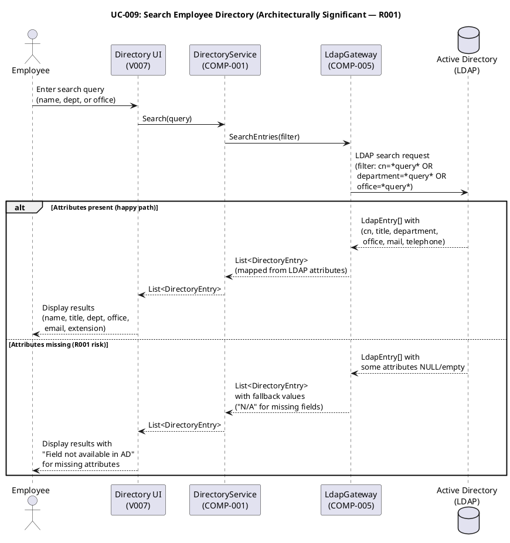
```plantuml
@startuml
title UC-009: Search Employee Directory (Architecturally Significant — R001)

actor Employee as EMP
participant "Directory UI\n(V007)" as UI
participant "DirectoryService\n(COMP-001)" as SVC
participant "LdapGateway\n(COMP-005)" as LDAP
database "Active Directory\n(LDAP)" as AD

EMP -> UI : Enter search query\n(name, dept, or office)
UI -> SVC : Search(query)
SVC -> LDAP : SearchEntries(filter)
LDAP -> AD : LDAP search request\n(filter: cn=*query* OR\n department=*query* OR\n office=*query*)

alt Attributes present (happy path)
  AD --> LDAP : LdapEntry[] with\n(cn, title, department,\n office, mail, telephone)
  LDAP --> SVC : List<DirectoryEntry>\n(mapped from LDAP attributes)
  SVC --> UI : List<DirectoryEntry>
  UI --> EMP : Display results\n(name, title, dept, office,\n email, extension)
else Attributes missing (R001 risk)
  AD --> LDAP : LdapEntry[] with\nsome attributes NULL/empty
  LDAP --> SVC : List<DirectoryEntry>\nwith fallback values\n("N/A" for missing fields)
  SVC --> UI : List<DirectoryEntry>
  UI --> EMP : Display results with\n"Field not available in AD"\nfor missing attributes
end

@enduml
```

### SEQ-010: UC-010 — Manage Worker Category

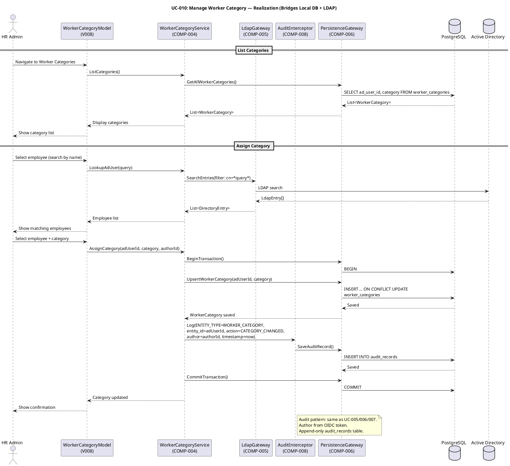
```plantuml
@startuml
title UC-010: Manage Worker Category — Realization (Bridges Local DB + LDAP)

actor "HR Admin" as HR
participant "WorkerCategoryModel\n(V008)" as UI
participant "WorkerCategoryService\n(COMP-004)" as SVC
participant "LdapGateway\n(COMP-005)" as LDAP
participant "AuditInterceptor\n(COMP-008)" as AUDIT
participant "PersistenceGateway\n(COMP-006)" as DB
database "PostgreSQL" as PG
database "Active Directory" as AD

== List Categories ==
HR -> UI : Navigate to Worker Categories
UI -> SVC : ListCategories()
SVC -> DB : GetAllWorkerCategories()
DB -> PG : SELECT ad_user_id, category FROM worker_categories
PG --> DB : List<WorkerCategory>
DB --> SVC : List<WorkerCategory>
SVC --> UI : Display categories
UI --> HR : Show category list

== Assign Category ==
HR -> UI : Select employee (search by name)
UI -> SVC : LookupAdUser(query)
SVC -> LDAP : SearchEntries(filter: cn=*query*)
LDAP -> AD : LDAP search
AD --> LDAP : LdapEntry[]
LDAP --> SVC : List<DirectoryEntry>
SVC --> UI : Employee list
UI --> HR : Show matching employees

HR -> UI : Select employee + category
UI -> SVC : AssignCategory(adUserId, category, authorId)

SVC -> DB : BeginTransaction()
DB -> PG : BEGIN

SVC -> DB : UpsertWorkerCategory(adUserId, category)
DB -> PG : INSERT ... ON CONFLICT UPDATE\nworker_categories
PG --> DB : Saved
DB --> SVC : WorkerCategory saved

SVC -> AUDIT : Log(ENTITY_TYPE=WORKER_CATEGORY,\nentity_id=adUserId, action=CATEGORY_CHANGED,\nauthor=authorId, timestamp=now)
AUDIT -> DB : SaveAuditRecord()
DB -> PG : INSERT INTO audit_records
PG --> DB : Saved

SVC -> DB : CommitTransaction()
DB -> PG : COMMIT

SVC --> UI : Category updated
UI --> HR : Show confirmation

note right of AUDIT
  Audit pattern: same as UC-005/006/007.
  Author from OIDC token.
  Append-only audit_records table.
end note

@enduml
```
## Design Packages and Classes
### UI View/Controller Classes

> **Contributed by:** User-Interface Designer (Analysis & Design Discipline)
> **Purpose:** UI view classes (Razor Page Models) and controller classes (page handlers) for each UC of UI significance. These define the UI layer structure that the Designer and Implementer must follow. Class-level implementation details (method bodies, DI wiring) belong to the Designer — this section defines the UI interaction structure only.

The following class diagram defines the UI view classes (stereotyped `<<view>>`) and their associated controller/handler classes (stereotyped `<<controller>>`). Each view class maps to a Razor Page and traces to one or more use cases.

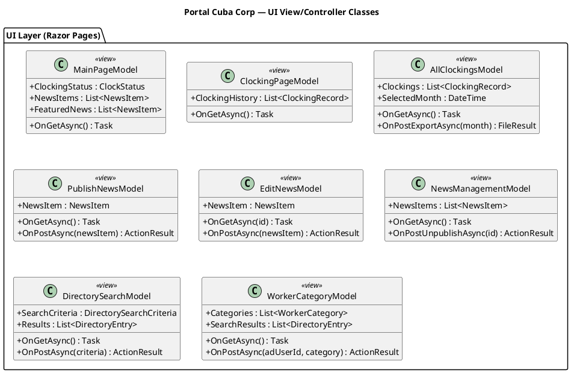
```plantuml
@startuml
title Portal Cuba Corp — UI View/Controller Classes

skinparam classAttributeIconSize 0

package "UI Layer (Razor Pages)" {
  class "MainPageModel" as V001 <<view>> {
    + OnGetAsync() : Task
    + ClockingStatus : ClockStatus
    + NewsItems : List<NewsItem>
    + FeaturedNews : List<NewsItem>
  }
  
  class "ClockingPageModel" as V002 <<view>> {
    + OnGetAsync() : Task
    + ClockingHistory : List<ClockingRecord>
  }
  
  class "AllClockingsModel" as V003 <<view>> {
    + OnGetAsync() : Task
    + OnPostExportAsync(month) : FileResult
    + Clockings : List<ClockingRecord>
    + SelectedMonth : DateTime
  }
  
  class "PublishNewsModel" as V004 <<view>> {
    + OnGetAsync() : Task
    + OnPostAsync(newsItem) : ActionResult
    + NewsItem : NewsItem
  }
  
  class "EditNewsModel" as V005 <<view>> {
    + OnGetAsync(id) : Task
    + OnPostAsync(newsItem) : ActionResult
    + NewsItem : NewsItem
  }
  
  class "NewsManagementModel" as V006 <<view>> {
    + OnGetAsync() : Task
    + OnPostUnpublishAsync(id) : ActionResult
    + NewsItems : List<NewsItem>
  }
  
  class "DirectorySearchModel" as V007 <<view>> {
    + OnGetAsync() : Task
    + OnPostAsync(criteria) : ActionResult
    + SearchCriteria : DirectorySearchCriteria
    + Results : List<DirectoryEntry>
  }
  
  class "WorkerCategoryModel" as V008 <<view>> {
    + OnGetAsync() : Task
    + OnPostAsync(adUserId, category) : ActionResult
    + Categories : List<WorkerCategory>
    + SearchResults : List<DirectoryEntry>
  }
}
@enduml
```

### Application Services Package (Portal.Services)

Design classes for the application services layer. Each service implements a component interface from the SAD. Dependencies are injected via .NET DI container — all cross-boundary references use interfaces, never concrete classes.


```plantuml
@startuml
title Portal Cuba Corp — Application Services Package (Portal.Services)

skinparam classAttributeIconSize 0
skinparam packageStyle rectangle

package "Portal.Services" {
  interface "IClockingService" as INT001 {
    + RecordClocking(employeeId: string, timestamp: DateTime, type: ClockType, idempotencyKey: string) : ClockingResult
    + GetCurrentStatus(employeeId: string) : ClockStatus
    + GetHistory(employeeId: string, month: DateRange) : List<ClockingRecord>
    + GetAllClockings(month: DateRange) : List<ClockingRecord>
    + ExportCsv(month: DateRange) : Stream
  }

  interface "INewsService" as INT002 {
    + Publish(title: string, body: string, category: NewsCategory, authorId: string) : NewsItem
    + Edit(id: Guid, title: string, body: string, category: NewsCategory, authorId: string) : NewsItem
    + Unpublish(id: Guid, authorId: string) : NewsItem
    + GetById(id: Guid) : NewsItem
    + GetPublishedNews(category: NewsCategory?) : List<NewsItem>
    + GetFeaturedNews() : List<NewsItem>
    + ListAll() : List<NewsItem>
  }

  interface "IDirectoryService" as INT003 {
    + Search(query: string) : List<DirectoryEntry>
  }

  interface "IWorkerCategoryService" as INT004 {
    + AssignCategory(adUserId: string, category: string, authorId: string) : WorkerCategory
    + ListCategories() : List<WorkerCategory>
    + LookupAdUser(query: string) : List<DirectoryEntry>
  }

  interface "IAuditLogger" as INT005 {
    + Log(entityType: string, entityId: Guid, action: AuditAction, author: string, timestamp: DateTime) : void
  }

  class "ClockingService" as CLS001 {
    - _persistence : IPersistence
    - _ldapGateway : ILdapGateway
    + RecordClocking(employeeId: string, timestamp: DateTime, type: ClockType, idempotencyKey: string) : ClockingResult
    + GetCurrentStatus(employeeId: string) : ClockStatus
    + GetHistory(employeeId: string, month: DateRange) : List<ClockingRecord>
    + GetAllClockings(month: DateRange) : List<ClockingRecord>
    + ExportCsv(month: DateRange) : Stream
  }

  class "NewsService" as CLS002 {
    - _persistence : IPersistence
    - _auditLogger : IAuditLogger
    + Publish(title: string, body: string, category: NewsCategory, authorId: string) : NewsItem
    + Edit(id: Guid, title: string, body: string, category: NewsCategory, authorId: string) : NewsItem
    + Unpublish(id: Guid, authorId: string) : NewsItem
    + GetById(id: Guid) : NewsItem
    + GetPublishedNews(category: NewsCategory?) : List<NewsItem>
    + GetFeaturedNews() : List<NewsItem>
    + ListAll() : List<NewsItem>
  }

  class "DirectoryService" as CLS003 {
    - _ldapGateway : ILdapGateway
    + Search(query: string) : List<DirectoryEntry>
    - MapLdapAttributes(entry: LdapEntry) : DirectoryEntry
  }

  class "WorkerCategoryService" as CLS004 {
    - _persistence : IPersistence
    - _ldapGateway : ILdapGateway
    - _auditLogger : IAuditLogger
    + AssignCategory(adUserId: string, category: string, authorId: string) : WorkerCategory
    + ListCategories() : List<WorkerCategory>
    + LookupAdUser(query: string) : List<DirectoryEntry>
  }

  class "AuditInterceptor" as CLS005 {
    - _persistence : IPersistence
    + Log(entityType: string, entityId: Guid, action: AuditAction, author: string, timestamp: DateTime) : void
  }
}

CLS001 ..|> INT001
CLS002 ..|> INT002
CLS003 ..|> INT003
CLS004 ..|> INT004
CLS005 ..|> INT005

CLS001 --> IPersistence
CLS001 --> ILdapGateway
CLS002 --> IPersistence
CLS002 --> INT005
CLS003 --> ILdapGateway
CLS004 --> IPersistence
CLS004 --> ILdapGateway
CLS004 --> INT005
CLS005 --> IPersistence

note bottom of CLS001
  COMP-002: Idempotency key check
  before INSERT. Server accepts
  client timestamp (AC-005).
  NFR-002: <1s response time.
end note

note bottom of CLS002
  COMP-003: All news ops run within
  a DB transaction that includes
  the audit record (NFR-004).
  News never hard-deleted (CON-013).
end note

note bottom of CLS003
  COMP-001: R001 risk — LDAP
  attributes may be missing.
  Fallback to "N/A" for empty fields.
end note

@enduml
```

### Infrastructure Package (Portal.Infrastructure)

Design classes for the infrastructure layer. All DB access is centralized in PersistenceGateway via EF Core. LDAP access is read-only via LdapGateway using Novell.Directory.Ldap with connection pooling.


```plantuml
@startuml
title Portal Cuba Corp — Infrastructure Package (Portal.Infrastructure)

skinparam classAttributeIconSize 0
skinparam packageStyle rectangle

package "Portal.Infrastructure" {
  interface "ILdapGateway" as INT006 {
    + SearchEntries(filter: string) : List<LdapSearchResult>
    + GetEntryByUserId(adUserId: string) : LdapSearchResult?
    + ResolveNames(adUserIds: List<string>) : Dictionary<string, string>
  }

  interface "IPersistence" as INT007 {
    + GetClockingsByEmployee(empId: string, range: DateRange) : List<ClockingRecord>
    + GetAllClockingsForMonth(range: DateRange) : List<ClockingRecord>
    + InsertClocking(record: ClockingRecord) : ClockingRecord
    + FindByImpotencyKey(key: string) : ClockingRecord?
    + GetNewsItem(id: Guid) : NewsItem?
    + SaveNewsItem(item: NewsItem) : NewsItem
    + UpdateNewsItem(id: Guid, title: string, body: string, category: NewsCategory) : NewsItem
    + UpdateNewsStatus(id: Guid, status: NewsStatus) : NewsItem
    + GetPublishedNews(category: NewsCategory?) : List<NewsItem>
    + GetFeaturedNews() : List<NewsItem>
    + GetAllNewsItems() : List<NewsItem>
    + UpsertWorkerCategory(adUserId: string, category: string) : WorkerCategory
    + GetAllWorkerCategories() : List<WorkerCategory>
    + InsertAuditRecord(record: AuditRecord) : void
    + BeginTransaction() : IDbTransaction
    + CommitTransaction() : void
  }

  class "LdapGateway" as CLS006 {
    - _connectionPool : LdapConnectionPool
    - _settings : LdapSettings
    + SearchEntries(filter: string) : List<LdapSearchResult>
    + GetEntryByUserId(adUserId: string) : LdapSearchResult?
    + ResolveNames(adUserIds: List<string>) : Dictionary<string, string>
    - MapAttributes(entry: LdapEntry) : LdapSearchResult
    - BuildFilter(query: string) : string
  }

  class "PersistenceGateway" as CLS007 {
    - _context : PortalDbContext
    + GetClockingsByEmployee(empId: string, range: DateRange) : List<ClockingRecord>
    + GetAllClockingsForMonth(range: DateRange) : List<ClockingRecord>
    + InsertClocking(record: ClockingRecord) : ClockingRecord
    + FindByImpotencyKey(key: string) : ClockingRecord?
    + GetNewsItem(id: Guid) : NewsItem?
    + SaveNewsItem(item: NewsItem) : NewsItem
    + UpdateNewsItem(id: Guid, title: string, body: string, category: NewsCategory) : NewsItem
    + UpdateNewsStatus(id: Guid, status: NewsStatus) : NewsItem
    + GetPublishedNews(category: NewsCategory?) : List<NewsItem>
    + GetFeaturedNews() : List<NewsItem>
    + GetAllNewsItems() : List<NewsItem>
    + UpsertWorkerCategory(adUserId: string, category: string) : WorkerCategory
    + GetAllWorkerCategories() : List<WorkerCategory>
    + InsertAuditRecord(record: AuditRecord) : void
    + BeginTransaction() : IDbTransaction
    + CommitTransaction() : void
  }

  class "PortalDbContext" as CLS008 {
    + DbSet<ClockingRecord> Clockings
    + DbSet<NewsItem> NewsItems
    + DbSet<WorkerCategory> WorkerCategories
    + DbSet<AuditRecord> AuditRecords
    + OnModelCreating(modelBuilder: ModelBuilder) : void
  }

  class "LdapSettings" as CLS009 {
    + Server : string
    + Port : int
    + BaseDn : string
    + BindDn : string
    + BindPassword : string
    + AttributeMap : Dictionary<string, string>
  }

  class "LdapConnectionPool" as CLS010 {
    - _pool : ConcurrentBag<LdapConnection>
    + GetConnection() : LdapConnection
    + ReturnConnection(conn: LdapConnection) : void
  }
}

CLS006 ..|> INT006
CLS007 ..|> INT007
CLS007 --> CLS008
CLS006 --> CLS009
CLS006 --> CLS010

note right of CLS006
  COMP-005: Read-only LDAP access.
  Connection pooling via
  Novell.Directory.Ldap.
  R001: Attribute mapping with
  fallback for missing fields.
end note

note right of CLS007
  COMP-006: EF Core + PostgreSQL.
  All DB access centralized here.
  Transaction management for
  audit trail atomicity.
end note

note right of CLS008
  EF Core DbContext.
  OnModelCreating configures:
  - Unique index on Clockings.idempotency_key
  - News items: no DELETE (CON-013)
  - Audit records: append-only
  - Worker categories: 2 columns only
end note

@enduml
```

### Domain Package (Portal.Domain)

Domain entities, enums, and value objects. These classes have no persistence logic and no external dependencies. They define the structural contracts that services and infrastructure operate on.

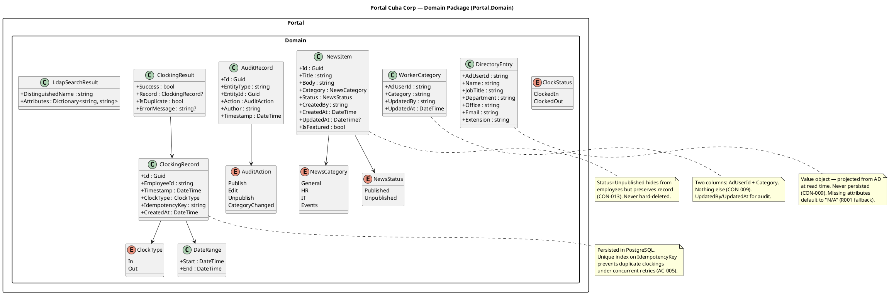
```plantuml
@startuml
title Portal Cuba Corp — Domain Package (Portal.Domain)

skinparam classAttributeIconSize 0
skinparam packageStyle rectangle

package "Portal.Domain" {
  enum "ClockType" as CLS011 {
    In
    Out
  }

  enum "ClockStatus" as CLS012 {
    ClockedIn
    ClockedOut
  }

  enum "NewsCategory" as CLS013 {
    General
    HR
    IT
    Events
  }

  enum "NewsStatus" as CLS014 {
    Published
    Unpublished
  }

  enum "AuditAction" as CLS015 {
    Publish
    Edit
    Unpublish
    CategoryChanged
  }

  class "ClockingRecord" as CLS016 {
    + Id : Guid
    + EmployeeId : string
    + Timestamp : DateTime
    + ClockType : ClockType
    + IdempotencyKey : string
    + CreatedAt : DateTime
  }

  class "NewsItem" as CLS017 {
    + Id : Guid
    + Title : string
    + Body : string
    + Category : NewsCategory
    + Status : NewsStatus
    + CreatedBy : string
    + CreatedAt : DateTime
    + UpdatedAt : DateTime?
    + IsFeatured : bool
  }

  class "WorkerCategory" as CLS018 {
    + AdUserId : string
    + Category : string
    + UpdatedBy : string
    + UpdatedAt : DateTime
  }

  class "AuditRecord" as CLS019 {
    + Id : Guid
    + EntityType : string
    + EntityId : Guid
    + Action : AuditAction
    + Author : string
    + Timestamp : DateTime
  }

  class "DirectoryEntry" as CLS020 {
    + AdUserId : string
    + Name : string
    + JobTitle : string
    + Department : string
    + Office : string
    + Email : string
    + Extension : string
  }

  class "DateRange" as CLS021 {
    + Start : DateTime
    + End : DateTime
  }

  class "ClockingResult" as CLS022 {
    + Success : bool
    + Record : ClockingRecord?
    + IsDuplicate : bool
    + ErrorMessage : string?
  }

  class "LdapSearchResult" as CLS023 {
    + DistinguishedName : string
    + Attributes : Dictionary<string, string>
  }
}

CLS016 --> CLS011
CLS016 --> CLS021
CLS017 --> CLS013
CLS017 --> CLS014
CLS019 --> CLS015
CLS022 --> CLS016

note bottom of CLS016
  Persisted in PostgreSQL.
  Unique index on IdempotencyKey
  prevents duplicate clockings
  under concurrent retries (AC-005).
end note

note bottom of CLS017
  Status=Unpublished hides from
  employees but preserves record
  (CON-013). Never hard-deleted.
end note

note bottom of CLS018
  Two columns: AdUserId + Category.
  Nothing else (CON-009).
  UpdatedBy/UpdatedAt for audit.
end note

note bottom of CLS020
  Value object — projected from AD
  at read time. Never persisted
  (CON-009). Missing attributes
  default to "N/A" (R001 fallback).
end note

@enduml
```

### Design Subsystems

| Subsystem | ID | Provided Interface | Required Interfaces | Volatility |
|---|---|---|---|---|
| Directory Service | COMP-001 | IDirectoryService (INT-003) | ILdapGateway (INT-006) | High (R001) |
| Clocking Service | COMP-002 | IClockingService (INT-001) | IPersistence (INT-007), ILdapGateway (INT-006) | Medium (AC-005) |
| News Service | COMP-003 | INewsService (INT-002) | IPersistence (INT-007), IAuditLogger (INT-005) | Low |
| Worker Category Service | COMP-004 | IWorkerCategoryService (INT-004) | IPersistence (INT-007), ILdapGateway (INT-006), IAuditLogger (INT-005) | Medium |
| LDAP Gateway | COMP-005 | ILdapGateway (INT-006) | (none — external AD) | High (R001) |
| Persistence Gateway | COMP-006 | IPersistence (INT-007) | (none — external PostgreSQL) | Low |
| OIDC Auth Middleware | COMP-007 | (middleware pipeline) | (none — external Keycloak) | Low-Med |
| Audit Interceptor | COMP-008 | IAuditLogger (INT-005) | IPersistence (INT-007) | Low |

### State Machine: NewsItem Lifecycle

NewsItem has 3 distinct lifecycle states (Published, Unpublished, and the initial creation state), requiring a state machine per the quality criteria.

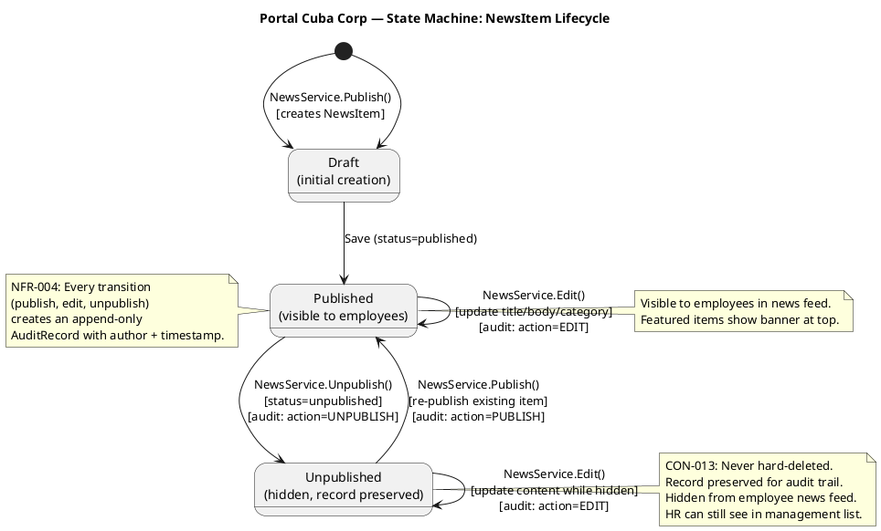
```plantuml
@startuml
title Portal Cuba Corp — State Machine: NewsItem Lifecycle

state "Draft\n(initial creation)" as DRAFT
state "Published\n(visible to employees)" as PUBLISHED
state "Unpublished\n(hidden, record preserved)" as UNPUBLISHED

[*] --> DRAFT : NewsService.Publish()\n[creates NewsItem]

DRAFT --> PUBLISHED : Save (status=published)
PUBLISHED --> PUBLISHED : NewsService.Edit()\n[update title/body/category]\n[audit: action=EDIT]
PUBLISHED --> UNPUBLISHED : NewsService.Unpublish()\n[status=unpublished]\n[audit: action=UNPUBLISH]
UNPUBLISHED --> PUBLISHED : NewsService.Publish()\n[re-publish existing item]\n[audit: action=PUBLISH]
UNPUBLISHED --> UNPUBLISHED : NewsService.Edit()\n[update content while hidden]\n[audit: action=EDIT]

note right of PUBLISHED
  Visible to employees in news feed.
  Featured items show banner at top.
end note

note right of UNPUBLISHED
  CON-013: Never hard-deleted.
  Record preserved for audit trail.
  Hidden from employee news feed.
  HR can still see in management list.
end note

note left of PUBLISHED
  NFR-004: Every transition
  (publish, edit, unpublish)
  creates an append-only
  AuditRecord with author + timestamp.
end note

[*] --> DRAFT

@enduml
```

### Package Organization

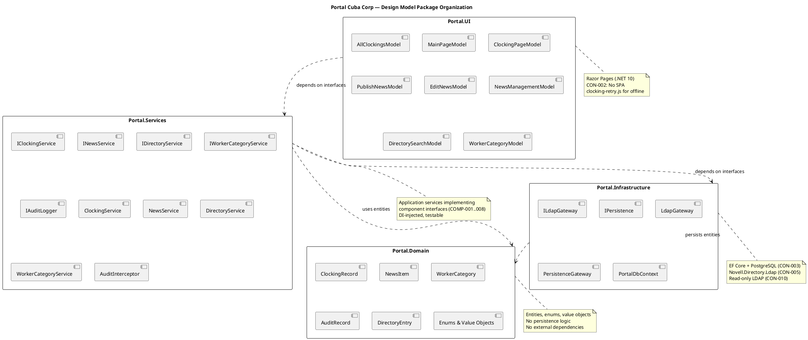
```plantuml
@startuml
title Portal Cuba Corp — Design Model Package Organization

skinparam packageStyle rectangle
skinparam componentStyle uml2

package "Portal.UI" {
  [MainPageModel]
  [ClockingPageModel]
  [AllClockingsModel]
  [PublishNewsModel]
  [EditNewsModel]
  [NewsManagementModel]
  [DirectorySearchModel]
  [WorkerCategoryModel]
}

package "Portal.Services" {
  [IClockingService]
  [INewsService]
  [IDirectoryService]
  [IWorkerCategoryService]
  [IAuditLogger]
  [ClockingService]
  [NewsService]
  [DirectoryService]
  [WorkerCategoryService]
  [AuditInterceptor]
}

package "Portal.Infrastructure" {
  [ILdapGateway]
  [IPersistence]
  [LdapGateway]
  [PersistenceGateway]
  [PortalDbContext]
}

package "Portal.Domain" {
  [ClockingRecord]
  [NewsItem]
  [WorkerCategory]
  [AuditRecord]
  [DirectoryEntry]
  [Enums & Value Objects]
}

Portal.UI ..> Portal.Services : depends on interfaces
Portal.Services ..> Portal.Infrastructure : depends on interfaces
Portal.Services ..> Portal.Domain : uses entities
Portal.Infrastructure ..> Portal.Domain : persists entities

note bottom of Portal.UI
  Razor Pages (.NET 10)
  CON-002: No SPA
  clocking-retry.js for offline
end note

note bottom of Portal.Services
  Application services implementing
  component interfaces (COMP-001..008)
  DI-injected, testable
end note

note bottom of Portal.Infrastructure
  EF Core + PostgreSQL (CON-003)
  Novell.Directory.Ldap (CON-005)
  Read-only LDAP (CON-010)
end note

note bottom of Portal.Domain
  Entities, enums, value objects
  No persistence logic
  No external dependencies
end note

@enduml
```

### Testability Entry Points

| Test Point | DI Injection | Observable State | Test Strategy |
|---|---|---|---|
| ClockingService | Inject mock IPersistence + mock ILdapGateway | ClockingResult.Success, IsDuplicate, Record | Unit test: idempotency key collision, normal insert, offline timestamp acceptance |
| NewsService | Inject mock IPersistence + mock IAuditLogger | NewsItem.Status, AuditRecord captured | Unit test: publish creates audit, edit creates audit, unpublish sets status without delete |
| DirectoryService | Inject mock ILdapGateway | List<DirectoryEntry> with fallback values | Unit test: all attributes present, some attributes missing (R001), no results |
| WorkerCategoryService | Inject mock IPersistence + mock ILdapGateway + mock IAuditLogger | WorkerCategory saved, AuditRecord captured | Unit test: assign new, update existing, audit trail |
| LdapGateway | Inject LdapSettings with test server | LdapSearchResult attributes | Integration test: real LDAP query against test AD instance |
| PersistenceGateway | Inject PortalDbContext with in-memory or test PostgreSQL | DB rows inserted/updated | Integration test: clocking insert, news lifecycle, audit record append |
## Interface Contracts
All subsystem boundaries are defined by interfaces. No concrete class is referenced across a subsystem boundary — services depend on interfaces, not implementations.

### INT-001: IClockingService (COMP-002)

| Operation | Signature | Precondition | Postcondition |
|---|---|---|---|
| RecordClocking | `ClockingResult RecordClocking(string employeeId, DateTime timestamp, ClockType type, string idempotencyKey)` | employeeId is authenticated OIDC subject; idempotencyKey is non-empty UUID | If idempotencyKey exists, returns existing record with IsDuplicate=true; otherwise inserts new ClockingRecord and returns Success=true |
| GetCurrentStatus | `ClockStatus GetCurrentStatus(string employeeId)` | employeeId is authenticated | Returns ClockedIn if last record is ClockType.In; ClockedOut otherwise or if no records exist |
| GetHistory | `List<ClockingRecord> GetHistory(string employeeId, DateRange month)` | employeeId matches authenticated user (or HR role) | Returns clockings for the specified employee within the date range, ordered by timestamp |
| GetAllClockings | `List<ClockingRecord> GetAllClockings(DateRange month)` | Caller has HR role | Returns all clockings for all employees within the date range |
| ExportCsv | `Stream ExportCsv(DateRange month)` | Caller has HR role | Returns CSV stream with header row: Employee,Date,TimeIn,TimeOut,Direction |

### INT-002: INewsService (COMP-003)

| Operation | Signature | Precondition | Postcondition |
|---|---|---|---|
| Publish | `NewsItem Publish(string title, string body, NewsCategory category, string authorId)` | Caller has HR role; title and body non-empty | NewsItem saved with Status=Published; AuditRecord created with Action=Publish, Author=authorId, Timestamp=server now |
| Edit | `NewsItem Edit(Guid id, string title, string body, NewsCategory category, string authorId)` | Caller has HR role; NewsItem with id exists | NewsItem updated in place (not deleted/recreated); AuditRecord created with Action=Edit |
| Unpublish | `NewsItem Unpublish(Guid id, string authorId)` | Caller has HR role; NewsItem with id exists | NewsItem.Status set to Unpublished; record NOT deleted (CON-013); AuditRecord created with Action=Unpublish |
| GetById | `NewsItem GetById(Guid id)` | Caller has HR role (for unpublished) or any authenticated (for published) | Returns NewsItem or null if not found |
| GetPublishedNews | `List<NewsItem> GetPublishedNews(NewsCategory? category)` | Any authenticated user | Returns only Status=Published items, ordered by CreatedAt DESC; filtered by category if provided |
| GetFeaturedNews | `List<NewsItem> GetFeaturedNews()` | Any authenticated user | Returns Status=Published AND IsFeatured=true items, ordered by CreatedAt DESC |
| ListAll | `List<NewsItem> ListAll()` | Caller has HR role | Returns all news items regardless of status, ordered by CreatedAt DESC |

### INT-003: IDirectoryService (COMP-001)

| Operation | Signature | Precondition | Postcondition |
|---|---|---|---|
| Search | `List<DirectoryEntry> Search(string query)` | Any authenticated user; query non-empty | Returns DirectoryEntry list from AD via LDAP; missing attributes default to "N/A" (R001 fallback); no private data (CON-012) |

### INT-004: IWorkerCategoryService (COMP-004)

| Operation | Signature | Precondition | Postcondition |
|---|---|---|---|
| AssignCategory | `WorkerCategory AssignCategory(string adUserId, string category, string authorId)` | Caller has HR role; adUserId exists in AD; category is valid | WorkerCategory upserted (adUserId + category only); AuditRecord created with Action=CategoryChanged |
| ListCategories | `List<WorkerCategory> ListCategories()` | Caller has HR role | Returns all worker category records from local DB |
| LookupAdUser | `List<DirectoryEntry> LookupAdUser(string query)` | Caller has HR role | Returns DirectoryEntry list from AD matching query (for HR to find AD user id before assigning category) |

### INT-005: IAuditLogger (COMP-008)

| Operation | Signature | Precondition | Postcondition |
|---|---|---|---|
| Log | `void Log(string entityType, Guid entityId, AuditAction action, string author, DateTime timestamp)` | Called within an active DB transaction | AuditRecord inserted into audit_records table (append-only, never updated or deleted) |

### INT-006: ILdapGateway (COMP-005)

| Operation | Signature | Precondition | Postcondition |
|---|---|---|---|
| SearchEntries | `List<LdapSearchResult> SearchEntries(string filter)` | LDAP connection pool has available connection | Returns LDAP search results; read-only (no writes to AD per CON-010) |
| GetEntryByUserId | `LdapSearchResult? GetEntryByUserId(string adUserId)` | adUserId non-empty | Returns LDAP entry for user or null if not found |
| ResolveNames | `Dictionary<string, string> ResolveNames(List<string> adUserIds)` | adUserIds non-empty list | Returns mapping of adUserId → display name from AD cn attribute |

### INT-007: IPersistence (COMP-006)

| Operation | Signature | Precondition | Postcondition |
|---|---|---|---|
| GetClockingsByEmployee | `List<ClockingRecord> GetClockingsByEmployee(string empId, DateRange range)` | empId non-empty | Returns clockings for employee within range |
| GetAllClockingsForMonth | `List<ClockingRecord> GetAllClockingsForMonth(DateRange range)` | — | Returns all clockings within range |
| InsertClocking | `ClockingRecord InsertClocking(ClockingRecord record)` | record.IdempotencyKey is unique | Inserts and returns saved record; unique constraint enforced by DB index |
| FindByImpotencyKey | `ClockingRecord? FindByImpotencyKey(string key)` | key non-empty | Returns existing record or null |
| GetNewsItem | `NewsItem? GetNewsItem(Guid id)` | — | Returns NewsItem or null |
| SaveNewsItem | `NewsItem SaveNewsItem(NewsItem item)` | item non-null | Inserts new NewsItem, returns with generated Id |
| UpdateNewsItem | `NewsItem UpdateNewsItem(Guid id, string title, string body, NewsCategory category)` | NewsItem with id exists | Updates title/body/category; does NOT change status |
| UpdateNewsStatus | `NewsItem UpdateNewsStatus(Guid id, NewsStatus status)` | NewsItem with id exists | Updates status only; record preserved (no delete per CON-013) |
| GetPublishedNews | `List<NewsItem> GetPublishedNews(NewsCategory? category)` | — | Returns Status=Published items, optionally filtered by category |
| GetFeaturedNews | `List<NewsItem> GetFeaturedNews()` | — | Returns Status=Published AND IsFeatured=true |
| GetAllNewsItems | `List<NewsItem> GetAllNewsItems()` | — | Returns all news items regardless of status |
| UpsertWorkerCategory | `WorkerCategory UpsertWorkerCategory(string adUserId, string category)` | adUserId non-empty | Inserts or updates worker_categories row (2 columns only per CON-009) |
| GetAllWorkerCategories | `List<WorkerCategory> GetAllWorkerCategories()` | — | Returns all worker category records |
| InsertAuditRecord | `void InsertAuditRecord(AuditRecord record)` | Called within active transaction | Appends audit record (never updated or deleted) |
| BeginTransaction | `IDbTransaction BeginTransaction()` | — | Begins a new DB transaction |
| CommitTransaction | `void CommitTransaction()` | Transaction is active | Commits the current transaction |
## Persistent Data Classes
> **Contributed by:** Database Designer (Analysis & Design Discipline)
> **Persistence Engine:** PostgreSQL (CON-003 — declared by stakeholder)
> **ORM:** EF Core 10 + Npgsql (CON-001, CON-003)
> **Design Mechanism:** Repository + Unit of Work via PortalDbContext (SAD Logical View)

EF Core entity classes map to PostgreSQL tables. The PortalDbContext configures all mappings, constraints, and indexes in OnModelCreating. The schema is minimal — 4 tables — because employee data is read from AD at read time (CON-009) and authentication is handled by Keycloak (CON-004). No local user table exists.

### Schema Organization

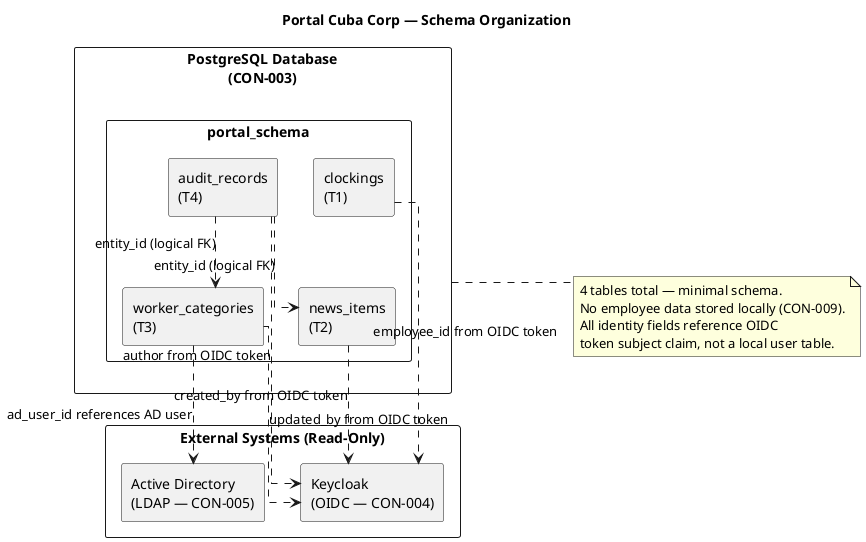
```plantuml
@startuml
title Portal Cuba Corp — Schema Organization

skinparam packageStyle rectangle
skinparam linetype ortho

package "PostgreSQL Database\n(CON-003)" as DB {

  package "portal_schema" {
    rectangle "clockings\n(T1)" as T1
    rectangle "news_items\n(T2)" as T2
    rectangle "worker_categories\n(T3)" as T3
    rectangle "audit_records\n(T4)" as T4
  }
}

package "External Systems (Read-Only)" {
  rectangle "Active Directory\n(LDAP — CON-005)" as AD
  rectangle "Keycloak\n(OIDC — CON-004)" as KC
}

T4 ..> T2 : entity_id (logical FK)
T4 ..> T3 : entity_id (logical FK)
T1 ..> KC : employee_id from OIDC token
T2 ..> KC : created_by from OIDC token
T3 ..> KC : updated_by from OIDC token
T4 ..> KC : author from OIDC token
T3 ..> AD : ad_user_id references AD user

note bottom of DB
  4 tables total — minimal schema.
  No employee data stored locally (CON-009).
  All identity fields reference OIDC
  token subject claim, not a local user table.
end note

@enduml
```

### Entity-to-Table Mapping (<<table>> Class Diagram)

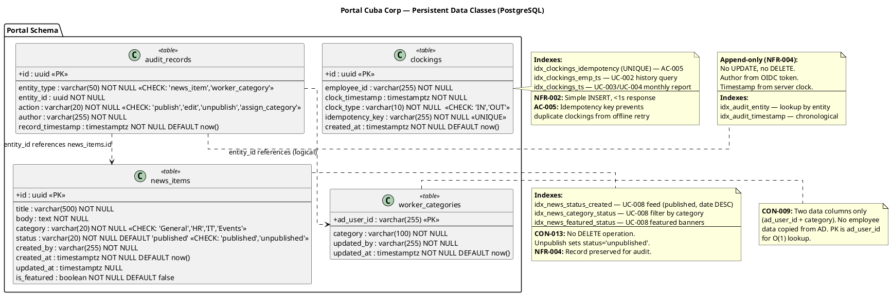
```plantuml
@startuml
title Portal Cuba Corp — Persistent Data Classes (PostgreSQL)

skinparam classAttributeIconSize 0
skinparam linetype ortho

package "Portal Schema" {

  class "clockings" as T1 <<table>> {
    + id : uuid <<PK>>
    --
    employee_id : varchar(255) NOT NULL
    clock_timestamp : timestamptz NOT NULL
    clock_type : varchar(10) NOT NULL  <<CHECK: 'IN','OUT'>>
    idempotency_key : varchar(255) NOT NULL <<UNIQUE>>
    created_at : timestamptz NOT NULL DEFAULT now()
  }

  class "news_items" as T2 <<table>> {
    + id : uuid <<PK>>
    --
    title : varchar(500) NOT NULL
    body : text NOT NULL
    category : varchar(20) NOT NULL <<CHECK: 'General','HR','IT','Events'>>
    status : varchar(20) NOT NULL DEFAULT 'published' <<CHECK: 'published','unpublished'>>
    created_by : varchar(255) NOT NULL
    created_at : timestamptz NOT NULL DEFAULT now()
    updated_at : timestamptz NULL
    is_featured : boolean NOT NULL DEFAULT false
  }

  class "worker_categories" as T3 <<table>> {
    + ad_user_id : varchar(255) <<PK>>
    --
    category : varchar(100) NOT NULL
    updated_by : varchar(255) NOT NULL
    updated_at : timestamptz NOT NULL DEFAULT now()
  }

  class "audit_records" as T4 <<table>> {
    + id : uuid <<PK>>
    --
    entity_type : varchar(50) NOT NULL <<CHECK: 'news_item','worker_category'>>
    entity_id : uuid NOT NULL
    action : varchar(20) NOT NULL <<CHECK: 'publish','edit','unpublish','assign_category'>>
    author : varchar(255) NOT NULL
    record_timestamp : timestamptz NOT NULL DEFAULT now()
  }
}

T4 ..> T2 : entity_id references news_items.id
T4 ..> T3 : entity_id references (logical)

note right of T1
  **Indexes:**
  idx_clockings_idempotency (UNIQUE) — AC-005
  idx_clockings_emp_ts — UC-002 history query
  idx_clockings_ts — UC-003/UC-004 monthly report
  --
  **NFR-002:** Simple INSERT, <1s response
  **AC-005:** Idempotency key prevents
  duplicate clockings from offline retry
end note

note right of T2
  **Indexes:**
  idx_news_status_created — UC-008 feed (published, date DESC)
  idx_news_category_status — UC-008 filter by category
  idx_news_featured_status — UC-008 featured banners
  --
  **CON-013:** No DELETE operation.
  Unpublish sets status='unpublished'.
  **NFR-004:** Record preserved for audit.
end note

note right of T3
  **CON-009:** Two data columns only
  (ad_user_id + category). No employee
  data copied from AD. PK is ad_user_id
  for O(1) lookup.
end note

note right of T4
  **Append-only (NFR-004):**
  No UPDATE, no DELETE.
  Author from OIDC token.
  Timestamp from server clock.
  --
  **Indexes:**
  idx_audit_entity — lookup by entity
  idx_audit_timestamp — chronological
end note

@enduml
```

### O/R Mapping Specification

| Design Class | Table | Identity Strategy | Loading Policy | Column Mapping | Type Conversions |
|---|---|---|---|---|---|
| ClockingRecord (CLS-016) | clockings | Guid PK (server-generated, UUID v4) | Eager (single-row INSERT/SELECT) | id→id, EmployeeId→employee_id, Timestamp→clock_timestamp, ClockType→clock_type (string conversion), IdempotencyKey→idempotency_key, CreatedAt→created_at | ClockType enum → varchar(10) via HasConversion<string>() |
| NewsItem (CLS-017) | news_items | Guid PK (server-generated, UUID v4) | Eager (UC-008 lists ≤50 items) | id→id, Title→title, Body→body, Category→category, Status→status, CreatedBy→created_by, CreatedAt→created_at, UpdatedAt→updated_at (nullable), IsFeatured→is_featured | NewsCategory enum → varchar(20); NewsStatus enum → varchar(20); both via HasConversion<string>() |
| WorkerCategory (CLS-018) | worker_categories | String PK (ad_user_id — natural key from AD) | Eager (single-row lookup) | AdUserId→ad_user_id (PK), Category→category, UpdatedBy→updated_by, UpdatedAt→updated_at | No conversions — all string/timestamptz |
| AuditRecord (CLS-019) | audit_records | Guid PK (server-generated, UUID v4) | Eager (append-only INSERT) | id→id, EntityType→entity_type, EntityId→entity_id, Action→action, Author→author, Timestamp→record_timestamp | AuditAction enum → varchar(20) via HasConversion<string>() |

### EF Core Configuration (PortalDbContext.OnModelCreating)

| Entity | Configuration | Code |
|---|---|---|
| ClockingRecord | Table name | `modelBuilder.Entity<ClockingRecord>().ToTable("clockings")` |
| ClockingRecord | Unique index | `modelBuilder.Entity<ClockingRecord>().HasIndex(c => c.IdempotencyKey).IsUnique()` |
| ClockingRecord | Composite index (emp + timestamp) | `modelBuilder.Entity<ClockingRecord>().HasIndex(c => new { c.EmployeeId, c.Timestamp })` |
| ClockingRecord | Timestamp index | `modelBuilder.Entity<ClockingRecord>().HasIndex(c => c.Timestamp)` |
| ClockingRecord | CHECK constraint | `clock_type IN ('IN', 'OUT')` — enforced via CHECK constraint |
| NewsItem | Table name | `modelBuilder.Entity<NewsItem>().ToTable("news_items")` |
| NewsItem | Status + created index | `modelBuilder.Entity<NewsItem>().HasIndex(n => new { n.Status, n.CreatedAt })` |
| NewsItem | Category + status index | `modelBuilder.Entity<NewsItem>().HasIndex(n => new { n.Category, n.Status })` |
| NewsItem | Featured + status index | `modelBuilder.Entity<NewsItem>().HasIndex(n => new { n.IsFeatured, n.Status })` |
| NewsItem | Status check | `modelBuilder.Entity<NewsItem>().Property(n => n.Status).HasConversion<string>()` |
| NewsItem | Category check | `modelBuilder.Entity<NewsItem>().Property(n => n.Category).HasConversion<string>()` |
| WorkerCategory | Table name | `modelBuilder.Entity<WorkerCategory>().ToTable("worker_categories")` |
| WorkerCategory | PK | `modelBuilder.Entity<WorkerCategory>().HasKey(w => w.AdUserId)` |
| AuditRecord | Table name | `modelBuilder.Entity<AuditRecord>().ToTable("audit_records")` |
| AuditRecord | Entity index | `modelBuilder.Entity<AuditRecord>().HasIndex(a => new { a.EntityType, a.EntityId })` |
| AuditRecord | Timestamp index | `modelBuilder.Entity<AuditRecord>().HasIndex(a => a.Timestamp)` |
| AuditRecord | Append-only | No update/delete APIs exposed on IPersistence for audit records |

### Index Strategy (Each Index Justified by Query/NFR)

| Index | Table | Columns | Query Served | NFR/UC Justification |
|---|---|---|---|---|
| idx_clockings_idempotency (UNIQUE) | clockings | idempotency_key | INSERT deduplication check | AC-005: prevents duplicate clockings from offline retry |
| idx_clockings_emp_ts | clockings | employee_id, clock_timestamp | UC-002: employee views own history for current month | NFR-001: <3s page load — composite index avoids full scan |
| idx_clockings_ts | clockings | clock_timestamp | UC-003/UC-004: HR views all clockings, CSV export by month | NFR-001: range scan on timestamp for monthly filter |
| idx_news_status_created | news_items | status, created_at DESC | UC-008: news feed sorted by date, published only | NFR-001: <3s page load — covering index for main page feed |
| idx_news_category_status | news_items | category, status | UC-008: filter by category (General, HR, IT, Events) | NFR-001: category filter without full table scan |
| idx_news_featured_status | news_items | is_featured, status | UC-008: featured news banners at top | NFR-001: fast lookup of featured items |
| idx_audit_entity | audit_records | entity_type, entity_id | Audit lookup by entity (news item or worker category) | NFR-004: audit trail retrieval |
| idx_audit_timestamp | audit_records | record_timestamp | Chronological audit log display | NFR-004: chronological ordering |

### Constraint Specification

| Table | Constraint | Type | Rationale |
|---|---|---|---|
| clockings | id NOT NULL | NOT NULL | PK — UUID generated by server |
| clockings | employee_id NOT NULL | NOT NULL | Every clocking belongs to an employee |
| clockings | clock_timestamp NOT NULL | NOT NULL | Timestamp is the core data point |
| clockings | clock_type NOT NULL | NOT NULL | Must be IN or OUT |
| clockings | clock_type IN ('IN','OUT') | CHECK | Domain constraint — only two values valid |
| clockings | idempotency_key NOT NULL | NOT NULL | Required for deduplication |
| clockings | idempotency_key UNIQUE | UNIQUE | AC-005: prevents duplicate clockings |
| news_items | title NOT NULL | NOT NULL | Every news item has a title |
| news_items | body NOT NULL | NOT NULL | Every news item has content |
| news_items | category NOT NULL | NOT NULL | Must be one of the four categories |
| news_items | category IN ('General','HR','IT','Events') | CHECK | FR-005: four categories defined |
| news_items | status NOT NULL | NOT NULL | Must be published or unpublished |
| news_items | status IN ('published','unpublished') | CHECK | CON-013: no hard delete, only status change |
| news_items | created_by NOT NULL | NOT NULL | NFR-004: author required for audit |
| news_items | is_featured NOT NULL DEFAULT false | NOT NULL + DEFAULT | Featured flag defaults to false |
| worker_categories | ad_user_id NOT NULL | NOT NULL (PK) | Natural key from AD |
| worker_categories | category NOT NULL | NOT NULL | Every worker has a category |
| worker_categories | updated_by NOT NULL | NOT NULL | NFR-004: audit who changed category |
| audit_records | entity_type IN ('news_item','worker_category') | CHECK | Only auditable entity types |
| audit_records | action IN ('publish','edit','unpublish','assign_category') | CHECK | Only valid audit actions |
| audit_records | author NOT NULL | NOT NULL | NFR-004: author identity required |
| audit_records | Append-only | Application-level | No UPDATE/DELETE APIs exposed — enforced by IPersistence interface contract |

### Migration Strategy (Baseline)

**Migration:** `20260828120000_InitialCreate` — baseline schema for Elaboration.

**Forward migration (CREATE TABLE):**

```sql
-- Migration: InitialCreate (baseline)
-- Engine: PostgreSQL (CON-003)

CREATE TABLE clockings (
    id              UUID PRIMARY KEY DEFAULT gen_random_uuid(),
    employee_id     VARCHAR(255) NOT NULL,
    clock_timestamp TIMESTAMPTZ NOT NULL,
    clock_type      VARCHAR(10) NOT NULL,
    idempotency_key VARCHAR(255) NOT NULL,
    created_at      TIMESTAMPTZ NOT NULL DEFAULT now(),
    CONSTRAINT chk_clock_type CHECK (clock_type IN ('IN', 'OUT'))
);

CREATE UNIQUE INDEX idx_clockings_idempotency ON clockings (idempotency_key);
CREATE INDEX idx_clockings_emp_ts ON clockings (employee_id, clock_timestamp);
CREATE INDEX idx_clockings_ts ON clockings (clock_timestamp);

CREATE TABLE news_items (
    id          UUID PRIMARY KEY DEFAULT gen_random_uuid(),
    title       VARCHAR(500) NOT NULL,
    body        TEXT NOT NULL,
    category    VARCHAR(20) NOT NULL,
    status      VARCHAR(20) NOT NULL DEFAULT 'published',
    created_by  VARCHAR(255) NOT NULL,
    created_at  TIMESTAMPTZ NOT NULL DEFAULT now(),
    updated_at  TIMESTAMPTZ,
    is_featured BOOLEAN NOT NULL DEFAULT false,
    CONSTRAINT chk_news_category CHECK (category IN ('General', 'HR', 'IT', 'Events')),
    CONSTRAINT chk_news_status CHECK (status IN ('published', 'unpublished'))
);

CREATE INDEX idx_news_status_created ON news_items (status, created_at DESC);
CREATE INDEX idx_news_category_status ON news_items (category, status);
CREATE INDEX idx_news_featured_status ON news_items (is_featured, status);

CREATE TABLE worker_categories (
    ad_user_id  VARCHAR(255) PRIMARY KEY,
    category    VARCHAR(100) NOT NULL,
    updated_by   VARCHAR(255) NOT NULL,
    updated_at  TIMESTAMPTZ NOT NULL DEFAULT now()
);

CREATE TABLE audit_records (
    id               UUID PRIMARY KEY DEFAULT gen_random_uuid(),
    entity_type      VARCHAR(50) NOT NULL,
    entity_id        UUID NOT NULL,
    action           VARCHAR(20) NOT NULL,
    author           VARCHAR(255) NOT NULL,
    record_timestamp TIMESTAMPTZ NOT NULL DEFAULT now(),
    CONSTRAINT chk_audit_entity_type CHECK (entity_type IN ('news_item', 'worker_category')),
    CONSTRAINT chk_audit_action CHECK (action IN ('publish', 'edit', 'unpublish', 'assign_category'))
);

CREATE INDEX idx_audit_entity ON audit_records (entity_type, entity_id);
CREATE INDEX idx_audit_timestamp ON audit_records (record_timestamp);
```

**Rollback strategy:**

```sql
-- Rollback: drop all tables (baseline — no data to preserve on initial migration)
DROP TABLE IF EXISTS audit_records;
DROP TABLE IF EXISTS worker_categories;
DROP TABLE IF EXISTS news_items;
DROP TABLE IF EXISTS clockings;
```

**Idempotency:** Migration uses `CREATE TABLE` without `IF NOT EXISTS` — EF Core migration framework ensures single execution. For manual application, wrap in `BEGIN; ... COMMIT;` with `IF NOT EXISTS` checks on `pg_class`.

**Schema evolution policy:** Core schema (PKs, FKs, key entities) is stable by end of Elaboration. Construction iterations may add columns or tables but should not restructure existing tables. Every schema change requires a forward migration script with version sequence number.

### Performance Baseline

| Access Path | Expected Rows | Query Plan | Response Time Target | NFR |
|---|---|---|---|---|
| Clocking INSERT (UC-001) | 1 row | INSERT + unique index check on idempotency_key | <1s | NFR-002 |
| Employee clocking history (UC-002) | ~20 rows/month | Index scan on idx_clockings_emp_ts | <3s page load | NFR-001 |
| All employee clockings (UC-003) | ~4,000 rows/month (200 emp × ~20 days) | Index range scan on idx_clockings_ts | <3s page load | NFR-001 |
| CSV export (UC-004) | ~4,000 rows | Sequential scan with timestamp filter, streaming response | <10s (streaming) | NFR-001 |
| News feed (UC-008) | ≤50 rows | Index scan on idx_news_status_created (published, date DESC) | <3s page load | NFR-001 |
| News filter by category (UC-008) | ≤50 rows | Index scan on idx_news_category_status | <3s page load | NFR-001 |
| Featured news (UC-008) | ≤5 rows | Index scan on idx_news_featured_status | <3s page load | NFR-001 |
| Worker category lookup (UC-010) | 1 row | PK lookup on ad_user_id | <1s | NFR-002 |
| Audit record INSERT (UC-005/006/007/010) | 1 row | INSERT (append-only, no index conflict) | <1s | NFR-002 |

**Row count estimates:** 200 employees × ~20 clockings/month = ~4,000 clockings/month = ~48,000/year. News items: ~10/month = ~120/year. Worker categories: ~200 rows (one per employee). Audit records: ~50/month = ~600/year. All tables remain small (<100K rows) for years — no partitioning required at this scale.

### Normalization Assessment

All tables are in **3NF**:
- **clockings:** Every non-key column depends on the PK (id) and only the PK. No transitive dependencies.
- **news_items:** Every non-key column depends on the PK (id). Category and status are atomic. No repeating groups.
- **worker_categories:** Two-column table (ad_user_id + category) plus audit columns (updated_by, updated_at). No denormalization — updated_by/updated_at are metadata, not redundant data.
- **audit_records:** Every non-key column depends on the PK (id). entity_type/entity_id form a logical reference but are not a physical FK (audit_records is append-only and must not be blocked by FK constraints if a referenced row is modified).

**No denormalization decisions** — the schema is small and normalized. At 200 employees and <100K rows per table, query performance is met by B-tree indexes alone without any denormalization trade-offs.

### Three-Level Mechanism Chain Resolution

| Analysis Mechanism | Design Mechanism | Implementation Mechanism |
|---|---|---|
| Persistence (objects need to be stored between sessions) | Repository + Unit of Work; 3NF normalized relational schema; append-only audit; idempotency via unique index | EF Core 10 + Npgsql + PostgreSQL (CON-001, CON-003) |
| Audit Trail (who did what, when) | Interceptor pattern — same transaction as the audited operation; append-only table; author from OIDC token subject claim; timestamp from server clock | EF Core SaveInterceptor + PostgreSQL audit_records table (CON-003) |
| Offline Retry (AC-005 — 5-min network drop tolerance) | Idempotency key on clockings table; UNIQUE index prevents duplicate inserts; server accepts client timestamp | clocking-retry.js (CON-002) + PostgreSQL UNIQUE constraint (CON-003) |
## Boundary Classes and Navigation Map

> **Contributed by:** User-Interface Designer (Analysis & Design Discipline)
> **Purpose:** This section contains the interaction flows (activity diagrams per UC), the Navigation Topology (state machine of all screens), and Salt wireframes for primary screens. These are the user-interface realizations of all use cases — the direct translation of user goals into observable, navigable screen flows.

### Navigation Topology

The following state machine defines ALL screens in the system, their relationships, and the conditions under which transitions fire. Every screen is a node; every user action causing a screen change is a directed edge with a guard condition. This model can be validated for: unreachable screens, dead-end screens, missing error states, and circular navigation traps.

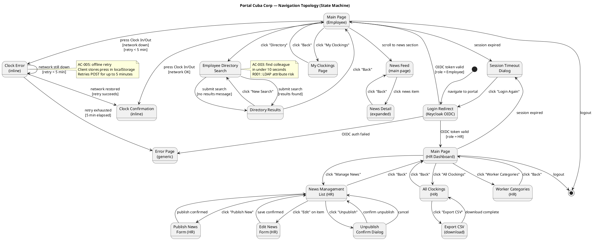
```plantuml
@startuml
title Portal Cuba Corp — Navigation Topology (State Machine)

state "Login Redirect\n(Keycloak OIDC)" as LOGIN
state "Main Page\n(Employee)" as MAIN_EMP
state "Main Page\n(HR Dashboard)" as MAIN_HR
state "My Clockings\nPage" as MY_CLOCK
state "Clock Confirmation\n(inline)" as CLOCK_CONF
state "Clock Error\n(inline)" as CLOCK_ERR
state "All Clockings\n(HR)" as ALL_CLOCK
state "Export CSV\n(download)" as EXPORT
state "Publish News\nForm (HR)" as PUB_FORM
state "Edit News\nForm (HR)" as EDIT_FORM
state "News Management\nList (HR)" as NEWS_MGMT
state "Unpublish\nConfirm Dialog" as UNPUB_DLG
state "Worker Categories\n(HR)" as CAT_MGMT
state "Employee Directory\nSearch" as DIR_SEARCH
state "Directory Results" as DIR_RESULTS
state "News Feed\n(main page)" as NEWS_FEED
state "News Detail\n(expanded)" as NEWS_DETAIL
state "Session Timeout\nDialog" as TIMEOUT
state "Error Page\n(generic)" as ERROR

[*] --> LOGIN : navigate to portal
LOGIN --> MAIN_EMP : OIDC token valid\n[role = Employee]
LOGIN --> MAIN_HR : OIDC token valid\n[role = HR]
LOGIN --> ERROR : OIDC auth failed

MAIN_EMP --> MY_CLOCK : click "My Clockings"
MY_CLOCK --> MAIN_EMP : click "Back"

MAIN_EMP --> CLOCK_CONF : press Clock In/Out\n[network OK]
MAIN_EMP --> CLOCK_ERR : press Clock In/Out\n[network down]\n[retry < 5 min]
CLOCK_ERR --> CLOCK_CONF : network restored\n[retry succeeds]
CLOCK_ERR --> CLOCK_ERR : network still down\n[retry < 5 min]
CLOCK_ERR --> ERROR : retry exhausted\n[5 min elapsed]

MAIN_EMP --> NEWS_FEED : scroll to news section
NEWS_FEED --> NEWS_DETAIL : click news item
NEWS_DETAIL --> NEWS_FEED : click "Back"

MAIN_EMP --> DIR_SEARCH : click "Directory"
DIR_SEARCH --> DIR_RESULTS : submit search\n[results found]
DIR_SEARCH --> DIR_RESULTS : submit search\n[no results message]
DIR_RESULTS --> DIR_SEARCH : click "New Search"
DIR_RESULTS --> MAIN_EMP : click "Back"

MAIN_HR --> ALL_CLOCK : click "All Clockings"
ALL_CLOCK --> EXPORT : click "Export CSV"
EXPORT --> ALL_CLOCK : download complete
ALL_CLOCK --> MAIN_HR : click "Back"

MAIN_HR --> NEWS_MGMT : click "Manage News"
NEWS_MGMT --> PUB_FORM : click "Publish New"
PUB_FORM --> NEWS_MGMT : publish confirmed
NEWS_MGMT --> EDIT_FORM : click "Edit" on item
EDIT_FORM --> NEWS_MGMT : save confirmed
NEWS_MGMT --> UNPUB_DLG : click "Unpublish"
UNPUB_DLG --> NEWS_MGMT : confirm unpublish
UNPUB_DLG --> NEWS_MGMT : cancel
NEWS_MGMT --> MAIN_HR : click "Back"

MAIN_HR --> CAT_MGMT : click "Worker Categories"
CAT_MGMT --> MAIN_HR : click "Back"

MAIN_EMP --> TIMEOUT : session expired
MAIN_HR --> TIMEOUT : session expired
TIMEOUT --> LOGIN : click "Login Again"

MAIN_EMP --> [*] : logout
MAIN_HR --> [*] : logout

note right of CLOCK_ERR
  AC-005: offline retry
  Client stores press in localStorage
  Retries POST for up to 5 minutes
end note

note right of DIR_SEARCH
  AC-003: find colleague
  in under 10 seconds
  R001: LDAP attribute risk
end note

@enduml
```

**Navigation completeness verification:**
- ✅ All screens reachable from Login (no orphan screens)
- ✅ No dead-end screens (every screen has a back/exit path)
- ✅ Error states covered: auth failure (ERROR), offline clocking failure (CLOCK_ERR → ERROR), session timeout (TIMEOUT)
- ✅ Terminal states explicit: logout (Employee and HR), session timeout → re-login
- ✅ Guard conditions on all conditional transitions (role-based, network status, retry timeout)

### Interaction Flows (Activity Diagrams per UC)

#### UC-001: Clock In / Clock Out

**Traces to:** FR-001, AC-001, AC-004, AC-005, NFR-002, USA-005
**Screen sequence:** Main Page → Clock Button Press → Confirmation Display

```plantuml
@startuml
title UC-001: Clock In / Clock Out — Interaction Flow

|Employee|
|System|

|Employee|
start
:Open portal main page;
|System|
:Retrieve employee clocking status\n(employee id from OIDC token);
note right: NFR-002: <1s response time
|System|
:Display main page with Clock In\nor Clock Out button\n(accent green or danger red);
|Employee|
:Press Clock In/Out button;
|System|
:Client records press timestamp\n+ generates idempotency key\nin localStorage;
|System|
:Send POST /clocking with\ntimestamp + idempotency key;
|System|
:Server records clocking entry\nin PostgreSQL;
|System|
:Return confirmation with\nrecorded time;
|Employee|
:See confirmation on screen\n(timestamp + direction);
stop

|Employee|
note left: A1: Network error — client retries POST\nfor up to 5 min (AC-005)\nA2: Not restored in 5 min —\n"Clocking not recorded — report to HR"\nA3: Duplicate POST — server returns\noriginal confirmation (idempotency)
stop
@enduml
```

#### UC-002: View Own Clocking History

**Traces to:** FR-002
**Screen sequence:** Main Page → "My Clockings" Page → Clocking History Table

```plantuml
@startuml
title UC-002: View Own Clocking History — Interaction Flow

|Employee|
|System|

|Employee|
start
:Navigate to "My Clockings" page;
|System|
:Retrieve employee's clocking\nhistory for current month\n(employee id from OIDC token);
|System|
:Display clocking history table\n(date, time in, time out,\ndirection);
|Employee|
:Review clocking entries;
stop
@enduml
```

#### UC-003: View All Employee Clockings

**Traces to:** FR-003, CON-005
**Screen sequence:** HR Dashboard → "All Clockings" Page → Clockings Table (with filters)

```plantuml
@startuml
title UC-003: View All Employee Clockings — Interaction Flow

|HR Administrator|
|System|

|HR Administrator|
start
:Navigate to "All Clockings" page;
|System|
:Verify HR role from OIDC token;
|System|
:Retrieve all employees' clockings\n(join with AD for employee names);
note right: CON-005: LDAP read\nfor employee name lookup
|System|
:Display clockings table\n(employee name, date, time in,\ntime out, direction);
|HR Administrator|
:Review clocking data;
|HR Administrator|
:Optionally filter by date range\nor employee;
|System|
:Update table with filtered results;
stop
@enduml
```

#### UC-004: Export Monthly Clocking Report

**Traces to:** FR-004
**Screen sequence:** HR Dashboard → "All Clockings" Page → Month Selector → CSV Export

```plantuml
@startuml
title UC-004: Export Monthly Clocking Report — Interaction Flow

|HR Administrator|
|System|

|HR Administrator|
start
:Navigate to "All Clockings" page;
|System|
:Verify HR role from OIDC token;
|System|
:Display clockings table with\nexport option;
|HR Administrator|
:Select month for export;
|HR Administrator|
:Click "Export CSV" button;
|System|
:Generate CSV file with all\nclocking records for selected month;
|System|
:Return CSV file as download;
|HR Administrator|
:Receive CSV file download;
stop
@enduml
```

#### UC-005: Publish News

**Traces to:** FR-005, NFR-004, AC-002, USA-006
**Screen sequence:** HR Dashboard → "Publish News" Form → Publication Confirmation

```plantuml
@startuml
title UC-005: Publish News — Interaction Flow

|HR Administrator|
|System|

|HR Administrator|
start
:Navigate to "Publish News" form;
|System|
:Verify HR role from OIDC token;
|System|
:Display news form\n(title, body, date, category,\nfeatured flag);
|HR Administrator|
:Enter news title;
|HR Administrator|
:Enter news body content;
|HR Administrator|
:Select category\n(General, HR, IT, Events);
|HR Administrator|
:Optionally mark as featured;
|HR Administrator|
:Click "Publish" button;
|System|
:Validate required fields;
|System|
:Persist news item with\nauthor identity from OIDC token\n+ timestamp;
note right: NFR-004: Audit trail\nAUD-001: author + timestamp
|System|
:Display "News published successfully"\nwith confirmation details;
|HR Administrator|
:See publication confirmation;
stop
@enduml
```

#### UC-006: Edit Published News

**Traces to:** FR-006, NFR-004
**Screen sequence:** HR Dashboard → News Management List → Edit Form → Update Confirmation

```plantuml
@startuml
title UC-006: Edit Published News — Interaction Flow

|HR Administrator|
|System|

|HR Administrator|
start
:Navigate to news management list;
|System|
:Verify HR role from OIDC token;
|System|
:Display list of published news items;
|HR Administrator|
:Select news item to edit;
|System|
:Display edit form pre-populated\nwith current title, body,\ncategory, featured flag;
|HR Administrator|
:Modify news content;
|HR Administrator|
:Click "Save Changes" button;
|System|
:Validate required fields;
|System|
:Update news item and create\naudit record (editor identity\nfrom OIDC token + timestamp);
note right: NFR-004: Audit trail\nAUD-001: every edit audited
|System|
:Display "News updated successfully";
|HR Administrator|
:See update confirmation;
stop
@enduml
```

#### UC-007: Unpublish News

**Traces to:** FR-007, CON-013, NFR-004
**Screen sequence:** HR Dashboard → News Management List → Unpublish Confirmation Dialog → Unpublish Confirmation

```plantuml
@startuml
title UC-007: Unpublish News — Interaction Flow

|HR Administrator|
|System|

|HR Administrator|
start
:Navigate to news management list;
|System|
:Verify HR role from OIDC token;
|System|
:Display list of published news items;
|HR Administrator|
:Click "Unpublish" on a news item;
|System|
:Display confirmation dialog:\n"Unpublish this news item?\nIt will be hidden but not deleted.";
|HR Administrator|
:Confirm unpublish action;
|System|
:Set news item status to unpublished\n(record preserved, not deleted);
note right: CON-013: never hard-deleted\nAUD-001: unpublish audited\n(author + timestamp)
|System|
:Create audit record\n(unpublisher identity from\nOIDC token + timestamp);
|System|
:Display "News unpublished successfully";
|HR Administrator|
:See unpublish confirmation;
stop

|HR Administrator|
note left: A1: Cancel — news item\nremains published, no change
stop
@enduml
```

#### UC-008: Read and Filter News

**Traces to:** FR-008, USA-001
**Screen sequence:** Main Page → News Feed (with category filter) → News Detail

```plantuml
@startuml
title UC-008: Read and Filter News — Interaction Flow

|Employee|
|System|

|Employee|
start
:Navigate to portal main page;
|System|
:Retrieve published news items\nsorted by date (descending);
|System|
:Display news feed on main page\n(featured items with banner at top);
|Employee|
:Browse news items;
|System|
:Display news cards with\ntitle, date, category badge,\nand body preview;
|Employee|
:Select category filter\n(General, HR, IT, Events);
|System|
:Filter news list by selected category;
|System|
:Update news feed showing\nonly filtered category items;
|Employee|
:Click news item to read full text;
|System|
:Expand news item or navigate\nto detail view;
|Employee|
:Read full news content;
stop
@enduml
```

#### UC-009: Search Employee Directory

**Traces to:** FR-009, CON-005, CON-012, R001, AC-003, USA-003
**Screen sequence:** Main Page → Directory Search Form → Search Results → Colleague Detail Card

```plantuml
@startuml
title UC-009: Search Employee Directory — Interaction Flow

|Employee|
|System|

|Employee|
start
:Navigate to Employee Directory page;
|System|
:Display directory search form\n(name, department, office fields);
|Employee|
:Enter search criteria\n(name and/or department and/or office);
|System|
:Query Active Directory over LDAP\nwith search filter;
note right: R001: LDAP attribute\nconsistency risk\nCON-005: read-only LDAP\nCON-012: corporate data only
|System|
:Retrieve matching entries\n(name, job title, department,\noffice, email, extension);
|System|
:Display search results as\ndirectory cards/list;
|Employee|
:View colleague contact info;
note left: AC-003: find colleague\nin under 10 seconds
stop

|Employee|
note left: A1: No results — display\n"No colleagues found matching criteria"
stop
@enduml
```

#### UC-010: Manage Worker Category

**Traces to:** FR-010, CON-009, NFR-004
**Screen sequence:** HR Dashboard → "Worker Categories" Page → Employee Search → Category Assignment → Confirmation

```plantuml
@startuml
title UC-010: Manage Worker Category — Interaction Flow

|HR Administrator|
|System|

|HR Administrator|
start
:Navigate to "Worker Categories" page;
|System|
:Verify HR role from OIDC token;
|System|
:Display current worker category\nassignments (AD user id, category);
|HR Administrator|
:Search for employee by AD user id;
|System|
:Look up employee in AD via LDAP;
|System|
:Display employee info\n(name, current category);
|HR Administrator|
:Assign or update worker category;
|System|
:Validate category value;
|System|
:Persist worker category link\n(AD user id, category)\nin local table;
note right: CON-009: local table holds\nonly AD user id + category\nAUD-002: audit category change
|System|
:Create audit record\n(author identity from OIDC\ntoken + timestamp);
|System|
:Display "Category updated successfully";
|HR Administrator|
:See update confirmation;
stop

|HR Administrator|
note left: A1: Employee not found in AD —\ndisplay "Employee not found"\nA2: Invalid category —\ndisplay validation error
stop
@enduml
```

### Wireframes (Primary Screens)

#### Main Page (Employee) — Clock In/Out + News Feed

```plantuml
@startsalt
title Main Page (Employee) — Wireframe
{
  +----------------------------------------------------------+
  |d{"Portal Cuba Corp"                        [Logout] }|
  |  [Clock In]  or  [Clock Out]                             |
  |  Last clocking: 2026-08-28 08:32                         |
  +----------------------------------------------------------+
  |  Featured News                                           |
  |  +------------------------------------------------------+|
  |  | [FEATURED BANNER] Company Picnic Sept 15             ||
  |  | Category: Events | 2026-08-26                        ||
  |  +------------------------------------------------------+|
  |  News Feed                                               |
  |  [All] [General] [HR] [IT] [Events]                    |
  |  +------------------------------------------------------+|
  |  | New HR Policy Update                                 ||
  |  | Category: HR | 2026-08-27                            ||
  |  | Preview of news body text...                         ||
  |  +------------------------------------------------------+|
  |  | Network Maintenance Scheduled                        ||
  |  | Category: IT | 2026-08-25                            ||
  |  | Preview of news body text...                         ||
  |  +------------------------------------------------------+|
  |  [My Clockings]  [Employee Directory]                    |
  +----------------------------------------------------------+
}
@endsalt
```

#### Employee Directory Search

```plantuml
@startsalt
title Employee Directory Search — Wireframe
{
  +----------------------------------------------------------+
  |d{"Portal Cuba Corp"                        [Logout] }|
  |  < Back to Main Page                                     |
  +----------------------------------------------------------+
  |  Employee Directory                                      |
  |  Name: [____________]                                    |
  |  Department: [____________]                              |
  |  Office: [____________]                                  |
  |  [ Search ]                                              |
  +----------------------------------------------------------+
  |  Results (3 found)                                      |
  |  +------------------------------------------------------+|
  |  | Maria Rodriguez                                      ||
  |  | Job Title: Accountant | Dept: Finance               ||
  |  | Office: Havana | Ext: 2201                           ||
  |  | maria.rodriguez@cubacorp.cu                          ||
  |  +------------------------------------------------------+|
  |  | Carlos Perez                                         ||
  |  | Job Title: Developer | Dept: IT                     ||
  |  | Office: Santiago | Ext: 3305                         ||
  |  | carlos.perez@cubacorp.cu                             ||
  |  +------------------------------------------------------+|
  |  | Ana Gomez                                            ||
  |  | Job Title: HR Specialist | Dept: HR                 ||
  |  | Office: Havana | Ext: 2105                           ||
  |  | ana.gomez@cubacorp.cu                                ||
  |  +------------------------------------------------------+|
  +----------------------------------------------------------+
}
@endsalt
```

#### HR Dashboard — All Clockings + News Management

```plantuml
@startsalt
title HR Dashboard — Wireframe
{
  +----------------------------------------------------------+
  |d{"Portal Cuba Corp"            [HR Admin] [Logout] }   |
  +----------------------------------------------------------+
  |  HR Dashboard                                            |
  |  [All Clockings]  [Manage News]  [Worker Categories]    |
  +----------------------------------------------------------+
  |  All Clockings                                           |
  |  Month: [August 2026 v]  [Export CSV]                   |
  |  +------------------------------------------------------+|
  |  |Employee    | Date    | Time In | Time Out | Direction||
  |  |M. Rodriguez| 08/28   | 08:32   | ---      | In      ||
  |  |C. Perez    | 08/28   | 08:45   | ---      | In      ||
  |  |A. Gomez    | 08/27   | 08:30   | 17:15    | In/Out  ||
  |  +------------------------------------------------------+|
  +----------------------------------------------------------+
  |  Manage News                                             |
  |  [Publish New]                                           |
  |  +------------------------------------------------------+|
  |  |Title              | Category | Date    | Actions     ||
  |  |Company Picnic     | Events   | 08/26   |[Edit][Unpub]||
  |  |HR Policy Update   | HR       | 08/27   |[Edit][Unpub]||
  |  |Network Maint.     | IT       | 08/25   |[Edit][Unpub]||
  |  +------------------------------------------------------+|
  +----------------------------------------------------------+
}
@endsalt
```

## Capsules, Protocols and Signals
Not applicable for this technology stack. The portal is a Razor Pages monolith on .NET 10 — no capsules, protocols, or signals are used. All communication is synchronous HTTP request/response within a single process.
## Traceability
| Element | Traces From | Link Type | Traces To |
|---|---|---|---|
| **Analysis Classes** | | | |
| ACL-001 (ClockingUI) | UC-001, FR-001 | Derives | CLS-001, V001 |
| ACL-002 (ClockingController) | UC-001, UC-002, UC-003, UC-004, NFR-002 | Derives | CLS-001, INT-001 |
| ACL-003 (ClockingRecord) | UC-001 | Derives | CLS-016 |
| ACL-004 (DirectorySearchUI) | UC-009, FR-009 | Derives | CLS-003, V007 |
| ACL-005 (DirectoryController) | UC-009, R001, CON-005 | Derives | CLS-003, INT-003 |
| ACL-006 (DirectoryEntry) | UC-009, CON-012 | Derives | CLS-020 |
| ACL-007 (NewsUI) | UC-005, UC-006, UC-007 | Derives | CLS-002, V004, V005, V006 |
| ACL-008 (NewsController) | UC-005, UC-006, UC-007, NFR-004 | Derives | CLS-002, INT-002 |
| ACL-009 (NewsItem) | UC-005, UC-006, UC-007, UC-008 | Derives | CLS-017 |
| ACL-010 (AuditRecord) | UC-005, UC-006, UC-007, UC-010, NFR-004 | Derives | CLS-019 |
| ACL-011 (CategoryUI) | UC-010, FR-010 | Derives | CLS-004, V008 |
| ACL-012 (CategoryController) | UC-010, CON-009 | Derives | CLS-004, INT-004 |
| ACL-013 (WorkerCategory) | UC-010, CON-009 | Derives | CLS-018 |
| ACL-014 (NewsFeedUI) | UC-008, FR-008 | Derives | CLS-002, V001 |
| ACL-015 (NewsFeedController) | UC-008 | Derives | CLS-002, INT-002 |
| **Use-Case Realizations** | | | |
| SEQ-001 (UC-001 Clock In/Out) | UC-001, AC-005, NFR-002 | Derives | CLS-001, CLS-007, CLS-016 |
| SEQ-002 (UC-002 Clocking History) | UC-002, FR-002 | Derives | CLS-001, CLS-007 |
| SEQ-003 (UC-003 All Clockings) | UC-003, FR-003, CON-009 | Derives | CLS-001, CLS-006, CLS-007 |
| SEQ-004 (UC-004 CSV Export) | UC-004, FR-004, PERF-004 | Derives | CLS-001, CLS-006, CLS-007 |
| SEQ-005 (UC-005 Publish News) | UC-005, NFR-004, AC-002 | Derives | CLS-002, CLS-005, CLS-007, CLS-017 |
| SEQ-006 (UC-006 Edit News) | UC-006, NFR-004 | Derives | CLS-002, CLS-005, CLS-007 |
| SEQ-007 (UC-007 Unpublish News) | UC-007, CON-013, NFR-004 | Derives | CLS-002, CLS-005, CLS-007 |
| SEQ-008 (UC-008 Read/Filter News) | UC-008, FR-008 | Derives | CLS-002, CLS-007 |
| SEQ-009 (UC-009 Directory Search) | UC-009, R001, CON-005, CON-012 | Derives | CLS-003, CLS-006 |
| SEQ-010 (UC-010 Manage Category) | UC-010, CON-009, NFR-004 | Derives | CLS-004, CLS-005, CLS-006, CLS-007 |
| **Design Classes — Services** | | | |
| CLS-001 (ClockingService) | ACL-002, COMP-002, INT-001 | Realizes | INT-006, INT-007 |
| CLS-002 (NewsService) | ACL-008, COMP-003, INT-002 | Realizes | INT-005, INT-007 |
| CLS-003 (DirectoryService) | ACL-005, COMP-001, INT-003 | Realizes | INT-006 |
| CLS-004 (WorkerCategoryService) | ACL-012, COMP-004, INT-004 | Realizes | INT-005, INT-006, INT-007 |
| CLS-005 (AuditInterceptor) | ACL-010, COMP-008, INT-005 | Realizes | INT-007 |
| **Design Classes — Infrastructure** | | | |
| CLS-006 (LdapGateway) | COMP-005, INT-006 | Realizes | (AD external) |
| CLS-007 (PersistenceGateway) | COMP-006, INT-007 | Realizes | CLS-008 |
| CLS-008 (PortalDbContext) | COMP-006, CON-003 | Derives | CLS-016, CLS-017, CLS-018, CLS-019 |
| CLS-009 (LdapSettings) | CON-005, R001 | Derives | CLS-006 |
| CLS-010 (LdapConnectionPool) | CON-005 | Derives | CLS-006 |
| **Design Classes — Domain** | | | |
| CLS-011 (ClockType enum) | FR-001 | Derives | CLS-016 |
| CLS-012 (ClockStatus enum) | FR-001 | Derives | (UI) |
| CLS-013 (NewsCategory enum) | FR-005 | Derives | CLS-017 |
| CLS-014 (NewsStatus enum) | CON-013, FR-007 | Derives | CLS-017 |
| CLS-015 (AuditAction enum) | NFR-004 | Derives | CLS-019 |
| CLS-016 (ClockingRecord) | ACL-003, FR-001, AC-005 | Derives | T1 (clockings) |
| CLS-017 (NewsItem) | ACL-009, FR-005, CON-013 | Derives | T2 (news_items) |
| CLS-018 (WorkerCategory) | ACL-013, FR-010, CON-009 | Derives | T3 (worker_categories) |
| CLS-019 (AuditRecord) | ACL-010, NFR-004 | Derives | T4 (audit_records) |
| CLS-020 (DirectoryEntry) | ACL-006, CON-009, CON-012 | Derives | (not persisted — AD projection) |
| CLS-021 (DateRange) | — | Derives | (value object) |
| CLS-022 (ClockingResult) | AC-005 | Derives | CLS-016 |
| CLS-023 (LdapSearchResult) | CON-005 | Derives | CLS-006 |
| **Interfaces** | | | |
| INT-001 (IClockingService) | COMP-002, SAD | Derives | CLS-001 |
| INT-002 (INewsService) | COMP-003, SAD | Derives | CLS-002 |
| INT-003 (IDirectoryService) | COMP-001, SAD | Derives | CLS-003 |
| INT-004 (IWorkerCategoryService) | COMP-004, SAD | Derives | CLS-004 |
| INT-005 (IAuditLogger) | COMP-008, SAD | Derives | CLS-005 |
| INT-006 (ILdapGateway) | COMP-005, SAD | Derives | CLS-006 |
| INT-007 (IPersistence) | COMP-006, SAD | Derives | CLS-007 |
| **UI Elements (from UI Designer)** | | | |
| V001 (MainPageModel) | UC-001, UC-008, CON-011 | Derives | CLS-001, CLS-002 |
| V002 (ClockingPageModel) | UC-002 | Derives | CLS-001 |
| V003 (AllClockingsModel) | UC-003, UC-004 | Derives | CLS-001 |
| V004 (PublishNewsModel) | UC-005, AC-002 | Derives | CLS-002 |
| V005 (EditNewsModel) | UC-006 | Derives | CLS-002 |
| V006 (NewsManagementModel) | UC-007, CON-013 | Derives | CLS-002 |
| V007 (DirectorySearchModel) | UC-009, AC-003, R001 | Derives | CLS-003 |
| V008 (WorkerCategoryModel) | UC-010, CON-009 | Derives | CLS-004 |
| Navigation Topology | All UCs, CON-011 | Derives | V001–V008 |
| UI Patterns | CON-011, USA-001–USA-006 | Refines | V001–V008, Implementer |
| Wireframes | CON-011, All UCs | Derives | V001–V008 |
| **State Machines** | | | |
| NewsItem Lifecycle | CLS-017, CON-013, NFR-004 | Derives | CLS-002, CLS-005 |
| **Database Tables** | | | |
| T1 (clockings) | CLS-016, AC-005 | Derives | PostgreSQL (CON-003) |
| T2 (news_items) | CLS-017, CON-013 | Derives | PostgreSQL (CON-003) |
| T3 (worker_categories) | CLS-018, CON-009 | Derives | PostgreSQL (CON-003) |
| T4 (audit_records) | CLS-019, NFR-004 | Derives | PostgreSQL (CON-003) |
