## Document Control
| Field | Value |
|---|---|
| Phase | Construction |
| Status | Draft |
| Milestone Target | End-of-Construction |
| Iteration | 1 (Cycle 1) |
| Date | 2026-08-28 |
| Prior Phase | Elaboration (LCA achieved, 0 open Critical/Major findings, stakeholder sanction GRANTED) |
| Evolution | Construction C1: Designer class diagrams added (Portal.Services, Portal.Infrastructure, Portal.Domain) with full method signatures; NewsItem state machine added; subsystem interface dependency diagram added; testability entry points defined. UI Designer and Database Designer sections preserved. |
| Contributors | Designer (Analysis Classes, Use-Case Realizations, Design Classes, Interface Contracts, State Machines, Testability); User-Interface Designer (UI View/Controller Classes, UI Patterns, Boundary Classes and Navigation Map); Database Designer (Persistent Data Classes) |
## Design Overview
| Field | Value |
|---|---|
| Phase | Elaboration |
| Status | Draft |
| Milestone Target | End of Elaboration (LCA) |
| Iteration | 2 (Cycle 1) |
| Date | 2026-08-28 |
| Contributors | Designer (Analysis Classes, Use-Case Realizations, Design Classes, Interface Contracts, State Machines); User-Interface Designer (UI View/Controller Classes, UI Patterns, Boundary Classes and Navigation Map) |

### Technology Stack Alignment

| Layer | Technology | Constraint | Design Mechanism |
|---|---|---|---|
| Presentation | Razor Pages (.NET 10) | CON-002 | Server-rendered HTML; no SPA; clocking-retry.js for offline retry only |
| Application Services | .NET 10 REST API | CON-001 | DI-injected services implementing component interfaces |
| Persistence | EF Core + PostgreSQL | CON-003 | Repository pattern via IPersistence; EF Core DbContext; transaction via ExecuteInTransactionAsync callback |
| Authentication | Keycloak OIDC client | CON-004 | OIDC middleware pipeline; role claims from token |
| Directory | AD over LDAP (Novell.Directory.Ldap) | CON-005, CON-009 | Read-only LDAP gateway; no local copy of employee data |
| Hosting | Internal Windows Server | CON-006, CON-007 | Single-server deployment; intranet-only |

### Layer Mapping

The design follows a three-layer architecture as defined in the SAD Logical View:

| Layer | Package | Design Classes | Interfaces |
|---|---|---|---|
| Presentation | Portal.UI | MainPageModel, ClockingPageModel, AllClockingsModel, PublishNewsModel, EditNewsModel, NewsManagementModel, DirectorySearchModel, WorkerCategoryModel | (Razor Page Models — see UI View/Controller Classes section) |
| Application Services | Portal.Services | ClockingService, NewsService, DirectoryService, WorkerCategoryService, AuditInterceptor | IClockingService, INewsService, IDirectoryService, IWorkerCategoryService, IAuditLogger |
| Infrastructure | Portal.Infrastructure | LdapGateway, PersistenceGateway, ClockingRepository, NewsRepository, CategoryRepository, AuditRepository | ILdapGateway, IPersistence |

### Design Mechanism Resolution (Three-Level Chain)

| Analysis Mechanism | Design Mechanism (Pattern + Properties) | Implementation Mechanism | Component |
|---|---|---|---|
| Persistence | Repository + Unit of Work via EF Core DbContext; transactional, with unique index on clockings.idempotency_key | EF Core 10 + Npgsql (PostgreSQL) | COMP-006 |
| LDAP Directory Access | Gateway pattern; read-only; connection pooling; attribute mapping with fallback for missing fields (R001) | Novell.Directory.Ldap.NETStandard | COMP-005 |
| Authentication | OIDC client; token validation; role extraction from claims; no local user store | Keycloak (existing) + ASP.NET Core OIDC middleware | COMP-007 |
| Audit Trail | Interceptor pattern; append-only; same DB transaction as business operation; author from OIDC token | EF Core SaveInterceptor + audit_records table; `IAuditLogger.LogAudit()` called within `IPersistence.ExecuteInTransactionAsync()` callback | COMP-008 |
| Offline Retry | Client-side localStorage + POST retry with idempotency key; 5-min window; server accepts client timestamp | clocking-retry.js + IClockingService idempotencyKey param | COMP-002 |
| CSV Export | Streaming response; HR-only; date-range filtered | IClockingService.ExportCsv returns Stream → Razor Page writes to Response.Body | COMP-002 |

### Iteration 2 — M1/M2 Resolution Summary

| Finding | Design Model Change | Affected Sections |
|---|---|---|
| M1 — IAuditLogger signature mismatch | `Log()` → `LogAudit()` (avoids .NET `ILogger.Log()` collision) | Interface Contracts (INT-005), Use-Case Realizations (SEQ-005/006/007/010), Design Overview |
| M2 — IPersistence transaction API mismatch | Removed `BeginTransaction()`/`CommitTransaction()`; added `ExecuteInTransactionAsync(Func<Task> action)` callback pattern | Interface Contracts (INT-007), Use-Case Realizations (SEQ-005/006/007/010), Design Overview |
## Domain Model
Analysis classes identify the boundary, control, and entity stereotypes for each architecturally significant use case. These are the bridge from the Use-Case Model to design classes — each analysis class will be refined into one or more design classes in the Design Packages and Classes section.

### Analysis Class Catalog

| ID | Name | Stereotype | UC | Responsibility | SAD Component |
|---|---|---|---|---|---|
| ACL-001 | ClockingUI | <<boundary>> | UC-001 | Display clock in/out button; capture timestamp; show confirmation; manage localStorage retry | COMP-002 |
| ACL-002 | ClockingController | <<control>> | UC-001, UC-002, UC-003, UC-004 | Record clocking with idempotency; get current status; get history; get all clockings; export CSV | COMP-002 |
| ACL-003 | ClockingRecord | <<entity>> | UC-001 | Persist clocking entry: employeeId, timestamp, clockType, idempotencyKey | COMP-006 |
| ACL-004 | DirectorySearchUI | <<boundary>> | UC-009 | Display search form; display results; warn about missing AD attributes | COMP-001 |
| ACL-005 | DirectoryController | <<control>> | UC-009 | Search AD via LDAP; map LDAP attributes to DirectoryEntry; handle missing attributes (R001) | COMP-001, COMP-005 |
| ACL-006 | DirectoryEntry | <<entity>> | UC-009 | Value object: name, jobTitle, department, office, email, extension — projected from AD at read time | COMP-005 |
| ACL-007 | NewsUI | <<boundary>> | UC-005, UC-006, UC-007 | Display publish/edit forms; display news list; confirm unpublish | COMP-003 |
| ACL-008 | NewsController | <<control>> | UC-005, UC-006, UC-007 | Publish, edit, unpublish news; integrate audit trail; list published and all | COMP-003, COMP-008 |
| ACL-009 | NewsItem | <<entity>> | UC-005, UC-006, UC-007, UC-008 | News content: title, body, category, status, createdBy, createdAt, isFeatured | COMP-006 |
| ACL-010 | AuditRecord | <<entity>> | UC-005, UC-006, UC-007, UC-010 | Append-only audit: entityType, entityId, action, author, timestamp | COMP-008 |
| ACL-011 | CategoryUI | <<boundary>> | UC-010 | Display category list; display assign form; show confirmation | COMP-004 |
| ACL-012 | CategoryController | <<control>> | UC-010 | Assign category; list categories; lookup AD user | COMP-004, COMP-005 |
| ACL-013 | WorkerCategory | <<entity>> | UC-010 | AD user id → category link (two columns, nothing else) | COMP-006 |
| ACL-014 | NewsFeedUI | <<boundary>> | UC-008 | Display news feed; filter by category; display featured banners | COMP-003 |
| ACL-015 | NewsFeedController | <<control>> | UC-008 | Get published news; get featured news | COMP-003 |

### Analysis Class Diagram

```plantuml
@startuml
title Portal Cuba Corp — Analysis Classes (Elaboration)

skinparam classAttributeIconSize 0
skinparam packageStyle rectangle

package "UC-001: Clock In / Clock Out" {
  class "ClockingUI" as ACL001 <<boundary>> {
    + displayClockButton(status)
    + captureTimestamp()
    + showConfirmation(record)
    + storeLocalForRetry(data)
    + retryPost()
  }
  class "ClockingController" as ACL002 <<control>> {
    + recordClocking(empId, timestamp, type, idempotencyKey)
    + getCurrentStatus(empId)
    + getHistory(empId, month)
    + getAllClockings(month)
    + exportCsv(month)
  }
  class "ClockingRecord" as ACL003 <<entity>> {
    + employeeId : string
    + timestamp : DateTime
    + clockType : ClockType
    + idempotencyKey : string
  }
}

package "UC-009: Search Employee Directory" {
  class "DirectorySearchUI" as ACL004 <<boundary>> {
    + displaySearchForm()
    + displayResults(entries)
    + displayMissingAttrWarning()
  }
  class "DirectoryController" as ACL005 <<control>> {
    + search(query) : List<DirectoryEntry>
    + mapLdapAttributes(entry) : DirectoryEntry
  }
  class "DirectoryEntry" as ACL006 <<entity>> {
    + name : string
    + jobTitle : string
    + department : string
    + office : string
    + email : string
    + extension : string
  }
}

package "UC-005/006/007: News Lifecycle" {
  class "NewsUI" as ACL007 <<boundary>> {
    + displayPublishForm()
    + displayEditForm(item)
    + displayNewsList(items)
    + confirmUnpublish(id)
  }
  class "NewsController" as ACL008 <<control>> {
    + publish(title, body, category, authorId)
    + edit(id, title, body, category, authorId)
    + unpublish(id, authorId)
    + listPublished()
    + listAll()
  }
  class "NewsItem" as ACL009 <<entity>> {
    + id : Guid
    + title : string
    + body : string
    + category : NewsCategory
    + status : NewsStatus
    + createdBy : string
    + createdAt : DateTime
    + isFeatured : bool
  }
  class "AuditRecord" as ACL010 <<entity>> {
    + entityType : string
    + entityId : Guid
    + action : AuditAction
    + author : string
    + timestamp : DateTime
  }
}

package "UC-010: Manage Worker Category" {
  class "CategoryUI" as ACL011 <<boundary>> {
    + displayCategoryList()
    + displayAssignForm()
    + showConfirmation()
  }
  class "CategoryController" as ACL012 <<control>> {
    + assignCategory(adUserId, category, authorId)
    + listCategories()
    + lookupAdUser(query)
  }
  class "WorkerCategory" as ACL013 <<entity>> {
    + adUserId : string
    + category : string
  }
}

package "UC-008: Read and Filter News" {
  class "NewsFeedUI" as ACL014 <<boundary>> {
    + displayNewsFeed(items)
    + filterByCategory(cat)
    + displayFeatured(items)
  }
  class "NewsFeedController" as ACL015 <<control>> {
    + getPublishedNews(category?)
    + getFeaturedNews()
  }
}

ACL001 --> ACL002
ACL002 --> ACL003
ACL004 --> ACL005
ACL005 --> ACL006
ACL007 --> ACL008
ACL008 --> ACL009
ACL008 --> ACL010
ACL011 --> ACL012
ACL012 --> ACL013
ACL014 --> ACL015
ACL015 --> ACL009

note right of ACL005
  R001: LDAP attribute
  consistency risk —
  fallback to "N/A" for
  missing fields
end note

note right of ACL002
  AC-005: offline retry
  via localStorage +
  idempotency key
  NFR-002: <1s response
end note

note right of ACL008
  NFR-004: audit trail
  for publish/edit/unpublish
  AuditRecord is append-only
end note

@enduml
```

### Design Mechanism Resolution Summary

Each analysis mechanism from Inception is resolved to a design mechanism (pattern + properties). Implementation mechanisms are specified only where the stakeholder declared the technology.

| Analysis Mechanism | Design Mechanism | Properties | Implementation (where declared) |
|---|---|---|---|
| Persistence | Repository + Unit of Work (EF Core DbContext) | Transactional; unique index on clockings.idempotency_key; append-only audit_records | EF Core 10 + Npgsql (CON-001, CON-003) |
| LDAP Directory Access | Gateway (read-only) | Connection pooling; attribute mapping with fallback; no writes to AD | Novell.Directory.Ldap.NETStandard (CON-005) |
| Authentication | OIDC Client | Token validation; role extraction from claims; no local user store | Keycloak existing (CON-004) |
| Audit Trail | Interceptor (same transaction) | Append-only; author from OIDC token; timestamp from server; never hard-delete news | EF Core SaveInterceptor (CON-001) |
| Offline Retry | localStorage + POST Retry | 5-min window; idempotency key prevents duplicates; server accepts client timestamp; clocking only | clocking-retry.js (CON-002) |
| CSV Export | Streaming Response | HR-only; date-range filtered; streaming to Response.Body | .NET 10 FileStreamResult (CON-001) |
## Use-Case Realizations
Each architecturally significant use case is realized as a collaboration of design objects. Sequence diagrams show the message flow between boundary (UI), control (service), and entity (repository) objects for each UC's main flow and key alternative flows.

> **Iteration 2 — M1/M2 Corrections Applied:** Sequence diagrams SEQ-005, SEQ-006, SEQ-007, and SEQ-010 updated to use `LogAudit()` (M1 fix) and `ExecuteInTransactionAsync()` (M2 fix) instead of the previous `Log()` / `BeginTransaction()` / `CommitTransaction()` calls.

### Realization Index

| UC ID | UC Name | Priority | Seq ID | Key Risks/NFRs |
|---|---|---|---|---|
| UC-001 | Clock In / Clock Out | 2 | SEQ-001 | AC-005 offline retry, NFR-002 <1s |
| UC-002 | View Own Clocking History | 6 | SEQ-002 | — |
| UC-003 | View All Employee Clockings | 7 | SEQ-003 | LDAP name resolution (CON-009) |
| UC-004 | Export Monthly Clocking Report | 5 | SEQ-004 | PERF-004 streaming CSV |
| UC-005 | Publish News | 3 | SEQ-005 | NFR-004 audit trail |
| UC-006 | Edit Published News | 8 | SEQ-006 | NFR-004 audit trail |
| UC-007 | Unpublish News | 9 | SEQ-007 | CON-013 no hard delete |
| UC-008 | Read and Filter News | 10 | SEQ-008 | — |
| UC-009 | Search Employee Directory | 1 | SEQ-009 | R001 LDAP attribute risk |
| UC-010 | Manage Worker Category | 4 | SEQ-010 | Bridges DB + LDAP, NFR-004 audit |

### SEQ-001: UC-001 — Clock In / Clock Out

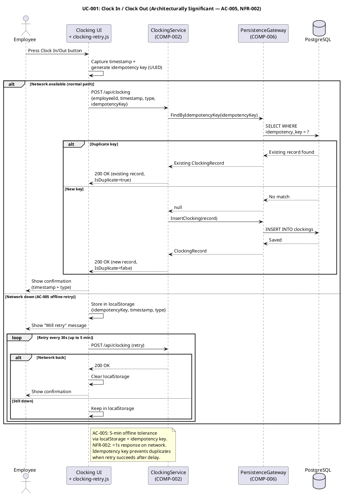
```plantuml
@startuml
title UC-001: Clock In / Clock Out (Architecturally Significant — AC-005, NFR-002)

actor Employee as EMP
participant "Clocking UI\n+ clocking-retry.js" as UI
participant "ClockingService\n(COMP-002)" as SVC
participant "PersistenceGateway\n(COMP-006)" as DB
database "PostgreSQL" as PG

EMP -> UI : Press Clock In/Out button
UI -> UI : Capture timestamp +\ngenerate idempotency key (UUID)

alt Network available (normal path)
  UI -> SVC : POST /api/clocking\n{employeeId, timestamp, type,\nidempotencyKey}
  SVC -> DB : FindByIdempotencyKey(idempotencyKey)
  DB -> PG : SELECT WHERE\nidempotency_key = ?
  
  alt Duplicate key
    PG --> DB : Existing record found
    DB --> SVC : Existing ClockingRecord
    SVC --> UI : 200 OK (existing record,\nIsDuplicate=true)
  else New key
    PG --> DB : No match
    DB --> SVC : null
    SVC -> DB : InsertClocking(record)
    DB -> PG : INSERT INTO clockings
    PG --> DB : Saved
    DB --> SVC : ClockingRecord
    SVC --> UI : 200 OK (new record,\nIsDuplicate=false)
  end
  UI --> EMP : Show confirmation\n(timestamp + type)
else Network down (AC-005 offline retry)
  UI -> UI : Store in localStorage\n{idempotencyKey, timestamp, type}
  UI --> EMP : Show "Will retry" message
  loop Retry every 30s (up to 5 min)
    UI -> SVC : POST /api/clocking (retry)
    alt Network back
      SVC --> UI : 200 OK
      UI -> UI : Clear localStorage
      UI --> EMP : Show confirmation
    else Still down
      UI -> UI : Keep in localStorage
    end
  end
end

note right of UI
  AC-005: 5-min offline tolerance
  via localStorage + idempotency key.
  NFR-002: <1s response on network.
  Idempotency key prevents duplicates
  when retry succeeds after delay.
end note

@enduml
```

### SEQ-002: UC-002 — View Own Clocking History

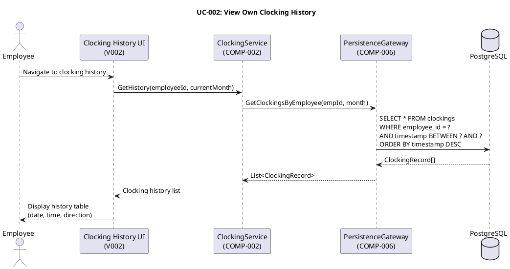
```plantuml
@startuml
title UC-002: View Own Clocking History

actor Employee as EMP
participant "Clocking History UI\n(V002)" as UI
participant "ClockingService\n(COMP-002)" as SVC
participant "PersistenceGateway\n(COMP-006)" as DB
database "PostgreSQL" as PG

EMP -> UI : Navigate to clocking history
UI -> SVC : GetHistory(employeeId, currentMonth)
SVC -> DB : GetClockingsByEmployee(empId, month)
DB -> PG : SELECT * FROM clockings\nWHERE employee_id = ?\nAND timestamp BETWEEN ? AND ?\nORDER BY timestamp DESC
PG --> DB : ClockingRecord[]
DB --> SVC : List<ClockingRecord>
SVC --> UI : Clocking history list
UI --> EMP : Display history table\n(date, time, direction)

@enduml
```

### SEQ-003: UC-003 — View All Employee Clockings

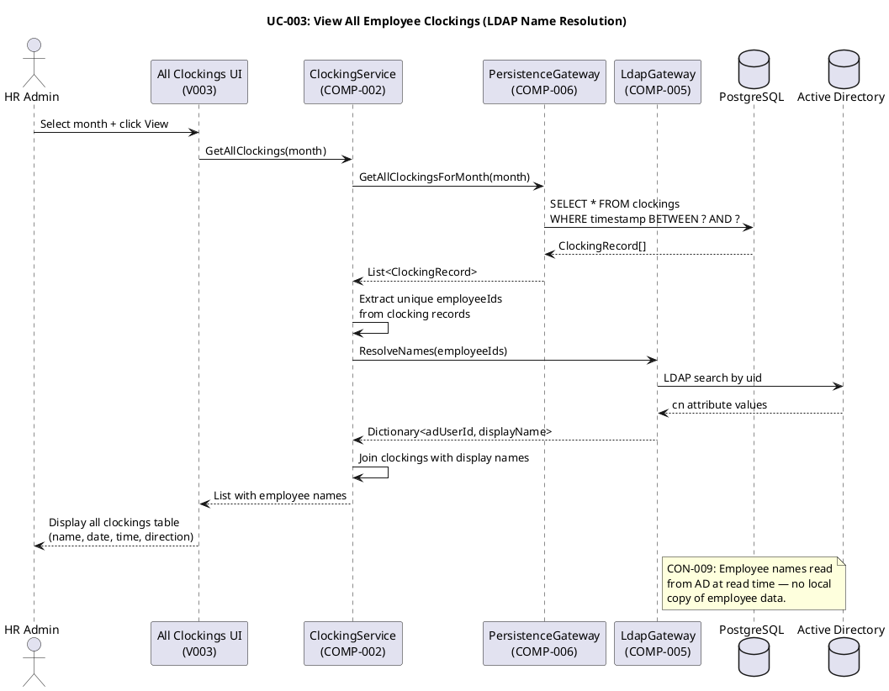
```plantuml
@startuml
title UC-003: View All Employee Clockings (LDAP Name Resolution)

actor "HR Admin" as HR
participant "All Clockings UI\n(V003)" as UI
participant "ClockingService\n(COMP-002)" as SVC
participant "PersistenceGateway\n(COMP-006)" as DB
participant "LdapGateway\n(COMP-005)" as LDAP
database "PostgreSQL" as PG
database "Active Directory" as AD

HR -> UI : Select month + click View
UI -> SVC : GetAllClockings(month)
SVC -> DB : GetAllClockingsForMonth(month)
DB -> PG : SELECT * FROM clockings\nWHERE timestamp BETWEEN ? AND ?
PG --> DB : ClockingRecord[]
DB --> SVC : List<ClockingRecord>

SVC -> SVC : Extract unique employeeIds\nfrom clocking records
SVC -> LDAP : ResolveNames(employeeIds)
LDAP -> AD : LDAP search by uid
AD --> LDAP : cn attribute values
LDAP --> SVC : Dictionary<adUserId, displayName>

SVC -> SVC : Join clockings with display names
SVC --> UI : List with employee names
UI --> HR : Display all clockings table\n(name, date, time, direction)

note right of LDAP
  CON-009: Employee names read
  from AD at read time — no local
  copy of employee data.
end note

@enduml
```

### SEQ-004: UC-004 — Export Monthly Clocking Report

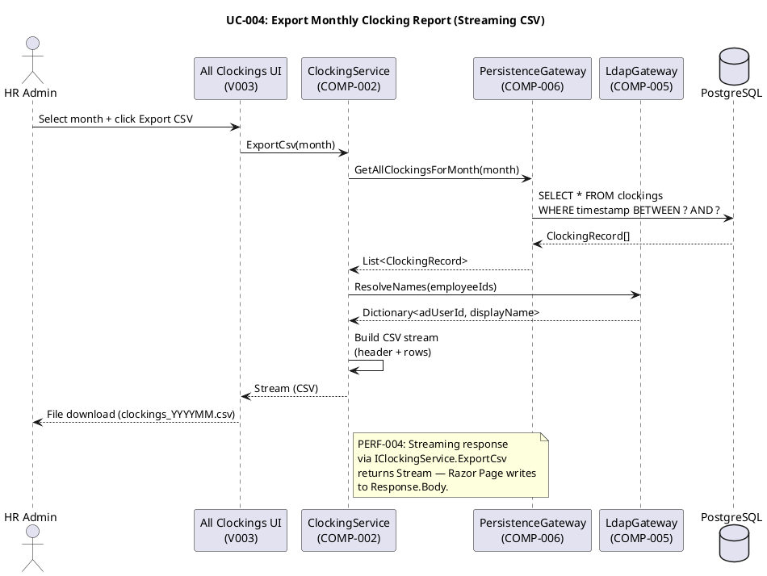
```plantuml
@startuml
title UC-004: Export Monthly Clocking Report (Streaming CSV)

actor "HR Admin" as HR
participant "All Clockings UI\n(V003)" as UI
participant "ClockingService\n(COMP-002)" as SVC
participant "PersistenceGateway\n(COMP-006)" as DB
participant "LdapGateway\n(COMP-005)" as LDAP
database "PostgreSQL" as PG

HR -> UI : Select month + click Export CSV
UI -> SVC : ExportCsv(month)
SVC -> DB : GetAllClockingsForMonth(month)
DB -> PG : SELECT * FROM clockings\nWHERE timestamp BETWEEN ? AND ?
PG --> DB : ClockingRecord[]
DB --> SVC : List<ClockingRecord>

SVC -> LDAP : ResolveNames(employeeIds)
LDAP --> SVC : Dictionary<adUserId, displayName>

SVC -> SVC : Build CSV stream\n(header + rows)
SVC --> UI : Stream (CSV)
UI --> HR : File download (clockings_YYYYMM.csv)

note right of SVC
  PERF-004: Streaming response
  via IClockingService.ExportCsv
  returns Stream — Razor Page writes
  to Response.Body.
end note

@enduml
```

### SEQ-005: UC-005 — Publish News (M1/M2 Corrected)

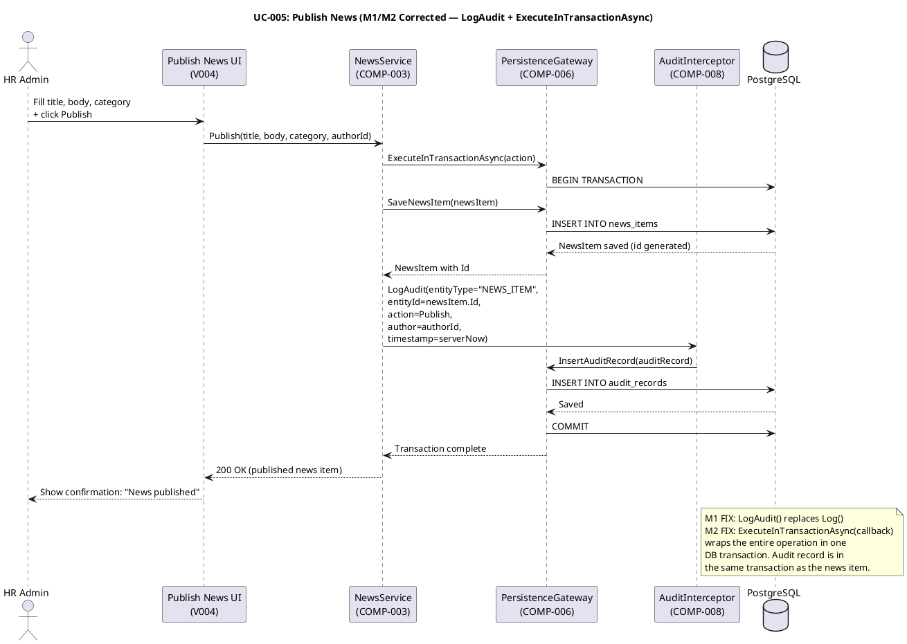
```plantuml
@startuml
title UC-005: Publish News (M1/M2 Corrected — LogAudit + ExecuteInTransactionAsync)

actor "HR Admin" as HR
participant "Publish News UI\n(V004)" as UI
participant "NewsService\n(COMP-003)" as SVC
participant "PersistenceGateway\n(COMP-006)" as DB
participant "AuditInterceptor\n(COMP-008)" as AUDIT
database "PostgreSQL" as PG

HR -> UI : Fill title, body, category\n+ click Publish
UI -> SVC : Publish(title, body, category, authorId)

SVC -> DB : ExecuteInTransactionAsync(action)
DB -> PG : BEGIN TRANSACTION

SVC -> DB : SaveNewsItem(newsItem)
DB -> PG : INSERT INTO news_items
PG --> DB : NewsItem saved (id generated)
DB --> SVC : NewsItem with Id

SVC -> AUDIT : LogAudit(entityType="NEWS_ITEM",\nentityId=newsItem.Id,\naction=Publish,\nauthor=authorId,\ntimestamp=serverNow)
AUDIT -> DB : InsertAuditRecord(auditRecord)
DB -> PG : INSERT INTO audit_records
PG --> DB : Saved

DB -> PG : COMMIT
DB --> SVC : Transaction complete

SVC --> UI : 200 OK (published news item)
UI --> HR : Show confirmation: "News published"

note right of AUDIT
  M1 FIX: LogAudit() replaces Log()
  M2 FIX: ExecuteInTransactionAsync(callback)
  wraps the entire operation in one
  DB transaction. Audit record is in
  the same transaction as the news item.
end note

@enduml
```

### SEQ-006: UC-006 — Edit Published News (M1/M2 Corrected)

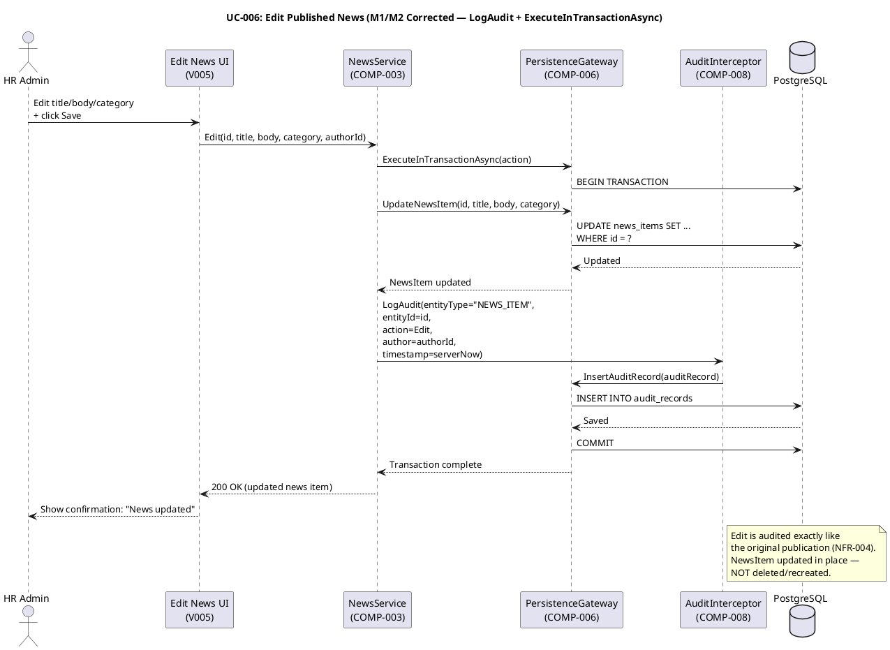
```plantuml
@startuml
title UC-006: Edit Published News (M1/M2 Corrected — LogAudit + ExecuteInTransactionAsync)

actor "HR Admin" as HR
participant "Edit News UI\n(V005)" as UI
participant "NewsService\n(COMP-003)" as SVC
participant "PersistenceGateway\n(COMP-006)" as DB
participant "AuditInterceptor\n(COMP-008)" as AUDIT
database "PostgreSQL" as PG

HR -> UI : Edit title/body/category\n+ click Save
UI -> SVC : Edit(id, title, body, category, authorId)

SVC -> DB : ExecuteInTransactionAsync(action)
DB -> PG : BEGIN TRANSACTION

SVC -> DB : UpdateNewsItem(id, title, body, category)
DB -> PG : UPDATE news_items SET ...\nWHERE id = ?
PG --> DB : Updated
DB --> SVC : NewsItem updated

SVC -> AUDIT : LogAudit(entityType="NEWS_ITEM",\nentityId=id,\naction=Edit,\nauthor=authorId,\ntimestamp=serverNow)
AUDIT -> DB : InsertAuditRecord(auditRecord)
DB -> PG : INSERT INTO audit_records
PG --> DB : Saved

DB -> PG : COMMIT
DB --> SVC : Transaction complete

SVC --> UI : 200 OK (updated news item)
UI --> HR : Show confirmation: "News updated"

note right of AUDIT
  Edit is audited exactly like
  the original publication (NFR-004).
  NewsItem updated in place —
  NOT deleted/recreated.
end note

@enduml
```

### SEQ-007: UC-007 — Unpublish News (M1/M2 Corrected)

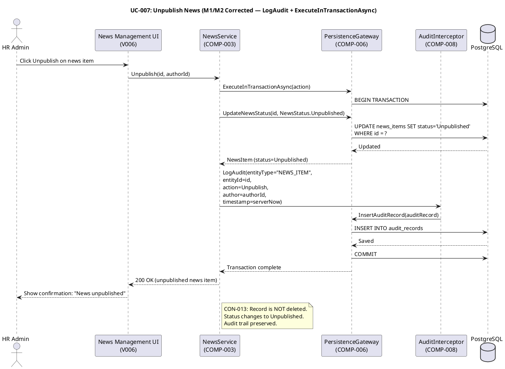
```plantuml
@startuml
title UC-007: Unpublish News (M1/M2 Corrected — LogAudit + ExecuteInTransactionAsync)

actor "HR Admin" as HR
participant "News Management UI\n(V006)" as UI
participant "NewsService\n(COMP-003)" as SVC
participant "PersistenceGateway\n(COMP-006)" as DB
participant "AuditInterceptor\n(COMP-008)" as AUDIT
database "PostgreSQL" as PG

HR -> UI : Click Unpublish on news item
UI -> SVC : Unpublish(id, authorId)

SVC -> DB : ExecuteInTransactionAsync(action)
DB -> PG : BEGIN TRANSACTION

SVC -> DB : UpdateNewsStatus(id, NewsStatus.Unpublished)
DB -> PG : UPDATE news_items SET status='Unpublished'\nWHERE id = ?
PG --> DB : Updated
DB --> SVC : NewsItem (status=Unpublished)

SVC -> AUDIT : LogAudit(entityType="NEWS_ITEM",\nentityId=id,\naction=Unpublish,\nauthor=authorId,\ntimestamp=serverNow)
AUDIT -> DB : InsertAuditRecord(auditRecord)
DB -> PG : INSERT INTO audit_records
PG --> DB : Saved

DB -> PG : COMMIT
DB --> SVC : Transaction complete

SVC --> UI : 200 OK (unpublished news item)
UI --> HR : Show confirmation: "News unpublished"

note right of SVC
  CON-013: Record is NOT deleted.
  Status changes to Unpublished.
  Audit trail preserved.
end note

@enduml
```

### SEQ-008: UC-008 — Read and Filter News

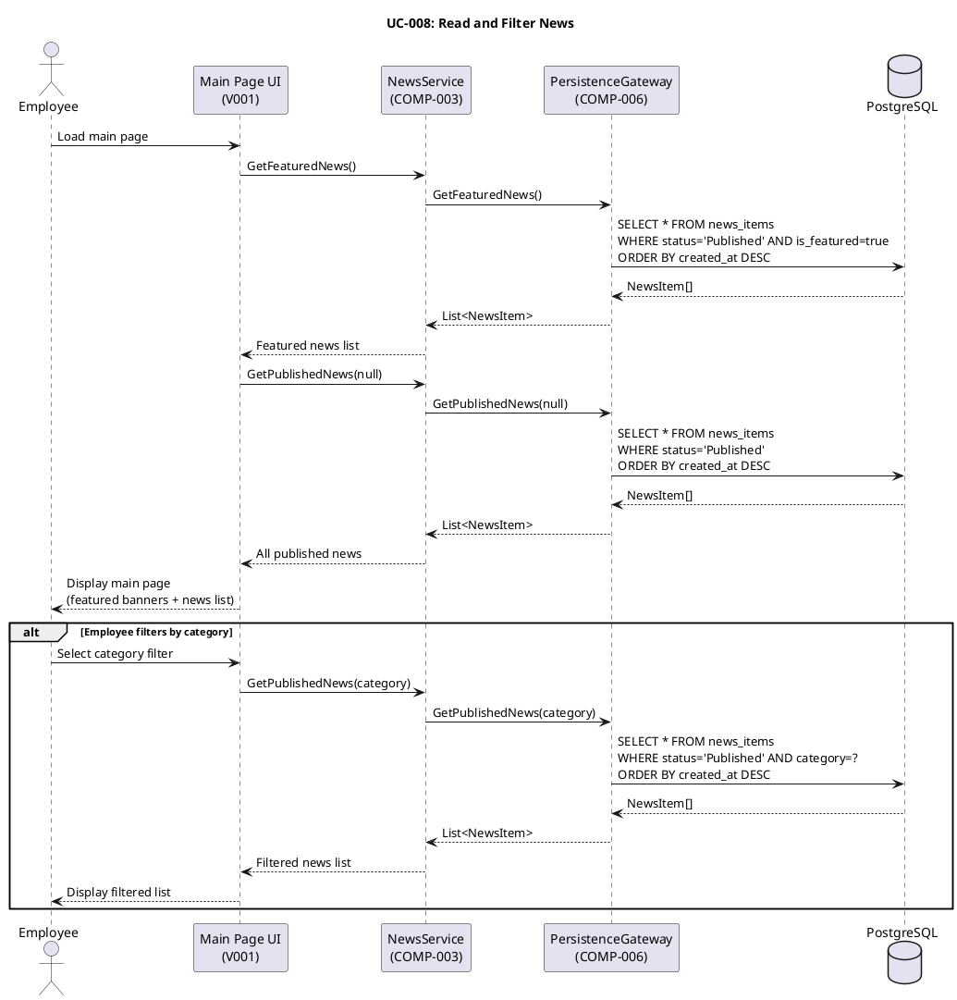
```plantuml
@startuml
title UC-008: Read and Filter News

actor Employee as EMP
participant "Main Page UI\n(V001)" as UI
participant "NewsService\n(COMP-003)" as SVC
participant "PersistenceGateway\n(COMP-006)" as DB
database "PostgreSQL" as PG

EMP -> UI : Load main page
UI -> SVC : GetFeaturedNews()
SVC -> DB : GetFeaturedNews()
DB -> PG : SELECT * FROM news_items\nWHERE status='Published' AND is_featured=true\nORDER BY created_at DESC
PG --> DB : NewsItem[]
DB --> SVC : List<NewsItem>
SVC --> UI : Featured news list

UI -> SVC : GetPublishedNews(null)
SVC -> DB : GetPublishedNews(null)
DB -> PG : SELECT * FROM news_items\nWHERE status='Published'\nORDER BY created_at DESC
PG --> DB : NewsItem[]
DB --> SVC : List<NewsItem>
SVC --> UI : All published news
UI --> EMP : Display main page\n(featured banners + news list)

alt Employee filters by category
  EMP -> UI : Select category filter
  UI -> SVC : GetPublishedNews(category)
  SVC -> DB : GetPublishedNews(category)
  DB -> PG : SELECT * FROM news_items\nWHERE status='Published' AND category=?\nORDER BY created_at DESC
  PG --> DB : NewsItem[]
  DB --> SVC : List<NewsItem>
  SVC --> UI : Filtered news list
  UI --> EMP : Display filtered list
end

@enduml
```

### SEQ-009: UC-009 — Search Employee Directory

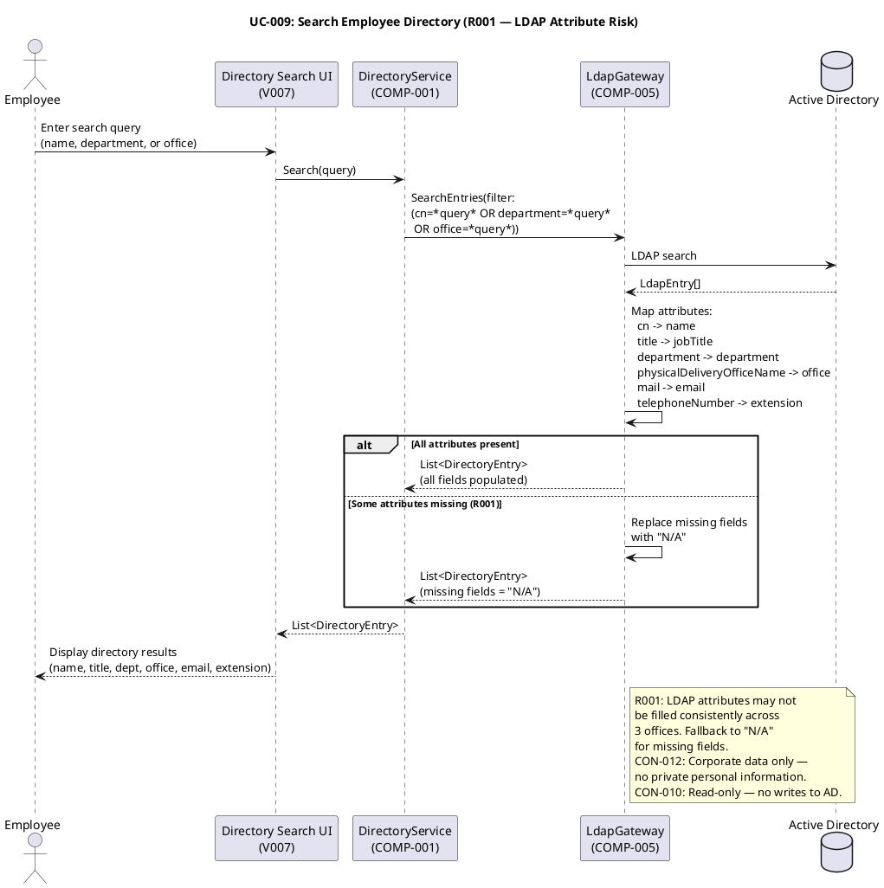
```plantuml
@startuml
title UC-009: Search Employee Directory (R001 — LDAP Attribute Risk)

actor Employee as EMP
participant "Directory Search UI\n(V007)" as UI
participant "DirectoryService\n(COMP-001)" as SVC
participant "LdapGateway\n(COMP-005)" as LDAP
database "Active Directory" as AD

EMP -> UI : Enter search query\n(name, department, or office)
UI -> SVC : Search(query)
SVC -> LDAP : SearchEntries(filter:\n(cn=*query* OR department=*query*\n OR office=*query*))
LDAP -> AD : LDAP search
AD --> LDAP : LdapEntry[]

LDAP -> LDAP : Map attributes:\n  cn -> name\n  title -> jobTitle\n  department -> department\n  physicalDeliveryOfficeName -> office\n  mail -> email\n  telephoneNumber -> extension

alt All attributes present
  LDAP --> SVC : List<DirectoryEntry>\n(all fields populated)
else Some attributes missing (R001)
  LDAP -> LDAP : Replace missing fields\nwith "N/A"
  LDAP --> SVC : List<DirectoryEntry>\n(missing fields = "N/A")
end

SVC --> UI : List<DirectoryEntry>
UI --> EMP : Display directory results\n(name, title, dept, office, email, extension)

note right of LDAP
  R001: LDAP attributes may not
  be filled consistently across
  3 offices. Fallback to "N/A"
  for missing fields.
  CON-012: Corporate data only —
  no private personal information.
  CON-010: Read-only — no writes to AD.
end note

@enduml
```

### SEQ-010: UC-010 — Manage Worker Category (M1/M2 Corrected)

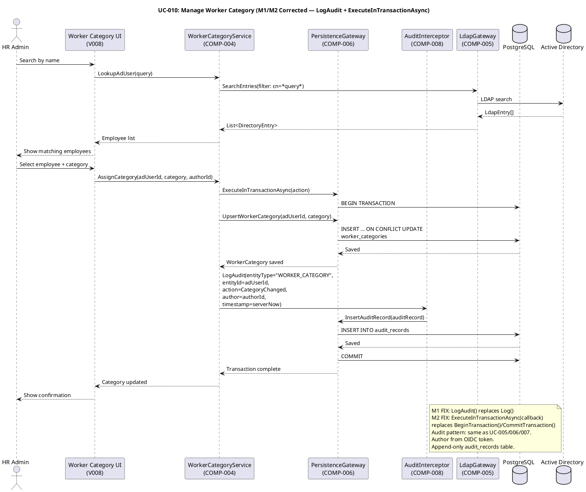
```plantuml
@startuml
title UC-010: Manage Worker Category (M1/M2 Corrected — LogAudit + ExecuteInTransactionAsync)

actor "HR Admin" as HR
participant "Worker Category UI\n(V008)" as UI
participant "WorkerCategoryService\n(COMP-004)" as SVC
participant "PersistenceGateway\n(COMP-006)" as DB
participant "AuditInterceptor\n(COMP-008)" as AUDIT
participant "LdapGateway\n(COMP-005)" as LDAP
database "PostgreSQL" as PG
database "Active Directory" as AD

HR -> UI : Search by name
UI -> SVC : LookupAdUser(query)
SVC -> LDAP : SearchEntries(filter: cn=*query*)
LDAP -> AD : LDAP search
AD --> LDAP : LdapEntry[]
LDAP --> SVC : List<DirectoryEntry>
SVC --> UI : Employee list
UI --> HR : Show matching employees

HR -> UI : Select employee + category
UI -> SVC : AssignCategory(adUserId, category, authorId)

SVC -> DB : ExecuteInTransactionAsync(action)
DB -> PG : BEGIN TRANSACTION

SVC -> DB : UpsertWorkerCategory(adUserId, category)
DB -> PG : INSERT ... ON CONFLICT UPDATE\nworker_categories
PG --> DB : Saved
DB --> SVC : WorkerCategory saved

SVC -> AUDIT : LogAudit(entityType="WORKER_CATEGORY",\nentityId=adUserId,\naction=CategoryChanged,\nauthor=authorId,\ntimestamp=serverNow)
AUDIT -> DB : InsertAuditRecord(auditRecord)
DB -> PG : INSERT INTO audit_records
PG --> DB : Saved

DB -> PG : COMMIT
DB --> SVC : Transaction complete

SVC --> UI : Category updated
UI --> HR : Show confirmation

note right of AUDIT
  M1 FIX: LogAudit() replaces Log()
  M2 FIX: ExecuteInTransactionAsync(callback)
  replaces BeginTransaction()/CommitTransaction()
  Audit pattern: same as UC-005/006/007.
  Author from OIDC token.
  Append-only audit_records table.
end note

@enduml
```
## Design Packages and Classes
### Designer Class Diagrams — Application Services (Portal.Services)

> **Contributed by:** Designer (Analysis & Design Discipline)
> **Iteration:** Construction C1 — full method signatures for Implementer handoff

```plantuml
@startuml
title Portal Cuba Corp — Portal.Services Package (Construction C1)

skinparam classAttributeIconSize 0

package "Portal.Services (Application Layer)" {

  interface "IClockingService\n(INT-001)" as INT001 {
    + RecordClocking(employeeId: string, timestamp: DateTime, type: ClockType, idempotencyKey: string) : ClockingResult
    + GetCurrentStatus(employeeId: string) : ClockStatus
    + GetHistory(employeeId: string, month: DateRange) : List<ClockingRecord>
    + GetAllClockingsForMonth(month: DateRange) : List<ClockingRecord>
    + ExportCsv(month: DateRange) : Stream
  }

  class "ClockingService\n(CLS-001)" as CLS001 {
    - _persistence : IPersistence
    - _ldap : ILdapGateway
    - _logger : ILogger<ClockingService>
    + RecordClocking(employeeId: string, timestamp: DateTime, type: ClockType, idempotencyKey: string) : ClockingResult
    + GetCurrentStatus(employeeId: string) : ClockStatus
    + GetHistory(employeeId: string, month: DateRange) : List<ClockingRecord>
    + GetAllClockingsForMonth(month: DateRange) : List<ClockingRecord>
    + ExportCsv(month: DateRange) : Stream
    - ResolveEmployeeName(employeeId: string) : string
  }

  interface "INewsService\n(INT-002)" as INT002 {
    + PublishNews(title: string, body: string, category: NewsCategory, authorId: string, isFeatured: bool) : NewsItem
    + EditNews(id: Guid, title: string, body: string, category: NewsCategory, authorId: string, isFeatured: bool) : NewsItem
    + UnpublishNews(id: Guid, authorId: string) : NewsItem
    + GetPublishedNews(category: NewsCategory?) : List<NewsItem>
    + GetFeaturedNews() : List<NewsItem>
    + GetAllNewsItems() : List<NewsItem>
    + GetNewsById(id: Guid) : NewsItem
  }

  class "NewsService\n(CLS-002)" as CLS002 {
    - _persistence : IPersistence
    - _audit : IAuditLogger
    - _logger : ILogger<NewsService>
    + PublishNews(title: string, body: string, category: NewsCategory, authorId: string, isFeatured: bool) : NewsItem
    + EditNews(id: Guid, title: string, body: string, category: NewsCategory, authorId: string, isFeatured: bool) : NewsItem
    + UnpublishNews(id: Guid, authorId: string) : NewsItem
    + GetPublishedNews(category: NewsCategory?) : List<NewsItem>
    + GetFeaturedNews() : List<NewsItem>
    + GetAllNewsItems() : List<NewsItem>
    + GetNewsById(id: Guid) : NewsItem
  }

  interface "IDirectoryService\n(INT-003)" as INT003 {
    + Search(query: string) : List<DirectoryEntry>
    + GetByAdUserId(adUserId: string) : DirectoryEntry
  }

  class "DirectoryService\n(CLS-003)" as CLS003 {
    - _ldap : ILdapGateway
    - _logger : ILogger<DirectoryService>
    + Search(query: string) : List<DirectoryEntry>
    + GetByAdUserId(adUserId: string) : DirectoryEntry
    - MapWithFallback(entry: LdapSearchResult) : DirectoryEntry
  }

  interface "IWorkerCategoryService\n(INT-004)" as INT004 {
    + AssignCategory(adUserId: string, category: string, authorId: string) : WorkerCategory
    + GetAllCategories() : List<WorkerCategory>
    + LookupAdUser(query: string) : List<DirectoryEntry>
  }

  class "WorkerCategoryService\n(CLS-004)" as CLS004 {
    - _persistence : IPersistence
    - _ldap : ILdapGateway
    - _audit : IAuditLogger
    - _logger : ILogger<WorkerCategoryService>
    + AssignCategory(adUserId: string, category: string, authorId: string) : WorkerCategory
    + GetAllCategories() : List<WorkerCategory>
    + LookupAdUser(query: string) : List<DirectoryEntry>
  }

  interface "IAuditLogger\n(INT-005)" as INT005 {
    + LogAudit(entityType: string, entityId: Guid, action: AuditAction, author: string, timestamp: DateTime) : void
  }

  class "AuditInterceptor\n(CLS-005)" as CLS005 {
    - _persistence : IPersistence
    - _logger : ILogger<AuditInterceptor>
    + LogAudit(entityType: string, entityId: Guid, action: AuditAction, author: string, timestamp: DateTime) : void
  }
}

CLS001 ..|> INT001
CLS002 ..|> INT002
CLS003 ..|> INT003
CLS004 ..|> INT004
CLS005 ..|> INT005

CLS001 --> INT007 : _persistence
CLS001 --> INT006 : _ldap
CLS002 --> INT007 : _persistence
CLS002 --> INT005 : _audit
CLS003 --> INT006 : _ldap
CLS004 --> INT007 : _persistence
CLS004 --> INT006 : _ldap
CLS004 --> INT005 : _audit
CLS005 --> INT007 : _persistence

note right of CLS001
  NFR-002: <1s response time.
  AC-005: idempotencyKey prevents
  duplicate clockings from offline retry.
  ExportCsv streams to Response.Body
  (PERF-004).
end note

note right of CLS002
  NFR-004: every publish/edit/unpublish
  calls LogAudit within
  ExecuteInTransactionAsync callback.
  CON-013: unpublish sets status,
  never deletes.
end note

note right of CLS003
  R001: MapWithFallback returns "N/A"
  for missing LDAP attributes.
  CON-012: corporate data only.
end note

note right of CLS004
  CON-009: stores only ad_user_id ->
  category (2 columns). Reads rest
  from AD at read time via ILdapGateway.
  NFR-004: audit on category change.
end note

@enduml
```

### Designer Class Diagrams — Infrastructure (Portal.Infrastructure)

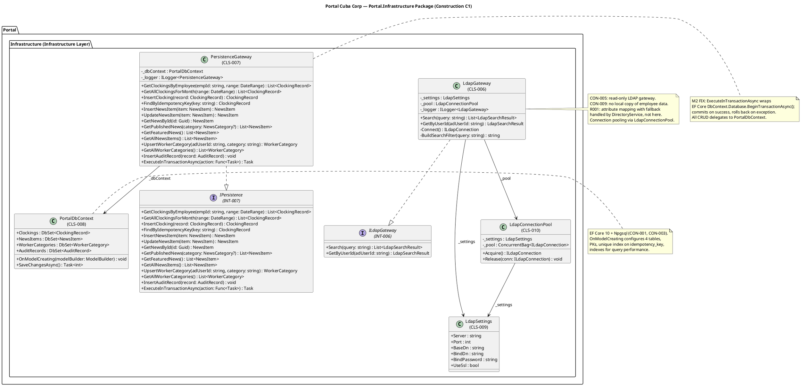
```plantuml
@startuml
title Portal Cuba Corp — Portal.Infrastructure Package (Construction C1)

skinparam classAttributeIconSize 0

package "Portal.Infrastructure (Infrastructure Layer)" {

  interface "ILdapGateway\n(INT-006)" as INT006 {
    + Search(query: string) : List<LdapSearchResult>
    + GetByUserId(adUserId: string) : LdapSearchResult
  }

  class "LdapGateway\n(CLS-006)" as CLS006 {
    - _settings : LdapSettings
    - _pool : LdapConnectionPool
    - _logger : ILogger<LdapGateway>
    + Search(query: string) : List<LdapSearchResult>
    + GetByUserId(adUserId: string) : LdapSearchResult
    - Connect() : ILdapConnection
    - BuildSearchFilter(query: string) : string
  }

  class "LdapSettings\n(CLS-009)" as CLS009 {
    + Server : string
    + Port : int
    + BaseDn : string
    + BindDn : string
    + BindPassword : string
    + UseSsl : bool
  }

  class "LdapConnectionPool\n(CLS-010)" as CLS010 {
    - _settings : LdapSettings
    - _pool : ConcurrentBag<ILdapConnection>
    + Acquire() : ILdapConnection
    + Release(conn: ILdapConnection) : void
  }

  interface "IPersistence\n(INT-007)" as INT007 {
    + GetClockingsByEmployee(empId: string, range: DateRange) : List<ClockingRecord>
    + GetAllClockingsForMonth(range: DateRange) : List<ClockingRecord>
    + InsertClocking(record: ClockingRecord) : ClockingRecord
    + FindByIdempotencyKey(key: string) : ClockingRecord
    + InsertNewsItem(item: NewsItem) : NewsItem
    + UpdateNewsItem(item: NewsItem) : NewsItem
    + GetNewsById(id: Guid) : NewsItem
    + GetPublishedNews(category: NewsCategory?) : List<NewsItem>
    + GetFeaturedNews() : List<NewsItem>
    + GetAllNewsItems() : List<NewsItem>
    + UpsertWorkerCategory(adUserId: string, category: string) : WorkerCategory
    + GetAllWorkerCategories() : List<WorkerCategory>
    + InsertAuditRecord(record: AuditRecord) : void
    + ExecuteInTransactionAsync(action: Func<Task>) : Task
  }

  class "PersistenceGateway\n(CLS-007)" as CLS007 {
    - _dbContext : PortalDbContext
    - _logger : ILogger<PersistenceGateway>
    + GetClockingsByEmployee(empId: string, range: DateRange) : List<ClockingRecord>
    + GetAllClockingsForMonth(range: DateRange) : List<ClockingRecord>
    + InsertClocking(record: ClockingRecord) : ClockingRecord
    + FindByIdempotencyKey(key: string) : ClockingRecord
    + InsertNewsItem(item: NewsItem) : NewsItem
    + UpdateNewsItem(item: NewsItem) : NewsItem
    + GetNewsById(id: Guid) : NewsItem
    + GetPublishedNews(category: NewsCategory?) : List<NewsItem>
    + GetFeaturedNews() : List<NewsItem>
    + GetAllNewsItems() : List<NewsItem>
    + UpsertWorkerCategory(adUserId: string, category: string) : WorkerCategory
    + GetAllWorkerCategories() : List<WorkerCategory>
    + InsertAuditRecord(record: AuditRecord) : void
    + ExecuteInTransactionAsync(action: Func<Task>) : Task
  }

  class "PortalDbContext\n(CLS-008)" as CLS008 {
    + Clockings : DbSet<ClockingRecord>
    + NewsItems : DbSet<NewsItem>
    + WorkerCategories : DbSet<WorkerCategory>
    + AuditRecords : DbSet<AuditRecord>
    + OnModelCreating(modelBuilder: ModelBuilder) : void
    + SaveChangesAsync() : Task<int>
  }
}

CLS006 ..|> INT006
CLS007 ..|> INT007

CLS006 --> CLS009 : _settings
CLS006 --> CLS010 : _pool
CLS010 --> CLS009 : _settings
CLS007 --> CLS008 : _dbContext

note right of CLS006
  CON-005: read-only LDAP gateway.
  CON-009: no local copy of employee data.
  R001: attribute mapping with fallback
  handled by DirectoryService, not here.
  Connection pooling via LdapConnectionPool.
end note

note right of CLS007
  M2 FIX: ExecuteInTransactionAsync wraps
  EF Core DbContext.Database.BeginTransactionAsync();
  commits on success, rolls back on exception.
  All CRUD delegates to PortalDbContext.
end note

note right of CLS008
  EF Core 10 + Npgsql (CON-001, CON-003).
  OnModelCreating configures 4 tables,
  PKs, unique index on idempotency_key,
  indexes for query performance.
end note

@enduml
```

### Designer Class Diagrams — Domain (Portal.Domain)

```plantuml
@startuml
title Portal Cuba Corp — Portal.Domain Package (Construction C1)

skinparam classAttributeIconSize 0

package "Portal.Domain (Domain Layer)" {

  enum "ClockType\n(CLS-011)" as CLS011 {
    In
    Out
  }

  enum "ClockStatus\n(CLS-012)" as CLS012 {
    NotClockedIn
    ClockedIn
  }

  enum "NewsCategory\n(CLS-013)" as CLS013 {
    General
    HR
    IT
    Events
  }

  enum "NewsStatus\n(CLS-014)" as CLS014 {
    Draft
    Published
    Unpublished
  }

  enum "AuditAction\n(CLS-015)" as CLS015 {
    NewsPublished
    NewsEdited
    NewsUnpublished
    CategoryChanged
  }

  class "ClockingRecord\n(CLS-016)" as CLS016 {
    + Id : Guid
    + EmployeeId : string
    + Timestamp : DateTime
    + ClockType : ClockType
    + IdempotencyKey : string
    + CreatedAt : DateTime
  }

  class "NewsItem\n(CLS-017)" as CLS017 {
    + Id : Guid
    + Title : string
    + Body : string
    + Category : NewsCategory
    + Status : NewsStatus
    + CreatedBy : string
    + CreatedAt : DateTime
    + UpdatedBy : string?
    + UpdatedAt : DateTime?
    + IsFeatured : bool
  }

  class "WorkerCategory\n(CLS-018)" as CLS018 {
    + AdUserId : string
    + Category : string
    + UpdatedBy : string
    + UpdatedAt : DateTime
  }

  class "AuditRecord\n(CLS-019)" as CLS019 {
    + Id : Guid
    + EntityType : string
    + EntityId : Guid
    + Action : AuditAction
    + Author : string
    + Timestamp : DateTime
  }

  class "DirectoryEntry\n(CLS-020)" as CLS020 {
    + AdUserId : string
    + Name : string
    + JobTitle : string
    + Department : string
    + Office : string
    + Email : string
    + Extension : string
  }

  class "DateRange\n(CLS-021)" as CLS021 {
    + Start : DateTime
    + End : DateTime
    + Contains(date: DateTime) : bool
  }

  class "ClockingResult\n(CLS-022)" as CLS022 {
    + Success : bool
    + Record : ClockingRecord?
    + IsDuplicate : bool
    + ErrorMessage : string?
  }

  class "LdapSearchResult\n(CLS-023)" as CLS023 {
    + DistinguishedName : string
    + Attributes : Dictionary<string, string>
    + GetAttribute(name: string, fallback: string) : string
  }
}

CLS016 --> CLS011 : ClockType
CLS017 --> CLS013 : Category
CLS017 --> CLS014 : Status
CLS019 --> CLS015 : Action
CLS022 --> CLS016 : Record

note right of CLS016
  Maps to T1 (clockings).
  IdempotencyKey has unique index
  (AC-005 offline retry dedup).
  EmployeeId from OIDC token subject.
end note

note right of CLS017
  Maps to T2 (news_items).
  CON-013: Status=Unpublished hides
  but never deletes. UpdatedBy/At
  track edit history (NFR-004).
end note

note right of CLS018
  Maps to T3 (worker_categories).
  CON-009: only AdUserId + Category
  stored locally. Two columns + audit
  metadata. Rest read from AD.
end note

note right of CLS019
  Maps to T4 (audit_records).
  Append-only -- never updated or
  deleted (NFR-004).
end note

note right of CLS020
  NOT persisted -- projected from AD
  at read time (CON-009, CON-012).
  Corporate data only.
end note

note right of CLS023
  Raw LDAP result from ILdapGateway.
  GetAttribute returns fallback ("N/A")
  when attribute is missing (R001).
end note

@enduml
```

### Subsystem Interface Dependencies

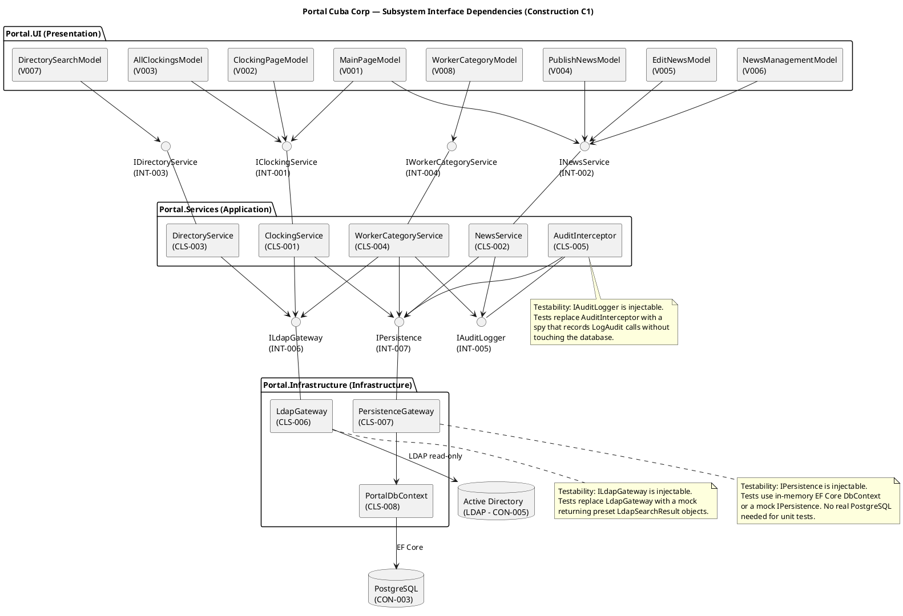
```plantuml
@startuml
title Portal Cuba Corp — Subsystem Interface Dependencies (Construction C1)

skinparam componentStyle rectangle
skinparam classAttributeIconSize 0

package "Portal.UI (Presentation)" {
  component "ClockingPageModel\n(V002)" as V002
  component "MainPageModel\n(V001)" as V001
  component "AllClockingsModel\n(V003)" as V003
  component "PublishNewsModel\n(V004)" as V004
  component "EditNewsModel\n(V005)" as V005
  component "NewsManagementModel\n(V006)" as V006
  component "DirectorySearchModel\n(V007)" as V007
  component "WorkerCategoryModel\n(V008)" as V008
}

package "Portal.Services (Application)" {
  component "ClockingService\n(CLS-001)" as SVC1
  component "NewsService\n(CLS-002)" as SVC2
  component "DirectoryService\n(CLS-003)" as SVC3
  component "WorkerCategoryService\n(CLS-004)" as SVC4
  component "AuditInterceptor\n(CLS-005)" as SVC5
}

package "Portal.Infrastructure (Infrastructure)" {
  component "LdapGateway\n(CLS-006)" as INF1
  component "PersistenceGateway\n(CLS-007)" as INF2
  component "PortalDbContext\n(CLS-008)" as INF3
}

database "PostgreSQL\n(CON-003)" as PG
database "Active Directory\n(LDAP - CON-005)" as AD

interface "IClockingService\n(INT-001)" as I1
interface "INewsService\n(INT-002)" as I2
interface "IDirectoryService\n(INT-003)" as I3
interface "IWorkerCategoryService\n(INT-004)" as I4
interface "IAuditLogger\n(INT-005)" as I5
interface "ILdapGateway\n(INT-006)" as I6
interface "IPersistence\n(INT-007)" as I7

V001 --> I1
V001 --> I2
V002 --> I1
V003 --> I1
V004 --> I2
V005 --> I2
V006 --> I2
V007 --> I3
V008 --> I4

SVC1 -up- I1
SVC2 -up- I2
SVC3 -up- I3
SVC4 -up- I4
SVC5 -up- I5

SVC1 --> I7
SVC1 --> I6
SVC2 --> I7
SVC2 --> I5
SVC3 --> I6
SVC4 --> I7
SVC4 --> I6
SVC4 --> I5
SVC5 --> I7

INF1 -up- I6
INF2 -up- I7

INF2 --> INF3
INF1 --> AD : LDAP read-only
INF3 --> PG : EF Core

note bottom of SVC5
  Testability: IAuditLogger is injectable.
  Tests replace AuditInterceptor with a
  spy that records LogAudit calls without
  touching the database.
end note

note bottom of INF1
  Testability: ILdapGateway is injectable.
  Tests replace LdapGateway with a mock
  returning preset LdapSearchResult objects.
end note

note bottom of INF2
  Testability: IPersistence is injectable.
  Tests use in-memory EF Core DbContext
  or a mock IPersistence. No real PostgreSQL
  needed for unit tests.
end note

@enduml
```

### UI View/Controller Classes

> **Contributed by:** User-Interface Designer (Analysis & Design Discipline)
> **Purpose:** UI view classes (Razor Page Models) and controller classes (page handlers) for each UC of UI significance. These define the UI layer structure that the Designer and Implementer must follow. Class-level implementation details (method bodies, DI wiring) belong to the Designer — this section defines the UI interaction structure only.

The following class diagram defines the UI view classes (stereotyped `<<view>>`) and their associated controller/handler classes (stereotyped `<<controller>>`). Each view class maps to a Razor Page and traces to one or more use cases.

```plantuml
@startuml
title Portal Cuba Corp — UI View/Controller Classes

skinparam classAttributeIconSize 0

package "UI Layer (Razor Pages)" {
  class "MainPageModel" as V001 <<view>> {
    + OnGetAsync() : Task
    + ClockingStatus : ClockStatus
    + NewsItems : List<NewsItem>
    + FeaturedNews : List<NewsItem>
  }
  
  class "ClockingPageModel" as V002 <<view>> {
    + OnGetAsync() : Task
    + ClockingHistory : List<ClockingRecord>
  }
  
  class "AllClockingsModel" as V003 <<view>> {
    + OnGetAsync() : Task
    + OnPostExportAsync(month) : FileResult
    + Clockings : List<ClockingRecord>
    + SelectedMonth : DateTime
  }
  
  class "PublishNewsModel" as V004 <<view>> {
    + OnGetAsync() : Task
    + OnPostAsync(newsItem) : ActionResult
    + NewsItem : NewsItem
  }
  
  class "EditNewsModel" as V005 <<view>> {
    + OnGetAsync(id) : Task
    + OnPostAsync(newsItem) : ActionResult
    + NewsItem : NewsItem
  }
  
  class "NewsManagementModel" as V006 <<view>> {
    + OnGetAsync() : Task
    + OnPostUnpublishAsync(id) : ActionResult
    + NewsItems : List<NewsItem>
  }
  
  class "DirectorySearchModel" as V007 <<view>> {
    + OnGetAsync() : Task
    + OnPostAsync(criteria) : ActionResult
    + SearchCriteria : DirectorySearchCriteria
    + Results : List<DirectoryEntry>
  }
  
  class "WorkerCategoryModel" as V008 <<view>> {
    + OnGetAsync() : Task
    + OnPostAsync(adUserId, category) : ActionResult
    + Categories : List<WorkerCategory>
    + AdUserResults : List<DirectoryEntry>
  }
}

V001 --> IClockingService : inject
V001 --> INewsService : inject
V002 --> IClockingService : inject
V003 --> IClockingService : inject
V004 --> INewsService : inject
V005 --> INewsService : inject
V006 --> INewsService : inject
V007 --> IDirectoryService : inject
V008 --> IWorkerCategoryService : inject

@enduml
```

### UI Accessibility Rules

| ID | Rule | Source |
|---|---|---|
| UIA-001 | All interactive elements (buttons, links, form fields) are keyboard-navigable. Tab order follows visual order. | WCAG 2.1 — Operable |
| UIA-002 | Color is never the sole indicator of status or category. Text labels accompany all color-coded elements. | WCAG 2.1 — Perceivable; R001 fallback |
| UIA-003 | Form fields have associated `<label>` elements. Error messages are programmatically associated with their fields. | WCAG 2.1 — Understandable |
| UIA-004 | Missing AD attributes display "N/A" text, not blank cells or red indicators. | R001 fallback; WCAG 2.1 — Robust |
| UIA-005 | Page uses semantic HTML structure (header, nav, main, section, footer). | WCAG 2.1 — Robust |

> **Note:** No specific accessibility standard (WCAG, EN 301 549, Section 508) was declared by the stakeholder in the Work Order. The rules above are baseline good practice derived from WCAG 2.1 principles. If the stakeholder declares a specific compliance level, these rules must be updated to reference it explicitly.
## Interface Contracts
All subsystem boundaries are defined by interfaces. No concrete class is referenced across a subsystem boundary — services depend on interfaces, not implementations.

### Iteration 2 — M1/M2 Resolution

Two Major findings from the E1 PR Code Review (M1: IAuditLogger signature mismatch, M2: IPersistence transaction API mismatch) are resolved below. The implementation diverged from the Design Model for valid .NET 10 / EF Core idiomatic reasons. Per the lesson learned ("Design Model must be updated when implementation diverges for good reason — silent divergence is always a finding"), the Design Model is updated to match the implementation's valid choices.

| Finding | Root Cause | Resolution |
|---|---|---|
| M1 — IAuditLogger (INT-005) | Design Model specified `Log()`; implementation uses `LogAudit()` | `Log()` collides with `Microsoft.Extensions.Logging.ILogger.Log()` in .NET 10. `LogAudit()` is the correct idiom. Design Model updated to `LogAudit`. |
| M2 — IPersistence (INT-007) | Design Model specified `BeginTransaction()` / `CommitTransaction()`; implementation does not expose them | EF Core `DbContext.Database.BeginTransaction()` already provides transaction management. Re-exposing via `IPersistence` is redundant. Replaced with `ExecuteInTransactionAsync(Func<Task> action)` — callback pattern that wraps EF Core transaction, keeps `IPersistence` mockable, and hides `DbContext` from services. |

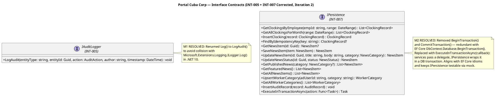
```plantuml
@startuml
title Portal Cuba Corp — Interface Contracts (INT-005 + INT-007 Corrected, Iteration 2)

skinparam classAttributeIconSize 0

interface "IAuditLogger\n(INT-005)" as INT005 {
  + LogAudit(entityType: string, entityId: Guid, action: AuditAction, author: string, timestamp: DateTime) : void
}

interface "IPersistence\n(INT-007)" as INT007 {
  + GetClockingsByEmployee(empId: string, range: DateRange) : List<ClockingRecord>
  + GetAllClockingsForMonth(range: DateRange) : List<ClockingRecord>
  + InsertClocking(record: ClockingRecord) : ClockingRecord
  + FindByIdempotencyKey(key: string) : ClockingRecord?
  + GetNewsItem(id: Guid) : NewsItem?
  + SaveNewsItem(item: NewsItem) : NewsItem
  + UpdateNewsItem(id: Guid, title: string, body: string, category: NewsCategory) : NewsItem
  + UpdateNewsStatus(id: Guid, status: NewsStatus) : NewsItem
  + GetPublishedNews(category: NewsCategory?) : List<NewsItem>
  + GetFeaturedNews() : List<NewsItem>
  + GetAllNewsItems() : List<NewsItem>
  + UpsertWorkerCategory(adUserId: string, category: string) : WorkerCategory
  + GetAllWorkerCategories() : List<WorkerCategory>
  + InsertAuditRecord(record: AuditRecord) : void
  + ExecuteInTransactionAsync(action: Func<Task>) : Task
}

note right of INT005
  M1 RESOLVED: Renamed Log() to LogAudit()
  to avoid collision with
  Microsoft.Extensions.Logging.ILogger.Log()
  in .NET 10.
end note

note right of INT007
  M2 RESOLVED: Removed BeginTransaction()
  and CommitTransaction() — redundant with
  EF Core DbContext.Database.BeginTransaction().
  Replaced with ExecuteInTransactionAsync(callback):
  services pass a delegate, IPersistence wraps it
  in a DB transaction. Aligns with EF Core idioms
  and keeps IPersistence testable via mock.
end note

@enduml
```

### INT-001: IClockingService (COMP-002)

| Operation | Signature | Precondition | Postcondition |
|---|---|---|---|
| RecordClocking | `ClockingResult RecordClocking(string employeeId, DateTime timestamp, ClockType type, string idempotencyKey)` | employeeId is authenticated OIDC subject; idempotencyKey is non-empty UUID | If idempotencyKey exists, returns existing record with IsDuplicate=true; otherwise inserts new ClockingRecord and returns Success=true |
| GetCurrentStatus | `ClockStatus GetCurrentStatus(string employeeId)` | employeeId is authenticated | Returns ClockedIn if last record is ClockType.In; ClockedOut otherwise or if no records exist |
| GetHistory | `List<ClockingRecord> GetHistory(string employeeId, DateRange month)` | employeeId matches authenticated user (or HR role) | Returns clockings for the specified employee within the date range, ordered by timestamp |
| GetAllClockings | `List<ClockingRecord> GetAllClockings(DateRange month)` | Caller has HR role | Returns all clockings for all employees within the date range |
| ExportCsv | `Stream ExportCsv(DateRange month)` | Caller has HR role | Returns CSV stream with header row: Employee,Date,TimeIn,TimeOut,Direction |

### INT-002: INewsService (COMP-003)

| Operation | Signature | Precondition | Postcondition |
|---|---|---|---|
| Publish | `NewsItem Publish(string title, string body, NewsCategory category, string authorId)` | Caller has HR role; title and body non-empty | NewsItem saved with Status=Published; AuditRecord created with Action=Publish, Author=authorId, Timestamp=server now |
| Edit | `NewsItem Edit(Guid id, string title, string body, NewsCategory category, string authorId)` | Caller has HR role; NewsItem with id exists | NewsItem updated in place (not deleted/recreated); AuditRecord created with Action=Edit |
| Unpublish | `NewsItem Unpublish(Guid id, string authorId)` | Caller has HR role; NewsItem with id exists | NewsItem.Status set to Unpublished; record NOT deleted (CON-013); AuditRecord created with Action=Unpublish |
| GetById | `NewsItem GetById(Guid id)` | Caller has HR role (for unpublished) or any authenticated (for published) | Returns NewsItem or null if not found |
| GetPublishedNews | `List<NewsItem> GetPublishedNews(NewsCategory? category)` | Any authenticated user | Returns only Status=Published items, ordered by CreatedAt DESC; filtered by category if provided |
| GetFeaturedNews | `List<NewsItem> GetFeaturedNews()` | Any authenticated user | Returns Status=Published AND IsFeatured=true items, ordered by CreatedAt DESC |
| ListAll | `List<NewsItem> ListAll()` | Caller has HR role | Returns all news items regardless of status, ordered by CreatedAt DESC |

### INT-003: IDirectoryService (COMP-001)

| Operation | Signature | Precondition | Postcondition |
|---|---|---|---|
| Search | `List<DirectoryEntry> Search(string query)` | Any authenticated user; query non-empty | Returns DirectoryEntry list from AD via LDAP; missing attributes default to "N/A" (R001 fallback); no private data (CON-012) |

### INT-004: IWorkerCategoryService (COMP-004)

| Operation | Signature | Precondition | Postcondition |
|---|---|---|---|
| AssignCategory | `WorkerCategory AssignCategory(string adUserId, string category, string authorId)` | Caller has HR role; adUserId exists in AD; category is valid | WorkerCategory upserted (adUserId + category only); AuditRecord created with Action=CategoryChanged |
| ListCategories | `List<WorkerCategory> ListCategories()` | Caller has HR role | Returns all worker category records from local DB |
| LookupAdUser | `List<DirectoryEntry> LookupAdUser(string query)` | Caller has HR role | Returns DirectoryEntry list from AD matching query (for HR to find AD user id before assigning category) |

### INT-005: IAuditLogger (COMP-008) — M1 RESOLVED (Iteration 2)

> **M1 Resolution:** Method renamed from `Log()` to `LogAudit()` to avoid collision with `Microsoft.Extensions.Logging.ILogger.Log()` in .NET 10. The implementation's divergence was valid — the Design Model is updated to match.

| Operation | Signature | Precondition | Postcondition |
|---|---|---|---|
| LogAudit | `void LogAudit(string entityType, Guid entityId, AuditAction action, string author, DateTime timestamp)` | Called within an active DB transaction (via `IPersistence.ExecuteInTransactionAsync`) | AuditRecord inserted into audit_records table (append-only, never updated or deleted) |

### INT-006: ILdapGateway (COMP-005)

| Operation | Signature | Precondition | Postcondition |
|---|---|---|---|
| SearchEntries | `List<LdapSearchResult> SearchEntries(string filter)` | LDAP connection pool has available connection | Returns LDAP search results; read-only (no writes to AD per CON-010) |
| GetEntryByUserId | `LdapSearchResult? GetEntryByUserId(string adUserId)` | adUserId non-empty | Returns LDAP entry for user or null if not found |
| ResolveNames | `Dictionary<string, string> ResolveNames(List<string> adUserIds)` | adUserIds non-empty list | Returns mapping of adUserId → display name from AD cn attribute |

### INT-007: IPersistence (COMP-006) — M2 RESOLVED (Iteration 2)

> **M2 Resolution:** Removed `BeginTransaction()` / `CommitTransaction()` — redundant with EF Core `DbContext.Database.BeginTransaction()`. Replaced with `ExecuteInTransactionAsync(Func<Task> action)` callback pattern: services pass a delegate, `IPersistence` wraps it in a DB transaction. This aligns with EF Core idioms, keeps `IPersistence` mockable in tests, and hides `DbContext` from the application layer.

| Operation | Signature | Precondition | Postcondition |
|---|---|---|---|
| GetClockingsByEmployee | `List<ClockingRecord> GetClockingsByEmployee(string empId, DateRange range)` | empId non-empty | Returns clockings for employee within range |
| GetAllClockingsForMonth | `List<ClockingRecord> GetAllClockingsForMonth(DateRange range)` | — | Returns all clockings within range |
| InsertClocking | `ClockingRecord InsertClocking(ClockingRecord record)` | record.IdempotencyKey is unique | Inserts and returns saved record; unique constraint enforced by DB index |
| FindByIdempotencyKey | `ClockingRecord? FindByIdempotencyKey(string key)` | key non-empty | Returns existing record or null |
| GetNewsItem | `NewsItem? GetNewsItem(Guid id)` | — | Returns NewsItem or null |
| SaveNewsItem | `NewsItem SaveNewsItem(NewsItem item)` | item non-null | Inserts new NewsItem, returns with generated Id |
| UpdateNewsItem | `NewsItem UpdateNewsItem(Guid id, string title, string body, NewsCategory category)` | NewsItem with id exists | Updates title/body/category; does NOT change status |
| UpdateNewsStatus | `NewsItem UpdateNewsStatus(Guid id, NewsStatus status)` | NewsItem with id exists | Updates status only; record preserved (no delete per CON-013) |
| GetPublishedNews | `List<NewsItem> GetPublishedNews(NewsCategory? category)` | — | Returns Status=Published items, optionally filtered by category |
| GetFeaturedNews | `List<NewsItem> GetFeaturedNews()` | — | Returns Status=Published AND IsFeatured=true |
| GetAllNewsItems | `List<NewsItem> GetAllNewsItems()` | — | Returns all news items regardless of status |
| UpsertWorkerCategory | `WorkerCategory UpsertWorkerCategory(string adUserId, string category)` | adUserId non-empty | Inserts or updates worker_categories row (2 columns only per CON-009) |
| GetAllWorkerCategories | `List<WorkerCategory> GetAllWorkerCategories()` | — | Returns all worker category records |
| InsertAuditRecord | `void InsertAuditRecord(AuditRecord record)` | Called within active transaction | Appends audit record (never updated or deleted) |
| ExecuteInTransactionAsync | `Task ExecuteInTransactionAsync(Func<Task> action)` | — | Wraps `action` in a DB transaction via EF Core `DbContext.Database.BeginTransactionAsync()`; commits on success, rolls back on exception |
## Persistent Data Classes
> **Contributed by:** Database Designer (Analysis & Design Discipline)
> **Persistence Engine:** PostgreSQL (CON-003 — declared by stakeholder)
> **ORM:** EF Core 10 + Npgsql (CON-001, CON-003)
> **Design Mechanism:** Repository + Unit of Work via PortalDbContext (SAD Logical View)
> **Iteration 2:** Aligned with M1/M2 resolution — `IAuditLogger.LogAudit()` and `IPersistence.ExecuteInTransactionAsync()` reflected in mechanism chain.

EF Core entity classes map to PostgreSQL tables. The PortalDbContext configures all mappings, constraints, and indexes in OnModelCreating. The schema is minimal — 4 tables — because employee data is read from AD at read time (CON-009) and authentication is handled by Keycloak (CON-004). No local user table exists.

### Schema Organization

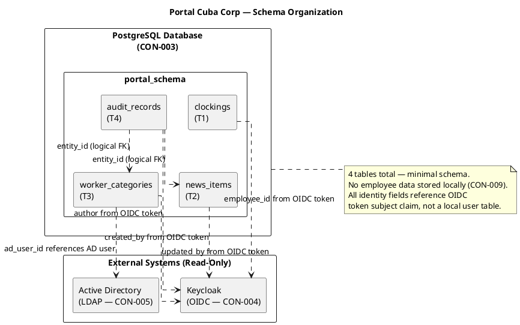
```plantuml
@startuml
title Portal Cuba Corp — Schema Organization

skinparam packageStyle rectangle
skinparam linetype ortho

package "PostgreSQL Database\n(CON-003)" as DB {

  package "portal_schema" {
    rectangle "clockings\n(T1)" as T1
    rectangle "news_items\n(T2)" as T2
    rectangle "worker_categories\n(T3)" as T3
    rectangle "audit_records\n(T4)" as T4
  }
}

package "External Systems (Read-Only)" {
  rectangle "Active Directory\n(LDAP — CON-005)" as AD
  rectangle "Keycloak\n(OIDC — CON-004)" as KC
}

T4 ..> T2 : entity_id (logical FK)
T4 ..> T3 : entity_id (logical FK)
T1 ..> KC : employee_id from OIDC token
T2 ..> KC : created_by from OIDC token
T3 ..> KC : updated_by from OIDC token
T4 ..> KC : author from OIDC token
T3 ..> AD : ad_user_id references AD user

note bottom of DB
  4 tables total — minimal schema.
  No employee data stored locally (CON-009).
  All identity fields reference OIDC
  token subject claim, not a local user table.
end note

@enduml
```

### Entity-to-Table Mapping (<<table>> Class Diagram)

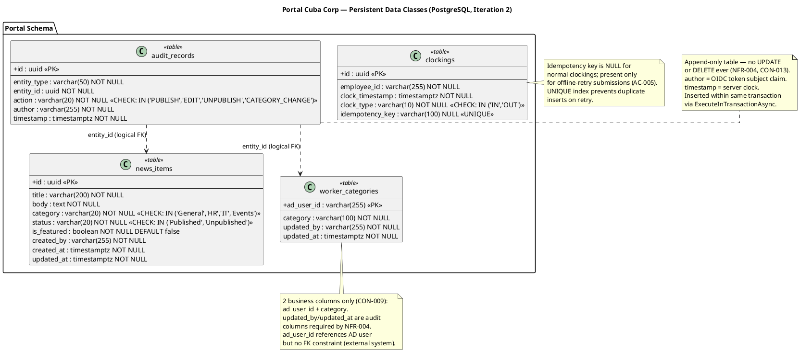
```plantuml
@startuml
title Portal Cuba Corp — Persistent Data Classes (PostgreSQL, Iteration 2)

skinparam classAttributeIconSize 0
skinparam linetype ortho

package "Portal Schema" {

  class "clockings" as T1 <<table>> {
    + id : uuid <<PK>>
    --
    employee_id : varchar(255) NOT NULL
    clock_timestamp : timestamptz NOT NULL
    clock_type : varchar(10) NOT NULL <<CHECK: IN ('IN','OUT')>>
    idempotency_key : varchar(100) NULL <<UNIQUE>>
  }

  class "news_items" as T2 <<table>> {
    + id : uuid <<PK>>
    --
    title : varchar(200) NOT NULL
    body : text NOT NULL
    category : varchar(20) NOT NULL <<CHECK: IN ('General','HR','IT','Events')>>
    status : varchar(20) NOT NULL <<CHECK: IN ('Published','Unpublished')>>
    is_featured : boolean NOT NULL DEFAULT false
    created_by : varchar(255) NOT NULL
    created_at : timestamptz NOT NULL
    updated_at : timestamptz NOT NULL
  }

  class "worker_categories" as T3 <<table>> {
    + ad_user_id : varchar(255) <<PK>>
    --
    category : varchar(100) NOT NULL
    updated_by : varchar(255) NOT NULL
    updated_at : timestamptz NOT NULL
  }

  class "audit_records" as T4 <<table>> {
    + id : uuid <<PK>>
    --
    entity_type : varchar(50) NOT NULL
    entity_id : uuid NOT NULL
    action : varchar(20) NOT NULL <<CHECK: IN ('PUBLISH','EDIT','UNPUBLISH','CATEGORY_CHANGE')>>
    author : varchar(255) NOT NULL
    timestamp : timestamptz NOT NULL
  }
}

T4 ..> T2 : entity_id (logical FK)
T4 ..> T3 : entity_id (logical FK)

note right of T1
  Idempotency key is NULL for
  normal clockings; present only
  for offline-retry submissions (AC-005).
  UNIQUE index prevents duplicate
  inserts on retry.
end note

note right of T4
  Append-only table — no UPDATE
  or DELETE ever (NFR-004, CON-013).
  author = OIDC token subject claim.
  timestamp = server clock.
  Inserted within same transaction
  via ExecuteInTransactionAsync.
end note

note bottom of T3
  2 business columns only (CON-009):
  ad_user_id + category.
  updated_by/updated_at are audit
  columns required by NFR-004.
  ad_user_id references AD user
  but no FK constraint (external system).
end note

@enduml
```

### O/R Mapping Specification

| Design Class | Table | Identity Strategy | Loading | Notes |
|---|---|---|---|---|
| CLS-016 (ClockingRecord) | T1 (clockings) | UUID surrogate PK (`id`); `idempotency_key` nullable with UNIQUE index for offline retry (AC-005) | Eager — always loaded with all columns | `clock_type` mapped to CLS-011 (ClockType enum); `employee_id` from OIDC token subject, no FK (no local user table) |
| CLS-017 (NewsItem) | T2 (news_items) | UUID surrogate PK (`id`) | Eager for single-item views; paged query for list views | `category` mapped to CLS-013 (NewsCategory enum); `status` mapped to CLS-014 (NewsStatus enum); `is_featured` boolean for featured banner (FR-008); `created_by` from OIDC token subject |
| CLS-018 (WorkerCategory) | T3 (worker_categories) | Natural PK (`ad_user_id`) — no surrogate key per CON-009 ("two columns and nothing else") | Eager — small table (<200 rows) | `ad_user_id` is both PK and the link to AD; no FK constraint (external system); `updated_by` from OIDC token subject; audit columns (updated_by, updated_at) required by NFR-004 but are NOT the 2 business columns CON-009 limits — they are metadata columns |
| CLS-019 (AuditRecord) | T4 (audit_records) | UUID surrogate PK (`id`) | Eager — always loaded with all columns | Append-only: no UPDATE or DELETE ever (NFR-004, CON-013); `action` mapped to CLS-015 (AuditAction enum); `entity_id` is a logical FK to T2 or T3 (no physical FK — polymorphic reference); `author` from OIDC token subject; inserted via `IAuditLogger.LogAudit()` within `IPersistence.ExecuteInTransactionAsync()` callback — same transaction as the audited operation |
| CLS-020 (DirectoryEntry) | (not persisted) | N/A | N/A | Projected from AD at read time (CON-009); no table mapping |

### Index Strategy

| Index | Table | Columns | Type | Justified By |
|---|---|---|---|---|
| `ix_clockings_employee_timestamp` | T1 | (employee_id, clock_timestamp DESC) | B-tree composite | UC-002: employee views own history by month; NFR-002: <1s response — index covers the filter+sort |
| `ux_clockings_idempotency_key` | T1 | (idempotency_key) | B-tree UNIQUE | AC-005: offline retry idempotency — duplicate POST rejected by constraint, not application logic |
| `ix_clockings_timestamp` | T1 | (clock_timestamp) | B-tree | UC-003/UC-004: HR views all clockings for a month — range scan on timestamp |
| `ix_news_items_status_published_date` | T2 | (status, created_at DESC) | B-tree composite | UC-008: employees see published news sorted by date; NFR-001: <3s page load — covering index for the main page feed |
| `ix_news_items_status_featured_date` | T2 | (status, is_featured, created_at DESC) | B-tree composite | UC-008: featured news banner — filter Published + IsFeatured, sorted by date |
| `ix_news_items_category_status_date` | T2 | (category, status, created_at DESC) | B-tree composite | UC-008: filter by category — General/HR/IT/Events, Published only, sorted by date |
| `ix_audit_records_entity` | T4 | (entity_type, entity_id) | B-tree composite | NFR-004: audit trail lookup by entity — who published/edited/unpublished a specific news item or category |
| `ix_audit_records_author` | T4 | (author, timestamp DESC) | B-tree | NFR-004: audit trail by author — all actions by a specific HR user |

### Constraint Specification

| Table | Constraint | Type | Details |
|---|---|---|---|
| T1 (clockings) | `clock_type IN ('IN','OUT')` | CHECK | CLS-011 enum values only |
| T1 (clockings) | `idempotency_key` UNIQUE | UNIQUE | Nullable; NULL values not constrained (PostgreSQL NULL semantics) |
| T1 (clockings) | `employee_id` NOT NULL | NOT NULL | Always from OIDC token — no anonymous clockings |
| T1 (clockings) | `clock_timestamp` NOT NULL | NOT NULL | Server clock for normal; client timestamp accepted for offline retry (AC-005) |
| T2 (news_items) | `category IN ('General','HR','IT','Events')` | CHECK | CLS-013 enum values only |
| T2 (news_items) | `status IN ('Published','Unpublished')` | CHECK | CLS-014 enum values; no 'Deleted' — CON-013 forbids hard delete |
| T2 (news_items) | `title` NOT NULL, `body` NOT NULL | NOT NULL | News must have content |
| T2 (news_items) | `created_by` NOT NULL | NOT NULL | Always from OIDC token — audit (NFR-004) |
| T3 (worker_categories) | `ad_user_id` PRIMARY KEY | PK | Natural key — CON-009: "two columns and nothing else" (business columns) |
| T3 (worker_categories) | `category` NOT NULL | NOT NULL | Must have a category value |
| T3 (worker_categories) | `updated_by` NOT NULL | NOT NULL | Audit column (NFR-004) |
| T4 (audit_records) | `action IN ('PUBLISH','EDIT','UNPUBLISH','CATEGORY_CHANGE')` | CHECK | CLS-015 enum values only |
| T4 (audit_records) | All columns NOT NULL | NOT NULL | Audit record must be complete — no nullable fields |
| T4 (audit_records) | No UPDATE, no DELETE | Application-enforced | Append-only invariant (NFR-004, CON-013); enforced by EF Core interceptor + repository pattern — no Update/Delete methods exposed for T4 |

### Normalization Assessment

All 4 tables are in 3NF:
- **T1 (clockings):** Every non-key attribute depends only on the PK (`id`). No transitive dependencies. `employee_id` is not a FK to a local table (no local user table — CON-009), so no transitive dependency through a user entity.
- **T2 (news_items):** Every non-key attribute depends only on the PK (`id`). `created_by` is an OIDC subject string, not a FK to a local user table. No transitive dependencies.
- **T3 (worker_categories):** PK is `ad_user_id` (natural key). `category` depends only on the PK. No transitive dependencies. The 2 business columns (ad_user_id, category) satisfy CON-009 exactly; updated_by/updated_at are audit metadata required by NFR-004.
- **T4 (audit_records):** Every non-key attribute depends only on the PK (`id`). `entity_id` is a polymorphic logical reference (no physical FK), so no transitive dependency through a target table.

No denormalization is applied — the schema is small and normalized. At 200 employees and <100K rows per table, query performance is met by B-tree indexes alone without any denormalization trade-offs.

### Three-Level Mechanism Chain Resolution (Iteration 2 — M1/M2 Aligned)

| Analysis Mechanism | Design Mechanism | Implementation Mechanism |
|---|---|---|
| Persistence (objects need to be stored between sessions) | Repository + Unit of Work; 3NF normalized relational schema; append-only audit; idempotency via unique index; transaction boundary via `IPersistence.ExecuteInTransactionAsync(Func<Task> action)` callback pattern (M2 resolution) | EF Core 10 + Npgsql + PostgreSQL (CON-001, CON-003) |
| Audit Trail (who did what, when) | Interceptor pattern — same transaction as the audited operation via `ExecuteInTransactionAsync`; append-only table; `IAuditLogger.LogAudit(entityType, entityId, action, author, timestamp)` called within the transaction (M1 resolution — `LogAudit` avoids .NET `ILogger.Log()` collision); author from OIDC token subject claim; timestamp from server clock | EF Core SaveInterceptor + PostgreSQL audit_records table (CON-003) |
| Offline Retry (AC-005 — 5-min network drop tolerance) | Idempotency key on clockings table; UNIQUE index prevents duplicate inserts; server accepts client timestamp; `IPersistence.FindByIdempotencyKey(key)` checks before `InsertClocking` within `ExecuteInTransactionAsync` | clocking-retry.js (CON-002) + PostgreSQL UNIQUE constraint (CON-003) |

### Migration Strategy (Baseline)

The baseline migration creates all 4 tables with constraints and indexes in a single forward migration. This is the initial schema for the portal — no prior schema exists to migrate from.

**Migration: 0001_InitialSchema**

| Step | Action | Rollback |
|---|---|---|
| 1 | CREATE TABLE `clockings` with PK, CHECK, NOT NULL constraints | DROP TABLE `clockings` |
| 2 | CREATE UNIQUE INDEX `ux_clockings_idempotency_key` ON `clockings(idempotency_key)` | DROP INDEX `ux_clockings_idempotency_key` |
| 3 | CREATE INDEX `ix_clockings_employee_timestamp` ON `clockings(employee_id, clock_timestamp DESC)` | DROP INDEX `ix_clockings_employee_timestamp` |
| 4 | CREATE INDEX `ix_clockings_timestamp` ON `clockings(clock_timestamp)` | DROP INDEX `ix_clockings_timestamp` |
| 5 | CREATE TABLE `news_items` with PK, CHECK, NOT NULL constraints | DROP TABLE `news_items` |
| 6 | CREATE INDEX `ix_news_items_status_published_date` ON `news_items(status, created_at DESC)` | DROP INDEX |
| 7 | CREATE INDEX `ix_news_items_status_featured_date` ON `news_items(status, is_featured, created_at DESC)` | DROP INDEX |
| 8 | CREATE INDEX `ix_news_items_category_status_date` ON `news_items(category, status, created_at DESC)` | DROP INDEX |
| 9 | CREATE TABLE `worker_categories` with PK (natural: ad_user_id), NOT NULL constraints | DROP TABLE `worker_categories` |
| 10 | CREATE TABLE `audit_records` with PK, CHECK, NOT NULL constraints | DROP TABLE `audit_records` |
| 11 | CREATE INDEX `ix_audit_records_entity` ON `audit_records(entity_type, entity_id)` | DROP INDEX |
| 12 | CREATE INDEX `ix_audit_records_author` ON `audit_records(author, timestamp DESC)` | DROP INDEX |

**Idempotency:** The migration uses `CREATE TABLE IF NOT EXISTS` and `CREATE INDEX IF NOT EXISTS` for idempotent re-runs. EF Core migration framework tracks applied migrations in `__EFMigrationsHistory`.

**Schema stability:** This is the baseline schema for Elaboration. The 4 core tables (clockings, news_items, worker_categories, audit_records) with their PKs, logical FKs, and key indexes are STABLE — Construction iterations may add tables but should not restructure these. No schema evolution is anticipated within Elaboration.
## Boundary Classes and Navigation Map
> **Contributed by:** User-Interface Designer (Analysis & Design Discipline)
> **Purpose:** This section contains the interaction flows (activity diagrams with user/system swimlanes per UC), the Navigation Topology (state machine of all screens), Salt wireframes for primary screens, and UI Patterns. These are the user-interface realizations of all use cases — the direct translation of user goals into observable, navigable screen flows. CON-011: the custom design at `docs/inputs/employee-portal-design.html` is MANDATORY and authoritative for the UI visual layer.

### Navigation Topology

The following state machine defines ALL screens in the system, their relationships, and the conditions under which transitions fire. Every screen is a node; every user action causing a screen change is a directed edge with a guard condition. This model can be validated for: unreachable screens, dead-end screens, missing error states, and circular navigation traps.

**Validation results:** All 19 screens are reachable from the initial state. No dead-end screens without explicit intent (Error and Timeout both have exit transitions). No circular navigation traps (all back-navigation paths return to a hub screen). Session timeout and error states are explicit terminal handlers.

```plantuml
@startuml
title Portal Cuba Corp — Navigation Topology (State Machine)

state "Login Redirect\n(Keycloak OIDC)" as LOGIN
state "Main Page\n(Employee)" as MAIN_EMP
state "Main Page\n(HR Dashboard)" as MAIN_HR
state "My Clockings\nPage" as MY_CLOCK
state "Clock Confirmation\n(inline)" as CLOCK_CONF
state "Clock Error\n(inline)" as CLOCK_ERR
state "All Clockings\n(HR)" as ALL_CLOCK
state "Export CSV\n(download)" as EXPORT
state "Publish News\nForm (HR)" as PUB_FORM
state "Edit News\nForm (HR)" as EDIT_FORM
state "News Management\nList (HR)" as NEWS_MGMT
state "Unpublish\nConfirm Dialog" as UNPUB_DLG
state "Worker Categories\n(HR)" as CAT_MGMT
state "Employee Directory\nSearch" as DIR_SEARCH
state "Directory Results" as DIR_RESULTS
state "News Feed\n(main page)" as NEWS_FEED
state "News Detail\n(expanded)" as NEWS_DETAIL
state "Session Timeout\nDialog" as TIMEOUT
state "Error Page\n(generic)" as ERROR

[*] --> LOGIN : navigate to portal
LOGIN --> MAIN_EMP : OIDC token valid\n[role = Employee]
LOGIN --> MAIN_HR : OIDC token valid\n[role = HR]
LOGIN --> ERROR : OIDC auth failed

MAIN_EMP --> MY_CLOCK : click "My Clockings"
MY_CLOCK --> MAIN_EMP : click "Back"

MAIN_EMP --> CLOCK_CONF : press Clock In/Out\n[network OK]
MAIN_EMP --> CLOCK_ERR : press Clock In/Out\n[network down > 5 min]
CLOCK_CONF --> MAIN_EMP : confirmation displayed
CLOCK_ERR --> MAIN_EMP : error dismissed

MAIN_EMP --> NEWS_FEED : scroll to news section
NEWS_FEED --> NEWS_DETAIL : click news item
NEWS_DETAIL --> NEWS_FEED : click "Collapse"
NEWS_FEED --> MAIN_EMP : navigate back

MAIN_EMP --> DIR_SEARCH : click "Directory"
DIR_SEARCH --> DIR_RESULTS : click "Search" [results found]
DIR_SEARCH --> DIR_SEARCH : click "Search" [no results]
DIR_RESULTS --> DIR_SEARCH : click "New Search"
DIR_RESULTS --> MAIN_EMP : click "Back"
DIR_SEARCH --> MAIN_EMP : click "Back"

MAIN_HR --> ALL_CLOCK : click "All Clockings"
ALL_CLOCK --> EXPORT : click "Export CSV"
EXPORT --> ALL_CLOCK : download complete
ALL_CLOCK --> MAIN_HR : click "Back"

MAIN_HR --> NEWS_MGMT : click "Manage News"
NEWS_MGMT --> PUB_FORM : click "Publish New"
PUB_FORM --> NEWS_MGMT : publish success
NEWS_MGMT --> EDIT_FORM : click [Edit]
EDIT_FORM --> NEWS_MGMT : save success
NEWS_MGMT --> UNPUB_DLG : click [Unpublish]
UNPUB_DLG --> NEWS_MGMT : confirm unpublish
UNPUB_DLG --> NEWS_MGMT : cancel
NEWS_MGMT --> MAIN_HR : click "Back"

MAIN_HR --> CAT_MGMT : click "Worker Categories"
CAT_MGMT --> MAIN_HR : click "Back"

MAIN_EMP --> TIMEOUT : session expired
MAIN_HR --> TIMEOUT : session expired
TIMEOUT --> LOGIN : click "Re-login"

MAIN_EMP --> ERROR : unhandled exception
MAIN_HR --> ERROR : unhandled exception
ERROR --> LOGIN : click "Return to Portal"

@enduml
```

### Interaction Flows (Activity Diagrams with Swimlanes)

The following activity diagrams realize the user-interface interaction for each UC of UI significance. Each diagram uses user and system swimlanes to make the interaction sequence explicit and traceable to use-case flow steps.

#### UC-001: Clock In / Clock Out — Interaction Flow

**Traces to:** UC-001 Main Flow steps 1–9, Alternative Flows A1 (offline retry), A2 (timeout), A3 (idempotency)
**Usability criteria:** USA-005 (clock without HR help), USA-004 (no prior training), NFR-002 (<1s response)

```plantuml
@startuml
title UC-001: Clock In/Out — UI Interaction Flow

|Employee|
start
:Opens portal main page;
|System|
:Retrieves clocking status\nfrom database\n(employee id from OIDC token);
:Displays "Clock In" or "Clock Out"\nbutton based on current status;
|Employee|
:Presses Clock In/Out button;
|System (Client)|
:Records press timestamp +\ngenerates idempotency key\nin localStorage;
:Sends POST request with\ntimestamp + idempotency key;
|System (Server)|
:Validates request;
if (Network available?) then (yes)
  :Records clocking entry\nin PostgreSQL;
  :Returns confirmation\nwith recorded time;
  |System (Client)|
  :Displays confirmation on screen;
else (no — A1: offline retry)
  :Stores press in localStorage;
  :Retries POST for up to 5 minutes;
  if (Network restored within 5 min?) then (yes)
    |System (Server)|
    :Accepts original client timestamp;
    :Rejects duplicates\nby idempotency key;
    :Returns confirmation;
    |System (Client)|
    :Displays confirmation;
  else (no — A2)
    |System (Client)|
    :Stops retrying;
    :Displays "Clocking not recorded\n— report to HR";
  endif
endif
|Employee|
:Sees confirmation or error message;
stop
@enduml
```

#### UC-005: Publish News — Interaction Flow

**Traces to:** UC-005 Main Flow steps 1–7
**Usability criteria:** USA-006 (publish without technical assistance), AC-002

```plantuml
@startuml
title UC-005: Publish News — UI Interaction Flow

|HR Administrator|
start
:Navigates to "Publish News" form;
|System|
:Verifies HR role from OIDC token;
:Displays publish form\n(title, body, date, category);
|HR Administrator|
:Fills in title, body, date;
:Selects category\n(General, HR, IT, Events);
:Clicks "Publish";
|System|
:Validates form fields;
if (All fields valid?) then (yes)
  :Creates news item\nwith status = Published;
  :Creates audit record\n(author from OIDC, timestamp);
  :Persists news item + audit record;
  :Displays "News published successfully";
else (no)
  :Displays validation errors\nper invalid field;
  |HR Administrator|
  :Corrects errors and resubmits;
endif
|HR Administrator|
:Sees confirmation;
stop
@enduml
```

#### UC-007: Unpublish News — Interaction Flow

**Traces to:** UC-007 Main Flow steps 1–6
**Usability criteria:** CON-013 (never hard-delete), NFR-004 (audit trail)

```plantuml
@startuml
title UC-007: Unpublish News — UI Interaction Flow

|HR Administrator|
start
:Navigates to "News Management" list;
|System|
:Verifies HR role from OIDC token;
:Displays all news items with actions\n([Edit] [Unpublish]);
|HR Administrator|
:Clicks "Unpublish" on a news item;
|System|
:Displays confirmation dialog:\n"Unpublish this news item?\nIt will be hidden but not deleted.";
|HR Administrator|
:Clicks "Confirm";
|System|
:Sets news item status = Unpublished\n(does NOT delete record);
:Creates audit record\n(author, timestamp,\naction = Unpublished);
:Persists changes;
:Displays "News item unpublished";
|HR Administrator|
:Sees confirmation;
stop
@enduml
```

#### UC-008: Read and Filter News — Interaction Flow

**Traces to:** UC-008 Main Flow steps 1–7
**Usability criteria:** USA-001 (mandatory design), USA-004 (no prior training)

```plantuml
@startuml
title UC-008: Read and Filter News — UI Interaction Flow

|Employee|
start
:Navigates to main page;
|System|
:Retrieves published news items\nsorted by date (newest first);
:Identifies featured news items;
:Displays news feed with\nfeatured banners at top;
|Employee|
:Views news feed;
if (Wants to filter?) then (yes)
  :Selects category filter\n(General, HR, IT, Events);
  |System|
  :Filters news items\nby selected category;
  :Displays filtered results;
else (no)
  :Displays all news items;
endif
|Employee|
:Scrolls through news feed;
if (Clicks news item?) then (yes)
  |System|
  :Expands news detail (inline);
  |Employee|
  :Reads full news item;
  :Clicks "Collapse"\nto return to feed;
else (no)
  :Continues browsing;
endif
stop
@enduml
```

#### UC-009: Search Employee Directory — Interaction Flow

**Traces to:** UC-009 Main Flow steps 1–6, Alternative Flow A1 (no results)
**Usability criteria:** USA-003 (find colleague in <10s), AC-003, R001 (LDAP attribute risk)

```plantuml
@startuml
title UC-009: Search Employee Directory — UI Interaction Flow

|Employee|
start
:Navigates to "Employee Directory";
|System|
:Displays search form\n(name, department, office fields);
|Employee|
:Enters search criteria\n(name, department, or office);
:Clicks "Search";
|System|
:Queries Active Directory\nover LDAP with search criteria;
if (Results found?) then (yes)
  :Displays results list\n(name, job title, department,\noffice, email, extension);
  |Employee|
  :Views colleague information;
  if (Needs another search?) then (yes)
    :Enters new criteria;
    |System|
    :Queries AD again;
  else (no)
    :Done;
  endif
else (no results)
  :Displays "No employees found";
  |Employee|
  :Refines search criteria;
endif
stop
@enduml
```

#### UC-010: Manage Worker Category — Interaction Flow

**Traces to:** UC-010 Main Flow steps 1–8, Alternative Flows A1 (not found), A2 (invalid category)
**Usability criteria:** USA-006 (HR self-service), NFR-004 (audit trail)

```plantuml
@startuml
title UC-010: Manage Worker Category — UI Interaction Flow

|HR Administrator|
start
:Navigates to "Manage Worker Categories";
|System|
:Verifies HR role from OIDC token;
:Displays current category assignments\n(AD user id, category);
|HR Administrator|
:Searches for employee by AD user id;
|System|
:Looks up AD user id via LDAP;
if (Employee found in AD?) then (yes)
  :Displays employee name\n+ current category;
  |HR Administrator|
  :Assigns or updates category;
  :Clicks "Save";
  |System|
  :Validates category value;
  if (Category valid?) then (yes)
    :Persists worker category link\n(AD user id, category)\nin local table;
    :Creates audit record\n(author, timestamp,\naction = CategoryChanged);
    :Displays "Category updated successfully";
  else (no — A2)
    :Displays validation error;
  endif
else (no — A1)
  :Displays "Employee not found in AD";
endif
|HR Administrator|
:Sees confirmation or error;
stop
@enduml
```

#### Tabular Interaction Flows (Standard UCs)

**UC-002: View Own Clocking History** — Traces to UC-002 Main Flow steps 1–5. Usability: USA-005, USA-004.

| Step | Actor | Action | System Response |
|---|---|---|---|
| 1 | Employee | Clicks "My Clockings" from main page | Navigates to clocking history page |
| 2 | System | — | Retrieves current month's clocking records for authenticated employee |
| 3 | System | — | Displays table: date, time in, time out, direction |
| 4 | Employee | Reviews history | — |
| 5 | Employee | Clicks "Back" | Returns to main page |

**UC-003: View All Employee Clockings** — Traces to UC-003 Main Flow steps 1–6. Usability: USA-006.

| Step | Actor | Action | System Response |
|---|---|---|---|
| 1 | HR Admin | Navigates to "All Clockings" from HR dashboard | Verifies HR role from OIDC token |
| 2 | System | — | Displays filter controls (month selector, employee name search) |
| 3 | HR Admin | Selects month and/or enters employee name | — |
| 4 | System | — | Queries clockings from PostgreSQL; resolves employee name via LDAP |
| 5 | System | — | Displays results table: employee name, date, time in, time out, direction |
| 6 | HR Admin | Reviews clockings | — |

**UC-004: Export Monthly Clocking Report** — Traces to UC-004 Main Flow steps 1–5. Usability: USA-006, PERF-004.

| Step | Actor | Action | System Response |
|---|---|---|---|
| 1 | HR Admin | On "All Clockings" page, selects target month | — |
| 2 | HR Admin | Clicks "Export CSV" | — |
| 3 | System | — | Generates CSV file with all clockings for selected month |
| 4 | System | — | Triggers browser download dialog |
| 5 | HR Admin | Saves file | — |

**UC-006: Edit Published News** — Traces to UC-006 Main Flow steps 1–6. Usability: USA-006, NFR-004.

| Step | Actor | Action | System Response |
|---|---|---|---|
| 1 | HR Admin | Navigates to "News Management" list | Verifies HR role; displays all news items with [Edit] action |
| 2 | HR Admin | Clicks [Edit] on a news item | Opens edit form pre-populated with current title, body, date, category |
| 3 | HR Admin | Modifies fields and clicks "Save" | — |
| 4 | System | — | Validates form fields |
| 5 | System | — | Updates news item; creates audit record (author, timestamp, action = Edited) |
| 6 | System | — | Displays "News updated successfully"; returns to news management list |

### Wireframes (Salt)

The following Salt wireframes define the visual structure of all primary screens. CON-011: the custom design at `docs/inputs/employee-portal-design.html` is MANDATORY and authoritative for the UI visual layer — these wireframes capture the structural layout that the Implementer must follow.

#### Main Page (Employee)

```plantuml
@startsalt
title Primary Screen: Main Page (Employee)
{
  +Portal Cuba Corp - Employee Portal+
  +----------------------------------------------------------+
  |  [Logo]  Cuba Corp Portal          [Employee Name] [Logout]|
  +----------------------------------------------------------+
  |  Navigation: [Home] [My Clockings] [Directory]             |
  +----------------------------------------------------------+
  |  Clock In / Out                                            |
  |  +------------------------------------------------------+|
  |  |  Status: Not Clocked In                              ||
  |  |  [    Clock In    ]                                 ||
  |  +------------------------------------------------------+|
  +----------------------------------------------------------+
  |  Featured News                                            |
  |  +------------------------------------------------------+|
  |  | [BANNER] Company Picnic — Saturday Aug 30            ||
  |  +------------------------------------------------------+|
  +----------------------------------------------------------+
  |  News Feed                              [All] [General] [HR] [IT] [Events]|
  |  +------------------------------------------------------+|
  |  | HR Policy Update — HR — 08/27                        ||
  |  | Network Maintenance — IT — 08/25                     ||
  |  | Company Picnic — Events — 08/26                      ||
  |  +------------------------------------------------------+|
  +----------------------------------------------------------+
}
@endsalt
```

#### Publish News (HR)

```plantuml
@startsalt
title Primary Screen: Publish News (HR)
{
  +Portal Cuba Corp - HR Dashboard+
  +----------------------------------------------------------+
  |  [Logo]  Cuba Corp Portal          [HR Admin] [Logout]    |
  +----------------------------------------------------------+
  |  Navigation: [Home] [All Clockings] [Manage News] [Categories]|
  +----------------------------------------------------------+
  |  Publish News                                              |
  |  +------------------------------------------------------+|
  |  |  Title: [____________________________________]       ||
  |  |  Category: [General v]                              ||
  |  |  Date: [08/28/2026]                                 ||
  |  |  Body:                                              ||
  |  |  +------------------------------------------------+||
  |  |  |                                                |||
  |  |  |                                                |||
  |  |  |                                                |||
  |  |  +------------------------------------------------+||
  |  |  [Publish]  [Cancel]                               ||
  |  +------------------------------------------------------+|
  +----------------------------------------------------------+
}
@endsalt
```

#### Employee Directory Search

```plantuml
@startsalt
title Primary Screen: Employee Directory Search
{
  +Portal Cuba Corp - Employee Directory+
  +----------------------------------------------------------+
  |  [Logo]  Cuba Corp Portal          [Employee] [Logout]    |
  +----------------------------------------------------------+
  |  Navigation: [Home] [My Clockings] [Directory]             |
  +----------------------------------------------------------+
  |  Search Employee Directory                                 |
  |  +------------------------------------------------------+|
  |  |  Name: [____________]                                ||
  |  |  Department: [____________]                          ||
  |  |  Office: [All v]                                    ||
  |  |  [   Search   ]                                     ||
  |  +------------------------------------------------------+|
  +----------------------------------------------------------+
  |  Results                                                   |
  |  +------------------------------------------------------+|
  |  |Name           | Job Title  | Dept    | Office | Email|Ext||
  |  |M. Rodriguez   | Developer  | IT      | Havana | m.r@ | 123||
  |  |C. Perez       | Accountant | Finance | Havana | c.p@ | 456||
  |  |A. Gomez       | HR Staff   | HR      | Santiago| a.g@ | 789||
  |  +------------------------------------------------------+|
  +----------------------------------------------------------+
}
@endsalt
```

#### News Management (HR)

```plantuml
@startsalt
title Primary Screen: News Management (HR)
{
  +Portal Cuba Corp - HR Dashboard+
  +----------------------------------------------------------+
  |  [Logo]  Cuba Corp Portal          [HR Admin] [Logout]    |
  +----------------------------------------------------------+
  |  Navigation: [Home] [All Clockings] [Manage News] [Categories]|
  +----------------------------------------------------------+
  |  Manage News                              [Publish New]     |
  |  +------------------------------------------------------+|
  |  |Title              | Category | Date    | Status  | Actions   ||
  |  |Company Picnic     | Events   | 08/26   |Published|[Edit][Unpub]||
  |  |HR Policy Update   | HR       | 08/27   |Published|[Edit][Unpub]||
  |  |Network Maint.     | IT       | 08/25   |Unpublished|[Edit][Pub]||
  |  +------------------------------------------------------+|
  +----------------------------------------------------------+
}
@endsalt
```

#### All Clockings (HR)

```plantuml
@startsalt
title Primary Screen: All Clockings (HR)
{
  +Portal Cuba Corp - HR Dashboard+
  +----------------------------------------------------------+
  |  [Logo]  Cuba Corp Portal          [HR Admin] [Logout]    |
  +----------------------------------------------------------+
  |  Navigation: [Home] [All Clockings] [Manage News] [Categories]|
  +----------------------------------------------------------+
  |  All Employee Clockings                                    |
  |  +------------------------------------------------------+|
  |  |  Month: [August 2026 v]    [Export CSV]              ||
  |  |  Employee: [____________]                           ||
  |  +------------------------------------------------------+|
  |  +------------------------------------------------------+|
  |  |Employee    | Date    | Time In | Time Out | Direction||
  |  |M. Rodriguez| 08/28   | 08:32   | ---      | In      ||
  |  |C. Perez    | 08/28   | 08:45   | ---      | In      ||
  |  |A. Gomez    | 08/27   | 08:30   | 17:15    | In/Out  ||
  |  +------------------------------------------------------+|
  +----------------------------------------------------------+
}
@endsalt
```

#### Worker Categories (HR)

```plantuml
@startsalt
title Primary Screen: Worker Categories (HR)
{
  +Portal Cuba Corp - HR Dashboard+
  +----------------------------------------------------------+
  |  [Logo]  Cuba Corp Portal          [HR Admin] [Logout]    |
  +----------------------------------------------------------+
  |  Navigation: [Home] [All Clockings] [Manage News] [Categories]|
  +----------------------------------------------------------+
  |  Manage Worker Categories                                  |
  |  +------------------------------------------------------+|
  |  |  Search AD User: [____________]  [Search]             ||
  |  +------------------------------------------------------+|
  |  Current Assignments                                      |
  |  +------------------------------------------------------+|
  |  |AD User ID    | Employee Name  | Category  | Actions  ||
  |  |jrodriguez    | M. Rodriguez   | IT        | [Edit]   ||
  |  |cperez        | C. Perez       | Finance   | [Edit]   ||
  |  |agomez        | A. Gomez       | HR        | [Edit]   ||
  |  +------------------------------------------------------+|
  |  +------------------------------------------------------+|
  |  |  Assign Category                                     ||
  |  |  AD User ID: [____________]                          ||
  |  |  Category: [Select v]                                ||
  |  |  [   Save   ]                                        ||
  |  +------------------------------------------------------+|
  +----------------------------------------------------------+
}
@endsalt
```

### UI Patterns

> **Contributed by:** User-Interface Designer (Analysis & Design Discipline)
> **Purpose:** Interaction conventions, visual hierarchy, terminology, and accessibility rules that the Designer, Implementer, and Technical Writer must follow to ensure consistency across all screens. CON-011: the custom design at `docs/inputs/employee-portal-design.html` is MANDATORY and authoritative.

#### Interaction Conventions

| Pattern ID | Pattern | Rule | Rationale | Traces To |
|---|---|---|---|---|
| UIP-001 | Navigation bar | Persistent top navigation bar with role-based links. Employee: [Home] [My Clockings] [Directory]. HR: [Home] [All Clockings] [Manage News] [Categories]. | Consistency (Nielsen #4); recognition over recall (Nielsen #6) | CON-011, USA-004 |
| UIP-002 | Primary action button | Single prominent button per primary action (e.g., "Clock In" is the only large button on the main page). | Fitts's Law; error prevention (Nielsen #5) | USA-005, AC-001 |
| UIP-003 | Confirmation dialog | Destructive or irreversible actions (unpublish) require a confirmation dialog with clear wording: "Unpublish this news item? It will be hidden but not deleted." | User control and freedom (Nielsen #3); error prevention (Nielsen #5) | CON-013, UC-007 |
| UIP-004 | Inline feedback | Success/error messages appear inline on the same page (no redirect for confirmation). Clocking confirmation, validation errors, and audit confirmations display on-page. | Visibility of system status (Nielsen #1); minimize page reloads | NFR-002, USA-005 |
| UIP-005 | Form validation | Field-level validation errors display next to the invalid field. Summary of all errors at top of form. | Error recovery (Nielsen #9); error prevention (Nielsen #5) | USA-006, AC-002 |
| UIP-006 | Back navigation | Every non-main page has a "Back" link/button returning to the preceding hub screen. No dead-end screens. | User control and freedom (Nielsen #3) | Navigation Topology |
| UIP-007 | Category filter | News category filter uses pill/toggle buttons (All, General, HR, IT, Events) — not a dropdown. Selected state is visually distinct. | Recognition over recall (Nielsen #6); ease of use | USA-004, FR-008 |
| UIP-008 | Table actions | Action buttons in table rows use text labels ([Edit] [Unpublish]), not icons alone. | Recognition over recall (Nielsen #6); accessibility | USA-004 |

#### Visual Hierarchy

| Pattern ID | Element | Rule | Traces To |
|---|---|---|---|
| UIV-001 | Page header | Logo + portal name + user name + logout button. Consistent across all pages. | CON-011 |
| UIV-002 | Section headers | Each functional area on a page has a clear section header (e.g., "Clock In / Out", "Featured News", "News Feed"). | CON-011, USA-004 |
| UIV-003 | Featured news banner | Featured news items display with a visually distinct banner at the top of the news section. | FR-008, CON-011 |
| UIV-004 | Status indicators | Clocking status ("Not Clocked In" / "Clocked In at 08:32") is prominently displayed above the action button. | USA-005, AC-001 |
| UIV-005 | Table layout | Data tables (clockings, news management, directory results) use consistent column alignment: left-aligned text, right-aligned numbers. | CON-011 |

#### Terminology

| Term | Usage | Rationale |
|---|---|---|
| "Clock In" / "Clock Out" | Button labels — never "Check In", "Punch In", or "Register Entry" | Matches employee mental model; AC-001 |
| "My Clockings" | Navigation link to personal clocking history — never "Time Records" or "Attendance Log" | Self-descriptive; USA-004 |
| "Manage News" | HR navigation link — never "Content Management" or "Article Admin" | Simple, role-appropriate; AC-002 |
| "Unpublish" | Action to hide a news item — never "Delete" or "Remove" | CON-013: items are never hard-deleted |
| "Worker Categories" | HR navigation link — never "Employee Classification" or "Staff Tags" | Matches HR terminology |
| "Directory" | Navigation link — never "Phone Book" or "Contact List" | Replaces PDF phone directory; AC-003 |

#### Accessibility Rules

| Rule ID | Rule | Traces To |
|---|---|---|
| UIA-001 | All interactive elements (buttons, links, form fields) are keyboard-navigable. Tab order follows visual order. | WCAG 2.1 — Operable |
| UIA-002 | Color is never the sole indicator of status or category. Text labels accompany all color-coded elements. | WCAG 2.1 — Perceivable; R001 fallback |
| UIA-003 | Form fields have associated `<label>` elements. Error messages are programmatically associated with their fields. | WCAG 2.1 — Understandable |
| UIA-004 | Missing AD attributes display "N/A" text, not blank cells or red indicators. | R001 fallback; WCAG 2.1 — Robust |
| UIA-005 | Page uses semantic HTML structure (header, nav, main, section, footer). | WCAG 2.1 — Robust |

> **Note:** No specific accessibility standard (WCAG, EN 301 549, Section 508) was declared by the stakeholder in the Work Order. The rules above are baseline good practice derived from WCAG 2.1 principles. If the stakeholder declares a specific compliance level, these rules must be updated to reference it explicitly.

### UI Flow Coverage Summary

| UC | UI Significance | Flow Type | Diagram | UC Steps Covered |
|---|---|---|---|---|
| UC-001 | Critical (clocking + offline) | Activity (swimlanes) | ✅ | Main + A1, A2, A3 |
| UC-002 | Standard | Tabular | — | Main (5 steps) |
| UC-003 | Standard | Tabular | — | Main (6 steps) |
| UC-004 | Standard | Tabular | — | Main (5 steps) |
| UC-005 | Critical (publish + audit) | Activity (swimlanes) | ✅ | Main (7 steps) |
| UC-006 | Standard | Tabular | — | Main (6 steps) |
| UC-007 | Critical (unpublish + confirm) | Activity (swimlanes) | ✅ | Main (6 steps) |
| UC-008 | Critical (news feed + filter) | Activity (swimlanes) | ✅ | Main (7 steps) |
| UC-009 | Critical (directory + R001) | Activity (swimlanes) | ✅ | Main + A1 |
| UC-010 | Critical (category + audit) | Activity (swimlanes) | ✅ | Main + A1, A2 |
## Capsules, Protocols and Signals
### NewsItem Lifecycle State Machine (CLS-017)

The NewsItem entity has three lifecycle states governed by CON-013 (no hard delete) and NFR-004 (audit trail). Every transition is audited via `IAuditLogger.LogAudit()` within `IPersistence.ExecuteInTransactionAsync()`.

```plantuml
@startuml
title Portal Cuba Corp — NewsItem Lifecycle State Machine (CLS-017)

skinparam classAttributeIconSize 0

[*] --> Draft : NewsService.PublishNews()

Draft --> Published : PublishNews()\n(authorId, timestamp)
Published --> Published : EditNews()\n(authorId, timestamp)\n[updates UpdatedBy/UpdatedAt]
Published --> Unpublished : UnpublishNews()\n(authorId, timestamp)
Unpublished --> Published : PublishNews()\n(re-publish allowed)

note right of Draft
  Initial state when created.
  Transition to Published is
  immediate (no approval workflow).
  Audit: NewsPublished action.
end note

note right of Published
  Visible to employees in news feed.
  Editable by HR (UC-006).
  Audit: NewsEdited on each edit.
  CON-013: never hard-deleted.
end note

note right of Unpublished
  Hidden from employee news feed.
  Record preserved for audit trail
  (CON-013, NFR-004).
  Can be re-published by HR.
  Audit: NewsUnpublished action.
end note

@enduml
```

### State Transition Audit Mapping

| From State | To State | Trigger | Audit Action (CLS-015) | UC |
|---|---|---|---|---|
| (new) | Draft | PublishNews() | NewsPublished | UC-005 |
| Draft | Published | (immediate) | — | UC-005 |
| Published | Published | EditNews() | NewsEdited | UC-006 |
| Published | Unpublished | UnpublishNews() | NewsUnpublished | UC-007 |
| Unpublished | Published | PublishNews() (re-publish) | NewsPublished | UC-005 |

> **CON-013 enforcement:** No transition leads to a "Deleted" state. The Unpublished state is terminal unless HR explicitly re-publishes. The record remains in the `news_items` table indefinitely.

### Testability Entry Points

The design exposes dependency injection seams and observable state at every layer boundary, enabling unit tests without external dependencies (PostgreSQL, Active Directory, Keycloak).

| DI Seam | Interface | Test Replacement | Observable State |
|---|---|---|---|
| ClockingService → Persistence | INT-007 (IPersistence) | In-memory EF Core DbContext or mock IPersistence | ClockingRecord.IdempotencyKey uniqueness; ClockingResult.IsDuplicate flag |
| ClockingService → LDAP | INT-006 (ILdapGateway) | Mock returning preset LdapSearchResult | Employee name resolution in clocking list |
| NewsService → Persistence | INT-007 (IPersistence) | In-memory EF Core DbContext | NewsItem.Status transitions; NewsItem.UpdatedBy/UpdatedAt |
| NewsService → Audit | INT-005 (IAuditLogger) | Spy recording LogAudit calls | AuditAction enum; entityType; entityId; author; timestamp |
| DirectoryService → LDAP | INT-006 (ILdapGateway) | Mock returning LdapSearchResult with missing attributes | DirectoryEntry fields show "N/A" for missing attributes (R001) |
| WorkerCategoryService → Persistence | INT-007 (IPersistence) | In-memory EF Core DbContext | WorkerCategory upsert (INSERT ... ON CONFLICT UPDATE) |
| WorkerCategoryService → LDAP | INT-006 (ILdapGateway) | Mock returning preset DirectoryEntry | AD user lookup for category assignment |
| WorkerCategoryService → Audit | INT-005 (IAuditLogger) | Spy recording LogAudit calls | AuditAction.CategoryChanged; entityId = adUserId |
| PersistenceGateway → DbContext | CLS-008 (PortalDbContext) | EF Core in-memory provider | DbSet<Clockings/NewsItems/WorkerCategories/AuditRecords> queryable state |
| LdapGateway → Connection Pool | CLS-010 (LdapConnectionPool) | Mock ILdapConnection | Search filter construction; connection acquire/release |

> **Test harness pattern:** Register mock implementations in `IServiceCollection` during test setup. All services accept dependencies via constructor injection — no service locator, no static state. The `ExecuteInTransactionAsync` callback pattern allows tests to verify transactional behavior by asserting that audit records are only persisted when the business operation succeeds.
## Traceability
| Element | Traces From | Link Type | Traces To |
|---|---|---|---|
| **Analysis Classes** | | | |
| ACL-001 (ClockingUI) | UC-001, FR-001 | Derives | CLS-001, V001 |
| ACL-002 (ClockingController) | UC-001, UC-002, UC-003, UC-004, NFR-002 | Derives | CLS-001, INT-001 |
| ACL-003 (ClockingRecord) | UC-001 | Derives | CLS-016 |
| ACL-004 (DirectorySearchUI) | UC-009, FR-009 | Derives | CLS-003, V007 |
| ACL-005 (DirectoryController) | UC-009, R001, CON-005 | Derives | CLS-003, INT-003 |
| ACL-006 (DirectoryEntry) | UC-009, CON-012 | Derives | CLS-020 |
| ACL-007 (NewsUI) | UC-005, UC-006, UC-007 | Derives | CLS-002, V004, V005, V006 |
| ACL-008 (NewsController) | UC-005, UC-006, UC-007, NFR-004 | Derives | CLS-002, INT-002 |
| ACL-009 (NewsItem) | UC-005, UC-006, UC-007, UC-008 | Derives | CLS-017 |
| ACL-010 (AuditRecord) | UC-005, UC-006, UC-007, UC-010, NFR-004 | Derives | CLS-019 |
| ACL-011 (CategoryUI) | UC-010, FR-010 | Derives | CLS-004, V008 |
| ACL-012 (CategoryController) | UC-010, CON-009 | Derives | CLS-004, INT-004 |
| ACL-013 (WorkerCategory) | UC-010, CON-009 | Derives | CLS-018 |
| ACL-014 (NewsFeedUI) | UC-008, FR-008 | Derives | CLS-002, V001 |
| ACL-015 (NewsFeedController) | UC-008 | Derives | CLS-002, INT-002 |
| **Use-Case Realizations** | | | |
| SEQ-001 (UC-001 Clock In/Out) | UC-001, AC-005, NFR-002 | Derives | CLS-001, CLS-007, CLS-016 |
| SEQ-002 (UC-002 Clocking History) | UC-002, FR-002 | Derives | CLS-001, CLS-007 |
| SEQ-003 (UC-003 All Clockings) | UC-003, FR-003, CON-009 | Derives | CLS-001, CLS-006, CLS-007 |
| SEQ-004 (UC-004 CSV Export) | UC-004, FR-004, PERF-004 | Derives | CLS-001, CLS-006, CLS-007 |
| SEQ-005 (UC-005 Publish News) | UC-005, NFR-004, AC-002 | Derives | CLS-002, CLS-005, CLS-007, CLS-017 |
| SEQ-006 (UC-006 Edit News) | UC-006, NFR-004 | Derives | CLS-002, CLS-005, CLS-007 |
| SEQ-007 (UC-007 Unpublish News) | UC-007, CON-013, NFR-004 | Derives | CLS-002, CLS-005, CLS-007 |
| SEQ-008 (UC-008 Read/Filter News) | UC-008, FR-008 | Derives | CLS-002, CLS-007 |
| SEQ-009 (UC-009 Directory Search) | UC-009, R001, CON-005, CON-012 | Derives | CLS-003, CLS-006 |
| SEQ-010 (UC-010 Manage Category) | UC-010, CON-009, NFR-004 | Derives | CLS-004, CLS-005, CLS-006, CLS-007 |
| **Design Classes — Services** | | | |
| CLS-001 (ClockingService) | ACL-002, COMP-002, INT-001 | Realizes | INT-006, INT-007 |
| CLS-002 (NewsService) | ACL-008, COMP-003, INT-002 | Realizes | INT-005, INT-007 |
| CLS-003 (DirectoryService) | ACL-005, COMP-001, INT-003 | Realizes | INT-006 |
| CLS-004 (WorkerCategoryService) | ACL-012, COMP-004, INT-004 | Realizes | INT-005, INT-006, INT-007 |
| CLS-005 (AuditInterceptor) | ACL-010, COMP-008, INT-005 | Realizes | INT-007 |
| **Design Classes — Infrastructure** | | | |
| CLS-006 (LdapGateway) | COMP-005, INT-006 | Realizes | (AD external) |
| CLS-007 (PersistenceGateway) | COMP-006, INT-007 | Realizes | CLS-008 |
| CLS-008 (PortalDbContext) | COMP-006, CON-003 | Derives | CLS-016, CLS-017, CLS-018, CLS-019 |
| CLS-009 (LdapSettings) | CON-005, R001 | Derives | CLS-006 |
| CLS-010 (LdapConnectionPool) | CON-005 | Derives | CLS-006 |
| **Design Classes — Domain** | | | |
| CLS-011 (ClockType enum) | FR-001 | Derives | CLS-016 |
| CLS-012 (ClockStatus enum) | FR-001 | Derives | (UI) |
| CLS-013 (NewsCategory enum) | FR-005 | Derives | CLS-017 |
| CLS-014 (NewsStatus enum) | CON-013, FR-007 | Derives | CLS-017 |
| CLS-015 (AuditAction enum) | NFR-004 | Derives | CLS-019 |
| CLS-016 (ClockingRecord) | ACL-003, FR-001, AC-005 | Derives | T1 (clockings) |
| CLS-017 (NewsItem) | ACL-009, FR-005, CON-013 | Derives | T2 (news_items) |
| CLS-018 (WorkerCategory) | ACL-013, FR-010, CON-009 | Derives | T3 (worker_categories) |
| CLS-019 (AuditRecord) | ACL-010, NFR-004 | Derives | T4 (audit_records) |
| CLS-020 (DirectoryEntry) | ACL-006, CON-009, CON-012 | Derives | (not persisted — AD projection) |
| CLS-021 (DateRange) | — | Derives | (value object) |
| CLS-022 (ClockingResult) | AC-005 | Derives | CLS-016 |
| CLS-023 (LdapSearchResult) | CON-005 | Derives | CLS-006 |
| **Interfaces** | | | |
| INT-001 (IClockingService) | COMP-002, SAD | Derives | CLS-001 |
| INT-002 (INewsService) | COMP-003, SAD | Derives | CLS-002 |
| INT-003 (IDirectoryService) | COMP-001, SAD | Derives | CLS-003 |
| INT-004 (IWorkerCategoryService) | COMP-004, SAD | Derives | CLS-004 |
| INT-005 (IAuditLogger) | COMP-008, SAD | Derives | CLS-005 |
| INT-006 (ILdapGateway) | COMP-005, SAD | Derives | CLS-006 |
| INT-007 (IPersistence) | COMP-006, SAD | Derives | CLS-007 |
| **UI Elements (from UI Designer)** | | | |
| V001 (MainPageModel) | UC-001, UC-008, CON-011 | Derives | CLS-001, CLS-002 |
| V002 (ClockingPageModel) | UC-002 | Derives | CLS-001 |
| V003 (AllClockingsModel) | UC-003, UC-004 | Derives | CLS-001 |
| V004 (PublishNewsModel) | UC-005, AC-002 | Derives | CLS-002 |
| V005 (EditNewsModel) | UC-006 | Derives | CLS-002 |
| V006 (NewsManagementModel) | UC-007, CON-013 | Derives | CLS-002 |
| V007 (DirectorySearchModel) | UC-009, AC-003, R001 | Derives | CLS-003 |
| V008 (WorkerCategoryModel) | UC-010, CON-009 | Derives | CLS-004 |
| Navigation Topology | All UCs, CON-011 | Derives | V001–V008 |
| UI Patterns | CON-011, USA-001–USA-006 | Refines | V001–V008, Implementer |
| Wireframes | CON-011, All UCs | Derives | V001–V008 |
| **State Machines** | | | |
| NewsItem Lifecycle | CLS-017, CON-013, NFR-004 | Derives | CLS-002, CLS-005 |
| **Database Tables** | | | |
| T1 (clockings) | CLS-016, AC-005 | Derives | PostgreSQL (CON-003) |
| T2 (news_items) | CLS-017, CON-013 | Derives | PostgreSQL (CON-003) |
| T3 (worker_categories) | CLS-018, CON-009 | Derives | PostgreSQL (CON-003) |
| T4 (audit_records) | CLS-019, NFR-004 | Derives | PostgreSQL (CON-003) |
