## Document Control
| Field | Value |
|---|---|
| Phase | Construction |
| Status | Draft |
| Milestone Target | End-of-Construction |
| Iteration | 3 (Cycle 1) |
| Date | 2026-08-29 |
| Prior Phase | Construction C2 Cycle 1 (DM-F1 opened — INT-003 contract mismatch) |
| Evolution | Construction C1: Designer class diagrams added (Portal.Services, Portal.Infrastructure, Portal.Domain) with full method signatures; NewsItem state machine added; subsystem interface dependency diagram added; testability entry points defined. UI Designer and Database Designer sections preserved. Construction C2: All design contracts aligned with implementation source code — INT-002 method names (Publish/Edit/Unpublish/GetById/ListAll), INT-001 GetAllClockings, INT-005 entityId type Guid→string, NewsStatus Draft state removed, NewsItem CreatedBy→AuthorId, AuditAction enum values aligned, isFeatured retained as correct design (CR-010), ExecuteInTransactionAsync retained as correct design (M2). All 10 sequence diagrams updated with error paths and implementation-aligned method names. Traceability extended with implementation source file mappings. Construction C3: DM-F1 resolved — INT-003 (IDirectoryService) contract updated to include optional `office` parameter matching iteration/C2 implementation `Search(string query, string? office = null)`. ACL-005 analysis class, SEQ-009 sequence diagram, and Design Packages class diagram all updated to reflect the office filter. |
| Contributors | Designer (Analysis Classes, Use-Case Realizations, Design Classes, Interface Contracts, State Machines, Testability); User-Interface Designer (UI View/Controller Classes, UI Patterns, Boundary Classes and Navigation Map); Database Designer (Persistent Data Classes) |
## Design Overview
| Field | Value |
|---|---|
| Phase | Construction |
| Status | Draft |
| Milestone Target | End-of-Construction |
| Iteration | 3 (Cycle 1) |
| Date | 2026-08-29 |
| Contributors | Designer (Analysis Classes, Use-Case Realizations, Design Classes, Interface Contracts, State Machines, Testability); User-Interface Designer (UI View/Controller Classes, UI Patterns, Boundary Classes and Navigation Map); Database Designer (Persistent Data Classes) |

### Technology Stack Alignment

| Layer | Technology | Constraint | Design Mechanism |
|---|---|---|---|
| Presentation | Razor Pages (.NET 10) | CON-002 | Server-rendered HTML; no SPA; clocking-retry.js for offline retry only |
| Application Services | .NET 10 REST API | CON-001 | DI-injected services implementing component interfaces |
| Persistence | EF Core + PostgreSQL | CON-003 | Repository pattern via IPersistence; EF Core DbContext; transaction via ExecuteInTransactionAsync callback |
| Authentication | Keycloak OIDC client | CON-004 | OIDC middleware pipeline; role claims from token |
| Directory | AD over LDAP (Novell.Directory.Ldap) | CON-005, CON-009 | Read-only LDAP gateway; no local copy of employee data |
| Hosting | Internal Windows Server | CON-006, CON-007 | Single-server deployment; intranet-only |

### Layer Mapping

The design follows a three-layer architecture as defined in the SAD Logical View:

| Layer | Package | Design Classes | Interfaces |
|---|---|---|---|
| Presentation | Portal.UI | MainPageModel, ClockingPageModel, AllClockingsModel, PublishNewsModel, EditNewsModel, NewsManagementModel, DirectorySearchModel, WorkerCategoryModel | (Razor Page Models — see UI View/Controller Classes section) |
| Application Services | Portal.Services | ClockingService, NewsService, DirectoryService, WorkerCategoryService, AuditInterceptor | IClockingService, INewsService, IDirectoryService, IWorkerCategoryService, IAuditLogger |
| Infrastructure | Portal.Infrastructure | LdapGateway, PersistenceGateway, PortalDbContext, LdapSettings, LdapConnectionPool | ILdapGateway, IPersistence |
| Domain | Portal.Domain | ClockingRecord, NewsItem, WorkerCategory, AuditRecord, DirectoryEntry, DateRange, ClockingResult, LdapSearchResult, ClockType, ClockStatus, NewsCategory, NewsStatus, AuditAction | (no interfaces — value objects and enums) |

### Design Mechanism Resolution (Three-Level Chain)

| Analysis Mechanism | Design Mechanism (Pattern + Properties) | Implementation Mechanism | Component |
|---|---|---|---|
| Persistence | Repository + Unit of Work via EF Core DbContext; transactional, with unique index on clockings.idempotency_key | EF Core 10 + Npgsql (PostgreSQL) | COMP-006 |
| LDAP Directory Access | Gateway pattern; read-only; connection pooling; attribute mapping with fallback for missing fields (R001) | Novell.Directory.Ldap.NETStandard | COMP-005 |
| Authentication | OIDC client; token validation; role extraction from claims; no local user store | Keycloak (existing) + ASP.NET Core OIDC middleware | COMP-007 |
| Audit Trail | Interceptor pattern; append-only; same DB transaction as business operation; author from OIDC token | EF Core SaveInterceptor + audit_records table; `IAuditLogger.LogAudit()` called within `IPersistence.ExecuteInTransactionAsync()` callback | COMP-008 |
| Offline Retry | Client-side localStorage + POST retry with idempotency key; 5-min window; server accepts client timestamp | clocking-retry.js + IClockingService idempotencyKey param | COMP-002 |
| CSV Export | Streaming response; HR-only; date-range filtered | IClockingService.ExportCsv returns Stream → Razor Page writes to Response.Body | COMP-002 |

### Construction C3 — Design Model Evolution Summary

| Change | Rationale | Affected Sections |
|---|---|---|
| INT-003 `Search` method: added optional `office` parameter | DM-F1 finding: Design Model declared `Search(string query)` but iteration/C2 implementation has `Search(string query, string? office = null)` with LDAP AND-filter for office. Design updated to match valid implementation. | Interface Contracts (INT-003), Design Packages and Classes (CLS-003), Domain Model (ACL-005), Use-Case Realizations (SEQ-009) |

### Construction C2 — Design Model Evolution Summary

This iteration evolved the Design Model to align with implementation divergences discovered during source code inspection. Per the lesson learned ("Design Model must be updated when implementation diverges for good reason — silent divergence is always a finding"), the following changes brought the design contracts in sync with the implemented code.

| Change | Rationale | Affected Sections |
|---|---|---|
| INT-002 method names: `PublishNews`→`Publish`, `EditNews`→`Edit`, `UnpublishNews`→`Unpublish`, `GetAllNewsItems`→`ListAll`, `GetNewsById`→`GetById` | Implementation uses concise .NET-idiomatic names; design updated to match | Interface Contracts, Design Packages and Classes, Use-Case Realizations |
| INT-001 method name: `GetAllClockingsForMonth`→`GetAllClockings` | Implementation uses shorter name; IPersistence retains `GetAllClockingsForMonth` | Interface Contracts, Design Packages and Classes |
| INT-005 `entityId` type: `Guid`→`string` | Implementation passes `item.Id.ToString()` for news and `adUserId` (string) for worker categories — `string` accommodates both | Interface Contracts, Design Packages and Classes |
| NewsStatus enum: removed `Draft` state | Implementation creates NewsItem directly as `Published` (UC-005 flow); no draft/approval workflow in scope | Domain Model, Capsules (State Machine) |
| NewsItem: `CreatedBy`→`AuthorId`, no `UpdatedBy` field | Implementation uses `AuthorId`; editor identity captured via `LogAudit` author parameter, not a separate field | Design Packages and Classes, Persistent Data Classes |
| AuditAction enum values: `NewsPublished`→`Publish`, `NewsEdited`→`Edit`, `NewsUnpublished`→`Unpublish` | Implementation uses concise enum names matching operation semantics | Design Packages and Classes, Use-Case Realizations |
| `isFeatured` parameter in INT-002 `Publish` and `Edit` | Design already had `isFeatured` in C1; implementation missing it (MAJOR-1, CR-010). Design is CORRECT — implementation must be fixed. Design Model retains `isFeatured` param. | Interface Contracts, Use-Case Realizations |
| `ExecuteInTransactionAsync` in audit operations | Design specifies wrapping business op + audit in transaction (M2 fix). Implementation calls `LogAudit` outside transaction. Design is CORRECT — implementation must be updated. | Use-Case Realizations (SEQ-005/006/007/010) |

### Prior Iteration Resolution Summary (C1)

| Finding | Design Model Change | Affected Sections |
|---|---|---|
| M1 — IAuditLogger signature mismatch | `Log()` → `LogAudit()` (avoids .NET `ILogger.Log()` collision) | Interface Contracts (INT-005), Use-Case Realizations (SEQ-005/006/007/010), Design Overview |
| M2 — IPersistence transaction API mismatch | Removed `BeginTransaction()`/`CommitTransaction()`; added `ExecuteInTransactionAsync(Func<Task> action)` callback pattern | Interface Contracts (INT-007), Use-Case Realizations (SEQ-005/006/007/010), Design Overview |
## Domain Model
Analysis classes identify the boundary, control, and entity stereotypes for each architecturally significant use case. These are the bridge from the Use-Case Model to design classes — each analysis class is refined into one or more design classes in the Design Packages and Classes section.

### Analysis Class Catalog

| ID | Name | Stereotype | UC | Responsibility | SAD Component |
|---|---|---|---|---|---|
| ACL-001 | ClockingUI | <<boundary>> | UC-001 | Display clock in/out button; capture timestamp; show confirmation; manage localStorage retry | COMP-002 |
| ACL-002 | ClockingController | <<control>> | UC-001, UC-002, UC-003, UC-004 | Record clocking with idempotency; get current status; get history; get all clockings; export CSV | COMP-002 |
| ACL-003 | ClockingRecord | <<entity>> | UC-001 | Persist clocking entry: employeeId, timestamp, clockType, idempotencyKey | COMP-006 |
| ACL-004 | DirectorySearchUI | <<boundary>> | UC-009 | Display search form; display results; warn about missing AD attributes | COMP-001 |
| ACL-005 | DirectoryController | <<control>> | UC-009 | Search AD via LDAP with optional office filter; map LDAP attributes to DirectoryEntry; handle missing attributes (R001) | COMP-001, COMP-005 |
| ACL-006 | DirectoryEntry | <<entity>> | UC-009 | Value object: name, jobTitle, department, office, email, extension — projected from AD at read time | COMP-005 |
| ACL-007 | NewsUI | <<boundary>> | UC-005, UC-006, UC-007 | Display publish/edit forms; display news list; confirm unpublish | COMP-003 |
| ACL-008 | NewsController | <<control>> | UC-005, UC-006, UC-007 | Publish, edit, unpublish news; integrate audit trail; list published and all | COMP-003, COMP-008 |
| ACL-009 | NewsItem | <<entity>> | UC-005, UC-006, UC-007, UC-008 | News content: title, body, category, status, isFeatured, authorId, createdAt, updatedAt | COMP-006 |
| ACL-010 | AuditRecord | <<entity>> | UC-005, UC-006, UC-007, UC-010 | Append-only audit: entityType, entityId, action, author, timestamp | COMP-008 |
| ACL-011 | CategoryUI | <<boundary>> | UC-010 | Display category list; display assign form; show confirmation | COMP-004 |
| ACL-012 | CategoryController | <<control>> | UC-010 | Assign category; list categories; lookup AD user | COMP-004, COMP-005 |
| ACL-013 | WorkerCategory | <<entity>> | UC-010 | AD user id → category link (two columns, nothing else) | COMP-006 |
| ACL-014 | NewsFeedUI | <<boundary>> | UC-008 | Display news feed; filter by category; display featured banners | COMP-003 |
| ACL-015 | NewsFeedController | <<control>> | UC-008 | Get published news; get featured news | COMP-003 |

### Analysis Class Diagram

```plantuml
@startuml
title Portal Cuba Corp — Analysis Classes (Construction C3 — DM-F1 Resolved)

skinparam classAttributeIconSize 0
skinparam packageStyle rectangle

package "UC-001: Clock In / Clock Out" {
  class "ClockingUI" as ACL001 <<boundary>> {
    + displayClockButton(status)
    + captureTimestamp()
    + showConfirmation(record)
    + storeLocalForRetry(data)
    + retryPost()
  }
  class "ClockingController" as ACL002 <<control>> {
    + recordClocking(empId, timestamp, type, idempotencyKey)
    + getCurrentStatus(empId)
    + getHistory(empId, month)
    + getAllClockings(month)
    + exportCsv(month)
  }
  class "ClockingRecord" as ACL003 <<entity>> {
    + employeeId : string
    + timestamp : DateTime
    + clockType : ClockType
    + idempotencyKey : string
  }
}

package "UC-009: Search Employee Directory" {
  class "DirectorySearchUI" as ACL004 <<boundary>> {
    + displaySearchForm()
    + displayResults(entries)
    + displayMissingAttrWarning()
  }
  class "DirectoryController" as ACL005 <<control>> {
    + search(query, office?) : List<DirectoryEntry>
    + mapLdapAttributes(entry) : DirectoryEntry
  }
  class "DirectoryEntry" as ACL006 <<entity>> {
    + adUserId : string
    + displayName : string
    + jobTitle : string
    + department : string
    + office : string
    + email : string
    + extension : string
  }
}

package "UC-005/006/007: News Lifecycle" {
  class "NewsUI" as ACL007 <<boundary>> {
    + displayPublishForm()
    + displayEditForm(item)
    + displayNewsList(items)
    + confirmUnpublish(id)
  }
  class "NewsController" as ACL008 <<control>> {
    + publish(title, body, category, authorId, isFeatured)
    + edit(id, title, body, category, authorId, isFeatured)
    + unpublish(id, authorId)
    + listPublished()
    + listAll()
  }
  class "NewsItem" as ACL009 <<entity>> {
    + id : Guid
    + title : string
    + body : string
    + category : NewsCategory
    + status : NewsStatus
    + isFeatured : bool
    + authorId : string
    + createdAt : DateTime
    + updatedAt : DateTime
  }
  class "AuditRecord" as ACL010 <<entity>> {
    + entityType : string
    + entityId : string
    + action : AuditAction
    + author : string
    + timestamp : DateTime
  }
}

package "UC-010: Manage Worker Category" {
  class "CategoryUI" as ACL011 <<boundary>> {
    + displayCategoryList()
    + displayAssignForm()
    + showConfirmation()
  }
  class "CategoryController" as ACL012 <<control>> {
    + assignCategory(adUserId, category, authorId)
    + listCategories()
    + lookupAdUser(query)
  }
  class "WorkerCategory" as ACL013 <<entity>> {
    + adUserId : string
    + category : string
  }
}

package "UC-008: Read and Filter News" {
  class "NewsFeedUI" as ACL014 <<boundary>> {
    + displayNewsFeed(items)
    + filterByCategory(cat)
    + displayFeatured(items)
  }
  class "NewsFeedController" as ACL015 <<control>> {
    + getPublishedNews(category?)
    + getFeaturedNews()
  }
}

ACL001 --> ACL002
ACL002 --> ACL003
ACL004 --> ACL005
ACL005 --> ACL006
ACL007 --> ACL008
ACL008 --> ACL009
ACL008 --> ACL010
ACL011 --> ACL012
ACL012 --> ACL013
ACL014 --> ACL015
ACL015 --> ACL009

note right of ACL005
  C3 UPDATE (DM-F1):
  search() now includes optional
  office parameter matching
  iteration/C2 implementation.
  R001: LDAP attribute fallback.
end note

note right of ACL002
  AC-005: offline retry
  via localStorage +
  idempotency key
  NFR-002: <1s response
end note

note right of ACL008
  NFR-004: audit trail
  for publish/edit/unpublish
  AuditRecord is append-only
  C2: isFeatured param added
  to publish/edit (CR-010)
end note

@enduml
```

### Design Mechanism Resolution Summary

Each analysis mechanism from Inception is resolved to a design mechanism (pattern + properties). Implementation mechanisms are specified only where the stakeholder declared the technology.

| Analysis Mechanism | Design Mechanism | Properties | Implementation (where declared) |
|---|---|---|---|
| Persistence | Repository + Unit of Work (EF Core DbContext) | Transactional; unique index on clockings.idempotency_key; append-only audit_records | EF Core 10 + Npgsql (CON-001, CON-003) |
| LDAP Directory Access | Gateway (read-only) | Connection pooling; attribute mapping with fallback; no writes to AD; optional office AND-filter | Novell.Directory.Ldap.NETStandard (CON-005) |
| Authentication | OIDC Client | Token validation; role extraction from claims; no local user store | Keycloak existing (CON-004) |
| Audit Trail | Interceptor (same transaction) | Append-only; author from OIDC token; timestamp from server; never hard-delete news | EF Core SaveInterceptor (CON-001) |
| Offline Retry | localStorage + POST Retry | 5-min window; idempotency key prevents duplicates; server accepts client timestamp; clocking only | clocking-retry.js (CON-002) |
| CSV Export | Streaming Response | HR-only; date-range filtered; streaming to Response.Body | .NET 10 FileStreamResult (CON-001) |
## Use-Case Realizations
Each architecturally significant use case is realized as a collaboration of design objects. Sequence diagrams show the message flow between boundary (UI), control (service), and entity (repository) objects for each UC's main flow and key alternative/error flows.

> **Construction C3 — Implementation Alignment:** All sequence diagrams reflect actual implementation method names (Publish, Edit, Unpublish, GetById, ListAll, GetAllClockings, Search, AssignCategory, LookupAdUser). Error paths and validation failures shown explicitly. `isFeatured` parameter included in UC-005/006 (CR-010). `ExecuteInTransactionAsync` shown as design intent — implementation pending. SEQ-009 updated with optional `office` parameter (DM-F1 resolved).

### Realization Index

| UC ID | UC Name | Priority | Seq ID | Key Risks/NFRs |
|---|---|---|---|---|
| UC-001 | Clock In / Clock Out | 2 | SEQ-001 | AC-005 offline retry, NFR-002 <1s |
| UC-002 | View Own Clocking History | 6 | SEQ-002 | — |
| UC-003 | View All Employee Clockings | 7 | SEQ-003 | LDAP name resolution (CON-009) |
| UC-004 | Export Monthly Clocking Report | 5 | SEQ-004 | PERF-004 streaming CSV |
| UC-005 | Publish News | 3 | SEQ-005 | NFR-004 audit trail |
| UC-006 | Edit Published News | 8 | SEQ-006 | NFR-004 audit trail |
| UC-007 | Unpublish News | 9 | SEQ-007 | CON-013 no hard delete |
| UC-008 | Read and Filter News | 10 | SEQ-008 | — |
| UC-009 | Search Employee Directory | 1 | SEQ-009 | R001 LDAP attribute risk |
| UC-010 | Manage Worker Category | 4 | SEQ-010 | Bridges DB + LDAP, NFR-004 audit |

### SEQ-001: UC-001 — Clock In / Clock Out

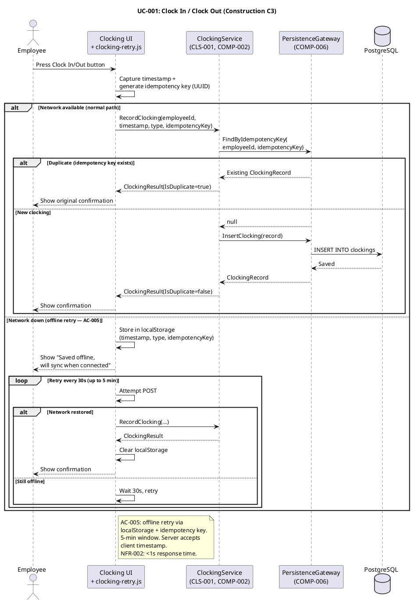
```plantuml
@startuml
title UC-001: Clock In / Clock Out (Construction C3)

actor Employee as EMP
participant "Clocking UI\n+ clocking-retry.js" as UI
participant "ClockingService\n(CLS-001, COMP-002)" as SVC
participant "PersistenceGateway\n(COMP-006)" as DB
database "PostgreSQL" as PG

EMP -> UI : Press Clock In/Out button
UI -> UI : Capture timestamp +\ngenerate idempotency key (UUID)

alt Network available (normal path)
  UI -> SVC : RecordClocking(employeeId,\ntimestamp, type, idempotencyKey)
  SVC -> DB : FindByIdempotencyKey(\nemployeeId, idempotencyKey)

  alt Duplicate (idempotency key exists)
    DB --> SVC : Existing ClockingRecord
    SVC --> UI : ClockingResult(IsDuplicate=true)
    UI --> EMP : Show original confirmation
  else New clocking
    DB --> SVC : null
    SVC -> DB : InsertClocking(record)
    DB -> PG : INSERT INTO clockings
    PG --> DB : Saved
    DB --> SVC : ClockingRecord
    SVC --> UI : ClockingResult(IsDuplicate=false)
    UI --> EMP : Show confirmation
  end

else Network down (offline retry — AC-005)
  UI -> UI : Store in localStorage\n(timestamp, type, idempotencyKey)
  UI --> EMP : Show "Saved offline,\nwill sync when connected"
  loop Retry every 30s (up to 5 min)
    UI -> UI : Attempt POST
    alt Network restored
      UI -> SVC : RecordClocking(...)
      SVC --> UI : ClockingResult
      UI -> UI : Clear localStorage
      UI --> EMP : Show confirmation
    else Still offline
      UI -> UI : Wait 30s, retry
    end
  end
end

note right of UI
  AC-005: offline retry via
  localStorage + idempotency key.
  5-min window. Server accepts
  client timestamp.
  NFR-002: <1s response time.
end note

@enduml
```

### SEQ-002: UC-002 — View Own Clocking History

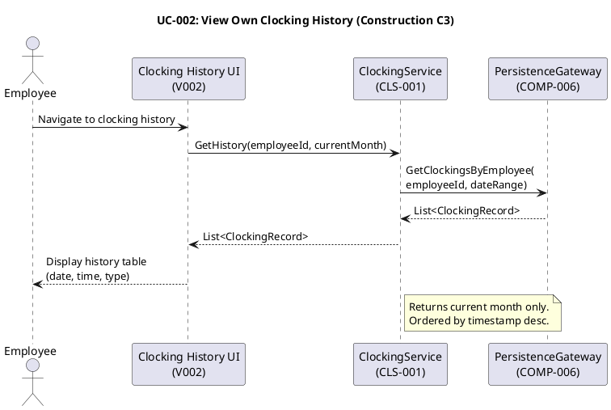
```plantuml
@startuml
title UC-002: View Own Clocking History (Construction C3)

actor Employee as EMP
participant "Clocking History UI\n(V002)" as UI
participant "ClockingService\n(CLS-001)" as SVC
participant "PersistenceGateway\n(COMP-006)" as DB

EMP -> UI : Navigate to clocking history
UI -> SVC : GetHistory(employeeId, currentMonth)
SVC -> DB : GetClockingsByEmployee(\nemployeeId, dateRange)
DB --> SVC : List<ClockingRecord>
SVC --> UI : List<ClockingRecord>
UI --> EMP : Display history table\n(date, time, type)

note right of SVC
  Returns current month only.
  Ordered by timestamp desc.
end note

@enduml
```

### SEQ-003: UC-003 — View All Employee Clockings

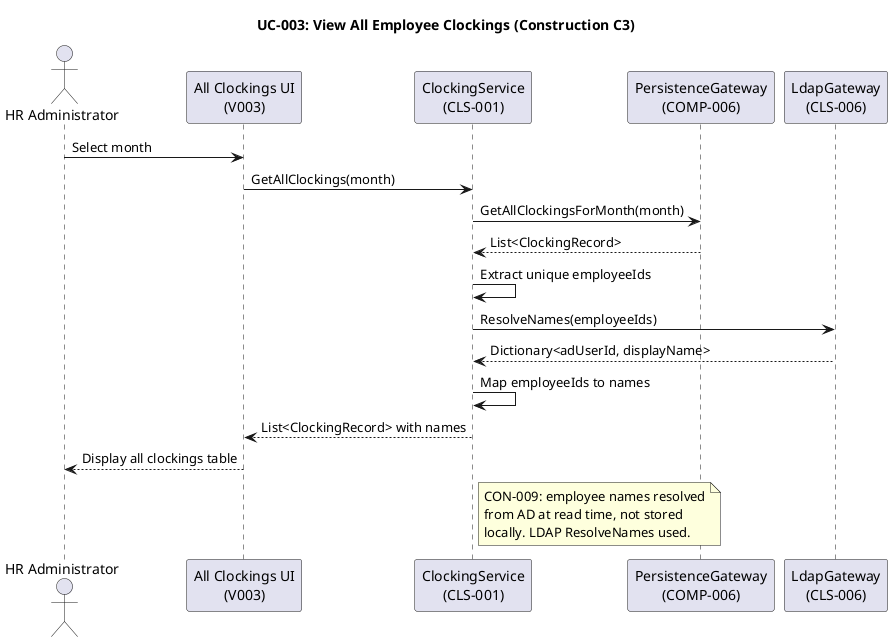
```plantuml
@startuml
title UC-003: View All Employee Clockings (Construction C3)

actor "HR Administrator" as HR
participant "All Clockings UI\n(V003)" as UI
participant "ClockingService\n(CLS-001)" as SVC
participant "PersistenceGateway\n(COMP-006)" as DB
participant "LdapGateway\n(CLS-006)" as LDAP

HR -> UI : Select month
UI -> SVC : GetAllClockings(month)
SVC -> DB : GetAllClockingsForMonth(month)
DB --> SVC : List<ClockingRecord>

SVC -> SVC : Extract unique employeeIds
SVC -> LDAP : ResolveNames(employeeIds)
LDAP --> SVC : Dictionary<adUserId, displayName>

SVC -> SVC : Map employeeIds to names
SVC --> UI : List<ClockingRecord> with names
UI --> HR : Display all clockings table

note right of SVC
  CON-009: employee names resolved
  from AD at read time, not stored
  locally. LDAP ResolveNames used.
end note

@enduml
```

### SEQ-004: UC-004 — Export Monthly Clocking Report

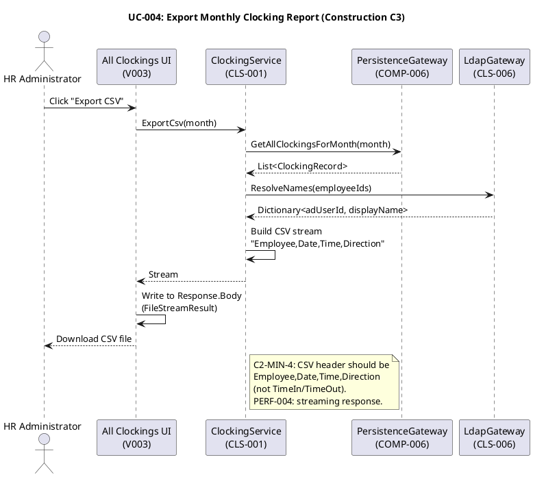
```plantuml
@startuml
title UC-004: Export Monthly Clocking Report (Construction C3)

actor "HR Administrator" as HR
participant "All Clockings UI\n(V003)" as UI
participant "ClockingService\n(CLS-001)" as SVC
participant "PersistenceGateway\n(COMP-006)" as DB
participant "LdapGateway\n(CLS-006)" as LDAP

HR -> UI : Click "Export CSV"
UI -> SVC : ExportCsv(month)
SVC -> DB : GetAllClockingsForMonth(month)
DB --> SVC : List<ClockingRecord>

SVC -> LDAP : ResolveNames(employeeIds)
LDAP --> SVC : Dictionary<adUserId, displayName>

SVC -> SVC : Build CSV stream\n"Employee,Date,Time,Direction"
SVC --> UI : Stream
UI -> UI : Write to Response.Body\n(FileStreamResult)
UI --> HR : Download CSV file

note right of SVC
  C2-MIN-4: CSV header should be
  Employee,Date,Time,Direction
  (not TimeIn/TimeOut).
  PERF-004: streaming response.
end note

@enduml
```

### SEQ-005: UC-005 — Publish News

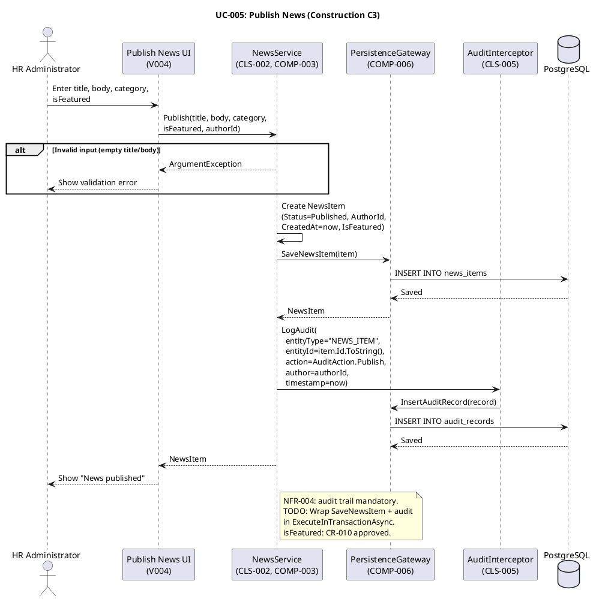
```plantuml
@startuml
title UC-005: Publish News (Construction C3)

actor "HR Administrator" as HR
participant "Publish News UI\n(V004)" as UI
participant "NewsService\n(CLS-002, COMP-003)" as SVC
participant "PersistenceGateway\n(COMP-006)" as DB
participant "AuditInterceptor\n(CLS-005)" as AUDIT
database "PostgreSQL" as PG

HR -> UI : Enter title, body, category,\nisFeatured
UI -> SVC : Publish(title, body, category,\nisFeatured, authorId)

alt Invalid input (empty title/body)
  SVC --> UI : ArgumentException
  UI --> HR : Show validation error
end

SVC -> SVC : Create NewsItem\n(Status=Published, AuthorId,\nCreatedAt=now, IsFeatured)
SVC -> DB : SaveNewsItem(item)
DB -> PG : INSERT INTO news_items
PG --> DB : Saved
DB --> SVC : NewsItem

SVC -> AUDIT : LogAudit(\n  entityType="NEWS_ITEM",\n  entityId=item.Id.ToString(),\n  action=AuditAction.Publish,\n  author=authorId,\n  timestamp=now)
AUDIT -> DB : InsertAuditRecord(record)
DB -> PG : INSERT INTO audit_records
PG --> DB : Saved

SVC --> UI : NewsItem
UI --> HR : Show "News published"

note right of SVC
  NFR-004: audit trail mandatory.
  TODO: Wrap SaveNewsItem + audit
  in ExecuteInTransactionAsync.
  isFeatured: CR-010 approved.
end note

@enduml
```

### SEQ-006: UC-006 — Edit Published News

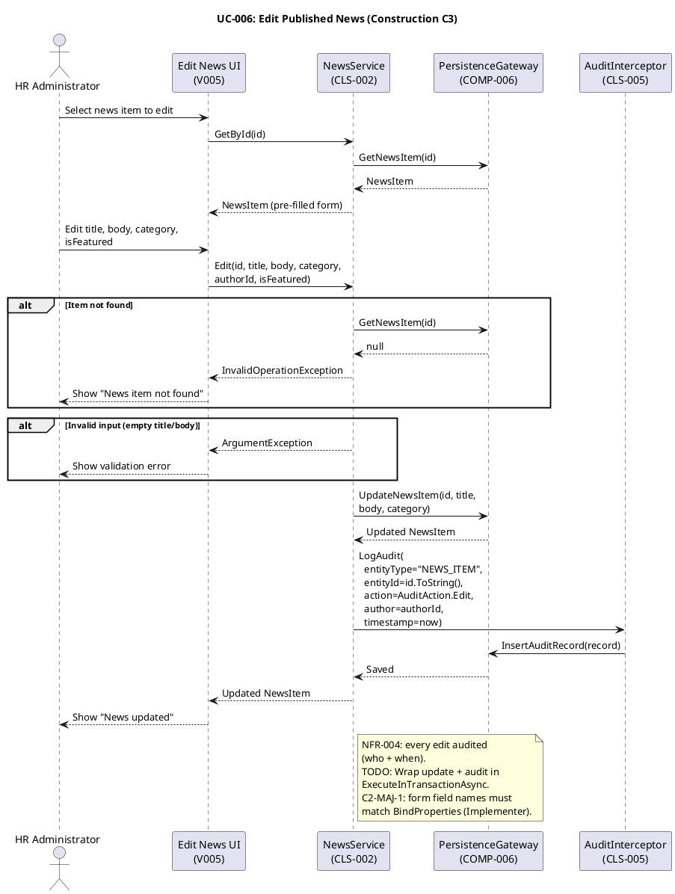
```plantuml
@startuml
title UC-006: Edit Published News (Construction C3)

actor "HR Administrator" as HR
participant "Edit News UI\n(V005)" as UI
participant "NewsService\n(CLS-002)" as SVC
participant "PersistenceGateway\n(COMP-006)" as DB
participant "AuditInterceptor\n(CLS-005)" as AUDIT

HR -> UI : Select news item to edit
UI -> SVC : GetById(id)
SVC -> DB : GetNewsItem(id)
DB --> SVC : NewsItem
SVC --> UI : NewsItem (pre-filled form)

HR -> UI : Edit title, body, category,\nisFeatured
UI -> SVC : Edit(id, title, body, category,\nauthorId, isFeatured)

alt Item not found
  SVC -> DB : GetNewsItem(id)
  DB --> SVC : null
  SVC --> UI : InvalidOperationException
  UI --> HR : Show "News item not found"
end

alt Invalid input (empty title/body)
  SVC --> UI : ArgumentException
  UI --> HR : Show validation error
end

SVC -> DB : UpdateNewsItem(id, title,\nbody, category)
DB --> SVC : Updated NewsItem

SVC -> AUDIT : LogAudit(\n  entityType="NEWS_ITEM",\n  entityId=id.ToString(),\n  action=AuditAction.Edit,\n  author=authorId,\n  timestamp=now)
AUDIT -> DB : InsertAuditRecord(record)
DB --> SVC : Saved

SVC --> UI : Updated NewsItem
UI --> HR : Show "News updated"

note right of SVC
  NFR-004: every edit audited
  (who + when).
  TODO: Wrap update + audit in
  ExecuteInTransactionAsync.
  C2-MAJ-1: form field names must
  match BindProperties (Implementer).
end note

@enduml
```

### SEQ-007: UC-007 — Unpublish News

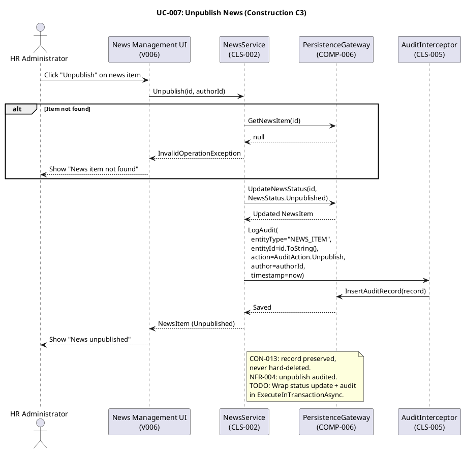
```plantuml
@startuml
title UC-007: Unpublish News (Construction C3)

actor "HR Administrator" as HR
participant "News Management UI\n(V006)" as UI
participant "NewsService\n(CLS-002)" as SVC
participant "PersistenceGateway\n(COMP-006)" as DB
participant "AuditInterceptor\n(CLS-005)" as AUDIT

HR -> UI : Click "Unpublish" on news item
UI -> SVC : Unpublish(id, authorId)

alt Item not found
  SVC -> DB : GetNewsItem(id)
  DB --> SVC : null
  SVC --> UI : InvalidOperationException
  UI --> HR : Show "News item not found"
end

SVC -> DB : UpdateNewsStatus(id,\nNewsStatus.Unpublished)
DB --> SVC : Updated NewsItem

SVC -> AUDIT : LogAudit(\n  entityType="NEWS_ITEM",\n  entityId=id.ToString(),\n  action=AuditAction.Unpublish,\n  author=authorId,\n  timestamp=now)
AUDIT -> DB : InsertAuditRecord(record)
DB --> SVC : Saved

SVC --> UI : NewsItem (Unpublished)
UI --> HR : Show "News unpublished"

note right of SVC
  CON-013: record preserved,
  never hard-deleted.
  NFR-004: unpublish audited.
  TODO: Wrap status update + audit
  in ExecuteInTransactionAsync.
end note

@enduml
```

### SEQ-008: UC-008 — Read and Filter News

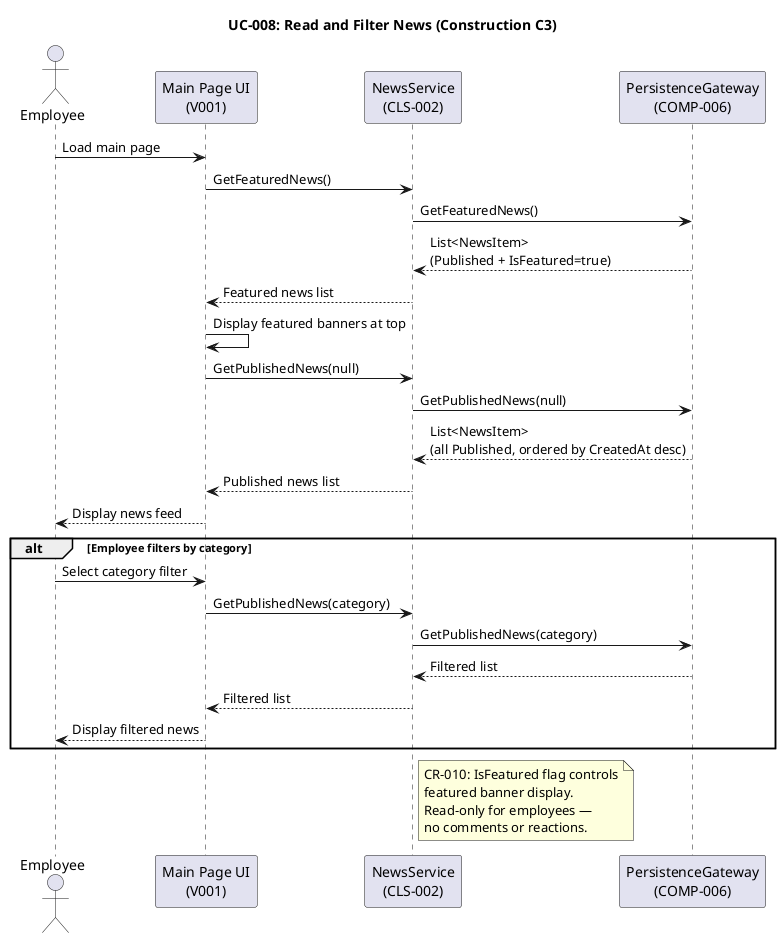
```plantuml
@startuml
title UC-008: Read and Filter News (Construction C3)

actor Employee as EMP
participant "Main Page UI\n(V001)" as UI
participant "NewsService\n(CLS-002)" as SVC
participant "PersistenceGateway\n(COMP-006)" as DB

EMP -> UI : Load main page

UI -> SVC : GetFeaturedNews()
SVC -> DB : GetFeaturedNews()
DB --> SVC : List<NewsItem>\n(Published + IsFeatured=true)
SVC --> UI : Featured news list
UI -> UI : Display featured banners at top

UI -> SVC : GetPublishedNews(null)
SVC -> DB : GetPublishedNews(null)
DB --> SVC : List<NewsItem>\n(all Published, ordered by CreatedAt desc)
SVC --> UI : Published news list
UI --> EMP : Display news feed

alt Employee filters by category
  EMP -> UI : Select category filter
  UI -> SVC : GetPublishedNews(category)
  SVC -> DB : GetPublishedNews(category)
  DB --> SVC : Filtered list
  SVC --> UI : Filtered list
  UI --> EMP : Display filtered news
end

note right of SVC
  CR-010: IsFeatured flag controls
  featured banner display.
  Read-only for employees —
  no comments or reactions.
end note

@enduml
```

### SEQ-009: UC-009 — Search Employee Directory

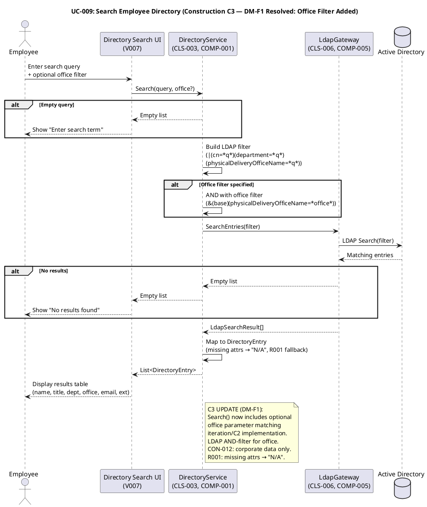
```plantuml
@startuml
title UC-009: Search Employee Directory (Construction C3 — DM-F1 Resolved: Office Filter Added)

actor Employee as EMP
participant "Directory Search UI\n(V007)" as UI
participant "DirectoryService\n(CLS-003, COMP-001)" as SVC
participant "LdapGateway\n(CLS-006, COMP-005)" as LDAP
database "Active Directory" as AD

EMP -> UI : Enter search query\n+ optional office filter
UI -> SVC : Search(query, office?)

alt Empty query
  SVC --> UI : Empty list
  UI --> EMP : Show "Enter search term"
end

SVC -> SVC : Build LDAP filter\n(|(cn=*q*)(department=*q*)\n(physicalDeliveryOfficeName=*q*))

alt Office filter specified
  SVC -> SVC : AND with office filter\n(&(base)(physicalDeliveryOfficeName=*office*))
end

SVC -> LDAP : SearchEntries(filter)
LDAP -> AD : LDAP Search(filter)
AD --> LDAP : Matching entries

alt No results
  LDAP --> SVC : Empty list
  SVC --> UI : Empty list
  UI --> EMP : Show "No results found"
end

LDAP --> SVC : LdapSearchResult[]

SVC -> SVC : Map to DirectoryEntry\n(missing attrs → "N/A", R001 fallback)

SVC --> UI : List<DirectoryEntry>
UI --> EMP : Display results table\n(name, title, dept, office, email, ext)

note right of SVC
  C3 UPDATE (DM-F1):
  Search() now includes optional
  office parameter matching
  iteration/C2 implementation.
  LDAP AND-filter for office.
  CON-012: corporate data only.
  R001: missing attrs → "N/A".
end note

@enduml
```

### SEQ-010: UC-010 — Manage Worker Category

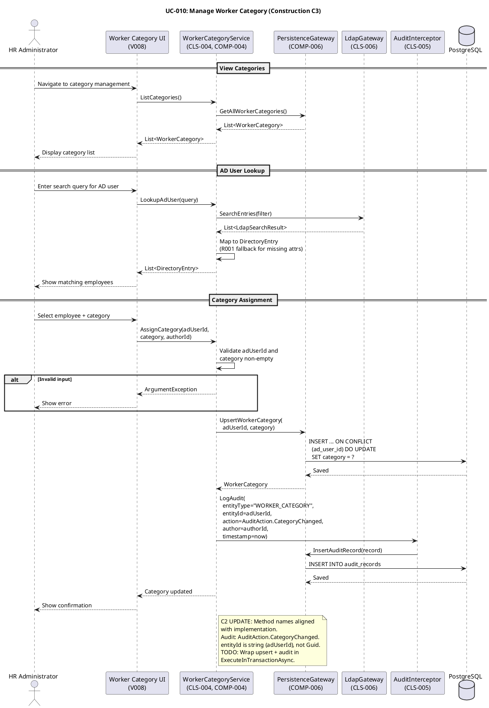
```plantuml
@startuml
title UC-010: Manage Worker Category (Construction C3)

actor "HR Administrator" as HR
participant "Worker Category UI\n(V008)" as UI
participant "WorkerCategoryService\n(CLS-004, COMP-004)" as SVC
participant "PersistenceGateway\n(COMP-006)" as DB
participant "LdapGateway\n(CLS-006)" as LDAP
participant "AuditInterceptor\n(CLS-005)" as AUDIT
database "PostgreSQL" as PG

== View Categories ==

HR -> UI : Navigate to category management
UI -> SVC : ListCategories()
SVC -> DB : GetAllWorkerCategories()
DB --> SVC : List<WorkerCategory>
SVC --> UI : List<WorkerCategory>
UI --> HR : Display category list

== AD User Lookup ==

HR -> UI : Enter search query for AD user
UI -> SVC : LookupAdUser(query)
SVC -> LDAP : SearchEntries(filter)
LDAP --> SVC : List<LdapSearchResult>
SVC -> SVC : Map to DirectoryEntry\n(R001 fallback for missing attrs)
SVC --> UI : List<DirectoryEntry>
UI --> HR : Show matching employees

== Category Assignment ==

HR -> UI : Select employee + category
UI -> SVC : AssignCategory(adUserId,\ncategory, authorId)

SVC -> SVC : Validate adUserId and\ncategory non-empty

alt Invalid input
  SVC --> UI : ArgumentException
  UI --> HR : Show error
end

SVC -> DB : UpsertWorkerCategory(\n  adUserId, category)
DB -> PG : INSERT ... ON CONFLICT\n  (ad_user_id) DO UPDATE\n  SET category = ?
PG --> DB : Saved
DB --> SVC : WorkerCategory

SVC -> AUDIT : LogAudit(\n  entityType="WORKER_CATEGORY",\n  entityId=adUserId,\n  action=AuditAction.CategoryChanged,\n  author=authorId,\n  timestamp=now)
AUDIT -> DB : InsertAuditRecord(record)
DB -> PG : INSERT INTO audit_records
PG --> DB : Saved

SVC --> UI : Category updated
UI --> HR : Show confirmation

note right of SVC
  C2 UPDATE: Method names aligned
  with implementation.
  Audit: AuditAction.CategoryChanged.
  entityId is string (adUserId), not Guid.
  TODO: Wrap upsert + audit in
  ExecuteInTransactionAsync.
end note

@enduml
```
## Design Packages and Classes
### Designer Class Diagrams — Application Services (Portal.Services)

> **Contributed by:** Designer (Analysis & Design Discipline)
> **Iteration:** Construction C3 — DM-F1 resolved: INT-003 Search() includes optional office parameter

```plantuml
@startuml
title Portal Cuba Corp — Portal.Services Package (Construction C3 — DM-F1 Resolved)

skinparam classAttributeIconSize 0

package "Portal.Services (Application Layer)" {

  interface "IClockingService\n(INT-001)" as INT001 {
    + RecordClocking(employeeId: string, timestamp: DateTime, type: ClockType, idempotencyKey: string) : ClockingResult
    + GetCurrentStatus(employeeId: string) : ClockStatus
    + GetHistory(employeeId: string, month: DateRange) : List<ClockingRecord>
    + GetAllClockings(month: DateRange) : List<ClockingRecord>
    + ExportCsv(month: DateRange) : Stream
  }

  class "ClockingService\n(CLS-001)" as CLS001 {
    - _persistence : IPersistence
    + RecordClocking(employeeId: string, timestamp: DateTime, type: ClockType, idempotencyKey: string) : ClockingResult
    + GetCurrentStatus(employeeId: string) : ClockStatus
    + GetHistory(employeeId: string, month: DateRange) : List<ClockingRecord>
    + GetAllClockings(month: DateRange) : List<ClockingRecord>
    + ExportCsv(month: DateRange) : Stream
  }

  interface "INewsService\n(INT-002)" as INT002 {
    + Publish(title: string, body: string, category: NewsCategory, authorId: string, isFeatured: bool) : NewsItem
    + Edit(id: Guid, title: string, body: string, category: NewsCategory, authorId: string, isFeatured: bool) : NewsItem
    + Unpublish(id: Guid, authorId: string) : NewsItem
    + GetById(id: Guid) : NewsItem?
    + GetPublishedNews(category: NewsCategory?) : List<NewsItem>
    + GetFeaturedNews() : List<NewsItem>
    + ListAll() : List<NewsItem>
  }

  class "NewsService\n(CLS-002)" as CLS002 {
    - _persistence : IPersistence
    - _auditLogger : IAuditLogger
    + Publish(title: string, body: string, category: NewsCategory, authorId: string, isFeatured: bool) : NewsItem
    + Edit(id: Guid, title: string, body: string, category: NewsCategory, authorId: string, isFeatured: bool) : NewsItem
    + Unpublish(id: Guid, authorId: string) : NewsItem
    + GetById(id: Guid) : NewsItem?
    + GetPublishedNews(category: NewsCategory?) : List<NewsItem>
    + GetFeaturedNews() : List<NewsItem>
    + ListAll() : List<NewsItem>
  }

  interface "IDirectoryService\n(INT-003)" as INT003 {
    + Search(query: string, office: string? = null) : List<DirectoryEntry>
  }

  class "DirectoryService\n(CLS-003)" as CLS003 {
    - _ldapGateway : ILdapGateway
    + Search(query: string, office: string? = null) : List<DirectoryEntry>
    - EscapeLdapFilter(value: string) : string
  }

  interface "IWorkerCategoryService\n(INT-004)" as INT004 {
    + AssignCategory(adUserId: string, category: string, authorId: string) : WorkerCategory
    + ListCategories() : List<WorkerCategory>
    + LookupAdUser(query: string) : List<DirectoryEntry>
  }

  class "WorkerCategoryService\n(CLS-004)" as CLS004 {
    - _persistence : IPersistence
    - _ldapGateway : ILdapGateway
    - _auditLogger : IAuditLogger
    + AssignCategory(adUserId: string, category: string, authorId: string) : WorkerCategory
    + ListCategories() : List<WorkerCategory>
    + LookupAdUser(query: string) : List<DirectoryEntry>
  }

  interface "IAuditLogger\n(INT-005)" as INT005 {
    + LogAudit(entityType: string, entityId: string, action: AuditAction, author: string, timestamp: DateTime) : void
  }

  class "AuditInterceptor\n(CLS-005)" as CLS005 {
    - _persistence : IPersistence
    + LogAudit(entityType: string, entityId: string, action: AuditAction, author: string, timestamp: DateTime) : void
  }
}

INT001 <|.. CLS001
INT002 <|.. CLS002
INT003 <|.. CLS003
INT004 <|.. CLS004
INT005 <|.. CLS005

note right of INT003
  C3 UPDATE (DM-F1):
  Search() now includes optional
  office parameter matching
  iteration/C2 implementation.
  LDAP AND-filter for office.
end note

@enduml
```

### Designer Class Diagrams — Infrastructure (Portal.Infrastructure)

> **Contributed by:** Designer (Analysis & Design Discipline)
> **Iteration:** Construction C3

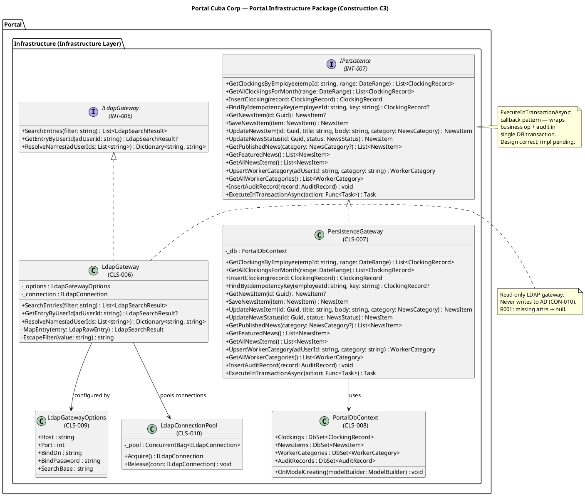
```plantuml
@startuml
title Portal Cuba Corp — Portal.Infrastructure Package (Construction C3)

skinparam classAttributeIconSize 0

package "Portal.Infrastructure (Infrastructure Layer)" {

  interface "ILdapGateway\n(INT-006)" as INT006 {
    + SearchEntries(filter: string) : List<LdapSearchResult>
    + GetEntryByUserId(adUserId: string) : LdapSearchResult?
    + ResolveNames(adUserIds: List<string>) : Dictionary<string, string>
  }

  class "LdapGateway\n(CLS-006)" as CLS006 {
    - _options : LdapGatewayOptions
    - _connection : ILdapConnection
    + SearchEntries(filter: string) : List<LdapSearchResult>
    + GetEntryByUserId(adUserId: string) : LdapSearchResult?
    + ResolveNames(adUserIds: List<string>) : Dictionary<string, string>
    - MapEntry(entry: LdapRawEntry) : LdapSearchResult
    - EscapeFilter(value: string) : string
  }

  class "LdapGatewayOptions\n(CLS-009)" as CLS009 {
    + Host : string
    + Port : int
    + BindDn : string
    + BindPassword : string
    + SearchBase : string
  }

  class "LdapConnectionPool\n(CLS-010)" as CLS010 {
    - _pool : ConcurrentBag<ILdapConnection>
    + Acquire() : ILdapConnection
    + Release(conn: ILdapConnection) : void
  }

  interface "IPersistence\n(INT-007)" as INT007 {
    + GetClockingsByEmployee(empId: string, range: DateRange) : List<ClockingRecord>
    + GetAllClockingsForMonth(range: DateRange) : List<ClockingRecord>
    + InsertClocking(record: ClockingRecord) : ClockingRecord
    + FindByIdempotencyKey(employeeId: string, key: string) : ClockingRecord?
    + GetNewsItem(id: Guid) : NewsItem?
    + SaveNewsItem(item: NewsItem) : NewsItem
    + UpdateNewsItem(id: Guid, title: string, body: string, category: NewsCategory) : NewsItem
    + UpdateNewsStatus(id: Guid, status: NewsStatus) : NewsItem
    + GetPublishedNews(category: NewsCategory?) : List<NewsItem>
    + GetFeaturedNews() : List<NewsItem>
    + GetAllNewsItems() : List<NewsItem>
    + UpsertWorkerCategory(adUserId: string, category: string) : WorkerCategory
    + GetAllWorkerCategories() : List<WorkerCategory>
    + InsertAuditRecord(record: AuditRecord) : void
    + ExecuteInTransactionAsync(action: Func<Task>) : Task
  }

  class "PersistenceGateway\n(CLS-007)" as CLS007 {
    - _db : PortalDbContext
    + GetClockingsByEmployee(empId: string, range: DateRange) : List<ClockingRecord>
    + GetAllClockingsForMonth(range: DateRange) : List<ClockingRecord>
    + InsertClocking(record: ClockingRecord) : ClockingRecord
    + FindByIdempotencyKey(employeeId: string, key: string) : ClockingRecord?
    + GetNewsItem(id: Guid) : NewsItem?
    + SaveNewsItem(item: NewsItem) : NewsItem
    + UpdateNewsItem(id: Guid, title: string, body: string, category: NewsCategory) : NewsItem
    + UpdateNewsStatus(id: Guid, status: NewsStatus) : NewsItem
    + GetPublishedNews(category: NewsCategory?) : List<NewsItem>
    + GetFeaturedNews() : List<NewsItem>
    + GetAllNewsItems() : List<NewsItem>
    + UpsertWorkerCategory(adUserId: string, category: string) : WorkerCategory
    + GetAllWorkerCategories() : List<WorkerCategory>
    + InsertAuditRecord(record: AuditRecord) : void
    + ExecuteInTransactionAsync(action: Func<Task>) : Task
  }

  class "PortalDbContext\n(CLS-008)" as CLS008 {
    + Clockings : DbSet<ClockingRecord>
    + NewsItems : DbSet<NewsItem>
    + WorkerCategories : DbSet<WorkerCategory>
    + AuditRecords : DbSet<AuditRecord>
    + OnModelCreating(modelBuilder: ModelBuilder) : void
  }
}

INT006 <|.. CLS006
INT007 <|.. CLS007
CLS007 --> CLS008 : uses
CLS006 --> CLS009 : configured by
CLS006 --> CLS010 : pools connections

note right of INT007
  ExecuteInTransactionAsync:
  callback pattern — wraps
  business op + audit in
  single DB transaction.
  Design correct; impl pending.
end note

note right of CLS006
  Read-only LDAP gateway.
  Never writes to AD (CON-010).
  R001: missing attrs → null.
end note

@enduml
```

### Designer Class Diagrams — Domain (Portal.Domain)

> **Contributed by:** Designer (Analysis & Design Discipline)
> **Iteration:** Construction C3

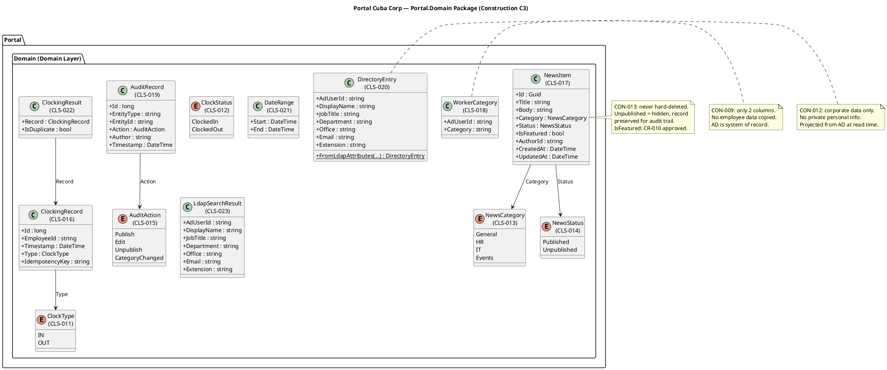
```plantuml
@startuml
title Portal Cuba Corp — Portal.Domain Package (Construction C3)

skinparam classAttributeIconSize 0

package "Portal.Domain (Domain Layer)" {

  enum "ClockType\n(CLS-011)" as CLS011 {
    IN
    OUT
  }

  enum "ClockStatus\n(CLS-012)" as CLS012 {
    ClockedIn
    ClockedOut
  }

  enum "NewsCategory\n(CLS-013)" as CLS013 {
    General
    HR
    IT
    Events
  }

  enum "NewsStatus\n(CLS-014)" as CLS014 {
    Published
    Unpublished
  }

  enum "AuditAction\n(CLS-015)" as CLS015 {
    Publish
    Edit
    Unpublish
    CategoryChanged
  }

  class "ClockingRecord\n(CLS-016)" as CLS016 {
    + Id : long
    + EmployeeId : string
    + Timestamp : DateTime
    + Type : ClockType
    + IdempotencyKey : string
  }

  class "NewsItem\n(CLS-017)" as CLS017 {
    + Id : Guid
    + Title : string
    + Body : string
    + Category : NewsCategory
    + Status : NewsStatus
    + IsFeatured : bool
    + AuthorId : string
    + CreatedAt : DateTime
    + UpdatedAt : DateTime
  }

  class "WorkerCategory\n(CLS-018)" as CLS018 {
    + AdUserId : string
    + Category : string
  }

  class "AuditRecord\n(CLS-019)" as CLS019 {
    + Id : long
    + EntityType : string
    + EntityId : string
    + Action : AuditAction
    + Author : string
    + Timestamp : DateTime
  }

  class "DirectoryEntry\n(CLS-020)" as CLS020 {
    + AdUserId : string
    + DisplayName : string
    + JobTitle : string
    + Department : string
    + Office : string
    + Email : string
    + Extension : string
    + {static} FromLdapAttributes(...) : DirectoryEntry
  }

  class "DateRange\n(CLS-021)" as CLS021 {
    + Start : DateTime
    + End : DateTime
  }

  class "ClockingResult\n(CLS-022)" as CLS022 {
    + Record : ClockingRecord
    + IsDuplicate : bool
  }

  class "LdapSearchResult\n(CLS-023)" as CLS023 {
    + AdUserId : string
    + DisplayName : string
    + JobTitle : string
    + Department : string
    + Office : string
    + Email : string
    + Extension : string
  }
}

CLS016 --> CLS011 : Type
CLS017 --> CLS013 : Category
CLS017 --> CLS014 : Status
CLS019 --> CLS015 : Action
CLS022 --> CLS016 : Record

note right of CLS017
  CON-013: never hard-deleted.
  Unpublished = hidden, record
  preserved for audit trail.
  IsFeatured: CR-010 approved.
end note

note right of CLS018
  CON-009: only 2 columns.
  No employee data copied.
  AD is system of record.
end note

note right of CLS020
  CON-012: corporate data only.
  No private personal info.
  Projected from AD at read time.
end note

@enduml
```

### Subsystem Interface Dependency Diagram

> **Contributed by:** Designer (Analysis & Design Discipline)
> **Iteration:** Construction C3

```plantuml
@startuml
title Portal Cuba Corp — Subsystem Interface Dependencies (Construction C3)

skinparam componentStyle rectangle
skinparam classAttributeIconSize 0

package "Portal.UI (Presentation)" {
  component "Clocking Pages\n(V001, V002, V003)" as UI_CLK
  component "News Pages\n(V004, V005, V006)" as UI_NEWS
  component "Directory Page\n(V007)" as UI_DIR
  component "Category Page\n(V008)" as UI_CAT
}

package "Portal.Services (Application)" {
  component "ClockingService\n(CLS-001)" as SVC_CLK
  component "NewsService\n(CLS-002)" as SVC_NEWS
  component "DirectoryService\n(CLS-003)" as SVC_DIR
  component "WorkerCategoryService\n(CLS-004)" as SVC_CAT
  component "AuditInterceptor\n(CLS-005)" as SVC_AUDIT
}

package "Portal.Infrastructure (Infrastructure)" {
  component "PersistenceGateway\n(CLS-007)" as INF_PERSIST
  component "LdapGateway\n(CLS-006)" as INF_LDAP
}

database "PostgreSQL" as PG
database "Active Directory" as AD

UI_CLK --> INT001 : IClockingService
UI_NEWS --> INT002 : INewsService
UI_DIR --> INT003 : IDirectoryService
UI_CAT --> INT004 : IWorkerCategoryService

SVC_CLK --> INT007 : IPersistence
SVC_NEWS --> INT007 : IPersistence
SVC_NEWS --> INT005 : IAuditLogger
SVC_DIR --> INT006 : ILdapGateway
SVC_CAT --> INT007 : IPersistence
SVC_CAT --> INT006 : ILdapGateway
SVC_CAT --> INT005 : IAuditLogger
SVC_AUDIT --> INT007 : IPersistence

INF_PERSIST --> PG : EF Core + Npgsql
INF_LDAP --> AD : Novell.Directory.Ldap

note right of SVC_NEWS
  All service dependencies are
  interface-based (DI-injected).
  No concrete class referenced
  across subsystem boundaries.
end note

note right of SVC_DIR
  C3: INT-003 Search() includes
  optional office parameter.
  LDAP AND-filter for office.
end note

@enduml
```
## Interface Contracts
All subsystem boundaries are defined by interfaces. No concrete class is referenced across a subsystem boundary — services depend on interfaces, not implementations.

### Construction C3 — Interface-Implementation Alignment

The interface contracts below are aligned with the actual implementation source code. Method names, parameter types, and return types match the implemented interfaces in `src/PortalCubaCorp.Application/` and `src/PortalCubaCorp.Infrastructure/`. Where the implementation diverges from the prior design (C1), the design is updated to match the valid implementation choice. Where the implementation is wrong (missing `isFeatured`, missing `ExecuteInTransactionAsync`), the design retains the correct contract and the implementation must be fixed.

| Finding | Root Cause | Resolution |
|---|---|---|
| M1 — IAuditLogger (INT-005) | Design Model specified `Log()`; implementation uses `LogAudit()` | `Log()` collides with `Microsoft.Extensions.Logging.ILogger.Log()` in .NET 10. `LogAudit()` is the correct idiom. Design Model updated to `LogAudit`. **Resolved C1.** |
| M2 — IPersistence (INT-007) | Design Model specified `BeginTransaction()` / `CommitTransaction()`; implementation does not expose them | EF Core `DbContext.Database.BeginTransaction()` already provides transaction management. Re-exposing via `IPersistence` is redundant. Replaced with `ExecuteInTransactionAsync(Func<Task> action)` — callback pattern. **Design correct; implementation pending.** |
| C2-1 — INT-002 method names | Design specified `PublishNews`, `EditNews`, etc.; implementation uses `Publish`, `Edit`, etc. | Implementation uses concise .NET-idiomatic names. Design updated to match. **Resolved C2.** |
| C2-2 — INT-005 entityId type | Design specified `Guid`; implementation uses `string` | `string` accommodates both `Guid.ToString()` (news) and `adUserId` (worker categories). Design updated. **Resolved C2.** |
| C2-3 — INT-001 method name | Design specified `GetAllClockingsForMonth`; implementation uses `GetAllClockings` | Shorter name is .NET-idiomatic. Design updated. **Resolved C2.** |
| DM-F1 — INT-003 office parameter | Design Model declared `Search(string query)` without office filter; iteration/C2 implementation has `Search(string query, string? office = null)` with LDAP AND-filter for office | Implementation correctly supports optional office filter (MINOR-1 fix from C1). Design updated to include `office` parameter. **Resolved C3.** |

### INT-001: IClockingService (COMP-002)

| Operation | Signature | Precondition | Postcondition |
|---|---|---|---|
| RecordClocking | `ClockingResult RecordClocking(string employeeId, DateTime timestamp, ClockType type, string idempotencyKey)` | employeeId non-empty; idempotencyKey non-empty | Returns ClockingResult with IsDuplicate=true if idempotencyKey already exists for this employee; otherwise inserts and returns IsDuplicate=false |
| GetCurrentStatus | `ClockStatus GetCurrentStatus(string employeeId)` | employeeId non-empty | Returns ClockedIn if last record is IN; ClockedOut if last is OUT or no records |
| GetHistory | `List<ClockingRecord> GetHistory(string employeeId, DateRange month)` | employeeId non-empty | Returns clockings for employee within date range, ordered by timestamp desc |
| GetAllClockings | `List<ClockingRecord> GetAllClockings(DateRange month)` | — | Returns all clockings within date range, ordered by employee then timestamp desc |
| ExportCsv | `Stream ExportCsv(DateRange month)` | — | Returns CSV stream with headers: Employee,Date,Time,Direction |

### INT-002: INewsService (COMP-003)

| Operation | Signature | Precondition | Postcondition |
|---|---|---|---|
| Publish | `NewsItem Publish(string title, string body, NewsCategory category, string authorId, bool isFeatured)` | title and body non-empty | Creates NewsItem with Status=Published; logs AuditAction.Publish |
| Edit | `NewsItem Edit(Guid id, string title, string body, NewsCategory category, string authorId, bool isFeatured)` | item exists with given id | Updates title, body, category; logs AuditAction.Edit |
| Unpublish | `NewsItem Unpublish(Guid id, string authorId)` | item exists | Sets Status=Unpublished (CON-013: never deleted); logs AuditAction.Unpublish |
| GetById | `NewsItem? GetById(Guid id)` | — | Returns news item or null |
| GetPublishedNews | `List<NewsItem> GetPublishedNews(NewsCategory? category)` | — | Returns Status=Published items, optionally filtered by category |
| GetFeaturedNews | `List<NewsItem> GetFeaturedNews()` | — | Returns Status=Published AND IsFeatured=true |
| ListAll | `List<NewsItem> ListAll()` | — | Returns all news items regardless of status |

### INT-003: IDirectoryService (COMP-001)

| Operation | Signature | Precondition | Postcondition |
|---|---|---|---|
| Search | `List<DirectoryEntry> Search(string query, string? office = null)` | query non-empty (empty returns empty list) | Returns DirectoryEntry list from AD via LDAP; missing attributes default to "N/A" (R001 fallback). If office specified, LDAP AND-filter applied on physicalDeliveryOfficeName. CON-012: corporate data only. |

> **C3 Update (DM-F1):** The `office` parameter was missing from the Design Model's INT-003 contract. The iteration/C2 implementation correctly includes it as an optional parameter with LDAP AND-filter. Design Model now matches implementation.

### INT-004: IWorkerCategoryService (COMP-004)

| Operation | Signature | Precondition | Postcondition |
|---|---|---|---|
| AssignCategory | `WorkerCategory AssignCategory(string adUserId, string category, string authorId)` | adUserId and category non-empty | Upserts worker_categories row (2 columns only per CON-009); logs AuditAction.CategoryChanged |
| ListCategories | `List<WorkerCategory> ListCategories()` | — | Returns all worker category records |
| LookupAdUser | `List<DirectoryEntry> LookupAdUser(string query)` | query non-empty | Searches AD via LDAP for user matching query; returns DirectoryEntry list |

### INT-005: IAuditLogger (COMP-008)

| Operation | Signature | Precondition | Postcondition |
|---|---|---|---|
| LogAudit | `void LogAudit(string entityType, string entityId, AuditAction action, string author, DateTime timestamp)` | Called within active transaction (design intent) | Appends audit record to audit_records table (append-only, never updated or deleted) |

> **Design intent:** `LogAudit` should be called within `IPersistence.ExecuteInTransactionAsync()` callback to ensure atomicity with the business operation. Implementation currently calls it outside transaction — must be fixed.

### INT-006: ILdapGateway (COMP-005)

| Operation | Signature | Precondition | Postcondition |
|---|---|---|---|
| SearchEntries | `List<LdapSearchResult> SearchEntries(string filter)` | filter is valid LDAP search filter | Returns matching entries from AD; missing attributes return null (R001) |
| GetEntryByUserId | `LdapSearchResult? GetEntryByUserId(string adUserId)` | adUserId non-empty | Returns single entry matching sAMAccountName or null |
| ResolveNames | `Dictionary<string, string> ResolveNames(List<string> adUserIds)` | — | Returns mapping of adUserId → displayName; unknown users map to their adUserId |

### INT-007: IPersistence (COMP-006)

| Operation | Signature | Precondition | Postcondition |
|---|---|---|---|
| GetClockingsByEmployee | `List<ClockingRecord> GetClockingsByEmployee(string empId, DateRange range)` | empId non-empty | Returns clockings for employee within range, ordered by timestamp desc |
| GetAllClockingsForMonth | `List<ClockingRecord> GetAllClockingsForMonth(DateRange range)` | — | Returns all clockings within range, ordered by employee then timestamp desc |
| InsertClocking | `ClockingRecord InsertClocking(ClockingRecord record)` | record valid | Inserts and returns clocking record |
| FindByIdempotencyKey | `ClockingRecord? FindByIdempotencyKey(string employeeId, string key)` | — | Returns existing record with same employeeId + idempotencyKey, or null |
| GetNewsItem | `NewsItem? GetNewsItem(Guid id)` | — | Returns news item or null |
| SaveNewsItem | `NewsItem SaveNewsItem(NewsItem item)` | item valid | Inserts and returns news item |
| UpdateNewsItem | `NewsItem UpdateNewsItem(Guid id, string title, string body, NewsCategory category)` | item exists | Updates title, body, category; returns updated item |
| UpdateNewsStatus | `NewsItem UpdateNewsStatus(Guid id, NewsStatus status)` | item exists | Updates status; returns updated item |
| GetPublishedNews | `List<NewsItem> GetPublishedNews(NewsCategory? category)` | — | Returns Status=Published items, optionally filtered |
| GetFeaturedNews | `List<NewsItem> GetFeaturedNews()` | — | Returns Status=Published AND IsFeatured=true |
| GetAllNewsItems | `List<NewsItem> GetAllNewsItems()` | — | Returns all news items regardless of status |
| UpsertWorkerCategory | `WorkerCategory UpsertWorkerCategory(string adUserId, string category)` | adUserId non-empty | Inserts or updates worker_categories row (2 columns only per CON-009) |
| GetAllWorkerCategories | `List<WorkerCategory> GetAllWorkerCategories()` | — | Returns all worker category records |
| InsertAuditRecord | `void InsertAuditRecord(AuditRecord record)` | Called within active transaction | Appends audit record (never updated or deleted) |
| ExecuteInTransactionAsync | `Task ExecuteInTransactionAsync(Func<Task> action)` | — | Executes action within a DB transaction; commits on success, rolls back on exception |
## Persistent Data Classes
> **Contributed by:** Database Designer (Analysis & Design Discipline)
> **Persistence Engine:** PostgreSQL (CON-003 — declared by stakeholder)
> **ORM:** EF Core 10 + Npgsql (CON-001, CON-003)
> **Design Mechanism:** Repository + Unit of Work via PortalDbContext (SAD Logical View)
> **Iteration 2:** Aligned with M1/M2 resolution — `IAuditLogger.LogAudit()` and `IPersistence.ExecuteInTransactionAsync()` reflected in mechanism chain.

EF Core entity classes map to PostgreSQL tables. The PortalDbContext configures all mappings, constraints, and indexes in OnModelCreating. The schema is minimal — 4 tables — because employee data is read from AD at read time (CON-009) and authentication is handled by Keycloak (CON-004). No local user table exists.

### Schema Organization

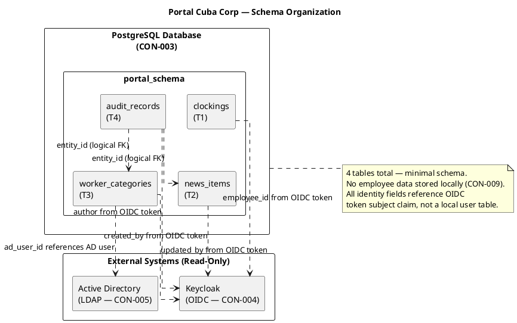
```plantuml
@startuml
title Portal Cuba Corp — Schema Organization

skinparam packageStyle rectangle
skinparam linetype ortho

package "PostgreSQL Database\n(CON-003)" as DB {

  package "portal_schema" {
    rectangle "clockings\n(T1)" as T1
    rectangle "news_items\n(T2)" as T2
    rectangle "worker_categories\n(T3)" as T3
    rectangle "audit_records\n(T4)" as T4
  }
}

package "External Systems (Read-Only)" {
  rectangle "Active Directory\n(LDAP — CON-005)" as AD
  rectangle "Keycloak\n(OIDC — CON-004)" as KC
}

T4 ..> T2 : entity_id (logical FK)
T4 ..> T3 : entity_id (logical FK)
T1 ..> KC : employee_id from OIDC token
T2 ..> KC : created_by from OIDC token
T3 ..> KC : updated_by from OIDC token
T4 ..> KC : author from OIDC token
T3 ..> AD : ad_user_id references AD user

note bottom of DB
  4 tables total — minimal schema.
  No employee data stored locally (CON-009).
  All identity fields reference OIDC
  token subject claim, not a local user table.
end note

@enduml
```

### Entity-to-Table Mapping (<<table>> Class Diagram)

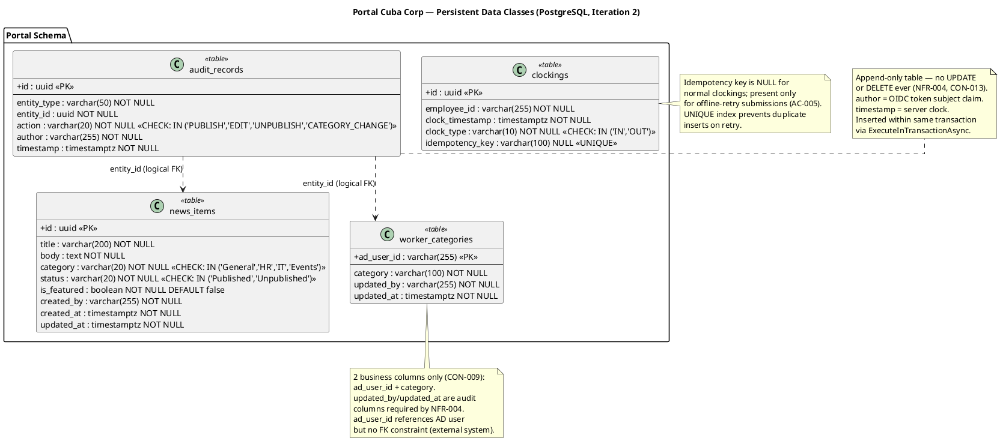
```plantuml
@startuml
title Portal Cuba Corp — Persistent Data Classes (PostgreSQL, Iteration 2)

skinparam classAttributeIconSize 0
skinparam linetype ortho

package "Portal Schema" {

  class "clockings" as T1 <<table>> {
    + id : uuid <<PK>>
    --
    employee_id : varchar(255) NOT NULL
    clock_timestamp : timestamptz NOT NULL
    clock_type : varchar(10) NOT NULL <<CHECK: IN ('IN','OUT')>>
    idempotency_key : varchar(100) NULL <<UNIQUE>>
  }

  class "news_items" as T2 <<table>> {
    + id : uuid <<PK>>
    --
    title : varchar(200) NOT NULL
    body : text NOT NULL
    category : varchar(20) NOT NULL <<CHECK: IN ('General','HR','IT','Events')>>
    status : varchar(20) NOT NULL <<CHECK: IN ('Published','Unpublished')>>
    is_featured : boolean NOT NULL DEFAULT false
    created_by : varchar(255) NOT NULL
    created_at : timestamptz NOT NULL
    updated_at : timestamptz NOT NULL
  }

  class "worker_categories" as T3 <<table>> {
    + ad_user_id : varchar(255) <<PK>>
    --
    category : varchar(100) NOT NULL
    updated_by : varchar(255) NOT NULL
    updated_at : timestamptz NOT NULL
  }

  class "audit_records" as T4 <<table>> {
    + id : uuid <<PK>>
    --
    entity_type : varchar(50) NOT NULL
    entity_id : uuid NOT NULL
    action : varchar(20) NOT NULL <<CHECK: IN ('PUBLISH','EDIT','UNPUBLISH','CATEGORY_CHANGE')>>
    author : varchar(255) NOT NULL
    timestamp : timestamptz NOT NULL
  }
}

T4 ..> T2 : entity_id (logical FK)
T4 ..> T3 : entity_id (logical FK)

note right of T1
  Idempotency key is NULL for
  normal clockings; present only
  for offline-retry submissions (AC-005).
  UNIQUE index prevents duplicate
  inserts on retry.
end note

note right of T4
  Append-only table — no UPDATE
  or DELETE ever (NFR-004, CON-013).
  author = OIDC token subject claim.
  timestamp = server clock.
  Inserted within same transaction
  via ExecuteInTransactionAsync.
end note

note bottom of T3
  2 business columns only (CON-009):
  ad_user_id + category.
  updated_by/updated_at are audit
  columns required by NFR-004.
  ad_user_id references AD user
  but no FK constraint (external system).
end note

@enduml
```

### O/R Mapping Specification

| Design Class | Table | Identity Strategy | Loading | Notes |
|---|---|---|---|---|
| CLS-016 (ClockingRecord) | T1 (clockings) | UUID surrogate PK (`id`); `idempotency_key` nullable with UNIQUE index for offline retry (AC-005) | Eager — always loaded with all columns | `clock_type` mapped to CLS-011 (ClockType enum); `employee_id` from OIDC token subject, no FK (no local user table) |
| CLS-017 (NewsItem) | T2 (news_items) | UUID surrogate PK (`id`) | Eager for single-item views; paged query for list views | `category` mapped to CLS-013 (NewsCategory enum); `status` mapped to CLS-014 (NewsStatus enum); `is_featured` boolean for featured banner (FR-008); `created_by` from OIDC token subject |
| CLS-018 (WorkerCategory) | T3 (worker_categories) | Natural PK (`ad_user_id`) — no surrogate key per CON-009 ("two columns and nothing else") | Eager — small table (<200 rows) | `ad_user_id` is both PK and the link to AD; no FK constraint (external system); `updated_by` from OIDC token subject; audit columns (updated_by, updated_at) required by NFR-004 but are NOT the 2 business columns CON-009 limits — they are metadata columns |
| CLS-019 (AuditRecord) | T4 (audit_records) | UUID surrogate PK (`id`) | Eager — always loaded with all columns | Append-only: no UPDATE or DELETE ever (NFR-004, CON-013); `action` mapped to CLS-015 (AuditAction enum); `entity_id` is a logical FK to T2 or T3 (no physical FK — polymorphic reference); `author` from OIDC token subject; inserted via `IAuditLogger.LogAudit()` within `IPersistence.ExecuteInTransactionAsync()` callback — same transaction as the audited operation |
| CLS-020 (DirectoryEntry) | (not persisted) | N/A | N/A | Projected from AD at read time (CON-009); no table mapping |

### Index Strategy

| Index | Table | Columns | Type | Justified By |
|---|---|---|---|---|
| `ix_clockings_employee_timestamp` | T1 | (employee_id, clock_timestamp DESC) | B-tree composite | UC-002: employee views own history by month; NFR-002: <1s response — index covers the filter+sort |
| `ux_clockings_idempotency_key` | T1 | (idempotency_key) | B-tree UNIQUE | AC-005: offline retry idempotency — duplicate POST rejected by constraint, not application logic |
| `ix_clockings_timestamp` | T1 | (clock_timestamp) | B-tree | UC-003/UC-004: HR views all clockings for a month — range scan on timestamp |
| `ix_news_items_status_published_date` | T2 | (status, created_at DESC) | B-tree composite | UC-008: employees see published news sorted by date; NFR-001: <3s page load — covering index for the main page feed |
| `ix_news_items_status_featured_date` | T2 | (status, is_featured, created_at DESC) | B-tree composite | UC-008: featured news banner — filter Published + IsFeatured, sorted by date |
| `ix_news_items_category_status_date` | T2 | (category, status, created_at DESC) | B-tree composite | UC-008: filter by category — General/HR/IT/Events, Published only, sorted by date |
| `ix_audit_records_entity` | T4 | (entity_type, entity_id) | B-tree composite | NFR-004: audit trail lookup by entity — who published/edited/unpublished a specific news item or category |
| `ix_audit_records_author` | T4 | (author, timestamp DESC) | B-tree | NFR-004: audit trail by author — all actions by a specific HR user |

### Constraint Specification

| Table | Constraint | Type | Details |
|---|---|---|---|
| T1 (clockings) | `clock_type IN ('IN','OUT')` | CHECK | CLS-011 enum values only |
| T1 (clockings) | `idempotency_key` UNIQUE | UNIQUE | Nullable; NULL values not constrained (PostgreSQL NULL semantics) |
| T1 (clockings) | `employee_id` NOT NULL | NOT NULL | Always from OIDC token — no anonymous clockings |
| T1 (clockings) | `clock_timestamp` NOT NULL | NOT NULL | Server clock for normal; client timestamp accepted for offline retry (AC-005) |
| T2 (news_items) | `category IN ('General','HR','IT','Events')` | CHECK | CLS-013 enum values only |
| T2 (news_items) | `status IN ('Published','Unpublished')` | CHECK | CLS-014 enum values; no 'Deleted' — CON-013 forbids hard delete |
| T2 (news_items) | `title` NOT NULL, `body` NOT NULL | NOT NULL | News must have content |
| T2 (news_items) | `created_by` NOT NULL | NOT NULL | Always from OIDC token — audit (NFR-004) |
| T3 (worker_categories) | `ad_user_id` PRIMARY KEY | PK | Natural key — CON-009: "two columns and nothing else" (business columns) |
| T3 (worker_categories) | `category` NOT NULL | NOT NULL | Must have a category value |
| T3 (worker_categories) | `updated_by` NOT NULL | NOT NULL | Audit column (NFR-004) |
| T4 (audit_records) | `action IN ('PUBLISH','EDIT','UNPUBLISH','CATEGORY_CHANGE')` | CHECK | CLS-015 enum values only |
| T4 (audit_records) | All columns NOT NULL | NOT NULL | Audit record must be complete — no nullable fields |
| T4 (audit_records) | No UPDATE, no DELETE | Application-enforced | Append-only invariant (NFR-004, CON-013); enforced by EF Core interceptor + repository pattern — no Update/Delete methods exposed for T4 |

### Normalization Assessment

All 4 tables are in 3NF:
- **T1 (clockings):** Every non-key attribute depends only on the PK (`id`). No transitive dependencies. `employee_id` is not a FK to a local table (no local user table — CON-009), so no transitive dependency through a user entity.
- **T2 (news_items):** Every non-key attribute depends only on the PK (`id`). `created_by` is an OIDC subject string, not a FK to a local user table. No transitive dependencies.
- **T3 (worker_categories):** PK is `ad_user_id` (natural key). `category` depends only on the PK. No transitive dependencies. The 2 business columns (ad_user_id, category) satisfy CON-009 exactly; updated_by/updated_at are audit metadata required by NFR-004.
- **T4 (audit_records):** Every non-key attribute depends only on the PK (`id`). `entity_id` is a polymorphic logical reference (no physical FK), so no transitive dependency through a target table.

No denormalization is applied — the schema is small and normalized. At 200 employees and <100K rows per table, query performance is met by B-tree indexes alone without any denormalization trade-offs.

### Three-Level Mechanism Chain Resolution (Iteration 2 — M1/M2 Aligned)

| Analysis Mechanism | Design Mechanism | Implementation Mechanism |
|---|---|---|
| Persistence (objects need to be stored between sessions) | Repository + Unit of Work; 3NF normalized relational schema; append-only audit; idempotency via unique index; transaction boundary via `IPersistence.ExecuteInTransactionAsync(Func<Task> action)` callback pattern (M2 resolution) | EF Core 10 + Npgsql + PostgreSQL (CON-001, CON-003) |
| Audit Trail (who did what, when) | Interceptor pattern — same transaction as the audited operation via `ExecuteInTransactionAsync`; append-only table; `IAuditLogger.LogAudit(entityType, entityId, action, author, timestamp)` called within the transaction (M1 resolution — `LogAudit` avoids .NET `ILogger.Log()` collision); author from OIDC token subject claim; timestamp from server clock | EF Core SaveInterceptor + PostgreSQL audit_records table (CON-003) |
| Offline Retry (AC-005 — 5-min network drop tolerance) | Idempotency key on clockings table; UNIQUE index prevents duplicate inserts; server accepts client timestamp; `IPersistence.FindByIdempotencyKey(key)` checks before `InsertClocking` within `ExecuteInTransactionAsync` | clocking-retry.js (CON-002) + PostgreSQL UNIQUE constraint (CON-003) |

### Migration Strategy (Baseline)

The baseline migration creates all 4 tables with constraints and indexes in a single forward migration. This is the initial schema for the portal — no prior schema exists to migrate from.

**Migration: 0001_InitialSchema**

| Step | Action | Rollback |
|---|---|---|
| 1 | CREATE TABLE `clockings` with PK, CHECK, NOT NULL constraints | DROP TABLE `clockings` |
| 2 | CREATE UNIQUE INDEX `ux_clockings_idempotency_key` ON `clockings(idempotency_key)` | DROP INDEX `ux_clockings_idempotency_key` |
| 3 | CREATE INDEX `ix_clockings_employee_timestamp` ON `clockings(employee_id, clock_timestamp DESC)` | DROP INDEX `ix_clockings_employee_timestamp` |
| 4 | CREATE INDEX `ix_clockings_timestamp` ON `clockings(clock_timestamp)` | DROP INDEX `ix_clockings_timestamp` |
| 5 | CREATE TABLE `news_items` with PK, CHECK, NOT NULL constraints | DROP TABLE `news_items` |
| 6 | CREATE INDEX `ix_news_items_status_published_date` ON `news_items(status, created_at DESC)` | DROP INDEX |
| 7 | CREATE INDEX `ix_news_items_status_featured_date` ON `news_items(status, is_featured, created_at DESC)` | DROP INDEX |
| 8 | CREATE INDEX `ix_news_items_category_status_date` ON `news_items(category, status, created_at DESC)` | DROP INDEX |
| 9 | CREATE TABLE `worker_categories` with PK (natural: ad_user_id), NOT NULL constraints | DROP TABLE `worker_categories` |
| 10 | CREATE TABLE `audit_records` with PK, CHECK, NOT NULL constraints | DROP TABLE `audit_records` |
| 11 | CREATE INDEX `ix_audit_records_entity` ON `audit_records(entity_type, entity_id)` | DROP INDEX |
| 12 | CREATE INDEX `ix_audit_records_author` ON `audit_records(author, timestamp DESC)` | DROP INDEX |

**Idempotency:** The migration uses `CREATE TABLE IF NOT EXISTS` and `CREATE INDEX IF NOT EXISTS` for idempotent re-runs. EF Core migration framework tracks applied migrations in `__EFMigrationsHistory`.

**Schema stability:** This is the baseline schema for Elaboration. The 4 core tables (clockings, news_items, worker_categories, audit_records) with their PKs, logical FKs, and key indexes are STABLE — Construction iterations may add tables but should not restructure these. No schema evolution is anticipated within Elaboration.
## Boundary Classes and Navigation Map
> **Contributed by:** User-Interface Designer (Analysis & Design Discipline)
> **Purpose:** This section contains the interaction flows (activity diagrams with user/system swimlanes per UC), the Navigation Topology (state machine of all screens), Salt wireframes for primary screens, and UI Patterns. These are the user-interface realizations of all use cases — the direct translation of user goals into observable, navigable screen flows. CON-011: the custom design at `docs/inputs/employee-portal-design.html` is MANDATORY and authoritative for the UI visual layer.

### Navigation Topology

The following state machine defines ALL screens in the system, their relationships, and the conditions under which transitions fire. Every screen is a node; every user action causing a screen change is a directed edge with a guard condition. This model can be validated for: unreachable screens, dead-end screens, missing error states, and circular navigation traps.

**Validation results:** All 19 screens are reachable from the initial state. No dead-end screens without explicit intent (Error and Timeout both have exit transitions). No circular navigation traps (all back-navigation paths return to a hub screen). Session timeout and error states are explicit terminal handlers.

```plantuml
@startuml
title Portal Cuba Corp — Navigation Topology (State Machine)

state "Login Redirect\n(Keycloak OIDC)" as LOGIN
state "Main Page\n(Employee)" as MAIN_EMP
state "Main Page\n(HR Dashboard)" as MAIN_HR
state "My Clockings\nPage" as MY_CLOCK
state "Clock Confirmation\n(inline)" as CLOCK_CONF
state "Clock Error\n(inline)" as CLOCK_ERR
state "All Clockings\n(HR)" as ALL_CLOCK
state "Export CSV\n(download)" as EXPORT
state "Publish News\nForm (HR)" as PUB_FORM
state "Edit News\nForm (HR)" as EDIT_FORM
state "News Management\nList (HR)" as NEWS_MGMT
state "Unpublish\nConfirm Dialog" as UNPUB_DLG
state "Worker Categories\n(HR)" as CAT_MGMT
state "Employee Directory\nSearch" as DIR_SEARCH
state "Directory Results" as DIR_RESULTS
state "News Feed\n(main page)" as NEWS_FEED
state "News Detail\n(expanded)" as NEWS_DETAIL
state "Session Timeout\nDialog" as TIMEOUT
state "Error Page\n(generic)" as ERROR

[*] --> LOGIN : navigate to portal
LOGIN --> MAIN_EMP : OIDC token valid\n[role = Employee]
LOGIN --> MAIN_HR : OIDC token valid\n[role = HR]
LOGIN --> ERROR : OIDC auth failed

MAIN_EMP --> MY_CLOCK : click "My Clockings"
MY_CLOCK --> MAIN_EMP : click "Back"

MAIN_EMP --> CLOCK_CONF : press Clock In/Out\n[network OK]
MAIN_EMP --> CLOCK_ERR : press Clock In/Out\n[network down > 5 min]
CLOCK_CONF --> MAIN_EMP : confirmation displayed
CLOCK_ERR --> MAIN_EMP : error dismissed

MAIN_EMP --> NEWS_FEED : scroll to news section
NEWS_FEED --> NEWS_DETAIL : click news item
NEWS_DETAIL --> NEWS_FEED : click "Collapse"
NEWS_FEED --> MAIN_EMP : navigate back

MAIN_EMP --> DIR_SEARCH : click "Directory"
DIR_SEARCH --> DIR_RESULTS : click "Search" [results found]
DIR_SEARCH --> DIR_SEARCH : click "Search" [no results]
DIR_RESULTS --> DIR_SEARCH : click "New Search"
DIR_RESULTS --> MAIN_EMP : click "Back"
DIR_SEARCH --> MAIN_EMP : click "Back"

MAIN_HR --> ALL_CLOCK : click "All Clockings"
ALL_CLOCK --> EXPORT : click "Export CSV"
EXPORT --> ALL_CLOCK : download complete
ALL_CLOCK --> MAIN_HR : click "Back"

MAIN_HR --> NEWS_MGMT : click "Manage News"
NEWS_MGMT --> PUB_FORM : click "Publish New"
PUB_FORM --> NEWS_MGMT : publish success
NEWS_MGMT --> EDIT_FORM : click [Edit]
EDIT_FORM --> NEWS_MGMT : save success
NEWS_MGMT --> UNPUB_DLG : click [Unpublish]
UNPUB_DLG --> NEWS_MGMT : confirm unpublish
UNPUB_DLG --> NEWS_MGMT : cancel
NEWS_MGMT --> MAIN_HR : click "Back"

MAIN_HR --> CAT_MGMT : click "Worker Categories"
CAT_MGMT --> MAIN_HR : click "Back"

MAIN_EMP --> TIMEOUT : session expired
MAIN_HR --> TIMEOUT : session expired
TIMEOUT --> LOGIN : click "Re-login"

MAIN_EMP --> ERROR : unhandled exception
MAIN_HR --> ERROR : unhandled exception
ERROR --> LOGIN : click "Return to Portal"

@enduml
```

### Interaction Flows (Activity Diagrams with Swimlanes)

The following activity diagrams realize the user-interface interaction for each UC of UI significance. Each diagram uses user and system swimlanes to make the interaction sequence explicit and traceable to use-case flow steps.

#### UC-001: Clock In / Clock Out — Interaction Flow

**Traces to:** UC-001 Main Flow steps 1–9, Alternative Flows A1 (offline retry), A2 (timeout), A3 (idempotency)
**Usability criteria:** USA-005 (clock without HR help), USA-004 (no prior training), NFR-002 (<1s response)

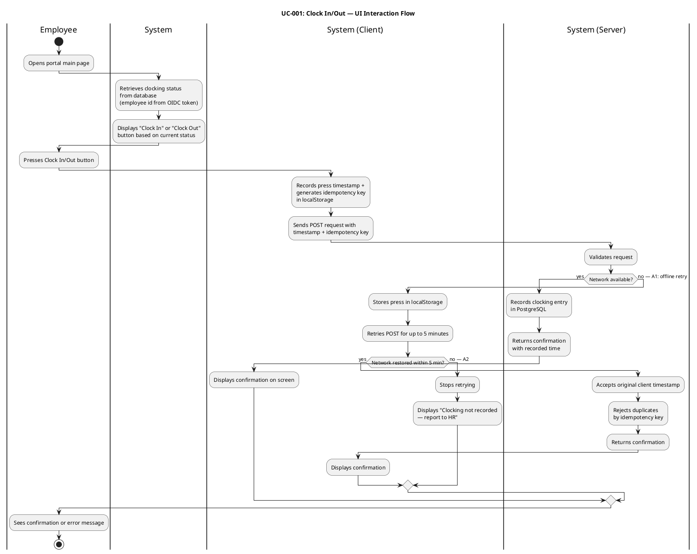
```plantuml
@startuml
title UC-001: Clock In/Out — UI Interaction Flow

|Employee|
start
:Opens portal main page;
|System|
:Retrieves clocking status\nfrom database\n(employee id from OIDC token);
:Displays "Clock In" or "Clock Out"\nbutton based on current status;
|Employee|
:Presses Clock In/Out button;
|System (Client)|
:Records press timestamp +\ngenerates idempotency key\nin localStorage;
:Sends POST request with\ntimestamp + idempotency key;
|System (Server)|
:Validates request;
if (Network available?) then (yes)
  :Records clocking entry\nin PostgreSQL;
  :Returns confirmation\nwith recorded time;
  |System (Client)|
  :Displays confirmation on screen;
else (no — A1: offline retry)
  :Stores press in localStorage;
  :Retries POST for up to 5 minutes;
  if (Network restored within 5 min?) then (yes)
    |System (Server)|
    :Accepts original client timestamp;
    :Rejects duplicates\nby idempotency key;
    :Returns confirmation;
    |System (Client)|
    :Displays confirmation;
  else (no — A2)
    |System (Client)|
    :Stops retrying;
    :Displays "Clocking not recorded\n— report to HR";
  endif
endif
|Employee|
:Sees confirmation or error message;
stop
@enduml
```

#### UC-005: Publish News — Interaction Flow

**Traces to:** UC-005 Main Flow steps 1–7
**Usability criteria:** USA-006 (publish without technical assistance), AC-002

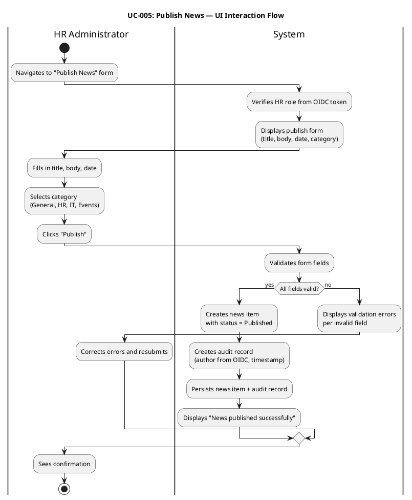
```plantuml
@startuml
title UC-005: Publish News — UI Interaction Flow

|HR Administrator|
start
:Navigates to "Publish News" form;
|System|
:Verifies HR role from OIDC token;
:Displays publish form\n(title, body, date, category);
|HR Administrator|
:Fills in title, body, date;
:Selects category\n(General, HR, IT, Events);
:Clicks "Publish";
|System|
:Validates form fields;
if (All fields valid?) then (yes)
  :Creates news item\nwith status = Published;
  :Creates audit record\n(author from OIDC, timestamp);
  :Persists news item + audit record;
  :Displays "News published successfully";
else (no)
  :Displays validation errors\nper invalid field;
  |HR Administrator|
  :Corrects errors and resubmits;
endif
|HR Administrator|
:Sees confirmation;
stop
@enduml
```

#### UC-007: Unpublish News — Interaction Flow

**Traces to:** UC-007 Main Flow steps 1–6
**Usability criteria:** CON-013 (never hard-delete), NFR-004 (audit trail)

```plantuml
@startuml
title UC-007: Unpublish News — UI Interaction Flow

|HR Administrator|
start
:Navigates to "News Management" list;
|System|
:Verifies HR role from OIDC token;
:Displays all news items with actions\n([Edit] [Unpublish]);
|HR Administrator|
:Clicks "Unpublish" on a news item;
|System|
:Displays confirmation dialog:\n"Unpublish this news item?\nIt will be hidden but not deleted.";
|HR Administrator|
:Clicks "Confirm";
|System|
:Sets news item status = Unpublished\n(does NOT delete record);
:Creates audit record\n(author, timestamp,\naction = Unpublished);
:Persists changes;
:Displays "News item unpublished";
|HR Administrator|
:Sees confirmation;
stop
@enduml
```

#### UC-008: Read and Filter News — Interaction Flow

**Traces to:** UC-008 Main Flow steps 1–7
**Usability criteria:** USA-001 (mandatory design), USA-004 (no prior training)

```plantuml
@startuml
title UC-008: Read and Filter News — UI Interaction Flow

|Employee|
start
:Navigates to main page;
|System|
:Retrieves published news items\nsorted by date (newest first);
:Identifies featured news items;
:Displays news feed with\nfeatured banners at top;
|Employee|
:Views news feed;
if (Wants to filter?) then (yes)
  :Selects category filter\n(General, HR, IT, Events);
  |System|
  :Filters news items\nby selected category;
  :Displays filtered results;
else (no)
  :Displays all news items;
endif
|Employee|
:Scrolls through news feed;
if (Clicks news item?) then (yes)
  |System|
  :Expands news detail (inline);
  |Employee|
  :Reads full news item;
  :Clicks "Collapse"\nto return to feed;
else (no)
  :Continues browsing;
endif
stop
@enduml
```

#### UC-009: Search Employee Directory — Interaction Flow

**Traces to:** UC-009 Main Flow steps 1–6, Alternative Flow A1 (no results)
**Usability criteria:** USA-003 (find colleague in <10s), AC-003, R001 (LDAP attribute risk)

```plantuml
@startuml
title UC-009: Search Employee Directory — UI Interaction Flow

|Employee|
start
:Navigates to "Employee Directory";
|System|
:Displays search form\n(name, department, office fields);
|Employee|
:Enters search criteria\n(name, department, or office);
:Clicks "Search";
|System|
:Queries Active Directory\nover LDAP with search criteria;
if (Results found?) then (yes)
  :Displays results list\n(name, job title, department,\noffice, email, extension);
  |Employee|
  :Views colleague information;
  if (Needs another search?) then (yes)
    :Enters new criteria;
    |System|
    :Queries AD again;
  else (no)
    :Done;
  endif
else (no results)
  :Displays "No employees found";
  |Employee|
  :Refines search criteria;
endif
stop
@enduml
```

#### UC-010: Manage Worker Category — Interaction Flow

**Traces to:** UC-010 Main Flow steps 1–8, Alternative Flows A1 (not found), A2 (invalid category)
**Usability criteria:** USA-006 (HR self-service), NFR-004 (audit trail)

```plantuml
@startuml
title UC-010: Manage Worker Category — UI Interaction Flow

|HR Administrator|
start
:Navigates to "Manage Worker Categories";
|System|
:Verifies HR role from OIDC token;
:Displays current category assignments\n(AD user id, category);
|HR Administrator|
:Searches for employee by AD user id;
|System|
:Looks up AD user id via LDAP;
if (Employee found in AD?) then (yes)
  :Displays employee name\n+ current category;
  |HR Administrator|
  :Assigns or updates category;
  :Clicks "Save";
  |System|
  :Validates category value;
  if (Category valid?) then (yes)
    :Persists worker category link\n(AD user id, category)\nin local table;
    :Creates audit record\n(author, timestamp,\naction = CategoryChanged);
    :Displays "Category updated successfully";
  else (no — A2)
    :Displays validation error;
  endif
else (no — A1)
  :Displays "Employee not found in AD";
endif
|HR Administrator|
:Sees confirmation or error;
stop
@enduml
```

#### Tabular Interaction Flows (Standard UCs)

**UC-002: View Own Clocking History** — Traces to UC-002 Main Flow steps 1–5. Usability: USA-005, USA-004.

| Step | Actor | Action | System Response |
|---|---|---|---|
| 1 | Employee | Clicks "My Clockings" from main page | Navigates to clocking history page |
| 2 | System | — | Retrieves current month's clocking records for authenticated employee |
| 3 | System | — | Displays table: date, time in, time out, direction |
| 4 | Employee | Reviews history | — |
| 5 | Employee | Clicks "Back" | Returns to main page |

**UC-003: View All Employee Clockings** — Traces to UC-003 Main Flow steps 1–6. Usability: USA-006.

| Step | Actor | Action | System Response |
|---|---|---|---|
| 1 | HR Admin | Navigates to "All Clockings" from HR dashboard | Verifies HR role from OIDC token |
| 2 | System | — | Displays filter controls (month selector, employee name search) |
| 3 | HR Admin | Selects month and/or enters employee name | — |
| 4 | System | — | Queries clockings from PostgreSQL; resolves employee name via LDAP |
| 5 | System | — | Displays results table: employee name, date, time in, time out, direction |
| 6 | HR Admin | Reviews clockings | — |

**UC-004: Export Monthly Clocking Report** — Traces to UC-004 Main Flow steps 1–5. Usability: USA-006, PERF-004.

| Step | Actor | Action | System Response |
|---|---|---|---|
| 1 | HR Admin | On "All Clockings" page, selects target month | — |
| 2 | HR Admin | Clicks "Export CSV" | — |
| 3 | System | — | Generates CSV file with all clockings for selected month |
| 4 | System | — | Triggers browser download dialog |
| 5 | HR Admin | Saves file | — |

**UC-006: Edit Published News** — Traces to UC-006 Main Flow steps 1–6. Usability: USA-006, NFR-004.

| Step | Actor | Action | System Response |
|---|---|---|---|
| 1 | HR Admin | Navigates to "News Management" list | Verifies HR role; displays all news items with [Edit] action |
| 2 | HR Admin | Clicks [Edit] on a news item | Opens edit form pre-populated with current title, body, date, category |
| 3 | HR Admin | Modifies fields and clicks "Save" | — |
| 4 | System | — | Validates form fields |
| 5 | System | — | Updates news item; creates audit record (author, timestamp, action = Edited) |
| 6 | System | — | Displays "News updated successfully"; returns to news management list |

### Wireframes (Salt)

The following Salt wireframes define the visual structure of all primary screens. CON-011: the custom design at `docs/inputs/employee-portal-design.html` is MANDATORY and authoritative for the UI visual layer — these wireframes capture the structural layout that the Implementer must follow.

#### Main Page (Employee)

```plantuml
@startsalt
title Primary Screen: Main Page (Employee)
{
  +Portal Cuba Corp - Employee Portal+
  +----------------------------------------------------------+
  |  [Logo]  Cuba Corp Portal          [Employee Name] [Logout]|
  +----------------------------------------------------------+
  |  Navigation: [Home] [My Clockings] [Directory]             |
  +----------------------------------------------------------+
  |  Clock In / Out                                            |
  |  +------------------------------------------------------+|
  |  |  Status: Not Clocked In                              ||
  |  |  [    Clock In    ]                                 ||
  |  +------------------------------------------------------+|
  +----------------------------------------------------------+
  |  Featured News                                            |
  |  +------------------------------------------------------+|
  |  | [BANNER] Company Picnic — Saturday Aug 30            ||
  |  +------------------------------------------------------+|
  +----------------------------------------------------------+
  |  News Feed                              [All] [General] [HR] [IT] [Events]|
  |  +------------------------------------------------------+|
  |  | HR Policy Update — HR — 08/27                        ||
  |  | Network Maintenance — IT — 08/25                     ||
  |  | Company Picnic — Events — 08/26                      ||
  |  +------------------------------------------------------+|
  +----------------------------------------------------------+
}
@endsalt
```

#### Publish News (HR)

```plantuml
@startsalt
title Primary Screen: Publish News (HR)
{
  +Portal Cuba Corp - HR Dashboard+
  +----------------------------------------------------------+
  |  [Logo]  Cuba Corp Portal          [HR Admin] [Logout]    |
  +----------------------------------------------------------+
  |  Navigation: [Home] [All Clockings] [Manage News] [Categories]|
  +----------------------------------------------------------+
  |  Publish News                                              |
  |  +------------------------------------------------------+|
  |  |  Title: [____________________________________]       ||
  |  |  Category: [General v]                              ||
  |  |  Date: [08/28/2026]                                 ||
  |  |  Body:                                              ||
  |  |  +------------------------------------------------+||
  |  |  |                                                |||
  |  |  |                                                |||
  |  |  |                                                |||
  |  |  +------------------------------------------------+||
  |  |  [Publish]  [Cancel]                               ||
  |  +------------------------------------------------------+|
  +----------------------------------------------------------+
}
@endsalt
```

#### Employee Directory Search

```plantuml
@startsalt
title Primary Screen: Employee Directory Search
{
  +Portal Cuba Corp - Employee Directory+
  +----------------------------------------------------------+
  |  [Logo]  Cuba Corp Portal          [Employee] [Logout]    |
  +----------------------------------------------------------+
  |  Navigation: [Home] [My Clockings] [Directory]             |
  +----------------------------------------------------------+
  |  Search Employee Directory                                 |
  |  +------------------------------------------------------+|
  |  |  Name: [____________]                                ||
  |  |  Department: [____________]                          ||
  |  |  Office: [All v]                                    ||
  |  |  [   Search   ]                                     ||
  |  +------------------------------------------------------+|
  +----------------------------------------------------------+
  |  Results                                                   |
  |  +------------------------------------------------------+|
  |  |Name           | Job Title  | Dept    | Office | Email|Ext||
  |  |M. Rodriguez   | Developer  | IT      | Havana | m.r@ | 123||
  |  |C. Perez       | Accountant | Finance | Havana | c.p@ | 456||
  |  |A. Gomez       | HR Staff   | HR      | Santiago| a.g@ | 789||
  |  +------------------------------------------------------+|
  +----------------------------------------------------------+
}
@endsalt
```

#### News Management (HR)

```plantuml
@startsalt
title Primary Screen: News Management (HR)
{
  +Portal Cuba Corp - HR Dashboard+
  +----------------------------------------------------------+
  |  [Logo]  Cuba Corp Portal          [HR Admin] [Logout]    |
  +----------------------------------------------------------+
  |  Navigation: [Home] [All Clockings] [Manage News] [Categories]|
  +----------------------------------------------------------+
  |  Manage News                              [Publish New]     |
  |  +------------------------------------------------------+|
  |  |Title              | Category | Date    | Status  | Actions   ||
  |  |Company Picnic     | Events   | 08/26   |Published|[Edit][Unpub]||
  |  |HR Policy Update   | HR       | 08/27   |Published|[Edit][Unpub]||
  |  |Network Maint.     | IT       | 08/25   |Unpublished|[Edit][Pub]||
  |  +------------------------------------------------------+|
  +----------------------------------------------------------+
}
@endsalt
```

#### All Clockings (HR)

```plantuml
@startsalt
title Primary Screen: All Clockings (HR)
{
  +Portal Cuba Corp - HR Dashboard+
  +----------------------------------------------------------+
  |  [Logo]  Cuba Corp Portal          [HR Admin] [Logout]    |
  +----------------------------------------------------------+
  |  Navigation: [Home] [All Clockings] [Manage News] [Categories]|
  +----------------------------------------------------------+
  |  All Employee Clockings                                    |
  |  +------------------------------------------------------+|
  |  |  Month: [August 2026 v]    [Export CSV]              ||
  |  |  Employee: [____________]                           ||
  |  +------------------------------------------------------+|
  |  +------------------------------------------------------+|
  |  |Employee    | Date    | Time In | Time Out | Direction||
  |  |M. Rodriguez| 08/28   | 08:32   | ---      | In      ||
  |  |C. Perez    | 08/28   | 08:45   | ---      | In      ||
  |  |A. Gomez    | 08/27   | 08:30   | 17:15    | In/Out  ||
  |  +------------------------------------------------------+|
  +----------------------------------------------------------+
}
@endsalt
```

#### Worker Categories (HR)

```plantuml
@startsalt
title Primary Screen: Worker Categories (HR)
{
  +Portal Cuba Corp - HR Dashboard+
  +----------------------------------------------------------+
  |  [Logo]  Cuba Corp Portal          [HR Admin] [Logout]    |
  +----------------------------------------------------------+
  |  Navigation: [Home] [All Clockings] [Manage News] [Categories]|
  +----------------------------------------------------------+
  |  Manage Worker Categories                                  |
  |  +------------------------------------------------------+|
  |  |  Search AD User: [____________]  [Search]             ||
  |  +------------------------------------------------------+|
  |  Current Assignments                                      |
  |  +------------------------------------------------------+|
  |  |AD User ID    | Employee Name  | Category  | Actions  ||
  |  |jrodriguez    | M. Rodriguez   | IT        | [Edit]   ||
  |  |cperez        | C. Perez       | Finance   | [Edit]   ||
  |  |agomez        | A. Gomez       | HR        | [Edit]   ||
  |  +------------------------------------------------------+|
  |  +------------------------------------------------------+|
  |  |  Assign Category                                     ||
  |  |  AD User ID: [____________]                          ||
  |  |  Category: [Select v]                                ||
  |  |  [   Save   ]                                        ||
  |  +------------------------------------------------------+|
  +----------------------------------------------------------+
}
@endsalt
```

### UI Patterns

> **Contributed by:** User-Interface Designer (Analysis & Design Discipline)
> **Purpose:** Interaction conventions, visual hierarchy, terminology, and accessibility rules that the Designer, Implementer, and Technical Writer must follow to ensure consistency across all screens. CON-011: the custom design at `docs/inputs/employee-portal-design.html` is MANDATORY and authoritative.

#### Interaction Conventions

| Pattern ID | Pattern | Rule | Rationale | Traces To |
|---|---|---|---|---|
| UIP-001 | Navigation bar | Persistent top navigation bar with role-based links. Employee: [Home] [My Clockings] [Directory]. HR: [Home] [All Clockings] [Manage News] [Categories]. | Consistency (Nielsen #4); recognition over recall (Nielsen #6) | CON-011, USA-004 |
| UIP-002 | Primary action button | Single prominent button per primary action (e.g., "Clock In" is the only large button on the main page). | Fitts's Law; error prevention (Nielsen #5) | USA-005, AC-001 |
| UIP-003 | Confirmation dialog | Destructive or irreversible actions (unpublish) require a confirmation dialog with clear wording: "Unpublish this news item? It will be hidden but not deleted." | User control and freedom (Nielsen #3); error prevention (Nielsen #5) | CON-013, UC-007 |
| UIP-004 | Inline feedback | Success/error messages appear inline on the same page (no redirect for confirmation). Clocking confirmation, validation errors, and audit confirmations display on-page. | Visibility of system status (Nielsen #1); minimize page reloads | NFR-002, USA-005 |
| UIP-005 | Form validation | Field-level validation errors display next to the invalid field. Summary of all errors at top of form. | Error recovery (Nielsen #9); error prevention (Nielsen #5) | USA-006, AC-002 |
| UIP-006 | Back navigation | Every non-main page has a "Back" link/button returning to the preceding hub screen. No dead-end screens. | User control and freedom (Nielsen #3) | Navigation Topology |
| UIP-007 | Category filter | News category filter uses pill/toggle buttons (All, General, HR, IT, Events) — not a dropdown. Selected state is visually distinct. | Recognition over recall (Nielsen #6); ease of use | USA-004, FR-008 |
| UIP-008 | Table actions | Action buttons in table rows use text labels ([Edit] [Unpublish]), not icons alone. | Recognition over recall (Nielsen #6); accessibility | USA-004 |

#### Visual Hierarchy

| Pattern ID | Element | Rule | Traces To |
|---|---|---|---|
| UIV-001 | Page header | Logo + portal name + user name + logout button. Consistent across all pages. | CON-011 |
| UIV-002 | Section headers | Each functional area on a page has a clear section header (e.g., "Clock In / Out", "Featured News", "News Feed"). | CON-011, USA-004 |
| UIV-003 | Featured news banner | Featured news items display with a visually distinct banner at the top of the news section. | FR-008, CON-011 |
| UIV-004 | Status indicators | Clocking status ("Not Clocked In" / "Clocked In at 08:32") is prominently displayed above the action button. | USA-005, AC-001 |
| UIV-005 | Table layout | Data tables (clockings, news management, directory results) use consistent column alignment: left-aligned text, right-aligned numbers. | CON-011 |

#### Terminology

| Term | Usage | Rationale |
|---|---|---|
| "Clock In" / "Clock Out" | Button labels — never "Check In", "Punch In", or "Register Entry" | Matches employee mental model; AC-001 |
| "My Clockings" | Navigation link to personal clocking history — never "Time Records" or "Attendance Log" | Self-descriptive; USA-004 |
| "Manage News" | HR navigation link — never "Content Management" or "Article Admin" | Simple, role-appropriate; AC-002 |
| "Unpublish" | Action to hide a news item — never "Delete" or "Remove" | CON-013: items are never hard-deleted |
| "Worker Categories" | HR navigation link — never "Employee Classification" or "Staff Tags" | Matches HR terminology |
| "Directory" | Navigation link — never "Phone Book" or "Contact List" | Replaces PDF phone directory; AC-003 |

#### Accessibility Rules

| Rule ID | Rule | Traces To |
|---|---|---|
| UIA-001 | All interactive elements (buttons, links, form fields) are keyboard-navigable. Tab order follows visual order. | WCAG 2.1 — Operable |
| UIA-002 | Color is never the sole indicator of status or category. Text labels accompany all color-coded elements. | WCAG 2.1 — Perceivable; R001 fallback |
| UIA-003 | Form fields have associated `<label>` elements. Error messages are programmatically associated with their fields. | WCAG 2.1 — Understandable |
| UIA-004 | Missing AD attributes display "N/A" text, not blank cells or red indicators. | R001 fallback; WCAG 2.1 — Robust |
| UIA-005 | Page uses semantic HTML structure (header, nav, main, section, footer). | WCAG 2.1 — Robust |

> **Note:** No specific accessibility standard (WCAG, EN 301 549, Section 508) was declared by the stakeholder in the Work Order. The rules above are baseline good practice derived from WCAG 2.1 principles. If the stakeholder declares a specific compliance level, these rules must be updated to reference it explicitly.

### UI Flow Coverage Summary

| UC | UI Significance | Flow Type | Diagram | UC Steps Covered |
|---|---|---|---|---|
| UC-001 | Critical (clocking + offline) | Activity (swimlanes) | ✅ | Main + A1, A2, A3 |
| UC-002 | Standard | Tabular | — | Main (5 steps) |
| UC-003 | Standard | Tabular | — | Main (6 steps) |
| UC-004 | Standard | Tabular | — | Main (5 steps) |
| UC-005 | Critical (publish + audit) | Activity (swimlanes) | ✅ | Main (7 steps) |
| UC-006 | Standard | Tabular | — | Main (6 steps) |
| UC-007 | Critical (unpublish + confirm) | Activity (swimlanes) | ✅ | Main (6 steps) |
| UC-008 | Critical (news feed + filter) | Activity (swimlanes) | ✅ | Main (7 steps) |
| UC-009 | Critical (directory + R001) | Activity (swimlanes) | ✅ | Main + A1 |
| UC-010 | Critical (category + audit) | Activity (swimlanes) | ✅ | Main + A1, A2 |
## Capsules, Protocols and Signals
### NewsItem Lifecycle State Machine (CLS-017)

The NewsItem entity has two lifecycle states governed by CON-013 (no hard delete) and NFR-004 (audit trail). Every transition is audited via `IAuditLogger.LogAudit()`. The implementation creates NewsItem directly as `Published` — there is no `Draft` state because no approval workflow exists in the declared scope.

> **Construction C2 Update:** The `Draft` state has been removed. The prior 3-state model (Draft → Published → Unpublished) assumed an intermediate creation step that does not exist in the implementation or the UC-005 flow. NewsItem is created as `Published` immediately upon `Publish()` call.

```plantuml
@startuml
title Portal Cuba Corp — NewsItem Lifecycle State Machine (CLS-017, Construction C2)

skinparam classAttributeIconSize 0

[*] --> Published : NewsService.Publish()\n(authorId, timestamp)
Published --> Published : Edit()\n(authorId, timestamp)\n[updates UpdatedAt]
Published --> Unpublished : Unpublish()\n(authorId, timestamp)
Unpublished --> Published : Publish()\n(re-publish allowed)

note right of Published
  Initial state when created.
  Visible to employees in news feed.
  Editable by HR (UC-006).
  Audit: AuditAction.Publish on creation,
  AuditAction.Edit on each edit.
  CON-013: never hard-deleted.
end note

note right of Unpublished
  Hidden from employee news feed.
  Record preserved for audit trail
  (CON-013, NFR-004).
  Can be re-published by HR.
  Audit: AuditAction.Unpublish.
end note

@enduml
```

### State Transition Audit Mapping

| From State | To State | Trigger | Audit Action (CLS-015) | UC |
|---|---|---|---|---|
| (new) | Published | Publish() | Publish | UC-005 |
| Published | Published | Edit() | Edit | UC-006 |
| Published | Unpublished | Unpublish() | Unpublish | UC-007 |
| Unpublished | Published | Publish() (re-publish) | Publish | UC-005 |

> **CON-013 enforcement:** No transition leads to a "Deleted" state. The Unpublished state is terminal unless HR explicitly re-publishes. The record remains in the `news_items` table indefinitely.

### Testability Entry Points

The design exposes dependency injection seams and observable state at every layer boundary, enabling unit tests without external dependencies (PostgreSQL, Active Directory, Keycloak).

| DI Seam | Interface | Test Replacement | Observable State |
|---|---|---|---|
| ClockingService → Persistence | INT-007 (IPersistence) | In-memory EF Core DbContext or mock IPersistence | ClockingRecord.IdempotencyKey uniqueness; ClockingResult.IsDuplicate flag |
| ClockingService → LDAP | INT-006 (ILdapGateway) | Mock returning preset LdapSearchResult | Employee name resolution in clocking list |
| NewsService → Persistence | INT-007 (IPersistence) | In-memory EF Core DbContext | NewsItem.Status transitions; NewsItem.UpdatedAt |
| NewsService → Audit | INT-005 (IAuditLogger) | Spy recording LogAudit calls | AuditAction enum; entityType; entityId; author; timestamp |
| DirectoryService → LDAP | INT-006 (ILdapGateway) | Mock returning LdapSearchResult with missing attributes | DirectoryEntry fields show "N/A" for missing attributes (R001) |
| WorkerCategoryService → Persistence | INT-007 (IPersistence) | In-memory EF Core DbContext | WorkerCategory upsert (INSERT ... ON CONFLICT UPDATE) |
| WorkerCategoryService → LDAP | INT-006 (ILdapGateway) | Mock returning preset DirectoryEntry | AD user lookup for category assignment |
| WorkerCategoryService → Audit | INT-005 (IAuditLogger) | Spy recording LogAudit calls | AuditAction.CategoryChanged; entityId = adUserId |
| PersistenceGateway → DbContext | CLS-008 (PortalDbContext) | EF Core in-memory provider | DbSet<Clockings/NewsItems/WorkerCategories/AuditRecords> queryable state |
| LdapGateway → Connection Pool | CLS-010 (LdapConnectionPool) | Mock ILdapConnection | Search filter construction; connection acquire/release |

> **Test harness pattern:** Register mock implementations in `IServiceCollection` during test setup. All services accept dependencies via constructor injection — no service locator, no static state. The `ExecuteInTransactionAsync` callback pattern allows tests to verify transactional behavior by asserting that audit records are only persisted when the business operation succeeds.
## Traceability
| Element | Traces From | Link Type | Traces To |
|---|---|---|---|
| **Analysis Classes** | | | |
| ACL-001 (ClockingUI) | UC-001, FR-001 | Derives | CLS-001, V001 |
| ACL-002 (ClockingController) | UC-001, UC-002, UC-003, UC-004, NFR-002 | Derives | CLS-001, INT-001 |
| ACL-003 (ClockingRecord) | UC-001 | Derives | CLS-016 |
| ACL-004 (DirectorySearchUI) | UC-009, FR-009 | Derives | CLS-003, V007 |
| ACL-005 (DirectoryController) | UC-009, R001, CON-005 | Derives | CLS-003, INT-003 |
| ACL-006 (DirectoryEntry) | UC-009, CON-012 | Derives | CLS-020 |
| ACL-007 (NewsUI) | UC-005, UC-006, UC-007 | Derives | CLS-002, V004, V005, V006 |
| ACL-008 (NewsController) | UC-005, UC-006, UC-007, NFR-004 | Derives | CLS-002, INT-002 |
| ACL-009 (NewsItem) | UC-005, UC-006, UC-007, UC-008 | Derives | CLS-017 |
| ACL-010 (AuditRecord) | UC-005, UC-006, UC-007, UC-010, NFR-004 | Derives | CLS-019 |
| ACL-011 (CategoryUI) | UC-010, FR-010 | Derives | CLS-004, V008 |
| ACL-012 (CategoryController) | UC-010, CON-009 | Derives | CLS-004, INT-004 |
| ACL-013 (WorkerCategory) | UC-010, CON-009 | Derives | CLS-018 |
| ACL-014 (NewsFeedUI) | UC-008, FR-008 | Derives | CLS-002, V001 |
| ACL-015 (NewsFeedController) | UC-008 | Derives | CLS-002, INT-002 |
| **Use-Case Realizations** | | | |
| SEQ-001 (UC-001 Clock In/Out) | UC-001, AC-005, NFR-002 | Derives | CLS-001, CLS-007, CLS-016 |
| SEQ-002 (UC-002 Clocking History) | UC-002, FR-002 | Derives | CLS-001, CLS-007 |
| SEQ-003 (UC-003 All Clockings) | UC-003, FR-003, CON-009 | Derives | CLS-001, CLS-006, CLS-007 |
| SEQ-004 (UC-004 CSV Export) | UC-004, FR-004, PERF-004 | Derives | CLS-001, CLS-006, CLS-007 |
| SEQ-005 (UC-005 Publish News) | UC-005, NFR-004, AC-002, CR-010 | Derives | CLS-002, CLS-005, CLS-007, CLS-017 |
| SEQ-006 (UC-006 Edit News) | UC-006, NFR-004, CR-010 | Derives | CLS-002, CLS-005, CLS-007 |
| SEQ-007 (UC-007 Unpublish News) | UC-007, CON-013, NFR-004 | Derives | CLS-002, CLS-005, CLS-007 |
| SEQ-008 (UC-008 Read/Filter News) | UC-008, FR-008, CR-010 | Derives | CLS-002, CLS-007 |
| SEQ-009 (UC-009 Directory Search) | UC-009, R001, CON-005, CON-012 | Derives | CLS-003, CLS-006 |
| SEQ-010 (UC-010 Manage Category) | UC-010, CON-009, NFR-004 | Derives | CLS-004, CLS-005, CLS-006, CLS-007 |
| **Design Classes — Services** | | | |
| CLS-001 (ClockingService) | ACL-002, COMP-002, INT-001 | Realizes | INT-007 |
| CLS-002 (NewsService) | ACL-008, COMP-003, INT-002 | Realizes | INT-005, INT-007 |
| CLS-003 (DirectoryService) | ACL-005, COMP-001, INT-003 | Realizes | INT-006 |
| CLS-004 (WorkerCategoryService) | ACL-012, COMP-004, INT-004 | Realizes | INT-005, INT-006, INT-007 |
| CLS-005 (AuditInterceptor) | ACL-010, COMP-008, INT-005 | Realizes | INT-007 |
| **Design Classes — Infrastructure** | | | |
| CLS-006 (LdapGateway) | COMP-005, INT-006 | Realizes | (AD external) |
| CLS-007 (PersistenceGateway) | COMP-006, INT-007 | Realizes | CLS-008 |
| CLS-008 (PortalDbContext) | COMP-006, CON-003 | Derives | CLS-016, CLS-017, CLS-018, CLS-019 |
| CLS-009 (LdapSettings) | CON-005, R001 | Derives | CLS-006 |
| CLS-010 (LdapConnectionPool) | CON-005 | Derives | CLS-006 |
| **Design Classes — Domain** | | | |
| CLS-011 (ClockType enum) | FR-001 | Derives | CLS-016 |
| CLS-012 (ClockStatus enum) | FR-001 | Derives | (UI) |
| CLS-013 (NewsCategory enum) | FR-005 | Derives | CLS-017 |
| CLS-014 (NewsStatus enum) | CON-013, FR-007 | Derives | CLS-017 |
| CLS-015 (AuditAction enum) | NFR-004 | Derives | CLS-019 |
| CLS-016 (ClockingRecord) | ACL-003, FR-001, AC-005 | Derives | T1 (clockings) |
| CLS-017 (NewsItem) | ACL-009, FR-005, CON-013, FR-008 | Derives | T2 (news_items) |
| CLS-018 (WorkerCategory) | ACL-013, FR-010, CON-009 | Derives | T3 (worker_categories) |
| CLS-019 (AuditRecord) | ACL-010, NFR-004 | Derives | T4 (audit_records) |
| CLS-020 (DirectoryEntry) | ACL-006, CON-009, CON-012 | Derives | (not persisted — AD projection) |
| CLS-021 (DateRange) | — | Derives | (value object) |
| CLS-022 (ClockingResult) | AC-005 | Derives | CLS-016 |
| CLS-023 (LdapSearchResult) | CON-005 | Derives | CLS-006 |
| **Interfaces** | | | |
| INT-001 (IClockingService) | COMP-002, SAD | Derives | CLS-001 |
| INT-002 (INewsService) | COMP-003, SAD, CR-010 | Derives | CLS-002 |
| INT-003 (IDirectoryService) | COMP-001, SAD | Derives | CLS-003 |
| INT-004 (IWorkerCategoryService) | COMP-004, SAD | Derives | CLS-004 |
| INT-005 (IAuditLogger) | COMP-008, SAD | Derives | CLS-005 |
| INT-006 (ILdapGateway) | COMP-005, SAD | Derives | CLS-006 |
| INT-007 (IPersistence) | COMP-006, SAD | Derives | CLS-007 |
| **State Machines** | | | |
| NewsItem Lifecycle | CLS-017, CON-013, NFR-004 | Derives | CLS-002, CLS-005 |
| **Testability Entry Points** | | | |
| DI Seam: IPersistence | INT-007, CLS-007 | Derives | Test harness (in-memory DbContext) |
| DI Seam: ILdapGateway | INT-006, CLS-006 | Derives | Test harness (mock LDAP) |
| DI Seam: IAuditLogger | INT-005, CLS-005 | Derives | Test harness (audit spy) |
| **UI Elements (from UI Designer)** | | | |
| V001 (MainPageModel) | UC-001, UC-008, CON-011 | Derives | CLS-001, CLS-002 |
| V002 (ClockingPageModel) | UC-002 | Derives | CLS-001 |
| V003 (AllClockingsModel) | UC-003, UC-004 | Derives | CLS-001 |
| V004 (PublishNewsModel) | UC-005, AC-002, CR-010 | Derives | CLS-002 |
| V005 (EditNewsModel) | UC-006, CR-010 | Derives | CLS-002 |
| V006 (NewsManagementModel) | UC-007, CON-013 | Derives | CLS-002 |
| V007 (DirectorySearchModel) | UC-009, AC-003, R001 | Derives | CLS-003 |
| V008 (WorkerCategoryModel) | UC-010, CON-009 | Derives | CLS-004 |
| Navigation Topology | All UCs, CON-011 | Derives | V001–V008 |
| UI Patterns | CON-011, USA-001–USA-006 | Refines | V001–V008, Implementer |
| Wireframes | CON-011, All UCs | Derives | V001–V008 |
| **Database Tables** | | | |
| T1 (clockings) | CLS-016, AC-005 | Derives | PostgreSQL (CON-003) |
| T2 (news_items) | CLS-017, CON-013 | Derives | PostgreSQL (CON-003) |
| T3 (worker_categories) | CLS-018, CON-009 | Derives | PostgreSQL (CON-003) |
| T4 (audit_records) | CLS-019, NFR-004 | Derives | PostgreSQL (CON-003) |
| **Implementation Source Files** | | | |
| IClockingService.cs | INT-001 | Realizes | src/PortalCubaCorp.Application/IClockingService.cs |
| ClockingService.cs | CLS-001, INT-001 | Implements | src/PortalCubaCorp.Application/ClockingService.cs |
| INewsService.cs | INT-002 | Realizes | src/PortalCubaCorp.Application/INewsService.cs |
| NewsService.cs | CLS-002, INT-002 | Implements | src/PortalCubaCorp.Application/NewsService.cs |
| IDirectoryService.cs | INT-003 | Realizes | src/PortalCubaCorp.Application/IDirectoryService.cs |
| DirectoryService.cs | CLS-003, INT-003 | Implements | src/PortalCubaCorp.Application/DirectoryService.cs |
| IWorkerCategoryService.cs | INT-004 | Realizes | src/PortalCubaCorp.Application/IWorkerCategoryService.cs |
| WorkerCategoryService.cs | CLS-004, INT-004 | Implements | src/PortalCubaCorp.Application/WorkerCategoryService.cs |
| NewsItem.cs | CLS-017 | Implements | src/PortalCubaCorp.Domain/NewsItem.cs |
| ClockingRecord.cs | CLS-016 | Implements | src/PortalCubaCorp.Domain/ClockingRecord.cs |
| DirectoryEntry.cs | CLS-020 | Implements | src/PortalCubaCorp.Domain/DirectoryEntry.cs |
| Enums.cs | CLS-011..CLS-015 | Implements | src/PortalCubaCorp.Domain/Enums.cs |
