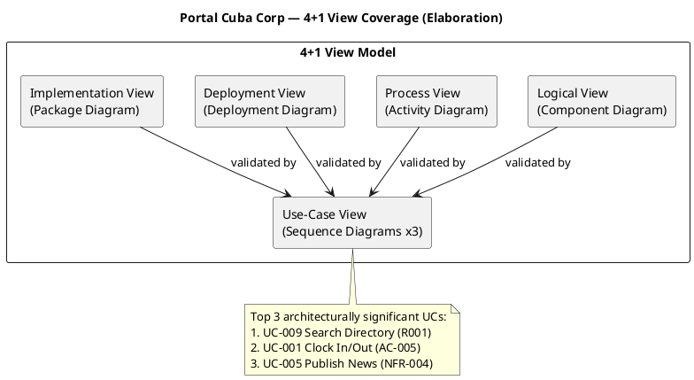
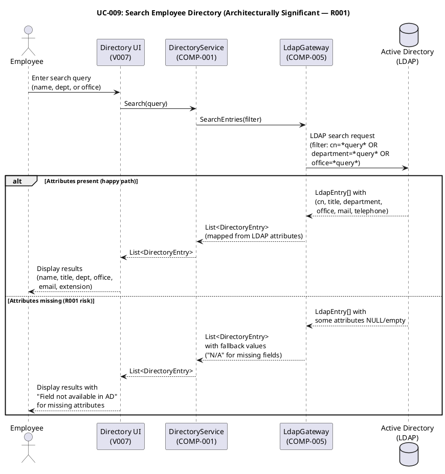
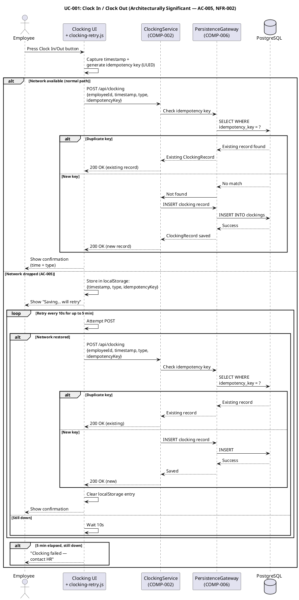
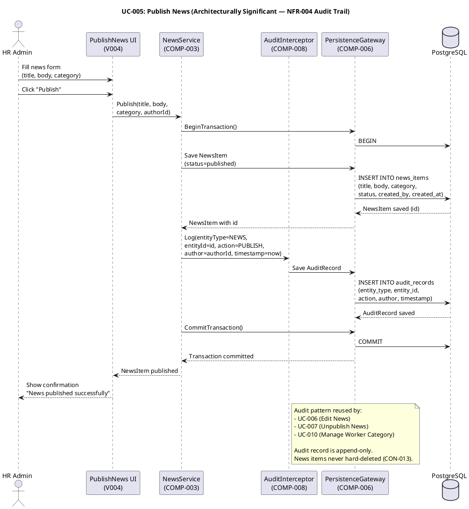
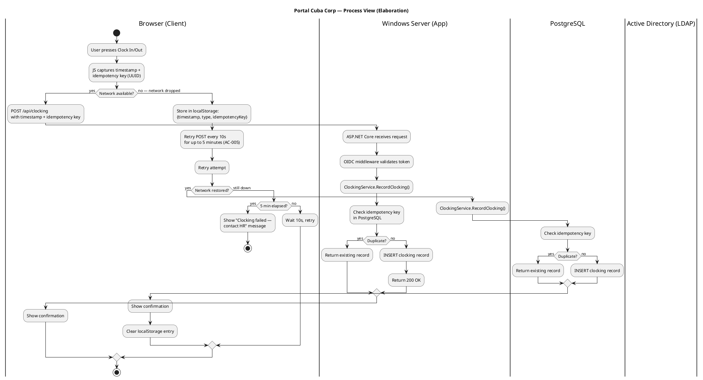
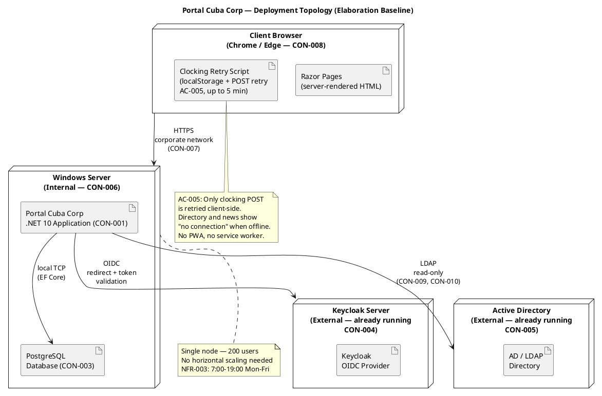
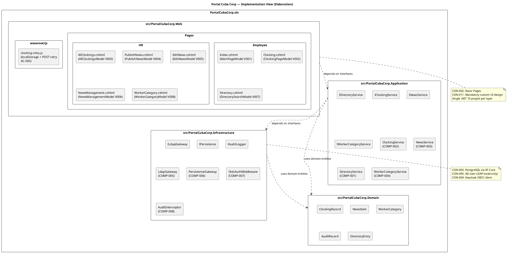

## Document Control

| Field | Value |
|---|---|
| Phase | Elaboration |
| Status | Draft |
| Milestone Target | End of Elaboration (LCA) |
| Iteration | 1 (Cycle 1) |
| Date | 2026-08-28 |
| Review Findings | No findings target this artifact from Inception LCO review — all prior findings resolved |
| Version Policy | Reconciled — .NET 10 pinned by enterprise policy; all NuGet packages at latest stable (verified Elaboration Iter 1) |
| Prior Phase | Inception candidate architecture — evolved to Elaboration baseline |

## Architectural Representation

This document presents the **architectural baseline** for Portal Cuba Corp — evolved from the Inception candidate to a full 4+1 view model per RUP Elaboration requirements. All five views are now addressed with UML diagrams.

The 4+1 view model is addressed as follows for Elaboration:

| View | Elaboration Depth | Section |
|---|---|---|
| Logical | **Baselined** — all subsystems, interfaces with method signatures, design mechanisms | Logical View |
| Deployment | **Baselined** — topology, nodes, artifacts, network paths | Deployment View |
| Process | **Baselined** — concurrency model, offline retry fault tolerance, request lifecycle | Process View |
| Implementation | **Baselined** — solution structure, project layout, build organization | Implementation View |
| Use-Case | **Baselined** — top 3 architecturally significant scenarios with sequence diagrams | Use-Case View |

## Architectural Goals and Constraints

### Declared Technology Stack

| Constraint | Technology | Version (resolved) | Source |
|---|---|---|---|
| CON-001 | .NET 10, REST API | 10 (pinned by enterprise policy) | Work Order |
| CON-002 | Razor Pages (no SPA) | — | Work Order |
| CON-003 | PostgreSQL | latest stable via EF Core provider 10.0.3 | Work Order |
| CON-004 | Keycloak OIDC (external, already running) | — | Work Order |
| CON-005 | Active Directory over LDAP (read-only) | — | Work Order |
| CON-006 | Internal Windows Server hosting | — | Work Order |
| CON-007 | No access outside corporate network | — | Work Order |
| CON-008 | Chrome and Edge compatibility | — | Work Order |
| CON-011 | Mandatory custom UI design (docs/inputs/employee-portal-design.html) | — | Work Order |

### Resolved Package Versions

| Package | Ecosystem | Version | Rationale |
|---|---|---|---|
| .NET | framework | 10 | Enterprise policy pin (CON-001) |
| Microsoft.AspNetCore.Authentication.OpenIdConnect | nuget | 10.0.11 | Latest stable, .NET 10 aligned (CON-004) |
| Npgsql.EntityFrameworkCore.PostgreSQL | nuget | 10.0.3 | Latest stable, .NET 10 aligned (CON-003) |
| Novell.Directory.Ldap.NETStandard | nuget | 4.0.0 | Latest stable, LDAP client for AD read (CON-005) |

### Architectural Goals

1. **Risk-driven decomposition:** Subsystem boundaries encapsulate the highest-volatility areas identified in the Use-Case Model — LDAP attribute mapping (R001, Volatility: High) and offline clocking retry (AC-005, Volatility: Medium).
2. **Interface-based flexibility:** Every subsystem boundary is defined by an interface, enabling the LDAP Gateway to be swapped or mocked for testing without affecting the Directory Service.
3. **Proportionality:** 200 users, 3 offices, single Windows Server — no horizontal scaling, no microservices, no message queues. A simple layered monolith is the correct architecture for this scope.
4. **Auditability:** The audit interceptor is a cross-cutting mechanism applied to News Service and Worker Category Service — not scattered across business logic.

### Architecture Decision Records

#### ADR-001: Layered Monolith (not Microservices)

| Field | Value |
|---|---|
| Context | 200 users, 3 offices, single Windows Server, intranet-only (CON-006, CON-007) |
| Decision | Layered monolith with 3 layers (Presentation, Application, Infrastructure) |
| Alternatives | Microservices (rejected: operational overhead unjustified for 200 users); Modular monolith (rejected: single team, no need for module-level deployment) |
| Trade-offs | Simpler deployment and debugging vs. limited independent scaling (not needed) |
| Consequences | All components share one process; no network hops between layers; single deployment unit |

#### ADR-002: PostgreSQL via EF Core

| Field | Value |
|---|---|
| Context | Portal needs ACID persistence for clockings, news, worker categories, audit records (CON-003) |
| Decision | PostgreSQL with EF Core as ORM, centralized in Persistence Gateway (COMP-006) |
| Alternatives | Direct ADO.NET (rejected: boilerplate overhead); Dapper (rejected: EF Core query tracking needed for audit) |
| Trade-offs | ORM overhead vs. developer productivity and migration support |
| Consequences | All DB access through IPersistence interface; migrations managed via EF Core |

#### ADR-003: LDAP with Attribute Mapping and Fallback

| Field | Value |
|---|---|
| Context | AD attributes may be inconsistent across 3 offices (R001, exposure=9). Directory is read-only from AD (CON-005, CON-009, CON-010) |
| Decision | LDAP Gateway (COMP-005) reads raw LDAP entries; Directory Service (COMP-001) maps attributes with fallback values for missing fields |
| Alternatives | Sync AD data to local DB (rejected: CON-009 explicitly forbids); Direct LDAP from UI (rejected: violates layering) |
| Trade-offs | Real-time AD dependency vs. no stale data; attribute mapping complexity encapsulated in one subsystem |
| Consequences | Directory search latency depends on AD infrastructure; missing attributes show "N/A" not errors; R001 risk isolated to COMP-001 + COMP-005 |

#### ADR-004: Offline Clocking Retry via localStorage

| Field | Value |
|---|---|
| Context | AC-005 requires clocking to survive a 5-minute network drop. CON-002 mandates Razor Pages (no SPA, no PWA) |
| Decision | Client-side JavaScript on the rendered Razor page stores the clock press in localStorage and retries the POST for up to 5 minutes. Server accepts client timestamp and rejects duplicates via idempotency key |
| Alternatives | Service Worker / PWA (rejected: CON-002 forbids SPA/PWA); Server-side sync queue (rejected: CON-009 scope excludes sync jobs) |
| Trade-offs | Only clocking is retried — directory and news show "no connection"; client timestamp trusted (idempotency key prevents duplicates) |
| Consequences | Clocking UI carries a JS retry script; ClockingService must accept idempotency keys; PostgreSQL unique index on idempotency_key |

#### ADR-005: Keycloak OIDC Client (No Local User Store)

| Field | Value |
|---|---|
| Context | Keycloak is already running and maintained separately (CON-004). Portal is an OIDC client only |
| Decision | ASP.NET Core OIDC middleware validates tokens; roles read from claims; no local user store |
| Alternatives | Local user store with sync from Keycloak (rejected: CON-004 forbids); SAML (rejected: OIDC is the modern standard Keycloak supports) |
| Trade-offs | External dependency on Keycloak availability vs. zero user management overhead |
| Consequences | Portal cannot authenticate if Keycloak is down; HR role check via claim; all UCs require valid OIDC token |

## Use-Case View

### Architecturally Significant Use Cases (Prioritized for Elaboration)

| Priority | UC ID | Name | Architectural Significance | Risk |
|---|---|---|---|---|
| 1 | UC-009 | Search Employee Directory | LDAP integration with AD — highest risk (R001, exposure=9). Attributes may be inconsistent across 3 offices. Must be prototyped early. | R001 |
| 2 | UC-001 | Clock In / Clock Out | Offline retry mechanism (AC-005) — client-side localStorage + POST retry with idempotency key. NFR-002: <1s response. | R006 |
| 3 | UC-005 | Publish News | Audit trail mechanism (NFR-004) — establishes the audit pattern reused by UC-006, UC-007, UC-010. | — |
| 4 | UC-010 | Manage Worker Category | Bridges local DB (AD user id → category) with LDAP read — exercises both persistence and LDAP gateways. | R001 |
| 5 | UC-004 | Export Monthly Clocking Report | CSV export of potentially large dataset — performance consideration (NFR-001). | — |

**Rationale:** UC-009 is prioritized first because R001 (exposure=9) is the highest risk in the project. The LDAP attribute consistency problem must be confronted in Elaboration Iteration 1. UC-001 is second because the offline retry mechanism (AC-005) is a hidden architectural risk (R006, exposure=6) that requires design validation. UC-005 establishes the audit trail pattern that UC-006, UC-007, and UC-010 all depend on.

### Use-Case Realization: UC-009 — Search Employee Directory

### Use-Case Realization: UC-001 — Clock In / Clock Out

### Use-Case Realization: UC-005 — Publish News

## Logical View

The architecture is a **layered monolith** with three layers. Subsystem decomposition follows the "decompose by change" principle — each subsystem encapsulates ONE area of volatility identified in the Use-Case Model.

### Subsystem Decomposition

| Component | ID | Encapsulates | Volatility | Interfaces |
|---|---|---|---|---|
| Directory Service | COMP-001 | LDAP attribute mapping for 3 offices — if AD schema varies, only this subsystem changes | High (R001) | IDirectoryService |
| Clocking Service | COMP-002 | Clocking recording + idempotency key acceptance + offline retry contract | Medium (AC-005) | IClockingService |
| News Service | COMP-003 | News lifecycle (publish/edit/unpublish) + audit trail integration | Low | INewsService |
| Worker Category Service | COMP-004 | AD user id → category mapping, bridges local DB and LDAP | Medium | IWorkerCategoryService |
| LDAP Gateway | COMP-005 | Raw LDAP connection, attribute extraction, read-only enforcement | High (R001) | ILdapGateway |
| Persistence Gateway | COMP-006 | EF Core + PostgreSQL — all DB access centralized | Low | IPersistence |
| OIDC Auth Middleware | COMP-007 | Keycloak OIDC token validation, role extraction from claims | Low-Med (R003) | (middleware pipeline) |
| Audit Interceptor | COMP-008 | Cross-cutting: records author + timestamp for news ops and category changes | Low | IAuditLogger |

### Interface Specifications

| Interface | Method | Parameters | Returns | Description |
|---|---|---|---|---|
| IClockingService | RecordClocking | employeeId: string, timestamp: DateTime, type: ClockType, idempotencyKey: string | ClockingResult | Records a clock in/out with idempotency check |
| IClockingService | GetHistory | employeeId: string, month: DateRange | List\<ClockingRecord\> | Returns clocking history for an employee |
| IClockingService | GetAllClockings | month: DateRange | List\<ClockingRecord\> | Returns all employees' clockings (HR only) |
| IClockingService | ExportCsv | month: DateRange | Stream | Returns CSV stream of monthly clockings |
| INewsService | Publish | title: string, body: string, category: NewsCategory, authorId: string | NewsItem | Publishes a news item with audit |
| INewsService | Edit | id: int, title: string, body: string, category: NewsCategory, authorId: string | NewsItem | Edits a published news item with audit |
| INewsService | Unpublish | id: int, authorId: string | NewsItem | Unpublishes (hides) a news item with audit |
| INewsService | ListPublished | categoryFilter: NewsCategory? | List\<NewsItem\> | Lists published news, optionally filtered |
| INewsService | GetById | id: int | NewsItem | Gets a single news item by ID |
| IDirectoryService | Search | query: string | List\<DirectoryEntry\> | Searches AD by name, department, or office |
| IDirectoryService | GetByAdUserId | adUserId: string | DirectoryEntry | Gets a single employee by AD user ID |
| IWorkerCategoryService | AssignCategory | adUserId: string, category: string, authorId: string | void | Assigns a worker category with audit |
| IWorkerCategoryService | GetCategory | adUserId: string | string | Gets the category for an AD user ID |
| IWorkerCategoryService | ListAll | — | List\<WorkerCategory\> | Lists all worker category mappings |
| ILdapGateway | SearchEntries | filter: string | List\<LdapEntry\> | Searches AD entries matching the LDAP filter |
| ILdapGateway | GetEntryByDn | dn: string | LdapEntry | Gets a single AD entry by distinguished name |
| IPersistence | Save | entity: T | void | Persists an entity |
| IPersistence | Query\<T\> | predicate: Expression | List\<T\> | Queries entities matching the predicate |
| IPersistence | BeginTransaction | — | ITransaction | Starts a DB transaction |
| IAuditLogger | Log | entityType: string, entityId: int, action: string, author: string, timestamp: DateTime | void | Records an audit entry (append-only) |

### Component Diagram

```plantuml
@startuml
title Portal Cuba Corp — Logical View (Elaboration Baseline)

skinparam componentStyle rectangle
skinparam packageStyle rectangle

package "Presentation Layer — Razor Pages (CON-002)" as PL {
  component "Clocking UI +\nOffline Retry Script (AC-005)" as CLK_UI
  component "News UI\n(Filter, Featured, Read)" as NEWS_UI
  component "Directory UI\n(Search, Results)" as DIR_UI
  component "HR Admin UI\n(News Mgmt, Clockings,\nCategories, Export)" as HR_UI
}

package "Application Layer" as AL {
  component "Clocking Service\n(COMP-002)" as CLK_SVC
  component "News Service\n(COMP-003)" as NEWS_SVC
  component "Directory Service\n(COMP-001)" as DIR_SVC
  component "Worker Category Service\n(COMP-004)" as WC_SVC
}

package "Infrastructure Layer" as IL {
  component "LDAP Gateway\n(AD read-only, CON-005)" as LDAP_GW
  component "Persistence Gateway\n(EF Core + PostgreSQL, CON-003)" as PERSIST_GW
  component "OIDC Auth Middleware\n(Keycloak, CON-004)" as OIDC_MW
  component "Audit Interceptor\n(NFR-004)" as AUDIT_INT
}

interface "IClockingService" as IClock
interface "INewsService" as INews
interface "IDirectoryService" as IDir
interface "IWorkerCategoryService" as IWC
interface "ILdapGateway" as ILdap
interface "IPersistence" as IPersist
interface "IAuditLogger" as IAudit

CLK_SVC -- IClock
NEWS_SVC -- INews
DIR_SVC -- IDir
WC_SVC -- IWC
LDAP_GW -- ILdap
PERSIST_GW -- IPersist
AUDIT_INT -- IAudit

CLK_UI ..> IClock
NEWS_UI ..> INews
DIR_UI ..> IDir
HR_UI ..> IClock
HR_UI ..> INews
HR_UI ..> IWC

CLK_SVC ..> IPersist
CLK_SVC ..> IAudit
NEWS_SVC ..> IPersist
NEWS_SVC ..> IAudit
DIR_SVC ..> ILdap
WC_SVC ..> IPersist
WC_SVC ..> ILdap
WC_SVC ..> IAudit

OIDC_MW ..> CLK_UI : auth context
OIDC_MW ..> NEWS_UI : auth context
OIDC_MW ..> DIR_UI : auth context
OIDC_MW ..> HR_UI : auth + role check

note right of DIR_SVC
  **Volatility: HIGH** (R001)
  Encapsulates LDAP attribute
  mapping for 3 offices.
  If AD schema varies, only
  this subsystem changes.
end note

note right of CLK_SVC
  **Volatility: MEDIUM** (AC-005)
  Idempotency key + client
  timestamp acceptance.
  Offline retry script in
  Presentation calls this API.
end note

note left of OIDC_MW
  **Volatility: LOW-MED** (R003)
  External dependency on
  Keycloak — already running.
  Portal is OIDC client only.
end note

@enduml
```

### Design Mechanisms

Design mechanisms are the concrete realization of the analysis mechanisms identified in Inception. Each mechanism specifies the CAPABILITY it provides, the PROPERTIES it must hold, and the concrete solution shape.

| Analysis Mechanism | Design Mechanism | Capability | Properties | Concrete Solution | Components |
|---|---|---|---|---|---|
| Persistence | EF Core + PostgreSQL | Store and retrieve portal-owned data | ACID transactions; CRUD for entities; CSV export query support; never stores employee data (CON-009); unique index on idempotency_key | DbContext with DbSet\<T\> per entity; migrations via EF Core; IPersistence interface wraps DbContext | COMP-006 |
| Directory Access | LDAP Gateway + Attribute Mapping | Read corporate attributes from AD on demand | Read-only LDAP; never writes to AD (CON-010); no local copy (CON-009); attribute mapping with fallback for missing fields (R001) | Novell.Directory.Ldap.NETStandard client; ILdapGateway interface; DirectoryService maps LdapEntry → DirectoryEntry with "N/A" fallback | COMP-005, COMP-001 |
| Authentication & Authorization | OIDC Middleware | Verify employee identity and determine HR role | OIDC client only; role claims from token; no Keycloak management (CON-004) | Microsoft.AspNetCore.Authentication.OpenIdConnect; role check via [Authorize(Roles="HR")] | COMP-007 |
| Audit Trail | Audit Interceptor | Record who + when for news ops and category changes | Append-only; never hard-delete news (CON-013); author from OIDC token; timestamp from server | IAuditLogger interface; AuditInterceptor called within same DB transaction as business operation; separate audit_records table | COMP-008 |
| Offline Clocking Retry | localStorage + POST Retry | Allow clocking POST to survive 5-min network drop | Client-side localStorage; retry POST for up to 5 min; idempotency key prevents duplicates; server accepts client timestamp; only clocking — not directory/news | clocking-retry.js on Razor page; IClockingService accepts idempotencyKey parameter; PostgreSQL unique index on clockings.idempotency_key | COMP-002, Clocking UI |
| CSV Export | Streaming Response | Generate monthly clocking report in CSV | Streaming response; HR-only access; date-range filtered | IClockingService.ExportCsv returns Stream; Razor Page writes to Response.Body | COMP-002, COMP-006 |

## Process View

The system is a single-server ASP.NET Core application for 200 users with extended working hours (NFR-003: 7:00–19:00 Mon–Fri). Concurrency is low — at most ~200 concurrent sessions with simple request/response patterns. The ASP.NET Core thread pool handles concurrency natively; no custom threading or message queues are needed.

### Concurrency Model

| Aspect | Design |
|---|---|
| Thread pool | ASP.NET Core default thread pool — no custom configuration needed for 200 users |
| Request handling | One thread per request; requests are short-lived (DB query or LDAP read) |
| LDAP connections | Connection pooling via Novell.Directory.Ldap.NETStandard — reusable LDAP connections |
| DB connections | EF Core connection pooling via Npgsql — default pool size sufficient |
| Concurrent access to clockings | Unique index on idempotency_key prevents duplicate inserts under concurrent retries |
| Audit trail | Written within same DB transaction as business operation — no separate thread needed |

### Fault Tolerance: Offline Clocking Retry (AC-005)

The only fault tolerance mechanism in the system is the client-side clocking retry. When the network drops for up to 5 minutes, the clocking POST is buffered in the browser's localStorage and retried. All other features (directory, news) show a "no connection" message — no client-side caching of AD or news data per CON-009.

## Deployment View

Single-node deployment on internal Windows Server. No cloud, no horizontal scaling, no load balancer — proportional to 200 users on a corporate intranet.

### Deployment Notes

- **Single Windows Server (CON-006):** The .NET 10 application and PostgreSQL run on the same internal server. No separate database server is needed for 200 users.
- **External systems:** Keycloak and Active Directory are already running and maintained by the Infrastructure team (STK-003). The portal connects to them as clients only.
- **Network boundary (CON-007):** All access is within the corporate network. No public-facing endpoints, no reverse proxy for external access.
- **Client-side offline (AC-005):** Only the clocking POST is retried via localStorage. The page-level JavaScript on the already-rendered Razor page stores the press timestamp and retries the POST for up to 5 minutes. The server accepts the client's timestamp and rejects duplicates via an idempotency key. No PWA, no service worker, no client cache of directory or news data.

## Implementation View

The solution is organized as a layered .NET 10 solution with projects mirroring the architectural layers. Each project corresponds to one layer; dependencies flow downward only (Presentation → Application → Infrastructure → Domain).

### Build Structure

| Project | Layer | Dependencies | Purpose |
|---|---|---|---|
| PortalCubaCorp.Web | Presentation | Application, Domain | Razor Pages, static files, OIDC middleware wiring |
| PortalCubaCorp.Application | Application | Infrastructure (interfaces only), Domain | Service interfaces and implementations |
| PortalCubaCorp.Infrastructure | Infrastructure | Domain | EF Core DbContext, LDAP gateway, OIDC middleware, audit interceptor |
| PortalCubaCorp.Domain | Domain | (none) | Domain entities: ClockingRecord, NewsItem, WorkerCategory, AuditRecord, DirectoryEntry |

### Dependency Rules

- **Presentation → Application:** Web project references Application project for service interfaces. DI registers Infrastructure implementations.
- **Application → Infrastructure (interfaces only):** Application project references Infrastructure project for interface types (ILdapGateway, IPersistence, IAuditLogger) but NOT concrete implementations. DI wires implementations at runtime.
- **Infrastructure → Domain:** Infrastructure project references Domain for entity types used in persistence.
- **Domain → (none):** Domain project has no dependencies. Pure entity definitions.

## Data View

### Portal-Owned Data (PostgreSQL)

| Entity | Stored Fields | Source | Audit |
|---|---|---|---|
| Clocking Record | employee_id (AD user id), timestamp, type (in/out), idempotency_key | Client POST (UC-001) | No |
| News Item | id, title, body, category, status (published/unpublished), created_by, created_at, updated_by, updated_at | HR publish/edit/unpublish (UC-005/006/007) | Yes (AUD-001) |
| Worker Category | ad_user_id, category | HR manage (UC-010) | Yes (AUD-002) |
| Audit Record | id, entity_type, entity_id, action, author, timestamp | Audit interceptor (COMP-008) | Append-only |

### AD-Projected Data (NOT stored in portal DB — CON-009)

| Attribute | Source | Read When |
|---|---|---|
| name, job title, department, office, email, extension | AD over LDAP (CON-005) | Directory search (UC-009), Worker Category display (UC-010) |

**Critical constraint (CON-009):** The portal stores ONLY `ad_user_id → category`. Everything else is projected from AD at read time. No sync job, no reconciliation, no conflict resolution.

### Key Database Constraints

| Constraint | Implementation | Rationale |
|---|---|---|
| Unique idempotency_key on clockings | PostgreSQL UNIQUE INDEX | Prevents duplicate clocking records from offline retry (AC-005) |
| News items never hard-deleted | status column (published/unpublished) + application logic | CON-013: unpublishing hides, never deletes |
| Audit records append-only | No UPDATE/DELETE on audit_records table | NFR-004: immutable audit trail |
| Worker category: 2 columns only | Table: (ad_user_id, category) | CON-009: nothing else stored locally |

## Size and Performance

| NFR | Requirement | Architectural Tactic |
|---|---|---|
| NFR-001 | Page load < 3s on corporate network | Server-rendered Razor Pages (no SPA bundle); minimal client JS (only clocking retry); PostgreSQL local TCP (no network hop) |
| NFR-002 | Clock in/out response < 1s | Single INSERT to local PostgreSQL; idempotency key check via unique index; no LDAP call needed for clocking |
| NFR-003 | 7:00–19:00 Mon–Fri availability | Single server with standard Windows Server uptime; no 24/7 requirement; fault tolerance = no data loss on brief network drop (AC-005) |
| AC-003 | Directory search < 10s | LDAP query to AD on demand; results not cached locally (CON-009); LDAP query performance depends on AD infrastructure (R001 risk) |

## Quality

| Quality Attribute | Tactic | Status |
|---|---|---|
| Security | OIDC authentication via Keycloak (CON-004); role-based authorization from token claims; no access outside corporate network (CON-007); read-only LDAP (CON-010) | Addressed in baseline architecture |
| Auditability | Audit interceptor (COMP-008) as cross-cutting mechanism; append-only audit records; news never hard-deleted (CON-013); audit within same DB transaction as business operation | Addressed in baseline architecture |
| Availability | Single server for 200 users; offline clocking retry for 5-min network drops (AC-005); other features show "no connection" | Addressed; offline mechanism designed in Process View |
| Performance | Local PostgreSQL (no network hop); server-rendered pages (no SPA overhead); LDAP query for directory (R001 risk) | Addressed; LDAP performance to be validated against real AD |
| Maintainability | Interface-based subsystem boundaries; each subsystem encapsulates one volatility area; layered monolith (simple to deploy and debug); 4-project solution structure | Addressed in baseline architecture |

## Traceability

| Element | Traces From | Link Type | Traces To |
|---|---|---|---|
| COMP-001 (Directory Service) | UC-009, R001, CON-005 | Derives | COMP-005 (LDAP Gateway) |
| COMP-002 (Clocking Service) | UC-001, AC-005, NFR-002 | Derives | COMP-006 (Persistence), COMP-008 (Audit) |
| COMP-003 (News Service) | UC-005, UC-006, UC-007, NFR-004 | Derives | COMP-006 (Persistence), COMP-008 (Audit) |
| COMP-004 (Worker Category Service) | UC-010, CON-009, NFR-004 | Derives | COMP-005 (LDAP), COMP-006 (Persistence), COMP-008 (Audit) |
| COMP-005 (LDAP Gateway) | CON-005, CON-009, CON-010 | Derives | COMP-001, COMP-004 |
| COMP-006 (Persistence Gateway) | CON-003, CON-001 | Derives | COMP-002, COMP-003, COMP-004 |
| COMP-007 (OIDC Auth Middleware) | CON-004, SEC-001, SEC-002 | Derives | All UCs (auth) |
| COMP-008 (Audit Interceptor) | NFR-004, AUD-001, AUD-002, AUD-003 | Derives | COMP-003, COMP-004 |
| ADR-001 (Layered Monolith) | CON-001, CON-002, CON-006 | Derives | All components |
| ADR-002 (PostgreSQL via EF Core) | CON-003, CON-001 | Derives | COMP-006 |
| ADR-003 (LDAP with Attribute Mapping) | CON-005, CON-009, CON-010, R001 | Derives | COMP-001, COMP-005 |
| ADR-004 (Offline Clocking Retry) | AC-005, CON-002, R006 | Derives | COMP-002, Clocking UI |
| ADR-005 (Keycloak OIDC Client) | CON-004, SEC-001, SEC-002, R003 | Derives | COMP-007 |
| SEQ-001 (UC-009 Directory Search) | UC-009, R001 | Derives | COMP-001, COMP-005 |
| SEQ-002 (UC-001 Clock In/Out) | UC-001, AC-005, NFR-002 | Derives | COMP-002, COMP-006 |
| SEQ-003 (UC-005 Publish News) | UC-005, NFR-004 | Derives | COMP-003, COMP-008, COMP-006 |
| Stack: .NET 10 | CON-001, enterprise policy pin | Derives | ADR-001, ADR-002 |
| Stack: PostgreSQL | CON-003 | Derives | ADR-002, COMP-006 |
| Stack: Keycloak OIDC | CON-004 | Derives | ADR-005, COMP-007 |
| Stack: AD LDAP | CON-005 | Derives | ADR-003, COMP-005 |
| Stack: Novell.Directory.Ldap | CON-005 | Derives | COMP-005, ADR-003 |
| Implementation View (4 projects) | ADR-001, CON-001 | Derives | All components |
| Process View (offline retry) | AC-005, R006 | Derives | COMP-002, Clocking UI |
| Design Mechanisms (6) | Analysis Mechanisms (Inception) | Refines | All components |