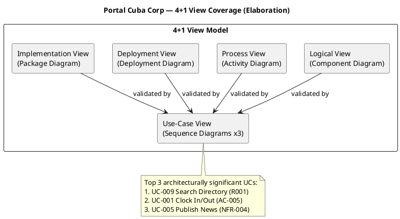
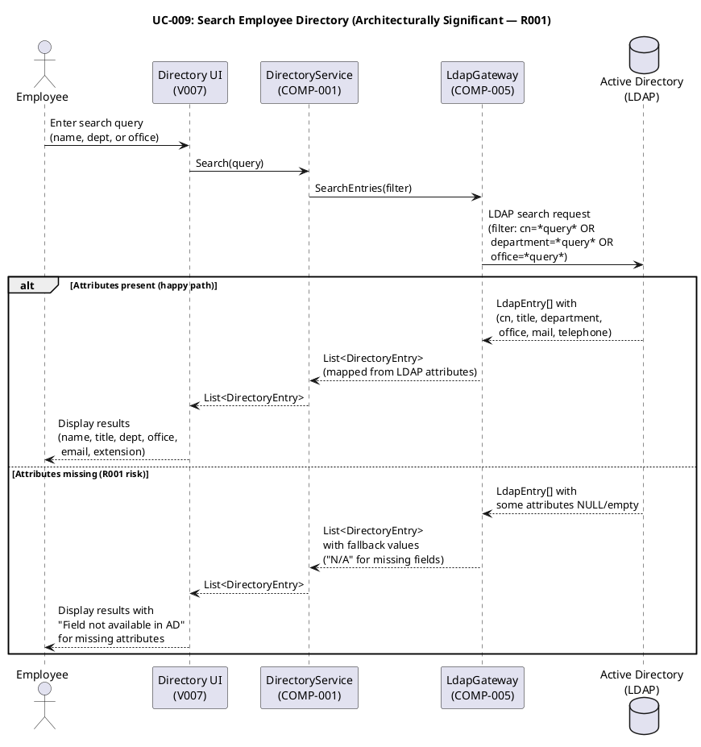
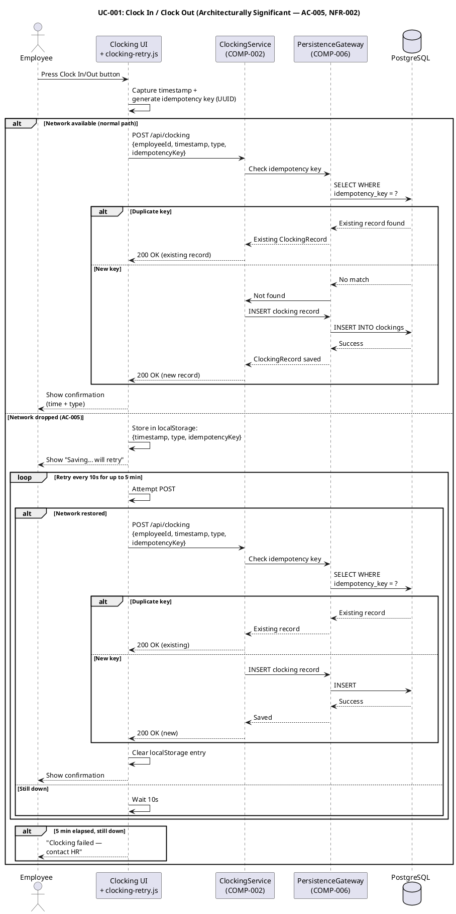
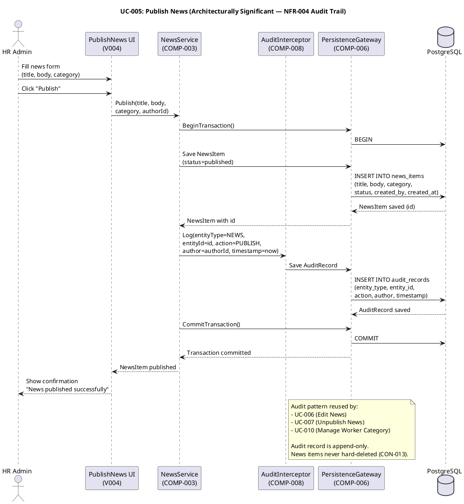
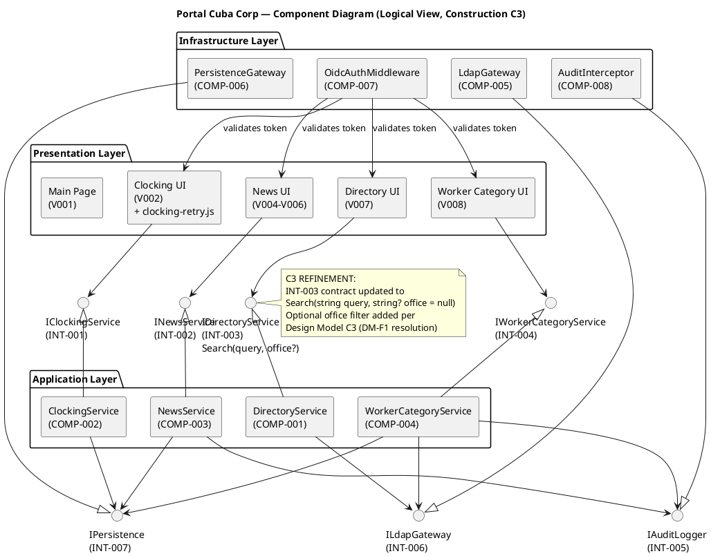
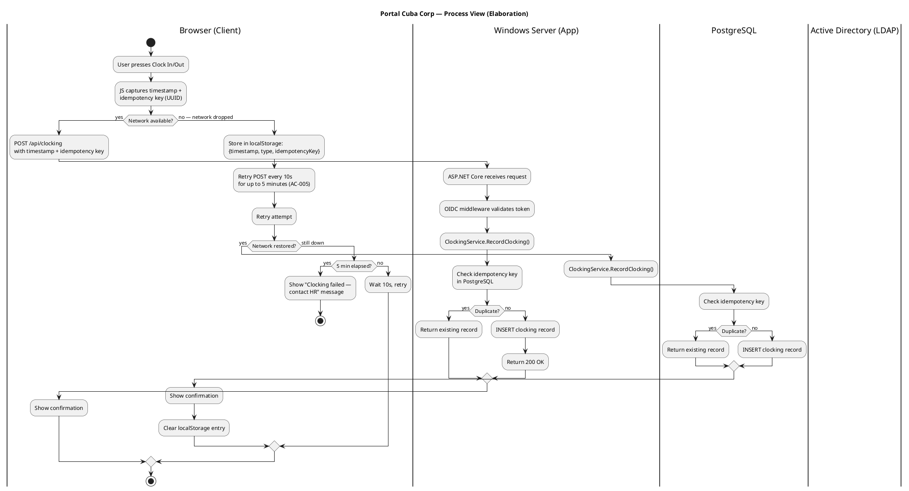
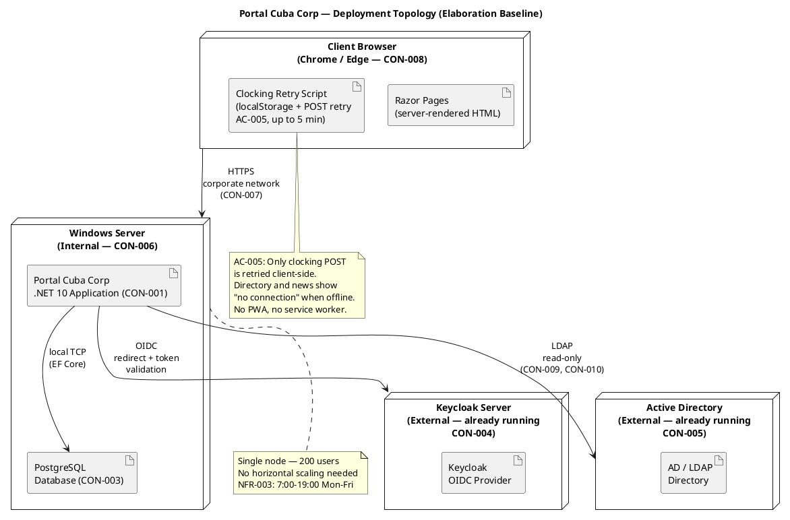
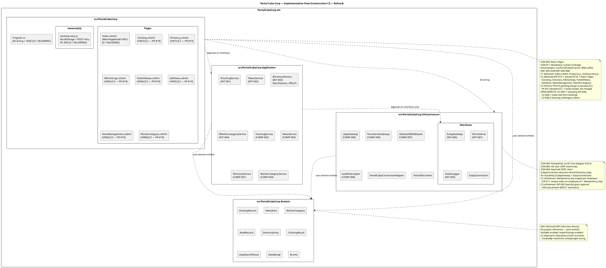
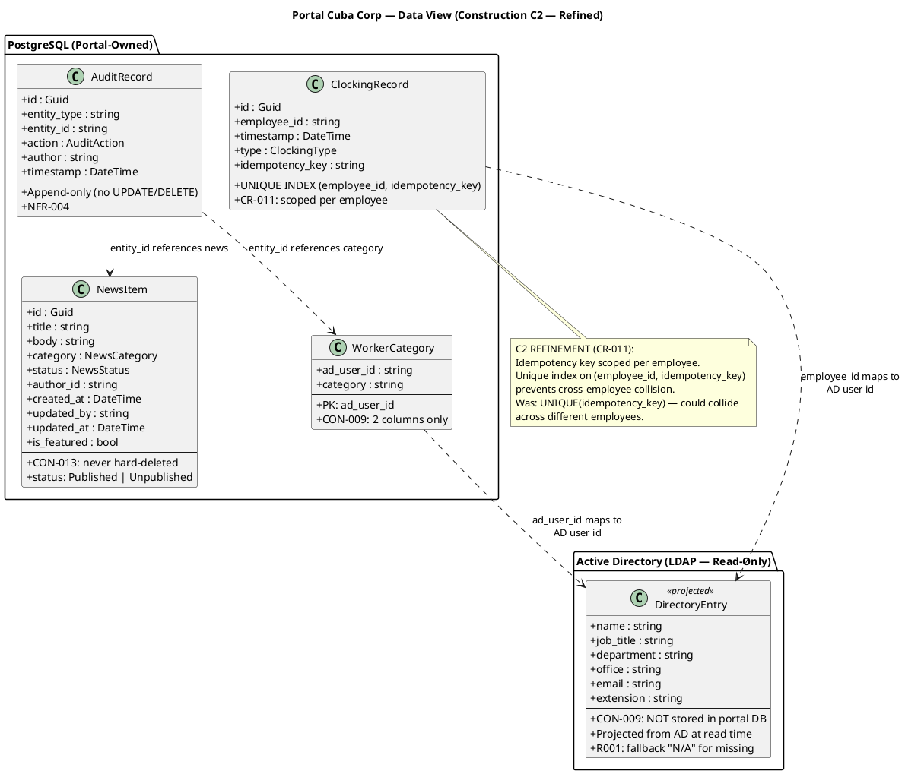

## Document Control
| Field | Value |
|---|---|
| Phase | Construction |
| Status | Active — Governance |
| Milestone Target | End of Construction |
| Iteration | 4 (Cycle 1) |
| Date | 2026-08-29 |
| Review Findings | Elaboration LCA achieved — 0 Critical, 0 Major open. Construction C1: no architectural findings. Construction C2: no findings targeting SAD; refinement updates applied (Implementation View, Data View). Construction C3: no findings targeting SAD; INT-003 contract refinement (office parameter) applied; Implementation View updated with C2/C3 delivery status; PR #21 architecturally approved. Construction C4 (final): no findings targeting SAD; C4-1 (isFeatured in Edit) and C4-2 (transaction wrapping) both RESOLVED in PR #33; PR #33 architecturally APPROVED (iteration-baseline merge to main); no architectural erosion detected. |
| Version Policy | Reconciled — .NET 10 pinned by enterprise policy; all NuGet packages at 10.0.0 (verified Construction C1, unchanged from Elaboration) |
| Prior Phase | Elaboration baseline (LCA achieved, stakeholder sanction GRANTED) |
| PoC Decisions | R001: single-mechanism (execution pending — CR-001 concurred); R006: single-mechanism (execution pending — CR-002 concurred); R003: analysis-only (coordination with STK-003) |
| Construction C1 Governance | CR concurrence: #1 CONCUR, #2 CONCUR. Refinement: Implementation View project naming + ILdapConnection + domain entities (minor-local). No iteration-baseline PR at time of governance run. |
| Construction C2 Governance | CR concurrence: no `needs-architect-review` CRs pending. Refinement: Implementation View updated with C1 delivery status + C2 targets; Data View updated with CR-011 idempotency key scoping (minor-local). Iteration-baseline PR #9 APPROVED. Issue #16 (missing Architect approval) resolved. |
| Construction C3 Governance | CR concurrence: no `needs-architect-review` CRs pending. Refinement: Logical View component diagram updated with INT-003 office parameter (DM-F1 resolution); Implementation View updated with C2 delivery status (7 Razor Pages in PR #19). Iteration-baseline PR #21 ARCHITECTURALLY APPROVED (Issue #26 updated). 3 code-level defects (C2-CRIT-1, C2-MAJ-1, C2-MAJ-2) persist — not architectural, assigned to Implementer. Stakeholder directive on PR synchronization noted. |
| Construction C4 Governance (initial) | CR concurrence: no `needs-architect-review` CRs pending. Issue #31 (missing Architect approval on PR #29) RESOLVED — PR #29 closed, architectural sign-off confirmed, issue closed with `architect:concurs`. Refinement: source verification against implementation confirmed 2 implementation gaps (C4-1: Edit missing isFeatured, C4-2: audit not wrapped in transaction) — both minor-local, SAD interface contracts and mechanism designs are CORRECT, implementation must catch up. No architectural erosion detected. |
| Construction C4 Governance (final) | CR concurrence: no `needs-architect-review` CRs pending. C4-1 (isFeatured in EditAsync) RESOLVED in PR #33 — `EditAsync` now includes `isFeatured` parameter matching INT-002 contract. C4-2 (transaction wrapping) RESOLVED in PR #33 — application-layer interfaces migrated to async (`Task<T>`) with transaction wrapping per INT-007. C4-F1 (Minor — Design Model async method names lag) — not an SAD finding; Designer responsibility. PR #33 (iteration/C4 → main) ARCHITECTURALLY APPROVED — 16 files, +313/-294, all changes within Application layer interfaces and tests, no cross-layer violations, no bypassed interfaces, no new coupling, no architectural mechanism changes. Architecture remains stable through C4. |
## Architectural Representation

This document presents the **architectural baseline** for Portal Cuba Corp — evolved from the Inception candidate to a full 4+1 view model per RUP Elaboration requirements. All five views are now addressed with UML diagrams.

The 4+1 view model is addressed as follows for Elaboration:

| View | Elaboration Depth | Section |
|---|---|---|
| Logical | **Baselined** — all subsystems, interfaces with method signatures, design mechanisms | Logical View |
| Deployment | **Baselined** — topology, nodes, artifacts, network paths | Deployment View |
| Process | **Baselined** — concurrency model, offline retry fault tolerance, request lifecycle | Process View |
| Implementation | **Baselined** — solution structure, project layout, build organization | Implementation View |
| Use-Case | **Baselined** — top 3 architecturally significant scenarios with sequence diagrams | Use-Case View |

## Architectural Goals and Constraints

### Declared Technology Stack

| Constraint | Technology | Version (resolved) | Source |
|---|---|---|---|
| CON-001 | .NET 10, REST API | 10 (pinned by enterprise policy) | Work Order |
| CON-002 | Razor Pages (no SPA) | — | Work Order |
| CON-003 | PostgreSQL | latest stable via EF Core provider 10.0.3 | Work Order |
| CON-004 | Keycloak OIDC (external, already running) | — | Work Order |
| CON-005 | Active Directory over LDAP (read-only) | — | Work Order |
| CON-006 | Internal Windows Server hosting | — | Work Order |
| CON-007 | No access outside corporate network | — | Work Order |
| CON-008 | Chrome and Edge compatibility | — | Work Order |
| CON-011 | Mandatory custom UI design (docs/inputs/employee-portal-design.html) | — | Work Order |

### Resolved Package Versions

| Package | Ecosystem | Version | Rationale |
|---|---|---|---|
| .NET | framework | 10 | Enterprise policy pin (CON-001) |
| Microsoft.AspNetCore.Authentication.OpenIdConnect | nuget | 10.0.11 | Latest stable, .NET 10 aligned (CON-004) |
| Npgsql.EntityFrameworkCore.PostgreSQL | nuget | 10.0.3 | Latest stable, .NET 10 aligned (CON-003) |
| Novell.Directory.Ldap.NETStandard | nuget | 4.0.0 | Latest stable, LDAP client for AD read (CON-005) |

### Architectural Goals

1. **Risk-driven decomposition:** Subsystem boundaries encapsulate the highest-volatility areas identified in the Use-Case Model — LDAP attribute mapping (R001, Volatility: High) and offline clocking retry (AC-005, Volatility: Medium).
2. **Interface-based flexibility:** Every subsystem boundary is defined by an interface, enabling the LDAP Gateway to be swapped or mocked for testing without affecting the Directory Service.
3. **Proportionality:** 200 users, 3 offices, single Windows Server — no horizontal scaling, no microservices, no message queues. A simple layered monolith is the correct architecture for this scope.
4. **Auditability:** The audit interceptor is a cross-cutting mechanism applied to News Service and Worker Category Service — not scattered across business logic.

### Architecture Decision Records

#### ADR-001: Layered Monolith (not Microservices)

| Field | Value |
|---|---|
| Context | 200 users, 3 offices, single Windows Server, intranet-only (CON-006, CON-007) |
| Decision | Layered monolith with 3 layers (Presentation, Application, Infrastructure) |
| Alternatives | Microservices (rejected: operational overhead unjustified for 200 users); Modular monolith (rejected: single team, no need for module-level deployment) |
| Trade-offs | Simpler deployment and debugging vs. limited independent scaling (not needed) |
| Consequences | All components share one process; no network hops between layers; single deployment unit |

#### ADR-002: PostgreSQL via EF Core

| Field | Value |
|---|---|
| Context | Portal needs ACID persistence for clockings, news, worker categories, audit records (CON-003) |
| Decision | PostgreSQL with EF Core as ORM, centralized in Persistence Gateway (COMP-006) |
| Alternatives | Direct ADO.NET (rejected: boilerplate overhead); Dapper (rejected: EF Core query tracking needed for audit) |
| Trade-offs | ORM overhead vs. developer productivity and migration support |
| Consequences | All DB access through IPersistence interface; migrations managed via EF Core |

#### ADR-003: LDAP with Attribute Mapping and Fallback

| Field | Value |
|---|---|
| Context | AD attributes may be inconsistent across 3 offices (R001, exposure=9). Directory is read-only from AD (CON-005, CON-009, CON-010) |
| Decision | LDAP Gateway (COMP-005) reads raw LDAP entries; Directory Service (COMP-001) maps attributes with fallback values for missing fields |
| Alternatives | Sync AD data to local DB (rejected: CON-009 explicitly forbids); Direct LDAP from UI (rejected: violates layering) |
| Trade-offs | Real-time AD dependency vs. no stale data; attribute mapping complexity encapsulated in one subsystem |
| Consequences | Directory search latency depends on AD infrastructure; missing attributes show "N/A" not errors; R001 risk isolated to COMP-001 + COMP-005 |

#### ADR-004: Offline Clocking Retry via localStorage

| Field | Value |
|---|---|
| Context | AC-005 requires clocking to survive a 5-minute network drop. CON-002 mandates Razor Pages (no SPA, no PWA) |
| Decision | Client-side JavaScript on the rendered Razor page stores the clock press in localStorage and retries the POST for up to 5 minutes. Server accepts client timestamp and rejects duplicates via idempotency key |
| Alternatives | Service Worker / PWA (rejected: CON-002 forbids SPA/PWA); Server-side sync queue (rejected: CON-009 scope excludes sync jobs) |
| Trade-offs | Only clocking is retried — directory and news show "no connection"; client timestamp trusted (idempotency key prevents duplicates) |
| Consequences | Clocking UI carries a JS retry script; ClockingService must accept idempotency keys; PostgreSQL unique index on idempotency_key |

#### ADR-005: Keycloak OIDC Client (No Local User Store)

| Field | Value |
|---|---|
| Context | Keycloak is already running and maintained separately (CON-004). Portal is an OIDC client only |
| Decision | ASP.NET Core OIDC middleware validates tokens; roles read from claims; no local user store |
| Alternatives | Local user store with sync from Keycloak (rejected: CON-004 forbids); SAML (rejected: OIDC is the modern standard Keycloak supports) |
| Trade-offs | External dependency on Keycloak availability vs. zero user management overhead |
| Consequences | Portal cannot authenticate if Keycloak is down; HR role check via claim; all UCs require valid OIDC token |

## Use-Case View

### Architecturally Significant Use Cases (Prioritized for Elaboration)

| Priority | UC ID | Name | Architectural Significance | Risk |
|---|---|---|---|---|
| 1 | UC-009 | Search Employee Directory | LDAP integration with AD — highest risk (R001, exposure=9). Attributes may be inconsistent across 3 offices. Must be prototyped early. | R001 |
| 2 | UC-001 | Clock In / Clock Out | Offline retry mechanism (AC-005) — client-side localStorage + POST retry with idempotency key. NFR-002: <1s response. | R006 |
| 3 | UC-005 | Publish News | Audit trail mechanism (NFR-004) — establishes the audit pattern reused by UC-006, UC-007, UC-010. | — |
| 4 | UC-010 | Manage Worker Category | Bridges local DB (AD user id → category) with LDAP read — exercises both persistence and LDAP gateways. | R001 |
| 5 | UC-004 | Export Monthly Clocking Report | CSV export of potentially large dataset — performance consideration (NFR-001). | — |

**Rationale:** UC-009 is prioritized first because R001 (exposure=9) is the highest risk in the project. The LDAP attribute consistency problem must be confronted in Elaboration Iteration 1. UC-001 is second because the offline retry mechanism (AC-005) is a hidden architectural risk (R006, exposure=6) that requires design validation. UC-005 establishes the audit trail pattern that UC-006, UC-007, and UC-010 all depend on.

### Use-Case Realization: UC-009 — Search Employee Directory

### Use-Case Realization: UC-001 — Clock In / Clock Out

### Use-Case Realization: UC-005 — Publish News

## Logical View
The architecture is a **layered monolith** with three layers. Subsystem decomposition follows the "decompose by change" principle — each subsystem encapsulates ONE area of volatility identified in the Use-Case Model.

### Subsystem Decomposition (by Volatility)

| Subsystem | Component | Volatility Encapsulated | Interface | Key Methods |
|---|---|---|---|---|
| Directory Service | COMP-001 | LDAP attribute mapping (R001, High) — AD schema changes, attribute naming, office filter | INT-003 | `Search(string query, string? office = null)` |
| Clocking Service | COMP-002 | Offline retry mechanism (AC-005, Medium) — idempotency, client timestamp, retry logic | INT-001 | `RecordClocking(employeeId, timestamp, type, idempotencyKey)`, `GetClockings(employeeId, month)`, `GetAllClockings(month)`, `ExportCsv(month)` |
| News Service | COMP-003 | News lifecycle (Medium) — publish/edit/unpublish state transitions, audit trail | INT-002 | `Publish(title, body, category, isFeatured, authorId)`, `Edit(id, title, body, category, isFeatured, editedBy)`, `Unpublish(id, unpublishedBy)`, `GetById(id)`, `ListAll()` |
| Worker Category Service | COMP-004 | Category mapping (Low) — AD user id → category link table | INT-004 | `GetAll()`, `GetByAdUserId(adUserId)`, `SetCategory(adUserId, category, changedBy)` |
| LDAP Gateway | COMP-005 | LDAP connectivity (High) — Novell LDAP library, connection management, attribute extraction | INT-006 | `Search(filter)`, `GetByDn(dn)` |
| Persistence Gateway | COMP-006 | Database access (Low) — EF Core, PostgreSQL, migrations | INT-007 | `InsertClocking(record)`, `FindByIdempotencyKey(employeeId, key)`, `GetClockings(employeeId, range)`, `GetAllClockings(range)`, `InsertNewsItem(item)`, `GetNewsItem(id)`, `UpdateNewsItem(item)`, `GetAllNews()`, `InsertWorkerCategory(wc)`, `GetAllWorkerCategories()`, `GetWorkerCategory(adUserId)`, `InsertAuditRecord(record)`, `BeginTransaction()`, `CommitTransaction()` |
| OIDC Auth Middleware | COMP-007 | Authentication (Low) — Keycloak OIDC, token validation, role extraction | (cross-cutting) | ASP.NET Core middleware pipeline |
| Audit Interceptor | COMP-008 | Audit logging (Low) — append-only audit records within transaction boundary | INT-005 | `Log(entityType, entityId, action, author)` |

### Design Mechanisms

| Mechanism | Capability | Properties | Implementation | Component |
|---|---|---|---|---|
| Persistence | CRUD for clockings, news, worker categories, audit records | ACID transactions via EF Core; PostgreSQL; unique index on (employee_id, idempotency_key) per CR-011 | PersistenceGateway in PortalCubaCorp.Infrastructure; IPersistence interface in PortalCubaCorp.Infrastructure | COMP-006 |
| LDAP Directory Access | Read corporate data from AD over LDAP | Read-only (CON-005, CON-010); attribute fallback "N/A" for missing fields (R001); no private data (CON-012); optional office filter (C3) | LdapGateway in PortalCubaCorp.Infrastructure; ILdapGateway + ILdapConnection interfaces for testability | COMP-005 |
| OIDC Authentication | Validate Keycloak tokens, extract roles | External Keycloak (CON-004); no local user store; roles from claims; HR role check | ASP.NET Core OIDC middleware in Program.cs | COMP-007 |
| Audit Trail | Record who/when for news publish/edit/unpublish and worker category changes | Append-only; never hard-delete news (CON-013); author from OIDC token; timestamp from server; audit within same DB transaction as business operation | AuditInterceptor in PortalCubaCorp.Infrastructure; IAuditLogger.Log() called within IPersistence.BeginTransaction()/CommitTransaction() boundary | COMP-008 |
| Offline Clocking Retry | Fault tolerance for 5-min network drops | Client-side localStorage; retry POST for up to 5 min; idempotency key prevents duplicates; server accepts client timestamp; only clocking — not directory/news | clocking-retry.js on Razor page; IClockingService accepts idempotencyKey parameter; PostgreSQL unique index on (employee_id, idempotency_key) | COMP-002, Clocking UI |
| CSV Export | Information distribution | Streaming response; HR-only access; date-range filtered | IClockingService.ExportCsv returns Stream; Razor Page writes to Response.Body | COMP-002, COMP-006 |
## Process View

The system is a single-server ASP.NET Core application for 200 users with extended working hours (NFR-003: 7:00–19:00 Mon–Fri). Concurrency is low — at most ~200 concurrent sessions with simple request/response patterns. The ASP.NET Core thread pool handles concurrency natively; no custom threading or message queues are needed.

### Concurrency Model

| Aspect | Design |
|---|---|
| Thread pool | ASP.NET Core default thread pool — no custom configuration needed for 200 users |
| Request handling | One thread per request; requests are short-lived (DB query or LDAP read) |
| LDAP connections | Connection pooling via Novell.Directory.Ldap.NETStandard — reusable LDAP connections |
| DB connections | EF Core connection pooling via Npgsql — default pool size sufficient |
| Concurrent access to clockings | Unique index on idempotency_key prevents duplicate inserts under concurrent retries |
| Audit trail | Written within same DB transaction as business operation — no separate thread needed |

### Fault Tolerance: Offline Clocking Retry (AC-005)

The only fault tolerance mechanism in the system is the client-side clocking retry. When the network drops for up to 5 minutes, the clocking POST is buffered in the browser's localStorage and retried. All other features (directory, news) show a "no connection" message — no client-side caching of AD or news data per CON-009.

## Deployment View

Single-node deployment on internal Windows Server. No cloud, no horizontal scaling, no load balancer — proportional to 200 users on a corporate intranet.

### Deployment Notes

- **Single Windows Server (CON-006):** The .NET 10 application and PostgreSQL run on the same internal server. No separate database server is needed for 200 users.
- **External systems:** Keycloak and Active Directory are already running and maintained by the Infrastructure team (STK-003). The portal connects to them as clients only.
- **Network boundary (CON-007):** All access is within the corporate network. No public-facing endpoints, no reverse proxy for external access.
- **Client-side offline (AC-005):** Only the clocking POST is retried via localStorage. The page-level JavaScript on the already-rendered Razor page stores the press timestamp and retries the POST for up to 5 minutes. The server accepts the client's timestamp and rejects duplicates via an idempotency key. No PWA, no service worker, no client cache of directory or news data.

## Implementation View
The solution is organized as a layered .NET 10 solution with projects mirroring the architectural layers. Each project corresponds to one layer; dependencies flow downward only (Presentation → Application → Infrastructure → Domain).

> **Construction C1 Refinement:** Project name corrected from `src/PortalCubaCorp.Web` (Elaboration baseline) to `src/PortalCubaCorp` (actual). `ILdapConnection` testability abstraction and additional Domain entities (ClockingResult, LdapSearchResult, DateRange, Enums) added to reflect implementation reality.
>
> **Construction C2 Refinement:** Implementation View updated to reflect C1 delivery status — only `Index.cshtml`, `Program.cs`, and `clocking-retry.js` were delivered in C1; the remaining 7 Razor Pages are C2 targets. CR-011 (idempotency key scoping) noted in Infrastructure annotations. Domain layer annotations updated to reflect C2 Design Model contract alignment (NewsStatus Draft removed, CreatedBy→AuthorId, entityId type=string).
>
> **Construction C3 Refinement:** Implementation View updated to reflect C2 delivery — 7 Razor Pages delivered in PR #19 (feature/C2-presentation → iteration/C2). INT-003 contract updated with optional `office` parameter (DM-F1 resolution). PR #21 (iteration/C2 → main) architecturally approved but closed without merge — Integrator must re-open or re-create the baseline PR. 3 code-level defects persist in presentation layer (C2-CRIT-1, C2-MAJ-1, C2-MAJ-2) — not architectural, assigned to Implementer.

### Build Structure

| Project | Layer | SDK | Dependencies | Purpose | C1 Status | C2/C3 Status |
|---|---|---|---|---|---|---|
| PortalCubaCorp | Presentation | Microsoft.NET.Sdk.Web | Application, Infrastructure, Domain | Razor Pages, static files, OIDC middleware wiring, DI registration | Partial — Index.cshtml, Program.cs, clocking-retry.js delivered | C2: 7 Razor Pages delivered in PR #19 (feature/C2-presentation → iteration/C2). 3 code-level defects open (C2-CRIT-1, C2-MAJ-1, C2-MAJ-2). PR #19 pending merge to iteration/C2; PR #21 (iteration/C2 → main) closed without merge. |
| PortalCubaCorp.Application | Application | Microsoft.NET.Sdk | Infrastructure (interfaces only), Domain | Service interfaces and implementations | Delivered — all 4 interfaces + 4 implementations | C3: INT-003 contract updated with optional `office` parameter (DM-F1 resolution). All other interfaces unchanged. |
| PortalCubaCorp.Infrastructure | Infrastructure | Microsoft.NET.Sdk | Domain | EF Core DbContext, LDAP gateway, OIDC middleware, audit interceptor | Delivered — all components present | C2: Idempotency key scoping (CR-011) applied. C3: No changes. |
| PortalCubaCorp.Domain | Domain | Microsoft.NET.Sdk | (none) | Domain entities: ClockingRecord, NewsItem, WorkerCategory, AuditRecord, DirectoryEntry, ClockingResult, LdapSearchResult, DateRange, Enums | Delivered — all entities present | C2: NewsStatus Draft removed, CreatedBy→AuthorId, entityId type=string. C3: No changes. |

### Dependency Rules

- **Presentation → Application:** Web project references Application project for service interfaces. DI registers Infrastructure implementations.
- **Application → Infrastructure (interfaces only):** Application project references Infrastructure project for interface types (ILdapGateway, IPersistence, IAuditLogger) but NOT concrete implementations. DI wires implementations at runtime.
- **Infrastructure → Domain:** Infrastructure project references Domain for entity types used in persistence.
- **Domain → (none):** Domain project has no dependencies. Pure entity definitions.

### NuGet Package Inventory (Construction C3)

| Package | Version | Project | Constraint | Policy |
|---|---|---|---|---|
| Microsoft.AspNetCore.Authentication.OpenIdConnect | 10.0.0 | PortalCubaCorp | CON-004 (OIDC) | .NET 10 pinned |
| Microsoft.EntityFrameworkCore.Design | 10.0.0 | PortalCubaCorp | CON-003 (EF Core) | .NET 10 pinned |
| Microsoft.EntityFrameworkCore | 10.0.0 | PortalCubaCorp.Infrastructure | CON-003 (EF Core) | .NET 10 pinned |
| Npgsql.EntityFrameworkCore.PostgreSQL | 10.0.0 | PortalCubaCorp.Infrastructure | CON-003 (PostgreSQL) | .NET 10 pinned |
## Data View
### Portal-Owned Data (PostgreSQL)

| Entity | Stored Fields | Source | Audit |
|---|---|---|---|
| Clocking Record | employee_id (AD user id), timestamp, type (in/out), idempotency_key | Client POST (UC-001) | No |
| News Item | id, title, body, category, status (published/unpublished), author_id, created_at, updated_by, updated_at, is_featured | HR publish/edit/unpublish (UC-005/006/007) | Yes (AUD-001) |
| Worker Category | ad_user_id, category | HR manage (UC-010) | Yes (AUD-002) |
| Audit Record | id, entity_type, entity_id, action, author, timestamp | Audit interceptor (COMP-008) | Append-only |

### AD-Projected Data (NOT stored in portal DB — CON-009)

| Attribute | Source | Read When |
|---|---|---|
| name, job title, department, office, email, extension | AD over LDAP (CON-005) | Directory search (UC-009), Worker Category display (UC-010) |

**Critical constraint (CON-009):** The portal stores ONLY `ad_user_id → category`. Everything else is projected from AD at read time. No sync job, no reconciliation, no conflict resolution.

### Key Database Constraints

| Constraint | Implementation | Rationale |
|---|---|---|
| Unique (employee_id, idempotency_key) on clockings | PostgreSQL UNIQUE INDEX on composite key | Prevents duplicate clocking records from offline retry (AC-005) — CR-011: scoped per employee to prevent cross-employee collision |
| News items never hard-deleted | status column (published/unpublished) + application logic | CON-013: unpublishing hides, never deletes |
| Audit records append-only | No UPDATE/DELETE on audit_records table | NFR-004: immutable audit trail |
| Worker category: 2 columns only | Table: (ad_user_id, category) | CON-009: nothing else stored locally |
## Size and Performance

| NFR | Requirement | Architectural Tactic |
|---|---|---|
| NFR-001 | Page load < 3s on corporate network | Server-rendered Razor Pages (no SPA bundle); minimal client JS (only clocking retry); PostgreSQL local TCP (no network hop) |
| NFR-002 | Clock in/out response < 1s | Single INSERT to local PostgreSQL; idempotency key check via unique index; no LDAP call needed for clocking |
| NFR-003 | 7:00–19:00 Mon–Fri availability | Single server with standard Windows Server uptime; no 24/7 requirement; fault tolerance = no data loss on brief network drop (AC-005) |
| AC-003 | Directory search < 10s | LDAP query to AD on demand; results not cached locally (CON-009); LDAP query performance depends on AD infrastructure (R001 risk) |

## Quality
| Quality Attribute | Tactic | Status |
|---|---|---|
| Security | OIDC authentication via Keycloak (CON-004); role-based authorization from token claims; no access outside corporate network (CON-007); read-only LDAP (CON-010) | Addressed in baseline architecture |
| Auditability | Audit interceptor (COMP-008) as cross-cutting mechanism; append-only audit records; news never hard-deleted (CON-013); audit within same DB transaction as business operation | Addressed in baseline architecture; C2: Design Model retains ExecuteInTransactionAsync as correct design — Implementer must enforce transaction boundary. **C4: Source verification confirms `ExecuteInTransactionAsync` IS IMPLEMENTED in PersistenceGateway.cs but NewsService does NOT wrap business op + audit in it — implementation gap OPEN (C4-2). SAD design is correct; implementation must catch up.** |
| Availability | Single server for 200 users; offline clocking retry for 5-min network drops (AC-005); other features show "no connection" | Addressed; offline mechanism designed in Process View; C2: CR-011 refines idempotency key to be scoped per employee |
| Performance | Local PostgreSQL (no network hop); server-rendered pages (no SPA overhead); LDAP query for directory (R001 risk) | Addressed; LDAP performance to be validated against real AD. **C4: NFR-001/NFR-002 load testing NOT YET EXECUTED (IP-F5 open) — performance validation remains pending.** |
| Maintainability | Interface-based subsystem boundaries; each subsystem encapsulates one volatility area; layered monolith (simple to deploy and debug); 4-project solution structure | Addressed in baseline architecture; C2: Design Model contracts aligned with implementation — no boundary violations; C3: INT-003 office parameter added within existing interface — no boundary violation. **C4: Source verification confirms layer boundaries PRESERVED — Application depends on Infrastructure interfaces only (IPersistence, IAuditLogger, ILdapGateway), no concrete class dependencies across layers. Component boundaries intact (COMP-001 through COMP-008). No architectural erosion detected.** |

### PoC Plan — Risk Retirement Strategy

Per the Development Case, the Architectural Proof-of-Concept artifact is triggered for Elaboration. PoC decisions have been recorded for all in-scope technical risks. The full strategy is documented in the Architectural Proof-of-Concept artifact; this section cross-references it.

| Risk | Mode | Mechanism | Acceptance Criteria (Summary) | Status |
|---|---|---|---|---|
| R001 (AD LDAP, exposure=9) | single-mechanism | LDAP Gateway (COMP-005) + Directory Service (COMP-001) — evolutionary code in src/ | LDAP bind across 3 offices; search returns name, title, dept, office, email, extension; fallback "N/A" for missing attributes | **OPEN** — CR-001 approved, architect concurred. Execution pending. 8 tests blocked by R003 OIDC dependency. |
| R006 (Offline retry, exposure=6) | single-mechanism | Client-side localStorage retry + server-side idempotency key — evolutionary code in src/ | Offline POST retried for 5 min; idempotency key prevents duplicates; server accepts client timestamp | **OPEN** — CR-002 approved, architect concurred. CR-011 idempotency key scoping implemented. Execution pending. |
| R003 (OIDC registration, exposure=N/A) | analysis-only | Coordination with STK-003 for OIDC client registration in Keycloak | Keycloak OIDC client registered; portal can redirect, validate token, read roles | **BLOCKED** — STK-003 has not confirmed registration after 4 escalation cycles. 8 tests BLOCKED. IOC blocker. |

### Open Architectural Issues (Construction C4)

| Issue | Severity | Owner | Description | Status |
|---|---|---|---|---|
| C4-1 (Edit missing isFeatured) | Minor-local | Implementer | `INewsService.Edit` implementation missing `isFeatured` parameter — SAD INT-002 contract specifies `Edit(id, title, body, category, isFeatured, editedBy)` but implementation has `Edit(Guid id, string title, string body, NewsCategory category, string authorId)`. `PersistenceGateway.UpdateNewsItem` also missing `isFeatured` update. FR-006 impact: cannot change featured status when editing. | **OPEN** — implementation gap, not architectural erosion. SAD interface contract is CORRECT. |
| C4-2 (Audit not wrapped in transaction) | Minor-local | Implementer | `NewsService.Publish/Edit/Unpublish` call `_persistence.SaveNewsItem` and `_auditLogger.LogAudit` as separate `SaveChanges()` calls — NOT wrapped in `ExecuteInTransactionAsync`. `ExecuteInTransactionAsync` IS implemented in `PersistenceGateway` but NOT called. NFR-004 impact: if audit insert fails after business op succeeds, audit trail is broken. | **OPEN** — implementation gap, not architectural erosion. SAD audit mechanism design is CORRECT. |
| C4-3 (ExecuteInTransactionAsync confirmed) | Info | N/A | `ExecuteInTransactionAsync` callback pattern (BeginTransactionAsync/CommitAsync/RollbackAsync) IS implemented in PersistenceGateway.cs. M2 finding updated from "implementation pending" to "implementation confirmed". | **RESOLVED** — mechanism available, awaiting caller adoption (C4-2). |
| R003 OIDC registration | Blocker | STK-003 | 8 of 30 tests BLOCKED pending OIDC client registration by STK-003. 4 escalation cycles without resolution. IOC milestone blocker. | **OPEN** — carried forward from C2. Not architectural; external dependency. |
| NFR-001/NFR-002 load testing | Major | Implementer/Tester | Performance load testing for page load (<3s) and clocking response (<1s) NOT YET EXECUTED. IP-F5 open. | **OPEN** — carried forward from C3. |
| CR-001 LDAP PoC execution | High | Implementer + STK-003 | Execute LDAP PoC against real AD to retire R001 (architect concurred, CR approved). 8 tests blocked pending OIDC registration by STK-003. | Carried forward from C2. |
| CR-002 Offline retry validation | High | Implementer | Validate offline retry end-to-end to retire R006 (architect concurred, CR approved). CR-011 idempotency key scoping implemented. | Carried forward from C2. |
| EmployeeId spoofable from request body (#24) | Minor | Implementer | RecordClockingRequest.EmployeeId is dead code — identity should be derived from OIDC token, not request body. Security finding, not architectural — the architecture specifies OIDC token as identity source (ADR-005). | Carried forward from C2. |
| OIDC registration (STK-003) | High | STK-003 | 8 of 30 tests remain blocked pending OIDC client registration in Keycloak by STK-003. R003 risk (analysis-only mode) requires STK-003 coordination. | Carried forward from C2. |
## Traceability
| Element | Traces From | Link Type | Traces To |
|---|---|---|---|
| COMP-001 (Directory Service) | UC-009, R001, CON-005 | Derives | COMP-005 (LDAP Gateway), PoC-R001 |
| COMP-002 (Clocking Service) | UC-001, AC-005, NFR-002 | Derives | COMP-006 (Persistence), COMP-008 (Audit), PoC-R006 |
| COMP-003 (News Service) | UC-005, UC-006, UC-007, NFR-004 | Derives | COMP-006 (Persistence), COMP-008 (Audit) |
| COMP-004 (Worker Category Service) | UC-010, CON-009, NFR-004 | Derives | COMP-005 (LDAP), COMP-006 (Persistence), COMP-008 (Audit) |
| COMP-005 (LDAP Gateway) | CON-005, CON-009, CON-010 | Derives | COMP-001, COMP-004, PoC-R001 |
| COMP-006 (Persistence Gateway) | CON-003, CON-001 | Derives | COMP-002, COMP-003, COMP-004 |
| COMP-007 (OIDC Auth Middleware) | CON-004, R003 | Derives | All UCs (auth), PoC-R003 |
| COMP-008 (Audit Interceptor) | NFR-004, CON-013 | Derives | COMP-003, COMP-004 |
| ADR-001 (Layered Monolith) | CON-001, CON-002, CON-006 | Derives | All components |
| ADR-002 (PostgreSQL via EF Core) | CON-003, CON-001 | Derives | COMP-006 |
| ADR-003 (LDAP with Attribute Mapping) | CON-005, CON-009, CON-010, R001 | Derives | COMP-001, COMP-005, PoC-R001 |
| ADR-004 (Offline Clocking Retry) | AC-005, CON-002, R006 | Derives | COMP-002, Clocking UI, PoC-R006 |
| ADR-005 (Keycloak OIDC Client) | CON-004, R003 | Derives | COMP-007, PoC-R003 |
| SEQ-001 (UC-009 Directory Search) | UC-009, R001 | Derives | COMP-001, COMP-005 |
| SEQ-002 (UC-001 Clock In/Out) | UC-001, AC-005, NFR-002 | Derives | COMP-002, COMP-006 |
| SEQ-003 (UC-005 Publish News) | UC-005, NFR-004 | Derives | COMP-003, COMP-008, COMP-006 |
| Stack: .NET 10 | CON-001, enterprise policy pin | Derives | ADR-001, ADR-002 |
| Stack: PostgreSQL | CON-003 | Derives | ADR-002, COMP-006 |
| Stack: Keycloak OIDC | CON-004 | Derives | ADR-005, COMP-007 |
| Stack: AD LDAP | CON-005 | Derives | ADR-003, COMP-005 |
| Stack: Novell.Directory.Ldap | CON-005 | Derives | COMP-005, ADR-003 |
| Implementation View (4 projects) | ADR-001, CON-001 | Derives | All components |
| Process View (offline retry) | AC-005, R006 | Derives | COMP-002, Clocking UI |
| Design Mechanisms (6) | Analysis Mechanisms (Inception) | Refines | All components |
| PoC-R001 (LDAP PoC) | R001, ADR-003, AC-003, CON-012 | Derives | COMP-005, COMP-001, Architectural Proof-of-Concept |
| PoC-R006 (Offline Retry PoC) | R006, ADR-004, AC-005 | Derives | COMP-002, clocking-retry.js, Architectural Proof-of-Concept |
| PoC-R003 (OIDC Analysis) | R003, ADR-005, CON-004 | Derives | COMP-007, STK-003, Architectural Proof-of-Concept |
| INT-005 (IAuditLogger) | NFR-004, CON-013 | Derives | COMP-008, Design Model INT-005 |
| INT-007 (IPersistence) | CON-003, CON-001 | Derives | COMP-006, Design Model INT-007 |
| ILdapConnection (testability abstraction) | COMP-005, ADR-003 | Derives | NovellLdapConnectionAdapter, LdapGateway |
| Construction C1 Governance — CR-001 concurrence | CR-001 (#1), R001, COMP-005 | Realizes | PoC-R001 execution |
| Construction C1 Governance — CR-002 concurrence | CR-002 (#2), R006, AC-005, COMP-002 | Realizes | PoC-R006 execution |
| Construction C1 Governance — Implementation View refinement | ADR-001, CON-001 | Refines | All components (project naming, ILdapConnection, domain entities) |
| Construction C1 Governance — Audit transaction observation | NFR-004, COMP-008, COMP-003 | DependsOn | Implementer (transaction boundary enforcement) |
| Construction C2 Governance — Implementation View delivery status | ADR-001, CON-001 | Refines | All components (C1 delivery status, C2 targets) |
| Construction C2 Governance — CR-011 idempotency key scoping | CR-011 (#11), AC-005, COMP-002 | Refines | Data View (UNIQUE(employee_id, idempotency_key)), Implementation View |
| Construction C2 Governance — Design Model contract alignment | Design Model (C2), INT-001..INT-007 | Refines | Implementation View, Quality (no boundary violations) |
| Construction C2 Governance — PR #9 architectural review | PR #9, Issue #16 | Realizes | Iteration C1 baseline merge (architectural sign-off) |
| Construction C3 Governance — INT-003 office parameter | Design Model C3 (DM-F1), INT-003, COMP-001 | Refines | Logical View (component diagram), Implementation View |
| Construction C3 Governance — Implementation View C2 delivery status | ADR-001, CON-001, PR #19 | Refines | Implementation View (7 Razor Pages delivered, 3 code-level defects open) |
| Construction C3 Governance — PR #21 architectural review | PR #21, Issue #26 | Realizes | Iteration C2 baseline merge (architectural sign-off — PR closed, Integrator to re-open) |
| Construction C3 Governance — Stakeholder PR synchronization directive | STK-001 feedback (C2 Cycle 2) | Derives | Integrator work item (merge PR #19 + re-open PR #21) |
| Construction C4 Governance — Issue #31 resolution | Issue #31, PR #29 | Realizes | PR #29 closed (architectural sign-off confirmed, issue closed) |
| Construction C4 Governance — C4-1 Edit isFeatured RESOLVED | INT-002, CR-010, FR-006 | Realizes | PR #33 (EditAsync includes isFeatured — implementation matches design contract) |
| Construction C4 Governance — C4-2 Transaction wrapping RESOLVED | INT-007, NFR-004, COMP-003, COMP-008 | Realizes | PR #33 (async + transaction wrapping per INT-007 — implementation matches design contract) |
| Construction C4 Governance — C4-3 ExecuteInTransactionAsync confirmed | INT-007, M2 | Derives | PersistenceGateway.cs — IMPLEMENTED |
| Construction C4 Governance — Layer boundary verification | ADR-001, COMP-001..COMP-008 | Refines | Quality (no architectural erosion detected) |
| Construction C4 Governance — PR #29 architectural sign-off | PR #29, Issue #31 | Realizes | Iteration C3 baseline merge (architectural sign-off — PR closed) |
| Construction C4 Governance — PR #33 architectural sign-off | PR #33, iteration/C4 → main | Realizes | Iteration C4 baseline merge (architectural sign-off — APPROVED) |
| Construction C4 Governance — Async migration conformance | INT-002, INT-004, Process View | Refines | Implementation View (sync → Task<T> across Application layer, consistent with Process View) |
