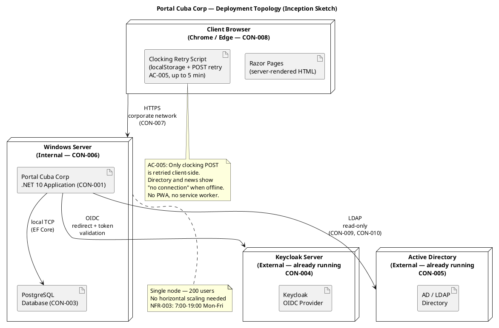

## Document Control

| Field | Value |
|---|---|
| Phase | Inception |
| Status | Draft |
| Milestone Target | End of Inception (LCO) |
| Iteration | 2 (Cycle 1) |
| Date | 2026-08-28 |
| Review Findings | No findings target this artifact — preserved from iteration 1 |
| Version Policy | Reconciled — all package versions match enterprise policy and latest stable |

## Architectural Representation

This document presents the **candidate architecture** for Portal Cuba Corp — a sketch-level design sufficient to surface architectural risks and guide Elaboration planning. Per RUP, the full 4+1 baseline is established in Elaboration; Inception produces the candidate only.

The 4+1 view model is addressed as follows for Inception:

| View | Inception Depth | Section |
|---|---|---|
| Logical | Sketch — layers, subsystems, interfaces | Logical View |
| Deployment | Sketch — topology, nodes, connections | Deployment View |
| Process | Deferred to Elaboration (single-server, low concurrency) | Process View |
| Implementation | Deferred to Elaboration (package structure) | Implementation View |
| Use-Case | Prioritized list for Elaboration planning | Use-Case View |

## Architectural Goals and Constraints

### Declared Technology Stack

| Constraint | Technology | Version (resolved) | Source |
|---|---|---|---|
| CON-001 | .NET 10, REST API | 10 (pinned by enterprise policy) | Work Order |
| CON-002 | Razor Pages (no SPA) | — | Work Order |
| CON-003 | PostgreSQL | latest stable via EF Core provider 10.0.3 | Work Order |
| CON-004 | Keycloak OIDC (external, already running) | — | Work Order |
| CON-005 | Active Directory over LDAP (read-only) | — | Work Order |
| CON-006 | Internal Windows Server hosting | — | Work Order |
| CON-007 | No access outside corporate network | — | Work Order |
| CON-008 | Chrome and Edge compatibility | — | Work Order |
| CON-011 | Mandatory custom UI design (docs/inputs/employee-portal-design.html) | — | Work Order |

### Resolved Package Versions

| Package | Ecosystem | Version | Rationale |
|---|---|---|---|
| .NET | framework | 10 | Enterprise policy pin (CON-001) |
| Microsoft.AspNetCore.Authentication.OpenIdConnect | nuget | 10.0.11 | Latest stable, .NET 10 aligned (CON-004) |
| Npgsql.EntityFrameworkCore.PostgreSQL | nuget | 10.0.3 | Latest stable, .NET 10 aligned (CON-003) |
| Novell.Directory.Ldap.NETStandard | nuget | 4.0.0 | Latest stable, LDAP client for AD read (CON-005) |

### Architectural Goals

1. **Risk-driven decomposition:** Subsystem boundaries encapsulate the highest-volatility areas identified in the Use-Case Model — LDAP attribute mapping (R001, Volatility: High) and offline clocking retry (AC-005, Volatility: Medium).
2. **Interface-based flexibility:** Every subsystem boundary is defined by an interface, enabling the LDAP Gateway to be swapped or mocked for testing without affecting the Directory Service.
3. **Proportionality:** 200 users, 3 offices, single Windows Server — no horizontal scaling, no microservices, no message queues. A simple layered monolith is the correct architecture for this scope.
4. **Auditability:** The audit interceptor is a cross-cutting mechanism applied to News Service and Worker Category Service — not scattered across business logic.

## Use-Case View

### Architecturally Significant Use Cases (Prioritized for Elaboration)

| Priority | UC ID | Name | Architectural Significance | Risk |
|---|---|---|---|---|
| 1 | UC-009 | Search Employee Directory | LDAP integration with AD — highest risk (R001, exposure=9). Attributes may be inconsistent across 3 offices. Must be prototyped early. | R001 |
| 2 | UC-001 | Clock In / Clock Out | Offline retry mechanism (AC-005) — client-side localStorage + POST retry with idempotency key. NFR-002: <1s response. | R006 |
| 3 | UC-005 | Publish News | Audit trail mechanism (NFR-004) — establishes the audit pattern reused by UC-006, UC-007, UC-010. | — |
| 4 | UC-010 | Manage Worker Category | Bridges local DB (AD user id → category) with LDAP read — exercises both persistence and LDAP gateways. | R001 |
| 5 | UC-004 | Export Monthly Clocking Report | CSV export of potentially large dataset — performance consideration (NFR-001). | — |

**Rationale:** UC-009 is prioritized first because R001 (exposure=9) is the highest risk in the project. The LDAP attribute consistency problem must be confronted in Elaboration Iteration 1. UC-001 is second because the offline retry mechanism (AC-005) is a hidden architectural risk (R006, exposure=6) that requires design validation. UC-005 establishes the audit trail pattern that UC-006, UC-007, and UC-010 all depend on.

## Logical View

The candidate architecture is a **layered monolith** with four layers. Subsystem decomposition follows the "decompose by change" principle — each subsystem encapsulates ONE area of volatility identified in the Use-Case Model.

### Subsystem Decomposition

| Component | ID | Encapsulates | Volatility | Interfaces |
|---|---|---|---|---|
| Directory Service | COMP-001 | LDAP attribute mapping for 3 offices — if AD schema varies, only this subsystem changes | High (R001) | IDirectoryService |
| Clocking Service | COMP-002 | Clocking recording + idempotency key acceptance + offline retry contract | Medium (AC-005) | IClockingService |
| News Service | COMP-003 | News lifecycle (publish/edit/unpublish) + audit trail integration | Low | INewsService |
| Worker Category Service | COMP-004 | AD user id → category mapping, bridges local DB and LDAP | Medium | IWorkerCategoryService |
| LDAP Gateway | COMP-005 | Raw LDAP connection, attribute extraction, read-only enforcement | High (R001) | ILdapGateway |
| Persistence Gateway | COMP-006 | EF Core + PostgreSQL — all DB access centralized | Low | IPersistence |
| OIDC Auth Middleware | COMP-007 | Keycloak OIDC token validation, role extraction from claims | Low-Med (R003) | (middleware pipeline) |
| Audit Interceptor | COMP-008 | Cross-cutting: records author + timestamp for news ops and category changes | Low | IAuditLogger |

### Component Diagram

### Analysis Mechanisms

Analysis mechanisms describe the CAPABILITY the system must provide and the PROPERTIES it must hold — product names are recorded only where the stakeholder declared them.

| Mechanism | Capability | Properties | Products (declared) | Components |
|---|---|---|---|---|
| Persistence | Store and retrieve portal-owned data (clockings, news, worker categories, audit records) | ACID transactions; CRUD for entities; CSV export query support; never stores employee data (CON-009) | PostgreSQL (CON-003), EF Core (CON-001) | COMP-006 |
| Directory Access | Read corporate attributes from Active Directory on demand | Read-only LDAP; never writes to AD (CON-010); no local copy of employee data (CON-009); attribute mapping must handle inconsistency across 3 offices (R001) | AD over LDAP (CON-005) | COMP-005, COMP-001 |
| Authentication & Authorization | Verify employee identity and determine HR vs Employee role | OIDC client only — no local user store; role claims from token; no Keycloak management (CON-004) | Keycloak OIDC (CON-004) | COMP-007 |
| Audit Trail | Record who + when for every news publish/edit/unpublish and worker category change | Append-only; never hard-delete news (CON-013); author identity from OIDC token; timestamp from server | — | COMP-008 |
| Offline Clocking Retry | Allow clocking POST to survive a 5-minute network drop | Client-side localStorage; retry POST for up to 5 min; idempotency key prevents duplicates; server accepts client timestamp; no PWA, no service worker; only clocking — directory/news show "no connection" | — | COMP-002, Clocking UI script |
| CSV Export | Generate monthly clocking report in CSV format | Streaming response; HR-only access; date-range filtered | — | COMP-002, COMP-006 |

## Process View

**Deferred to Elaboration.** The system is a single-server application for 200 users with extended working hours (NFR-003: 7:00–19:00 Mon–Fri). Concurrency is low — at most ~200 concurrent sessions with simple request/response patterns. The ASP.NET Core thread pool handles concurrency natively; no custom threading or message queues are needed. Process view details (thread model, fault tolerance sequences) will be addressed in Elaboration when the offline retry mechanism is designed in detail.

## Deployment View

Single-node deployment on internal Windows Server. No cloud, no horizontal scaling, no load balancer — proportional to 200 users on a corporate intranet.

### Deployment Notes

- **Single Windows Server (CON-006):** The .NET 10 application and PostgreSQL run on the same internal server. No separate database server is needed for 200 users.
- **External systems:** Keycloak and Active Directory are already running and maintained by the Infrastructure team (STK-003). The portal connects to them as clients only.
- **Network boundary (CON-007):** All access is within the corporate network. No public-facing endpoints, no reverse proxy for external access.
- **Client-side offline (AC-005):** Only the clocking POST is retried via localStorage. The page-level JavaScript on the already-rendered Razor page stores the press timestamp and retries the POST for up to 5 minutes. The server accepts the client's timestamp and rejects duplicates via an idempotency key. No PWA, no service worker, no client cache of directory or news data.

## Implementation View

**Deferred to Elaboration.** The package structure will follow the layer decomposition shown in the Logical View. In Inception, the key structural decision is that the solution contains a single .NET 10 project (or a small number of projects mirroring the layers) — not a microservices repository. Detailed package diagrams and build structure will be produced in Elaboration.

## Data View

### Portal-Owned Data (PostgreSQL)

| Entity | Stored Fields | Source | Audit |
|---|---|---|---|
| Clocking Record | employee_id (AD user id), timestamp, type (in/out), idempotency_key | Client POST (UC-001) | No |
| News Item | id, title, body, category, status (published/unpublished), created_by, created_at, updated_by, updated_at | HR publish/edit/unpublish (UC-005/006/007) | Yes (AUD-001) |
| Worker Category | ad_user_id, category | HR manage (UC-010) | Yes (AUD-002) |
| Audit Record | id, entity_type, entity_id, action, author, timestamp | Audit interceptor (COMP-008) | Append-only |

### AD-Projected Data (NOT stored in portal DB — CON-009)

| Attribute | Source | Read When |
|---|---|---|
| name, job title, department, office, email, extension | AD over LDAP (CON-005) | Directory search (UC-009), Worker Category display (UC-010) |

**Critical constraint (CON-009):** The portal stores ONLY `ad_user_id → category`. Everything else is projected from AD at read time. No sync job, no reconciliation, no conflict resolution.

## Size and Performance

| NFR | Requirement | Architectural Tactic |
|---|---|---|
| NFR-001 | Page load < 3s on corporate network | Server-rendered Razor Pages (no SPA bundle); minimal client JS (only clocking retry); PostgreSQL local TCP (no network hop) |
| NFR-002 | Clock in/out response < 1s | Single INSERT to local PostgreSQL; idempotency key check via unique index; no LDAP call needed for clocking |
| NFR-003 | 7:00–19:00 Mon–Fri availability | Single server with standard Windows Server uptime; no 24/7 requirement; fault tolerance = no data loss on brief network drop (AC-005) |
| AC-003 | Directory search < 10s | LDAP query to AD on demand; results not cached locally (CON-009); LDAP query performance depends on AD infrastructure (R001 risk) |

## Quality

| Quality Attribute | Tactic | Status |
|---|---|---|
| Security | OIDC authentication via Keycloak (CON-004); role-based authorization from token claims; no access outside corporate network (CON-007); read-only LDAP (CON-010) | Addressed in candidate architecture |
| Auditability | Audit interceptor (COMP-008) as cross-cutting mechanism; append-only audit records; news never hard-deleted (CON-013) | Addressed in candidate architecture |
| Availability | Single server for 200 users; offline clocking retry for 5-min network drops (AC-005); other features show "no connection" | Addressed; PoC needed for offline mechanism in Elaboration |
| Performance | Local PostgreSQL (no network hop); server-rendered pages (no SPA overhead); LDAP query for directory (R001 risk) | Addressed; LDAP performance to be validated in Elaboration |
| Maintainability | Interface-based subsystem boundaries; each subsystem encapsulates one volatility area; layered monolith (simple to deploy and debug) | Addressed in candidate architecture |

## Architecture Decision Records

### ADR-001: Architectural Style — Layered Monolith

**Context:** The portal serves 200 employees across 3 offices on an internal Windows Server. The stakeholder declared .NET 10 (CON-001), Razor Pages (CON-002), and PostgreSQL (CON-003). No microservices, no cloud, no horizontal scaling requirements were declared.

**Decision:** Adopt a layered monolith architecture with four layers: Presentation (Razor Pages), Application (services), Infrastructure (gateways), and cross-cutting (auth, audit).

**Alternatives considered:**
- *Microservices:* Rejected — 200 users on a single server do not justify the operational complexity of service discovery, inter-service communication, and distributed tracing. The scope is 10 use cases for a single organization.
- *Hexagonal (Ports & Adapters):* The interface-based design at the Infrastructure boundary achieves the same testability goal (LDAP Gateway mockable via ILdapGateway) without the architectural overhead of a full hexagonal setup. The layered approach is simpler and sufficient.

**Trade-offs:**
- + Simple deployment (single process on single server)
- + Easy debugging (single stack trace)
- + Low operational overhead
- − If the system needs to scale beyond a single server in the future, the monolith must be decomposed — but this is not a declared requirement

**Consequences:** The Implementer builds a single .NET 10 solution. Subsystem boundaries are enforced by interfaces, not by process boundaries.

### ADR-002: Persistence Mechanism — PostgreSQL via EF Core

**Context:** CON-003 declares PostgreSQL. CON-001 declares .NET 10. The portal stores clockings, news, worker categories, and audit records. Employee data is NOT stored (CON-009).

**Decision:** Use Entity Framework Core with the Npgsql provider as the ORM. All database access is centralized in the Persistence Gateway (COMP-006) behind the IPersistence interface.

**Alternatives considered:**
- *Dapper (micro-ORM):* Rejected — EF Core's change tracking simplifies the audit interceptor pattern (COMP-008 can hook into SaveChangesAsync to append audit records automatically). Dapper would require manual audit SQL for every operation.
- *Raw ADO.NET:* Rejected — excessive boilerplate for a system with 4 entities. EF Core provides the same performance with far less code.

**Trade-offs:**
- + Change tracking enables automatic audit logging via SaveChangesAsync interceptor
- + Migrations manage schema evolution
- + LINQ queries for CSV export filtering
- − Slight overhead vs raw SQL — negligible for 200 users on local PostgreSQL

**Consequences:** The Implementer configures EF Core in Program.cs with the Npgsql provider. The Persistence Gateway wraps DbContext. Migrations are created for the 4 portal-owned entities.

### ADR-003: Directory Access — LDAP with Attribute Mapping

**Context:** CON-005 declares Active Directory over LDAP (read-only). CON-009 forbids storing employee data locally. CON-010 forbids writing to AD. R001 (exposure=9) flags that LDAP attributes may be inconsistent across 3 offices.

**Decision:** The LDAP Gateway (COMP-005) handles raw LDAP connections and attribute extraction. The Directory Service (COMP-001) maps LDAP attributes to the portal's directory model, handling missing attributes gracefully (display "—" for empty fields). Both are behind interfaces (ILdapGateway, IDirectoryService) enabling mocking for tests.

**Alternatives considered:**
- *System.DirectoryServices.Protocols (SDS.P):* Windows-only LDAP client built into .NET. Rejected as the primary choice because Novell.Directory.Ldap.NETStandard is cross-platform and well-maintained, but SDS.P remains a fallback if Novell has compatibility issues with the specific AD configuration.
- *Caching LDAP results:* Rejected — CON-009 forbids local copies of employee data. Every directory search queries AD live.

**Trade-offs:**
- + No stale employee data — always current from AD
+ + No sync infrastructure to build or maintain
+ + Graceful degradation for missing attributes
- − LDAP query latency on every directory search (mitigated by AD being on the corporate network)
- − Attribute inconsistency risk (R001) — must be validated in Elaboration PoC

**Consequences:** The Implementer uses Novell.Directory.Ldap.NETStandard 4.0.0 for LDAP connections. The Directory Service maps LDAP response attributes to a DirectoryEntry model. Missing attributes are replaced with "—". The PoC in Elaboration Iteration 1 validates attribute consistency across all 3 offices.

### ADR-004: Offline Clocking Retry — localStorage + Idempotency Key

**Context:** AC-005 requires the system to work temporarily offline for 5 minutes. CON-002 mandates Razor Pages (no SPA). The stakeholder clarified: AC-005 is (a) server-side fault tolerance plus one bounded client-side thing — the clocking button stores the press in localStorage and retries the POST for up to 5 minutes. The server accepts the client's timestamp and rejects duplicates via an idempotency key. No PWA, no service worker, no client cache of anything else. Directory and news show "no connection" when offline.

**Decision:** A page-level JavaScript script on the already-rendered Clocking Razor page stores the press timestamp in localStorage and retries the POST for up to 5 minutes. The Clocking Service (COMP-002) accepts the client-provided timestamp and uses a unique idempotency key (generated client-side) to reject duplicate submissions.

**Alternatives considered:**
- *Service Worker / PWA:* Rejected — the stakeholder explicitly excluded PWA and service worker. CON-002 stands: no SPA, no client-side router. A page-level script is Razor Pages as normal.
- *Server-side queuing:* Rejected — the problem is a network drop between client and server, so server-side queuing does not help. The client must hold the press.
- *No offline support:* Rejected — AC-005 is a declared acceptance criterion.

**Trade-offs:**
- + Clocking press is never lost during a 5-minute network drop
+ + Idempotency key prevents duplicate clockings on retry
+ + Server accepts the original press timestamp — the recorded time is when the employee pressed, not when the POST succeeded
- − localStorage is per-browser — if the employee closes the browser within 5 minutes, the clocking is lost (beyond 5 minutes, the employee reports to HR per stakeholder clarification)
- − Only clocking is retried — directory and news are offline-dead during a network drop

**Consequences:** The Implementer adds a page-level JS script to the Clocking Razor page. The Clocking Service endpoint accepts an idempotency_key field and enforces uniqueness via a database unique index. The ClockingRecord entity includes an idempotency_key column.

### ADR-005: Authentication — Keycloak OIDC Client

**Context:** CON-004 declares Keycloak as the identity provider, already running and maintained separately. The portal is an OIDC client only — register a client, redirect for login, validate the token, read roles from claims. No Keycloak deployment, provisioning, realm design, or hosting.

**Decision:** Use ASP.NET Core's built-in OpenID Connect authentication handler (Microsoft.AspNetCore.Authentication.OpenIdConnect 10.0.11) configured as an OIDC client pointing to the existing Keycloak server. Role-based authorization uses claims from the validated token.

**Alternatives considered:**
- *Custom token validation:* Rejected — the framework's OIDC handler is well-tested and handles token refresh, cookie management, and claim extraction. Custom validation would reimplement what the framework already provides.
- *IdentityServer4 / Duende:* Rejected — CON-004 explicitly states Keycloak is the identity provider. The portal does not host its own STS.

**Trade-offs:**
- + No identity infrastructure to build or maintain
+ + Standard OIDC flow — well-understood and framework-supported
+ + Role-based authorization from token claims — no custom authorization service
- − External dependency on Keycloak availability — if Keycloak is down, no one can log in (R003)
- − OIDC client registration must exist before login testing — Infrastructure team (STK-003) must register the client first

**Consequences:** The Implementer configures OIDC in Program.cs. The OIDC Auth Middleware (COMP-007) is part of the ASP.NET Core middleware pipeline, not a custom component. HR-only pages use `[Authorize(Roles = "hr")]` or equivalent policy-based authorization. The Infrastructure team must register the OIDC client in Keycloak before integration testing can begin (R003 dependency).

## PoC Plan Annex

### Top Technical Risks and PoC Strategy

| Risk ID | Risk | Exposure | PoC Needed? | PoC Scope | Success Criteria |
|---|---|---|---|---|---|
| R001 | AD LDAP attribute inconsistency across 3 offices | 9 | Yes — Elaboration Iter 1 | Connect to AD via LDAP from the .NET 10 application; query all 3 offices' OUs; verify that the 6 required attributes (name, job title, department, office, email, extension) are populated for a sample of users from each office | All 6 attributes are present and non-empty for ≥95% of sampled users across all 3 offices. For any missing attribute, the Directory Service gracefully displays "—" rather than crashing. |
| R006 | Offline clocking retry mechanism (AC-005) | 6 | Yes — Elaboration Iter 1 | Implement the page-level JS retry script + Clocking Service endpoint with idempotency key; simulate network drop by disconnecting the client; verify the POST retries and succeeds on reconnection | Clocking press is stored in localStorage within 1s; POST retries automatically; on reconnection within 5 min, the clocking is recorded with the original press timestamp; duplicate POSTs with the same idempotency key are rejected. |
| R003 | Keycloak OIDC client registration dependency | 6 | No — operational dependency | N/A — the Infrastructure team (STK-003) must register the OIDC client in Keycloak. No code PoC needed, but the client registration must be complete before Elaboration integration testing. | OIDC login flow works end-to-end: redirect to Keycloak → login → token validation → role extraction → authenticated request to portal. |
| R004 | Performance under concurrent load (NFR-001, NFR-002) | 6 | No — standard .NET performance | N/A — 200 users on a single server with local PostgreSQL is well within .NET 10's capabilities. Performance will be validated via standard load testing in Construction. | Page load < 3s (NFR-001); clocking response < 1s (NFR-002) under simulated 200-user load. |

### PoC Sequencing for Elaboration

1. **Elaboration Iteration 1:** R001 (LDAP) + R006 (offline retry) — both are architecturally significant and must be validated before the architecture is baselined at LCA.
2. **Elaboration Iteration 2:** R003 (OIDC integration) — depends on Infrastructure team completing the client registration. Integrate the full auth flow and validate role-based authorization.

## Traceability

| Element | Traces From | Link Type | Traces To |
|---|---|---|---|
| COMP-001 (Directory Service) | UC-009, R001, CON-005 | Derives | COMP-005 (LDAP Gateway) |
| COMP-002 (Clocking Service) | UC-001, AC-005, NFR-002 | Derives | COMP-006 (Persistence), COMP-008 (Audit) |
| COMP-003 (News Service) | UC-005, UC-006, UC-007, NFR-004 | Derives | COMP-006 (Persistence), COMP-008 (Audit) |
| COMP-004 (Worker Category Service) | UC-010, CON-009, NFR-004 | Derives | COMP-005 (LDAP), COMP-006 (Persistence), COMP-008 (Audit) |
| COMP-005 (LDAP Gateway) | CON-005, CON-009, CON-010 | Derives | COMP-001, COMP-004 |
| COMP-006 (Persistence Gateway) | CON-003, CON-001 | Derives | COMP-002, COMP-003, COMP-004 |
| COMP-007 (OIDC Auth Middleware) | CON-004, SEC-001, SEC-002 | Derives | All UCs (auth) |
| COMP-008 (Audit Interceptor) | NFR-004, AUD-001, AUD-002, AUD-003 | Derives | COMP-003, COMP-004 |
| ADR-001 (Layered Monolith) | CON-001, CON-002, CON-006 | Derives | All components |
| ADR-002 (PostgreSQL via EF Core) | CON-003, CON-001 | Derives | COMP-006 |
| ADR-003 (LDAP with Attribute Mapping) | CON-005, CON-009, CON-010, R001 | Derives | COMP-001, COMP-005 |
| ADR-004 (Offline Clocking Retry) | AC-005, CON-002, R006 | Derives | COMP-002, Clocking UI |
| ADR-005 (Keycloak OIDC Client) | CON-004, SEC-001, SEC-002, R003 | Derives | COMP-007 |
| PoC Plan (R001) | R001 | Derives | Elaboration Iter 1 |
| PoC Plan (R006) | R006, AC-005 | Derives | Elaboration Iter 1 |
| Stack: .NET 10 | CON-001, enterprise policy pin | Derives | ADR-001, ADR-002 |
| Stack: PostgreSQL | CON-003 | Derives | ADR-002, COMP-006 |
| Stack: Keycloak OIDC | CON-004 | Derives | ADR-005, COMP-007 |
| Stack: AD LDAP | CON-005 | Derives | ADR-003, COMP-005 |