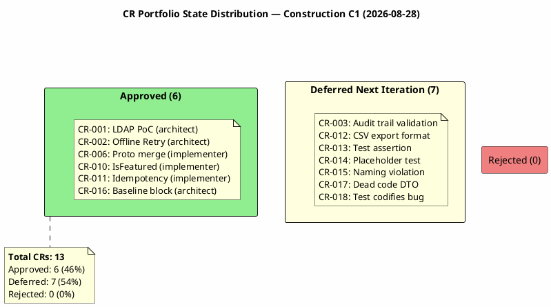
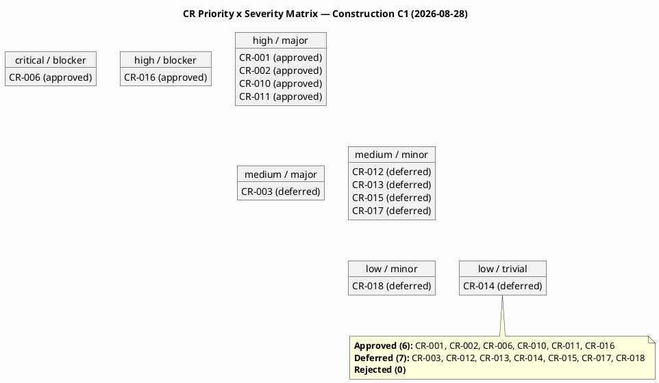
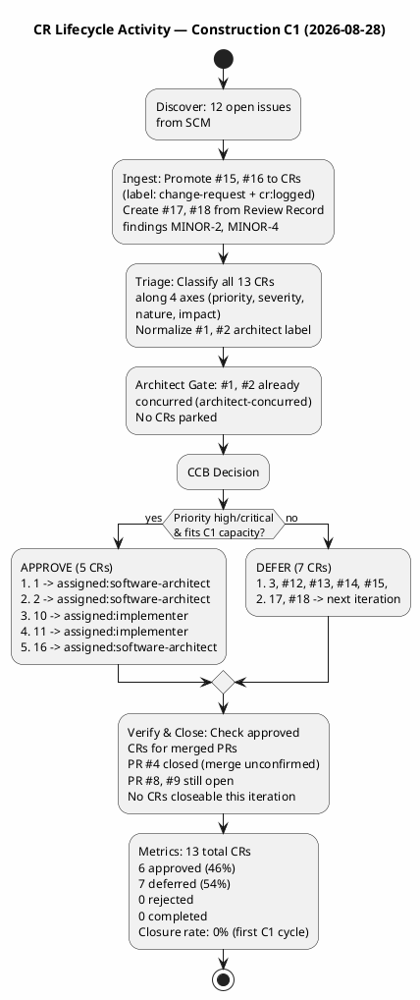

## Document Control

| Field | Value |
|---|---|
| Phase | Construction |
| Status | Active |
| Milestone Target | End-of-Construction |
| Iteration | 1 (Cycle 1) |
| Date | 2026-08-28 |
| CCB Composition | Change Control Manager (chair), Software Architect (for architectural CRs), Project Manager (for business CRs) |
| Source of Truth | SCM Issues — labels are the authoritative CR state; this artifact is the narrative audit ledger |

## Change Request Log

### Portfolio Summary

| Metric | Value |
|---|---|
| Total CRs | 13 |
| Approved (this iteration) | 5 |
| Previously Approved (carried forward) | 1 (#6) |
| Deferred to Next Iteration | 7 |
| Rejected | 0 |
| Completed | 0 |
| Closure Rate | 0% (first C1 cycle — no merged PRs to verify against yet) |

### CR State Distribution

### Priority × Severity Matrix

### Detailed CR Register

| Issue # | CR ID | Title | Priority | Severity | Nature | Impact | State | Assigned To | Origin |
|---|---|---|---|---|---|---|---|---|---|
| #1 | CR-001 | Execute LDAP Attribute Mapping PoC (R001) | high | major | enhancement | architectural | cr:approved | software-architect | Elaboration |
| #2 | CR-002 | Validate Offline Clocking Retry Design (AC-005) | high | major | enhancement | architectural | cr:approved | software-architect | Elaboration |
| #3 | CR-003 | Validate Audit Trail Pattern Implementation (NFR-004) | medium | major | enhancement | cross-cutting | cr:deferred-next-iteration | — | Elaboration |
| #6 | CR-006 | Architectural prototype (PR #4) not merged to main | critical | blocker | defect | cross-cutting | cr:approved | implementer | Elaboration |
| #10 | CR-010 | IsFeatured not settable in NewsService.Publish | high | major | defect | local | cr:approved | implementer | Review Record (MAJOR-1) |
| #11 | CR-011 | Idempotency key not scoped per employee | high | major | defect | local | cr:approved | implementer | Review Record (MINOR-3) |
| #12 | CR-012 | CSV export format — TimeOut column always empty | medium | minor | defect | local | cr:deferred-next-iteration | — | Construction |
| #13 | CR-013 | Test assertion contradicts test name | medium | minor | defect | local | cr:deferred-next-iteration | — | Construction |
| #14 | CR-014 | Placeholder test UnitTest1.cs | low | trivial | defect | local | cr:deferred-next-iteration | — | Construction |
| #15 | CR-015 | Naming violation — missing UC identifiers | medium | minor | defect | local | cr:deferred-next-iteration | — | Review Record (MINOR-1) |
| #16 | CR-016 | Construction C1 baseline blocked — missing Architect approval | high | blocker | defect | cross-cutting | cr:approved | software-architect | CCM process |
| #17 | CR-017 | RecordClockingRequest.EmployeeId is dead code | medium | minor | defect | local | cr:deferred-next-iteration | — | Review Record (MINOR-2) |
| #18 | CR-018 | Test codifies idempotency collision as expected | low | minor | defect | local | cr:deferred-next-iteration | — | Review Record (MINOR-4) |

## Impact Analysis

### Approved CRs — Detailed Impact

#### CR-001 (#1): LDAP Attribute Mapping PoC
- **Affected Use Cases:** UC-009 (Search Employee Directory)
- **Affected Requirements:** FR-009, R001 (exposure=9)
- **Cost Impact:** Medium — PoC validation + fallback implementation
- **Schedule Impact:** High — highest-exposure risk must be addressed early
- **Architectural Impact:** Architectural — LDAP integration pattern, attribute fallback strategy
- **Architect Concurrence:** Granted (label: `architect-concurred`)
- **Executor:** software-architect

#### CR-002 (#2): Offline Clocking Retry Design Validation
- **Affected Use Cases:** UC-001 (Clock In and Clock Out)
- **Affected Requirements:** AC-005, R006 (exposure=6)
- **Cost Impact:** Medium — design validation + implementation verification
- **Schedule Impact:** High — AC-005 is a declared acceptance criterion
- **Architectural Impact:** Architectural — offline retry pattern, idempotency, localStorage
- **Architect Concurrence:** Granted (label: `architect-concurred`)
- **Executor:** software-architect

#### CR-006 (#6): Architectural Prototype Not Merged
- **Affected Use Cases:** UC-001 through UC-010 (all — baseline foundation)
- **Affected Requirements:** All FR-001 through FR-010
- **Cost Impact:** High — delays entire Construction iteration
- **Schedule Impact:** Critical — no Construction progress until resolved
- **Architectural Impact:** Cross-cutting — baseline affects all layers
- **Executor:** implementer
- **Note:** PR #4 is closed but merge status unconfirmed. PR #8 and #9 remain open. This CR stays `cr:approved` until a merged PR is verified.

#### CR-010 (#10): IsFeatured Not Settable in NewsService.Publish
- **Affected Use Cases:** UC-005 (Publish News), UC-008 (Read and Filter News)
- **Affected Requirements:** FR-008 (featured news banner)
- **Cost Impact:** Low — add parameter to Publish method, update page model
- **Schedule Impact:** High — blocks PR #8 merge (MAJOR-1 finding from Review Record)
- **Architectural Impact:** Local — single service method change
- **Executor:** implementer

#### CR-011 (#11): Idempotency Key Not Scoped Per Employee
- **Affected Use Cases:** UC-001 (Clock In and Clock Out), AC-005 (offline retry)
- **Cost Impact:** Low — scope lookup by employeeId
- **Schedule Impact:** Medium — data loss risk, should fix in C1
- **Architectural Impact:** Local — single service method + interface change
- **Executor:** implementer

#### CR-016 (#16): Construction C1 Baseline Blocked
- **Affected Use Cases:** UC-001 through UC-010 (all — baseline is the foundation)
- **Cost Impact:** High — delays entire Construction iteration
- **Schedule Impact:** Critical — no Construction progress until resolved
- **Architectural Impact:** Cross-cutting — baseline affects all layers
- **Executor:** software-architect
- **Note:** Process blocker — Architect must approve/reject PR #9 to unblock the Construction baseline.

### Deferred CRs — Rationale

| CR | Priority | Rationale for Deferral |
|---|---|---|
| CR-003 | medium | Audit trail validation (NFR-004) — medium priority, capacity allocated to high/critical CRs first |
| CR-012 | medium | CSV export format — non-blocking, fixable in next iteration |
| CR-013 | medium | Test assertion mismatch — non-blocking test quality issue |
| CR-014 | low | Placeholder test — trivial, no functional impact |
| CR-015 | medium | Naming violation — non-blocking convention issue |
| CR-017 | medium | Dead code DTO field — non-blocking, low risk |
| CR-018 | low | Test codifies bug — depends on CR-011 resolution first |

## Decisions and Status

### CCB Decisions — Construction C1 (2026-08-28)

| CR | Decision | Rationale | CCB Members |
|---|---|---|---|
| CR-001 | APPROVED | Highest-exposure risk (R001, exposure=9). Architect concurred. PoC must execute in C1. | CCM, Architect |
| CR-002 | APPROVED | AC-005 acceptance criterion. Architect concurred. Design validation required in C1. | CCM, Architect |
| CR-003 | DEFERRED | Medium priority. Capacity allocated to high/critical CRs. Re-evaluate next iteration. | CCM, PM |
| CR-006 | APPROVED (prior) | Critical blocker — all 20 test cases blocked. Carried forward from Elaboration. | CCM, Architect |
| CR-010 | APPROVED | MAJOR-1 finding blocks PR #8 merge. FR-008 non-functional. Must fix in C1. | CCM |
| CR-011 | APPROVED | High priority — potential data loss. Simple fix. Must fix in C1. | CCM |
| CR-012 | DEFERRED | Medium priority, non-blocking. Next iteration. | CCM |
| CR-013 | DEFERRED | Medium priority, non-blocking. Next iteration. | CCM |
| CR-014 | DEFERRED | Low priority, trivial. Next iteration. | CCM |
| CR-015 | DEFERRED | Medium priority, non-blocking. Next iteration. | CCM |
| CR-016 | APPROVED | Blocker — Construction baseline cannot proceed without Architect approval on PR #9. | CCM, Architect |
| CR-017 | DEFERRED | Medium priority, non-blocking. Next iteration. | CCM |
| CR-018 | DEFERRED | Low priority, depends on CR-011. Next iteration. | CCM |

### CR Lifecycle Activity

### Verification Status

| Approved CR | Linked PR | PR State | Merge Status | CR Closure |
|---|---|---|---|---|
| CR-006 (#6) | PR #4 | closed | Unconfirmed | Open — cannot verify merge |
| CR-001 (#1) | None | — | — | Open — implementation not started |
| CR-002 (#2) | None | — | — | Open — implementation not started |
| CR-010 (#10) | None | — | — | Open — implementation not started |
| CR-011 (#11) | None | — | — | Open — implementation not started |
| CR-016 (#16) | None | — | — | Open — awaiting Architect action |

### Deferred CRs — Next Iteration Pickup

The following 7 CRs are deferred to the next Construction iteration. They retain `cr:deferred-next-iteration` and will be re-evaluated by the CCB:

1. **CR-003** (#3) — Audit trail validation (NFR-004) — medium priority
2. **CR-012** (#12) — CSV export format — medium priority
3. **CR-013** (#13) — Test assertion mismatch — medium priority
4. **CR-014** (#14) — Placeholder test — low priority
5. **CR-015** (#15) — Naming violation — medium priority
6. **CR-017** (#17) — Dead code DTO field — medium priority
7. **CR-018** (#18) — Test codifies bug — low priority (depends on CR-011)

## Traceability

| Element | Traces From | Link Type | Traces To |
|---|---|---|---|
| CR-001 (#1) | R001 (exposure=9), FR-009 | Derives | UC-009, SAD LDAP integration |
| CR-002 (#2) | AC-005, R006 (exposure=6) | Derives | UC-001, ClockingService, clocking-retry.js |
| CR-003 (#3) | NFR-004 | Derives | UC-005, UC-006, UC-007, UC-010 |
| CR-006 (#6) | PR #4, all UCs | DependsOn | PR #4, PR #8, PR #9 |
| CR-010 (#10) | FR-008, Review Record MAJOR-1 | Derives | UC-005, UC-008, NewsService.cs, PublishNews.cshtml.cs |
| CR-011 (#11) | AC-005, Review Record MINOR-3 | Derives | UC-001, ClockingService.cs, IPersistence |
| CR-012 (#12) | FR-004 | Derives | UC-004, CSV export implementation |
| CR-013 (#13) | FR-009 | Derives | UC-009, DirectorySearchModel tests |
| CR-014 (#14) | Test quality | Tests | UnitTest1.cs |
| CR-015 (#15) | Review Record MINOR-1, Design Model V007 | Derives | Directory.cshtml.cs, branch naming |
| CR-016 (#16) | PR #9, Construction baseline | DependsOn | PR #9, all UCs |
| CR-017 (#17) | Review Record MINOR-2, CON-004 (OIDC) | Derives | UC-001, ClockingApiController.cs |
| CR-018 (#18) | Review Record MINOR-4, CR-011 | DependsOn | OfflineRetryTests.cs, CR-011 |