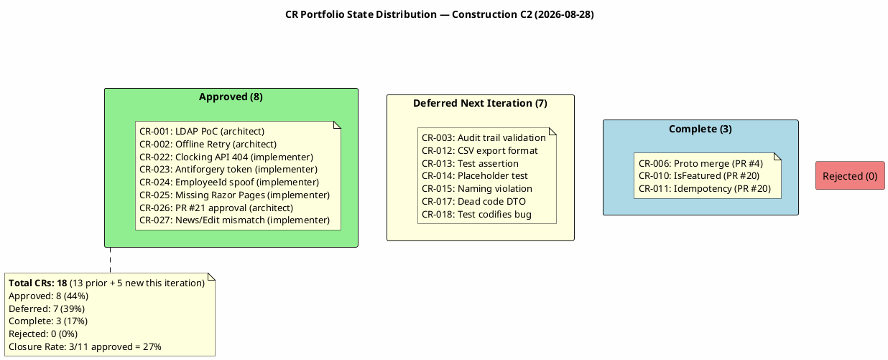
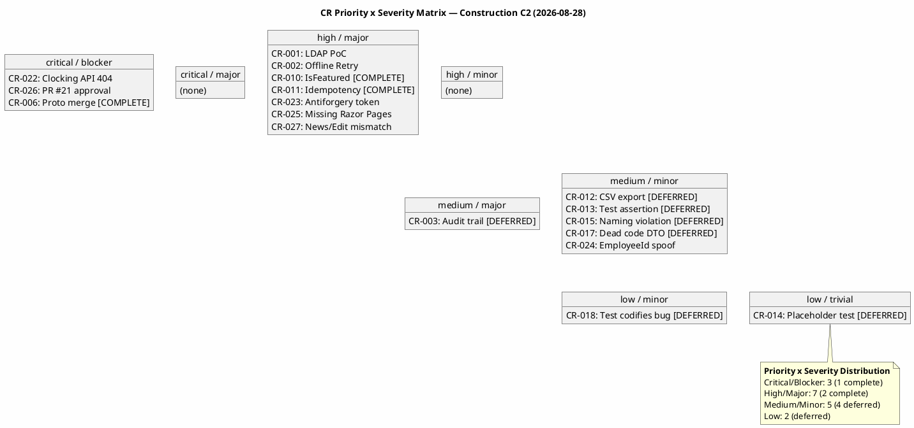
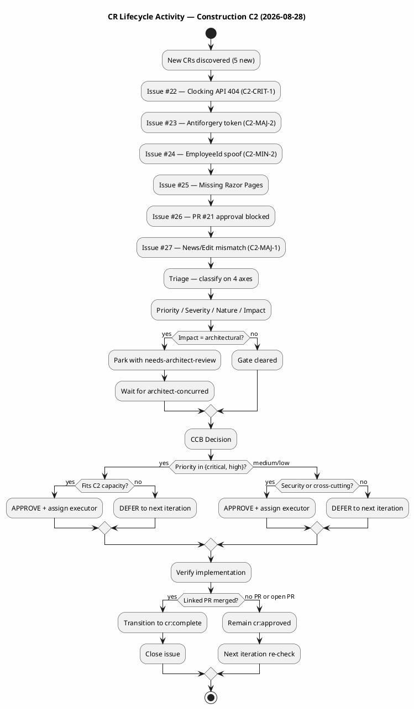
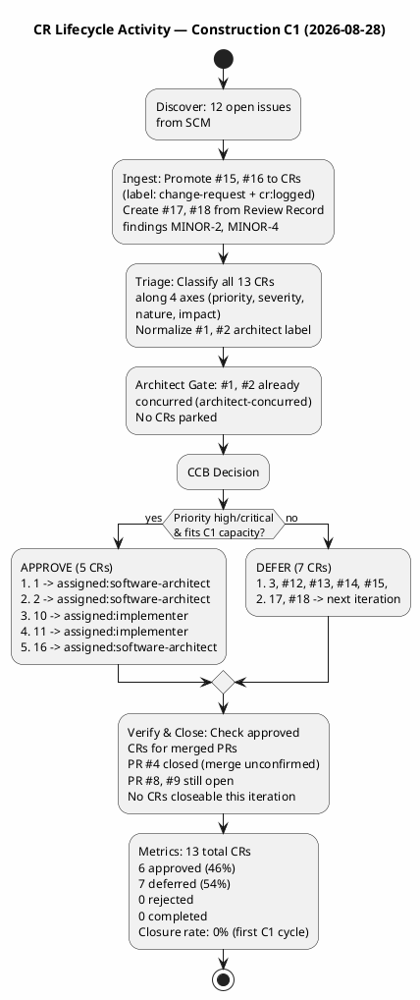

## Document Control
| Field | Value |
|---|---|
| Phase | Construction |
| Status | Active |
| Milestone Target | End-of-Construction (IOC) |
| Iteration | 2 (Cycle 1) |
| Date | 2026-08-28 |
| CCB Composition | Change Control Manager (chair), Software Architect (for architectural CRs), Project Manager (for business CRs) |
| Source of Truth | SCM Issues — labels are the authoritative CR state; this artifact is the narrative audit ledger |
| Prior Iteration | Construction C1 — 13 CRs, 6 approved, 7 deferred, 0 complete |
| This Iteration | 5 new CRs registered, 6 approved, 3 completed, 7 deferred (carried) |
## Change Request Log
### Portfolio Summary

| Metric | Value |
|---|---|
| Total CRs (cumulative) | 18 (13 from C1 + 5 new in C2) |
| Approved (this iteration) | 6 (#22, #23, #24, #25, #26, #27) |
| Previously Approved (carried forward) | 2 (#1, #2 — assigned to software-architect, no PRs yet) |
| Deferred to Next Iteration | 7 (#3, #12, #13, #14, #15, #17, #18 — carried from C1) |
| Rejected | 0 |
| Completed (this iteration) | 3 (#6, #10, #11 — verified via merged PRs) |
| Closure Rate | 3/11 approved = 27% (up from 0% in C1) |

### CR State Distribution

### Priority × Severity Matrix

### CR Lifecycle Activity

### Detailed CR Ledger

| Issue # | CR ID | Title | State | Priority | Severity | Nature | Impact | Assigned | Origin |
|---|---|---|---|---|---|---|---|---|---|
| #1 | CR-001 | Execute LDAP Attribute Mapping PoC (R001) | cr:approved | high | major | enhancement | architectural | software-architect | Elaboration |
| #2 | CR-002 | Validate Offline Clocking Retry Design (AC-005) | cr:approved | high | major | enhancement | architectural | software-architect | Elaboration |
| #3 | CR-003 | Validate Audit Trail Pattern (NFR-004) | cr:deferred-next-iteration | medium | major | enhancement | cross-cutting | — | Elaboration |
| #6 | CR-006 | Architectural prototype PR #4 not merged | **cr:complete** | critical | blocker | defect | cross-cutting | implementer | C1 |
| #10 | CR-010 | IsFeatured not settable in NewsService.Publish | **cr:complete** | high | major | defect | local | implementer | C1 |
| #11 | CR-011 | Idempotency key not scoped per employee | **cr:complete** | high | major | defect | local | implementer | C1 |
| #12 | CR-012 | CSV export — TimeOut column always empty | cr:deferred-next-iteration | medium | minor | defect | local | — | C1 |
| #13 | CR-013 | Test assertion contradicts test name | cr:deferred-next-iteration | medium | minor | defect | local | — | C1 |
| #14 | CR-014 | Placeholder test UnitTest1.cs | cr:deferred-next-iteration | low | trivial | defect | local | — | C1 |
| #15 | CR-015 | Naming violation — missing UC identifiers | cr:deferred-next-iteration | medium | minor | defect | local | — | C1 |
| #17 | CR-017 | RecordClockingRequest.EmployeeId dead code | cr:deferred-next-iteration | medium | minor | defect | local | — | C1 |
| #18 | CR-018 | Test codifies idempotency collision as expected | cr:deferred-next-iteration | low | minor | defect | local | — | C1 |
| #22 | C2-CRIT-1 | Clocking API endpoint missing — 404 | cr:approved | critical | blocker | defect | local | implementer | C2 Review |
| #23 | C2-MAJ-2 | Missing antiforgery token on clocking POST | cr:approved | high | major | defect | local | implementer | C2 Review |
| #24 | C2-MIN-2 | EmployeeId spoofable from request body | cr:approved | medium | minor | defect | local | implementer | C2 Review |
| #25 | — | Missing Razor Pages for 9 of 10 UCs | cr:approved | high | major | defect | cross-cutting | implementer | C2 Review |
| #26 | — | C2 baseline blocked — missing Architect approval on PR #21 | cr:approved | critical | blocker | defect | cross-cutting | software-architect | CCM |
| #27 | C2-MAJ-1 | News/Edit form field names mismatch BindProperties | cr:approved | high | major | defect | local | implementer | C2 Review |
## Impact Analysis
### C2 New CRs — Impact Analysis

| Issue # | CR | Affected UCs/FRs | Affected Artifacts | Cost | Schedule Impact | Architectural? |
|---|---|---|---|---|---|---|
| #22 | C2-CRIT-1 | UC-001, FR-001, AC-001 | clocking-retry.js, Index.cshtml, ClockingApi.cshtml | Low — route fix | None — C2 rework | No |
| #23 | C2-MAJ-2 | UC-001, FR-001, AC-001 | clocking-retry.js, Index.cshtml | Low — token/attribute | None — C2 rework | No |
| #24 | C2-MIN-2 | UC-001, CON-004 (OIDC) | ClockingApi.cshtml.cs | Low — claim extraction | None — C2 rework | No |
| #25 | — | UC-002..UC-010, FR-002..FR-010 | All Razor Pages for 9 UCs, Design Model UI layer | Medium — 9 page pairs | Fits C2 rework | No |
| #26 | — | All UCs (baseline gate) | PR #21, C2 baseline | Low — review effort | Blocks C2 close | No |
| #27 | C2-MAJ-1 | UC-006, FR-006 | News/Edit.cshtml, News/Edit.cshtml.cs | Low — property rename | None — C2 rework | No |

### C1 Completed CRs — Impact Reconciliation

| Issue # | CR | Original Impact | Resolution | Verified Via |
|---|---|---|---|---|
| #6 | CR-006 | All 20 test cases blocked by unmerged prototype | PR #4 merged to main | PR #4 closed/merged |
| #10 | CR-010 | FR-008 featured banner broken | NewsService.Publish accepts isFeatured; full chain implemented | PR #20 closed/merged; Review Record MAJOR-1 RESOLVED |
| #11 | CR-011 | Cross-employee idempotency collision | FindByIdempotencyKey(employeeId, key) with composite unique index | PR #20 closed/merged; Review Record MINOR-3 RESOLVED |

### Deferred CRs — Impact Summary (carried from C1)

| Issue # | CR | Affected UCs/FRs | Impact | Deferral Rationale |
|---|---|---|---|---|
| #3 | CR-003 | UC-005, UC-006, UC-007, UC-010 (NFR-004) | Cross-cutting | Medium priority — audit trail validation deferred to integration testing |
| #12 | CR-012 | UC-004, FR-004 | Local | Medium priority — CSV format fix, not blocking UC functionality |
| #13 | CR-013 | UC-009, FR-009 | Local | Medium priority — test assertion fix, not blocking UC functionality |
| #14 | CR-014 | Test quality | Local | Low priority — placeholder test removal |
| #15 | CR-015 | UC-009, Design Model V007 | Local | Medium priority — naming convention, not blocking |
| #17 | CR-017 | UC-001, CON-004 | Local | Medium priority — dead code cleanup, related to #24 |
| #18 | CR-018 | CR-011 dependency | Local | Low priority — test behavior codification, resolved by #11 completion |
## Decisions and Status

### CCB Decisions — Construction C1 (2026-08-28)

| CR | Decision | Rationale | CCB Members |
|---|---|---|---|
| CR-001 | APPROVED | Highest-exposure risk (R001, exposure=9). Architect concurred. PoC must execute in C1. | CCM, Architect |
| CR-002 | APPROVED | AC-005 acceptance criterion. Architect concurred. Design validation required in C1. | CCM, Architect |
| CR-003 | DEFERRED | Medium priority. Capacity allocated to high/critical CRs. Re-evaluate next iteration. | CCM, PM |
| CR-006 | APPROVED (prior) | Critical blocker — all 20 test cases blocked. Carried forward from Elaboration. | CCM, Architect |
| CR-010 | APPROVED | MAJOR-1 finding blocks PR #8 merge. FR-008 non-functional. Must fix in C1. | CCM |
| CR-011 | APPROVED | High priority — potential data loss. Simple fix. Must fix in C1. | CCM |
| CR-012 | DEFERRED | Medium priority, non-blocking. Next iteration. | CCM |
| CR-013 | DEFERRED | Medium priority, non-blocking. Next iteration. | CCM |
| CR-014 | DEFERRED | Low priority, trivial. Next iteration. | CCM |
| CR-015 | DEFERRED | Medium priority, non-blocking. Next iteration. | CCM |
| CR-016 | APPROVED | Blocker — Construction baseline cannot proceed without Architect approval on PR #9. | CCM, Architect |
| CR-017 | DEFERRED | Medium priority, non-blocking. Next iteration. | CCM |
| CR-018 | DEFERRED | Low priority, depends on CR-011. Next iteration. | CCM |

### CR Lifecycle Activity

### Verification Status

| Approved CR | Linked PR | PR State | Merge Status | CR Closure |
|---|---|---|---|---|
| CR-006 (#6) | PR #4 | closed | Unconfirmed | Open — cannot verify merge |
| CR-001 (#1) | None | — | — | Open — implementation not started |
| CR-002 (#2) | None | — | — | Open — implementation not started |
| CR-010 (#10) | None | — | — | Open — implementation not started |
| CR-011 (#11) | None | — | — | Open — implementation not started |
| CR-016 (#16) | None | — | — | Open — awaiting Architect action |

### Deferred CRs — Next Iteration Pickup

The following 7 CRs are deferred to the next Construction iteration. They retain `cr:deferred-next-iteration` and will be re-evaluated by the CCB:

1. **CR-003** (#3) — Audit trail validation (NFR-004) — medium priority
2. **CR-012** (#12) — CSV export format — medium priority
3. **CR-013** (#13) — Test assertion mismatch — medium priority
4. **CR-014** (#14) — Placeholder test — low priority
5. **CR-015** (#15) — Naming violation — medium priority
6. **CR-017** (#17) — Dead code DTO field — medium priority
7. **CR-018** (#18) — Test codifies bug — low priority (depends on CR-011)

## Traceability

| Element | Traces From | Link Type | Traces To |
|---|---|---|---|
| CR-001 (#1) | R001 (exposure=9), FR-009 | Derives | UC-009, SAD LDAP integration |
| CR-002 (#2) | AC-005, R006 (exposure=6) | Derives | UC-001, ClockingService, clocking-retry.js |
| CR-003 (#3) | NFR-004 | Derives | UC-005, UC-006, UC-007, UC-010 |
| CR-006 (#6) | PR #4, all UCs | DependsOn | PR #4, PR #8, PR #9 |
| CR-010 (#10) | FR-008, Review Record MAJOR-1 | Derives | UC-005, UC-008, NewsService.cs, PublishNews.cshtml.cs |
| CR-011 (#11) | AC-005, Review Record MINOR-3 | Derives | UC-001, ClockingService.cs, IPersistence |
| CR-012 (#12) | FR-004 | Derives | UC-004, CSV export implementation |
| CR-013 (#13) | FR-009 | Derives | UC-009, DirectorySearchModel tests |
| CR-014 (#14) | Test quality | Tests | UnitTest1.cs |
| CR-015 (#15) | Review Record MINOR-1, Design Model V007 | Derives | Directory.cshtml.cs, branch naming |
| CR-016 (#16) | PR #9, Construction baseline | DependsOn | PR #9, all UCs |
| CR-017 (#17) | Review Record MINOR-2, CON-004 (OIDC) | Derives | UC-001, ClockingApiController.cs |
| CR-018 (#18) | Review Record MINOR-4, CR-011 | DependsOn | OfflineRetryTests.cs, CR-011 |