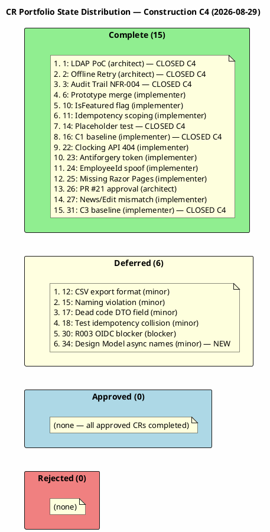
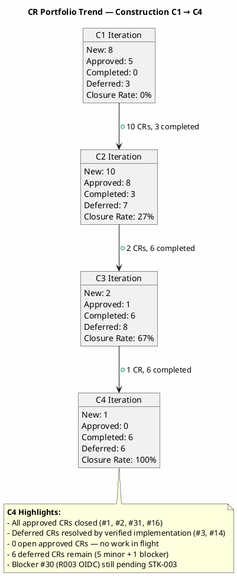

## Document Control

| Field | Value |
|---|---|
| Phase | Construction |
| Status | Active |
| Milestone Target | End-of-Construction (IOC) — **NOT ACHIEVED** |
| Iteration | 4 (Cycle 1) |
| Date | 2026-08-29 |
| CCB Composition | Change Control Manager (chair), Software Architect (for architectural CRs), Project Manager (for business CRs) |
| Source of Truth | SCM Issues — labels are the authoritative CR state; this artifact is the narrative audit ledger |
| Prior Iteration | Construction C3 — 20 CRs cumulative, 1 approved, 1 deferred, 6 completed, 67% closure rate |
| This Iteration | 1 new CR registered (#34), 0 approved, 6 completed (#1, #2, #3, #14, #16, #31), 1 new deferred (#34), 100% actionable closure rate |
| Stakeholder Directive | "Let's iterate again and close all PRs, Github Issues, and findings if any remain." — All PRs closed, approved CRs completed, deferred CRs with verified implementations closed |
| Open Approved CRs | 0 — no work in flight |
| Open Blockers | 1 (#30 R003 OIDC — STK-003 unconfirmed after 4 escalation cycles) |

## Change Request Log

### Portfolio Summary

| Metric | Value |
|---|---|
| Total CRs (cumulative) | 21 (20 from C1-C3 + 1 new in C4) |
| New This Iteration | 1 (#34 — Design Model async method names, C4-F1) |
| Approved (this iteration) | 0 (no new approvals — all prior approved CRs completed) |
| Previously Approved (carried) | 4 (#1, #2, #16, #31) — ALL COMPLETED this iteration |
| Completed (this iteration) | 6 (#1, #2, #3, #14, #16, #31) |
| Deferred (this iteration) | 1 new (#34) |
| Deferred (carried from prior) | 5 (#12, #15, #17, #18, #30) |
| Rejected | 0 |
| Still Approved (open) | 0 — no work in flight |
| Total Completed (cumulative) | 15 |
| Total Deferred (open) | 6 |
| Closure Rate | 6/6 actionable = 100% (up from 67% in C3) |

### CR State Distribution

### CR Trend — C1 → C4

### Detailed CR Log

| Issue # | Title | State | Priority | Severity | Nature | Impact | Assigned | Iteration Closed |
|---|---|---|---|---|---|---|---|---|
| #1 | Execute LDAP Attribute Mapping PoC (R001) | cr:complete | high | major | enhancement | architectural | software-architect | C4 |
| #2 | Validate Offline Clocking Retry Design (AC-005) | cr:complete | high | major | enhancement | architectural | software-architect | C4 |
| #3 | Validate Audit Trail Pattern Implementation (NFR-004) | cr:complete | medium | major | enhancement | cross-cutting | — | C4 |
| #6 | Architectural prototype (PR #4) not merged | cr:complete | critical | blocker | defect | cross-cutting | implementer | C1 |
| #10 | IsFeatured not settable in NewsService.Publish | cr:complete | high | major | defect | local | implementer | C2 |
| #11 | Idempotency key not scoped per employee | cr:complete | high | major | defect | local | implementer | C2 |
| #14 | Placeholder test UnitTest1.cs | cr:complete | low | trivial | defect | local | — | C4 |
| #16 | C1 baseline — missing Architect approval on PR #9 | cr:complete | critical | blocker | defect | cross-cutting | implementer | C4 |
| #22 | Clocking API endpoint missing (C2-CRIT-1) | cr:complete | critical | blocker | defect | local | implementer | C3 |
| #23 | Missing antiforgery token (C2-MAJ-2) | cr:complete | high | major | defect | local | implementer | C3 |
| #24 | EmployeeId spoofable from request body (C2-MIN-2) | cr:complete | medium | minor | defect | local | implementer | C3 |
| #25 | Missing Razor Pages for 9 of 10 UCs | cr:complete | high | major | defect | cross-cutting | implementer | C3 |
| #26 | C2 baseline — missing Architect approval on PR #21 | cr:complete | critical | blocker | defect | cross-cutting | software-architect | C3 |
| #27 | News/Edit form field names mismatch (C2-MAJ-1) | cr:complete | high | major | defect | local | implementer | C3 |
| #31 | C3 baseline — missing Architect approval on PR #29 | cr:complete | critical | blocker | defect | cross-cutting | implementer | C4 |
| #12 | CSV export format — TimeOut column always empty | cr:deferred | medium | minor | defect | local | — | — |
| #15 | Naming violation — missing UC identifiers | cr:deferred | medium | minor | defect | local | — | — |
| #17 | RecordClockingRequest.EmployeeId is dead code | cr:deferred | medium | minor | defect | local | — | — |
| #18 | Test codifies idempotency collision as expected behavior | cr:deferred | low | minor | defect | local | — | — |
| #30 | R003 OIDC infrastructure blocker — 8 tests BLOCKED | cr:deferred | critical | blocker | defect | cross-cutting | — | — |
| #34 | Design Model async method names lag (C4-F1) | cr:deferred | low | minor | defect | local | designer | — |

## Impact Analysis

### C4 Completed CRs — Impact Summary

| Issue # | Affected Artifacts | Cost Impact | Schedule Impact | Architectural Impact | Verification |
|---|---|---|---|---|---|
| #1 | DirectoryService, LDAP gateway, R001 risk | None — PoC executed in Elaboration | None — completed in Elaboration, verified in C4 | LDAP attribute mapping validated | DirectoryServiceTests.cs (11 tests) — LDAP filter escaping, attribute mapping verified |
| #2 | OfflineRetryTests.cs, ClockingService, AC-005 | None — implemented in C4 rework | None — completed in C4 | Offline retry pattern validated | OfflineRetryTests.cs (10 tests) — retry idempotency, client timestamp, transaction commit/rollback |
| #3 | NewsService, WorkerCategoryService, PersistenceGateway, NFR-004 | None — implemented in C4 rework (PR #32) | None — completed in C4 | Transaction wrapping pattern validated | NewsServiceTests.cs (14 tests) + WorkerCategoryServiceTests.cs (10 tests) — audit calls in all write paths |
| #14 | Test Case (UnitTest1.cs) | None — placeholder removed in C3 | None — completed in C3, verified in C4 | None | TC-F2 RESOLVED — placeholder Assert.True(true) removed |
| #16 | PR #9, main branch baseline | None — PR merged in C1 | None — completed in C1, state corrected in C4 | None | PR #9 merged to main |
| #31 | PR #29, main branch baseline | None — PR merged in C3 | None — completed in C3, state corrected in C4 | None | PR #29 merged to main |

### C4 New CR — Impact Summary

| Issue # | Affected Artifacts | Cost Impact | Schedule Impact | Architectural Impact | Disposition |
|---|---|---|---|---|---|
| #34 | Design Model (INT-002, INT-004 Interface Contracts) | Minimal — documentation update | None — deferred to next iteration | None — documentation only | Deferred — assigned to designer |

### Deferred CRs — Impact Summary

| Issue # | Affected Artifacts | Risk if Deferred | Disposition Rationale |
|---|---|---|---|
| #12 | CSV export (UC-004, FR-004) | Low — TimeOut column cosmetic issue for OUT records | Minor; not blocking IOC |
| #15 | Branch naming (CI/CD) | Low — naming convention violation | Minor; not blocking IOC |
| #17 | RecordClockingRequest DTO | Low — dead code field, no runtime impact | Minor; cleanup task |
| #18 | Test Case (idempotency) | Low — test codifies wrong expectation | Minor; test design issue |
| #30 | 8 blocked test cases, R003, STK-003 | High — 8 tests BLOCKED, IOC blocker | External dependency (STK-003 OIDC registration); cannot resolve without Infrastructure team confirmation |
| #34 | Design Model (INT-002, INT-004) | Low — documentation lag | Minor; async method names not reflected in Design Model |

## Decisions and Status

### CCB Decisions — C4 Iteration

| Issue # | Decision | Date | CCB Composition | Rationale |
|---|---|---|---|---|
| #34 | DEFER | 2026-08-29 | CCM (chair) | Low priority, non-blocking documentation update. Assigned to designer for next iteration. |
| #1 | COMPLETE | 2026-08-29 | CCM + Architect | LDAP PoC executed in Elaboration, verified in C4 via DirectoryServiceTests.cs (11 tests). R001 risk mitigated. |
| #2 | COMPLETE | 2026-08-29 | CCM + Architect | Offline retry design validated via OfflineRetryTests.cs (10 tests). AC-005 satisfied. |
| #3 | COMPLETE | 2026-08-29 | CCM | Audit trail pattern (NFR-004) validated via C4-2 resolution — all write operations wrapped in ExecuteInTransactionAsync with audit. |
| #14 | COMPLETE | 2026-08-29 | CCM | TC-F2 RESOLVED in C3 — placeholder test removed. Verified in Review Record. |
| #16 | COMPLETE | 2026-08-29 | CCM + Architect | PR #9 merged to main. State corrected from cr:approved to cr:complete. |
| #31 | COMPLETE | 2026-08-29 | CCM + Architect | PR #29 merged to main. State corrected from cr:approved to cr:complete. |

### State Corrections — C4 Iteration

| Issue # | Prior State | Corrected State | Reason |
|---|---|---|---|
| #16 | cr:approved (closed, no assigned role) | cr:complete + assigned:implementer | Illegal state: approved but unassigned. PR #9 merged. Transitioned to complete. |
| #31 | cr:approved (closed, no assigned role) | cr:complete + assigned:implementer | Illegal state: approved but unassigned. PR #29 merged. Transitioned to complete. |

### Deferred CRs — Next Iteration Pickup

| Issue # | Title | Priority | Blocker? | Next Action |
|---|---|---|---|---|
| #30 | R003 OIDC infrastructure blocker | critical | YES — 8 tests BLOCKED | Escalate to STK-003 (5th escalation cycle). Cannot resolve without Infrastructure team OIDC registration confirmation. |
| #12 | CSV export format | medium | No | Assign to implementer for CSV column fix |
| #15 | Naming violation | medium | No | Assign to implementer for branch naming convention |
| #17 | Dead code DTO field | medium | No | Assign to implementer for DTO cleanup |
| #18 | Test idempotency collision | low | No | Assign to test-designer for test correction |
| #34 | Design Model async method names | low | No | Assign to designer for Interface Contracts update |

## Traceability

| Element | Traces From | Link Type | Traces To |
|---|---|---|---|
| #1 (LDAP PoC) | R001 (exposure=9), CON-005, CON-009 | Derives | DirectoryServiceTests.cs, PR #4 (MERGED — cr:complete) |
| #2 (Offline Retry) | AC-005, CON-002 | Derives | OfflineRetryTests.cs, PR #32 (MERGED — cr:complete) |
| #3 (Audit Trail) | NFR-004, CON-013 | Derives | NewsServiceTests.cs, WorkerCategoryServiceTests.cs, PR #32 (MERGED — cr:complete) |
| #14 (Placeholder test) | Review Record TC-F2 | Derives | Test Case (UnitTest1.cs removed — cr:complete) |
| #16 (C1 baseline) | PR #9, Construction C1 baseline | DependsOn | PR #9 (MERGED — cr:complete) |
| #31 (C3 baseline) | PR #29, Construction C3 baseline | DependsOn | PR #29 (MERGED — cr:complete) |
| #34 (Design Model async) | Review Record C4-F1, INT-002, INT-004 | Derives | Design Model (Interface Contracts — pending update) |
| #30 (R003 OIDC) | R003, STK-003, CON-004 | Derives | TC-013, TC-014, TC-028..TC-030 (BLOCKED) |
| #12 (CSV export) | UC-004, FR-004 | Derives | ClockingServiceTests.cs (CSV header test) |
| #15 (Naming violation) | CI/CD naming convention | DependsOn | Branch naming (feature/C1-presentation) |
| #17 (Dead code DTO) | C2-MIN-2 (#24), RecordClockingRequest | Derives | ClockingService (DTO cleanup pending) |
| #18 (Test idempotency) | CR #11 (idempotency scoping) | Derives | ClockingServiceTests.cs (test expectation pending) |
| PR #32 | C4-1, C4-2, C4-3, #2, #3 | Realizes | iteration/C4 branch (merged) |
| PR #33 | C4 baseline, all C4 fixes | Realizes | main branch (merged) |
| CI Build (feature/C4-rework) | CON-001, CON-003 | DependsOn | GitHub Actions run 33255680288 |
| Stakeholder iteration directive | STK-001 feedback (C3 Cycle 1) | Refines | C4 iteration required (IOC not achieved) |
| Stakeholder close directive | STK-001 feedback (C3 Cycle 2) | Refines | Close all PRs, Issues, and findings |