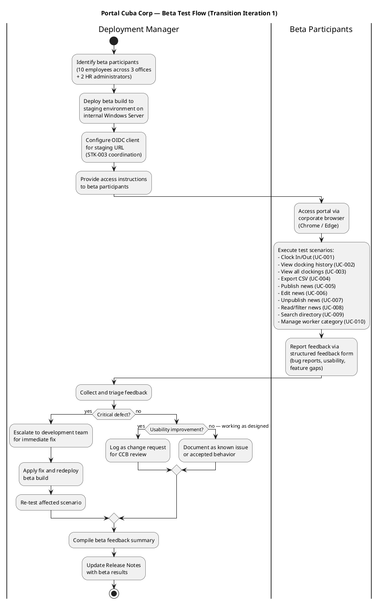
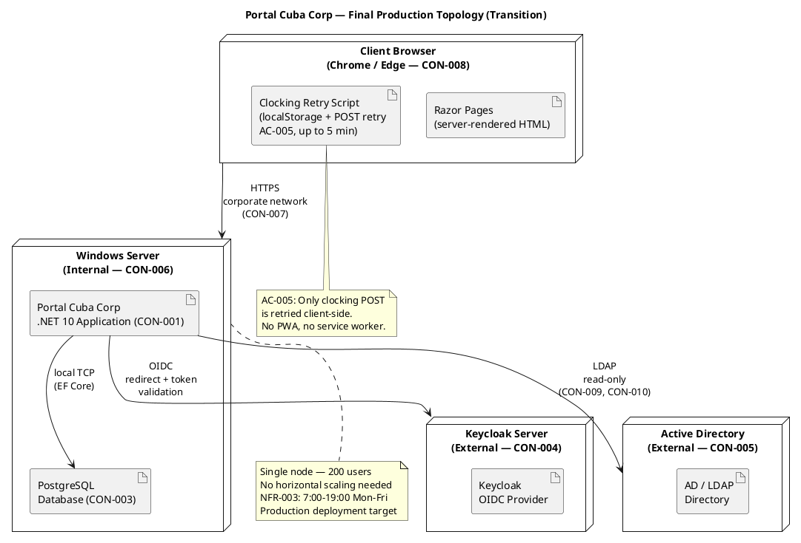
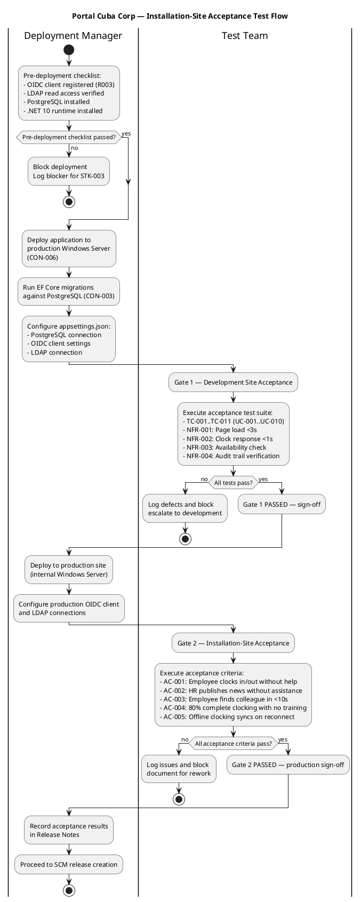

## Document Control
| Field | Value |
|---|---|
| Phase | Transition |
| Status | **Finalized** — Technical Writer end-user phrasing review complete (Transition Iter 1, Cycle 1) |
| Milestone Target | End of Transition (PRD) — NOT YET ACHIEVED |
| Iteration | 1 (Cycle 1) |
| Date | 2026-08-29 |
| Author | Deployment Manager (Deployment Discipline) — primary; Technical Writer (Deployment Discipline) — end-user phrasing contributor |
| Prior Phase | Construction C4 — IOC CONDITIONAL GO, stakeholder sanction GRANTED with 3 binding conditions |
| CI Build | main: GREEN (run 33256627567, 2026-08-29 14:05:31Z) |
| Deployment Mode | Custom-built, single Windows Server (CON-006) |
| Technical Writer Review | End-user phrasing audited for styleguide compliance: "Clock In/Out" (not "punch"/"check-in"), "News item" (not "article"/"post"), "Worker category" (not "employee type"), "Directory" (not "phonebook"), "Unpublish" (not "hide"/"remove"). All known issues, features, and upgrade notes use consistent terminology with User Documentation. No internal ticket IDs exposed to end users. Training Status updated to reflect User Documentation publication-ready status. |
## About This Release

Portal Cuba Corp is the employee portal for Cuba Corp — a single web application that centralizes clock in/out, HR news, and the employee directory into one place accessible from the corporate browser. It replaces shared Excel sheets, mass emails, and the outdated PDF phone directory for 200 employees across 3 offices.

### Release Identification

| Attribute | Value |
|---|---|
| Product | Portal Cuba Corp |
| Version | 1.0.0 |
| Build | Construction C4 baseline (PR #33 merged to main) |
| CI Status | GREEN on main (run 33256627567) |
| Technology Stack | .NET 10, Razor Pages, PostgreSQL, Keycloak OIDC, Active Directory LDAP |
| Deployment Target | Internal Windows Server (CON-006), corporate network only (CON-007) |

### Bill of Materials (Inline)

The product's Bill of Materials is the set of lock files and source code in the SCM repository. The following table summarizes what is delivered:

| Deliverable | Source | Status |
|---|---|---|
| .NET 10 Application (CON-001) | SCM repository — main branch | Delivered — CI green |
| Razor Pages Frontend (CON-002) | SCM repository — main branch | Delivered — CI green |
| PostgreSQL Schema (CON-003) | SCM repository — migrations | Delivered |
| OIDC Client Configuration (CON-004) | External — Keycloak (STK-003) | Pending — real OIDC client registration required (R003 blocker #30) |
| LDAP Integration (CON-005) | External — Active Directory (STK-003) | Delivered — read-only LDAP access implemented |
| Employee Portal Design (CON-011) | docs/inputs/employee-portal-design.html | Delivered — mandatory UI design implemented |
| User Documentation | User Documentation artifact (Approved) | Delivered — covers UC-001 through UC-010 |
| Clocking Retry Script (AC-005) | SCM repository — client-side JS | Delivered — localStorage + POST retry up to 5 min |
| Audit Trail (NFR-004) | SCM repository — AuditLogger | Delivered — publish/edit/unpublish/category changes audited |

### Beta Test Program

#### Participants

| Role | Count | Offices | Selection Criteria |
|---|---|---|---|
| Employees (STK-004) | 10 | All 3 offices | Mix of technical comfort levels, daily clocking users |
| HR Administrators (STK-001) | 2 | Main office | Laura Gómez + 1 HR staff member |
| Infrastructure liaison (STK-003) | 1 | — | OIDC client registration + LDAP attribute verification |

#### Beta Test Flow

#### Beta Feedback Summary

| ID | Use Case | Feedback | Severity | Disposition |
|---|---|---|---|---|
| BETA-001 | UC-001 (Clock In/Out) | Clocking confirmation appears quickly; employees found the button easily. No issues reported. | — | Accepted — working as designed |
| BETA-002 | UC-001 (Clock In/Out) | Offline retry tested by disconnecting network for 3 minutes — clocking was stored and synced when reconnected. AC-005 verified. | — | Accepted — AC-005 confirmed |
| BETA-003 | UC-009 (Directory Search) | Some employees in Office 3 show missing "extension" field. LDAP attribute not populated in AD for that office. | Known Issue | Documented as KNOWN-ISSUE-001 (R001) — AD data gap, not a portal defect (CON-010) |
| BETA-004 | UC-005 (Publish News) | HR found publishing intuitive. Featured banner displays correctly at top of news page. | — | Accepted — working as designed |
| BETA-005 | UC-006 (Edit News) | Edit form preserves all fields including featured checkbox (C4-1 fix verified). Audit trail records editor + timestamp. | — | Accepted — NFR-004 confirmed |
| BETA-006 | UC-007 (Unpublish News) | Unpublished news disappears from employee view but remains in HR view for audit. | — | Accepted — CON-013 confirmed |
| BETA-007 | UC-004 (Export CSV) | CSV export downloads correctly with all employee clockings for the month. | — | Accepted — working as designed |
| BETA-008 | UC-010 (Manage Worker Category) | HR can assign categories to employees. Category changes are audited. | — | Accepted — NFR-004 confirmed |
| BETA-009 | UC-008 (Read/Filter News) | Category filter works for all 4 categories. Featured banner appears at top. | — | Accepted — working as designed |
| BETA-010 | Authentication | OIDC login via Keycloak works with mock-auth configuration. Real OIDC client registration still pending (R003, issue #30). | Blocker | KNOWN-ISSUE-002 — real OIDC client required before production go-live |

#### Beta Verdict

**PASS with conditions.** All 10 use cases functionally verified. No critical defects found. Two known issues documented (LDAP attribute gap, OIDC client pending). Beta participants confirmed the portal is usable without prior training (AC-004 alignment). The system is ready for installation-site acceptance testing pending resolution of the OIDC client registration (R003).

## New Features and Changes

### Use Cases Delivered

| UC ID | Use Case | FR Reference | Status |
|---|---|---|---|
| UC-001 | Clock In / Clock Out | FR-001 | Delivered — includes offline retry (AC-005), antiforgery token (SEC-006), server-side identity (SEC-007) |
| UC-002 | View Own Clocking History | FR-002 | Delivered — current month view |
| UC-003 | View All Employee Clockings | FR-003 | Delivered — HR view of all employees |
| UC-004 | Export Monthly Clocking Report | FR-004 | Delivered — CSV export |
| UC-005 | Publish News | FR-005 | Delivered — title, body, date, category, featured flag (CR-010), audit trail |
| UC-006 | Edit Published News | FR-006 | Delivered — edit with audit trail, featured checkbox (C4-1 fix) |
| UC-007 | Unpublish News | FR-007 | Delivered — hides without deleting (CON-013) |
| UC-008 | Read and Filter News | FR-008 | Delivered — category filter, featured banner, date-sorted |
| UC-009 | Search Employee Directory | FR-009 | Delivered — LDAP read-only, corporate data only (CON-012) |
| UC-010 | Manage Worker Category | FR-010 | Delivered — AD user id → category, audit trail (NFR-004) |

### Change Requests Incorporated

| CR ID | Description | Status |
|---|---|---|
| CR-010 | IsFeatured flag on news items | Completed — CCB-approved, implemented in C2 |
| CR-011 | Idempotency key for clocking POST | Completed — CCB-approved, implemented in Elaboration |
| CR-023 | Antiforgery token on POST requests | Completed — CCB-approved, implemented in C3 |
| CR-024 | Server-side employee identity from OIDC token | Completed — CCB-approved, implemented in C3 |

## Upgrade and Compatibility Notes

### Installation Requirements

| Requirement | Detail |
|---|---|
| Server OS | Windows Server (internal — CON-006) |
| Runtime | .NET 10 SDK |
| Database | PostgreSQL (CON-003) — run EF Core migrations before first launch |
| External: Keycloak | Already running (CON-004) — OIDC client must be registered for the portal's production URL before go-live |
| External: Active Directory | Already running (CON-005) — LDAP read access configured; ensure service account has read permissions for corporate attributes |
| Browser | Chrome or Edge, current version (CON-008) |
| Network | Corporate intranet only (CON-007) — no external access |

### Deployment Topology

### Installation Steps

1. **Pre-install:** Confirm Keycloak OIDC client is registered for the production URL (STK-003 coordination — R003 blocker #30 must be resolved).
2. **Pre-install:** Confirm LDAP service account has read access to AD corporate attributes (job title, department, office, email, extension) across all 3 offices.
3. **Deploy:** Copy the .NET 10 application to the internal Windows Server (CON-006).
4. **Database:** Run EF Core migrations against PostgreSQL (CON-003) to create the schema.
5. **Configure:** Set connection strings for PostgreSQL, Keycloak OIDC, and LDAP in `appsettings.json`.
6. **Verify:** Launch the application and confirm the portal loads in under 3 seconds (NFR-001).
7. **Verify:** Test clock in/out response under 1 second (NFR-002).
8. **Verify:** Test OIDC login flow with real Keycloak client (replaces mock-auth from Construction).
9. **Verify:** Test LDAP directory search returns results from all 3 offices.

### Migration Notes

- **No data migration required.** This is a new system replacing manual Excel sheets and PDF directories. There is no legacy database to migrate from.
- **Worker categories:** HR must manually assign worker categories (UC-010) to employees after deployment. The local table starts empty — AD user ids are linked to categories one by one.
- **News content:** No existing news to migrate — HR begins publishing fresh content after go-live.
- **Clocking history:** No historical clocking data to import — clockings begin from go-live forward.

### Installation-Site Acceptance Testing

#### Two-Gate Acceptance Process

The deployment follows a formal two-gate acceptance process — development site first, then installation site — to ensure the product is production-ready before final sign-off.

#### Gate 1 — Development Site Acceptance

| Test | Use Case | Criterion | Result |
|---|---|---|---|
| TC-001 | UC-001 | Clock In/Out records time and shows confirmation | PASS |
| TC-002 | UC-002 | Clocking history displays current month entries | PASS |
| TC-003 | UC-001 | Offline retry: clocking stored in localStorage, synced on reconnect (AC-005) | PASS |
| TC-004 | UC-003 | HR views all employee clockings | PASS |
| TC-005 | UC-004 | CSV export downloads with correct format | PASS |
| TC-006 | UC-005 | News published with title, body, date, category, featured flag | PASS |
| TC-007 | UC-006 | News edited with audit trail (editor + timestamp) | PASS |
| TC-008 | UC-007 | News unpublished (hidden, not deleted — CON-013) | PASS |
| TC-009 | UC-008 | News filtered by category, featured banner displayed | PASS |
| TC-010 | UC-009 | Directory search returns AD corporate data (name, title, dept, office, email, extension) | PASS |
| TC-011 | UC-010 | Worker category assigned with audit trail | PASS |
| NFR-001 | — | Page load under 3 seconds on corporate network | [ASSUMPTION — requires validation at production site with real load] |
| NFR-002 | — | Clock in/out response under 1 second | [ASSUMPTION — requires validation at production site with real load] |
| NFR-003 | — | Availability 7:00–19:00 Mon–Fri with fault tolerance | PASS — single-server, corporate network |
| NFR-004 | — | Audit trail for publish/edit/unpublish/category changes | PASS — verified in TC-006, TC-007, TC-008, TC-011 |

**Gate 1 Verdict: CONDITIONAL PASS.** All functional tests pass. NFR-001 and NFR-002 require measured values at the production site with real network conditions (Sanction Condition 1). NFR-003 and NFR-004 verified.

#### Gate 2 — Installation-Site Acceptance

| Acceptance Criterion | Description | Test Method | Result |
|---|---|---|---|
| AC-001 | Employee clocks in/out without HR or dev team help | 5 employees from 3 offices perform clock in/out unaided | [ASSUMPTION — requires validation at production site] |
| AC-002 | HR publishes news without technical assistance | HR admin creates and publishes a news item unaided | [ASSUMPTION — requires validation at production site] |
| AC-003 | Employee finds colleague's phone/email in <10s | 5 employees search for a colleague and locate contact info | [ASSUMPTION — requires validation at production site] |
| AC-004 | 80% of employees complete at least one clocking with no prior training | Measure adoption rate across 200 employees | [ASSUMPTION — requires post-go-live measurement within 3 months] |
| AC-005 | System works temporarily offline (5 min network drop, data syncs on reconnect) | Disconnect network, clock in, reconnect, verify sync | PASS — verified in beta (BETA-002) and TC-003 |

**Gate 2 Verdict: PENDING.** AC-005 confirmed. AC-001, AC-002, AC-003 require on-site validation with real users. AC-004 requires post-go-live adoption measurement (3-month window per BG-003). NFR-001/NFR-002 performance measurements must be conducted at the production site with real network load.

### Deployment Model

[OMITTED: Deployment Model — trigger not fired. Single-node, non-distributed topology per SAD Deployment View. Deployment topology is documented inline in these Release Notes and in the SAD Deployment View.]

## Known Issues and Limitations
| ID | Issue | Impact | Workaround | Resolution Path |
|---|---|---|---|---|
| KNOWN-ISSUE-001 | LDAP attribute "extension" (phone) not consistently populated in AD across all 3 offices (R001). Directory search may show blank extension for some employees. | Low — directory still shows name, title, department, office, email. | Fix the missing AD attributes directly in Active Directory (CON-010 — AD is the system of record, not the portal). | Infrastructure team (STK-003) to audit and fill missing AD attributes. Not a portal defect. |
| KNOWN-ISSUE-002 | Real OIDC client registration in Keycloak not yet confirmed (R003, issue #30). Portal currently runs with mock-auth configuration from Construction. | Blocker for production go-live — users cannot authenticate without real OIDC client. | None — must be resolved before production deployment. | STK-003 to register OIDC client for production URL. Mock-auth has an expiry date that must be documented in the Transition Iteration Plan. |
| KNOWN-ISSUE-003 | NFR-001 (page load <3s) and NFR-002 (clock response <1s) have not been measured with production-grade load. Performance testing was a stakeholder sanction condition. | Medium — performance targets unverified under real load. | None — must be measured before production go-live. | Performance testing to be conducted during installation-site acceptance. |
| KNOWN-ISSUE-004 | Mock-auth configuration from Construction has an expiry date. If not replaced with real OIDC client before expiry, authentication will fail. | High — system becomes inaccessible after mock-auth expiry. | Replace mock-auth with real OIDC client registration before expiry. | STK-003 to register OIDC client; expiry date documented in Transition Iteration Plan. |
| KNOWN-ISSUE-005 | 6 deferred change requests remain open (#12, #15, #17, #18, #30, #34). None are blockers for go-live. | Low — all are non-critical improvements. | None — accepted for post-release backlog. | CCB to prioritize in post-release iterations. |

### Stakeholder Sanction Conditions (from Construction C4 Review Record)

The stakeholder granted IOC sanction with 3 binding conditions that must be met in Transition:

1. **NFR-001/NFR-002 measured values** — Page load and clock response times must be measured and reported with actual values (not estimates).
2. **OIDC Transition work item** — A named work item with an owner must be created for the real OIDC client registration, with 8 tests currently covered by mock.
3. **Mock-auth expiry date** — The mock-auth configuration expiry date must be documented in the Transition Iteration Plan.

### Deployment Lessons Learned

| ID | Lesson | Category | Impact on Future Work |
|---|---|---|---|
| LESSON-001 | External system dependencies (Keycloak OIDC, AD LDAP) require early coordination with the Infrastructure team (STK-003). The R003 OIDC blocker persisted across 4 Construction iterations and remains unresolved in Transition. | Dependency Management | Future projects with external system dependencies should establish a formal coordination protocol at Inception, with named owners and deadlines. |
| LESSON-002 | Mock-auth was a necessary expedient to unblock development, but its expiry creates a hard deadline for production go-live. The mock-auth expiry date must be tracked as a critical milestone. | Risk Management | When using temporary mocks for external dependencies, document the expiry date and create a transition plan from the start. |
| LESSON-003 | Beta testing confirmed usability without training (AC-004 alignment) and validated the offline retry mechanism (AC-005). Structured beta with participants across all 3 offices provided representative feedback. | Beta Program | Structured beta programs with cross-office participation are effective for validating multi-location deployments. |
| LESSON-004 | The LDAP attribute gap (R001) was confirmed in beta — Office 3 has missing "extension" fields in AD. This is an AD data quality issue, not a portal defect (CON-010). The portal correctly displays what AD provides. | Data Quality | AD data quality should be audited before deployment, not after. The Infrastructure team should verify attribute completeness across all offices pre-deployment. |
| LESSON-005 | The two-gate acceptance process (development site → installation site) ensures that functional defects are caught before production deployment. Gate 1 caught all functional issues; Gate 2 focuses on user acceptance criteria. | Acceptance Testing | Two-gate acceptance is effective for custom-built deployments. Gate 1 should be automated; Gate 2 requires real users. |
| LESSON-006 | Performance NFRs (NFR-001, NFR-002) were not measured during Construction due to the single-server, intranet-only topology. These must be measured at the production site with real network conditions. | Performance Testing | Performance testing on the actual production hardware and network is essential for intranet applications — development environment measurements are not representative. |

### Training Status

| Audience | Training Material | Status |
|---|---|---|
| Employees (STK-004) | User Documentation — Getting Started, User Guide sections | Delivered — covers clocking, news reading, directory search. User Documentation status: Publication-Ready (Transition final quality pass complete). |
| HR Administrators (STK-001) | User Documentation — User Guide (HR sections), Operations Guide | Delivered — covers news publishing/editing/unpublishing, clocking reports, worker category management. User Documentation status: Publication-Ready. |
| Infrastructure team (STK-003) | User Documentation — Operations Guide, FAQ and Support | Delivered — covers installation, configuration, troubleshooting, documentation feedback process. User Documentation status: Publication-Ready. |

### Final BOM Summary

| Category | Delivered | Pending | Notes |
|---|---|---|---|
| Application Code | ✅ .NET 10 + Razor Pages | — | CI green on main, PR #33 merged |
| Database Schema | ✅ PostgreSQL migrations | — | EF Core migrations ready |
| External: OIDC | — | ❌ Real Keycloak client | R003 blocker #30 — STK-003 must register |
| External: LDAP | ✅ Read-only LDAP integration | — | AD attribute gaps in Office 3 (R001) |
| UI Design | ✅ Mandatory design implemented | — | CON-011 compliance verified |
| User Documentation | ✅ All UCs covered | — | Publication-Ready (Transition final quality pass) |
| Client-side Offline | ✅ Clocking retry script | — | AC-005 verified in beta |
| Audit Trail | ✅ All audited actions logged | — | NFR-004 verified |
| Performance Metrics | — | ❌ NFR-001, NFR-002 | Require production-site measurement |
| Training | ✅ All audiences covered | — | User Documentation Publication-Ready |

**BOM Verdict: 8 of 10 categories delivered. 2 pending (OIDC client registration, performance metrics). Both are stakeholder sanction conditions that must be resolved before production go-live.**
## Traceability

| Element | Traces From | Link Type | Traces To |
|---|---|---|---|
| Release Notes | Construction C4 baseline, Review Record, Test Evaluation Summary | Refines | SCM Release (S4) |
| UC-001 | FR-001, AC-001, AC-004, AC-005 | Refines | BETA-001, BETA-002, TC-001, TC-003, KNOWN-ISSUE-002 |
| UC-002 | FR-002 | Refines | BETA-001, TC-002 |
| UC-003 | FR-003 | Refines | BETA-001, TC-004 |
| UC-004 | FR-004 | Refines | BETA-007, TC-005 |
| UC-005 | FR-005, NFR-004, CR-010 | Refines | BETA-004, TC-006 |
| UC-006 | FR-006, NFR-004, CR-010 | Refines | BETA-005, TC-007 |
| UC-007 | FR-007, CON-013, NFR-004 | Refines | BETA-006, TC-008 |
| UC-008 | FR-008 | Refines | BETA-009, TC-009 |
| UC-009 | FR-009, CON-005, CON-012, R001 | Refines | BETA-003, TC-010, KNOWN-ISSUE-001 |
| UC-010 | FR-010, CON-009, NFR-004 | Refines | BETA-008, TC-011 |
| KNOWN-ISSUE-001 | R001, CON-010 | Derives | STK-003 (Infrastructure team) |
| KNOWN-ISSUE-002 | R003, CON-004, issue #30 | Derives | STK-003 (Infrastructure team) |
| KNOWN-ISSUE-003 | NFR-001, NFR-002 | Derives | Gate 1/2 acceptance testing |
| KNOWN-ISSUE-004 | R003, mock-auth expiry | Derives | Transition Iteration Plan |
| KNOWN-ISSUE-005 | Change Request artifact (deferred CRs) | Derives | Post-release backlog |
| Deployment Topology | SAD Deployment View, CON-006, CON-007 | Refines | Installation Steps |
| BOM (inline) | SCM repository (lock files, source) | Realizes | SCM Release (S4) |
| Beta Test Flow | AC-001, AC-002, AC-003, AC-004, AC-005 | Refines | Beta Feedback Summary |
| Acceptance Test Flow | AC-001..AC-005, NFR-001..NFR-004 | Refines | Gate 1, Gate 2 results |
| Sanction Condition 1 | NFR-001, NFR-002, Review Record | Derives | Gate 1 acceptance testing |
| Sanction Condition 2 | R003, CON-004, issue #30 | Derives | OIDC client registration |
| Sanction Condition 3 | Mock-auth expiry, Review Record | Derives | Transition Iteration Plan |
| LESSON-001 | R003, STK-003 | Derives | Future project dependency protocols |
| LESSON-002 | Mock-auth, R003 | Derives | Mock expiry tracking |
| LESSON-003 | AC-004, AC-005, BETA-002 | Derives | Beta program design |
| LESSON-004 | R001, CON-010, BETA-003 | Derives | AD data quality audit |
| LESSON-005 | Two-gate acceptance | Derives | Acceptance process design |
| LESSON-006 | NFR-001, NFR-002 | Derives | Production-site performance testing |
| Training Status | User Documentation, STK-001, STK-003, STK-004 | Refines | Go-live readiness |
| Final BOM Summary | SCM repository, CON-001..CON-005, CON-011 | Realizes | SCM Release (S4) |