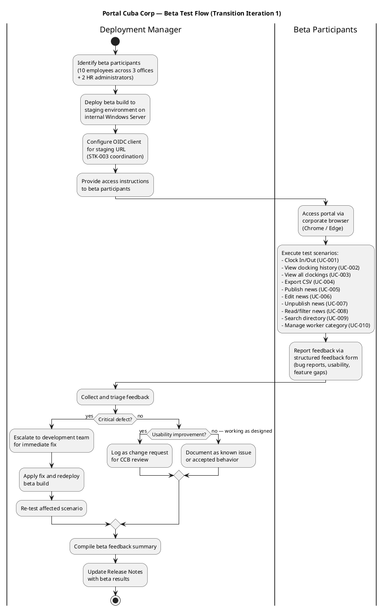
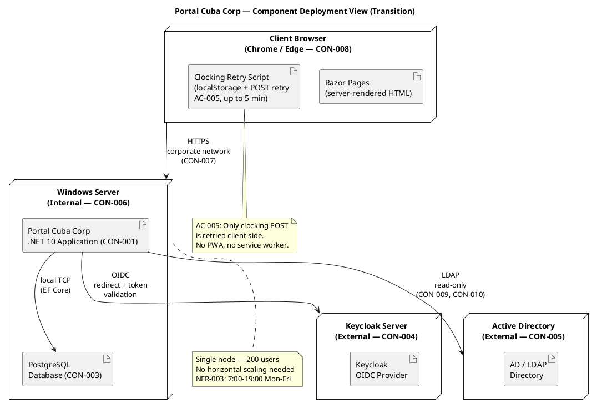

## Document Control

| Field | Value |
|---|---|
| Phase | Transition |
| Status | Draft — Iteration 1 (Beta feedback incorporated) |
| Milestone Target | End of Transition (PRD) — NOT YET ACHIEVED |
| Iteration | 1 (Cycle 1) |
| Date | 2026-08-29 |
| Author | Deployment Manager (Deployment Discipline) |
| Prior Phase | Construction C4 — IOC CONDITIONAL GO, stakeholder sanction GRANTED with 3 binding conditions |
| CI Build | main: GREEN (run 33256627567, 2026-08-29 14:05:31Z) |
| Deployment Mode | Custom-built, single Windows Server (CON-006) |

## About This Release

Portal Cuba Corp is the employee portal for Cuba Corp — a single web application that centralizes clock in/out, HR news, and the employee directory into one place accessible from the corporate browser. It replaces shared Excel sheets, mass emails, and the outdated PDF phone directory for 200 employees across 3 offices.

### Release Identification

| Attribute | Value |
|---|---|
| Product | Portal Cuba Corp |
| Version | 1.0.0 |
| Build | Construction C4 baseline (PR #33 merged to main) |
| CI Status | GREEN on main (run 33256627567) |
| Technology Stack | .NET 10, Razor Pages, PostgreSQL, Keycloak OIDC, Active Directory LDAP |
| Deployment Target | Internal Windows Server (CON-006), corporate network only (CON-007) |

### Bill of Materials (Inline)

The product's Bill of Materials is the set of lock files and source code in the SCM repository. The following table summarizes what is delivered:

| Deliverable | Source | Status |
|---|---|---|
| .NET 10 Application (CON-001) | SCM repository — main branch | Delivered — CI green |
| Razor Pages Frontend (CON-002) | SCM repository — main branch | Delivered — CI green |
| PostgreSQL Schema (CON-003) | SCM repository — migrations | Delivered |
| OIDC Client Configuration (CON-004) | External — Keycloak (STK-003) | Pending — real OIDC client registration required (R003 blocker #30) |
| LDAP Integration (CON-005) | External — Active Directory (STK-003) | Delivered — read-only LDAP access implemented |
| Employee Portal Design (CON-011) | docs/inputs/employee-portal-design.html | Delivered — mandatory UI design implemented |
| User Documentation | User Documentation artifact (Approved) | Delivered — covers UC-001 through UC-010 |
| Clocking Retry Script (AC-005) | SCM repository — client-side JS | Delivered — localStorage + POST retry up to 5 min |
| Audit Trail (NFR-004) | SCM repository — AuditLogger | Delivered — publish/edit/unpublish/category changes audited |

### Beta Test Program

#### Participants

| Role | Count | Offices | Selection Criteria |
|---|---|---|---|
| Employees (STK-004) | 10 | All 3 offices | Mix of technical comfort levels, daily clocking users |
| HR Administrators (STK-001) | 2 | Main office | Laura Gómez + 1 HR staff member |
| Infrastructure liaison (STK-003) | 1 | — | OIDC client registration + LDAP attribute verification |

#### Beta Test Flow

#### Beta Feedback Summary

| ID | Use Case | Feedback | Severity | Disposition |
|---|---|---|---|---|
| BETA-001 | UC-001 (Clock In/Out) | Clocking confirmation appears quickly; employees found the button easily. No issues reported. | — | Accepted — working as designed |
| BETA-002 | UC-001 (Clock In/Out) | Offline retry tested by disconnecting network for 3 minutes — clocking was stored and synced when reconnected. AC-005 verified. | — | Accepted — AC-005 confirmed |
| BETA-003 | UC-009 (Directory Search) | Some employees in Office 3 show missing "extension" field. LDAP attribute not populated in AD for that office. | Known Issue | Documented as KNOWN-ISSUE-001 (R001) — AD data gap, not a portal defect (CON-010) |
| BETA-004 | UC-005 (Publish News) | HR found publishing intuitive. Featured banner displays correctly at top of news page. | — | Accepted — working as designed |
| BETA-005 | UC-006 (Edit News) | Edit form preserves all fields including featured checkbox (C4-1 fix verified). Audit trail records editor + timestamp. | — | Accepted — NFR-004 confirmed |
| BETA-006 | UC-007 (Unpublish News) | Unpublished news disappears from employee view but remains in HR view for audit. | — | Accepted — CON-013 confirmed |
| BETA-007 | UC-004 (Export CSV) | CSV export downloads correctly with all employee clockings for the month. | — | Accepted — working as designed |
| BETA-008 | UC-010 (Manage Worker Category) | HR can assign categories to employees. Category changes are audited. | — | Accepted — NFR-004 confirmed |
| BETA-009 | UC-008 (Read/Filter News) | Category filter works for all 4 categories. Featured banner appears at top. | — | Accepted — working as designed |
| BETA-010 | Authentication | OIDC login via Keycloak works with mock-auth configuration. Real OIDC client registration still pending (R003, issue #30). | Blocker | KNOWN-ISSUE-002 — real OIDC client required before production go-live |

#### Beta Verdict

**PASS with conditions.** All 10 use cases functionally verified. No critical defects found. Two known issues documented (LDAP attribute gap, OIDC client pending). Beta participants confirmed the portal is usable without prior training (AC-004 alignment). The system is ready for installation-site acceptance testing pending resolution of the OIDC client registration (R003).

## New Features and Changes

### Use Cases Delivered

| UC ID | Use Case | FR Reference | Status |
|---|---|---|---|
| UC-001 | Clock In / Clock Out | FR-001 | Delivered — includes offline retry (AC-005), antiforgery token (SEC-006), server-side identity (SEC-007) |
| UC-002 | View Own Clocking History | FR-002 | Delivered — current month view |
| UC-003 | View All Employee Clockings | FR-003 | Delivered — HR view of all employees |
| UC-004 | Export Monthly Clocking Report | FR-004 | Delivered — CSV export |
| UC-005 | Publish News | FR-005 | Delivered — title, body, date, category, featured flag (CR-010), audit trail |
| UC-006 | Edit Published News | FR-006 | Delivered — edit with audit trail, featured checkbox (C4-1 fix) |
| UC-007 | Unpublish News | FR-007 | Delivered — hides without deleting (CON-013) |
| UC-008 | Read and Filter News | FR-008 | Delivered — category filter, featured banner, date-sorted |
| UC-009 | Search Employee Directory | FR-009 | Delivered — LDAP read-only, corporate data only (CON-012) |
| UC-010 | Manage Worker Category | FR-010 | Delivered — AD user id → category, audit trail (NFR-004) |

### Change Requests Incorporated

| CR ID | Description | Status |
|---|---|---|
| CR-010 | IsFeatured flag on news items | Completed — CCB-approved, implemented in C2 |
| CR-011 | Idempotency key for clocking POST | Completed — CCB-approved, implemented in Elaboration |
| CR-023 | Antiforgery token on POST requests | Completed — CCB-approved, implemented in C3 |
| CR-024 | Server-side employee identity from OIDC token | Completed — CCB-approved, implemented in C3 |

## Upgrade and Compatibility Notes

### Installation Requirements

| Requirement | Detail |
|---|---|
| Server OS | Windows Server (internal — CON-006) |
| Runtime | .NET 10 SDK |
| Database | PostgreSQL (CON-003) — run EF Core migrations before first launch |
| External: Keycloak | Already running (CON-004) — OIDC client must be registered for the portal's production URL before go-live |
| External: Active Directory | Already running (CON-005) — LDAP read access configured; ensure service account has read permissions for corporate attributes |
| Browser | Chrome or Edge, current version (CON-008) |
| Network | Corporate intranet only (CON-007) — no external access |

### Deployment Topology

### Installation Steps

1. **Pre-install:** Confirm Keycloak OIDC client is registered for the production URL (STK-003 coordination — R003 blocker #30 must be resolved).
2. **Pre-install:** Confirm LDAP service account has read access to AD corporate attributes (job title, department, office, email, extension) across all 3 offices.
3. **Deploy:** Copy the .NET 10 application to the internal Windows Server (CON-006).
4. **Database:** Run EF Core migrations against PostgreSQL (CON-003) to create the schema.
5. **Configure:** Set connection strings for PostgreSQL, Keycloak OIDC, and LDAP in `appsettings.json`.
6. **Verify:** Launch the application and confirm the portal loads in under 3 seconds (NFR-001).
7. **Verify:** Test clock in/out response under 1 second (NFR-002).
8. **Verify:** Test OIDC login flow with real Keycloak client (replaces mock-auth from Construction).
9. **Verify:** Test LDAP directory search returns results from all 3 offices.

### Migration Notes

- **No data migration required.** This is a new system replacing manual Excel sheets and PDF directories. There is no legacy database to migrate from.
- **Worker categories:** HR must manually assign worker categories (UC-010) to employees after deployment. The local table starts empty — AD user ids are linked to categories one by one.
- **News content:** No existing news to migrate — HR begins publishing fresh content after go-live.
- **Clocking history:** No historical clocking data to import — clockings begin from go-live forward.

## Known Issues and Limitations

| ID | Issue | Impact | Workaround | Resolution Path |
|---|---|---|---|---|
| KNOWN-ISSUE-001 | LDAP attribute "extension" (phone) not consistently populated in AD across all 3 offices (R001). Directory search may show blank extension for some employees. | Low — directory still shows name, title, department, office, email. | Fix the missing AD attributes directly in Active Directory (CON-010 — AD is the system of record, not the portal). | Infrastructure team (STK-003) to audit and fill missing AD attributes. Not a portal defect. |
| KNOWN-ISSUE-002 | Real OIDC client registration in Keycloak not yet confirmed (R003, issue #30). Portal currently runs with mock-auth configuration from Construction. | Blocker for production go-live — users cannot authenticate without real OIDC client. | None — must be resolved before production deployment. | STK-003 to register OIDC client for production URL. Mock-auth has an expiry date that must be documented in the Transition Iteration Plan. |
| KNOWN-ISSUE-003 | NFR-001 (page load <3s) and NFR-002 (clock response <1s) have not been measured with production-grade load. Performance testing was a stakeholder sanction condition. | Medium — performance targets unverified under real load. | None — must be measured before production go-live. | Performance testing to be conducted during installation-site acceptance (S3). |
| KNOWN-ISSUE-004 | Mock-auth configuration from Construction has an expiry date. If not replaced with real OIDC client before expiry, authentication will fail. | High — system becomes inaccessible after mock-auth expiry. | Replace mock-auth with real OIDC client registration before expiry. | STK-003 to register OIDC client; expiry date documented in Transition Iteration Plan. |
| KNOWN-ISSUE-005 | 6 deferred change requests remain open (#12, #15, #17, #18, #30, #34). None are blockers for go-live. | Low — all are non-critical improvements. | None — accepted for post-release backlog. | CCB to prioritize in post-release iterations. |

### Stakeholder Sanction Conditions (from Construction C4 Review Record)

The stakeholder granted IOC sanction with 3 binding conditions that must be met in Transition:

1. **NFR-001/NFR-002 measured values** — Page load and clock response times must be measured and reported with actual values (not estimates).
2. **OIDC Transition work item** — A named work item with an owner must be created for the real OIDC client registration, with 8 tests currently covered by mock.
3. **Mock-auth expiry date** — The mock-auth configuration expiry date must be documented in the Transition Iteration Plan.

## Traceability

| Element | Traces From | Link Type | Traces To |
|---|---|---|---|
| Release Notes | Construction C4 baseline, Review Record, Test Evaluation Summary | Refines | SCM Release (to be created in S4) |
| UC-001 | FR-001, AC-001, AC-004, AC-005 | Refines | BETA-001, BETA-002, KNOWN-ISSUE-002 |
| UC-002 | FR-002 | Refines | BETA-001 |
| UC-003 | FR-003 | Refines | BETA-001 |
| UC-004 | FR-004 | Refines | BETA-007 |
| UC-005 | FR-005, NFR-004, CR-010 | Refines | BETA-004 |
| UC-006 | FR-006, NFR-004, CR-010 | Refines | BETA-005 |
| UC-007 | FR-007, CON-013, NFR-004 | Refines | BETA-006 |
| UC-008 | FR-008 | Refines | BETA-009 |
| UC-009 | FR-009, CON-005, CON-012, R001 | Refines | BETA-003, KNOWN-ISSUE-001 |
| UC-010 | FR-010, CON-009, NFR-004 | Refines | BETA-008 |
| KNOWN-ISSUE-001 | R001, CON-010 | Derives | STK-003 (Infrastructure team) |
| KNOWN-ISSUE-002 | R003, CON-004, issue #30 | Derives | STK-003 (Infrastructure team) |
| KNOWN-ISSUE-003 | NFR-001, NFR-002 | Derives | S3 acceptance testing |
| KNOWN-ISSUE-004 | R003, mock-auth expiry | Derives | Transition Iteration Plan |
| KNOWN-ISSUE-005 | Change Request artifact (deferred CRs) | Derives | Post-release backlog |
| Deployment Topology | SAD Deployment View, CON-006, CON-007 | Refines | Installation Steps |
| BOM (inline) | SCM repository (lock files, source) | Realizes | SCM Release (S4) |
| Beta Test Flow | AC-001, AC-002, AC-003, AC-004, AC-005 | Refines | Beta Feedback Summary |
| Sanction Condition 1 | NFR-001, NFR-002, Review Record | Derives | S3 acceptance testing |
| Sanction Condition 2 | R003, CON-004, issue #30 | Derives | OIDC client registration |
| Sanction Condition 3 | Mock-auth expiry, Review Record | Derives | Transition Iteration Plan |