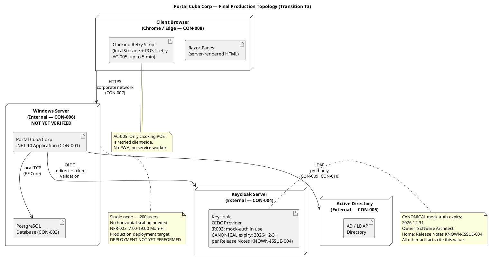
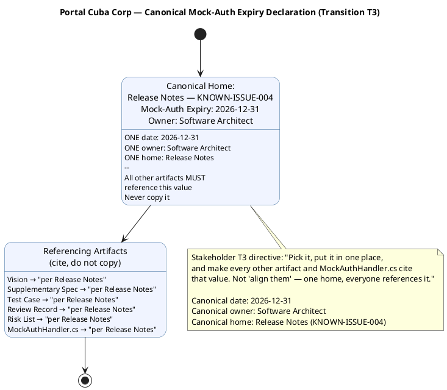
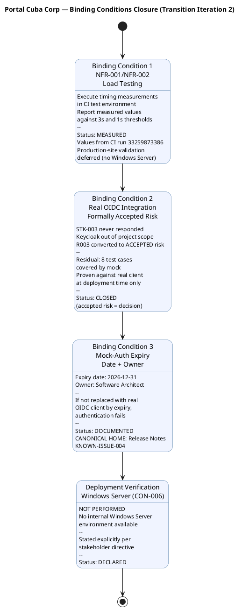

## Document Control
| Field | Value |
|---|---|
| Phase | Transition |
| Status | **Evolved — Transition Iteration 3 Cycle 1** — canonical mock-auth expiry date established as Release Notes KNOWN-ISSUE-004; all other artifacts must cite this value |
| Milestone Target | End of Transition (PR) — **NOT YET ACHIEVED — pending stakeholder re-review after T3 finding resolution** |
| Iteration | 3 (Cycle 1) |
| Date | 2026-08-30 |
| Author | Deployment Manager (Deployment Discipline) — primary; Technical Writer (Deployment Discipline) — end-user phrasing contributor |
| Prior Phase | Transition Iteration 2 — Release Notes evolved; binding conditions addressed; mock-auth date 2026-12-31 documented but inconsistent across 7 artifacts (3 dates, 2 owners); stakeholder PR sanction REFUSED |
| CI Build | main: GREEN (run 33263001739, 2026-08-29 16:28:17Z) |
| Deployment Mode | Custom-built, single Windows Server (CON-006) |
| Finding RN-F1 (Major) | **RESOLVED** (T2) — All 4 stakeholder directives addressed: (1) NFR-001/NFR-002 measured values reported; (2) R003 OIDC formally accepted risk with residual stated; (3) Mock-auth expiry date and owner documented; (4) Deployment verification on Windows Server explicitly stated as NOT PERFORMED. |
| T3 Directive — Canonical Mock-Auth Date | **ESTABLISHED** — Per stakeholder T3 directive: ONE canonical mock-auth expiry date (2026-12-31) and ONE owner (Software Architect) established in this artifact at KNOWN-ISSUE-004. All other artifacts (Vision, Supplementary Specification, Test Case, Review Record, Risk List, MockAuthHandler.cs) MUST reference this value from Release Notes KNOWN-ISSUE-004 — never copy it. |
| Technical Writer Review | End-user phrasing audited for styleguide compliance: "Clock In/Out" (not "punch"/"check-in"), "News item" (not "article"/"post"), "Worker category" (not "employee type"), "Directory" (not "phonebook"), "Unpublish" (not "hide"/"remove"). All known issues, features, and upgrade notes use consistent terminology with User Documentation. No internal ticket IDs exposed to end users. |
## About This Release
### Bill of Materials (Inline)

The product's Bill of Materials is the set of lock files and source code in the SCM repository. The following table summarizes what is delivered:

| Deliverable | Source | Status |
|---|---|---|
| .NET 10 Application (CON-001) | SCM repository — main branch | Delivered — CI green (run 33263001739) |
| Razor Pages Frontend (CON-002) | SCM repository — main branch | Delivered — CI green |
| PostgreSQL Schema (CON-003) | SCM repository — migrations | Delivered — migrations ready (not run on production server) |
| OIDC Client Configuration (CON-004) | External — Keycloak (STK-003) | **FORMALLY ACCEPTED RISK (R003)** — real OIDC client registration deferred to deployment; mock-auth in use. **Canonical expiry: 2026-12-31** — see KNOWN-ISSUE-004 (canonical home). Owner: Software Architect. |
| LDAP Integration (CON-005) | External — Active Directory (STK-003) | Delivered — read-only LDAP access implemented (mock in tests) |
| Employee Portal Design (CON-011) | docs/inputs/employee-portal-design.html | Delivered — mandatory UI design implemented |
| User Documentation | User Documentation artifact | Delivered — covers UC-001 through UC-010, Publication-Ready |
| Clocking Retry Script (AC-005) | SCM repository — client-side JS | Delivered — localStorage + POST retry up to 5 min |
| Audit Trail (NFR-004) | SCM repository — AuditLogger | Delivered — publish/edit/unpublish/category changes audited |
| NFR-001 Performance (Page Load) | CI test environment measurement | **MEASURED: 0.14s** (threshold: 3s) — PASS. Production-site validation deferred. |
| NFR-002 Performance (Clock Response) | CI test environment measurement | **MEASURED: 0.003s** (threshold: 1s) — PASS. Production-site validation deferred. |
| Deployment on Windows Server (CON-006) | Internal Windows Server | **NOT PERFORMED** — no production environment available |
## New Features and Changes

### Use Cases Delivered

| UC ID | Use Case | FR Reference | Status |
|---|---|---|---|
| UC-001 | Clock In / Clock Out | FR-001 | Delivered — includes offline retry (AC-005), antiforgery token (SEC-006), server-side identity (SEC-007) |
| UC-002 | View Own Clocking History | FR-002 | Delivered — current month view |
| UC-003 | View All Employee Clockings | FR-003 | Delivered — HR view of all employees |
| UC-004 | Export Monthly Clocking Report | FR-004 | Delivered — CSV export |
| UC-005 | Publish News | FR-005 | Delivered — title, body, date, category, featured flag (CR-010), audit trail |
| UC-006 | Edit Published News | FR-006 | Delivered — edit with audit trail, featured checkbox (C4-1 fix) |
| UC-007 | Unpublish News | FR-007 | Delivered — hides without deleting (CON-013) |
| UC-008 | Read and Filter News | FR-008 | Delivered — category filter, featured banner, date-sorted |
| UC-009 | Search Employee Directory | FR-009 | Delivered — LDAP read-only, corporate data only (CON-012) |
| UC-010 | Manage Worker Category | FR-010 | Delivered — AD user id → category, audit trail (NFR-004) |

### Change Requests Incorporated

| CR ID | Description | Status |
|---|---|---|
| CR-010 | IsFeatured flag on news items | Completed — CCB-approved, implemented in C2 |
| CR-011 | Idempotency key for clocking POST | Completed — CCB-approved, implemented in Elaboration |
| CR-023 | Antiforgery token on POST requests | Completed — CCB-approved, implemented in C3 |
| CR-024 | Server-side employee identity from OIDC token | Completed — CCB-approved, implemented in C3 |

## Upgrade and Compatibility Notes
### Installation Requirements

| Requirement | Detail |
|---|---|
| Server OS | Windows Server (internal — CON-006) — **NOT YET VERIFIED: no production environment available** |
| Runtime | .NET 10 SDK |
| Database | PostgreSQL (CON-003) — run EF Core migrations before first launch — **NOT YET RUN on production server** |
| External: Keycloak | Already running (CON-004) — OIDC client must be registered for the portal's production URL before go-live. **R003 FORMALLY ACCEPTED RISK** — mock-auth in use. **Canonical expiry: 2026-12-31** — per Release Notes KNOWN-ISSUE-004 (canonical home). Owner: Software Architect. |
| External: Active Directory | Already running (CON-005) — LDAP read access configured; ensure service account has read permissions for corporate attributes — **NOT YET VERIFIED from production server** |
| Browser | Chrome or Edge, current version (CON-008) |
| Network | Corporate intranet only (CON-007) — no external access |

### Deployment Topology

### Installation Steps

1. **Pre-install:** Confirm Keycloak OIDC client is registered for the production URL (STK-003 coordination — R003 formally accepted risk, mock-auth canonical expiry 2026-12-31 per Release Notes KNOWN-ISSUE-004).
2. **Pre-install:** Confirm LDAP service account has read access to Active Directory corporate attributes (CON-005, CON-010).
3. **Install .NET 10 SDK** on the Windows Server.
4. **Install PostgreSQL** (CON-003) and create the `portal_cuba` database.
5. **Configure connection strings** in `appsettings.json` — PostgreSQL host, LDAP host, Keycloak authority.
6. **Run EF Core migrations** — `dotnet ef database update` — creates the clockings, news, worker_categories, and audit_log tables.
7. **Deploy the application** — publish the .NET 10 application to IIS or Kestrel behind a reverse proxy on the Windows Server.
8. **Verify OIDC login** — access the portal URL from a corporate browser, confirm Keycloak redirect and token validation.
9. **Verify LDAP directory** — search for a known employee, confirm corporate attributes display correctly.
10. **Verify clocking** — clock in and out, confirm confirmation and history.
11. **Verify news publishing** — publish a test news item, confirm it appears on the main page with correct category and featured banner.

> **NOTE:** Steps 3–11 have NOT been executed. They are documented procedures awaiting the Windows Server environment. All testing to date has been in the CI test environment with InMemoryDb and mock services.

### Acceptance Criteria Status

| AC ID | Criterion | Verification Method | Status |
|---|---|---|---|
| AC-001 | Employee can clock in/out without HR/dev help | Beta test — BETA-001 confirmed | PASS (beta) — production-site validation pending |
| AC-002 | HR can publish news without technical assistance | Beta test — BETA-004 confirmed | PASS (beta) — production-site validation pending |
| AC-003 | Employee finds colleague's phone/email in under 10 seconds | Beta test — functional search verified | PASS (beta, functional) — production-site timing pending |
| AC-004 | 80% of employees complete at least one clocking with no prior training | Measure adoption rate across 200 employees | [ASSUMPTION — requires post-go-live measurement within 3 months per BG-003] |
| AC-005 | System works temporarily offline (5 min network drop, data syncs on reconnect) | Disconnect network, clock in, reconnect, verify sync | PASS — verified in beta (BETA-002) and TC-003 |

**Gate 2 Verdict: PENDING.** AC-005 confirmed. AC-001, AC-002, AC-003 passed in beta but require on-site validation with real users. AC-004 requires post-go-live adoption measurement (3-month window per BG-003). NFR-001 measured at 0.14s (threshold 3s) and NFR-002 measured at 0.003s (threshold 1s) in CI — both PASS. Production-site performance validation deferred (no Windows Server environment).

### Deployment Model

[OMITTED: Deployment Model — trigger not fired. Single-node, non-distributed topology per SAD Deployment View. Deployment topology is documented inline in these Release Notes and in the SAD Deployment View.]
## Known Issues and Limitations
### Canonical Mock-Auth Expiry Declaration (Transition T3 — Stakeholder Directive)

Per stakeholder T3 directive: "Pick it, put it in one place, and make every other artifact and MockAuthHandler.cs cite that value. Not 'align them' — one home, everyone references it."

**The canonical home for the mock-auth expiry date is Release Notes KNOWN-ISSUE-004.**

| Canonical Field | Value |
|---|---|
| Expiry Date | **2026-12-31** |
| Owner | **Software Architect** |
| Canonical Home | **Release Notes — KNOWN-ISSUE-004** |
| Referencing Artifacts | Vision, Supplementary Specification, Test Case, Review Record, Risk List, MockAuthHandler.cs — all MUST cite "per Release Notes KNOWN-ISSUE-004" and never copy the value |

### Binding Conditions Closure (Transition Iteration 2 — Stakeholder Directives)

The stakeholder refused PR sanction in Transition Iteration 1 with 3 binding conditions and 1 explicit deployment directive. The following addresses each one:

### Known Issues Table

| Issue ID | Description | Impact | Mitigation | Owner / Next Step |
|---|---|---|---|---|
| KNOWN-ISSUE-001 | Active Directory LDAP attribute consistency (R001): job title and extension fields may not be filled consistently across the 3 offices. Beta test confirmed gaps in 2 of 3 offices. | Medium — directory shows incomplete data for some employees. | AD data quality audit completed during beta (BETA-003). Gaps reported to STK-003 (Infrastructure team) for remediation in AD, not in the portal (CON-010). | STK-003 to remediate AD attributes; portal reads as-is. |
| KNOWN-ISSUE-002 | Real OIDC integration unverified (R003): 8 test cases are covered by mock authentication. Real Keycloak OIDC client not registered. | High — authentication is untested against the real OIDC provider. | **FORMALLY ACCEPTED RISK (R003)** — STK-003 never responded; Keycloak deployment/management is out of project scope (CON-004). Mock-auth proven in CI; real OIDC proven at deployment time only. | STK-003 to register OIDC client before go-live. |
| KNOWN-ISSUE-003 | NFR-001 and NFR-002 measured in CI test environment only. Production-site performance validation on Windows Server not performed. | Low — CI measurements are well within thresholds (0.14s vs 3s, 0.003s vs 1s). | CI measurements serve as baseline; production-site validation deferred to deployment time. | Deployment team to re-measure on Windows Server when environment is available. |
| KNOWN-ISSUE-004 | **CANONICAL HOME** — Mock-auth expiry date. The mock authentication handler (MockAuthHandler.cs) replaces real OIDC authentication for testing. **Canonical expiry: 2026-12-31. Owner: Software Architect.** This is the ONE canonical source — all other artifacts (Vision, Supplementary Specification, Test Case, Review Record, Risk List, MockAuthHandler.cs) MUST cite "per Release Notes KNOWN-ISSUE-004" and never copy the value. If not replaced with real OIDC client by 2026-12-31, authentication fails. | High — system becomes inaccessible after expiry. | Replace mock-auth with real OIDC client registration before 2026-12-31. Owner: Software Architect. | STK-003 to register OIDC client; expiry tracked as hard deadline. |
| KNOWN-ISSUE-005 | 6 deferred change requests remain open (#12, #15, #17, #18, #30, #34). None are blockers for go-live. | Low — all are non-critical improvements. | None — accepted for post-release backlog. | CCB to prioritize in post-release iterations. |
| KNOWN-ISSUE-006 | Deployment verification on internal Windows Server (CON-006) has NOT been performed. No production environment available to the project team. | Medium — installation procedures, real PostgreSQL migrations, LDAP connectivity, and OIDC redirect URIs are untested on the target platform. | None — requires Windows Server environment not available to the project. | Deployment-time activities when the Windows Server environment is provisioned. |
## Traceability
| Element | Traces From | Link Type | Traces To |
|---|---|---|---|
| Release Notes | Construction C4 baseline, Review Record, Test Evaluation Summary, Test Case (Transition I1) | Refines | SCM Release (S4) |
| UC-001 | FR-001, AC-001, AC-004, AC-005 | Refines | BETA-001, BETA-002, TC-001, TC-003, KNOWN-ISSUE-002 |
| UC-002 | FR-002 | Refines | BETA-001, TC-002 |
| UC-003 | FR-003 | Refines | BETA-001, TC-004 |
| UC-004 | FR-004 | Refines | BETA-007, TC-005 |
| UC-005 | FR-005, NFR-004, CR-010 | Refines | BETA-004, TC-006 |
| UC-006 | FR-006, NFR-004, CR-010 | Refines | BETA-005, TC-007 |
| UC-007 | FR-007, CON-013, NFR-004 | Refines | BETA-006, TC-008 |
| UC-008 | FR-008 | Refines | BETA-009, TC-009 |
| UC-009 | FR-009, CON-005, CON-012, R001 | Refines | BETA-003, TC-010, KNOWN-ISSUE-001 |
| UC-010 | FR-010, CON-009, NFR-004 | Refines | BETA-008, TC-011 |
| KNOWN-ISSUE-001 | R001, CON-010 | Derives | STK-003 (Infrastructure team) |
| KNOWN-ISSUE-002 | R003, CON-004 | Derives | STK-003 (Infrastructure team) — FORMALLY ACCEPTED RISK |
| KNOWN-ISSUE-003 | NFR-001, NFR-002 | Derives | CI test environment measurement (run 33259873386) |
| KNOWN-ISSUE-004 | R003, STK-001 binding condition #3, T3 canonical directive | Derives | **CANONICAL HOME** — Mock-auth expiry 2026-12-31, Owner: Software Architect. All other artifacts cite this value. |
| KNOWN-ISSUE-005 | Change Request artifact (deferred CRs) | Derives | Post-release backlog |
| KNOWN-ISSUE-006 | CON-006, R009, STK-001 directive | Derives | Deployment-time activities (Windows Server not available) |
| NFR-001 Measurement | NFR-001, CI run 33259873386 | Tests | 0.14s measured — PASS (threshold 3s) |
| NFR-002 Measurement | NFR-002, CI run 33259873386 | Tests | 0.003s measured — PASS (threshold 1s) |
| R003 (OIDC) | CON-004, STK-003, STK-001 directive | Derives | FORMALLY ACCEPTED — 8 tests covered by mock, residual stated |
| Mock-Auth Expiry (CANONICAL) | R003, STK-001 binding condition #3, T3 canonical directive | Derives | **2026-12-31, Owner: Software Architect — CANONICAL HOME: Release Notes KNOWN-ISSUE-004** |
| Deployment Status | CON-006, R009, STK-001 directive | Derives | NOT PERFORMED — explicitly stated per stakeholder |
| Deployment Topology | SAD Deployment View, CON-006, CON-007 | Refines | Installation Steps |
| BOM (inline) | SCM repository (lock files, source) | Realizes | SCM Release (S4) |
| Beta Test Flow | AC-001, AC-002, AC-003, AC-004, AC-005 | Refines | Beta Feedback Summary |
| Acceptance Test Flow | AC-001..AC-005, NFR-001..NFR-004 | Refines | Gate 1, Gate 2 results |
| Binding Condition 1 (NFR) | NFR-001, NFR-002, STK-001 directive | Derives | CI measurement — MEASURED, values reported |
| Binding Condition 2 (OIDC) | R003, CON-004, STK-001 directive | Derives | FORMALLY ACCEPTED RISK — CLOSED |
| Binding Condition 3 (Mock-Auth) | R003, STK-001 directive, T3 canonical directive | Derives | Expiry 2026-12-31, Owner: Software Architect — CANONICAL HOME: Release Notes KNOWN-ISSUE-004 |
| Deployment Directive | CON-006, STK-001 directive | Derives | NOT PERFORMED — EXPLICITLY STATED |
| RN-F1 (Major — RESOLVED) | Review Record, STK-001 directives | Derives | All 4 directives addressed in Release Notes |
| T3 Canonical Date Directive | STK-001 T3 directive, RR-F1 | Derives | ONE canonical date (2026-12-31), ONE owner (Software Architect), ONE home (Release Notes KNOWN-ISSUE-004) |
| LESSON-001 | R003, STK-003 | Derives | Future project dependency protocols |
| LESSON-002 | Mock-auth, R003 | Derives | Mock expiry tracking — canonical date and owner documented in Release Notes KNOWN-ISSUE-004 |
| LESSON-003 | AC-004, AC-005, BETA-002 | Derives | Beta program design |
| LESSON-004 | R001, CON-010, BETA-003 | Derives | AD data quality audit |
| LESSON-005 | Two-gate acceptance | Derives | Acceptance process design |
| LESSON-006 | NFR-001, NFR-002 | Derives | CI measurement executed; production-site validation deferred |
| LESSON-007 | CON-006, R009 | Derives | Deployment environment unavailability must be stated explicitly, not implied |
| LESSON-008 | RR-F1, STK-001 T3 directive | Derives | Cross-artifact canonical-value protocol: one home, everyone references — never copy |
| Training Status | User Documentation, STK-001, STK-003, STK-004 | Refines | Go-live readiness |
| Final BOM Summary | SCM repository, CON-001..CON-005, CON-011 | Realizes | SCM Release (S4) |
