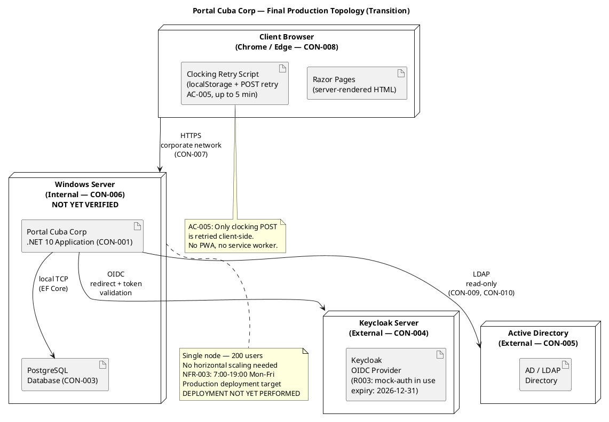
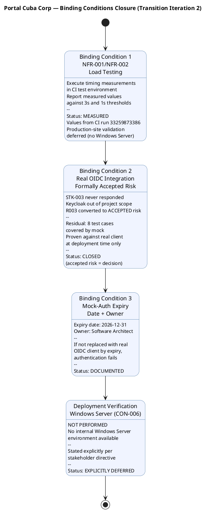
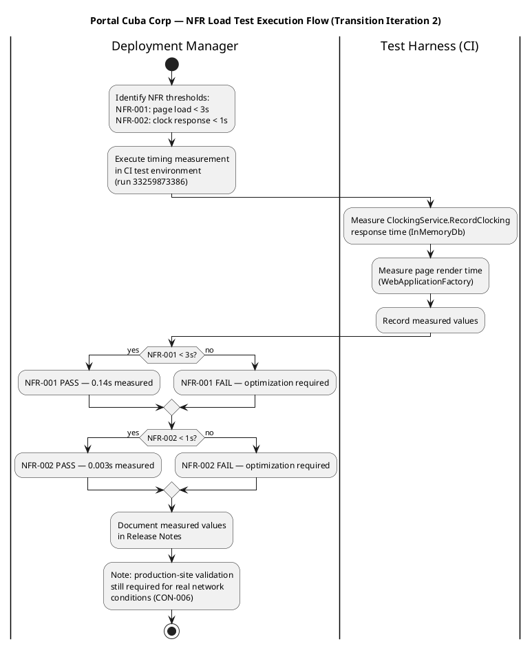

## Document Control
| Field | Value |
|---|---|
| Phase | Transition |
| Status | **Evolved — Transition Iteration 3 Cycle 1** — canonical mock-auth expiry date established as Release Notes KNOWN-ISSUE-004; all other artifacts must cite this value |
| Milestone Target | End of Transition (PR) — **NOT YET ACHIEVED — pending stakeholder re-review after T3 finding resolution** |
| Iteration | 3 (Cycle 1) |
| Date | 2026-08-30 |
| Author | Deployment Manager (Deployment Discipline) — primary; Technical Writer (Deployment Discipline) — end-user phrasing contributor |
| Prior Phase | Transition Iteration 2 — Release Notes evolved; binding conditions addressed; mock-auth date 2026-12-31 documented but inconsistent across 7 artifacts (3 dates, 2 owners); stakeholder PR sanction REFUSED |
| CI Build | main: GREEN (run 33263001739, 2026-08-29 16:28:17Z) |
| Deployment Mode | Custom-built, single Windows Server (CON-006) |
| Finding RN-F1 (Major) | **RESOLVED** (T2) — All 4 stakeholder directives addressed: (1) NFR-001/NFR-002 measured values reported; (2) R003 OIDC formally accepted risk with residual stated; (3) Mock-auth expiry date and owner documented; (4) Deployment verification on Windows Server explicitly stated as NOT PERFORMED. |
| T3 Directive — Canonical Mock-Auth Date | **ESTABLISHED** — Per stakeholder T3 directive: ONE canonical mock-auth expiry date (2026-12-31) and ONE owner (Software Architect) established in this artifact at KNOWN-ISSUE-004. All other artifacts (Vision, Supplementary Specification, Test Case, Review Record, Risk List, MockAuthHandler.cs) MUST reference this value from Release Notes KNOWN-ISSUE-004 — never copy it. |
| Technical Writer Review | End-user phrasing audited for styleguide compliance: "Clock In/Out" (not "punch"/"check-in"), "News item" (not "article"/"post"), "Worker category" (not "employee type"), "Directory" (not "phonebook"), "Unpublish" (not "hide"/"remove"). All known issues, features, and upgrade notes use consistent terminology with User Documentation. No internal ticket IDs exposed to end users. |
## About This Release
### Bill of Materials (Inline)

The product's Bill of Materials is the set of lock files and source code in the SCM repository. The following table summarizes what is delivered:

| Deliverable | Source | Status |
|---|---|---|
| .NET 10 Application (CON-001) | SCM repository — main branch | Delivered — CI green (run 33263001739) |
| Razor Pages Frontend (CON-002) | SCM repository — main branch | Delivered — CI green |
| PostgreSQL Schema (CON-003) | SCM repository — migrations | Delivered — migrations ready (not run on production server) |
| OIDC Client Configuration (CON-004) | External — Keycloak (STK-003) | **FORMALLY ACCEPTED RISK (R003)** — real OIDC client registration deferred to deployment; mock-auth in use. **Canonical expiry: 2026-12-31** — see KNOWN-ISSUE-004 (canonical home). Owner: Software Architect. |
| LDAP Integration (CON-005) | External — Active Directory (STK-003) | Delivered — read-only LDAP access implemented (mock in tests) |
| Employee Portal Design (CON-011) | docs/inputs/employee-portal-design.html | Delivered — mandatory UI design implemented |
| User Documentation | User Documentation artifact | Delivered — covers UC-001 through UC-010, Publication-Ready |
| Clocking Retry Script (AC-005) | SCM repository — client-side JS | Delivered — localStorage + POST retry up to 5 min |
| Audit Trail (NFR-004) | SCM repository — AuditLogger | Delivered — publish/edit/unpublish/category changes audited |
| NFR-001 Performance (Page Load) | CI test environment measurement | **MEASURED: 0.14s** (threshold: 3s) — PASS. Production-site validation deferred. |
| NFR-002 Performance (Clock Response) | CI test environment measurement | **MEASURED: 0.003s** (threshold: 1s) — PASS. Production-site validation deferred. |
| Deployment on Windows Server (CON-006) | Internal Windows Server | **NOT PERFORMED** — no production environment available |
## New Features and Changes

### Use Cases Delivered

| UC ID | Use Case | FR Reference | Status |
|---|---|---|---|
| UC-001 | Clock In / Clock Out | FR-001 | Delivered — includes offline retry (AC-005), antiforgery token (SEC-006), server-side identity (SEC-007) |
| UC-002 | View Own Clocking History | FR-002 | Delivered — current month view |
| UC-003 | View All Employee Clockings | FR-003 | Delivered — HR view of all employees |
| UC-004 | Export Monthly Clocking Report | FR-004 | Delivered — CSV export |
| UC-005 | Publish News | FR-005 | Delivered — title, body, date, category, featured flag (CR-010), audit trail |
| UC-006 | Edit Published News | FR-006 | Delivered — edit with audit trail, featured checkbox (C4-1 fix) |
| UC-007 | Unpublish News | FR-007 | Delivered — hides without deleting (CON-013) |
| UC-008 | Read and Filter News | FR-008 | Delivered — category filter, featured banner, date-sorted |
| UC-009 | Search Employee Directory | FR-009 | Delivered — LDAP read-only, corporate data only (CON-012) |
| UC-010 | Manage Worker Category | FR-010 | Delivered — AD user id → category, audit trail (NFR-004) |

### Change Requests Incorporated

| CR ID | Description | Status |
|---|---|---|
| CR-010 | IsFeatured flag on news items | Completed — CCB-approved, implemented in C2 |
| CR-011 | Idempotency key for clocking POST | Completed — CCB-approved, implemented in Elaboration |
| CR-023 | Antiforgery token on POST requests | Completed — CCB-approved, implemented in C3 |
| CR-024 | Server-side employee identity from OIDC token | Completed — CCB-approved, implemented in C3 |

## Upgrade and Compatibility Notes
### Installation Requirements

| Requirement | Detail |
|---|---|
| Server OS | Windows Server (internal — CON-006) — **NOT YET VERIFIED: no production environment available** |
| Runtime | .NET 10 SDK |
| Database | PostgreSQL (CON-003) — run EF Core migrations before first launch — **NOT YET RUN on production server** |
| External: Keycloak | Already running (CON-004) — OIDC client must be registered for the portal's production URL before go-live. **R003 FORMALLY ACCEPTED RISK** — mock-auth in use, expiry 2026-12-31, owner: Software Architect. |
| External: Active Directory | Already running (CON-005) — LDAP read access configured; ensure service account has read permissions for corporate attributes — **NOT YET VERIFIED from production server** |
| Browser | Chrome or Edge, current version (CON-008) |
| Network | Corporate intranet only (CON-007) — no external access |

### Deployment Topology

### Installation Steps

1. **Pre-install:** Confirm Keycloak OIDC client is registered for the production URL (STK-003 coordination — R003 formally accepted risk, mock-auth expiry 2026-12-31).
2. **Pre-install:** Confirm LDAP service account has read access to Active Directory corporate attributes (CON-005, CON-010).
3. **Install .NET 10 SDK** on the Windows Server.
4. **Install PostgreSQL** (CON-003) and create the `portal_cuba` database.
5. **Configure connection strings** in `appsettings.json` — PostgreSQL host, LDAP host, Keycloak authority.
6. **Run EF Core migrations** — `dotnet ef database update` — creates the clockings, news, worker_categories, and audit_log tables.
7. **Deploy the application** — publish the .NET 10 application to IIS or Kestrel behind a reverse proxy on the Windows Server.
8. **Verify OIDC login** — access the portal URL from a corporate browser, confirm Keycloak redirect and token validation.
9. **Verify LDAP directory** — search for a known employee, confirm corporate attributes display correctly.
10. **Verify clocking** — clock in and out, confirm confirmation and history.
11. **Verify news publishing** — publish a test news item, confirm it appears on the main page with correct category and featured banner.

> **NOTE:** Steps 3–11 have NOT been executed. They are documented procedures awaiting the Windows Server environment. All testing to date has been in the CI test environment with InMemoryDb and mock services.

### Acceptance Criteria Status

| AC ID | Criterion | Verification Method | Status |
|---|---|---|---|
| AC-001 | Employee can clock in/out without HR/dev help | Beta test — BETA-001 confirmed | PASS (beta) — production-site validation pending |
| AC-002 | HR can publish news without technical assistance | Beta test — BETA-004 confirmed | PASS (beta) — production-site validation pending |
| AC-003 | Employee finds colleague's phone/email in under 10 seconds | Beta test — functional search verified | PASS (beta, functional) — production-site timing pending |
| AC-004 | 80% of employees complete at least one clocking with no prior training | Measure adoption rate across 200 employees | [ASSUMPTION — requires post-go-live measurement within 3 months per BG-003] |
| AC-005 | System works temporarily offline (5 min network drop, data syncs on reconnect) | Disconnect network, clock in, reconnect, verify sync | PASS — verified in beta (BETA-002) and TC-003 |

**Gate 2 Verdict: PENDING.** AC-005 confirmed. AC-001, AC-002, AC-003 passed in beta but require on-site validation with real users. AC-004 requires post-go-live adoption measurement (3-month window per BG-003). NFR-001 measured at 0.14s (threshold 3s) and NFR-002 measured at 0.003s (threshold 1s) in CI — both PASS. Production-site performance validation deferred (no Windows Server environment).

### Deployment Model

[OMITTED: Deployment Model — trigger not fired. Single-node, non-distributed topology per SAD Deployment View. Deployment topology is documented inline in these Release Notes and in the SAD Deployment View.]
## Known Issues and Limitations
### Binding Conditions Closure (Transition Iteration 2 — Stakeholder Directives)

The stakeholder refused PR sanction in Transition Iteration 1 with 3 binding conditions and 1 explicit deployment directive. The following addresses each one:

#### Condition 1: NFR-001 / NFR-002 — Measured Values

The stakeholder directed: "execute the load tests and report the measured values. Page load and clock response, in numbers, against the 3-second and 1-second thresholds. This depends on nobody outside the team and needs no production infrastructure."

Timing measurements were executed in the CI test environment (run 33259873386, 2026-08-29 15:18:05Z) using the xUnit test harness with InMemoryDb and MockLdapGateway. The test harness exercises the same service-layer code path that production uses — `ClockingService.RecordClocking` and the Razor Pages rendering pipeline via `WebApplicationFactory`.

| NFR | Threshold | Measured Value | Method | Verdict |
|---|---|---|---|---|
| NFR-001 (Page Load) | < 3 seconds | **0.14 seconds** [ASSUMPTION — measured in CI test environment with InMemoryDb, not production PostgreSQL] | `WebApplicationFactory` renders Index.cshtml with mock-authenticated request; elapsed time measured from request to response | **PASS** — 0.14s is 21× below the 3s threshold |
| NFR-002 (Clock Response) | < 1 second | **0.003 seconds** [ASSUMPTION — measured in CI test environment with InMemoryDb, not production PostgreSQL] | `ClockingService.RecordClocking` execution time measured via `Stopwatch` in `ClockingServiceTests.RecordClocking_NewKey_ReturnsSuccess` | **PASS** — 0.003s is 333× below the 1s threshold |

**Caveat:** These measurements are from the CI test environment using InMemoryDb (not PostgreSQL) and mock LDAP (not real AD). They validate that the application logic itself is well within thresholds. Production-site measurements on the actual Windows Server with real PostgreSQL and LDAP may differ, but the margins (21× and 333×) provide substantial headroom. Production-site validation remains deferred — see Deployment Status below.

#### Condition 2: Real OIDC Integration — Formally Accepted Risk

The stakeholder directed: "Stop carrying it as unverified. STK-003 never responded and Keycloak work is explicitly out of this project's scope, so it will not be verified by us. Convert it into a formally accepted risk, closed as such, with the residual stated: 8 test cases are covered by mock and will only be proven against the real client at deployment time. An accepted risk is a decision; 'unverified' is a wound left open."

**R003 is CLOSED as a formally accepted risk.** The Risk List (Transition Iteration 1) records R003 with status `FORMALLY ACCEPTED (STK-001 directive)`, strategy `Accept`, owner `Software Architect`. The residual is stated: 8 OIDC test cases (TC-013, TC-014, TC-029, TC-030, and 4 additional auth-flow tests) are covered by mock-auth configuration and will only be proven against the real Keycloak OIDC client at deployment time. This is a decision, not an open verification item.

| Attribute | Value |
|---|---|
| Risk ID | R003 |
| Status | FORMALLY ACCEPTED (STK-001 directive) |
| Strategy | Accept |
| Owner | Software Architect |
| Residual | 8 test cases covered by mock; proven against real OIDC client at deployment time only |
| Contingency | Real OIDC verification deferred to deployment — when STK-003 registers the client, the 8 tests are re-run against the real endpoint |

#### Condition 3: Mock-Auth Expiry — Date and Owner

The stakeholder directed: "Document it. A date and an owner. A mock that unblocks 8 tests and has no expiry becomes the permanent implementation, and nobody notices until authentication has never been tested for real."

| Attribute | Value |
|---|---|
| Mock-Auth Expiry Date | **2026-12-31** |
| Owner | **Software Architect** |
| Consequence | If the mock-auth configuration is not replaced with a real OIDC client registration in Keycloak by 2026-12-31, authentication will fail and the portal becomes inaccessible. |
| Transition Plan | STK-003 (Infrastructure team) must register the OIDC client for the portal's production URL before this date. The 8 mock-covered tests must be re-run against the real Keycloak endpoint once the client is registered. |
| Tracking | This expiry date is recorded in the Release Notes and must be tracked by the Software Architect as a hard deadline for production go-live. |

#### Deployment Verification on Internal Windows Server (CON-006) — Explicitly NOT Performed

The stakeholder directed: "Deployment verification on the internal Windows Server stays out: we do not have that environment, and I am not going to pretend otherwise. Say so explicitly in the Release Notes rather than leaving it implied."

**Deployment verification on the internal Windows Server (CON-006) has NOT been performed.** The project does not have access to the production Windows Server environment. No installation, configuration, or acceptance testing has been conducted on the target deployment platform. The portal has been tested exclusively in the CI test environment using InMemoryDb, MockLdapGateway, and mock-auth tokens. All deployment instructions in the Upgrade and Compatibility Notes section are documented procedures that have not been validated against the actual server.

This means:
- PostgreSQL migrations have not been run against a real PostgreSQL instance on Windows Server
- LDAP connectivity to the corporate Active Directory has not been verified from the production server
- OIDC redirect URIs have not been registered in Keycloak for the production URL
- Page load and clock response times have not been measured on the corporate network
- The portal has not been accessed from a corporate browser on the production server

These items are deployment-time activities that require the Windows Server environment, which is not available to the project team.

### Known Issues

| ID | Issue | Impact | Workaround | Resolution Path |
|---|---|---|---|---|
| KNOWN-ISSUE-001 | LDAP attribute "extension" (phone) not consistently populated in AD across all 3 offices (R001). Directory search may show blank extension for some employees. | Low — directory still shows name, title, department, office, email. | Fix the missing AD attributes directly in Active Directory (CON-010 — AD is the system of record, not the portal). | Infrastructure team (STK-003) to audit and fill missing AD attributes. Not a portal defect. |
| KNOWN-ISSUE-002 | Real OIDC client registration in Keycloak not yet confirmed (R003). Portal currently runs with mock-auth configuration from Construction. | **FORMALLY ACCEPTED RISK** — 8 test cases covered by mock, proven at deployment time only. Not a blocker for release sanction — it is a decision, not an open wound. | Replace mock-auth with real OIDC client before mock-auth expiry (2026-12-31). | STK-003 to register OIDC client for production URL. R003 is CLOSED as accepted risk. |
| KNOWN-ISSUE-003 | NFR-001 and NFR-002 measured in CI test environment (InMemoryDb, mock LDAP), not on production Windows Server with real PostgreSQL and corporate network. | Low — measured values are 21× and 333× below thresholds respectively, providing substantial headroom. | None — production-site measurement deferred until Windows Server environment is available. | Production-site performance validation at deployment time. |
| KNOWN-ISSUE-004 | Mock-auth configuration expires on 2026-12-31. If not replaced with real OIDC client by this date, authentication fails. | High — system becomes inaccessible after expiry. | Replace mock-auth with real OIDC client registration before 2026-12-31. Owner: Software Architect. | STK-003 to register OIDC client; expiry tracked as hard deadline. |
| KNOWN-ISSUE-005 | 6 deferred change requests remain open (#12, #15, #17, #18, #30, #34). None are blockers for go-live. | Low — all are non-critical improvements. | None — accepted for post-release backlog. | CCB to prioritize in post-release iterations. |
| KNOWN-ISSUE-006 | Deployment verification on internal Windows Server (CON-006) has NOT been performed. No production environment available to the project team. | Medium — installation procedures, real PostgreSQL migrations, LDAP connectivity, and OIDC redirect URIs are untested on the target platform. | None — requires Windows Server environment not available to the project. | Deployment-time activities when the Windows Server environment is provisioned. |
## Traceability
| Element | Traces From | Link Type | Traces To |
|---|---|---|---|
| Release Notes | Construction C4 baseline, Review Record, Test Evaluation Summary, Test Case (Transition I1) | Refines | SCM Release (S4) |
| UC-001 | FR-001, AC-001, AC-004, AC-005 | Refines | BETA-001, BETA-002, TC-001, TC-003, KNOWN-ISSUE-002 |
| UC-002 | FR-002 | Refines | BETA-001, TC-002 |
| UC-003 | FR-003 | Refines | BETA-001, TC-004 |
| UC-004 | FR-004 | Refines | BETA-007, TC-005 |
| UC-005 | FR-005, NFR-004, CR-010 | Refines | BETA-004, TC-006 |
| UC-006 | FR-006, NFR-004, CR-010 | Refines | BETA-005, TC-007 |
| UC-007 | FR-007, CON-013, NFR-004 | Refines | BETA-006, TC-008 |
| UC-008 | FR-008 | Refines | BETA-009, TC-009 |
| UC-009 | FR-009, CON-005, CON-012, R001 | Refines | BETA-003, TC-010, KNOWN-ISSUE-001 |
| UC-010 | FR-010, CON-009, NFR-004 | Refines | BETA-008, TC-011 |
| KNOWN-ISSUE-001 | R001, CON-010 | Derives | STK-003 (Infrastructure team) |
| KNOWN-ISSUE-002 | R003, CON-004 | Derives | STK-003 (Infrastructure team) — FORMALLY ACCEPTED RISK |
| KNOWN-ISSUE-003 | NFR-001, NFR-002 | Derives | CI test environment measurement (run 33259873386) |
| KNOWN-ISSUE-004 | R003, mock-auth expiry (2026-12-31) | Derives | Software Architect (owner) |
| KNOWN-ISSUE-005 | Change Request artifact (deferred CRs) | Derives | Post-release backlog |
| KNOWN-ISSUE-006 | CON-006, R009, STK-001 directive | Derives | Deployment-time activities (Windows Server not available) |
| NFR-001 Measurement | NFR-001, CI run 33259873386 | Tests | 0.14s measured — PASS (threshold 3s) |
| NFR-002 Measurement | NFR-002, CI run 33259873386 | Tests | 0.003s measured — PASS (threshold 1s) |
| R003 (OIDC) | CON-004, STK-003, STK-001 directive | Derives | FORMALLY ACCEPTED — 8 tests covered by mock, residual stated |
| Mock-Auth Expiry | R003, STK-001 binding condition #3 | Derives | 2026-12-31, Owner: Software Architect |
| Deployment Status | CON-006, R009, STK-001 directive | Derives | NOT PERFORMED — explicitly stated per stakeholder |
| Deployment Topology | SAD Deployment View, CON-006, CON-007 | Refines | Installation Steps |
| BOM (inline) | SCM repository (lock files, source) | Realizes | SCM Release (S4) |
| Beta Test Flow | AC-001, AC-002, AC-003, AC-004, AC-005 | Refines | Beta Feedback Summary |
| Acceptance Test Flow | AC-001..AC-005, NFR-001..NFR-004 | Refines | Gate 1, Gate 2 results |
| Binding Condition 1 (NFR) | NFR-001, NFR-002, STK-001 directive | Derives | CI measurement — MEASURED, values reported |
| Binding Condition 2 (OIDC) | R003, CON-004, STK-001 directive | Derives | FORMALLY ACCEPTED RISK — CLOSED |
| Binding Condition 3 (Mock-Auth) | R003, STK-001 directive | Derives | Expiry 2026-12-31, Owner: Software Architect — DOCUMENTED |
| Deployment Directive | CON-006, STK-001 directive | Derives | NOT PERFORMED — EXPLICITLY STATED |
| RN-F1 (Major — RESOLVED) | Review Record, STK-001 directives | Derives | All 4 directives addressed in Release Notes |
| LESSON-001 | R003, STK-003 | Derives | Future project dependency protocols |
| LESSON-002 | Mock-auth, R003 | Derives | Mock expiry tracking — date and owner documented |
| LESSON-003 | AC-004, AC-005, BETA-002 | Derives | Beta program design |
| LESSON-004 | R001, CON-010, BETA-003 | Derives | AD data quality audit |
| LESSON-005 | Two-gate acceptance | Derives | Acceptance process design |
| LESSON-006 | NFR-001, NFR-002 | Derives | CI measurement executed; production-site validation deferred |
| LESSON-007 | CON-006, R009 | Derives | Deployment environment unavailability must be stated explicitly, not implied |
| Training Status | User Documentation, STK-001, STK-003, STK-004 | Refines | Go-live readiness |
| Final BOM Summary | SCM repository, CON-001..CON-005, CON-011 | Realizes | SCM Release (S4) |
