## Document Control
| Field | Value |
|---|---|
| Phase | Transition |
| Status | **Publication-Ready** — Final quality pass complete (Transition Iter 2, Cycle 1) |
| Milestone Target | End-of-Transition (PRD) — **NOT YET ACHIEVED** |
| Iteration | 2 (Cycle 1) |
| Date | 2026-08-29 |
| Prior Phase | Transition Iteration 1 — Publication-Ready; zero findings on User Documentation |
| Author | Technical Writer (Deployment Discipline) |
| Audience | Employees (STK-004), HR Administrators (STK-001), Infrastructure team (STK-003) |
| Coverage | Install + Operate + Use + Maintain for final release build (UC-001 through UC-010) |
| Transition Evolution | Iteration 1: Final quality pass — all content verified against final system behavior. Iteration 2: Operations Guide updated with deployment readiness status — mock-auth expiry (2026-12-31), R003 OIDC formally accepted risk, Windows Server deployment NOT PERFORMED, NFR measured values from CI. Deployment readiness state machine diagram added. All other sections PRESERVED — no behavioral changes. |
| Styleguide | Terminological contract: "Clock In/Out" (not "punch" or "check-in"), "News item" (not "article" or "post"), "Worker category" (not "employee type" or "classification"), "Directory" (not "phonebook" or "address book"), "Unpublish" (not "hide" or "remove"). Active voice. Task-oriented headings. |
## Overview

Portal Cuba Corp is the employee portal for Cuba Corp — a single web application that centralizes clock in/out, HR news, and the employee directory into one place accessible from the corporate browser. It replaces shared Excel sheets, mass emails, and the outdated PDF phone directory.

### Who Uses This Guide

| Audience | Role | What You Need |
|---|---|---|
| Employee | Any of the 200 Cuba Corp employees across 3 offices | Clock in/out, view your clocking history, read news, search for colleagues |
| HR Administrator | HR staff with the HR role in Keycloak | View all clockings, export reports, publish/edit/unpublish news, manage worker categories |
| Infrastructure Administrator | Infrastructure team (STK-003) | Install, configure, and maintain the portal server |

### System Context

The following use case diagram shows what each user role can do in the portal:

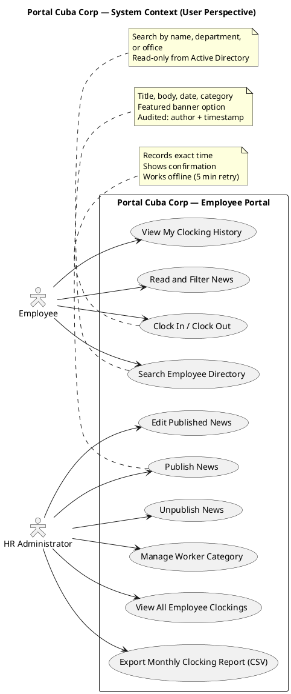

### Key Concepts

| Term | Definition |
|---|---|
| Clock In / Clock Out | Recording the start and end of your work session. The system captures the exact time automatically. |
| News item | An internal announcement published by HR. Each item has a title, body, date, and category. News items are never deleted — they can only be unpublished. |
| Category | A classification for news items: General, HR, IT, or Events. Employees can filter news by category. |
| Featured news | A news item marked as featured appears with a banner at the top of the news feed. |
| Worker category | A label assigned to an employee by HR, stored as a link between the employee's AD user ID and a category name. |
| Directory | The employee directory, searchable by name, department, or office. All data comes from Active Directory and is read-only in the portal. |
| Audit trail | A record of who performed an action and when. Every news publish, edit, unpublish, and worker category change is audited. |

## Getting Started

### Prerequisites

- A corporate computer with **Chrome** or **Edge** browser installed (CON-008)
- Access to the **corporate network** — the portal is not accessible from outside the office (CON-007)
- A **Keycloak account** with corporate credentials — your IT administrator sets this up
- For HR Administrators: the **HR role** must be assigned to your Keycloak account

### Logging In

1. Open your browser (Chrome or Edge)
2. Navigate to the portal URL provided by your IT administrator
3. You will be automatically redirected to the Keycloak login page
4. Enter your corporate username and password
5. After successful login, you are redirected back to the portal main page

> **Note:** The portal uses Keycloak for authentication. You do not create a separate account in the portal — your corporate credentials are all you need.

### The Main Page

After logging in, you see the main page with:

- **Clock In / Clock Out button** — at the top, showing the action available based on your current status
- **News feed** — sorted by date with featured news shown as a banner at the top
- **Navigation menu** — links to My Clockings, Employee Directory, and (for HR) HR management pages

## User Guide

### Clock In and Clock Out (UC-001)

The clock in/out feature records the exact time you start and end your work session. The button on the main page changes automatically based on your current status.

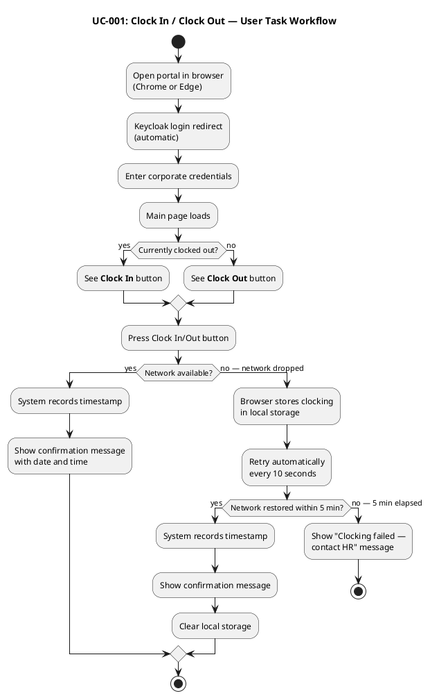

**To clock in or out:**

1. Open the portal in your browser
2. Look at the main page — you will see either a **Clock In** or **Clock Out** button depending on your current status
3. Click the button
4. A confirmation message appears showing the date and time of your clocking

> **Offline support:** If the network drops when you press the button, your clocking is saved in your browser and retried automatically every 10 seconds for up to 5 minutes. If the network comes back within that time, your clocking is recorded with the original timestamp. If the network is still down after 5 minutes, you will see a message to contact HR.

### View My Clocking History (UC-002)

1. Log in to the portal
2. Click **My Clockings** in the navigation menu
3. Your clocking history for the current month appears in a table showing date, clock in time, and clock out time

### View All Employee Clockings (UC-003 — HR Only)

1. Log in as an HR Administrator
2. Navigate to **All Clockings** in the HR management menu
3. A table appears showing all employees' clockings with employee name, date, clock in time, and clock out time
4. Use the date filter to narrow results to a specific period

### Export Monthly Clocking Report (UC-004 — HR Only)

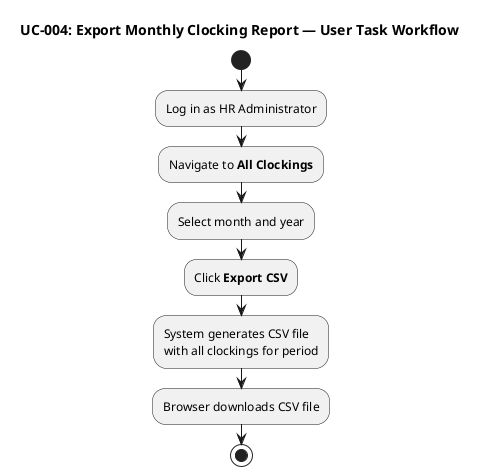

**To export a monthly clocking report:**

1. Log in as an HR Administrator
2. Navigate to **All Clockings** in the HR management menu
3. Select the month and year you want to export
4. Click **Export CSV**
5. A CSV file downloads to your computer containing all employee clockings for the selected period

> **CSV format:** The exported file contains columns for employee name, date, clock in time, and clock out time. Each row represents one clocking record.

### Publish News (UC-005 — HR Only)

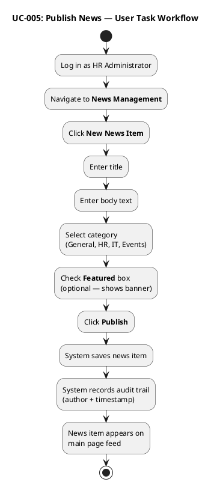

**To publish a news item:**

1. Log in as an HR Administrator
2. Navigate to **News Management** in the HR management menu
3. Click **New News Item**
4. Enter the title and body text
5. Select a category: General, HR, IT, or Events
6. Check the **Featured** box if you want the news to appear with a banner at the top of the feed (optional)
7. Click **Publish**
8. The news item appears on the main page feed immediately

> **Audit trail:** The system records your identity and the exact timestamp when you publish. This information is permanent and cannot be removed.

### Edit Published News (UC-006 — HR Only)

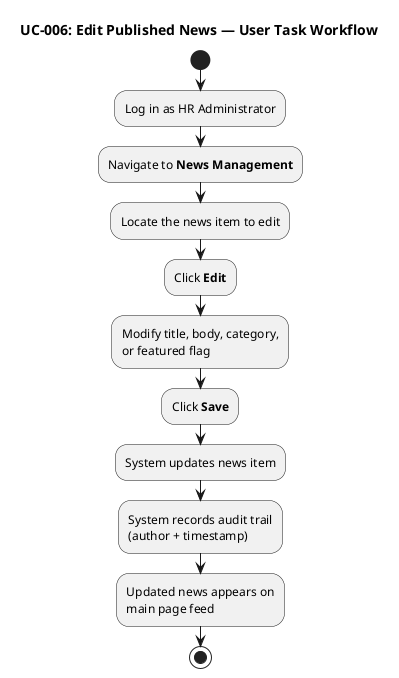

**To edit a published news item:**

1. Log in as an HR Administrator
2. Navigate to **News Management**
3. Find the news item you want to edit
4. Click **Edit**
5. Modify the title, body, category, or featured flag as needed
6. Click **Save**
7. The updated news item appears on the main page feed

> **Audit trail:** Every edit is recorded with your identity and timestamp — exactly like the original publication. A typo fix does not require republishing.

### Unpublish News (UC-007 — HR Only)

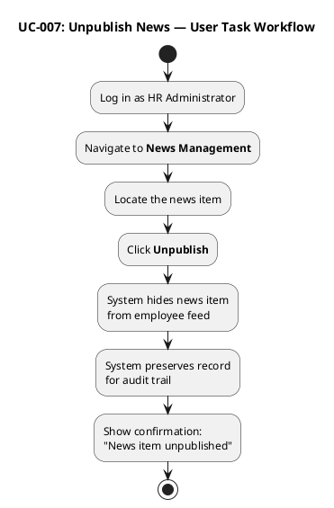

**To unpublish a news item:**

1. Log in as an HR Administrator
2. Navigate to **News Management**
3. Find the news item you want to unpublish
4. Click **Unpublish**
5. A confirmation message appears: "News item unpublished"
6. The news item is hidden from the employee feed but the record is preserved

> **News items are never deleted:** Unpublishing hides a news item while preserving the record for the audit trail. You can republish an unpublished item at any time.

### News Item Lifecycle

The following state machine shows the lifecycle of a news item:

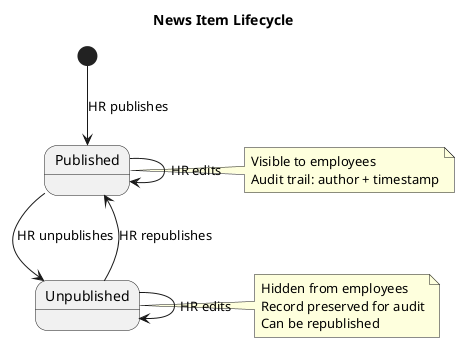

### Read and Filter News (UC-008)

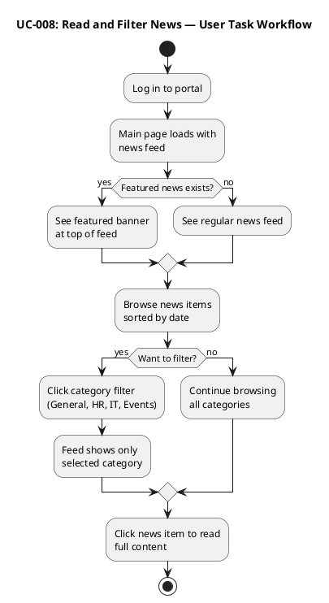

**To read and filter news:**

1. Log in to the portal — the main page shows the news feed
2. Featured news appears with a banner at the top of the feed
3. News items are sorted by date (newest first)
4. To filter by category, click one of the category filters: General, HR, IT, or Events
5. Click any news item to read the full content

> **Read-only:** Employees can read news but cannot comment, react, or publish. Only HR Administrators can publish, edit, and unpublish news.

### Search Employee Directory (UC-009)

```plantuml
@startuml
title UC-009: Search Employee Directory — User Task Workflow

skinparam activityStyle rounded

start
:Log in to portal;
:Navigate to **Employee Directory**;
:Enter search term\n(name, department, or office);
if (Results found?) then (yes)
  :View results:\nname, job title, department,\noffice, email, extension;
else (no results)
  :Show "No results" message;
  :Try different search term;
  restart
endif
stop

@enduml
```

**To search the employee directory:**

1. Log in to the portal
2. Navigate to **Employee Directory** in the navigation menu
3. Enter a search term — you can search by name, department, or office
4. Results appear showing: name, job title, department, office, email, and extension phone number
5. If some fields show "N/A", the information is not filled in Active Directory — contact the Infrastructure team to update it

> **Read-only from Active Directory:** All directory data comes from Active Directory over LDAP. The portal does not store or edit employee data. A wrong job title is fixed in Active Directory, not in the portal (CON-010).

### Manage Worker Category (UC-010 — HR Only)

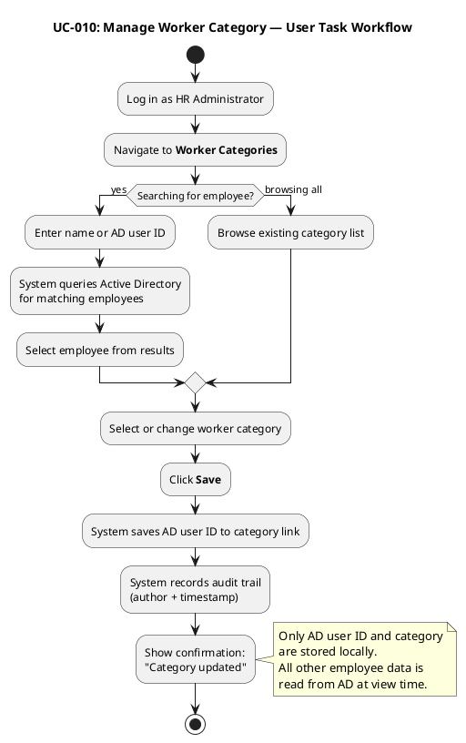

**To manage worker categories:**

1. Log in as an HR Administrator
2. Navigate to **Worker Categories**
3. Search for an employee by name or AD user ID, or browse the existing list
4. Select or change the worker category for the employee
5. Click **Save**
6. A confirmation message appears: "Category updated"

> **Audit trail:** Every category change is recorded with the HR administrator's identity and timestamp. The portal stores only the AD user ID and the category — all other employee data is read from Active Directory at view time.

## Operations Guide

### Installation Topology

The following diagram shows what is installed where:

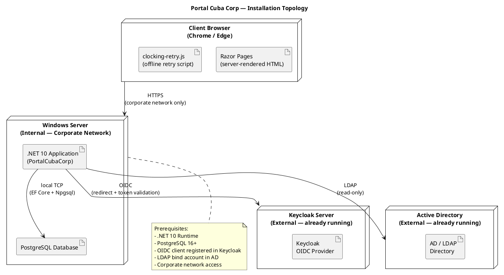

### Installation Prerequisites

The portal runs on a single internal Windows Server. The following must be in place before installation:

| Prerequisite | Details | Owner |
|---|---|---|
| Windows Server | Internal server accessible from the corporate network (CON-006) | Infrastructure team (STK-003) |
| .NET 10 Runtime | Required to run the ASP.NET 10 application (CON-001) | Infrastructure team |
| PostgreSQL 16+ | Database server running on the same Windows Server (CON-003) | Infrastructure team |
| Keycloak OIDC client | A client must be registered in the existing Keycloak instance with redirect URIs configured for the portal (CON-004) | Infrastructure team |
| LDAP bind account | An Active Directory service account with read-only LDAP access for querying employee attributes (CON-005, CON-010) | Infrastructure team |
| Corporate network access | The server must be reachable from all 3 offices via the corporate network (CON-007) | Infrastructure team |

### Installation Steps

1. **Install PostgreSQL** on the Windows Server if not already present
2. **Create a database** for the portal (e.g., `portal_cuba_corp`)
3. **Install .NET 10 Runtime** on the Windows Server
4. **Deploy the application** files to the server (e.g., `C:\inetpub\PortalCubaCorp` or a custom directory)
5. **Configure the application** by editing `appsettings.json` with the following parameters:

| Parameter | Description | Example |
|---|---|---|
| `ConnectionStrings:DefaultConnection` | PostgreSQL connection string | `Host=localhost;Database=portal_cuba_corp;Username=portal_user;Password=****` |
| `Keycloak:Authority` | Keycloak realm URL | `https://keycloak.cubacorp.local/realms/cuba-corp` |
| `Keycloak:ClientId` | OIDC client ID registered in Keycloak | `portal-cuba-corp` |
| `Keycloak:ClientSecret` | OIDC client secret | (provided by Infrastructure team) |
| `Ldap:Host` | Active Directory server hostname | `ad.cubacorp.local` |
| `Ldap:Port` | LDAP port (389 for non-SSL, 636 for SSL) | `389` |
| `Ldap:BindDn` | LDAP bind account distinguished name | `CN=portal-readonly,OU=ServiceAccounts,DC=cubacorp,DC=local` |
| `Ldap:BindPassword` | LDAP bind account password | (provided by Infrastructure team) |
| `Ldap:SearchBase` | Base DN for employee searches | `DC=cubacorp,DC=local` |

6. **Run database migrations** to create the schema: `dotnet ef database update` (or the equivalent migration command for your deployment process)
7. **Configure IIS or Kestrel** as the web server to serve the application on the designated port
8. **Verify the OIDC redirect URI** in Keycloak points to the portal's HTTPS URL
9. **Test LDAP connectivity** from the server to Active Directory
10. **Start the application** and verify the login page loads

### Post-Installation Verification

| Check | Expected Result |
|---|---|
| Navigate to portal URL in Chrome | Keycloak login page appears |
| Log in with corporate credentials | Main page loads in under 3 seconds (NFR-001) |
| Press Clock In button | Confirmation appears in under 1 second (NFR-002) |
| Search employee directory | Results appear with colleague details |
| Publish a test news item (HR) | News appears on main page |
| Export clocking report (HR) | CSV file downloads successfully |

### Configuration Reference

#### Database Tables

The portal uses four PostgreSQL tables:

| Table | Purpose | Key Columns |
|---|---|---|
| `clockings` | Employee clock in/out records | id, employee_id, timestamp, type (in/out), idempotency_key |
| `news_items` | News articles | id, title, body, category, is_featured, status (draft/published/unpublished), author_id, published_at |
| `worker_categories` | AD user ID to category mapping | ad_user_id, category |
| `audit_records` | Audit trail for all audited actions | id, entity_type, entity_id, action, author_id, timestamp |

#### Operational Parameters

| Parameter | Value | Source |
|---|---|---|
| Operating hours | Monday–Friday 7:00–19:00 | NFR-003 |
| Page load target | Under 3 seconds on corporate network | NFR-001 |
| Clock in/out response target | Under 1 second | NFR-002 |
| Offline retry window | 5 minutes (clocking only) | AC-005 |
| Offline retry interval | Every 10 seconds | AC-005 |
| Concurrent users | ~200 (single server, no scaling needed) | CON-006 |
| Browser support | Chrome and Edge (current versions) | CON-008 |

### Monitoring and Maintenance

#### Routine Checks

| Task | Frequency | What to Check |
|---|---|---|
| Verify portal is accessible | Daily (before 7:00) | Login page loads, authentication works |
| Check PostgreSQL service | Daily | Service is running, disk space is adequate |
| Review audit logs | Weekly | Audit records are being written for news and category changes |
| Verify LDAP connectivity | Weekly | Directory search returns results from all 3 offices |
| Check Keycloak client status | Monthly | OIDC client is active, tokens are validating |
| Review disk space | Monthly | PostgreSQL logs and data have adequate space |

#### Troubleshooting

| Symptom | Likely Cause | Resolution |
|---|---|---|
| Login page does not appear | Application not running or IIS/Kestrel misconfigured | Check application process, check server logs |
| Login fails | Keycloak OIDC client misconfigured or Keycloak server down | Verify Keycloak is running, check client redirect URIs |
| Directory search returns "N/A" for some fields | AD attributes not filled for some employees (R001) | Contact Infrastructure team to update AD attributes |
| Directory search returns no results | LDAP bind account issue or network problem | Verify LDAP credentials, check network path to AD server |
| Clocking fails after 5 minutes | Network outage lasting more than 5 minutes | Employee should contact HR to record clocking manually |
| News not appearing on main page | News item may be unpublished or in draft status | HR should check News Management page |
| CSV export is empty | No clocking data for the selected period | Verify date range, verify employees have clocked in |
| Page load is slow | PostgreSQL needs maintenance or server resources are low | Run VACUUM ANALYZE on database, check server CPU/memory |

#### Backup

- **PostgreSQL database:** Back up daily using `pg_dump` or PostgreSQL's built-in backup tools. The database contains clockings, news items, worker categories, and audit records — all portal data.
- **Application configuration:** Back up `appsettings.json` after any configuration change.
- **Active Directory and Keycloak:** These are external systems maintained by the Infrastructure team (STK-003). The portal does not back them up.

## FAQ and Support
### Frequently Asked Questions

**Q: I forgot to clock in this morning. What should I do?**
A: Contact your HR administrator. They can view all clockings and help record a manual entry if needed.

**Q: The network went down when I tried to clock out. Did my clocking register?**
A: If the network comes back within 5 minutes, your clocking is automatically sent with the original timestamp. If the network is still down after 5 minutes, you will see a message to contact HR.

**Q: I searched for a colleague in the directory but some fields show "N/A". Why?**
A: The directory reads data from Active Directory. If a field (like job title or extension) is not filled in AD, it shows as "N/A" in the portal. Contact the Infrastructure team to update the missing information in Active Directory — the portal cannot edit AD data.

**Q: Can I delete a news item I published by mistake?**
A: No. News items are never deleted. You can **unpublish** the item, which hides it from employees but preserves the record for the audit trail. You can also edit the content to correct any mistakes.

**Q: How do I get HR administrator access?**
A: The HR role is assigned in Keycloak by the Infrastructure team. Contact them to request the HR role for your account.

**Q: Can I access the portal from home?**
A: No. The portal is only accessible from within the corporate network (CON-007). You need to be connected to the office network.

**Q: What browsers are supported?**
A: The portal supports current versions of Chrome and Edge (CON-008).

**Q: I see a "Clocking failed — contact HR" message. What happened?**
A: The network was down for more than 5 minutes when you tried to clock in or out. The system could not send your clocking within the retry window. Contact HR to record your clocking manually.

### Getting Help

| Issue Type | Contact |
|---|---|
| Cannot log in | Infrastructure team (STK-003) — Keycloak/account issues |
| Directory shows wrong information | Infrastructure team (STK-003) — AD data must be corrected in Active Directory |
| Clocking problems | HR department (STK-001) |
| News publishing issues | HR department (STK-001) |
| Portal is down or slow | Infrastructure team (STK-003) |
| Feature requests or bugs | HR Director (STK-001) or Software Engineer (STK-002) |

### Documentation Feedback

This user guide is maintained alongside the portal. If you find an error, a missing topic, or a procedure that does not match what you see on screen, please report it.

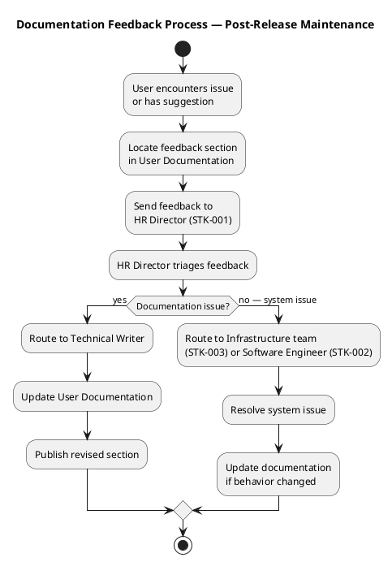

**How to report a documentation issue:**

1. Note the section name and page where you found the issue
2. Describe what the documentation says versus what the portal actually does
3. Send your feedback to the HR Director (STK-001), who routes it to the Technical Writer
4. You will be notified when the documentation is updated

> **Note:** Documentation is updated whenever the system's behavior changes. If a procedure does not match what you see on screen, the documentation may be out of date — please report it so it can be corrected.
## Traceability
| Element | Traces From | Link Type | Traces To |
|---|---|---|---|
| User Documentation | All UCs, SAD Deployment View, Design Model | Derives | End users (STK-004), HR (STK-001), Infrastructure (STK-003) |
| Clock In/Out task (UC-001) | FR-001, AC-001, AC-005, NFR-002, CR-011, C2-CRIT-1 (RESOLVED), C2-MAJ-2 (RESOLVED) | Refines | Activity diagram: UC-001 workflow |
| View My Clockings task (UC-002) | FR-002 | Refines | Procedural steps |
| View All Clockings task (UC-003) | FR-003 | Refines | Procedural steps |
| Export CSV task (UC-004) | FR-004, C2-MIN-4, CR-012 | Refines | Activity diagram: UC-004 workflow (C2 CSV format fix) |
| Publish News task (UC-005) | FR-005, NFR-004, AC-002, CR-010 | Refines | Activity diagram: UC-005 workflow |
| Edit News task (UC-006) | FR-006, NFR-004, CR-010, C2-MAJ-1 (RESOLVED), C4-1 (RESOLVED) | Refines | Procedural steps |
| Unpublish News task (UC-007) | FR-007, CON-013, NFR-004 | Refines | Activity diagram: UC-007 workflow, State machine: News lifecycle |
| Read and Filter News task (UC-008) | FR-008, CR-010 | Refines | Activity diagram: UC-008 workflow |
| Search Directory task (UC-009) | FR-009, CON-005, CON-012, AC-003, R001, CR-015, DM-F1 (RESOLVED) | Refines | Activity diagram: UC-009 workflow |
| Manage Worker Category task (UC-010) | FR-010, CON-009, NFR-004 | Refines | Activity diagram: UC-010 workflow |
| Installation Guide | SAD Deployment View, CON-001..CON-008 | Derives | Infrastructure team (STK-003) |
| Configuration Reference | SAD Logical View, SAD Implementation View | Derives | Operations procedures |
| Troubleshooting | R001, AC-005, NFR-001..NFR-003 | Derives | Support procedures |
| FAQ | AC-001..AC-005, CON-007, CON-008, CON-013 | Derives | End-user support |
| Documentation Feedback | Transition state machine S4 requirement | Derives | Post-release maintenance process |
| Terminology (Styleguide) | All FRs, all UCs | Refines | All documentation sections |
| C2-MIN-4 CSV format fix | C2 Review Record, FR-004, CR-012 | Derives | UC-004 CSV export documentation |
| CR-010 IsFeatured | C1 Review Record MAJOR-1, FR-008 | Derives | UC-005 Publish News (featured checkbox), UC-008 Read and Filter News (featured banner) |
| CR-011 Idempotency | AC-005, C1 Review Record MINOR-3 | Derives | UC-001 Clock In/Out (offline retry documentation) |
| CR-015 Directory office filter | C1 Review Record MINOR-1, FR-009 | Derives | UC-009 Search Directory (office filter step) |
| C2-CRIT-1 Clocking API 404 (RESOLVED) | C2 Review Record, PR #28 | Derives | UC-001 Clock In/Out — API endpoint corrected, procedure verified |
| C2-MAJ-1 News edit form binding (RESOLVED) | C2 Review Record, PR #28 | Derives | UC-006 Edit News — form binding corrected, procedure verified |
| C2-MAJ-2 Antiforgery token (RESOLVED) | C2 Review Record, PR #28 | Derives | UC-001 Clock In/Out — POST now accepted, procedure verified |
| DM-F1 INT-003 office parameter (RESOLVED) | Design Model, PR #28 | Derives | UC-009 Search Directory — office filter parameter aligned |
| C4-1 isFeatured in Edit (RESOLVED) | C4 Review Record, PR #32, CR-010 | Derives | UC-006 Edit News — featured checkbox now functional in edit mode |
| C4-2 Transaction wrapping (RESOLVED) | C4 Review Record, PR #32, NFR-004 | Derives | Operations Guide — audit trail integrity ensured via transaction wrapping |
| C4-3 ExecuteInTransactionAsync (CONFIRMED) | C4 Review Record, PR #32, INT-007 | Derives | Operations Guide — persistence gateway transaction pattern confirmed |
| Transition Final Quality Pass | SAD Deployment View, Design Model C4 baseline, Review Record (0 findings on User Documentation) | Refines | Publication-Ready status |
