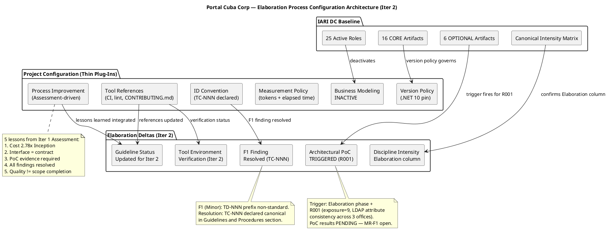
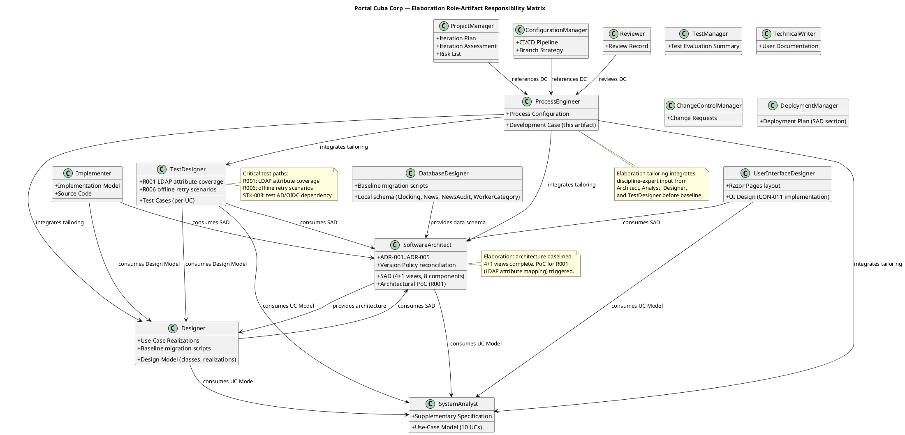
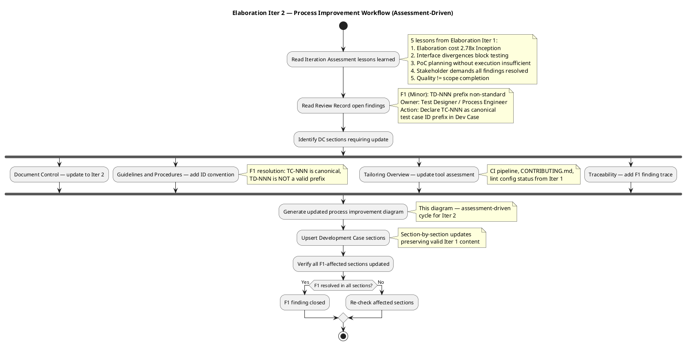

## Document Control
| Field | Value |
|---|---|
| Phase | Elaboration |
| Status | Draft |
| Milestone Target | End-of-Elaboration (LCA) |
| Iteration | 2 (Cycle 1) |
| Date | 2026-08-28 |
| Prior Phase | Inception (LCO achieved, stakeholder sanction GRANTED) |
| Evolution | Elaboration Iter 1 DC evolved with Iter 2 process improvements and F1 finding resolution |
| Findings Addressed | F1 (Minor) — TD-NNN prefix non-standard; resolved by declaring TC-NNN as canonical test case ID prefix |
## Tailoring Overview
This Development Case specifies the project-specific **deltas** over the IARI DC baseline for the Portal Cuba Corp Employee Portal project. The baseline defines 25 active roles, 16 CORE artifacts, 6 OPTIONAL artifacts, and a canonical discipline-intensity matrix. This document declares ONLY the project-specific deviations — it does not restate the baseline.

### Organization Assessment (Updated for Elaboration Iter 2)

| Factor | Inception Finding | Elaboration Iter 1 Finding | Iter 2 Update |
|---|---|---|---|
| Agent role count | 25 roles per IARI baseline — all active | No change | No change — 25 roles confirmed |
| Project type | Internal employee portal (intranet), 200 users, 3 offices | No change | No change |
| Complexity | Moderate — CRUD-centric with AD/LDAP integration and audit trail | Confirmed by SAD: 8 components, 5 ADRs, 3 sequence diagrams | SAD DRAFT not yet BASELINED — M1/M2 interface mismatches block baselining |
| Tech stack | .NET 10 REST API, Razor Pages, PostgreSQL, Keycloak OIDC, AD LDAP, internal Windows Server | Confirmed by SAD: Novell.Directory.Ldap (ADR-003), Npgsql (ADR-002), Keycloak OIDC (ADR-005) | No change — stack confirmed |
| Process maturity | First iteration — baseline IARI process applies | Inception completed (LCO, 0 open findings). Process baseline validated. | Elaboration Iter 1 revealed process gaps: interface conformance enforcement, evidence-based risk retirement, ID convention enforcement. Adjustments recorded in Guidelines and Procedures. |
| Key risk | R001 (AD LDAP attribute inconsistency, exposure=9) | R001 remains top risk. PoC triggered but not yet executed. | **Unchanged — R001 PoC results still pending.** MR-F1 (Major) flags insufficient evidence for LCA closure. |
| Cost profile | Inception: 22 min, 4.38M tokens, 11 runs | Elaboration Iter 1: 2.78× Inception tokens — cost driver is artifact surface reasoning | Budget boxes for remaining iterations must use Elaboration actuals, not Inception rates. |

### Tool Assessment (Updated for Elaboration Iter 2)

| Tool | Inception Status | Elaboration Iter 1 Status | Iter 2 Status | Notes |
|---|---|---|---|---|
| Git SCM | Available | Available | **Verified** | Repository active, PR #4 reviewed, artifacts persisting |
| GitHub Actions CI | Referenced | In progress | **Pending** | `.github/workflows/` — ConfigurationManager has not yet confirmed pipeline working |
| .NET 10 SDK | Declared (CON-001) | Declared (CON-001) | **Declared** | Framework pinned in version policy |
| PostgreSQL | Declared (CON-003) | Declared (CON-003) | **Declared** | SAD baselined schema: Clocking, News, NewsAudit, WorkerCategory |
| Keycloak | External (CON-004) | External (CON-004) | **External** | OIDC client only — STK-003 must provide registration before login testing |
| Active Directory | External (CON-005, CON-010) | External (CON-005, CON-010) | **External** | STK-003 must provide test AD for PoC (R001) — still pending |
| Razor Pages | Declared (CON-002) | Declared (CON-002) | **Declared** | SAD confirms server-rendered, no SPA |
| Chrome / Edge | Declared (CON-008) | Declared (CON-008) | **Declared** | Cross-browser testing target |
| CONTRIBUTING.md | To be created | In progress | **Pending** | Not yet created — discipline experts must author sections |
| Lint config | To be created | In progress | **Pending** | `.editorconfig` / `dotnet-format` — not yet created |
| UI design source | Provided (CON-011) | Provided (CON-011) | **Provided** | `docs/inputs/employee-portal-design.html` — mandatory, authoritative |
| PR #4 (E1 prototype) | N/A | Reviewed — changes requested | **Open** | M1 (IAuditLogger mismatch) + M2 (IPersistence transaction API) — Implementer must fix |

## Disciplines and Intensity

Discipline intensity per phase is confirmed **per canonical matrix** — no deviations requested.

| Discipline | Active? | Elaboration | Notes |
|---|---|---|---|
| Business Modeling | **INACTIVE** | — | See §4 verdict below — confirmed for Elaboration |
| Requirements | Yes | High | Per canonical matrix — UC Model detailed to Elaboration depth |
| Analysis & Design | Yes | **Critical** | Per canonical matrix — SAD baselined, Design Model evolving |
| Implementation | Yes | Medium | Per canonical matrix — implementation begins against baselined architecture |
| Test | Yes | Medium | Per canonical matrix — test cases designed per UC, R001/R006 critical paths |
| Deployment | Yes | Low | Per canonical matrix — single Windows Server, deployment section in SAD |
| Configuration & Change Management | Yes | Medium | Per canonical matrix — CI pipeline, branch strategy active |
| Project Management | Yes | Medium | Per canonical matrix — iteration plan, risk monitoring |
| Environment | Yes | Medium | Per canonical matrix — tool verification, process support |

### Business Modeling — INACTIVE (DC §4 Verdict, Confirmed for Elaboration)

**Verdict:** `isBusinessProcessLed = false`

**Rationale:** Elaboration re-evaluation confirms the Inception verdict. The stakeholder declared 10 system-level functional requirements (FR-001 through FR-010) describing specific portal features — clock in/out, news management, employee directory, worker category management. These are system feature specifications, not business process models. The SAD (Elaboration baseline) and Use-Case Model (Elaboration detailed) confirm that the business processes (clocking, news publishing, directory lookup) are already defined and stable — the portal digitizes them, it does not redesign them. No business process reengineering, workflow optimization, or organizational change modeling is in scope. Business Modeling remains INACTIVE.

**Criteria triggered:** None — all DC §4 criteria evaluated, none triggered.

## Artifacts and Templates

### CORE Artifacts (16) — All Produced

All 16 CORE artifacts from the IARI baseline are produced. No CORE artifacts are omitted. Primary ownership is fixed per the baseline allowlist — no reassignments.

| CORE Artifact | Primary Owner | Elaboration Status | Notes |
|---|---|---|---|
| Vision | BusinessProcessAnalyst | Baselined (Inception) | No changes in Elaboration |
| Use-Case Model | SystemAnalyst | **Elaboration Draft** | 10 UCs detailed with activity diagrams, all scenarios elaborated |
| Supplementary Specification | SystemAnalyst | **Elaboration Draft** | NFRs + cross-cutting mechanisms (OIDC auth, LDAP read, audit trail) |
| Software Architecture Document | SoftwareArchitect | **Elaboration Draft** | 4+1 views baselined, 8 components, 5 ADRs, 3 sequence diagrams |
| Design Model | Designer | **Elaboration Draft** | Class diagrams, use-case realizations, baseline migration scripts |
| Implementation Model | Implementer | Pending | Reverse-engineered from source in Construction |
| Test Case | TestDesigner | Pending | Per-UC test coverage; R001 and R006 are critical test paths |
| Test Evaluation Summary | TestManager | Inception baseline | Per-iteration test results |
| User Documentation | TechnicalWriter | Pending | End-user guide for portal features |
| Release Notes | TechnicalWriter | Pending | Per-release change summary |
| Iteration Plan | ProjectManager | Inception baseline | Cost-boxed, not time-boxed |
| Iteration Assessment | ProjectManager | Inception final | Per-iteration retrospective |
| Risk List | ProjectManager | Inception baseline | R001–R006, R001 top risk (exposure=9) |
| Review Record | Reviewer | Inception final | All findings resolved, LCO achieved |
| Development Case | ProcessEngineer | **This artifact** | Elaboration delta overrides |
| Change Request | ChangeControlManager | Construction onwards | SCM issues carry live state |

### OPTIONAL Artifacts (6) — Trigger Evaluation (Elaboration Re-evaluation)

All 6 OPTIONAL artifacts re-evaluated against §5.2 trigger conditions for Elaboration.

| Optional Artifact | Trigger Condition | Inception Verdict | Elaboration Verdict | Justification |
|---|---|---|---|---|
| Glossary | Domain uses specialist vocabulary | NOT TRIGGERED | **NOT TRIGGERED** | Standard HR/IT terminology — no regulated, legal, medical, or financial jargon requiring stakeholder-validated definitions |
| Architectural Proof-of-Concept | Elaboration phase + at least one technical risk requiring empirical validation | NOT TRIGGERED (Inception) | **TRIGGERED** | R001 (AD LDAP attribute consistency, exposure=9) is a technical risk requiring empirical validation. The SAD baselined LDAP integration (COMP-005, ADR-003) but actual attribute consistency across 3 offices must be validated against real AD before Construction. PoC scope: query AD from each office's LDAP endpoint, verify job title, department, office, email, and extension attributes are populated and consistent. |
| Data Model | Data-centric OR >10 entities OR data-migration in scope | NOT TRIGGERED | **NOT TRIGGERED** | ~4 local entities (Clocking, News, NewsAudit, WorkerCategory); not data-centric; baseline migration scripts in Design Model; employee data read from AD at read time (CON-009) |
| Deployment Model | Distributed / multi-node topology OR multi-environment non-trivial | NOT TRIGGERED | **NOT TRIGGERED** | Single internal Windows Server (CON-006); deployment is a section in the SAD (Deployment View baselined) |
| User-Interface Prototype | UX-critical OR UI complexity requiring stakeholder validation | NOT TRIGGERED | **NOT TRIGGERED** | CON-011 provides a mandatory, authoritative custom design (`docs/inputs/employee-portal-design.html`) — no prototype iteration needed |
| Test Plan | Formal delivery / regulatory audit / contractual test reporting | NOT TRIGGERED | **NOT TRIGGERED** | Internal intranet portal — no regulatory or contractual test reporting requirement; per-iteration testing scope defined in Iteration Plan |

**Recorded via:** `record_optional_artifact_triggers(["Architectural Proof-of-Concept"])` — Architectural PoC is producible this iteration.

## Optional Artifact Triggers

### Architectural Proof-of-Concept — TRIGGERED

**Trigger condition:** Elaboration phase + at least one technical risk requiring empirical validation (per Risk List).

**Risk driving the trigger:** R001 (P=3, I=3, exposure=9) — Active Directory integration: the LDAP attributes the directory reads (job title, extension) may not be filled consistently across the 3 offices. If not tested early the directory shows gaps.

**PoC scope:**
1. Connect to AD via LDAP from the .NET 10 application using Novell.Directory.Ldap (ADR-003)
2. Query employee entries from each of the 3 offices' LDAP endpoints
3. Verify that corporate attributes (job title, department, office, email, extension) are populated and consistent
4. Document attribute mapping gaps and escalate to STK-003 (Infrastructure team) for remediation
5. Validate that the portal's read-only LDAP query approach (CON-005, CON-009) works against real AD

**Dependency:** STK-003 must provide a test AD instance and OIDC client registration before PoC execution. This is flagged in the Iteration Assessment as an assumption pending confirmation.

**Owner:** SoftwareArchitect (designs PoC), TestDesigner (defines validation criteria), Tester (executes PoC)

**Exit criteria:** PoC report confirms LDAP attribute mapping works against real AD, OR gaps are documented with remediation actions for STK-003.

## Roles and Ownership

All 25 roles from the IARI baseline are active. No roles are merged, omitted, or reassigned. Primary ownership of all 16 CORE artifacts is fixed per the baseline allowlist.

### Project-Specific Role Notes (Updated for Elaboration)

| Role | Project-Specific Context (Elaboration) |
|---|---|
| SoftwareArchitect | SAD baselined with 4+1 views, 8 components (COMP-001..COMP-008), 5 ADRs. Must design and oversee Architectural PoC for R001 (LDAP attribute validation). Version policy reconciled — .NET 10 pinned. |
| SystemAnalyst | Use-Case Model detailed to Elaboration depth — all 10 UCs with activity diagrams, scenarios, and flow specifications. Supplementary Specification includes cross-cutting mechanisms (OIDC auth, LDAP read, audit trail). |
| Designer | Design Model evolving — class diagrams, use-case realizations, baseline migration scripts committed. Consumes SAD architecture and UC Model. |
| UserInterfaceDesigner | Must implement mandatory custom design at `docs/inputs/employee-portal-design.html` (CON-011) — visual layer is authoritative. Razor Pages layout (CON-002). |
| Implementer | Razor Pages server-rendered UI (CON-002); PostgreSQL data access via Npgsql (ADR-002); LDAP queries via Novell.Directory.Ldap (ADR-003); OIDC token validation via Keycloak (ADR-005). Implementation begins against baselined architecture. |
| DatabaseDesigner | Minimal local schema: Clocking, News, NewsAudit, WorkerCategory (AD user id → category only, CON-009). Baseline migration scripts with forward+rollback committed to Design Model. |
| TestDesigner | Cross-browser testing (Chrome + Edge, CON-008); LDAP attribute consistency testing across 3 offices (R001); offline retry scenario testing (R006, AC-005). Critical test paths depend on STK-003 providing test AD and OIDC client. |
| DeploymentManager | Internal Windows Server deployment (CON-006); no cloud; corporate network only (CON-007). Deployment View baselined in SAD. |
| ConfigurationManager | CI pipeline (`.github/workflows/`), branch strategy, build automation — active in Elaboration. |
| ProcessEngineer | Development Case evolved for Elaboration. Tool environment verification in progress. Process support active during iteration. |

## Guidelines and Procedures
### Project-Specific Guidelines (Referenced, Not Authored Here)

Guideline content is authored by discipline experts in `CONTRIBUTING.md` and lint configuration files. The Development Case references these — it does not duplicate them.

| Guideline | Owner | File Reference | Elaboration Status |
|---|---|---|---|
| Coding standards | SoftwareArchitect / Implementer | `CONTRIBUTING.md` | **In progress — Elaboration Iter 1** |
| .NET / C# lint config | Implementer | `.editorconfig` or `dotnet-format` config | **In progress — Elaboration Iter 1** |
| CI/CD pipeline config | ConfigurationManager | `.github/workflows/` | **In progress — Elaboration Iter 1** |
| UI design implementation | UserInterfaceDesigner | `docs/inputs/employee-portal-design.html` (CON-011) | Provided by stakeholder — authoritative |
| Test conventions | TestDesigner / TestManager | `CONTRIBUTING.md` (test section) | **In progress — Elaboration Iter 1** |

### ID Convention Declaration (F1 Finding Resolution)

**Finding F1 (Minor, Reviewer lens):** The Test Case artifact used `TD-NNN` as a test case ID prefix, which is not in the IARI baseline ID convention table. The Inception Review Record already resolved this (P3: replaced TD-NNN with TC-NNN), but the Elaboration Test Case reintroduced TD-NNN.

**Declaration:** The canonical test case ID prefix for this project is **`TC-NNN`**, per the IARI baseline ID convention table (Test Case → `TC-NNN` → Example: `TC-001` → Authority: TestDesigner). The prefix `TD-NNN` is **NOT a valid ID prefix** in this project. All test case artifacts MUST use `TC-NNN` exclusively. This declaration is binding on the TestDesigner role.

| Element Type | Valid ID Format | Invalid Variants | Authority |
|---|---|---|---|
| Test Case | `TC-NNN` | ~~TD-NNN~~ | TestDesigner |

### Process Improvement Notes (Elaboration Iter 2 — Assessment-Driven)

The following process adjustments are derived from the Iteration Assessment lessons learned (Elaboration Iter 1) and are recorded here as binding tailoring decisions:

| # | Lesson Learned | Process Adjustment | Affected Roles |
|---|---|---|---|
| 1 | Elaboration cost is 2.78× Inception — cost driver is reasoning over accumulated artifact surface, not new artifact volume | Budget boxes for remaining Elaboration iterations must be sized from Elaboration measured actuals, not Inception rates. The Iteration Plan must reference Elaboration token consumption as the baseline. | ProjectManager, all roles |
| 2 | Interface divergences between Design Model and implementation block both testing and architecture baselining | The Design Model is the contract. Implementation MUST conform to the Design Model interfaces — not the reverse. Any implementation deviation from a Design Model interface requires a CR to update the Design Model first, then the implementation. The Code Reviewer must verify interface conformance as a mandatory review checkpoint. | Implementer, Designer, CodeReviewer |
| 3 | PoC planning without execution is insufficient for risk retirement | Risk status `MITIGATING` without PoC results is a claim, not evidence. Risks may only be marked `RESOLVED` when empirical PoC evidence is documented. The Iteration Assessment must verify PoC execution status. | SoftwareArchitect, ProjectManager |
| 4 | Stakeholder demands all findings resolved — even minor | All open findings (Major AND Minor) must be resolved before the stakeholder sanctions the milestone. Minor findings cannot be deferred. This is a project constraint (STK-001 directive), not a preference. | All roles |
| 5 | Quality (9.9) and scope completion are independent dimensions | High artifact quality does not compensate for incomplete risk retirement. The LCA gate evaluates whether the architecture is baselined and risks are retired — not whether artifacts are well-written. Process must track both dimensions separately. | ProjectManager, Reviewer |

### Measurement Policy

This project tracks the two IARI baseline metrics — **tokens consumed** and **elapsed time** (split into agent time and human queue time) — and applies them as follows:

| Metric | Decision It Enables | Who Reads It |
|---|---|---|
| Tokens consumed per role per iteration | Identify roles exceeding budget allocation; adjust process intensity for over-budget disciplines | ProjectManager (Iteration Assessment), ProcessEngineer (DC refinement) |
| Elapsed time: agent vs. human queue | Identify human-gate bottlenecks (e.g., stakeholder review waiting); bound human gates at 14-day ceiling per IARI rule | ProjectManager (Risk List, Iteration Plan), ProcessEngineer (process improvement) |

**Inception actuals (measured):** 22 min agent time, 0s stakeholder queue, 4,382,313 tokens, 11 agent runs, 10 artifacts across 2 iterations. These figures inform Elaboration budget-boxing — no per-iteration velocity is quoted (IARI rule: iterations inside a phase are not recorded separately).

**Elaboration Iter 1 actuals (measured):** Elaboration Iter 1 consumed 2.78× the tokens of the entire Inception phase. The cost driver is reasoning over the accumulated artifact surface (12 artifacts, each re-read and cross-referenced), not the volume of new artifacts. Future budget boxes must be sized from Elaboration measured actuals, not Inception rates.

### Version Policy

| Ecosystem | Package | Pinned Version | LTS Only | Rationale |
|---|---|---|---|---|
| framework | .NET | 10 | No | CON-001 declares .NET 10 as the backend framework — architecturally consequential |

No library pins were declared by the stakeholder. The SAD references Novell.Directory.Ldap (ADR-003) and Npgsql (ADR-002) as architectural choices — these are the SoftwareArchitect's decisions, not stakeholder-declared version pins. If the SoftwareArchitect identifies consequential library versions requiring enterprise pinning, they will be escalated via `REQUIRES_USER_INPUT` and recorded here.

### Process Configuration References

| Configuration | File | Owner | Elaboration Status |
|---|---|---|---|
| Version control | Git repository (SCM) | ConfigurationManager | Active — IARI branching strategy committed |
| CI pipeline | `.github/workflows/` | ConfigurationManager | **In progress — Elaboration Iter 1** |
| Contribution guidelines | `CONTRIBUTING.md` | Discipline experts (collaborative) | **In progress — Elaboration Iter 1** |
| Lint configuration | `.editorconfig` / `dotnet-format` | Implementer | **In progress — Elaboration Iter 1** |
| UI design source | `docs/inputs/employee-portal-design.html` | UserInterfaceDesigner | CON-011 — mandatory, authoritative |

### Tool Environment Verification (Elaboration Iter 2)

| Item | Status | Verification Notes |
|---|---|---|
| Git SCM | **Verified** | Repository active, artifacts persisting correctly, PR #4 reviewed |
| .NET 10 SDK | **Declared** | CON-001 — framework pinned; SAD confirms |
| PostgreSQL | **Declared** | CON-003 — SAD baselined schema |
| Keycloak OIDC | **External dependency** | CON-004 — STK-003 must provide OIDC client registration before login testing |
| Active Directory LDAP | **External dependency** | CON-005 — STK-003 must provide test AD for PoC (R001) |
| CI pipeline | **Pending** | ConfigurationManager to configure `.github/workflows/` — not yet verified working |
| CONTRIBUTING.md | **Pending** | Discipline experts to author — not yet created |
| Lint config | **Pending** | Implementer to configure `.editorconfig` — not yet created |
| Cross-browser (Chrome/Edge) | **Declared** | CON-008 — testing target for TestDesigner |
| PR #4 (E1 prototype) | **Reviewed — changes requested** | Code Reviewer found M1 (IAuditLogger mismatch) and M2 (IPersistence transaction API mismatch) — Implementer must fix in Iter 2 |

**Gaps flagged for discipline experts:**
- CONTRIBUTING.md not yet created — each discipline expert must author their section. The DC references it; it does not author content.
- CI pipeline not yet configured — ConfigurationManager must configure build, test, and lint automation.
- STK-003 dependency: test AD and OIDC client registration are prerequisites for PoC execution and login testing. Flagged as assumption in Iteration Assessment.
- PR #4 interface mismatches (M1, M2) must be resolved by Implementer before architecture can be baselined.

## Traceability
| Element | Traces From | Link Type | Traces To |
|---|---|---|---|
| Development Case (this artifact) | IARI DC Baseline | Refines | All project artifacts (governance) |
| Business Modeling INACTIVE | DC §4 verdict (confirmed Elaboration) | Derives | (no Business Modeling artifacts produced) |
| Glossary NOT TRIGGERED | DC §5.2 trigger condition | Derives | (no Glossary artifact produced) |
| Architectural PoC TRIGGERED | DC §5.2 trigger condition + R001 (exposure=9) | Derives | Software Architecture Document (COMP-005, ADR-003), Risk List (R001) |
| Data Model NOT TRIGGERED | DC §5.2 trigger condition | Derives | (data lives inline in Design Model) |
| Deployment Model NOT TRIGGERED | DC §5.2 trigger condition | Derives | (deployment is a section in SAD — Deployment View baselined) |
| UI Prototype NOT TRIGGERED | DC §5.2 trigger condition | Derives | CON-011 provides authoritative design |
| Test Plan NOT TRIGGERED | DC §5.2 trigger condition | Derives | (Iteration Plan defines testing scope) |
| Version Policy: .NET 10 | CON-001 | Derives | Software Architecture Document (ADR-001) |
| R001 (AD LDAP risk) | Work Order R001 | Refines | Architectural PoC (TRIGGERED), SAD (COMP-005, ADR-003) |
| R002 (clocking adoption) | Work Order R002 | Refines | User Documentation, Iteration Plan |
| R006 (offline retry risk) | AC-005 | Refines | SAD (Process View), TestDesigner (critical test path) |
| SAD baseline (4+1 views) | CON-001..CON-006, ADR-001..ADR-005 | Derives | Design Model, Implementation Model, TestDesigner |
| UC Model (10 UCs detailed) | FR-001..FR-010 | Refines | SAD (Use-Case View), Design Model, TestDesigner |
| STK-003 dependency (test AD/OIDC) | STK-003, R001 | DependsOn | Architectural PoC execution, login testing |
| Inception actuals (measured) | Closed Inception phase | Derives | Elaboration budget-boxing (Iteration Plan) |
| F1 finding (TD-NNN prefix) | Review Record §Findings (F1, Minor) | Derives | ID Convention Declaration in Guidelines and Procedures (TC-NNN canonical) |
| Process Improvement Notes (5 lessons) | Iteration Assessment §Lessons Learned | Derives | Guidelines and Procedures §Process Improvement Notes |
| Elaboration Iter 1 cost (2.78× Inception) | Iteration Assessment (measured) | Derives | Measurement Policy (budget-boxing guidance) |
| Interface conformance rule | Iteration Assessment lesson 2 | Derives | Guidelines and Procedures §Process Improvement Notes (#2) |
| Evidence-based risk retirement | Iteration Assessment lesson 3 | Derives | Guidelines and Procedures §Process Improvement Notes (#3) |
| All-findings-resolved constraint | STK-001 directive (LCA consultation) | Derives | Guidelines and Procedures §Process Improvement Notes (#4) |
