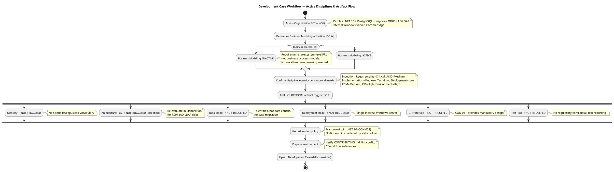

## Document Control

| Field | Value |
|---|---|
| Phase | Inception |
| Status | Draft |
| Milestone Target | End-of-Inception |
| Iteration | 1 (Cycle 1) |
| Date | 2026-08-28 |

## Tailoring Overview

This Development Case specifies the project-specific **deltas** over the IARI DC baseline for the Portal Cuba Corp Employee Portal project. The baseline defines 25 active roles, 16 CORE artifacts, 6 OPTIONAL artifacts, and a canonical discipline-intensity matrix. This document declares ONLY the project-specific deviations — it does not restate the baseline.

### Organization Assessment

| Factor | Finding |
|---|---|
| Agent role count | 25 roles per IARI baseline — all active |
| Project type | Internal employee portal (intranet), 200 users, 3 offices |
| Complexity | Moderate — CRUD-centric with AD/LDAP integration and audit trail |
| Tech stack | .NET 10 REST API, Razor Pages, PostgreSQL, Keycloak OIDC, AD LDAP, internal Windows Server |
| Process maturity | First iteration — baseline IARI process applies |
| Key risk | R001 (AD LDAP attribute inconsistency across 3 offices, exposure=9) |

### Tool Assessment

| Tool | Status | Notes |
|---|---|---|
| Git SCM | Available | Repository active, artifacts persisted via tooling |
| GitHub Actions CI | Referenced | `.github/workflows` — to be configured by ConfigurationManager |
| .NET 10 SDK | Declared (CON-001) | Framework pinned in version policy |
| PostgreSQL | Declared (CON-003) | Database for clocking, news, worker-category tables |
| Keycloak | External (CON-004) | OIDC client only — not deployed/provisioned by this project |
| Active Directory | External (CON-005, CON-010) | Read-only LDAP queries — not administered by this project |
| Razor Pages | Declared (CON-002) | Server-rendered, no SPA tooling |
| Chrome / Edge | Declared (CON-008) | Cross-browser compatibility target |
| CONTRIBUTING.md | To be created | Referenced from this DC; discipline experts author content |
| Lint config | To be created | Referenced from this DC; discipline experts configure |

```plantuml
@startuml
title Portal Cuba Corp — Role & Tool Inventory (S1 Assessment)

class ProcessEngineer {
  + Development Case
  + Process Configuration
}

class SoftwareArchitect {
  + SAD
  + Architecture Decisions
}

class SystemAnalyst {
  + Use-Case Model
  + Supplementary Spec
}

class Designer {
  + Design Model
  + Use-Case Realizations
}

class Implementer {
  + Source Code
  + Implementation Model
}

class TestDesigner {
  + Test Cases
}

class ProjectManager {
  + Iteration Plan
  + Risk List
}

class ConfigurationManager {
  + CM Plan
  + Build Config
}

class ChangeControlManager {
  + Change Requests
}

class TechnicalWriter {
  + User Documentation
}

class UserInterfaceDesigner {
  + UI Design
  + UI Prototype
}

class DatabaseDesigner {
  + Data Model
}

class DeploymentManager {
  + Deployment Plan
}

class Reviewer {
  + Review Record
}

package "Tooling" {
  class "Git SCM" as Git
  class "GitHub Actions CI" as CI
  class ".NET 10 SDK" as DotNet
  class "PostgreSQL" as PG
  class "Keycloak (OIDC)" as KC
  class "Active Directory (LDAP)" as AD
  class "Razor Pages" as RP
  class "Chrome / Edge" as Browser
}

ProcessEngineer --> Git : manages process artifacts
SoftwareArchitect --> DotNet : anchors framework
SoftwareArchitect --> PG : database design
SoftwareArchitect --> KC : OIDC client config
SoftwareArchitect --> AD : LDAP integration design
Implementer --> DotNet : builds & compiles
Implementer --> RP : server-rendered UI
Implementer --> PG : data access layer
Implementer --> AD : LDAP queries
Implementer --> KC : token validation
TestDesigner --> CI : automated test execution
ConfigurationManager --> Git : version control
ConfigurationManager --> CI : pipeline config
DeploymentManager --> DotNet : deployment packaging
UserInterfaceDesigner --> Browser : cross-browser compat
UserInterfaceDesigner --> RP : Razor Pages UI

note right of ProcessEngineer
  25 roles active per IARI baseline.
  All 9 disciplines active except
  Business Modeling (pending §4 verdict).
  Environment: one-time at project start.
end note

note right of AD
  R001: LDAP attributes may be
  inconsistent across 3 offices.
  Highest-risk integration point.
end note

@enduml
```

## Disciplines and Intensity

Discipline intensity per phase is confirmed **per canonical matrix** — no deviations requested.

| Discipline | Active? | Inception | Notes |
|---|---|---|---|
| Business Modeling | **INACTIVE** | — | See §4 verdict below |
| Requirements | Yes | Critical | Per canonical matrix |
| Analysis & Design | Yes | Medium | Per canonical matrix |
| Implementation | Yes | Medium | Per canonical matrix |
| Test | Yes | Low | Per canonical matrix |
| Deployment | Yes | Low | Per canonical matrix |
| Configuration & Change Management | Yes | Medium | Per canonical matrix |
| Project Management | Yes | High | Per canonical matrix |
| Environment | Yes | High | One-time at project start |

### Business Modeling — INACTIVE (DC §4 Verdict)

**Verdict:** `isBusinessProcessLed = false`

**Rationale:** The stakeholder declared 10 system-level functional requirements (FR-001 through FR-010) describing specific portal features — clock in/out, news management, employee directory, worker category management. These are system feature specifications, not business process models. There is no business process reengineering, workflow optimization, or organizational change modeling in scope. The project replaces Excel sheets and mass emails with a web application, but the business processes themselves (clocking, news publishing, directory lookup) are already defined and stable — the portal digitizes them, it does not redesign them. No business use-case modeling, business object model, or business rules discovery is needed beyond what the stakeholder already declared.

**Criteria triggered:** None — all DC §4 criteria evaluated, none triggered.

## Artifacts and Templates

### CORE Artifacts (16) — All Produced

All 16 CORE artifacts from the IARI baseline are produced. No CORE artifacts are omitted. Primary ownership is fixed per the baseline allowlist — no reassignments.

| CORE Artifact | Primary Owner | Notes |
|---|---|---|
| Vision | BusinessProcessAnalyst | Declared in Work Order |
| Use-Case Model | SystemAnalyst | 10 FRs → 10 UCs (1:1 trace) |
| Supplementary Specification | SystemAnalyst | 4 NFRs + cross-cutting mechanisms |
| Software Architecture Document | SoftwareArchitect | .NET 10, Razor Pages, PostgreSQL, OIDC, LDAP |
| Design Model | Designer | Class diagrams, use-case realizations |
| Implementation Model | Implementer | Reverse-engineered from source |
| Test Case | TestDesigner | Per-UC test coverage |
| Test Evaluation Summary | TestManager | Per-iteration test results |
| User Documentation | TechnicalWriter | End-user guide for portal features |
| Release Notes | TechnicalWriter | Per-release change summary |
| Iteration Plan | ProjectManager | Cost-boxed, not time-boxed |
| Iteration Assessment | ProjectManager | Per-iteration retrospective |
| Risk List | ProjectManager | R001, R002 + emerging risks |
| Review Record | Reviewer | Findings per artifact per iteration |
| Development Case | ProcessEngineer | This document (delta overrides) |
| Change Request | ChangeControlManager | Construction onwards; SCM issues carry live state |

### OPTIONAL Artifacts (6) — Trigger Evaluation

All 6 OPTIONAL artifacts evaluated against §5.2 trigger conditions. **None triggered.**

| Optional Artifact | Trigger Condition | Verdict | Justification |
|---|---|---|---|
| Glossary | Domain uses specialist vocabulary | **NOT TRIGGERED** | Standard HR/IT terminology — no regulated, legal, medical, or financial jargon requiring stakeholder-validated definitions |
| Architectural Proof-of-Concept | Elaboration + technical risk requiring empirical validation | **NOT TRIGGERED** (Inception) | Re-evaluate in Elaboration: R001 (AD LDAP attribute consistency) may warrant a PoC for LDAP attribute mapping |
| Data Model | Data-centric OR >10 entities OR data-migration in scope | **NOT TRIGGERED** | ~4 local entities (Clocking, News, NewsAudit, WorkerCategory); not data-centric; no data migration; employee data read from AD at read time (CON-009) |
| Deployment Model | Distributed / multi-node topology OR multi-environment non-trivial | **NOT TRIGGERED** | Single internal Windows Server (CON-006); deployment is a section in the SAD |
| User-Interface Prototype | UX-critical OR UI complexity requiring stakeholder validation | **NOT TRIGGERED** | CON-011 provides a mandatory, authoritative custom design (`docs/inputs/employee-portal-design.html`) — no prototype iteration needed |
| Test Plan | Formal delivery / regulatory audit / contractual test reporting | **NOT TRIGGERED** | Internal intranet portal — no regulatory or contractual test reporting requirement; per-iteration testing scope defined in Iteration Plan |

## Optional Artifact Triggers

| Optional Artifact | Trigger Fired? | Re-evaluate When |
|---|---|---|
| Glossary | No | Not expected to fire — domain vocabulary is standard |
| Architectural Proof-of-Concept | No | **Elaboration** — R001 (AD LDAP attribute consistency) may require empirical validation |
| Data Model | No | Not expected to fire — entity count stays low, no data migration |
| Deployment Model | No | Not expected to fire — single-server topology |
| User-Interface Prototype | No | Not expected to fire — CON-011 provides authoritative design |
| Test Plan | No | Not expected to fire — no regulatory/contractual testing |

**Recorded via:** `record_optional_artifact_triggers([])` — no optional artifacts are producible this iteration.

## Roles and Ownership

All 25 roles from the IARI baseline are active. No roles are merged, omitted, or reassigned. Primary ownership of all 16 CORE artifacts is fixed per the baseline allowlist.

### Project-Specific Role Notes

| Role | Project-Specific Context |
|---|---|
| SoftwareArchitect | Must address OIDC client integration with external Keycloak (CON-004), LDAP read-only integration with AD (CON-005, CON-009), and single-server deployment on Windows Server (CON-006) |
| UserInterfaceDesigner | Must implement the mandatory custom design at `docs/inputs/employee-portal-design.html` (CON-011) — visual layer is authoritative, not just structural |
| Implementer | Razor Pages server-rendered UI (CON-002); no SPA tooling; PostgreSQL data access; LDAP queries for directory; OIDC token validation |
| DatabaseDesigner | Minimal local schema: Clocking, News, NewsAudit, WorkerCategory (AD user id → category only, CON-009) |
| TestDesigner | Cross-browser testing (Chrome + Edge, CON-008); LDAP attribute consistency testing across 3 offices (R001) |
| DeploymentManager | Internal Windows Server deployment (CON-006); no cloud; corporate network only (CON-007) |

## Guidelines and Procedures

### Project-Specific Guidelines (Referenced, Not Authored Here)

Guideline content is authored by discipline experts in `CONTRIBUTING.md` and lint configuration files. The Development Case references these — it does not duplicate them.

| Guideline | Owner | File Reference | Status |
|---|---|---|---|
| Coding standards | SoftwareArchitect / Implementer | `CONTRIBUTING.md` | To be created in Elaboration |
| .NET / C# lint config | Implementer | `.editorconfig` or `dotnet-format` config | To be created in Elaboration |
| CI/CD pipeline config | ConfigurationManager | `.github/workflows/` | To be created in Elaboration |
| UI design implementation | UserInterfaceDesigner | `docs/inputs/employee-portal-design.html` (CON-011) | Provided by stakeholder — authoritative |
| Test conventions | TestDesigner / TestManager | `CONTRIBUTING.md` (test section) | To be created in Elaboration |

### Measurement Policy

This project tracks the two IARI baseline metrics — **tokens consumed** and **elapsed time** (split into agent time and human queue time) — and applies them as follows:

| Metric | Decision It Enables | Who Reads It |
|---|---|---|
| Tokens consumed per role per iteration | Identify roles exceeding budget allocation; adjust process intensity for over-budget disciplines | ProjectManager (Iteration Assessment), ProcessEngineer (DC refinement) |
| Elapsed time: agent vs. human queue | Identify human-gate bottlenecks (e.g., stakeholder review waiting); bound human gates at 14-day ceiling per IARI rule | ProjectManager (Risk List, Iteration Plan), ProcessEngineer (process improvement) |

No additional project-specific metrics are introduced at this time. The Iteration Assessment will evaluate whether process-specific metrics (e.g., artifact defect density from Review Records) warrant tracking from Elaboration onwards.

### Version Policy

| Ecosystem | Package | Pinned Version | LTS Only | Rationale |
|---|---|---|---|---|
| framework | .NET | 10 | No | CON-001 declares .NET 10 as the backend framework — architecturally consequential |

No library pins were declared by the stakeholder. If the SoftwareArchitect identifies consequential library versions during SAD authoring, they will be escalated via `REQUIRES_USER_INPUT` and recorded here.

### Process Configuration References

| Configuration | File | Owner | Notes |
|---|---|---|---|
| Version control | Git repository (SCM) | ConfigurationManager | Branch strategy TBD in Elaboration |
| CI pipeline | `.github/workflows/` | ConfigurationManager | Build, test, lint automation |
| Contribution guidelines | `CONTRIBUTING.md` | Discipline experts (collaborative) | Coding standards, test conventions, PR process |
| Lint configuration | `.editorconfig` / `dotnet-format` | Implementer | C# formatting and style rules |
| UI design source | `docs/inputs/employee-portal-design.html` | UserInterfaceDesigner | CON-011 — mandatory, authoritative |

## Traceability

| Element | Traces From | Link Type | Traces To |
|---|---|---|---|
| Development Case (this artifact) | IARI DC Baseline | Refines | All project artifacts (governance) |
| Business Modeling INACTIVE | DC §4 verdict | Derives | (no Business Modeling artifacts produced) |
| Glossary NOT TRIGGERED | DC §5.2 trigger condition | Derives | (no Glossary artifact produced) |
| Architectural PoC NOT TRIGGERED | DC §5.2 trigger condition | Derives | Re-evaluate in Elaboration for R001 |
| Data Model NOT TRIGGERED | DC §5.2 trigger condition | Derives | (data lives inline in Design Model) |
| Deployment Model NOT TRIGGERED | DC §5.2 trigger condition | Derives | (deployment is a section in SAD) |
| UI Prototype NOT TRIGGERED | DC §5.2 trigger condition | Derives | CON-011 provides authoritative design |
| Test Plan NOT TRIGGERED | DC §5.2 trigger condition | Derives | (Iteration Plan defines testing scope) |
| Version Policy: .NET 10 | CON-001 | Derives | Software Architecture Document |
| R001 (AD LDAP risk) | Work Order R001 | Refines | Architectural PoC re-evaluation (Elaboration) |
| R002 (clocking adoption) | Work Order R002 | Refines | User Documentation, Iteration Plan |