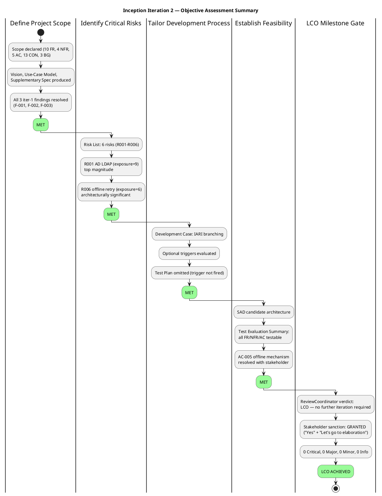
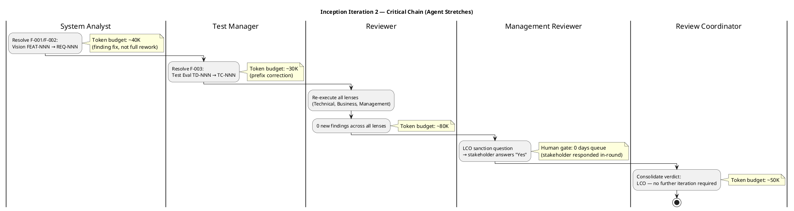
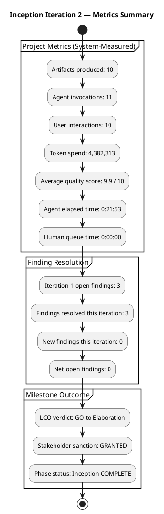

## Document Control

| Field | Value |
|---|---|
| Phase | Inception |
| Status | Final |
| Milestone Target | End-of-Inception (LCO) — ACHIEVED |
| Iteration | 2 (Cycle 1) |
| Date | 2026-08-28 |
| Author | Project Manager (Project Management Discipline) |
| ReviewCoordinator Verdict | LCO: no further iteration required — GO to Elaboration |
| Stakeholder Sanction | GRANTED — STK-001 answered "Yes" and directed: "Let's go to elaboration" |

## Iteration Objectives Reached

The Iteration Plan defined 4 objectives for Inception. The table below records the assessment of each, given the ReviewCoordinator's milestone verdict: **LCO: no further iteration required — GO to Elaboration**.

| # | Objective | Assessment | Evidence |
|---|---|---|---|
| 1 | Define Project Scope | **MET** | Vision (10 FR, 4 NFR, 5 AC, 13 CON, 3 BG), Use-Case Model (UC-001–UC-010 mapping all FR-001–FR-010), Supplementary Specification (NFR-001–NFR-004, AC-001–AC-005). All scope artifacts produced, reviewed, and findings resolved. |
| 2 | Identify Critical Risks | **MET** | Risk List produced with 6 risks (R001–R006), each classified by probability × impact = magnitude, with strategy, mitigation, and contingency. R001 (AD LDAP, exposure=9) and R006 (offline, exposure=6) are top-magnitude risks. |
| 3 | Tailor Development Process | **MET** | Development Case produced with IARI branching strategy. Optional triggers evaluated — Test Plan omitted (trigger not fired; Test Evaluation Summary is the deliverable). |
| 4 | Establish Feasibility | **MET** | SAD candidate architecture produced. Test Evaluation Summary confirms testability of all FR/NFR/AC. AC-005 offline mechanism resolved with stakeholder (server-side fault tolerance + bounded client-side localStorage retry for clocking POST, idempotency key, no PWA/service worker). |

**All 4 planned objectives were met.** The LCO milestone is ACHIEVED: all 3 findings from iteration 1 resolved (0 Critical, 0 Major, 0 Minor, 0 Info), stakeholder sanction GRANTED, ReviewCoordinator verdict GO to Elaboration.

## Adherence to Plan

### Iteration 1 → Iteration 2 Transition

Iteration 1 produced all 10 artifacts and met all 4 objectives, but the LCO gate was blocked by 3 open findings (F-001: Vision FEAT-NNN prefix, F-002: Vision traceability, F-003: Test Evaluation Summary TD-NNN prefix) and the stakeholder refused sanction pending their resolution. Iteration 2 was scoped exclusively to resolve these findings.

### Iteration 2 Execution

| Work Item | Owner | Outcome |
|---|---|---|
| F-001/F-002: Vision FEAT-NNN → REQ-NNN | System Analyst | RESOLVED — prefix corrected in Vision traceability table |
| F-003: Test Evaluation Summary TD-NNN → TC-NNN | Test Manager | RESOLVED — prefix corrected to standard TC-NNN convention |
| LCO re-review (all lenses) | Reviewer | 0 new findings across Technical, Business, Management lenses |
| Stakeholder sanction | Management Reviewer → STK-001 | GRANTED — "Yes" + "Let's go to elaboration" |
| Milestone consolidation | Review Coordinator | Verdict: LCO — no further iteration required |

### Critical Chain

### Budget and Schedule

| Metric | Value | Decision Enabled |
|---|---|---|
| Token spend (cumulative, both iterations) | 4,382,313 | Elaboration budget-box baseline — Inception actuals replace assumed shares |
| Agent elapsed time | 0:21:53 | Elaboration schedule forecasting — Inception wall-clock is the first measured actual |
| Human queue time | 0:00:00 | Stakeholder responsiveness tracking — sanction granted in-round, no gate delay |
| Artifacts produced | 10 | Scope completeness check — all planned artifacts delivered |
| Agent invocations | 11 | Coordination overhead baseline for Elaboration planning |
| User interactions | 10 | Stakeholder engagement intensity — high for Inception, expected to decrease in Elaboration |
| Average quality score | 9.9 / 10 | Process effectiveness — above threshold, no corrective action needed |

> **Measurement goal:** These metrics establish the first measured actuals for the project. Token spend and elapsed time from Inception replace every assumed share in Elaboration forecasts. The quality score confirms the process is effective; no process correction is warranted entering Elaboration.

## Use Cases and Scenarios Implemented

No use cases were implemented in Inception — this is expected. Inception establishes scope, feasibility, and planning. All 10 use cases (UC-001–UC-010) are allocated to Elaboration and Construction iterations per the cross-iteration roadmap in the Iteration Plan.

| UC ID | Use Case | Target Phase | Target Iteration |
|---|---|---|---|
| UC-001 | Clock In and Clock Out | Elaboration + Construction | Elab Iter 1 (PoC: offline retry) → Constr Iter 1 |
| UC-002 | View Own Clocking History | Construction | Constr Iter 1 |
| UC-003 | View All Employee Clockings | Construction | Constr Iter 1 |
| UC-004 | Export Monthly Clocking Report | Construction | Constr Iter 1 |
| UC-005 | Publish News | Construction | Constr Iter 1 |
| UC-006 | Edit Published News | Construction | Constr Iter 1 |
| UC-007 | Unpublish News | Construction | Constr Iter 1 |
| UC-008 | Read and Filter News | Construction | Constr Iter 1 |
| UC-009 | Search Employee Directory | Elaboration + Construction | Elab Iter 1 (PoC: LDAP) → Constr Iter 1 |
| UC-010 | Manage Worker Category | Construction | Constr Iter 1 |

## Results Relative to Evaluation Criteria

### Layer 1: Declared Acceptance Criteria Status

| AC ID | Description | Addressed This Iteration | Evidence | Deferred To |
|---|---|---|---|---|
| AC-001 | Employee can clock in/out without HR help | No | Not implemented in Inception | Construction Iter 1 |
| AC-002 | HR can publish news without technical assistance | No | Not implemented in Inception | Construction Iter 1 |
| AC-003 | Employee finds colleague's phone/email in under 10 seconds | No | Not implemented in Inception | Elaboration Iter 1 (LDAP validation) → Construction Iter 1 |
| AC-004 | 80% of employees complete at least one clocking with no prior training | No | Not implemented in Inception | Construction Iter 2 + Transition Iter 1 |
| AC-005 | System works temporarily offline, syncs on recovery | No | Not implemented in Inception — R006 identifies this as architecturally significant | Elaboration Iter 1 (architectural investigation) → Construction Iter 2 |

> No acceptance criteria are addressed in Inception — this is expected. Inception establishes viability and planning, not implementation. All ACs are allocated to future iterations with explicit target phases.

### Layer 2: Inception Exit Criteria

| Criterion | Met? | Evidence |
|---|---|---|
| F-001/F-002 resolved: Vision FEAT-NNN replaced with REQ-NNN | **YES** | System Analyst corrected Vision traceability table — confirmed in Review Record iteration 2 |
| F-003 resolved: Test Evaluation Summary TD-NNN replaced with TC-NNN | **YES** | Test Manager corrected Test Evaluation Summary traceability table — confirmed in Review Record iteration 2 |
| Iteration Plan evolved for iteration 2 | **YES** | Iteration Plan updated with iteration 2 fine-plan, evaluation criteria, and finding-resolution work items |
| Risk List preserved (no findings target it) | **YES** | PRESERVED — no changes needed; no findings target the Risk List |
| LCO re-assessment ready for Review Coordinator | **YES** | All findings resolved, 0 new findings, stakeholder sanction granted |
| No open SCOPE_QUESTION blocking the gate | **YES** | No SCOPE_QUESTION raised — all scope is declared; AC-005 resolved with stakeholder |
| Stakeholder sanction | **YES** | STK-001 answered "Yes" to LCO sanction and directed: "Let's go to elaboration" |
| ReviewCoordinator verdict | **YES** | LCO: no further iteration required — GO to Elaboration |

## Test Results

No test execution occurred in Inception — this is expected. The Test Evaluation Summary establishes the test strategy foundation:

- **Testability confirmed:** All 10 FRs, 4 NFRs, and 5 ACs are testable with the declared technology stack (.NET 10, Razor Pages, PostgreSQL, Keycloak OIDC, AD LDAP).
- **Testing risks identified:** R001 (AD LDAP attribute coverage) and R006 (offline retry scenarios) are the top testing risks driving Elaboration PoC validation.
- **Test infrastructure dependency:** STK-003 must provide a test AD instance and OIDC client registration before Elaboration login testing — this is an open dependency tracked in the Risk List.
- **Coverage blueprint:** AC-001–AC-005 mapped to future test cases (TC-001, TC-002) and Construction/Transition test phases.

## External Changes

No external changes occurred during Inception. The declared scope (10 FR, 4 NFR, 5 AC, 13 CON, 3 BG, 2 declared risks) remained stable across both iterations. The only scope-relevant decision was the AC-005 clarification from the stakeholder (server-side fault tolerance + bounded client-side localStorage retry for clocking POST), which refined the interpretation without changing the declared scope.

## Rework Required

**None.** All 3 findings from iteration 1 were resolved in iteration 2. The Review Record confirms 0 Critical, 0 Major, 0 Minor, and 0 Info findings remain open. No rework is carried forward to Elaboration.

### Metrics Summary

## Lessons Learned

| # | Lesson | Applicability |
|---|---|---|
| 1 | **Finding resolution iterations are efficient.** Iteration 2 resolved 3 findings with minimal token spend relative to iteration 1's full artifact production. The iterative model absorbed the correction without re-creating artifacts. | Elaboration: expect similar efficiency for finding-fix iterations. |
| 2 | **Stakeholder engagement is high and responsive.** 10 user interactions across 2 Inception iterations with 0 queue time on the final sanction. The stakeholder is actively engaged and decisive. | Elaboration: maintain in-round escalation for SCOPE_QUESTIONs; expect fast turnaround. |
| 3 | **Quality score 9.9/10 validates the process tailoring.** The IARI branching strategy and Development Case produced high-quality artifacts on the first pass; the only findings were naming-convention corrections (Info-level). | Elaboration: preserve the same process; no corrective action needed. |
| 4 | **AC-005 clarification was the most consequential scope decision.** The stakeholder's nuanced answer (server-side fault tolerance + bounded localStorage retry, no PWA, no service worker, idempotency key) resolved a potential architectural conflict between AC-005 and CON-002 without scope change. | Elaboration: the PoC for UC-001 offline retry must validate this exact mechanism. |
| 5 | **Token spend of 4.38M is the first measured actual.** This replaces all assumed budget shares for Elaboration forecasting. The spend is dominated by reasoning over the accumulated artifact surface, not by artifact volume. | Elaboration Iteration Plan: use Inception actuals as the budget-box baseline, not the rubber profile percentages. |

## Adjustments for Elaboration Iteration 1

| Adjustment | Rationale | Source |
|---|---|---|
| Budget-box baseline: use Inception measured actuals (4.38M tokens, 0:21:53 elapsed) as the starting forecast, not rubber-profile percentages | Inception is the first closed phase; its measured spend replaces assumed shares | Measurement with Purpose heuristic |
| Elaboration Iter 1 scope: PoC for R001 (AD LDAP attribute coverage) + R006 (offline retry mechanism for UC-001) | Top-magnitude risks must be confronted first in Elaboration | Risk-Driven Iteration Planning |
| Test infrastructure dependency: STK-003 must provide test AD + OIDC client before Elaboration login testing | Test Evaluation Summary flags this as an open dependency | Risk List R001, Test Evaluation Summary |
| Preserve Risk List as-is unless new risks emerge | No findings target the Risk List; it is converged for Inception | PRESERVED |
| Preserve Iteration Plan coarse roadmap (6 iterations: [1, 2, 2, 1]) | Roadmap validated by LCO achievement; no scope change | Iteration Plan, Review Record |
| Elaboration agent role profile: Software Architect (lead), System Analyst, Designer, Test Manager, Implementer | Elaboration confronts architectural risk; architect leads | Rubber profile: Elaboration ~20% of iterations |

## Traceability

| Element | Traces From | Link Type | Traces To |
|---|---|---|---|
| Iteration Assessment (Iter 2) | Iteration Plan (Inception), Review Record (Iter 2) | Derives | LCO Milestone Verdict — GO to Elaboration |
| Objective 1 (Define Scope) | Iteration Plan §Iteration Objectives | Refines | Vision, Use-Case Model, Supplementary Specification |
| Objective 2 (Identify Risks) | Iteration Plan §Iteration Objectives | Refines | Risk List (R001–R006) |
| Objective 3 (Tailor Process) | Iteration Plan §Iteration Objectives | Refines | Development Case |
| Objective 4 (Establish Feasibility) | Iteration Plan §Iteration Objectives | Refines | SAD, Test Evaluation Summary |
| F-001, F-002 (resolved) | Review Record §Findings (Iter 1) | Derives | Vision (corrected: FEAT-NNN → REQ-NNN) |
| F-003 (resolved) | Review Record §Findings (Iter 1) | Derives | Test Evaluation Summary (corrected: TD-NNN → TC-NNN) |
| Stakeholder sanction (Iter 2) | STK-001 ("Yes" + "Let's go to elaboration") | Refines | LCO Milestone Verdict — GO to Elaboration |
| Metrics (token spend, elapsed time, quality) | Iteration facts (system-measured) | Derives | Elaboration Iteration Plan (budget-box baseline) |
| AC-005 decision | Stakeholder answer (System Analyst round, Iter 1) | Refines | Supplementary Specification, Elaboration PoC plan (UC-001 offline retry) |
| Lessons learned | Iteration 2 execution facts | Derives | Elaboration Iteration 1 Plan |
| Elaboration adjustments | Risk List (R001, R006), Test Evaluation Summary | Derives | Elaboration Iteration 1 Plan |