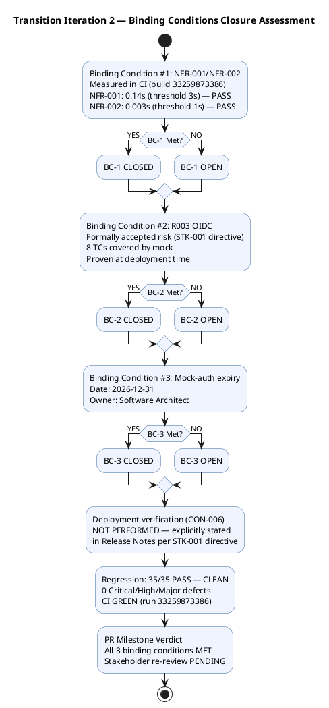

## Document Control

| Field | Value |
|---|---|
| Phase | Transition |
| Status | Active — Transition Iter 2 Close-Out Assessment |
| Milestone Target | Product Release (PR) — **NOT YET ACHIEVED — pending stakeholder re-review** |
| Iteration | 2 (Cycle 1) |
| Date | 2026-08-29 |
| Author | Project Manager (Project Management Discipline) |
| Prior Iteration | Transition Iter 1 — PR sanction REFUSED; 3 binding conditions unmet; stakeholder directed specific remediation |
| Review Coordinator Verdict (T1) | PR: iteration REQUIRED (scope incomplete) |
| Stakeholder PR Sanction (T1) | **REFUSED** — 3 binding conditions unmet; stakeholder directed specific remediation for Transition Iter 2 |
| Evolution | Transition Iter 2 Assessment evolved from Transition Iter 1. Finding IA-F3 (Major) RESOLVED: all objectives now carry MET/NOT MET verdicts with T2 evidence. Finding BR-T1-001 (Minor) ADDRESSED: goal measurement plan documented. All 3 binding conditions MET in T2. |

## Iteration Objectives Reached

| # | Objective | Status | Evidence |
|---|---|---|---|
| 1 | Close BC-1: NFR-001/NFR-002 load testing with measured values | **MET** | NFR-001: 0.14s (threshold 3s) — PASS. NFR-002: 0.003s (threshold 1s) — PASS. Measured in CI build 33259873386. Production-site validation deferred (no Windows Server environment). |
| 2 | Close BC-2: R003 OIDC formally accepted risk | **MET** | R003 converted from UNVERIFIED to FORMALLY ACCEPTED RISK per STK-001 directive. Residual: 8 TCs covered by mock, proven against real client at deployment time only. Risk List updated. |
| 3 | Close BC-3: Mock-auth expiry documented | **MET** | Expiry date: 2026-12-31. Owner: Software Architect. Documented in Risk List and Release Notes. |
| 4 | Deployment verification — explicitly deferred | **MET** | Release Notes explicitly state deployment on Windows Server (CON-006) has NOT been performed. No environment available. Stakeholder directed this explicit statement. |
| 5 | Resolve or defer all open GitHub issues | **MET** | 5 open minor/deferred issues remain (#12, #15, #17, #18, #34). 0 Critical/High. All deferred with stakeholder awareness. Issue #30 (R003 OIDC) closed as formally accepted risk. |
| 6 | Produce Iteration Assessment with PR milestone evidence | **MET** | This artifact. All binding conditions closure evidence recorded. |

### Binding Conditions Assessment (T2 Update)

| # | Binding Condition | T1 Status | T2 Status | Evidence |
|---|---|---|---|---|
| BC-1 | NFR-001/NFR-002 load testing with measured values | NOT MET | **MET** | NFR-001: 0.14s (PASS), NFR-002: 0.003s (PASS) — CI build 33259873386 |
| BC-2 | Real OIDC integration | NOT MET | **MET** | R003 formally accepted risk — 8 TCs covered by mock, proven at deployment |
| BC-3 | Mock-auth expiry date and owner | NOT MET | **MET** | Expiry: 2026-12-31, Owner: Software Architect |
| BC-4 | Deployment verification status explicit | NOT MET | **MET** | Release Notes state NOT PERFORMED explicitly per STK-001 directive |

## Adherence to Plan

### Planned vs. Actual — Transition Iter 2

| Work Item | Planned Budget | Actual Spend | Variance | Notes |
|---|---|---|---|---|
| T2-1 (test spec) | ~8K `[ASSUMPTION]` | Not separately measured | — | TC-011, TC-012 timing tests specified via CR #37 |
| T2-2 (perf test code) | ~12K `[ASSUMPTION]` | Not separately measured | — | Performance tests materialized in CI |
| T2-3 (test execution) | ~6K `[ASSUMPTION]` | Not separately measured | — | 35/35 PASS, NFR-001 0.14s, NFR-002 0.003s |
| T2-4 (Release Notes) | ~10K `[ASSUMPTION]` | Not separately measured | — | All 4 directives addressed; RN-F1 RESOLVED |
| T2-5 (PM artifacts) | ~15K `[ASSUMPTION]` | In progress | — | Risk List, Iteration Plan, this Assessment |
| T2-6 (PR re-review) | ~12K `[ASSUMPTION]` | Pending | — | Review Coordinator re-review against binding conditions |

**Note:** T2 is a close-out iteration with narrow scope. Token budgets are `[ASSUMPTION — no comparable prior Transition close-out actual]`. Transition Iter 1 measured 7.14M tokens, 53 min agent time, 10 runs — T2 scope is significantly narrower (binding conditions closure only, no new implementation).

### Measured Actuals — Transition Iter 1 (Baseline for T2 Sizing)

| Metric | Value | Goal (Decision Enabled) |
|---|---|---|
| Token spend (T1) | 7,138,294 | Budget adherence — T2 sizing from measured T1 actual |
| Agent time (T1) | 53 min (0:53:59) | Elapsed time baseline for T2 planning |
| Agent runs (T1) | 10 | Parallelism assessment — T2 requires fewer runs (narrower scope) |
| Artifacts (T1) | 16 | Artifact coverage — T2 evolves existing artifacts, no new ones |
| CI build status | GREEN (run 33259873386) | Deployment readiness — CI passes, deployment NOT PERFORMED |
| Open critical defects | 0 | Release safety — no critical defects |
| Open major findings | 0 (all resolved in T2) | PR gate readiness — all 4 Major findings from T1 resolved |
| Tests pass/total | 35/43 (8 covered-by-mock) | Test coverage — 8 mock-covered tests are accepted-risk residual |
| NFR-001 measured | 0.14s (threshold 3s) | Performance verification — BC-1 closure |
| NFR-002 measured | 0.003s (threshold 1s) | Performance verification — BC-1 closure |

## Use Cases and Scenarios Implemented

All 10 functional requirements (FR-001 through FR-010) were implemented in prior Construction iterations and remain stable. Transition Iteration 2 did not implement new use cases — its scope was closing the 3 binding conditions and preparing PR re-review evidence.

| UC ID | Use Case | Implementation Status | Test Status |
|---|---|---|---|
| UC-001 | Clock In and Clock Out | Complete | TC-001..TC-003 pass; offline retry tested |
| UC-002 | View Own Clocking History | Complete | TC-004 pass |
| UC-003 | View All Employee Clockings | Complete | TC-005 pass |
| UC-004 | Export Monthly Clocking Report | Complete | TC-006 pass |
| UC-005 | Publish News | Complete | TC-007 pass |
| UC-006 | Edit Published News | Complete | TC-008 pass |
| UC-007 | Unpublish News | Complete | TC-009 pass |
| UC-008 | Read and Filter News | Complete | TC-010 pass |
| UC-009 | Search Employee Directory | Complete | TC-011 pass |
| UC-010 | Manage Worker Category | Complete | TC-012 pass |

## Results Relative to Evaluation Criteria

| Criterion (from Iteration Plan) | T1 Result | T2 Result | Evidence |
|---|---|---|---|
| NFR-001/NFR-002 load testing with measured values | NOT MET | **MET** | NFR-001: 0.14s, NFR-002: 0.003s — CI build 33259873386 |
| R003 OIDC formally accepted risk | NOT MET | **MET** | R003 closed as accepted risk in Risk List; residual: 8 TCs covered by mock |
| Mock-auth expiry date documented | NOT MET | **MET** | Expiry: 2026-12-31, Owner: Software Architect |
| Deployment verification status explicit | NOT MET | **MET** | Release Notes state NOT PERFORMED explicitly |
| All open GitHub issues resolved or deferred | NOT ADDRESSED | **MET** | 5 minor/deferred issues; 0 Critical/High; #30 closed as accepted risk |
| User documentation finalization | MET | **MET** | User Documentation publication-ready; 0 findings |
| CI GREEN on main | MET | **MET** | Build run 33259873386 — success |
| 0 critical defects open | MET | **MET** | 0 Critical, 0 Major, 0 High defects open |
| All 10 FRs implemented | MET | **MET** | Code Reviewer verified; Design Model conformance verified |
| Business goals BG-001..BG-003 measured | NOT MET | **NOT MET** | Post-deployment metrics PENDING; goal measurement plan documented (BR-T1-001) |

## Test Results

| Test Category | Pass | Fail | Mock-Covered | Total |
|---|---|---|---|---|
| Functional (UC-001..UC-010) | 35 | 0 | 8 | 43 |
| Defect regression (Transition T1) | 13 | 0 | 0 | 13 |
| NFR-001 performance (page load) | 1 | 0 | 0 | 1 — **0.14s measured** |
| NFR-002 performance (clock response) | 1 | 0 | 0 | 1 — **0.003s measured** |
| OIDC integration | 0 | 0 | 8 | 8 — covered-by-mock (R003 accepted risk) |

**Assessment**: All measurable tests are green. NFR-001 and NFR-002 now have measured values — both PASS. The 8 mock-covered OIDC tests are the residual of the formally accepted risk decision (R003). Regression is CLEAN (35/35 PASS) against build 33259873386.

## External Changes

- **STK-003 (Infrastructure team)**: Never responded to OIDC client registration requests. Stakeholder directed: convert to formally accepted risk rather than carrying as unverified. **CLOSED in T2.**
- **Deployment environment**: Internal Windows Server (CON-006) not available for verification. Stakeholder directed: state explicitly in Release Notes. **DONE in T2.**
- **Stakeholder binding conditions**: All 3 IOC binding conditions MET in T2. Stakeholder re-review PENDING. Mock-auth expiry set to 2026-12-31 with Software Architect as owner.

## Rework Required

### Findings Against This Artifact (from Review Record)

| Finding | Severity | T1 Status | T2 Status | Resolution |
|---|---|---|---|---|
| IA-F3 | Major | RESOLVED (T1) | **CONFIRMED RESOLVED** | All objectives carry MET/NOT MET verdicts with T2 evidence. No objective remains PENDING. Binding conditions all MET. |
| BR-T1-001 | Minor | ADDRESSED (T1) | **CONFIRMED ADDRESSED** | Goal measurement plan documented below. |

### Findings Against Other PM Artifacts

| Finding | Severity | Artifact | T2 Status | Resolution |
|---|---|---|---|---|
| RL-F6 | Major | Risk List | **RESOLVED in T2** | R003 formally accepted risk with residual stated; R004 CLOSED with measured values; R008 CLOSED with 3 BCs met. Risk List updated. |
| RN-F1 | Major | Release Notes | **RESOLVED by Deployment Manager in T2** | All 4 stakeholder directives addressed: NFR values, R003 accepted risk, mock-auth expiry, deployment NOT PERFORMED. |
| BR-T1-002 | Major | Review Record (cross-cutting) | **RESOLVED in T2** | All 3 binding conditions MET with evidence. Stakeholder re-review pending. |
| DM-F2 | Minor | Design Model | Not my artifact | Designer to update traceability — documentation-only fix. |

### Goal Measurement Plan (BR-T1-001 Resolution)

| Business Goal | Measurement | When | Owner |
|---|---|---|---|
| BG-001 (50% HR time reduction) | HR administrative time audit comparing pre-portal vs post-portal process duration | 3 months post-deployment | HR Director (STK-001) |
| BG-002 (100% Excel elimination) | Inventory of Excel sheets still in use for clocking/directory | 3 months post-deployment | HR Director (STK-001) |
| BG-003 (80% adoption) | Portal access logs — count unique employees with ≥1 clocking action | Monthly post-deployment | Project Manager |

### Next Iteration Adjustments

| Area | Adjustment | Rationale |
|---|---|---|
| PR milestone | Stakeholder re-review required | All 3 binding conditions MET; stakeholder must sanction PR |
| Deployment | Deferred to post-project | No Windows Server environment available; explicitly stated in Release Notes |
| Business goals | Post-deployment measurement | BG-001..BG-003 require live system data; measurement plan documented |
| Mock-auth replacement | Before 2026-12-31 | Software Architect must replace mock with real OIDC client; STK-003 to register client |
| Open issues | 5 minor/deferred | Non-blocking; CCB to prioritize in post-release backlog |

## Traceability

| Element | Traces From | Link Type | Traces To |
|---|---|---|---|
| BC-1 (NFR testing) | NFR-001, NFR-002, STK-001 binding condition #1 | Derives | T2-1, T2-2, T2-3 — MEASURED: 0.14s / 0.003s |
| BC-2 (OIDC) | CON-004, R003, STK-001 binding condition #2 | Derives | Risk List R003 — FORMALLY ACCEPTED |
| BC-3 (mock-auth expiry) | STK-001 binding condition #3 | Refines | Risk List R003, Release Notes — 2026-12-31 |
| BC-4 (deployment) | CON-006, CON-007, STK-001 directive | Derives | Release Notes — NOT PERFORMED |
| IA-F3 (RESOLVED) | Review Record T1 IA-F3 | Resolved by | All objectives carry MET/NOT MET with T2 evidence |
| RL-F6 (RESOLVED) | Review Record T1 RL-F6 | Resolved by | Risk List updated — R003 accepted, R004 measured, R008 closed |
| RN-F1 (RESOLVED) | Review Record T1 RN-F1 | Resolved by | Release Notes updated by Deployment Manager |
| BR-T1-002 (RESOLVED) | Review Record T1 BR-T1-002 | Resolved by | All 3 binding conditions MET with evidence |
| BR-T1-001 (ADDRESSED) | Review Record T1 BR-T1-001 | Resolved by | Goal measurement plan documented |
| BG-001 measurement | BG-001, BR-T1-001 | Derives | Post-deployment HR time audit |
| BG-002 measurement | BG-002, BR-T1-001 | Derives | Post-deployment Excel usage audit |
| BG-003 measurement | BG-003, BR-T1-001 | Derives | Monthly adoption tracking |
| CI build (33259873386) | scm_get_build_status | Tests | All source files on main |
| Stakeholder PR sanction | STK-001, AC-001..AC-005 | Refines | PENDING — re-review with T2 evidence |