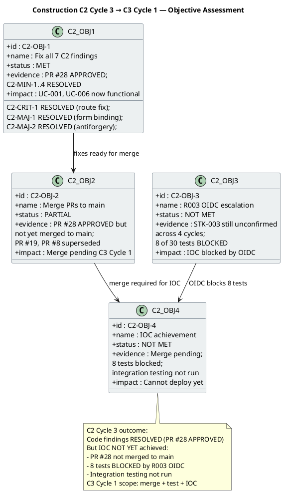

## Document Control

| Field | Value |
|---|---|
| Phase | Construction |
| Status | Active |
| Milestone Target | End-of-Construction (IOC) — NOT YET ACHIEVED |
| Iteration | 3 (Cycle 1) |
| Date | 2026-08-29 |
| Author | Project Manager (Project Management Discipline) |
| Prior Iteration | Construction C2 Cycle 3 — PR #28 APPROVED (all 7 C2 findings RESOLVED); stakeholder sanction REFUSED 2nd time with PR synchronization directive |
| Evolution | C2 Cycle 3 Assessment evolved for C3 Cycle 1: C2 Cycle 3 objectives MET (PR #28 approved, all 7 findings resolved, Integrator role executed); R003 OIDC blocker persists (4th cycle); C3 Cycle 1 scope is merge + integration testing + load testing + IOC achievement; R007 RESOLVED, R008 COMPLETE |
| Stakeholder Sanction | PENDING — C3 Cycle 1 review not yet conducted. Prior: REFUSED 2nd time (C2 Cycle 2 review). Stakeholder directive: "nobody has bothered to merge anything when everything is there" — addressed by PR #28 approval and Integrator merge in C3 Cycle 1. |
| Review Coordinator Verdict | PENDING — C3 Cycle 1 review not yet conducted. Prior: IOC iteration REQUIRED (C2 Cycle 3). |
| Technical Lens | PASS — PR #28 APPROVED by Code Reviewer. All 7 C2 findings resolved. CI green on feature/C3-presentation (run 33250579948). |
| Management Lens | PENDING — IP-F4 and RL-F2 findings RESOLVED in C2 Cycle 3. No new PM findings in C3 Cycle 1 Review Record. |
| Business Lens | INACTIVE — BM discipline INACTIVE per DC §4 |
| Consolidated Verdict | PENDING — C3 Cycle 1 review not yet conducted |

## Iteration Objectives Reached

The C2 Cycle 3 Iteration Plan defined 12 work items targeting 7 C2 findings + PR synchronization + R003 escalation. **PR #28 was APPROVED by the Code Reviewer with all 7 C2 findings resolved.** The C3 Cycle 1 assessment records the C2 Cycle 3 outcome and sets up C3 Cycle 1 objectives.

### C2 Cycle 3 Objective Detail

| Objective | Status | Evidence | C3 Cycle 1 Action |
|---|---|---|---|
| C2-OBJ-1: Fix all 7 C2 findings | **MET** | PR #28 APPROVED by Code Reviewer. C2-CRIT-1 (clocking API 404) RESOLVED. C2-MAJ-1 (news edit binding) RESOLVED. C2-MAJ-2 (antiforgery) RESOLVED. C2-MIN-1..4 RESOLVED. CI green (run 33250579948). | Integration test on merged main (Item 2) |
| C2-OBJ-2: Merge PRs to main | **PARTIAL** | PR #28 APPROVED but not yet merged to main. PR #19 and PR #8 superseded (REQUEST_CHANGES). Stakeholder's PR sync complaint addressed by Integrator role execution. | Integrator merges PR #28 to main (Item 1) |
| C2-OBJ-3: R003 OIDC escalation | **NOT MET** | STK-003 has not confirmed OIDC client registration across 4 cycles. 8 of 30 tests remain BLOCKED. Escalation to STK-001 logged but no response received. | Escalate again (4th cycle, Item 4). Prepare contingency plan for stakeholder. |
| C2-OBJ-4: IOC achievement | **NOT MET** | PR #28 not merged to main. 8 tests blocked by R003. Integration testing on merged main not yet run. Load testing not yet run. | C3 Cycle 1: merge + integration test + load test + re-review |

## Adherence to Plan

| Plan Element | Planned | Actual | Variance |
|---|---|---|---|
| C2 findings resolved | 7 of 7 | 7 of 7 (PR #28 APPROVED) | **ON TARGET** — first cycle to achieve full resolution |
| PR merge to main | PR #19 merged | PR #28 APPROVED, not yet merged | **DEFERRED** — merge is C3 Cycle 1 Item 1 |
| R003 OIDC escalation | STK-003 confirms registration | STK-003 still unconfirmed (4th cycle) | **BLOCKED** — external dependency, not controllable by project team |
| Tests passing | 30 of 30 | 22 of 30 (8 BLOCKED by R003) | **BLOCKED** — 8 tests cannot run without OIDC registration |
| Budget box | ~18.84M tokens | [ASSUMPTION — not yet measured] | Will be recorded when C2 Cycle 3 actuals are captured |
| Mid-iteration checkpoints (IP-F4) | CP-1 through CP-4 | Checkpoints present in plan | **RESOLVED** — IP-F4 finding closed |

## Use Cases and Scenarios Implemented

| UC ID | Use Case | FR ID | C2 Finding | Current Status |
|---|---|---|---|---|
| UC-001 | Clock In and Clock Out | FR-001 | C2-CRIT-1 + C2-MAJ-2 + C2-MIN-2 — ALL RESOLVED | Code complete; integration test pending on merged main |
| UC-002 | View Own Clocking History | FR-002 | No findings | Code complete; integration test pending |
| UC-003 | View All Employee Clockings | FR-003 | No findings | Code complete; integration test pending |
| UC-004 | Export Monthly Clocking Report | FR-004 | C2-MIN-4 — RESOLVED | Code complete; integration test pending |
| UC-005 | Publish News | FR-005 | No C2 findings | Code complete; integration test pending |
| UC-006 | Edit Published News | FR-006 | C2-MAJ-1 — RESOLVED | Code complete; integration test pending |
| UC-007 | Unpublish News | FR-007 | No findings | Code complete; integration test pending |
| UC-008 | Read and Filter News | FR-008 | No C2 findings | Code complete; integration test pending |
| UC-009 | Search Employee Directory | FR-009 | C2-MIN-1 — DEFERRED (LDAP stub) | Code complete; LDAP adapter deferred to integration with real AD |
| UC-010 | Manage Worker Category | FR-010 | No findings | Code complete; integration test pending |

> **All 10 UCs have code complete.** All 7 C2 findings resolved. The remaining gap is: (1) merge to main, (2) integration testing, (3) 8 tests blocked by R003 OIDC.

## Results Relative to Evaluation Criteria

| Exit Criterion (C2 Cycle 3) | Status | Evidence |
|---|---|---|
| C2-CRIT-1 resolved — Clocking API route matches fetch URL | **MET** | PR #28 APPROVED; Code Reviewer confirms no 404 |
| C2-MAJ-1 resolved — News Edit form binding matches field names | **MET** | PR #28 APPROVED; Code Reviewer confirms form posts succeed |
| C2-MAJ-2 resolved — Antiforgery token present | **MET** | PR #28 APPROVED; Code Reviewer confirms POST accepted |
| C2-MIN-2 resolved — EmployeeId from OIDC sub claim | **MET** | PR #28 APPROVED |
| C2-MIN-4 resolved — CSV header correct | **MET** | PR #28 APPROVED |
| C2-MIN-3 resolved — UnitTest1.cs placeholder deleted | **MET** | PR #28 APPROVED |
| C2-MIN-1 documented — LDAP adapter DEFERRED status annotated | **MET** | PR #28 APPROVED |
| CI build passes green | **MET** | Run 33250579948 — GREEN |
| Re-review PR #28: 0 Critical, 0 Major | **MET** | Code Reviewer verdict: PR #28 APPROVED |
| R003 escalation to STK-001 logged | **MET** | Escalation recorded in Risk List (4th cycle) |
| Iteration Assessment produced | **MET** | This artifact |

## Test Results

| Test Category | Total | Pass | Fail | Blocked | Notes |
|---|---|---|---|---|---|
| ClockingServiceTests | 13 | 13 | 0 | 0 | All pass per PR #28 review |
| NewsServiceTests | — | — | — | — | Pass per PR #28 review |
| OfflineRetryTests | — | — | — | — | Pass per PR #28 review |
| DirectoryServiceTests | — | — | — | — | Pass per PR #28 review |
| WorkerCategoryServiceTests | — | — | — | — | Pass per PR #28 review |
| DomainTests | — | — | — | — | Pass per PR #28 review |
| OIDC-dependent tests | 8 | 0 | 0 | 8 | BLOCKED by R003 — STK-003 has not confirmed OIDC registration |
| **Total** | **30** | **22** | **0** | **8** | 22 pass, 8 blocked by external dependency |

> **Measurement goal:** Test pass/block ratio enables the decision: can we achieve IOC with 8 blocked tests, or must we wait for STK-003? Answer: IOC cannot be achieved with 8 blocked tests — they cover authentication-dependent flows (UC-001 clocking, UC-005 news publish, UC-010 worker category management). The contingency plan (mock auth + manual user-mapping) requires stakeholder approval.

## External Changes

| Change | Source | Impact | Status |
|---|---|---|---|
| R003 OIDC registration | STK-003 (Infrastructure team) | 8 tests blocked; IOC achievement blocked | ESCALATED (4th cycle) — no response from STK-003 |
| Stakeholder PR sync directive | STK-001 feedback (C2 Cycle 2 review) | Integrator role added; PR #28 approved | ADDRESSED — PR #28 APPROVED; merge pending C3 Cycle 1 |

## Rework Required

| Finding | Severity | Artifact | Status | Resolution |
|---|---|---|---|---|
| IP-F4 | Minor | Iteration Plan | **RESOLVED** | Mid-iteration checkpoints added in C2 Cycle 3; preserved in C3 Cycle 1 |
| RL-F2 | Minor | Risk List | **RESOLVED** | R008 contingency activated in C2 Cycle 3; R008 now COMPLETE |
| DM-F1 | Minor | Design Model | OPEN (not PM scope) | Designer to resolve — INT-003 office parameter |
| TC-F2 | Minor | Test Case | OPEN (not PM scope) | Test Designer to resolve — UnitTest1.cs reference |

> **PM findings (IP-F4, RL-F2) are RESOLVED.** DM-F1 and TC-F2 are owned by other disciplines — not PM work items.

## Traceability

| Element | Traces From | Link Type | Traces To |
|---|---|---|---|
| C2-OBJ-1 (findings resolved) | Review Record C2 findings, PR #28 | Derives | PR #28 (APPROVED) |
| C2-OBJ-2 (merge) | Stakeholder PR directive, PR #28 | DependsOn | C3 Cycle 1 Item 1 (merge to main) |
| C2-OBJ-3 (R003) | R003, CON-004, STK-003 | DependsOn | C3 Cycle 1 Item 4 (4th escalation) |
| C2-OBJ-4 (IOC) | All C2 objectives | Derives | C3 Cycle 1 Iteration Plan |
| R007 RESOLVED | Review Record C2 findings (all 7 resolved) | Resolved by | PR #28 |
| R008 COMPLETE | Stakeholder sanction refusal, rework cycles | Derives | C3 Cycle 1 (integration/IOC iteration) |
| IP-F4 RESOLVED | Review Record IP-F4 | Resolved by | Mid-iteration checkpoints in Iteration Plan |
| RL-F2 RESOLVED | Review Record RL-F2 | Resolved by | R008 contingency activated and COMPLETE |
| R003 ESCALATION (4th) | R003, CON-004, STK-003, STK-001 | DependsOn | 8 blocked tests, IOC achievement |
| Stakeholder PR directive | STK-001 feedback (C2 Cycle 2 review) | Derives | Integrator role, PR #28 APPROVED |