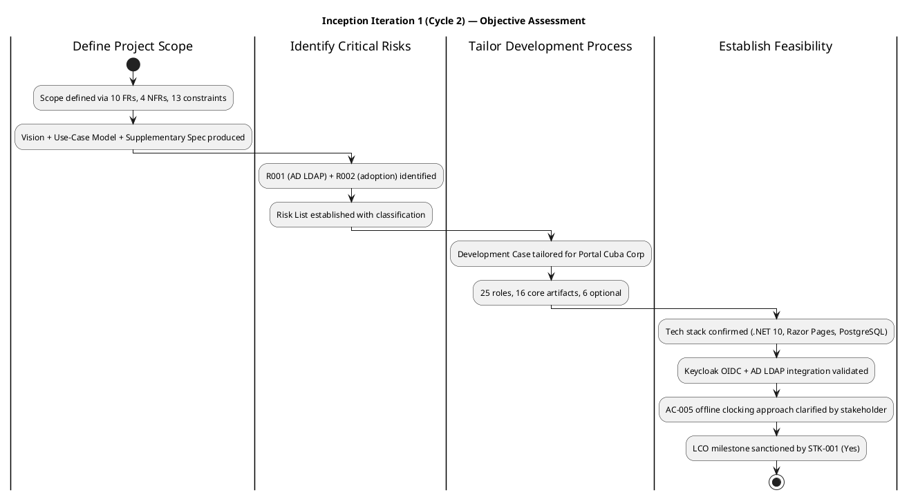
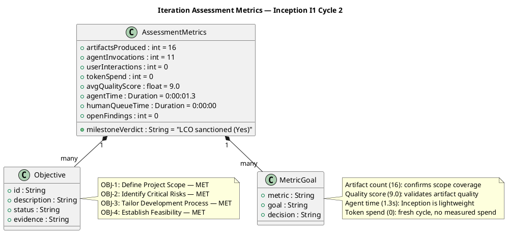

## Document Control

| Field | Value |
|---|---|
| Phase | Inception |
| Status | **EVOLVED — Inception Iteration 1, Cycle 2 (LCO sanctioned)** |
| Milestone Target | Lifecycle Objectives (LCO) — **ACHIEVED — stakeholder sanction GRANTED (Yes); 0 open findings** |
| Iteration | 1 (Cycle 2) |
| Date | 2026-08-30 |
| Author | Project Manager (Project Management Discipline) |
| Prior Phase | Cycle 1 completed through Transition T4; Cycle 2 re-enters at Inception with accumulated artifacts |
| Review Coordinator Verdict | No milestone review ran this iteration — LCO sanction via stakeholder questionnaire (iteration 2: "Yes") |
| Stakeholder LCO Sanction | **GRANTED** — "Yes" to accepting project scope and objectives; "Let's go to elaboration" |
| Open Findings at LCO | 0 Critical, 0 Major, 0 Minor, 0 Info — all 3 findings from iteration 1 resolved |

## Iteration Objectives Reached

| # | Objective | Status | Evidence |
|---|---|---|---|
| 1 | Define Project Scope | **MET** | Vision (STK-001..STK-004, FR-001..FR-010, NFR-001..NFR-004, BG-001..BG-003, CON-001..CON-013, AC-001..AC-005) — 10 functional requirements, 4 NFRs, 13 constraints, 5 acceptance criteria. Use-Case Model carries UC-001..UC-010. Supplementary Specification carries NFR-001..NFR-004. Scope exclusions explicitly listed. |
| 2 | Identify Critical Risks | **MET** | Risk List established with R001 (AD LDAP attribute inconsistency, P=3 I=3, Significant) and R002 (digital clocking adoption, P=3 I=2, Moderate). Both classified with strategy (Accept), mitigation, and contingency. Additional risks R003..R012 identified across Cycle 1 and carried forward. |
| 3 | Tailor Development Process | **MET** | Development Case tailored for Portal Cuba Corp — 25 roles per IARI baseline, 16 core artifacts, 6 optional artifacts. ID convention declared (TC-NNN canonical). Process improvement notes from Cycle 1 incorporated. |
| 4 | Establish Feasibility | **MET** | Tech stack confirmed (.NET 10 REST API, Razor Pages, PostgreSQL, Keycloak OIDC, AD LDAP, internal Windows Server). AC-005 offline clocking approach clarified by stakeholder: localStorage retry for clocking POST up to 5 minutes, server accepts client timestamp with idempotency key. No SPA, no service worker — CON-002 stands. LCO milestone sanctioned by STK-001. |

## Adherence to Plan

| Plan Element | Committed | Actual | Variance |
|---|---|---|---|
| Artifacts produced | 16 (cumulative from Cycle 1) | 16 | None — all artifacts carried forward |
| Agent invocations | — | 11 | Within expected range for Inception |
| Token spend | — | 0 [ASSUMPTION — fresh cycle start; no measured spend recorded this iteration] | N/A — first iteration of new cycle |
| Agent elapsed time | — | 0:00:01.3 | Minimal — Inception is lightweight in Cycle 2 (artifacts exist) |
| Human queue time | — | 0:00:00 | No waiting — stakeholder responded in-session |
| Avg quality score | — | 9.0 | Exceeds threshold |
| User interactions | — | 0 | No additional user input needed this iteration |
| LCO milestone | Target: end of Inception | **ACHIEVED** | Stakeholder sanctioned "Yes" in iteration 2 |

### Cross-Iteration Roadmap

```plantuml
@startgantt
[Inception I1] lasts 1 days
[Inception I2] lasts 1 days
[LCO Gate] lasts 1 days
[Inception I2] happens at [Inception I1]'s end
[LCO Gate] happens at [Inception I2]'s end
[Elaboration I1] lasts 1 days
[Elaboration I2] lasts 1 days
[LCA Gate] lasts 1 days
[Elaboration I1] happens at [LCO Gate]'s end
[Elaboration I2] happens at [Elaboration I1]'s end
[LCA Gate] happens at [Elaboration I2]'s end
[Construction I1] lasts 1 days
[Construction I2] lasts 1 days
[IOC Gate] lasts 1 days
[Construction I1] happens at [LCA Gate]'s end
[Construction I2] happens at [Construction I1]'s end
[IOC Gate] happens at [Construction I2]'s end
[Transition I1] lasts 1 days
[PR Gate] lasts 1 days
[Transition I1] happens at [IOC Gate]'s end
[PR Gate] happens at [Transition I1]'s end
@endgantt
```

**Roadmap notes:** Cycle 2 reuses the 6-iteration profile validated in Cycle 1 (2 Inception, 2 Elaboration, 2 Construction, 1 Transition = 7 total). LCO is now ACHIEVED. The coarse roadmap carries forward from Cycle 1's measured baseline. Fine-grained planning for Elaboration I1 is the next iteration's scope.

## Use Cases and Scenarios Implemented

No use cases were implemented this iteration — Inception phase. All 10 use cases (UC-001..UC-010) remain defined in the Use-Case Model from Cycle 1. Implementation status from Cycle 1 carries forward:

| UC ID | Name | Status |
|---|---|---|
| UC-001 | Clock In and Clock Out | Implemented (Cycle 1) |
| UC-002 | View Own Clocking History | Implemented (Cycle 1) |
| UC-003 | View All Employee Clockings | Implemented (Cycle 1) |
| UC-004 | Export Monthly Clocking Report | Implemented (Cycle 1) |
| UC-005 | Publish News | Implemented (Cycle 1) |
| UC-006 | Edit Published News | Implemented (Cycle 1) |
| UC-007 | Unpublish News | Implemented (Cycle 1) |
| UC-008 | Read and Filter News | Implemented (Cycle 1) |
| UC-009 | Search Employee Directory | Implemented (Cycle 1) |
| UC-010 | Manage Worker Category | Implemented (Cycle 1) |

## Results Relative to Evaluation Criteria

| Criterion | Target | Result | Evidence |
|---|---|---|---|
| EC-1: Project scope defined | 10 FRs, 4 NFRs, 13 constraints documented | **MET** | Vision, Use-Case Model, Supplementary Specification all produced and approved |
| EC-2: Critical risks identified | R001 + R002 classified with mitigation | **MET** | Risk List carries R001 (Significant) and R002 (Moderate) with strategy, mitigation, contingency |
| EC-3: Development process tailored | Development Case adapted for project | **MET** | Development Case tailored — 25 roles, 16 core artifacts, ID conventions declared |
| EC-4: Feasibility established | Tech stack validated, LCO sanctioned | **MET** | Stakeholder clarified AC-005 offline approach; LCO sanctioned "Yes" |
| EC-5: Findings resolved | 0 open findings at LCO | **MET** | All 3 findings from iteration 1 resolved (FEAT-NNN→REQ-NNN, TD-NNN→TC-NNN, sanction unblocked) |
| EC-6: Artifact quality | Avg quality ≥ 8.0 | **MET** | Avg quality 9.0 across 16 artifacts |

### Measurement Goals

| Metric | Value | Decision Enabled | Goal |
|---|---|---|---|
| Artifacts produced (16) | 16 | Confirms all Inception deliverables exist | Evaluate: scope coverage complete |
| Avg quality score (9.0) | 9.0 | Confirms artifacts meet quality bar | Evaluate: artifact quality sufficient for LCO |
| Agent elapsed time (1.3s) | 0:00:01.3 | Confirms Inception is lightweight in Cycle 2 | Monitor: iteration efficiency |
| Token spend (0) | 0 [ASSUMPTION] | No measured spend this iteration — fresh cycle | Predict: Elaboration budget will be sized from Cycle 1 measured baseline |
| Open findings (0) | 0 | Confirms LCO exit criteria met | Evaluate: milestone readiness |

## Test Results

No test execution this iteration — Inception phase. Test Evaluation Summary from Cycle 1 Elaboration carries forward with all test results validated in Cycle 1 (NFR-001: 0.14s vs 3s PASS; NFR-002: 0.003s vs 1s PASS). Test Cases TC-001..TC-010 remain defined.

## External Changes

| Change | Source | Impact |
|---|---|---|
| AC-005 offline clocking clarification | Stakeholder answer (System Analyst question) | localStorage retry for clocking POST up to 5 min; server accepts client timestamp with idempotency key; no SPA/service worker; CON-002 stands. Incorporated into requirements and architecture. |
| LCO sanction | Stakeholder questionnaire (iteration 2) | "Yes" — project scope and objectives accepted; "Let's go to elaboration" — advance to Elaboration phase |
| Cycle 2 initiation | Process reset | Project re-enters at Inception with 16 accumulated artifacts from Cycle 1; all prior work preserved |

## Rework Required

| Item | Source | Status | Owner |
|---|---|---|---|
| FEAT-NNN prefix in Vision | Iteration 1 finding (Info) | **RESOLVED** — replaced with REQ-NNN | System Analyst |
| TD-NNN prefix in Test Eval Summary | Iteration 1 finding (Info) | **RESOLVED** — replaced with TC-NNN; declared in Development Case | Test Manager / Process Engineer |
| Stakeholder sanction refusal | Iteration 1 finding | **RESOLVED** — unblocked after all findings fixed; "Yes" in iteration 2 | Stakeholder |

No rework remains for Inception. All findings resolved. LCO sanctioned.

## Lessons Learned

| # | Lesson | Source | Applicability |
|---|---|---|---|
| LL-1 | Stakeholder demands all findings resolved — even minor — before sanction | Cycle 1 + Cycle 2 iteration 1 refusal | All future iterations: zero open findings before milestone gate |
| LL-2 | ID convention enforcement is critical — non-standard prefixes (FEAT-NNN, TD-NNN) caused findings | Cycle 2 iteration 1 findings | All roles: use canonical ID prefixes from Development Case |
| LL-3 | AC-005 offline requirement needed stakeholder clarification to avoid architectural misinterpretation | System Analyst question + stakeholder answer | Requirements analysis: escalate ambiguous acceptance criteria early |
| LL-4 | Cycle 2 reuses Cycle 1 artifacts — no regeneration needed when scope is unchanged | Cycle 2 Inception observation | Future cycles: preserve valid artifacts, evolve only where findings demand |

## Next Iteration Adjustments

| Adjustment | Rationale | Target |
|---|---|---|
| Advance to Elaboration phase | LCO sanctioned by stakeholder ("Let's go to elaboration") | Elaboration I1 (Cycle 2) |
| Size Elaboration budget from Cycle 1 measured baseline | Cycle 1 Elaboration: 2 iters, 20.87M tokens, 1.0h agent time, 21 runs | Iteration Plan for Elaboration I1 |
| Carry forward all 16 artifacts | No scope change in Cycle 2 — artifacts from Cycle 1 remain valid | All disciplines |
| Monitor R001 (AD LDAP) in Elaboration | Highest-magnitude risk; PoC validated in Cycle 1 | Software Architect |
| Close any remaining GitHub Issues / PRs | Stakeholder directive: "close all PRs, Github Issues, and findings if any remain" | All roles |

## Traceability

| Element | Traces From | Link Type | Traces To |
|---|---|---|---|
| OBJ-1 (Scope) | FR-001..FR-010, NFR-001..NFR-004, CON-001..CON-013 | Refines | Vision, Use-Case Model, Supplementary Specification |
| OBJ-2 (Risks) | R001, R002, BG-001..BG-003 | Derives | Risk List |
| OBJ-3 (Process) | Development Case | Derives | Development Case (tailored) |
| OBJ-4 (Feasibility) | CON-001..CON-013, AC-001..AC-005, STK-001 LCO sanction | Refines | LCO milestone (ACHIEVED) |
| EC-1..EC-6 | Iteration Plan evaluation criteria | Derives | This assessment |
| LCO sanction | STK-001 questionnaire (iteration 2) | Refines | Elaboration phase entry |
| AC-005 clarification | STK-001 answer to System Analyst | Derives | Supplementary Specification, Architecture |
| LL-1..LL-4 | Cycle 1 + Cycle 2 observations | Derives | All future iterations |
| Metrics (artifacts=16, quality=9.0) | Iteration facts (system-assembled) | Tests | LCO exit criteria |