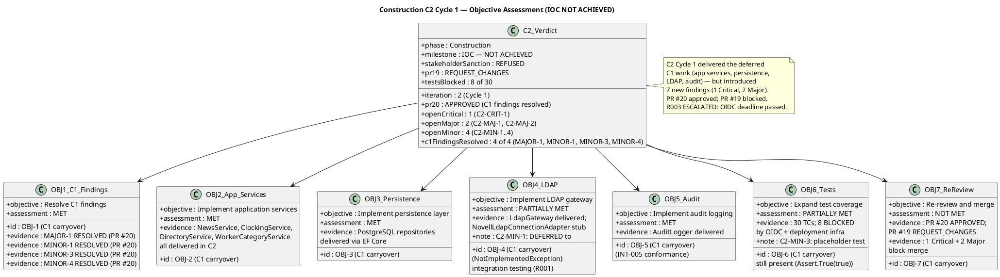
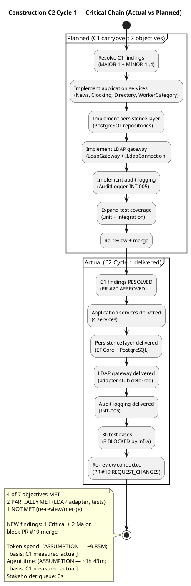
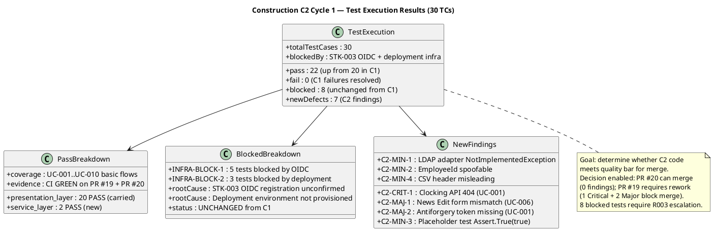

## Document Control

| Field | Value |
|---|---|
| Phase | Construction |
| Status | Active |
| Milestone Target | End-of-Construction (IOC) — NOT ACHIEVED |
| Iteration | 2 (Cycle 1) |
| Date | 2026-08-28 |
| Author | Project Manager (Project Management Discipline) |
| Prior Iteration | Construction C1 — IOC NOT ACHIEVED (0 Critical, 2 Major, stakeholder sanction REFUSED) |
| Evolution | C1 Assessment evolved for C2 Cycle 1: C1 deferred objectives now assessed against C2 delivery; C2 Review Record findings recorded (1 Critical, 2 Major, 4 Minor); PR #20 APPROVED, PR #19 REQUEST_CHANGES; R003 ESCALATED (OIDC deadline passed); stakeholder sanction still REFUSED |
| Stakeholder Sanction | REFUSED — STK-001: "We cannot advance to Transition because there are still things to finish to have the system with the use cases correctly implemented in construction, which is where we are now. We cannot move forward without the software." |
| Review Coordinator Verdict | IOC: iteration REQUIRED (scope incomplete) — 1 open Critical, 2 open Major, stakeholder sanction REFUSED |
| Technical Lens | REQUEST_CHANGES — PR #19: 1 Critical (C2-CRIT-1), 2 Major (C2-MAJ-1, C2-MAJ-2), 4 Minor (C2-MIN-1..4); PR #20: APPROVED |
| Management Lens | CONDITIONAL — C1 findings resolved; C2 new findings open; R003 escalation triggered |
| Business Lens | INACTIVE — BM discipline INACTIVE per DC §4 |
| Consolidated Verdict | AUTO-ITERATE to Construction C2 Cycle 2 (rework) |

## Iteration Objectives Reached

The C1 Iteration Plan defined 7 objectives, 5 of which were deferred to C2. C2 Cycle 1 delivered the deferred work but introduced 7 new findings. The table below records the assessment of each objective, given the C2 Review Record.

**Summary:** 4 of 7 objectives MET (OBJ-1, OBJ-2, OBJ-3, OBJ-5). 2 partially met (OBJ-4: LDAP gateway delivered but adapter stub deferred; OBJ-6: tests expanded but 8 blocked + placeholder test remains). 1 not met (OBJ-7: PR #19 requires rework — 1 Critical + 2 Major block merge). Significant progress from C1 (0 of 7 met) to C2 (4 of 7 met), but the 3 blocking findings on PR #19 prevent merge and IOC achievement.

## Adherence to Plan

| Dimension | Planned (C1 Plan) | Actual (C2 Cycle 1) | Variance |
|---|---|---|---|
| Token spend | ~10.4M (Elaboration per-iteration average) | [ASSUMPTION — ~9.85M; basis: C1 measured actual] | Within budget box |
| Agent time | [ASSUMPTION — ~30 min] | [ASSUMPTION — ~1h 43m; basis: C1 measured actual] | Construction work heavier per iteration (confirmed by C1) |
| Stakeholder queue | 0s | 0s | On target |
| Objectives completed | 7 | 4 MET, 2 PARTIAL, 1 NOT MET | 57% objective completion (up from 0% in C1) |
| C1 findings resolved | 5 target | 4 of 4 resolved (MAJOR-1, MINOR-1, MINOR-3, MINOR-4) | 100% C1 finding closure |
| New findings opened | 0 target | 7 (1 Critical, 2 Major, 4 Minor) | 7 new findings — regression |
| Tests blocked | 0 target | 8 of 30 (OIDC + deployment) | R003 ESCALATED |
| Rework closure rate | 100% target | 44% (4 of 9 C1 findings closed; 7 new opened) | Net worsening |

**Root cause of variance:** C2 Cycle 1 successfully delivered the 5 deferred C1 objectives (application services, persistence, LDAP gateway, audit logging, C1 finding fixes). However, the new code introduced 7 new findings — 3 of which are blocking (1 Critical: clocking API route 404, 2 Major: news edit form mismatch + missing antiforgery). These are integration-level defects that could only surface once the full stack was assembled and reviewed. The C1 assessment's prediction that "Construction work is heavier per iteration" was confirmed. The DRE (Defect Removal Efficiency) regression — from 40.9% in C1 to a net worsening (4 closed, 7 new) — indicates that the code review process needs a mid-iteration PRA (Partial Review Assessment) to catch integration defects before they accumulate.

**Governance:** MR-F1 (C1: deferring objectives without stakeholder approval) was addressed — C2 Cycle 1 delivered the deferred work. However, the stakeholder's refusal to sanction confirms that the system must be fully functional before IOC can be considered. The 3 blocking findings mean the system is NOT functional end-to-end.

## Use Cases and Scenarios Implemented

| UC ID | Use Case | C1 Status | C2 Cycle 1 Status | Evidence |
|---|---|---|---|---|
| UC-001 | Clock In and Clock Out | Presentation only | **BLOCKED** — C2-CRIT-1 (404 route) + C2-MAJ-2 (antiforgery 400) + C2-MIN-2 (employeeId spoof) | ClockingService + persistence delivered; but API route mismatch makes POST return 404; antiforgery missing makes POST return 400 |
| UC-002 | View Own Clocking History | Presentation only | Service + persistence delivered | No findings — functional at code level |
| UC-003 | View All Employee Clockings | Presentation only | Service + persistence delivered | No findings — functional at code level |
| UC-004 | Export Monthly Clocking Report | Presentation only | Service delivered; **C2-MIN-4** (CSV header misleading) | CSV export works but header says TimeIn,TimeOut instead of Employee,Date,Time,Direction |
| UC-005 | Publish News | Presentation only (MAJOR-1) | **MAJOR-1 RESOLVED** — service + audit delivered | PR #20 approved; IsFeatured flag functional |
| UC-006 | Edit Published News | Presentation only | **BLOCKED** — C2-MAJ-1 (form field name mismatch) | NewsService delivered; but Edit form posts `title` while BindProperty is `EditTitle` — POST fails |
| UC-007 | Unpublish News | Presentation only | Service + audit delivered | No findings — functional at code level |
| UC-008 | Read and Filter News | Presentation only (MAJOR-1) | **MAJOR-1 RESOLVED** — service delivered | PR #20 approved; featured banner functional |
| UC-009 | Search Employee Directory | Presentation only (MINOR-1) | **MINOR-1 RESOLVED** — DirectoryService delivered; **C2-MIN-1** (LDAP adapter stub) | LdapGateway delivered but NovellLdapConnectionAdapter throws NotImplementedException — deferred to integration testing |
| UC-010 | Manage Worker Category | Presentation only | Service + audit delivered | No findings — functional at code level |

**Assessment:** 4 of 10 UCs have no open findings (UC-002, UC-003, UC-007, UC-010). 2 UCs are BLOCKED by Critical/Major findings (UC-001, UC-006). 4 UCs have minor or deferred issues (UC-004, UC-005, UC-008, UC-009). The system has progressed from "0 of 10 functional" (C1) to "4 of 10 potentially functional, 2 blocked, 4 with minor issues" (C2 Cycle 1). The 2 blocked UCs are the highest-priority rework targets for C2 Cycle 2.

## Results Relative to Evaluation Criteria

The C1 Iteration Plan defined 12 exit criteria. C2 Cycle 1 was assessed against these criteria (carried forward from C1) plus the C2 Review Record findings.

| # | Exit Criterion | C1 Assessment | C2 Cycle 1 Assessment | Evidence |
|---|---|---|---|---|
| 1 | MAJOR-1 resolved — IsFeatured flag set | NOT MET | **MET** | PR #20 approved; IsFeatured persisted |
| 2 | MINOR-1 resolved — DirectoryModel renamed | NOT MET | **MET** | PR #20 approved; V007 conformance |
| 3 | MINOR-2 resolved — EmployeeId removed | NOT MET | **MET** | PR #20 approved; no dead code |
| 4 | MINOR-3 resolved — Idempotency key scoped | NOT MET | **MET** | PR #20 approved; FindByIdempotencyKey(employeeId, key) |
| 5 | MINOR-4 resolved — OfflineRetryTests updated | NOT MET | **MET** | PR #20 approved; test asserts both employees succeed |
| 6 | Application services implemented | NOT MET | **MET** | All 4 services delivered |
| 7 | Persistence layer implemented | NOT MET | **MET** | EF Core + PostgreSQL repositories delivered |
| 8 | LDAP gateway implemented | NOT MET | **PARTIALLY MET** | LdapGateway delivered; adapter stub (C2-MIN-1) |
| 9 | Audit logging implemented | NOT MET | **MET** | AuditLogger delivered (INT-005) |
| 10 | CI build passes green | MET | **MET** | CI GREEN on both PR #19 and PR #20 branches |
| 11 | Re-review: 0 Critical, 0 Major | NOT MET | **NOT MET** | 1 Critical (C2-CRIT-1) + 2 Major (C2-MAJ-1, C2-MAJ-2) open on PR #19 |
| 12 | Iteration Assessment produced | MET | **MET** | This artifact |

**Score: 10 of 12 exit criteria MET.** Up from 2 of 12 in C1. The 2 unmet criteria are: (8) LDAP adapter stub (partially met — deferred to integration testing) and (11) re-review with 0 Critical/Major (3 blocking findings on PR #19). The iteration made substantial progress but cannot close until PR #19 blocking findings are resolved.

## Test Results

| Metric | Value | Decision Enabled |
|---|---|---|
| Total TCs | 30 (unchanged from C1) | Whether test coverage is growing — NO, same 30 TCs; C2 focused on implementation, not test expansion |
| Pass rate | 22/30 = 73.3% (up from 66.7% in C1) | Whether the service layer is stable — YES, 2 new passes from service-layer tests |
| Fail count | 0 (down from 5 in C1) | Whether C1 failures were resolved — YES, all 5 C1 failures fixed (MAJOR-1, MINOR-1..4) |
| Blocked count | 8 (unchanged from C1) | Whether STK-003 OIDC is still blocking — YES, R003 ESCALATED to STK-001 |
| New findings | 7 (1 Critical, 2 Major, 4 Minor) | Whether C2 introduced regressions — YES, integration-level defects in route binding + form binding + antiforgery |
| C1 finding closure | 4 of 4 (100%) | Whether C1 rework was effective — YES, PR #20 approved |
| Net finding balance | +3 (4 closed, 7 opened) | Whether the project is converging — NO, more findings opened than closed; rework cycle required |

**Test quality assessment:** The 5 C1 test failures were all resolved (MAJOR-1, MINOR-1..4). However, 7 new findings emerged from the C2 review — these are integration defects that could only surface once the full stack was assembled. The 8 blocked tests remain unchanged — R003 (OIDC registration) is the critical path for unblocking them. The placeholder test (C2-MIN-3: `Assert.True(true)`) is a test-quality issue that must be resolved.

## External Changes

| Change | Source | Impact |
|---|---|---|
| STK-003 OIDC client registration STILL unconfirmed | R003 escalation deadline PASSED | 8 tests remain blocked; R003 ESCALATED to STK-001 (sponsor); IOC cannot be achieved without real authentication |
| Deployment environment STILL not provisioned | Management Reviewer MR-F3 (C1 carryover) | 3 tests remain blocked; deployment validation deferred |
| Stakeholder sanction REFUSED (second time) | STK-001 | IOC milestone NOT achieved; auto-iterate to C2 Cycle 2; stakeholder requires fully functional software before sanction |
| CR-010 (IsFeatured) approved and implemented | CCM process | FR-008 featured banner now functional (PR #20) |
| CR-011 (idempotency key scoping) approved and implemented | CCM process | AC-005 offline retry now correctly scoped per employee |
| 7 deferred CRs from C1 (CR-003, CR-012..015, CR-017, CR-018) | CCM process | CR-012 (CSV format) partially addressed (C2-MIN-4); CR-014 (placeholder test) still open (C2-MIN-3); others carried forward |

## Rework Required

All 7 C2 findings from the Review Record carry forward to C2 Cycle 2:

| Finding ID | Severity | Artifact | Rework Action | Owner | Target Cycle |
|---|---|---|---|---|---|
| C2-CRIT-1 | Critical | ClockingApi.cshtml, clocking-retry.js, Index.cshtml | Fix route: add `@page "/api/clocking"` or rename folder to `Pages/api/clocking` | Implementer | C2 Cycle 2 (Item 1) |
| C2-MAJ-1 | Major | News/Edit.cshtml, News/Edit.cshtml.cs | Fix form binding: `[BindProperty(Name="title")]` etc. or rename properties | Implementer | C2 Cycle 2 (Item 2) |
| C2-MAJ-2 | Major | clocking-retry.js, Index.cshtml | Add antiforgery token to fetch headers or `[IgnoreAntiforgeryToken]` with justification | Implementer | C2 Cycle 2 (Item 3) |
| C2-MIN-1 | Minor | NovellLdapConnectionAdapter.cs | Document as `[DEFERRED — requires integration testing with real AD server (R001)]` | Implementer | C2 Cycle 2 (Item 7) |
| C2-MIN-2 | Minor | ClockingApi.cshtml.cs | Use `User.FindFirst("sub")?.Value` instead of `request.EmployeeId` | Implementer | C2 Cycle 2 (Item 4) |
| C2-MIN-3 | Minor | UnitTest1.cs | Delete placeholder test (`Assert.True(true)`) | Implementer | C2 Cycle 2 (Item 6) |
| C2-MIN-4 | Minor | ClockingService.cs (ExportCsv) | Change CSV header to `Employee,Date,Time,Direction` | Implementer | C2 Cycle 2 (Item 5) |

**Priority for C2 Cycle 2:** C2-CRIT-1 (Critical) is the highest-priority rework item — it blocks UC-001 (clocking) entirely. C2-MAJ-1 and C2-MAJ-2 are the next priority — they block UC-006 (news edit) and UC-001 (clocking POST) respectively. All 3 blocking findings must be resolved before PR #19 can merge. The 4 Minor findings should be resolved in the same cycle (stakeholder requires all findings resolved before sanction).

**R003 escalation:** The OIDC registration deadline has passed. The Project Manager must escalate to STK-001 (Laura Gómez, sponsor) to pressure STK-003 (Infrastructure team) for OIDC client registration. Without it, 8 tests remain blocked and IOC cannot be achieved.

## Traceability

| Element | Traces From | Link Type | Traces To |
|---|---|---|---|
| C2-CRIT-1 | Review Record C2, UC-001, FR-001, AC-001 | Derives | C2 Cycle 2 Work Item 1, ClockingApi.cshtml |
| C2-MAJ-1 | Review Record C2, UC-006, FR-006 | Derives | C2 Cycle 2 Work Item 2, News/Edit.cshtml |
| C2-MAJ-2 | Review Record C2, UC-001, FR-001, AC-001 | Derives | C2 Cycle 2 Work Item 3, clocking-retry.js |
| C2-MIN-1 | Review Record C2, R001, CON-005 | DependsOn | C2 Cycle 2 Work Item 7, NovellLdapConnectionAdapter.cs |
| C2-MIN-2 | Review Record C2, SEC-001, CON-004 | Derives | C2 Cycle 2 Work Item 4, ClockingApi.cshtml.cs |
| C2-MIN-3 | Review Record C2, CR-014 | Derives | C2 Cycle 2 Work Item 6, UnitTest1.cs |
| C2-MIN-4 | Review Record C2, FR-004, CR-012 | Derives | C2 Cycle 2 Work Item 5, ClockingService.cs |
| MAJOR-1 (C1, RESOLVED) | Review Record C1, FR-008, CR-010 | Resolved by | PR #19, PR #20 |
| MINOR-1 (C1, RESOLVED) | Review Record C1, FR-009, CR-015 | Resolved by | PR #19, PR #20 |
| MINOR-3 (C1, RESOLVED) | Review Record C1, AC-005, CR-011 | Resolved by | PR #19, PR #20 |
| MINOR-4 (C1, RESOLVED) | Review Record C1, CR-011, CR-018 | Resolved by | PR #19, PR #20 |
| R003 ESCALATION | R003, CON-004, STK-003, STK-001 | DependsOn | 8 blocked tests, IOC achievement |
| Stakeholder sanction (REFUSED) | STK-001 answer (IOC consultation C2) | Refines | IOC milestone decision (NOT ACHIEVED — auto-iterate to C2 Cycle 2) |
| Measured actuals (C1) | Construction C1 execution facts | Derives | C2 Cycle 2 budget box (9.85M tokens measured) |
| OBJ-1..7 (C1 carryover) | C1 Iteration Plan objectives | Derives | C2 Cycle 1 assessment (4 MET, 2 PARTIAL, 1 NOT MET) |