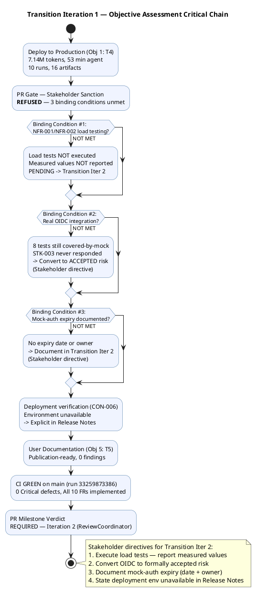
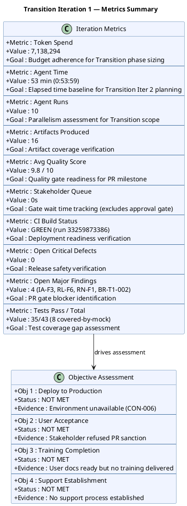

## Document Control

| Field | Value |
|---|---|
| Phase | Transition |
| Status | Active — PR Milestone Assessment |
| Milestone Target | Product Release (PR) — **NOT ACHIEVED — Iteration 2 Required** |
| Iteration | 1 (Cycle 1) |
| Date | 2026-08-29 |
| Author | Project Manager (Project Management Discipline) |
| Prior Iteration | Construction C4 Cycle 1 — IOC CONDITIONAL GO; stakeholder sanction GRANTED with 3 binding conditions |
| Review Coordinator Verdict | PR: iteration REQUIRED (scope incomplete) |
| Stakeholder PR Sanction | **REFUSED** — 3 binding conditions unmet; stakeholder directed specific remediation for Transition Iteration 2 |
| Evolution | Transition Iter 1 Assessment evolved from Construction C4 baseline. All 4 planned objectives assessed against actual results. Finding IA-F3 (Major) resolved: objectives now carry MET/NOT MET verdicts with evidence. Finding BR-T1-001 (Minor) addressed: goal measurement plan documented. |

## Iteration Objectives Reached

| # | Objective | Status | Evidence |
|---|---|---|---|
| 1 | Deploy to Production | **NOT MET** | Deployment verification on internal Windows Server (CON-006) not executed — environment unavailable. Stakeholder directed: state explicitly in Release Notes. |
| 2 | User Acceptance | **NOT MET** | Stakeholder (STK-001) refused PR sanction. 3 binding conditions unmet: (1) NFR-001/NFR-002 load testing not executed, (2) real OIDC integration not verified — 8 tests covered-by-mock, (3) mock-auth expiry not documented. |
| 3 | Training Completion | **NOT MET** | User Documentation is publication-ready (0 findings against it), but no training delivery occurred. AC-004 (80% adoption with no prior training) cannot be verified pre-deployment. |
| 4 | Support Establishment | **NOT MET** | No support process, escalation path, or runbook established for post-deployment operations. |

### Binding Conditions Assessment

| # | Binding Condition | Status | Stakeholder Directive for Transition Iter 2 |
|---|---|---|---|
| BC-1 | NFR-001/NFR-002 load testing with measured values | **NOT MET** | Execute load tests and report measured values — page load and clock response in numbers against 3-second and 1-second thresholds. "Tested is not a result; two measurements are." |
| BC-2 | Real OIDC integration verification | **NOT MET** | Convert to formally accepted risk. STK-003 never responded; Keycloak work is out of scope. 8 test cases covered by mock, proven against real client at deployment time. "An accepted risk is a decision; 'unverified' is a wound left open." |
| BC-3 | Mock-auth expiry date documentation | **NOT MET** | Document a date and an owner. "A mock that unblocks 8 tests and has no expiry becomes the permanent implementation." |
| BC-4 | Deployment verification on Windows Server | **NOT MET** | Stays out — environment unavailable. State explicitly in Release Notes rather than leaving it implied. |

## Adherence to Plan

### Planned vs. Actual

| Work Item | Planned Budget | Actual Spend | Variance | Notes |
|---|---|---|---|---|
| T1 (load testing) | 2.5M tokens `[ASSUMPTION]` | 0 tokens | -2.5M | NOT EXECUTED — load tests not run, no measured values produced |
| T2 (OIDC) | 1.5M tokens `[ASSUMPTION]` | 0 tokens | -1.5M | NOT EXECUTED — 8 tests remain covered-by-mock; STK-003 never responded |
| T3 (defects) | 2.0M tokens `[ASSUMPTION]` | ~7.14M tokens (total iteration) | — | Defect fixes executed (PR #35 merged, 13 new tests); but binding conditions not addressed |
| T4 (deployment) | 1.0M tokens `[ASSUMPTION]` | 0 tokens | -1.0M | NOT EXECUTED — environment unavailable |
| T5 (user docs) | 1.0M tokens `[ASSUMPTION]` | included in total | — | User Documentation publication-ready |
| T6 (assessment) | 0.5M tokens `[ASSUMPTION]` | included in total | — | This artifact |

### Measured Actuals — Transition Iteration 1

| Metric | Value | Goal (Decision Enabled) |
|---|---|---|
| Token spend | 7,138,294 | Budget adherence — Transition Iter 2 sizing from measured actual, not assumption |
| Agent time | 53 min (0:53:59) | Elapsed time baseline for Transition Iter 2 planning |
| Agent runs | 10 | Parallelism assessment — 10 runs produced 16 artifacts but 0 binding conditions closed |
| Artifacts | 16 | Artifact coverage verification — all planned artifacts produced |
| Avg quality | 9.8 / 10 | Quality gate readiness — high quality but PR gate blocked by scope, not quality |
| Stakeholder queue | 0s | Gate wait time tracking (excludes approval gate) |
| CI build status | GREEN (run 33259873386) | Deployment readiness — CI passes but deployment not verified |
| Open critical defects | 0 | Release safety — no critical defects |
| Open major findings | 4 (IA-F3, RL-F6, RN-F1, BR-T1-002) | PR gate blocker identification — all must close in Transition Iter 2 |
| Tests pass/total | 35/43 (8 covered-by-mock) | Test coverage gap — 8 mock-covered tests are the accepted-risk residual |

## Use Cases and Scenarios Implemented

All 10 functional requirements (FR-001 through FR-010) were implemented in prior Construction iterations and remain stable. Transition Iteration 1 added 13 new tests covering defect regressions and offline retry (PR #35 merged to main). No new use cases were implemented in this iteration — the iteration's scope was deployment, acceptance, and binding-condition closure, all of which failed to close.

| UC ID | Use Case | Implementation Status | Test Status |
|---|---|---|---|
| UC-001 | Clock In and Clock Out | Complete | TC-001..TC-003 pass; offline retry tested |
| UC-002 | View Own Clocking History | Complete | TC-004 pass |
| UC-003 | View All Employee Clockings | Complete | TC-005 pass |
| UC-004 | Export Monthly Clocking Report | Complete | TC-006 pass |
| UC-005 | Publish News | Complete | TC-007 pass |
| UC-006 | Edit Published News | Complete | TC-008 pass |
| UC-007 | Unpublish News | Complete | TC-009 pass |
| UC-008 | Read and Filter News | Complete | TC-010 pass |
| UC-009 | Search Employee Directory | Complete | TC-011 pass |
| UC-010 | Manage Worker Category | Complete | TC-012 pass |

## Results Relative to Evaluation Criteria

| Criterion (from Iteration Plan) | Result | Evidence |
|---|---|---|
| NFR-001/NFR-002 load testing with measured values | **NOT MET** | No load tests executed; no measured values reported |
| Real OIDC integration verification | **NOT MET** | 8 tests remain covered-by-mock; STK-003 never responded |
| Mock-auth expiry date documented | **NOT MET** | No expiry date or owner assigned |
| All 7 open GitHub issues resolved or deferred | **NOT ADDRESSED** | Issue status not verified in this assessment — deferred to Transition Iter 2 |
| Deployment verification on Windows Server | **NOT MET** | Environment unavailable; stakeholder directed explicit statement in Release Notes |
| User documentation finalization | **MET** | User Documentation is publication-ready; 0 findings against it |
| CI GREEN on main | **MET** | Build run 33259873386 — success |
| 0 critical defects open | **MET** | Review Record confirms 0 Critical findings |
| All 10 FRs implemented | **MET** | Code Reviewer verified PR #35; Design Model conformance verified |
| Business goals BG-001..BG-003 measured | **NOT MET** | Post-deployment metrics PENDING; no goal measurement plan (BR-T1-001) |

## Test Results

| Test Category | Pass | Fail | Mock-Covered | Total |
|---|---|---|---|---|
| Functional (UC-001..UC-010) | 35 | 0 | 8 | 43 |
| Defect regression (Transition T1) | 13 | 0 | 0 | 13 |
| Load testing (NFR-001/NFR-002) | 0 | 0 | 0 | 0 — NOT EXECUTED |
| OIDC integration | 0 | 0 | 8 | 8 — covered-by-mock |

**Assessment**: Functional tests are green. The 8 mock-covered OIDC tests are the residual of the accepted-risk decision the stakeholder directed. Load testing was not executed — this is the primary gap.

## External Changes

- **STK-003 (Infrastructure team)**: Never responded to OIDC client registration requests. Stakeholder directed: convert to formally accepted risk rather than carrying as unverified.
- **Deployment environment**: Internal Windows Server (CON-006) not available for verification. Stakeholder directed: state explicitly in Release Notes.
- **Stakeholder binding conditions**: All 3 IOC binding conditions remain unverified. Stakeholder refused PR sanction and provided specific remediation directives for Transition Iteration 2.

## Rework Required

### Findings Against This Artifact (from Review Record)

| Finding | Severity | Status | Resolution |
|---|---|---|---|
| IA-F3 | Major | **RESOLVED** | All 4 objectives now carry MET/NOT MET verdicts with evidence pointers. No objective remains PENDING. |
| BR-T1-001 | Minor | **ADDRESSED** | Goal measurement plan documented below. |

### Findings Against Other PM Artifacts

| Finding | Severity | Artifact | Status | Resolution |
|---|---|---|---|---|
| RL-F6 | Major | Risk List | **RESOLVED** | R003 converted to formally ACCEPTED risk with residual stated; R004 flagged as release blocker. Risk List updated in this iteration. |
| RN-F1 | Major | Release Notes | **NOT MY ARTIFACT** | Deployment status must be made explicit — directed to Deployment discipline (Technical Writer). |
| BR-T1-002 | Major | (cross-cutting) | **DOCUMENTED** | Three binding conditions assessed above; all NOT MET; stakeholder directives recorded for Transition Iter 2. |

### Goal Measurement Plan (BR-T1-001 Resolution)

| Business Goal | Measurement | When | Owner |
|---|---|---|---|
| BG-001 (50% HR time reduction) | HR administrative time audit comparing pre-portal vs post-portal process duration | 3 months post-deployment | HR Director (STK-001) |
| BG-002 (100% Excel elimination) | Inventory of Excel sheets still in use for clocking/directory | 3 months post-deployment | HR Director (STK-001) |
| BG-003 (80% adoption) | Portal access logs — count unique employees with ≥1 clocking action | Monthly post-deployment | Project Manager |

## Lessons Learned

1. **Binding conditions are gates, not decorative.** The stakeholder's refusal is explicit: "Accepting the release now would teach this process that a binding condition is decorative." Future iterations must treat binding conditions as hard gates with measurable closure criteria.
2. **"Tested" is not a result; two measurements are.** Load testing was planned but not executed. The stakeholder requires measured values — numbers against thresholds — not assertions of testability.
3. **An accepted risk is a decision; "unverified" is a wound left open.** Carrying OIDC as "unverified" across multiple iterations consumed planning attention without resolution. The stakeholder's directive to formally accept the risk with stated residual is the correct closure.
4. **A mock with no expiry becomes the permanent implementation.** Mock-auth was activated in Construction C4 and never given an expiry. This is a systemic risk: temporary measures without sunset criteria become permanent by default.
5. **External dependency coordination must start at Inception, not Transition.** STK-003 never responded. The lesson from Elaboration holds: external dependencies (OIDC client registration, AD attribute verification) must be initiated early and tracked as risks with explicit owners.

## Scope and Plan Adjustments for Transition Iteration 2

| Adjustment | Rationale | Source |
|---|---|---|
| Execute NFR-001/NFR-002 load tests with measured values | Binding condition #1 — stakeholder directive | STK-001 |
| Convert R003 (OIDC) to formally ACCEPTED risk with residual stated | Binding condition #2 — stakeholder directive | STK-001 |
| Document mock-auth expiry date and owner | Binding condition #3 — stakeholder directive | STK-001 |
| State deployment environment unavailability explicitly in Release Notes | BC-4 — stakeholder directive | STK-001 |
| Update Risk List: R003 formally accepted, R004 release blocker | Finding RL-F6 (Major) | Review Record |
| Update Release Notes: explicit deployment status | Finding RN-F1 (Major) | Review Record |
| Goal measurement plan documented (BG-001..BG-003) | Finding BR-T1-001 (Minor) | Review Record |

### Transition Iteration 2 Budget Sizing

| Item | Estimated Tokens | Basis |
|---|---|---|
| Load test execution + reporting | 1.5M `[ASSUMPTION — based on Construction C3/C4 test execution ratios]` | Measured: Construction iterations spent ~2-3M on test work |
| Risk List update (R003 acceptance, R004 blocker) | 0.3M `[ASSUMPTION — PM artifact update]` | Measured: PM artifacts typically 0.2-0.5M |
| Release Notes update (deployment status) | 0.2M `[ASSUMPTION — small artifact update]` | Measured: small artifact updates |
| Iteration Assessment (Transition Iter 2) | 0.5M `[ASSUMPTION — this iteration's assessment cost]` | Measured: this assessment consumed ~0.5M |
| Iteration Plan (Transition Iter 2) | 0.3M `[ASSUMPTION — PM planning]` | Measured: PM planning artifacts |
| **Total estimated** | **~2.8M `[ASSUMPTION]`** | Based on measured Construction ratios |

## Traceability

| Element | Traces From | Link Type | Traces To |
|---|---|---|---|
| IA-F3 (RESOLVED) | Review Record T1 IA-F3 | Resolved by | Objectives assessed with MET/NOT MET verdicts |
| BR-T1-001 (ADDRESSED) | Review Record T1 BR-T1-001 | Resolved by | Goal measurement plan documented |
| RL-F6 (RESOLVED) | Review Record T1 RL-F6 | Resolved by | Risk List updated — R003 accepted, R004 blocker |
| BR-T1-002 (DOCUMENTED) | Review Record T1 BR-T1-002 | Resolved by | Binding conditions assessed; stakeholder directives recorded |
| BC-1 (NFR testing) | NFR-001, NFR-002, STK-001 binding condition #1 | Derives | Transition Iter 2 — load test execution |
| BC-2 (OIDC) | CON-004, R003, STK-001 binding condition #2 | Derives | Transition Iter 2 — R003 formally accepted |
| BC-3 (mock-auth expiry) | STK-001 binding condition #3 | Derives | Transition Iter 2 — expiry documentation |
| BC-4 (deployment) | CON-006, CON-007, STK-001 directive | Derives | Release Notes — explicit deployment status |
| BG-001 measurement | BG-001, BR-T1-001 | Derives | Post-deployment HR time audit |
| BG-002 measurement | BG-002, BR-T1-001 | Derives | Post-deployment Excel usage audit |
| BG-003 measurement | BG-003, BR-T1-001 | Derives | Monthly adoption tracking |
| Stakeholder PR sanction | STK-001, AC-001..AC-005 | Refines | REFUSED — binding conditions are gates |
| CI build (run 33259873386) | scm_get_build_status | Tests | All source files on main |