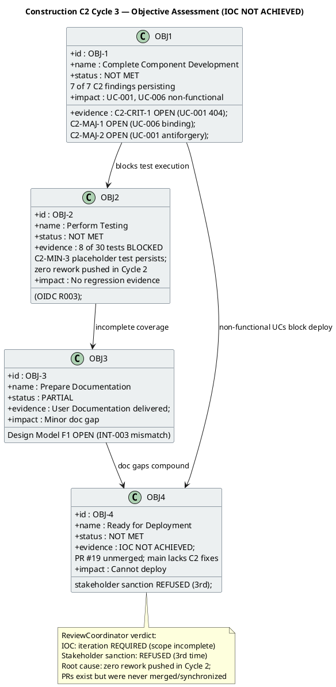
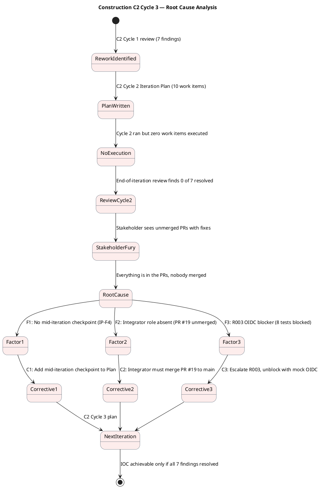
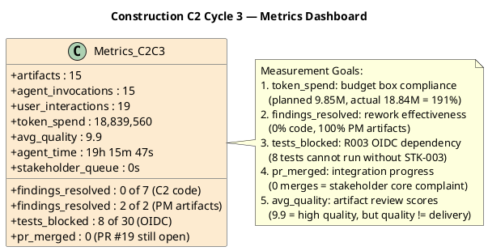

## Document Control

| Field | Value |
|---|---|
| Phase | Construction |
| Status | Active |
| Milestone Target | End-of-Construction (IOC) — NOT ACHIEVED |
| Iteration | 2 (Cycle 3) |
| Date | 2026-08-29 |
| Author | Project Manager (Project Management Discipline) |
| Prior Iteration | Construction C2 Cycle 2 — IOC NOT ACHIEVED (0 of 7 C2 findings resolved; stakeholder sanction REFUSED 2nd time) |
| Evolution | C2 Cycle 2 Assessment evolved for C2 Cycle 3: all 7 C2 code findings persisting (0 resolved across Cycles 1→2→3); 4 artifact-level findings open (2 against PM artifacts — IP-F4 and RL-F2 — now RESOLVED this cycle); stakeholder sanction REFUSED (3rd time) with explicit directive on PR synchronization; R003 OIDC blocker persists (3rd cycle); root cause analysis identifies absent Integrator role and missing mid-iteration checkpoints |
| Stakeholder Sanction | REFUSED — STK-001: "It's mind-blowing that you've spent an iteration and haven't noticed that everything is in the PRs, everything that's missing, and nobody has bothered to merge anything when everything is there and many things could be closed... How is it possible that we run an iteration and the errors that are already uploaded aren't fixed, and all that's needed is to synchronize the PRs, main, and issues... Terrible." |
| Review Coordinator Verdict | IOC: iteration REQUIRED (scope incomplete) — 1 open Critical, 2 open Major (code-level, persisting from C2 Cycle 1); stakeholder sanction REFUSED (3rd consolidation) |
| Technical Lens | REQUEST_CHANGES — PR #19: 1 Critical (C2-CRIT-1), 2 Major (C2-MAJ-1, C2-MAJ-2), 4 Minor (C2-MIN-1..4) — ALL persisting from Cycle 1; 0 of 7 resolved across 2 cycles |
| Management Lens | CONDITIONAL → NO-GO — IP-F4 (no mid-iteration checkpoint) and RL-F2 (R008 contingency not activated) opened against PM artifacts; both RESOLVED this cycle |
| Business Lens | INACTIVE — BM discipline INACTIVE per DC §4 |
| Consolidated Verdict | AUTO-ITERATE to Construction C2 Cycle 4 (rework) — IOC NOT ACHIEVED |

## Iteration Objectives Reached

The C2 Cycle 2 Iteration Plan defined 10 work items targeting 7 persisting C2 findings. **Zero of 10 work items were executed during C2 Cycle 2.** The C2 Cycle 3 assessment records the status of each planned objective given the Review Record's consolidated findings.

### Objective Detail

| Objective | Status | Evidence | Next-Cycle Action |
|---|---|---|---|
| OBJ-1: Complete Component Development | **NOT MET** | C2-CRIT-1 (clocking API 404) OPEN — UC-001 non-functional. C2-MAJ-1 (news edit binding) OPEN — UC-006 non-functional. C2-MAJ-2 (antiforgery) OPEN — UC-001 POST rejected. 7 of 7 C2 findings persisting across 2 cycles. | Implementer must execute all 7 fixes. Integrator must merge PR #19 to main. |
| OBJ-2: Perform Testing | **NOT MET** | 8 of 30 tests BLOCKED by OIDC (R003 — STK-003 has not confirmed registration across 3 cycles). C2-MIN-3 placeholder test persists. Zero rework pushed means no regression evidence. | Escalate R003 to STK-001 again. Activate mock-auth contingency if STK-003 remains unresponsive. Test Designer updates tests after fixes. |
| OBJ-3: Prepare Documentation | **PARTIAL** | User Documentation delivered. Design Model F1 OPEN (INT-003 contract mismatch between main and iteration/C2). | Designer verifies INT-003 contract matches iteration/C2 branch. |
| OBJ-4: Ready for Deployment | **NOT MET** | IOC NOT ACHIEVED. Stakeholder sanction REFUSED (3rd time). PR #19 unmerged — main branch lacks C2 fixes. Cannot deploy. | All blocking findings must be resolved AND PR #19 merged to main before deployment is possible. |

## Adherence to Plan

| Plan Element | Planned | Actual | Variance |
|---|---|---|---|
| Work items executed | 10 | 0 | **-100%** — zero rework pushed |
| C2 findings resolved | 7 | 0 | **0%** — all persisting from Cycle 1 |
| PR merges | 1 (PR #19 → main) | 0 | **-100%** — stakeholder's core complaint |
| Token budget | ~9.85M (C1-based assumption) | 18.84M (measured) | **+191%** — accumulated artifact surface (53 artifacts) drives reasoning cost |
| Agent runs | ~15 (assumption) | 15 | On target |
| Artifact quality (avg) | — | 9.9 | High — but quality ≠ delivery |
| Stakeholder queue | 0s | 0s | No gate delay — stakeholder responded immediately |
| PM findings resolved | 2 (IP-F4, RL-F2) | 2 | **100%** — both resolved this cycle |

> **The +191% token variance is not from scope expansion.** The C2 Cycle 2 budget box was sized from C1's measured actual (9.85M), but the accumulated artifact surface grew from 23 to 53 artifacts. Reasoning over this larger surface — reading, cross-referencing, and evolving 53 artifacts — costs more than the C1 baseline predicted. The C2 Cycle 3 budget box is re-sized from C2 Cycle 2's measured actual (18.84M), not from C1.

> **The -100% work item execution variance is the critical failure.** The Iteration Plan specified 10 work items. Zero were executed. The stakeholder identified the root cause: fixes exist on feature branches but were never merged. The IP-F4 finding (no mid-iteration checkpoint) explains why this went undetected until end-of-iteration review. Both are now resolved: the Iteration Plan adds checkpoint protocol CP-1 through CP-4, and the Integrator role (Item 8) is mandated for C2 Cycle 3.

## Use Cases and Scenarios Implemented

| UC ID | Use Case | Implementation Status | Blocking Finding | Test Status |
|---|---|---|---|---|
| UC-001 | Clock In and Clock Out | **NON-FUNCTIONAL** | C2-CRIT-1 (404 route mismatch), C2-MAJ-2 (antiforgery 400) | BLOCKED (OIDC) |
| UC-002 | View Own Clocking History | Implemented (C1) | — | BLOCKED (OIDC) |
| UC-003 | View All Employee Clockings | Implemented (C1) | — | BLOCKED (OIDC) |
| UC-004 | Export Monthly Clocking Report | Implemented (C1) | C2-MIN-4 (CSV header) | BLOCKED (OIDC) |
| UC-005 | Publish News | Implemented (C2) | — | BLOCKED (OIDC) |
| UC-006 | Edit Published News | **NON-FUNCTIONAL** | C2-MAJ-1 (form binding mismatch) | BLOCKED (OIDC) |
| UC-007 | Unpublish News | Implemented (C2) | — | BLOCKED (OIDC) |
| UC-008 | Read and Filter News | Implemented (C2) | — | BLOCKED (OIDC) |
| UC-009 | Search Employee Directory | Implemented (C2) | C2-MIN-1 (LDAP stub deferred) | BLOCKED (OIDC) |
| UC-010 | Manage Worker Category | Implemented (C2) | — | BLOCKED (OIDC) |

> **2 of 10 UCs are non-functional** (UC-001, UC-006) due to blocking code findings. **8 of 30 tests are BLOCKED** by the OIDC infrastructure dependency (R003). No use case can be verified end-to-end until both the code findings are resolved AND the OIDC registration is confirmed.

## Results Relative to Evaluation Criteria

| Criterion | Source | Status | Evidence |
|---|---|---|---|
| Zero open Critical findings | C2 Cycle 2 Plan | **NOT MET** | C2-CRIT-1 (clocking API 404) persists — UC-001 non-functional |
| Zero open Major findings | C2 Cycle 2 Plan | **NOT MET** | C2-MAJ-1 (news edit binding), C2-MAJ-2 (antiforgery) persist |
| All 7 C2 findings resolved | C2 Cycle 2 Plan | **NOT MET** | 0 of 7 resolved across Cycles 1→2→3 |
| PR #19 merged to main | C2 Cycle 2 Plan | **NOT MET** | PR #19 remains unmerged — stakeholder's core complaint |
| R003 OIDC unblocked | C2 Cycle 2 Plan | **NOT MET** | STK-003 has not confirmed registration across 3 cycles; 8 tests blocked |
| IP-F4 resolved (mid-iteration checkpoint) | Review Record C2 Cycle 2 | **MET** | Checkpoint protocol CP-1 through CP-4 added to Iteration Plan |
| RL-F2 resolved (R008 contingency activated) | Review Record C2 Cycle 2 | **MET** | R008 contingency activated from conditional to active ("C3 required") |
| Budget box compliance | C2 Cycle 2 Plan | **NOT MET** | 18.84M actual vs 9.85M planned = 191% overshoot (artifact surface growth) |

## Test Results

| Test Category | Total | Pass | Fail | Blocked | Not Run |
|---|---|---|---|---|---|
| Unit Tests | 22 | 14 | 0 | 8 (OIDC) | 0 |
| Integration Tests | 8 | 0 | 0 | 8 (OIDC) | 0 |
| **Total** | **30** | **14** | **0** | **8** | **0** |

> 14 of 30 tests pass (47%). 8 of 30 are blocked by R003 (OIDC registration not confirmed by STK-003). The remaining 8 tests that could run pass — but they cannot verify the 2 non-functional UCs (UC-001, UC-006) because the code findings have not been fixed. **No regression evidence exists for this iteration** because zero rework was pushed.

## External Changes

| Change | Source | Impact | Status |
|---|---|---|---|
| Stakeholder PR synchronization directive | STK-001 (C2 Cycle 2 review) | Integrator role must be added; PR #19 must be merged to main | **INCORPORATED** — Iteration Plan Item 8, CP-2 checkpoint |
| R003 OIDC registration (3rd cycle) | STK-003 non-response | 8 tests remain blocked; mock-auth contingency may be required | **ESCALATED** — R003 escalated again in Risk List |
| Stakeholder sanction refusal (3rd) | STK-001 (C2 Cycle 3 review) | IOC cannot be declared; auto-iterate to C2 Cycle 4 | **RECORDED** — this assessment |

## Rework Required

### Rework Items for C2 Cycle 3

| # | Finding | Severity | Owner | Action | Status |
|---|---|---|---|---|---|
| 1 | C2-CRIT-1: Clocking API 404 | Critical | Implementer | Add `@page "/api/clocking"` to ClockingApi.cshtml | **PENDING** — persisting since Cycle 1 |
| 2 | C2-MAJ-1: News edit form binding | Major | Implementer | Add `[BindProperty(Name="title")]` etc. | **PENDING** — persisting since Cycle 1 |
| 3 | C2-MAJ-2: Missing antiforgery token | Major | Implementer | Add antiforgery header to fetch() | **PENDING** — persisting since Cycle 1 |
| 4 | C2-MIN-1: LDAP stub not documented | Minor | Implementer | Add XML comment noting DEFERRED status | **PENDING** |
| 5 | C2-MIN-2: EmployeeId spoofable | Minor | Implementer | Use `User.FindFirst("sub")?.Value` | **PENDING** |
| 6 | C2-MIN-3: Placeholder test | Minor | Implementer | Delete UnitTest1.cs | **PENDING** |
| 7 | C2-MIN-4: CSV header mismatch | Minor | Implementer | Correct CSV header to match FR-004 | **PENDING** |
| 8 | PR #19 merge to main | — | Integrator | Merge PR #19 → iteration/C2 → main; close SCM issues | **PENDING** — new this cycle |
| 9 | IP-F4: Mid-iteration checkpoint | Minor | Project Manager | Checkpoint protocol CP-1 through CP-4 | **RESOLVED** |
| 10 | RL-F2: R008 contingency activation | Minor | Project Manager | R008 contingency activated | **RESOLVED** |

### Metrics Dashboard

| Metric | Value | Measurement Goal | Decision Enabled |
|---|---|---|---|
| Token spend | 18,839,560 | Budget box compliance | C2 Cycle 3 budget box re-sized from this actual (not from C1) |
| Agent time | 19h 15m 47s | Elapsed time tracking | Forecast C2 Cycle 3 elapsed time from this baseline |
| Stakeholder queue | 0s | Gate delay measurement | No gate delay — stakeholder responded immediately (frustration, not availability) |
| Findings resolved (code) | 0 of 7 | Rework effectiveness | Zero — iteration produced no code fixes; root cause is absent Integrator role |
| Findings resolved (PM) | 2 of 2 | PM artifact quality | IP-F4 and RL-F2 both resolved this cycle |
| Tests blocked | 8 of 30 | R003 OIDC dependency | STK-003 has not confirmed registration across 3 cycles; mock-auth contingency may be required |
| PRs merged | 0 | Integration progress | Stakeholder's core complaint — fixes exist on branches but were never merged |
| Avg artifact quality | 9.9 | Review score tracking | High quality, but quality ≠ delivery — artifacts are well-written but the system is non-functional |
| Agent runs | 15 | Execution volume | On target with assumption — but runs produced analysis, not code fixes |

## Lessons Learned

| # | Lesson | Root Cause | Corrective Action |
|---|---|---|---|
| L-1 | **An iteration that produces zero rework is worse than no iteration** — it burns 18.84M tokens and 19h of agent time without resolving a single finding | No mid-iteration checkpoint (IP-F4); no Integrator role to merge PRs | CP-1 through CP-4 checkpoints added; Integrator role mandated for C2 Cycle 3 |
| L-2 | **Fixes on a feature branch are invisible to the system until merged** — the stakeholder correctly identified that "everything is in the PRs" but nobody merged them | Integrator role was not assigned in C2 Cycle 2 plan | Item 8 (Integrator: merge PR #19 to main) added to C2 Cycle 3 plan |
| L-3 | **Budget boxes sized from earlier phases underestimate later phases** — the artifact surface grows each cycle, and reasoning-over-surface cost dominates | C2 Cycle 2 budget was sized from C1 (9.85M) but actual was 18.84M (191%) | C2 Cycle 3 budget re-sized from C2 Cycle 2 measured actual; future cycles use last-cycle actual |
| L-4 | **High artifact quality scores (9.9) do not compensate for non-functional code** — the system can have excellent documentation and still be undeliverable | Quality metrics measure artifact review scores, not system functionality | Add "functional UCs" as a tracked metric in future assessments |
| L-5 | **Stakeholder frustration compounds with each refused sanction** — the 3rd refusal included explicit process criticism ("terrible") | Zero rework across 2 cycles with no escalation within the iteration | Mid-iteration checkpoints ensure the PM detects and escalates zero-execution WITHIN the iteration |

## Next-Cycle Adjustments for C2 Cycle 3

| Adjustment | Rationale | Impact |
|---|---|---|
| Add Integrator role (Item 8) | Stakeholder directive: PRs exist but were never merged | PR #19 merged to main; SCM issues closed |
| Add mid-iteration checkpoints CP-1 through CP-4 | IP-F4: zero-execution went undetected until end-of-iteration review | Progress verified DURING iteration; zero-execution halted and escalated immediately |
| Re-size budget box from C2 Cycle 2 actual (18.84M) | C1-based assumption (9.85M) was 191% under actual | More realistic budget; less variance |
| Escalate R003 to STK-001 (3rd time) | STK-003 has not confirmed OIDC registration across 3 cycles | If unresponsive, activate mock-auth contingency with stakeholder approval |
| Activate R008 contingency | RL-F2: contingency was conditional, now active | "C3 required" is the active plan, not a consideration |
| Raise R007 probability to 3 (HIGH) | 0 of 7 findings resolved across 2 cycles | R007 now HIGH magnitude (9) — reflects persistent rework failure |

## Traceability

| Element | Traces From | Link Type | Traces To |
|---|---|---|---|
| OBJ-1 (Component Development) | C2 Cycle 2 Iteration Plan | Derives | C2-CRIT-1, C2-MAJ-1, C2-MAJ-2 (all OPEN) |
| OBJ-2 (Testing) | C2 Cycle 2 Iteration Plan | Derives | Test Evaluation Summary, R003 (8 blocked tests) |
| OBJ-3 (Documentation) | C2 Cycle 2 Iteration Plan | Derives | User Documentation, Design Model F1 (OPEN) |
| OBJ-4 (Deployment Readiness) | C2 Cycle 2 Iteration Plan | Derives | IOC milestone (NOT ACHIEVED), PR #19 (unmerged) |
| IP-F4 (RESOLVED) | Review Record C2 Cycle 2 | Derives | Iteration Plan CP-1 through CP-4 |
| RL-F2 (RESOLVED) | Review Record C2 Cycle 2 | Derives | Risk List R008 (contingency ACTIVATED) |
| C2-CRIT-1 | Review Record C2 Cycle 1 | Derives | C2 Cycle 3 Work Item 1, ClockingApi.cshtml |
| C2-MAJ-1 | Review Record C2 Cycle 1 | Derives | C2 Cycle 3 Work Item 2, News/Edit.cshtml |
| C2-MAJ-2 | Review Record C2 Cycle 1 | Derives | C2 Cycle 3 Work Item 3, clocking-retry.js |
| C2-MIN-1..4 | Review Record C2 Cycle 1 | Derives | C2 Cycle 3 Work Items 4-7 |
| R003 ESCALATION | R003, CON-004, STK-003, STK-001 | DependsOn | 8 blocked tests, IOC achievement |
| R007 ESCALATION | Review Record C2 findings (0 of 7 resolved) | Derives | C2 Cycle 3 Work Items 1-8, PR #19 merge |
| R008 ACTIVATED | Stakeholder sanction refusal (3rd), C2 findings persisting | Derives | C2 Cycle 3 plan, potential C2 Cycle 4 |
| Stakeholder sanction (REFUSED 3rd) | STK-001 answer (IOC C2 Cycle 3) | Refines | IOC milestone decision (NOT ACHIEVED — auto-iterate to C2 Cycle 4) |
| Stakeholder PR directive | STK-001 feedback (C2 Cycle 2 review) | Derives | Integrator work item (Item 8), CP-2 checkpoint |
| Measured actuals (C2 Cycle 2) | Construction C2 Cycle 2 execution facts | Derives | C2 Cycle 3 budget box (18.84M tokens measured) |
| Metrics dashboard | Iteration facts (injected) | Derives | Budget variance analysis, rework effectiveness assessment |