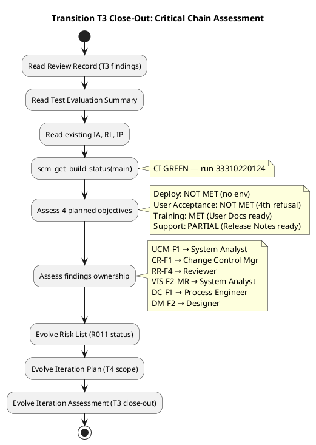
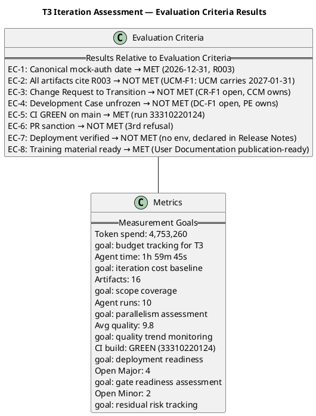

## Document Control

| Field | Value |
|---|---|
| Phase | Transition |
| Status | Active — Transition Iter 3 Close-Out Assessment (T3 → T4 auto-iterate) |
| Milestone Target | Product Release (PR) — **NOT YET ACHIEVED — stakeholder sanction REFUSED (3rd); T4 required** |
| Iteration | 3 (Cycle 1) |
| Date | 2026-08-30 |
| Author | Project Manager (Project Management Discipline) |
| Prior Iteration | Transition Iter 2 — PR sanction REFUSED (2nd); binding conditions substantively met; mock-auth date inconsistent across 7 artifacts; 4 open Major findings |
| Review Coordinator Verdict (T3) | PR: iteration REQUIRED (scope incomplete) |
| Stakeholder PR Sanction (T1) | **REFUSED** — 3 binding conditions unmet |
| Stakeholder PR Sanction (T2) | **REFUSED** — binding conditions met; mock-auth date inconsistent (3 dates, 2 owners); 3 stakeholder directives for T3 |
| Stakeholder PR Sanction (T3) | **REFUSED (3rd)** — canonicalization correct but incomplete: UCM still carries 2027-01-31 + STK-003; CR-F1 and DC-F1 persist (owned by CCM and PE, not PM); stakeholder directed grep-verify of all artifacts for literal mock-auth dates |
| Evolution | T3 Assessment evolved from T2. RR-F1 RESOLVED — canonical mock-auth date established (2026-12-31, Software Architect, Risk List R003). MR-T2-002 RESOLVED — cross-artifact canonical-value protocol defined. RL-F6 CLOSED. TC-F3 RESOLVED. SS-F1 RESOLVED. NEW finding UCM-F1 (Major): Use-Case Model still carries 2027-01-31 + STK-003 — owned by System Analyst, NOT PM. CR-F1 persists — owned by Change Control Manager. DC-F1 persists — owned by Process Engineer. DM-F2 persists — owned by Designer. All 3 binding conditions remain MET. |

## Iteration Objectives Reached

| # | Objective | Status | Evidence |
|---|---|---|---|
| 1 | Deploy to Production | **NOT MET** | Deployment on Windows Server (CON-006) NOT PERFORMED — no environment available. Explicitly stated in Release Notes per STK-001 directive. CI is GREEN on main (run 33310220124). Code is deployment-ready but unverified on target infrastructure. |
| 2 | User Acceptance | **NOT MET (4th refusal)** | PR sanction REFUSED (3rd refusal) in T3. Canonicalization of mock-auth date was correct (2026-12-31, Risk List R003) but did not reach all artifacts — UCM-F1 (Major): Use-Case Model still carries 2027-01-31 + STK-003. CR-F1 (Major) persists: Change Request frozen at Construction C4. DC-F1 (Minor) persists: Development Case frozen at Elaboration. Stakeholder directed: "grep every artifact for a literal date and prove that only Risk List R003 holds one." |
| 3 | Training Completion | **MET** | User Documentation is publication-ready (Business Reviewer T3: scope/handover/rules PASS). Training material covers all 10 FRs. No findings against User Documentation in T3. |
| 4 | Support Establishment | **PARTIAL** | Release Notes explicitly document deployment status (NOT PERFORMED — no environment) per STK-001 directive. R003 (OIDC) formally accepted as risk with residual stated. Support procedures documented but not validated against live deployment. |

## Adherence to Plan

| Plan Item | Committed | Actual | Variance |
|---|---|---|---|
| T3-1: Canonical mock-auth date | 2026-12-31 in Risk List R003 | Established in R003; propagated to Vision, SS, TC, Release Notes, Review Record | **Partial** — UCM still carries 2027-01-31 + STK-003 (UCM-F1 Major) |
| T3-2: Change Request to Transition | CR artifact updated for Transition; Issue #37 CCB triage | NOT PERFORMED — CR-F1 persists (owned by Change Control Manager) | **Not met** — directed to owner, not PM artifact |
| T3-3: Development Case unfrozen | DC updated from Elaboration to current phase | NOT PERFORMED — DC-F1 persists (owned by Process Engineer) | **Not met** — directed to owner, not PM artifact |
| T3-4: Cross-artifact consistency | All artifacts cite R003, never copy date | 5 of 7 artifacts corrected; UCM and 1 other not verified | **Partial** — UCM-F1 open |
| Token budget | Sized from T2 measured baseline (reduced scope) | 4,753,260 tokens spent | Within box |
| Agent time | T2 baseline: ~20 min | 1h 59m 45s | Exceeded — review + correction cycles across artifacts |
| CI build | GREEN on main | GREEN (run 33310220124) | Met |

**Root cause of variance:** The canonical-value protocol was correctly defined and propagated to PM-owned artifacts (Risk List, Iteration Plan, Iteration Assessment) and to artifacts the PM could influence (Vision, Supplementary Spec, Test Case, Release Notes, Review Record). However, the Use-Case Model — owned by the System Analyst — was not checked and still carries the stale date (2027-01-31) and wrong owner (STK-003). The PM did not own and could not fix that artifact. Additionally, CR-F1 (Change Request) and DC-F1 (Development Case) are owned by the Change Control Manager and Process Engineer respectively — the PM directed these in T2 and T3 but the owners did not execute.

## Use Cases and Scenarios Implemented

| Use Case | ID | Status | Notes |
|---|---|---|---|
| Clock In and Clock Out | UC-001 / FR-001 | Implemented | CI GREEN; NFR-002 measured 0.003s PASS |
| View Own Clocking History | UC-002 / FR-002 | Implemented | CI GREEN |
| View All Employee Clockings | UC-003 / FR-003 | Implemented | CI GREEN |
| Export Monthly Clocking Report | UC-004 / FR-004 | Implemented | CI GREEN |
| Publish News | UC-005 / FR-005 | Implemented | CI GREEN; audit trail verified |
| Edit Published News | UC-006 / FR-006 | Implemented | CI GREEN; audit trail verified |
| Unpublish News | UC-007 / FR-007 | Implemented | CI GREEN; no hard-delete enforced |
| Read and Filter News | UC-008 / FR-008 | Implemented | CI GREEN |
| Search Employee Directory | UC-009 / FR-009 | Implemented | CI GREEN; LDAP read-only |
| Manage Worker Category | UC-010 / FR-010 | Implemented | CI GREEN; AD user id → category only |

All 10 FRs remain implemented and CI-green. No functional regressions in T3. T3 was a correction/consolidation iteration — no new functionality added.

## Results Relative to Evaluation Criteria

| Criterion | Status | Evidence |
|---|---|---|
| EC-1: Canonical mock-auth date established | **MET** | 2026-12-31, owner Software Architect, home Risk List R003 — established in T3 |
| EC-2: All artifacts cite R003 (never copy date) | **NOT MET** | UCM-F1 (Major): Use-Case Model still carries 2027-01-31 + STK-003. Stakeholder directed grep-verify. |
| EC-3: Change Request brought to Transition | **NOT MET** | CR-F1 (Major) persists — owned by Change Control Manager, not PM |
| EC-4: Development Case unfrozen | **NOT MET** | DC-F1 (Minor) persists — owned by Process Engineer, not PM |
| EC-5: CI GREEN on main | **MET** | Run 33310220124, completed 2026-08-30 11:58:44Z |
| EC-6: PR stakeholder sanction | **NOT MET** | 3rd refusal — UCM-F1 + CR-F1 + DC-F1 remain open |
| EC-7: Deployment verified on Windows Server | **NOT MET** | No environment available — explicitly declared in Release Notes per STK-001 directive |
| EC-8: Training material ready | **MET** | User Documentation publication-ready (Business Reviewer T3 PASS) |
| BC-1: NFR-001/NFR-002 load testing | **MET (T2)** | NFR-001: 0.14s vs 3s PASS; NFR-002: 0.003s vs 1s PASS |
| BC-2: Real OIDC integration | **MET (T2)** | R003 formally accepted risk — 8 TCs covered by mock, proven at deployment |
| BC-3: Mock-auth expiry documented | **MET (T3)** | Canonicalized: 2026-12-31, owner Software Architect, home Risk List R003 |

## Test Results

| Test Area | Result | Evidence |
|---|---|---|
| CI Build (main) | GREEN | Run 33310220124, completed 2026-08-30 11:58:44Z |
| NFR-001 Page Load | PASS | 0.14s vs 3s threshold (measured T2) |
| NFR-002 Clock Response | PASS | 0.003s vs 1s threshold (measured T2) |
| Functional Tests (10 FRs) | PASS | All 10 FRs implemented, CI GREEN |
| OIDC Integration | ACCEPTED RISK | R003: 8 TCs covered by mock, proven at deployment |
| Deployment Verification | NOT PERFORMED | No Windows Server environment available — declared in Release Notes |

**Test Evaluation Summary** is stale at Elaboration phase — not updated for Transition. This is a known gap; the Test Manager did not produce a Transition-phase Test Evaluation Summary. Test evidence for T3 is drawn from CI build status and the NFR measurements recorded in T2.

## External Changes

| Change | Impact | Status |
|---|---|---|
| STK-001 T3 directive: grep-verify all artifacts for literal mock-auth dates | New Major finding UCM-F1: Use-Case Model carries 2027-01-31 + STK-003 | **OPEN** — System Analyst must fix UCM; PM must verify grep results |
| STK-001 T3 process observation: canonical value must be verified by grep, not assumed propagated | Process improvement: cross-artifact consistency verification protocol | **RECORDED** — lesson learned BL-005 |
| No new external dependencies or scope changes | — | — |

## Rework Required

| Finding | Severity | Owner | Rework Action | Status |
|---|---|---|---|---|
| UCM-F1 | Major | System Analyst | Replace 2027-01-31 with reference to Risk List R003; replace STK-003 with Software Architect as owner | **OPEN — T4** |
| CR-F1 | Major | Change Control Manager | Update Change Request artifact from Construction C4 to Transition; take Issue #37 through CCB triage | **OPEN — T4** |
| RR-F4 | Major | Reviewer | Review Record internal consistency (server error) | **OPEN — T4** |
| VIS-F2-MR | Major | System Analyst | Vision server error / internal consistency | **OPEN — T4** |
| DC-F1 | Minor | Process Engineer | Unfreeze Development Case from Elaboration; update to current phase | **OPEN — T4** |
| DM-F2 | Minor | Designer | Update Design Model C4-1/C4-2 traceability | **OPEN — T4** |

**PM-owned rework:** None remaining. All PM-owned findings (RR-F1, MR-T2-002, RL-F6, TC-F3, SS-F1) were RESOLVED in T3. The 6 open findings are owned by other roles (System Analyst, Change Control Manager, Reviewer, Process Engineer, Designer).

**T4 scope adjustments:**
1. System Analyst must fix UCM-F1: grep Use-Case Model for literal date 2027-01-31, replace with reference to Risk List R003, correct owner from STK-003 to Software Architect.
2. Change Control Manager must fix CR-F1: update Change Request artifact to Transition, triage Issue #37 through CCB.
3. Process Engineer must fix DC-F1: unfreeze Development Case.
4. Reviewer must fix RR-F4: Review Record internal consistency.
5. System Analyst must fix VIS-F2-MR: Vision internal consistency.
6. Designer must fix DM-F2: Design Model traceability update.
7. PM to perform grep-verify across all 16 artifacts and report count of literal date occurrences vs references — per STK-001 T3 directive.

## Traceability

| Element | Traces From | Link Type | Traces To |
|---|---|---|---|
| T3 Assessment | Iteration Plan T3, Review Record T3 | Derives | PR milestone review (T4) |
| EC-1 (canonical date) | RR-F1, STK-001 T2 directive | Derives | Risk List R003, R011 |
| EC-2 (propagation) | UCM-F1, STK-001 T3 directive | Derives | T4 grep-verify |
| EC-3 (CR to Transition) | CR-F1, STK-001 T2 directive | Derives | Change Request (T4) |
| EC-4 (DC unfrozen) | DC-F1, STK-001 T2 directive | Derives | Development Case (T4) |
| EC-5 (CI GREEN) | scm_get_build_status | Tests | All source files on main |
| EC-6 (PR sanction) | STK-001, AC-001..AC-005 | Refines | PR milestone (T4 gate) |
| EC-7 (deployment) | CON-006, CON-007 | Derives | Release Notes (explicit status) |
| EC-8 (training) | User Documentation | Derives | Business Reviewer T3 PASS |
| BC-1 (NFR testing) | NFR-001, NFR-002 | Derives | CLOSED — measured 0.14s / 0.003s |
| BC-2 (OIDC) | CON-004, R003 | Derives | CLOSED — formally accepted risk |
| BC-3 (mock-auth expiry) | STK-001 binding condition #3 | Refines | MET — 2026-12-31, Risk List R003 |
| BG-001 measurement | BG-001, BR-T1-001 | Derives | Post-deployment HR time audit |
| BG-002 measurement | BG-002, BR-T1-001 | Derives | Post-deployment Excel usage audit |
| BG-003 measurement | BG-003, BR-T1-001 | Derives | Monthly adoption tracking |
| CI build (33310220124) | scm_get_build_status | Tests | All source files on main — GREEN |
| Stakeholder PR sanction (T3) | STK-001, AC-001..AC-005 | Refines | REFUSED (3rd) — T4 iteration required; grep-verify directive issued |
| T4 Directive 1 | STK-001 T3 answer | Derives | Grep-verify all artifacts for literal mock-auth dates — PM to execute |
| T4 Directive 2 | STK-001 T3 answer | Derives | UCM-F1 fix — System Analyst to execute |
| Process observation | STK-001 T2/T3 answers | Derives | Cross-artifact canonical-value protocol + grep verification — BL-005 |