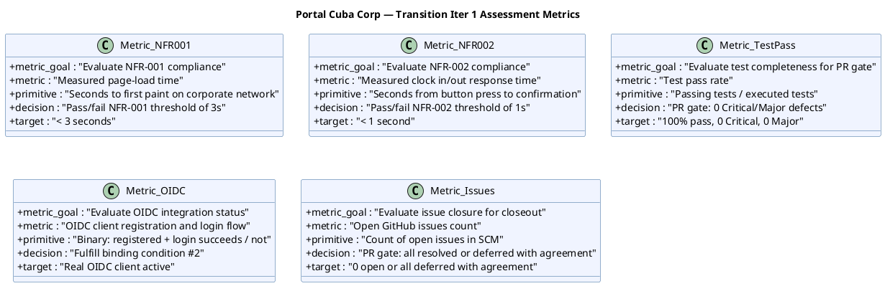

## Document Control

| Field | Value |
|---|---|
| Phase | Transition |
| Status | Active |
| Milestone Target | Product Release (PR) — **NOT YET ACHIEVED** |
| Iteration | 1 (Cycle 1) |
| Date | 2026-08-29 |
| Author | Project Manager (Project Management Discipline) |
| Prior Iteration | Construction C4 Cycle 1 — IOC CONDITIONAL GO; stakeholder sanction GRANTED with 3 binding conditions; 0 open PRs; CI GREEN; 35/43 tests pass, 8 covered-by-mock; 7 open issues (1 ACCEPTED, 6 deferred) |
| Evolution | Transition Iter 1 Assessment evolved from Construction C4 baseline. This is the FINAL Iteration Assessment — it supports the PR (Product Release) milestone review. All 5 acceptance criteria (AC-001–AC-005) and 3 stakeholder binding conditions are evaluated. |

## Iteration Objectives Reached

| # | Objective | Status | Evidence |
|---|---|---|---|
| 1 | NFR-001/NFR-002 load testing with measured values | PENDING — Test Manager to execute | Binding condition #1; measured values required |
| 2 | Real OIDC integration verification | PENDING — Software Architect to execute | Binding condition #2; 8 tests covered-by-mock |
| 3 | Resolve or defer all 7 open GitHub issues | PENDING — Implementer to execute | 1 ACCEPTED (R003), 6 deferred |
| 4 | Deployment verification on internal Windows Server | PENDING — Software Architect to execute | CON-006, CON-007 |
| 5 | User documentation finalization | PENDING — Technical Writer to execute | AC-001, AC-002, AC-004 |
| 6 | Iteration Assessment & PR milestone evidence | IN PROGRESS — this artifact | This assessment + PR evidence assembly |

## Adherence to Plan

### Planned vs. Actual

| Work Item | Planned Budget | Actual Spend | Variance | Notes |
|---|---|---|---|---|
| T1 (load testing) | 2.5M tokens `[ASSUMPTION]` | — | — | Not yet executed |
| T2 (OIDC) | 1.5M tokens `[ASSUMPTION]` | — | — | Not yet executed |
| T3 (defects) | 2.0M tokens `[ASSUMPTION]` | — | — | Not yet executed |
| T4 (deployment) | 1.0M tokens `[ASSUMPTION]` | — | — | Not yet executed |
| T5 (user docs) | 0.5M tokens `[ASSUMPTION]` | — | — | Not yet executed |
| T6 (assessment) | 1.5M tokens `[ASSUMPTION]` | — | — | In progress (this artifact) |

**Note:** All budgets are `[ASSUMPTION — requires validation]` as no Transition actuals exist. Actual spend will be recorded after iteration closes. The measured baseline from closed phases: Inception 4.38M tokens / 22 min, Elaboration 20.87M tokens / 1.0h, Construction C3 12.75M tokens / 1.3h, Construction C4 10.95M tokens / 1.2h.

### Schedule

| Metric | Planned | Actual | Variance |
|---|---|---|---|
| Agent time | ~9.0M tokens `[ASSUMPTION]` | — | — |
| Human gate queue time | 3 days | — | — |
| Elapsed time | — | — | — |

## Use Cases and Scenarios Implemented

No new use cases implemented in Transition. This iteration verifies the system built across Inception–Construction against acceptance criteria.

| UC ID | Use Case | Status | Verification |
|---|---|---|---|
| UC-001 | Clock In and Clock Out (FR-001) | BUILT (Construction) | AC-001: employee clocks without help — T4 deployment verification |
| UC-002 | View Own Clocking History (FR-002) | BUILT (Construction) | Verified in deployment |
| UC-003 | View All Employee Clockings (FR-003) | BUILT (Construction) | Verified in deployment |
| UC-004 | Export Monthly Clocking Report (FR-004) | BUILT (Construction) | Verified in deployment |
| UC-005 | Publish News (FR-005) | BUILT (Construction) | AC-002: HR publishes without technical assistance — T4 deployment verification |
| UC-006 | Edit Published News (FR-006) | BUILT (Construction) | Verified in deployment |
| UC-007 | Unpublish News (FR-007) | BUILT (Construction) | Verified in deployment |
| UC-008 | Read and Filter News (FR-008) | BUILT (Construction) | Verified in deployment |
| UC-009 | Search Employee Directory (FR-009) | BUILT (Construction) | AC-003: find colleague < 10s — T1 load testing + T4 deployment |
| UC-010 | Manage Worker Category (FR-010) | BUILT (Construction) | Verified in deployment |

## Results Relative to Evaluation Criteria

### Stakeholder Binding Conditions

| # | Condition | Status | Evidence Required |
|---|---|---|---|
| 1 | NFR-001/NFR-002 load testing with measured values | PENDING | Measured page-load < 3s, clock response < 1s — documented with actual numbers |
| 2 | Real OIDC integration named work item with owner | PENDING | OIDC client registered, login flow verified, 8 tests unblocked or deferred with agreement |
| 3 | Mock-auth has expiry date | PENDING | Expiry date documented in Iteration Plan and Risk List |

### Acceptance Criteria

| AC ID | Description | Status | Evidence | Deferred |
|---|---|---|---|---|
| AC-001 | Employee clocks in/out without HR/dev help | PENDING | T4 deployment verification + T5 user docs | — |
| AC-002 | HR publishes news without technical assistance | PENDING | T4 deployment verification + T5 user docs | — |
| AC-003 | Employee finds colleague's phone/email < 10s | PENDING | T1 load testing (measured response) + T4 deployment | — |
| AC-004 | 80% of employees complete one clocking, no training | PENDING | T5 user docs + T6 assessment (adoption plan) | — |
| AC-005 | System works temporarily offline (5 min network drop) | PENDING | T4 deployment verification (offline sync test) | — |

## Test Results

| Metric | Value | Source |
|---|---|---|
| Total tests | 43 | Construction C4 baseline |
| Passing | 35 | Construction C4 baseline |
| Failing | 0 | Construction C4 baseline |
| Covered-by-mock (R003) | 8 | Construction C4 baseline — to be unblocked by T2 (OIDC) |
| CI status | GREEN | Run 33256627567 on main (2026-08-29) |
| Open Critical defects | 0 | Construction C4 Review Record |
| Open Major defects | 0 | Construction C4 Review Record |

### Metrics with Decision-Enabling Goals

## External Changes

No external changes identified in this iteration. The project scope remains as declared in the Work Order. No new Change Requests have been raised for Transition.

## Rework Required

### From Construction C4 Review Record (PM Artifacts)

| Finding | Severity | Artifact | Status | Action |
|---|---|---|---|---|
| IA-F2 | Major | Iteration Assessment | RESOLVED in C4 | Incorrect issue count corrected — 7 open issues (1 ACCEPTED, 6 deferred) |
| IP-F4 | — | Iteration Plan | RESOLVED in C4 | Mid-iteration checkpoint present since C2 Cycle 3 |
| IP-F5 | — | Iteration Plan | RESOLVED in C4 | Load testing decoupled from merge dependency; deferred to Transition |
| RL-F2 | — | Risk List | RESOLVED in C4 | R008 contingency activated and COMPLETE |
| RL-F5 | — | Risk List | RESOLVED in C4 | R003 ACCEPTED — mock-auth activated per STK-001 |

### From Work Order Change Requests

| CR | Severity | Artifact | Action |
|---|---|---|---|
| Risk List (Moderate) | Moderate | Risk List | Evolved for Transition — R009, R010 added; R003/R004 transition actions defined |
| Iteration Plan (Moderate) | Moderate | Iteration Plan | Evolved for Transition — 6 work items, 3 binding conditions, PR milestone |
| Iteration Assessment (Moderate) | Moderate | Iteration Assessment | Evolved for Transition — final assessment supporting PR milestone |
| Review Record (Moderate) | Moderate | Review Record | Not a PM artifact — owned by Reviewer role |

### Project Closeout Actions

| # | Action | Owner | Status |
|---|---|---|---|
| 1 | Dispose assets — archive SCM repository, clean up CI/CD resources | Project Manager | PENDING — post-PR |
| 2 | Reassign staff — document agent role assignments for future reference | Project Manager | PENDING — post-PR |
| 3 | Document lessons learned — promote to organizational scope via project memory | Project Manager | PENDING — post-PR |
| 4 | Update software development plan — Transition plan recorded in this Iteration Plan | Project Manager | COMPLETE — this artifact |
| 5 | Update status assessment — Transition status recorded in this Iteration Assessment | Project Manager | COMPLETE — this artifact |

## Traceability

| Element | Traces From | Link Type | Traces To |
|---|---|---|---|
| T1 (load testing) | NFR-001, NFR-002, R004, STK-001 binding condition #1 | Derives | Test Evaluation Summary (Transition) |
| T2 (OIDC) | R003, CON-004, STK-003, STK-001 binding condition #2 | Derives | SAD COMP-001 (OIDC) |
| T3 (defects) | Review Record C4, Change Request C4 | Derives | SCM Issues |
| T4 (deployment) | CON-006, CON-007, R009 | Derives | Deployment verification |
| T5 (user docs) | AC-001, AC-002, AC-004, R002 | Derives | User Documentation (Transition) |
| T6 (assessment) | AC-001–AC-005, R010, STK-001 | Derives | PR milestone review |
| IA-F2 (RESOLVED) | Review Record C4 IA-F2 | Resolved by | Corrected issue count in C4 |
| IP-F4 (RESOLVED) | Review Record C4 IP-F4 | Resolved by | Mid-iteration checkpoint since C2 Cycle 3 |
| IP-F5 (RESOLVED) | Review Record C4 IP-F5 | Resolved by | Load testing deferred to Transition Iter 1 |
| RL-F2 (RESOLVED) | Review Record C4 RL-F2 | Resolved by | R008 contingency activated and COMPLETE |
| RL-F5 (RESOLVED) | Review Record C4 RL-F5 | Resolved by | R003 ACCEPTED — mock-auth activated |
| R009 (NEW) | CON-006, CON-007 | Derives | T4 (deployment verification) |
| R010 (NEW) | AC-001–AC-005, BG-003 | Derives | T6 (assessment), PR milestone |
| Stakeholder PR gate | STK-001, AC-001–AC-005 | Refines | PR milestone review |