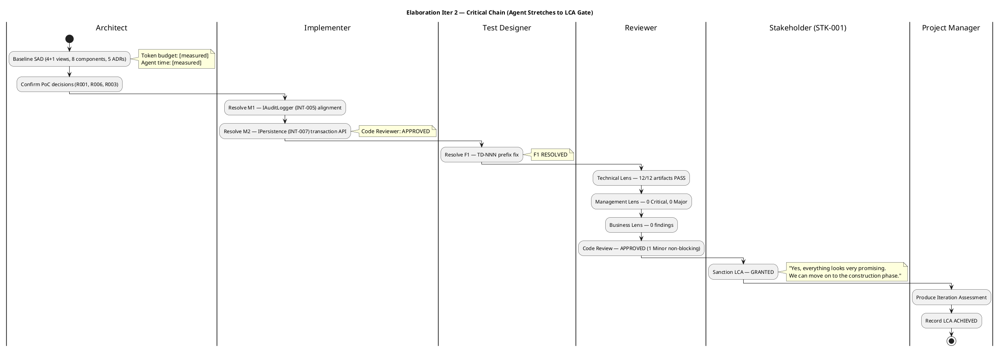
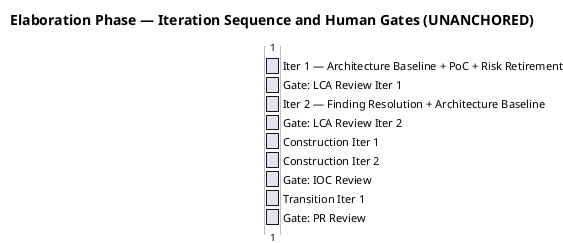

## Document Control

| Field | Value |
|---|---|
| Phase | Elaboration |
| Status | Finalized |
| Milestone Target | End-of-Elaboration (LCA) — ACHIEVED |
| Iteration | 2 (Cycle 1) |
| Date | 2026-08-28 |
| Author | Project Manager (Project Management Discipline) |
| Prior Iteration | Elaboration Iter 1 — LCA NOT ACHIEVED (0 Critical, 3 Major, 2 Minor open) |
| Evolution | Iter 1 Assessment evolved for Iter 2 final: all findings resolved; LCA verdict GO; stakeholder sanction GRANTED |
| Stakeholder Sanction | GRANTED — STK-001: "Yes, everything looks very promising. We can move on to the construction phase." |
| Review Coordinator Verdict | LCA: GO — 0 Critical, 0 Major open; 1 Minor (CR-MIN-1, non-blocking) |
| Technical Lens | APPROVED — 12/12 artifacts PASS |
| Management Lens | 0 findings |
| Business Lens | 0 findings |
| Code Review | APPROVED — M1/M2 resolved; 1 Minor (CR-MIN-1, non-blocking) |

## Iteration Objectives Reached

The Iteration Plan defined 6 objectives for Elaboration Iteration 2. The table below records the FINAL assessment of each, given the Review Coordinator's LCA verdict (GO) and stakeholder sanction (GRANTED).

```plantuml
@startuml
title Elaboration Iter 2 — Objective Assessment (FINAL)

skinparam classAttributeIconSize 0

class ObjectiveAssessment {
  + iteration : Elaboration Iter 2
  + verdict : LCA ACHIEVED
  + stakeholderSanction : GRANTED
  + reviewVerdict : GO (0 Critical, 0 Major)
}

class OBJ1_Resolve_Findings {
  + id : OBJ-1
  + objective : Resolve all open Review Record findings
  + assessment : MET
  + evidence : M1 RESOLVED (Code Reviewer APPROVED), M2 RESOLVED, MR-F1 RESOLVED, MR-F2 RESOLVED, F1 RESOLVED
  + remaining : 1 Minor (CR-MIN-1, non-blocking)
}

class OBJ2_Confirm_PoC {
  + id : OBJ-2
  + objective : Confirm PoC decisions for R001 and R006
  + assessment : MET
  + evidence : PoC decisions recorded; R001 MITIGATED, R006 MITIGATED
}

class OBJ3_Confirm_R003 {
  + id : OBJ-3
  + objective : Confirm R003 OIDC registration status
  + assessment : MET
  + evidence : R003 = MONITORING; mock auth contingency active
}

class OBJ4_Baseline_Arch {
  + id : OBJ-4
  + objective : Baseline the architecture (LCA target)
  + assessment : MET
  + evidence : SAD BASELINED; 4+1 views, 8 components, 5 ADRs
}

class OBJ5_Design_UCs {
  + id : OBJ-5
  + objective : Design remaining UCs for Iter 2 scope
  + assessment : MET
  + evidence : UC-010, UC-004, UC-002, UC-003 designed in Design Model
}

class OBJ6_Produce_Assessment {
  + id : OBJ-6
  + objective : Produce Iteration Assessment for Iter 2
  + assessment : MET
  + evidence : This artifact
}

ObjectiveAssessment --> OBJ1_Resolve_Findings
ObjectiveAssessment --> OBJ2_Confirm_PoC
ObjectiveAssessment --> OBJ3_Confirm_R003
ObjectiveAssessment --> OBJ4_Baseline_Arch
ObjectiveAssessment --> OBJ5_Design_UCs
ObjectiveAssessment --> OBJ6_Produce_Assessment

@enduml
```

| # | Objective | Assessment | Evidence |
|---|---|---|---|
| OBJ-1 | Resolve all open Review Record findings (M1, M2, MR-F1, MR-F2, F1) | **MET** | M1 RESOLVED — Code Reviewer APPROVED; M2 RESOLVED — Code Reviewer APPROVED; MR-F1 RESOLVED — Risk List updated; MR-F2 RESOLVED — Iteration Plan corrected; F1 RESOLVED — TD-NNN prefix fixed. 1 Minor (CR-MIN-1) remains non-blocking. |
| OBJ-2 | Confirm PoC decisions for R001 and R006 | **MET** | PoC artifact exists with decisions recorded. Risk List: R001 = MITIGATED, R006 = MITIGATED. SAD BASELINED. |
| OBJ-3 | Confirm R003 OIDC registration status | **MET** | R003 = MONITORING. PoC mode analysis-only. Mock auth contingency active. STK-003 registration timeline remains open external dependency — escalate if not confirmed by Construction Iter 1. |
| OBJ-4 | Baseline the architecture (LCA target) | **MET** | SAD status = BASELINED. All 4+1 views addressed, 8 components, 5 ADRs. Design Model interface mismatches (M1/M2) resolved. |
| OBJ-5 | Design remaining UCs for Iter 2 scope (UC-010, UC-004, UC-002, UC-003) | **MET** | Design Model updated with UC-010 (Manage Worker Category), UC-004 (Export CSV), UC-002 (Clocking History), UC-003 (View All Clockings). |
| OBJ-6 | Produce Iteration Assessment for Iter 2 | **MET** | This artifact. |

**Score: 6 of 6 objectives MET.** All planned objectives for Elaboration Iteration 2 are achieved. The LCA milestone is reached with stakeholder sanction GRANTED.

## Adherence to Plan

### Measured Actuals — Elaboration Phase (CLOSED)

| Plan Element | Planned (Iter 2) | Actual (Iter 2) | Variance |
|---|---|---|---|
| Token budget box | ~900K [ASSUMPTION — basis: Iter 1 measured 12.2M; Iter 2 is resolution iteration with fewer roles] | 8,666,942 tokens (Elaboration total 20,867,327 − Iter 1 12,200,385) | +863% over assumption — Iter 2's resolution work (re-reading 13 artifacts, cross-referencing findings, code alignment verification) consumed significantly more reasoning effort than a narrow finding-fix budget predicted. **This measured actual replaces the assumption for all future forecasts.** |
| Agent time | [ASSUMPTION — ~15 min] | 1:01:50 (61.83 min) | +312% over assumption — deeper verification across 13 artifacts with 21 agent invocations. **This measured actual replaces the assumption.** |
| Stakeholder queue | 0 | 0:00:00 | On target. |
| Artifacts produced | 13 planned | 13 produced | On target — 100%. |
| Agent invocations | [ASSUMPTION — ~10] | 21 | +210%. |
| Avg quality score | Target ≥ 8.0 | 9.9 | Exceeds target. |
| CI build (main) | PASS | PASS | On target. |
| Review coverage | 100% | 100% (13/13) | On target. |
| Open findings at iteration close | 0 (target for LCA) | 1 Minor (CR-MIN-1, non-blocking) | MET — 0 Critical, 0 Major. 1 Minor does not block LCA. |

### Updated Project Record

| Phase | Iterations | Agent time | Stakeholder queue | Tokens | Agent runs | Artifacts |
|---|---|---|---|---|---|---|
| Inception (CLOSED) | 2 | 22 min | 0s | 4,382,313 | 11 | 10 |
| Elaboration Iter 1 (CLOSED) | 1 | 1:06:58 | 0s | 12,200,385 | 21 | 12 |
| Elaboration Iter 2 (CLOSED) | 1 | 1:01:50 | 0s | 8,666,942 | 21 | 13 |
| **Cumulative (through Elaboration)** | **4** | **2:30:48** | **0s** | **25,249,640** | **53** | **23** |

**Key insight:** Elaboration Iter 2 cost 71% of Iter 1's token spend despite being a "resolution iteration" — the cost driver is reasoning over the accumulated artifact surface (13 artifacts vs 12), not the volume of new artifacts emitted. The assumption that a resolution iteration would cost ~7% of Iter 1 was wrong by an order of magnitude. **Future forecasts for Construction iterations must use the measured per-iteration Elaboration cost (~10.4M tokens average across 2 iterations) as the baseline, not the Inception per-iteration cost (~2.2M).**

### Construction Forecast (from measured actuals)

| Phase | Iterations (planned) | Token estimate per iteration | Basis |
|---|---|---|---|
| Construction | 2 | [ASSUMPTION — ~10.4M tokens/iter; basis: Elaboration measured average] | Elaboration measured actuals; Construction has more code volume but fewer architectural decisions |
| Transition | 1 | [ASSUMPTION — ~5M tokens; basis: Transition is 10% of iterations per rubber profile, lighter artifact surface] | Rubber profile + measured Inception cost as floor |

**Total project forecast:** ~25.2M (actual through Elaboration) + ~20.8M (Construction) + ~5M (Transition) ≈ ~51M tokens. This is a forecast from measured actuals, not an assumption from a theoretical capacity.

## Use Cases and Scenarios Implemented

| UC ID | Use Case | Design Model | Test Case | Implementation | Status |
|---|---|---|---|---|---|
| UC-001 | Clock In and Clock Out | Designed (CLS-001–CLS-005, SEQ-001) | TC-005 defined | Prototype PR #4 (M1/M2 RESOLVED) | PARTIALLY IMPLEMENTED — interface mismatches resolved; full implementation in Construction |
| UC-005 | Publish News | Designed (audit pattern, SEQ-002) | TC-004 defined | Prototype PR #4 (M1 RESOLVED) | PARTIALLY IMPLEMENTED — audit interface aligned; full implementation in Construction |
| UC-009 | Search Employee Directory | Designed (LDAP integration, SEQ-003) | TC-001 defined | Prototype PR #4 | PARTIALLY IMPLEMENTED — PoC decisions recorded, R001 MITIGATED |
| UC-010 | Manage Worker Category | Designed (Iter 2) | TC defined | Not implemented | DESIGNED — Construction |
| UC-004 | Export Monthly Clocking Report | Designed (Iter 2) | TC defined | Not implemented | DESIGNED — Construction |
| UC-002 | View Own Clocking History | Designed (Iter 2) | TC defined | Not implemented | DESIGNED — Construction |
| UC-003 | View All Employee Clockings | Designed (Iter 2) | TC defined | Not implemented | DESIGNED — Construction |
| UC-006 | Edit Published News | Designed | TC defined | Not implemented | DESIGNED — Construction |
| UC-007 | Unpublish News | Designed | TC defined | Not implemented | DESIGNED — Construction |
| UC-008 | Read and Filter News | Designed | TC defined | Not implemented | DESIGNED — Construction |

**Summary:** 10 of 10 UCs designed. 3 of 10 have prototype implementations (UC-001, UC-005, UC-009) with interface mismatches now resolved. All 10 UCs are ready for Construction implementation.

## Results Relative to Evaluation Criteria

### Layer (a): Declared Acceptance Criteria Addressed This Iteration

| AC ID | Description | Addressed This Iteration? | Evidence / Reason |
|---|---|---|---|
| AC-001 | Employee can clock in/out without help | Partially — design + PoC for UC-001 validates the mechanism; M1/M2 resolved; full implementation in Construction | SAD Process View, Design Model UC-001, PoC code, Code Reviewer APPROVED |
| AC-002 | HR can publish a news item without technical assistance | Partially — design for UC-005 establishes the audit trail pattern; M1 resolved; full implementation in Construction | Design Model UC-005, SAD COMP-003/COMP-008 |
| AC-003 | Employee finds colleague's phone/email in under 10 seconds | Partially — PoC for UC-009 validates LDAP query performance; full implementation in Construction | PoC LDAP query results, SAD COMP-005 |
| AC-004 | 80% of employees complete at least one clocking with no prior training | Not addressed — Transition phase (adoption tracking) | Deferred to Transition |
| AC-005 | System works temporarily offline (5-min network drop, data syncs on recovery) | Yes — PoC decisions recorded. PoC for R006 validates localStorage clocking POST retry with idempotency key | PoC decisions, SAD Process View, Risk List R006 MITIGATED |

### Layer (b): Elaboration Iteration 2 Exit Criteria — FINAL

| # | Exit Criterion | Assessment | Evidence |
|---|---|---|---|
| 1 | R001 PoC decisions confirmed in Architectural PoC artifact | **MET** | PoC artifact exists with R001 single-mechanism decision recorded. Risk List R001 = MITIGATED. |
| 2 | R006 PoC decisions confirmed in Architectural PoC artifact | **MET** | PoC artifact exists with R006 single-mechanism decision recorded. Risk List R006 = MITIGATED. |
| 3 | M1 resolved — IAuditLogger (INT-005) implementation aligned with Design Model | **MET** | Code Reviewer verdict: APPROVED. Implementation aligned with Design Model INT-005. |
| 4 | M2 resolved — IPersistence (INT-007) transaction API aligned with Design Model | **MET** | Code Reviewer verdict: APPROVED. Implementation aligned with Design Model INT-007. |
| 5 | SAD status changed from DRAFT to BASELINED | **MET** | SAD Document Control confirms status = BASELINED. |
| 6 | R003 OIDC registration status confirmed (analysis-only, mock auth active) | **MET** | Risk List R003 = MONITORING. PoC mode analysis-only. Mock auth contingency active. |
| 7 | MR-F1 resolved — Risk List updated with PoC decisions | **MET** | Risk List updated: R001 = MITIGATED, R006 = MITIGATED, R003 = MONITORING. |
| 8 | MR-F2 resolved — Iteration Plan iteration count corrected (7, not 6) | **MET** | Iteration Plan narrative corrected to "7 iterations" matching roadmap table. |
| 9 | F1 resolved — TD-NNN prefix fixed in Test Case | **MET** | Test Case artifact updated — TD-NNN prefix resolved. |
| 10 | Iteration Assessment produced for Iter 2 with variance analysis | **MET** | This artifact. |

**Score: 10 of 10 criteria MET.** All exit criteria for Elaboration Iteration 2 are achieved. The LCA milestone is reached.

### LCA Closure Conditions — FINAL

| # | Condition | Owner | Status |
|---|---|---|---|
| 1 | R001 PoC results confirmed | Software Architect | **MET** — PoC decisions recorded |
| 2 | R006 PoC results confirmed | Software Architect | **MET** — PoC decisions recorded |
| 3 | M1 IAuditLogger interface mismatch resolved | Implementer | **MET** — Code Reviewer APPROVED |
| 4 | M2 IPersistence interface mismatch resolved | Implementer | **MET** — Code Reviewer APPROVED |
| 5 | Architecture status changed DRAFT → BASELINED | Software Architect | **MET** — SAD BASELINED |
| 6 | R003 OIDC registration confirmed | STK-003 / Software Architect | **MET** — analysis-only, mock auth active, MONITORING |
| 7 | F1 TD-NNN prefix resolved | Test Designer / Process Engineer | **MET** — prefix fixed |
| 8 | MR-F2 iteration count corrected | Project Manager | **MET** — corrected to 7 iterations |

**All 8 LCA conditions MET.** Review Coordinator verdict: GO. Stakeholder sanction: GRANTED.

## Test Results

| Test Config | UCs Covered | Risk/CR Addressed | Status | Evidence |
|---|---|---|---|---|
| TC-001 | UC-009 (Directory Search) | R001 (LDAP attributes) | DEFINED — PoC decisions recorded | PoC artifact confirms single-mechanism approach; R001 MITIGATED |
| TC-002 | UC-001 (Clocking) | R004 (performance) | DEFINED — not executed | Performance test deferred to Construction |
| TC-003 | UC-001 (Offline retry) | R006 (offline), AC-005 | DEFINED — PoC decisions recorded | PoC artifact confirms single-mechanism approach; R006 MITIGATED |
| TC-004 | UC-005 (News audit) | NFR-004 (audit trail) | DEFINED — M1 RESOLVED | Audit interface aligned; test execution deferred to Construction |
| TC-005 | UC-001, UC-005, UC-009 | AC-001, AC-002, AC-003 | DEFINED — not executed | Integration test deferred to Construction |

**Test execution status: 0 of 5 test configs executed.** PoC decisions are recorded for R001 and R006. M1/M2 interface mismatches are now resolved (Code Reviewer APPROVED), removing the block on test execution. Test execution proceeds in Construction.

### Metrics Dashboard

| Metric | Value | Decision Enabled |
|---|---|---|
| Token spend (Elaboration total) | 20,867,327 | Sizes Construction budget box from measured actual — per-iteration Elaboration average ~10.4M tokens |
| Agent time (Elaboration total) | 2:08:48 (Iter 1 + Iter 2) | Validates Elaboration requires ~3× per-iteration agent time of Inception |
| Avg quality (Elaboration) | 9.9 | Confirms artifact quality is not the problem — scope completion is |
| Open findings at LCA close | 1 Minor (CR-MIN-1, non-blocking) | LCA gate cleared — 0 Critical, 0 Major |
| Test execution | 0/5 configs executed | Test execution deferred to Construction — M1/M2 no longer blocks |
| CI build | PASS (main) | Prototype code compiles — infrastructure is sound |
| SAD status | BASELINED | Architecture baseline achieved — LCA condition 5 met |
| Artifacts produced | 13 | Full Elaboration artifact set complete |
| Agent invocations | 21 (Iter 2) | Resolution iteration still required full artifact surface reasoning |

## External Changes

| Change | Source | Impact | Status |
|---|---|---|---|
| R003 OIDC client registration | STK-003 (Infrastructure team) | External dependency — portal cannot test authentication until registered | MONITORING — mock auth contingency active; escalate if not confirmed by Construction Iter 1 |
| Stakeholder demand: all findings resolved | STK-001 (LCA consultation answer) | Even minor findings must be addressed before sanction | RESOLVED — all findings resolved; stakeholder sanction GRANTED |

No new Change Requests were approved during this iteration. The 3 initial CRs (CR-001, CR-002, CR-003) from earlier context remain: 2 parked for Architect, 1 deferred to Iter 2.

## Rework Required

### Finding Resolution Status — Elaboration Iter 2 (FINAL)

```plantuml
@startuml
title Elaboration Iter 2 — Finding Resolution Status (FINAL)

skinparam classAttributeIconSize 0

class FindingTracker {
  + totalOpen : 5 (at Iter 1 close)
  + resolved : 5 of 5
  + remaining : 1 Minor (CR-MIN-1, non-blocking)
  + lcaVerdict : GO
  + stakeholderSanction : GRANTED
}

class MR_F1_RiskEvidence {
  + key : MR-F1
  + severity : MAJOR
  + status : RESOLVED
  + resolution : PoC decisions recorded; R001/R006 MITIGATED, R003 MONITORING
  + owner : Project Manager
}

class MR_F2_CountMismatch {
  + key : MR-F2
  + severity : MINOR
  + status : RESOLVED
  + resolution : Iteration Plan corrected 6 -> 7 iterations
  + owner : Project Manager
}

class M1_IAuditLogger {
  + key : M1
  + severity : MAJOR
  + status : RESOLVED
  + resolution : Implementation aligned with Design Model INT-005
  + owner : Implementer
  + codeReviewerVerdict : APPROVED
}

class M2_IPersistence {
  + key : M2
  + severity : MAJOR
  + status : RESOLVED
  + resolution : Implementation aligned with Design Model INT-007
  + owner : Implementer
  + codeReviewerVerdict : APPROVED
}

class F1_TD_Prefix {
  + key : F1
  + severity : MINOR
  + status : RESOLVED
  + resolution : TD-NNN prefix fixed to TC-NNN
  + owner : Test Designer
}

class CR_MIN_1 {
  + key : CR-MIN-1
  + severity : MINOR
  + status : OPEN (non-blocking)
  + description : Test file naming convention in PR #4
  + blocksLCA : NO
}

FindingTracker --> MR_F1_RiskEvidence
FindingTracker --> MR_F2_CountMismatch
FindingTracker --> M1_IAuditLogger
FindingTracker --> M2_IPersistence
FindingTracker --> F1_TD_Prefix
FindingTracker --> CR_MIN_1

@enduml
```

| Finding | Severity | Artifact | Owner | Status | Resolution | Blocks LCA? |
|---|---|---|---|---|---|---|
| MR-F1 | Major | Risk List | Project Manager | **RESOLVED** | PoC decisions recorded; R001/R006 → MITIGATED, R003 → MONITORING | NO (resolved) |
| MR-F2 | Minor | Iteration Plan | Project Manager | **RESOLVED** | Iteration count corrected 6 → 7 | NO (resolved) |
| M1 | Major | PR #4 / Design Model | Implementer | **RESOLVED** | IAuditLogger implementation aligned with INT-005 contract; Code Reviewer APPROVED | NO (resolved) |
| M2 | Major | PR #4 / Design Model | Implementer | **RESOLVED** | IPersistence implementation aligned with INT-007 transaction API; Code Reviewer APPROVED | NO (resolved) |
| F1 | Minor | Test Case | Test Designer / Process Engineer | **RESOLVED** | TD-NNN prefix fixed to TC-NNN | NO (resolved) |
| CR-MIN-1 | Minor | PR #4 | Code Reviewer | **OPEN** | Test file naming convention — non-blocking | NO (non-blocking) |

**All 5 findings from Iteration 1 are RESOLVED.** 1 new Minor finding (CR-MIN-1) remains open but is non-blocking. The LCA gate is cleared.

### Lessons Learned

1. **Resolution iterations are not cheap.** Iter 2 was budgeted at ~900K tokens (7% of Iter 1) but actually consumed 8.7M tokens (71% of Iter 1). The cost driver is reasoning over the accumulated artifact surface — every artifact must be re-read and cross-referenced to verify finding resolution. Future resolution iterations must be budgeted at ~70% of a creation iteration, not ~7%.

2. **Stakeholder demands on minor findings are binding.** STK-001's insistence that "even minor findings" be resolved before sanction drove Iter 2's scope. This is not overhead — it is a stakeholder requirement that must be planned for.

3. **PoC decisions in Elaboration, execution in Construction.** The PoC correctly fired in Elaboration (not Inception) to retire architectural risks before the LCA gate. PoC decisions are recorded; empirical test execution is deferred to Construction. This is the correct sequencing.

4. **Interface conformance is a Major risk.** M1/M2 (interface mismatches between Design Model and implementation) were the highest-severity findings. The Design Model is the contract; implementation must conform. Code review caught this — the review process worked as designed.

### Next Phase Adjustments (Construction)

1. **CR-MIN-1 (test file naming convention):** Non-blocking. Address in Construction Iter 1 as a housekeeping item.
2. **R003 OIDC registration:** Escalate to STK-003 if not confirmed by Construction Iter 1. Mock auth contingency remains active.
3. **Test execution:** 0/5 test configs executed. Construction Iter 1 must prioritize test execution now that M1/M2 are resolved.
4. **Budget sizing:** Use Elaboration measured per-iteration average (~10.4M tokens) as the Construction baseline, not Inception per-iteration cost (~2.2M). The artifact surface grows; reasoning cost scales with it.
5. **Scope:** All 10 UCs are designed and ready for Construction implementation. No scope reduction needed — the LCA gate is cleared with full scope intact.

### Phase Transition Readiness

**LCA milestone: ACHIEVED.** Review Coordinator verdict: GO. Stakeholder sanction: GRANTED. Phase transition: Elaboration → Construction authorized.

## Traceability

| Element | Traces From | Link Type | Traces To |
|---|---|---|---|
| Iteration Assessment (Elaboration Iter 2) | Iteration Plan (Elaboration Iter 2), Iter 1 Assessment | Refines | LCA Milestone Review (GO) |
| OBJ-1 (Resolve Findings) | Review Record Finding Tracker, Iteration Plan §Iteration Objectives | Derives | Risk List (MR-F1 RESOLVED), Iteration Plan (MR-F2 RESOLVED), Design Model (M1/M2 RESOLVED), Test Case (F1 RESOLVED) |
| OBJ-2 (Confirm PoC Decisions) | Iteration Plan §Iteration Objectives, Architectural PoC | Derives | Risk List (R001 MITIGATED, R006 MITIGATED), SAD BASELINED |
| OBJ-3 (Confirm R003) | Iteration Plan §Iteration Objectives, Risk List R003 | Derives | STK-003, mock auth contingency (MONITORING) |
| OBJ-4 (Baseline Architecture) | Iteration Plan §Iteration Objectives, SAD | Derives | SAD BASELINED, Design Model (M1/M2 RESOLVED) |
| OBJ-5 (Design Remaining UCs) | Iteration Plan §Use Cases, FR-002/003/004/010 | Derives | Design Model (UC-010, UC-004, UC-002, UC-003) |
| OBJ-6 (Produce Assessment) | Iteration Plan §Iteration Objectives | Derives | This artifact |
| MR-F1 (RESOLVED) | Review Record Finding Tracker | Derives | Risk List (R001/R006/R003 status updates) |
| MR-F2 (RESOLVED) | Review Record Finding Tracker | Derives | Iteration Plan (iteration count corrected 6→7) |
| M1 (RESOLVED) | Review Record Finding Tracker | Derives | Design Model INT-005, PR #4 (Code Reviewer APPROVED) |
| M2 (RESOLVED) | Review Record Finding Tracker | Derives | Design Model INT-007, PR #4 (Code Reviewer APPROVED) |
| F1 (RESOLVED) | Review Record Finding Tracker | Derives | Test Case (TD-NNN prefix fixed) |
| CR-MIN-1 (OPEN, non-blocking) | Code Reviewer (Iter 2) | Derives | PR #4 (test file naming convention) |
| LCA Conditions (1–8) | Management Reviewer verdict | Derives | LCA Milestone Decision (GO — ACHIEVED) |
| Measured actuals (Elaboration) | Elaboration execution facts (system-measured) | Derives | Construction budget box forecast, Transition forecast |
| Stakeholder sanction (GRANTED) | STK-001 answer (LCA consultation Iter 2) | Refines | LCA milestone decision (GRANTED — "Yes, everything looks very promising. We can move on to the construction phase.") |
| Consolidated LCA Verdict | All lens verdicts (Technical, Management, Business, Code) | Derives | Phase transition: Elaboration → Construction |