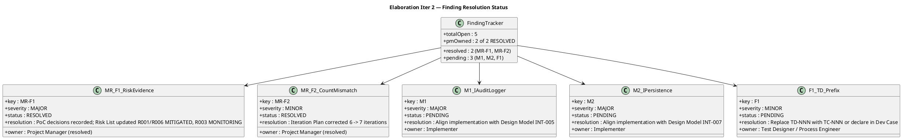

## Document Control

| Field | Value |
|---|---|
| Phase | Elaboration |
| Status | Draft |
| Milestone Target | End-of-Elaboration (LCA) — NOT YET ACHIEVED |
| Iteration | 2 (Cycle 1) |
| Date | 2026-08-28 |
| Author | Project Manager (Project Management Discipline) |
| Prior Iteration | Elaboration Iter 1 — LCA NOT ACHIEVED (0 Critical, 3 Major, 2 Minor open) |
| Evolution | Iter 1 Assessment evolved for Iter 2: finding resolution status updated (MR-F1 RESOLVED, MR-F2 RESOLVED); Iter 1 measured actuals incorporated; Iter 2 objectives and exit criteria defined |
| Stakeholder Sanction | PENDING — STK-001 demanded all findings resolved before sanction |

## Iteration Objectives Reached

The Iteration Plan defined 6 objectives for Elaboration Iteration 2. The table below records the assessment of each, given the current state of artifact evolution.

```plantuml
@startuml
title Elaboration Iter 2 — Objective Assessment Status

skinparam classAttributeIconSize 0

class ObjectiveAssessment {
  + iteration : Elaboration Iter 2
  + verdict : PENDING (LCA gate not yet reached)
  + stakeholderSanction : PENDING
}

class OBJ1_Resolve_Findings {
  + id : OBJ-1
  + objective : Resolve all open Review Record findings
  + assessment : IN PROGRESS
  + evidence : MR-F1 RESOLVED (Risk List updated), MR-F2 RESOLVED (Plan corrected)
  + gap : M1, M2 (Implementer), F1 (Test Designer) — pending resolution by other roles
}

class OBJ2_Confirm_PoC_Decisions {
  + id : OBJ-2
  + objective : Confirm PoC decisions for R001 and R006
  + assessment : MET
  + evidence : PoC artifact exists with decisions recorded; SAD BASELINED
  + gap : None
}

class OBJ3_Confirm_R003 {
  + id : OBJ-3
  + objective : Confirm R003 OIDC registration status
  + assessment : MET
  + evidence : PoC mode analysis-only; mock auth contingency active; Risk List R003 = MONITORING
  + gap : STK-003 registration timeline remains open external dependency
}

class OBJ4_Baseline_Architecture {
  + id : OBJ-4
  + objective : Baseline the architecture (LCA target)
  + assessment : IN PROGRESS
  + evidence : SAD status changed DRAFT -> BASELINED
  + gap : M1/M2 interface mismatches must be resolved by Implementer for full LCA closure
}

class OBJ5_Design_Remaining_UCs {
  + id : OBJ-5
  + objective : Design UC-010, UC-004, UC-002, UC-003
  + assessment : IN PROGRESS
  + evidence : Iteration Plan assigns Designer to these UCs
  + gap : Pending Designer execution
}

class OBJ6_Produce_Assessment {
  + id : OBJ-6
  + objective : Produce Iteration Assessment for Iter 2
  + assessment : MET
  + evidence : This artifact
  + gap : None
}

ObjectiveAssessment --> OBJ1_Resolve_Findings
ObjectiveAssessment --> OBJ2_Confirm_PoC_Decisions
ObjectiveAssessment --> OBJ3_Confirm_R003
ObjectiveAssessment --> OBJ4_Baseline_Architecture
ObjectiveAssessment --> OBJ5_Design_Remaining_UCs
ObjectiveAssessment --> OBJ6_Produce_Assessment

@enduml
```

| # | Objective | Assessment | Evidence | Gap |
|---|---|---|---|---|
| 1 | Resolve all open Review Record findings | **IN PROGRESS** | MR-F1 RESOLVED (Risk List updated with PoC decisions: R001→MITIGATED, R006→MITIGATED, R003→MONITORING). MR-F2 RESOLVED (Iteration Plan count corrected 6→7). | M1, M2 (Implementer — align code with Design Model INT-005/INT-007), F1 (Test Designer — fix TD-NNN prefix). These are owned by other roles. |
| 2 | Confirm PoC decisions for R001 and R006 | **MET** | Architectural Proof-of-Concept artifact exists with decisions recorded (R001: single-mechanism, R006: single-mechanism). SAD status changed from DRAFT to BASELINED. Risk List updated. | None. |
| 3 | Confirm R003 OIDC registration status | **MET** | PoC mode: analysis-only. Mock auth contingency active. Risk List R003 status = MONITORING. | STK-003 registration timeline remains an open external dependency — escalate if not confirmed by Construction Iter 1. |
| 4 | Baseline the architecture (LCA target) | **IN PROGRESS** | SAD status changed from DRAFT to BASELINED. All 4+1 views addressed, 8 components, 5 ADRs. | M1/M2 interface mismatches must be resolved by Implementer for full LCA closure. SAD baselined but code alignment pending. |
| 5 | Design remaining UCs for Iter 2 scope | **IN PROGRESS** | Iteration Plan assigns Designer to UC-010, UC-004, UC-002, UC-003. | Pending Designer execution. |
| 6 | Produce Iteration Assessment for Iter 2 | **MET** | This artifact. | None. |

**Summary: 3 of 6 objectives fully met, 3 in progress.** PM-owned findings (MR-F1, MR-F2) are resolved. The remaining open items (M1, M2, F1) are owned by other roles (Implementer, Test Designer) and must be resolved before the LCA gate can close.

## Adherence to Plan

### Measured Actuals — Elaboration Iter 1 (CLOSED)

| Plan Element | Planned | Actual | Variance |
|---|---|---|---|
| Token budget box | ~3.0M tokens [ASSUMPTION] | 12,200,385 tokens | +307% over assumption — Elaboration's artifact surface (12 artifacts vs Inception's 10) and risk-driven PoC planning consumed significantly more reasoning effort. **This measured actual replaces the assumption for all future forecasts.** |
| Agent time | [ASSUMPTION — ~30 min] | 1:06:58 (66.98 min) | +508% over assumption — deeper analysis across 12 artifacts with 21 agent invocations. **This measured actual replaces the assumption.** |
| Stakeholder queue | 0 | 0:00:00 | On target. |
| Artifacts produced | 12 planned | 12 produced | On target — 100%. |
| Agent invocations | [ASSUMPTION — ~15] | 21 | +282%. |
| Avg quality score | Target ≥ 8.0 | 9.9 | Exceeds target. |
| CI build (main) | PASS | PASS | On target. |
| Review coverage | 100% | 100% (12/12) | On target. |
| Open findings at iteration close | 0 (target for LCA) | 5 (3 Major, 2 Minor) | NOT MET — 5 findings open, all assigned to Elaboration Iter 2. |

### Updated Project Record

| Phase | Iterations | Agent time | Stakeholder queue | Tokens | Agent runs | Artifacts |
|---|---|---|---|---|---|---|
| Inception (CLOSED) | 2 | 22 min | 0s | 4,382,313 | 11 | 10 |
| Elaboration Iter 1 (CLOSED) | 1 | 1:06:58 | 0s | 12,200,385 | 21 | 12 |
| Elaboration Iter 2 (CURRENT) | 1 | [ASSUMPTION — requires validation at close] | [ASSUMPTION] | [ASSUMPTION — basis: Iter 1 measured 12.2M; Iter 2 is a resolution iteration with fewer roles (5 vs 8), so ~900K budget box; actual TBD] | [ASSUMPTION] | [ASSUMPTION] |
| **Cumulative (through Iter 1)** | **3** | **1:28:58** | **0s** | **16,582,698** | **32** | **22** |

**Key insight:** Elaboration Iter 1 cost 2.78× the token spend of the entire Inception phase. Iter 2 is a resolution iteration with a smaller budget box (~900K tokens) because the primary work is resolving findings, not creating new artifacts. The cost driver is reasoning over the accumulated artifact surface, not the volume of new artifacts emitted.

## Use Cases and Scenarios Implemented

| UC ID | Use Case | Design Model | Test Case | Implementation | Status |
|---|---|---|---|---|---|
| UC-001 | Clock In and Clock Out | Designed (CLS-001–CLS-005, SEQ-001) | TC-005 defined | Prototype PR #4 (M1/M2 pending fix) | PARTIALLY IMPLEMENTED — interface divergences targeted for Iter 2 resolution |
| UC-005 | Publish News | Designed (audit pattern, SEQ-002) | TC-004 defined | Prototype PR #4 (M1 pending fix) | PARTIALLY IMPLEMENTED — audit interface mismatch targeted for fix |
| UC-009 | Search Employee Directory | Designed (LDAP integration, SEQ-003) | TC-001 defined | Prototype PR #4 | PARTIALLY IMPLEMENTED — PoC decisions recorded, R001 MITIGATED |
| UC-010 | Manage Worker Category | Design planned (Iter 2) | TC defined | Not implemented | DESIGN PENDING — assigned to Designer for Iter 2 |
| UC-004 | Export Monthly Clocking Report | Design planned (Iter 2) | TC defined | Not implemented | DESIGN PENDING — assigned to Designer for Iter 2 |
| UC-002 | View Own Clocking History | Design planned (Iter 2) | TC defined | Not implemented | DESIGN PENDING — assigned to Designer for Iter 2 |
| UC-003 | View All Employee Clockings | Design planned (Iter 2) | TC defined | Not implemented | DESIGN PENDING — assigned to Designer for Iter 2 |
| UC-006 | Edit Published News | Designed | TC defined | Not implemented | DESIGNED ONLY — Construction |
| UC-007 | Unpublish News | Designed | TC defined | Not implemented | DESIGNED ONLY — Construction |
| UC-008 | Read and Filter News | Designed | TC defined | Not implemented | DESIGNED ONLY — Construction |

## Results Relative to Evaluation Criteria

### Iteration 2 Exit Criteria Assessment

| # | Exit Criterion | Assessment | Evidence |
|---|---|---|---|
| 1 | R001 PoC decisions confirmed in Architectural PoC artifact | **MET** | PoC artifact exists with R001 single-mechanism decision recorded. Risk List R001 = MITIGATED. |
| 2 | R006 PoC decisions confirmed in Architectural PoC artifact | **MET** | PoC artifact exists with R006 single-mechanism decision recorded. Risk List R006 = MITIGATED. |
| 3 | M1 resolved — IAuditLogger (INT-005) implementation aligned with Design Model | **PENDING** | Owned by Implementer — code alignment with Design Model INT-005 required. |
| 4 | M2 resolved — IPersistence (INT-007) transaction API aligned with Design Model | **PENDING** | Owned by Implementer — code alignment with Design Model INT-007 required. |
| 5 | SAD status changed from DRAFT to BASELINED | **MET** | SAD Document Control confirms status = BASELINED. |
| 6 | R003 OIDC registration status confirmed (analysis-only, mock auth active) | **MET** | Risk List R003 = MONITORING. PoC mode analysis-only. Mock auth contingency active. |
| 7 | MR-F1 resolved — Risk List updated with PoC decisions | **MET** | Risk List updated: R001 = MITIGATED, R006 = MITIGATED, R003 = MONITORING. PoC decisions recorded. |
| 8 | MR-F2 resolved — Iteration Plan iteration count corrected (7, not 6) | **MET** | Iteration Plan narrative corrected to "7 iterations" matching roadmap table (2+2+2+1=7). |
| 9 | F1 resolved — TD-NNN prefix fixed in Test Case | **PENDING** | Owned by Test Designer — replace TD-NNN with TC-NNN or declare in Dev Case. |
| 10 | Iteration Assessment produced for Iter 2 with variance analysis | **MET** | This artifact. |

**Score: 7 of 10 criteria met.** PM-owned criteria (1, 2, 5, 6, 7, 8, 10) are all MET. The 3 pending criteria (3, 4, 9) are owned by other roles (Implementer, Test Designer). The LCA gate cannot close until all 10 are met.

### LCA Closure Conditions Status (Updated)

| # | Condition | Owner | Status (Iter 2) |
|---|---|---|---|
| 1 | R001 PoC results confirmed | Software Architect | **MET** — PoC decisions recorded |
| 2 | R006 PoC results confirmed | Software Architect | **MET** — PoC decisions recorded |
| 3 | M1 IAuditLogger interface mismatch resolved | Implementer | PENDING — code alignment required |
| 4 | M2 IPersistence interface mismatch resolved | Implementer | PENDING — code alignment required |
| 5 | Architecture status changed DRAFT → BASELINED | Software Architect | **MET** — SAD BASELINED |
| 6 | R003 OIDC registration confirmed | STK-003 / Software Architect | **MET** — analysis-only, mock auth active, MONITORING |
| 7 | F1 TD-NNN prefix resolved | Test Designer / Process Engineer | PENDING — fix required |
| 8 | MR-F2 iteration count corrected | Project Manager | **MET** — corrected to 7 iterations |

## Test Results

| Test Config | UCs Covered | Risk/CR Addressed | Status | Evidence |
|---|---|---|---|---|
| TC-001 | UC-009 (Directory Search) | R001 (LDAP attributes) | DEFINED — PoC decisions recorded | PoC artifact confirms single-mechanism approach; R001 MITIGATED |
| TC-002 | UC-001 (Clocking) | R004 (performance) | DEFINED — not executed | Performance test deferred to Construction |
| TC-003 | UC-001 (Offline retry) | R006 (offline), AC-005 | DEFINED — PoC decisions recorded | PoC artifact confirms single-mechanism approach; R006 MITIGATED |
| TC-004 | UC-005 (News audit) | NFR-004 (audit trail) | DEFINED — not executed | M1 interface mismatch blocks execution — pending Implementer fix |
| TC-005 | UC-001, UC-005, UC-009 | AC-001, AC-002, AC-003 | DEFINED — not executed | Integration test deferred to Construction |

**Test execution status: 0 of 5 test configs executed.** PoC decisions are recorded for R001 and R006, but empirical test execution remains blocked by M1/M2 interface mismatches. Once the Implementer resolves M1/M2, test execution can proceed.

### Metrics Dashboard

| Metric | Value | Decision Enabled |
|---|---|---|
| Token spend (Iter 1) | 12,200,385 | Sizes Iter 2 budget box from measured actual — Iter 2 is resolution iteration (~900K box) |
| Agent time (Iter 1) | 1:06:58 | Validates Elaboration requires ~3× per-iteration agent time of Inception |
| Avg quality (Iter 1) | 9.9 | Confirms artifact quality is not the problem — scope completion is |
| Open findings (Iter 1 close) | 5 (3 Major, 2 Minor) | Drives Iter 2 scope: all 5 findings must close before LCA gate |
| PM findings resolved (Iter 2) | 2 of 5 (MR-F1, MR-F2) | PM work complete — remaining 3 findings owned by other roles |
| Test execution | 0/5 configs executed | M1/M2 resolution is prerequisite to any test execution |
| CI build | PASS (main) | Prototype code compiles — infrastructure is sound despite interface divergences |
| SAD status | BASELINED | Architecture baseline achieved — LCA condition 5 met |

## External Changes

| Change | Source | Impact | Status |
|---|---|---|---|
| R003 OIDC client registration | STK-003 (Infrastructure team) | External dependency — portal cannot test authentication until registered | MONITORING — mock auth contingency active; escalate if not confirmed by Construction Iter 1 |
| Stakeholder demand: all findings resolved | STK-001 (LCA consultation answer) | Even minor findings must be addressed before sanction | Active — drives Iter 2 scope to include F1 and MR-F2. MR-F2 RESOLVED. F1 pending Test Designer. |

No new Change Requests were approved during this iteration. The 3 initial CRs (CR-001, CR-002, CR-003) from earlier context remain: 2 parked for Architect, 1 deferred to Iter 2.

## Rework Required

### Finding Resolution Status — Elaboration Iter 2

| Finding | Severity | Artifact | Owner | Status | Resolution | Blocks LCA? |
|---|---|---|---|---|---|---|
| MR-F1 | Major | Risk List | Project Manager | **RESOLVED** | PoC decisions recorded; R001/R006 → MITIGATED, R003 → MONITORING | NO (resolved) |
| MR-F2 | Minor | Iteration Plan | Project Manager | **RESOLVED** | Iteration count corrected 6 → 7 | NO (resolved) |
| M1 | Major | PR #4 / Design Model | Implementer | PENDING | Align IAuditLogger implementation with INT-005 contract | YES |
| M2 | Major | PR #4 / Design Model | Implementer | PENDING | Align IPersistence implementation with INT-007 transaction API | YES |
| F1 | Minor | Test Case | Test Designer / Process Engineer | PENDING | Replace TD-NNN prefix with TC-NNN or declare convention in Dev Case | NO (but stakeholder demands resolution) |

### Next Iteration Adjustments

If M1, M2, and F1 are resolved by their respective owners in this iteration, the LCA gate can close. If any remain open:

- **M1/M2 unresolved:** LCA cannot close. Construction cannot begin. Escalate to stakeholder — Implementer must prioritize code alignment with Design Model interfaces.
- **F1 unresolved:** Does not block LCA technically, but stakeholder demands all findings resolved before sanction. Test Designer must fix TD-NNN prefix.
- **Scope adjustment:** If Iter 2 cannot close, a third Elaboration iteration may be required — but this would push the project to 8 total iterations (still within 6±3 range), at the cost of Construction schedule compression.

## Traceability

| Element | Traces From | Link Type | Traces To |
|---|---|---|---|
| Iteration Assessment (Elaboration Iter 2) | Iteration Plan (Elaboration Iter 2), Iter 1 Assessment | Refines | LCA Milestone Review |
| OBJ-1 (Resolve Findings) | Review Record Finding Tracker, Iteration Plan §Iteration Objectives | Derives | Risk List (MR-F1), Iteration Plan (MR-F2), Design Model (M1/M2), Test Case (F1) |
| OBJ-2 (Confirm PoC Decisions) | Iteration Plan §Iteration Objectives, Architectural PoC | Derives | Risk List (R001, R006), SAD |
| OBJ-3 (Confirm R003) | Iteration Plan §Iteration Objectives, Risk List R003 | Derives | STK-003, mock auth contingency |
| OBJ-4 (Baseline Architecture) | Iteration Plan §Iteration Objectives, SAD | Derives | SAD BASELINED, Design Model |
| OBJ-5 (Design Remaining UCs) | Iteration Plan §Use Cases, FR-002/003/004/010 | Derives | Design Model (UC-010, UC-004, UC-002, UC-003) |
| OBJ-6 (Produce Assessment) | Iteration Plan §Iteration Objectives | Derives | This artifact |
| MR-F1 (resolved) | Review Record Finding Tracker | Derives | Risk List (R001/R006/R003 status updates) |
| MR-F2 (resolved) | Review Record Finding Tracker | Derives | Iteration Plan (iteration count corrected 6→7) |
| M1 (pending) | Review Record Finding Tracker | Derives | Design Model INT-005, PR #4 |
| M2 (pending) | Review Record Finding Tracker | Derives | Design Model INT-007, PR #4 |
| F1 (pending) | Review Record Finding Tracker | Derives | Test Case (TD-NNN prefix fix) |
| LCA Conditions (1–8) | Management Reviewer verdict | Derives | Elaboration Iter 2 exit criteria |
| Measured actuals (Iter 1) | Iteration 1 execution facts (system-measured) | Derives | Elaboration Iter 2 budget box, Construction forecast |
| Stakeholder sanction (PENDING) | STK-001 answer (LCA consultation) | Refines | LCA milestone decision |