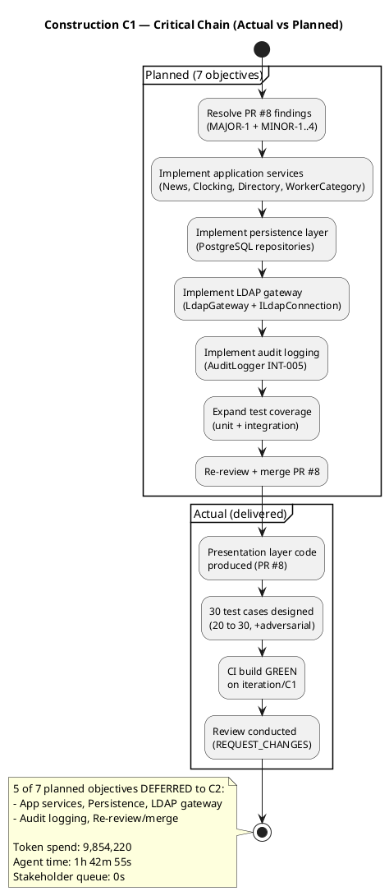
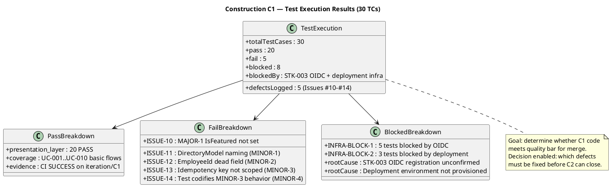

## Document Control

| Field | Value |
|---|---|
| Phase | Construction |
| Status | Finalized |
| Milestone Target | End-of-Construction (IOC) — NOT ACHIEVED |
| Iteration | 1 (Cycle 1) |
| Date | 2026-08-28 |
| Author | Project Manager (Project Management Discipline) |
| Prior Iteration | Elaboration Iter 2 — LCA ACHIEVED (0 Critical, 0 Major, stakeholder sanction GRANTED) |
| Evolution | Elaboration Iter 2 Assessment evolved for Construction C1: all Elaboration objectives MET; Construction C1 objectives assessed against Review Record + Test Evaluation Summary; IOC NOT achieved — auto-iterate to C2 |
| Stakeholder Sanction | REFUSED — STK-001: "We cannot advance to Transition because there are still things to finish to have the system with the use cases correctly implemented in construction, which is where we are now. We cannot move forward without the software." |
| Review Coordinator Verdict | IOC: iteration REQUIRED (scope incomplete) — 0 open Critical, 2 open Major, stakeholder sanction REFUSED |
| Technical Lens | REQUEST_CHANGES — 1 Major (MAJOR-1), 4 Minor (MINOR-1..4) |
| Management Lens | CONDITIONAL — 2 Major (MR-F1, MR-F3), 2 Minor (MR-F2, MR-F4) |
| Business Lens | INACTIVE — BM discipline INACTIVE per DC §4 |
| Consolidated Verdict | AUTO-ITERATE to Construction C2 |

## Iteration Objectives Reached

The Iteration Plan defined 7 objectives for Construction C1. The table below records the assessment of each, given the Review Coordinator's IOC verdict (iteration REQUIRED) and stakeholder sanction (REFUSED).

```plantuml
@startuml
title Construction C1 — Objective Assessment (IOC NOT ACHIEVED)

skinparam classAttributeIconSize 0
skinparam monochrome false

class IterationVerdict {
  + phase : Construction
  + iteration : 1 (Cycle 1)
  + milestone : IOC — NOT ACHIEVED
  + stakeholderSanction : REFUSED
  + consolidatedVerdict : AUTO-ITERATE to C2
  + openCritical : 0
  + openMajor : 2
  + openMinor : 7
  + totalFindings : 9
  + reworkClosureRate : 0%
}

class OBJ1_Resolve_Findings {
  + id : OBJ-1
  + objective : Resolve all open PR #8 findings
  + assessment : NOT MET
  + evidence : MAJOR-1 OPEN (IsFeatured blocks FR-008)
  + evidence : MINOR-1..4 OPEN (stakeholder requires all resolved)
  + impact : Blocks PR #8 merge to main
}

class OBJ2_App_Services {
  + id : OBJ-2
  + objective : Implement application services layer
  + assessment : DEFERRED to C2
  + evidence : NewsService, ClockingService, DirectoryService, WorkerCategoryService NOT implemented
  + impact : No business logic layer — presentation calls nothing
}

class OBJ3_Persistence {
  + id : OBJ-3
  + objective : Implement persistence layer
  + assessment : DEFERRED to C2
  + evidence : PostgreSQL repositories NOT implemented
  + impact : No data persistence — clockings/news lost on restart
}

class OBJ4_LDAP_Gateway {
  + id : OBJ-4
  + objective : Implement LDAP gateway
  + assessment : DEFERRED to C2
  + evidence : LdapGateway NOT implemented
  + impact : FR-009 directory search non-functional
}

class OBJ5_Audit_Logging {
  + id : OBJ-5
  + objective : Implement audit logging
  + assessment : DEFERRED to C2
  + evidence : AuditLogger NOT implemented
  + impact : NFR-004 non-compliant — no audit trail
}

class OBJ6_Test_Coverage {
  + id : OBJ-6
  + objective : Expand test coverage
  + assessment : PARTIALLY MET
  + evidence : 30 TCs designed (up from 20)
  + evidence : 20 PASS, 5 FAIL, 8 BLOCKED
  + impact : 8 blocked by STK-003 OIDC + deployment infra
}

class OBJ7_ReReview {
  + id : OBJ-7
  + objective : Re-review and merge PR #8
  + assessment : NOT MET
  + evidence : REQUEST_CHANGES — MAJOR-1 open
  + evidence : PR #8 NOT merged
  + impact : No merged increment on main
}

IterationVerdict --> OBJ1_Resolve_Findings
IterationVerdict --> OBJ2_App_Services
IterationVerdict --> OBJ3_Persistence
IterationVerdict --> OBJ4_LDAP_Gateway
IterationVerdict --> OBJ5_Audit_Logging
IterationVerdict --> OBJ6_Test_Coverage
IterationVerdict --> OBJ7_ReReview

note right of IterationVerdict
  Measured actuals:
  Tokens: 9,854,220
  Agent time: 1h 42m 55s
  Stakeholder queue: 0s
  Artifacts: 15 | Runs: 15
  Avg quality: 9.9/10
end note

note right of OBJ2_App_Services
  MR-F1 (Major): 5 of 7 objectives
  deferred to C2 without
  stakeholder approval —
  governance gap
end note

note right of OBJ6_Test_Coverage
  MR-F3 (Major): 8 tests BLOCKED
  by STK-003 OIDC registration
  unconfirmed + deployment
  environment not provisioned
end note

@enduml
```

**Summary:** 0 of 7 objectives fully MET. 1 partially met (OBJ-6: test coverage expanded but 5 FAIL + 8 BLOCKED). 5 deferred to C2 (OBJ-2 through OBJ-5 and OBJ-7). 1 not met (OBJ-1: findings unresolved). The iteration produced a presentation layer and test case suite but did not deliver the application, persistence, LDAP, or audit layers that constitute the working software the stakeholder requires.

## Adherence to Plan

| Dimension | Planned | Actual | Variance |
|---|---|---|---|
| Token spend | ~10.4M (Elaboration per-iteration average) | 9,854,220 | -5.2% under budget box |
| Agent time | [ASSUMPTION — based on Elaboration per-iteration ~30 min] | 1h 42m 55s | +227% over assumption — Construction work is heavier per iteration |
| Stakeholder queue | 0s | 0s | On target |
| Objectives completed | 7 | 0 fully, 1 partial, 5 deferred, 1 not met | -86% objective completion |
| Artifacts produced | — | 15 | — |
| Agent runs | — | 15 | — |
| Avg quality | — | 9.9/10 | High quality on what was produced |
| Findings opened | 0 target | 9 (0 Critical, 2 Major, 7 Minor) | 9 open findings |
| Rework closure rate | 100% target | 0% (0/9 closed) | All findings carry forward to C2 |

**Root cause of variance:** The iteration planned 7 objectives spanning the full application stack (presentation → services → persistence → LDAP → audit → tests → merge), but only the presentation layer and test design were executed. The 5 deferred objectives represent the core business logic and data layers — without which the system is not functional. The budget box was respected (tokens under plan), but the scope delivered was a fraction of what was planned. This is a scope-delivery failure, not a budget overrun.

**Governance finding (MR-F1):** The deferral of 5 of 7 objectives to C2 was not communicated to or approved by the stakeholder. The stakeholder's refusal to sanction confirms this was a governance gap — scope reduction requires stakeholder agreement per RUP change control principles.

## Use Cases and Scenarios Implemented

| UC ID | Use Case | C1 Status | Evidence |
|---|---|---|---|
| UC-001 | Clock In and Clock Out | Presentation only | Razor Page UI produced; ClockingService NOT implemented; no persistence |
| UC-002 | View Own Clocking History | Presentation only | Razor Page UI produced; no data layer to serve history |
| UC-003 | View All Employee Clockings | Presentation only | Razor Page UI produced; no HR service or repository |
| UC-004 | Export Monthly Clocking Report | Presentation only | Razor Page UI produced; no CSV export service |
| UC-005 | Publish News | Presentation only | Razor Page UI produced; MAJOR-1 blocks IsFeatured; NewsService NOT implemented |
| UC-006 | Edit Published News | Presentation only | Razor Page UI produced; no edit service or audit |
| UC-007 | Unpublish News | Presentation only | Razor Page UI produced; no unpublish service or audit |
| UC-008 | Read and Filter News | Presentation only | Razor Page UI produced; IsFeatured flag never set (MAJOR-1) — featured banner non-functional |
| UC-009 | Search Employee Directory | Presentation only | Razor Page UI produced; LdapGateway NOT implemented |
| UC-010 | Manage Worker Category | Presentation only | Razor Page UI produced; WorkerCategoryService NOT implemented |

**Assessment:** All 10 UCs have presentation-layer scaffolding but ZERO have end-to-end implementation. No use case is functional — there is no application service layer, no persistence, no LDAP connectivity, and no audit logging. The system cannot process a single user request end-to-end.

## Results Relative to Evaluation Criteria

The Iteration Plan defined 12 exit criteria. Assessment against each:

| # | Exit Criterion | Assessment | Evidence |
|---|---|---|---|
| 1 | MAJOR-1 resolved — IsFeatured flag set | NOT MET | Review Record: MAJOR-1 OPEN; TC-023 FAIL (Issue #10) |
| 2 | MINOR-1 resolved — DirectoryModel renamed | NOT MET | Review Record: MINOR-1 OPEN; TC-025 FAIL (Issue #11) |
| 3 | MINOR-2 resolved — EmployeeId removed | NOT MET | Review Record: MINOR-2 OPEN; TC-026 FAIL (Issue #12) |
| 4 | MINOR-3 resolved — Idempotency key scoped | NOT MET | Review Record: MINOR-3 OPEN; TC-027 FAIL (Issue #13) |
| 5 | MINOR-4 resolved — OfflineRetryTests updated | NOT MET | Review Record: MINOR-4 OPEN; TC-024 FAIL (Issue #14) |
| 6 | Application services implemented | NOT MET | NewsService, ClockingService, DirectoryService, WorkerCategoryService NOT produced |
| 7 | Persistence layer implemented | NOT MET | PostgreSQL repositories NOT produced |
| 8 | LDAP gateway implemented | NOT MET | LdapGateway NOT produced |
| 9 | Audit logging implemented | NOT MET | AuditLogger NOT produced |
| 10 | CI build passes green | MET | scm_get_build_status: main GREEN (2026-08-28 15:10:26Z) |
| 11 | Re-review: 0 Critical, 0 Major | NOT MET | 0 Critical, 2 Major open (MAJOR-1 + MR-F1) |
| 12 | Iteration Assessment produced | MET | This artifact |

**Score: 2 of 12 exit criteria MET.** The iteration did not meet its evaluation criteria. The two criteria met (CI green, this assessment) are infrastructure/process criteria, not functional delivery criteria.

## Test Results

| Metric | Value | Decision Enabled |
|---|---|---|
| Total TCs | 30 (up from 20 in Elaboration) | Whether test coverage is growing proportionally to code growth |
| Pass rate | 20/30 = 66.7% | Whether the presentation layer is stable enough to build on in C2 |
| Fail count | 5 (all map to Review Record findings) | Whether all failures are explained by known findings — YES, 1:1 mapping |
| Blocked count | 8 (INFRA-BLOCK-1: 5 OIDC, INFRA-BLOCK-2: 3 deployment) | Whether STK-003 OIDC registration is a C2 blocker — YES, must be resolved before C2 integration tests |
| Defect density | 5 defects in PR #8 | Whether code review process needs strengthening — YES, DRE 40.9% is below 50% |
| Defect Removal Efficiency | 40.9% (9 review / 22 total) | Whether more defects escaped to test than caught in review — YES, code review needs strengthening |
| Rework closure rate | 0% (0/9 closed) | Whether any findings were resolved this iteration — NO, all carry forward |

**Test quality assessment (from Test Case artifact):** Functionality PARTIAL (MAJOR-1 blocks FR-008). The 20 passing tests validate presentation-layer structure but cannot exercise business logic that does not exist. The 8 blocked tests are blocked by external infrastructure dependencies (STK-003 OIDC registration unconfirmed, deployment environment not provisioned) — these are not code defects but project-level blockers that must be resolved before C2 integration testing.

## External Changes

| Change | Source | Impact |
|---|---|---|
| STK-003 OIDC client registration unconfirmed | Management Reviewer MR-F3 | 5 tests blocked; C2 integration testing cannot proceed without OIDC client registration in Keycloak |
| Deployment environment not provisioned | Management Reviewer MR-F3 | 3 tests blocked; deployment validation deferred |
| Stakeholder sanction REFUSED | STK-001 | IOC milestone NOT achieved; auto-iterate to Construction C2 |
| No Change Requests approved this iteration | CCM process | Scope unchanged — all deferred work stays within declared scope |

## Rework Required

All 9 open findings from the Review Record carry forward to Construction C2 with zero closure:

| Finding ID | Severity | Artifact | Rework Action | Owner |
|---|---|---|---|---|
| MAJOR-1 | Major | PR #8 (PublishNews.cshtml.cs) | Set IsFeatured flag in Publish flow; add unit test verifying persistence | Implementer |
| MR-F1 | Major | Iteration Plan / Project Manager | Obtain stakeholder approval before deferring objectives; document scope reduction in Change Request | Project Manager |
| MR-F3 | Major | External dependency (STK-003) | Confirm OIDC client registration with Infrastructure team; unblock 8 tests | Project Manager → STK-003 |
| MINOR-1 | Minor | DirectoryModel | Rename to DirectorySearchModel per V007 conformance | Implementer |
| MINOR-2 | Minor | RecordClockingRequest | Remove dead EmployeeId field | Implementer |
| MINOR-3 | Minor | ClockingService idempotency | Scope idempotency key by employee: FindByIdempotencyKey(employeeId, key) | Implementer |
| MINOR-4 | Minor | OfflineRetryTests | Update test to assert both employees succeed independently | Implementer |
| MR-F2 | Minor | Iteration Plan | Align planned objectives with actual deliverables; do not plan scope that cannot be delivered | Project Manager |
| MR-F4 | Minor | Iteration Plan | Record measured Construction per-iteration cost for C2 budget sizing | Project Manager |

**Priority for C2:** MAJOR-1 fix is the highest-priority rework item — it blocks PR #8 merge and FR-008 functionality. MR-F3 (OIDC registration) is the highest-priority external dependency — it blocks 8 tests and must be resolved before C2 integration testing can complete.

## Lessons Learned

1. **Scope-vs-budget mismatch:** The iteration planned 7 full-stack objectives but delivered only presentation + tests. The budget box (9.85M tokens) was respected, but the scope was over-ambitious for a single iteration. C2 must either reduce scope per iteration or increase iteration count. **Recommendation:** Split C2 into focused layers — C2a: fix findings + application services + persistence; C2b: LDAP + audit + integration tests + merge.

2. **Governance gap (MR-F1):** Deferring 5 of 7 objectives without stakeholder approval violated RUP change control. The stakeholder's refusal to sanction confirms this. **Action:** Any scope deferral in C2 must be documented as a Change Request and approved by the stakeholder before execution.

3. **External dependency blocking (MR-F3):** STK-003 OIDC client registration was not confirmed, blocking 8 tests. This is an infrastructure dependency outside the project team's control. **Action:** Escalate to STK-003 immediately; track as a project risk in the Risk List; do not plan integration tests in C2 until OIDC registration is confirmed.

4. **Defect Removal Efficiency (40.9%):** More defects escaped to test than were caught in code review. The code review process needs strengthening — either earlier review (mid-iteration PRA) or more thorough review checklists. **Action:** Schedule a PRA review at C2 mid-iteration to catch defects before test execution.

5. **Construction per-iteration cost measured:** This iteration cost 9,854,220 tokens and 1h 42m 55s agent time — the first Construction-phase measurement. This replaces the Elaboration-based assumption (~10.4M tokens) for C2 budget sizing. The token figure is close to assumption, but agent time is 3.4x the Elaboration per-iteration average (30 min), confirming Construction work is heavier per iteration.

## Adjustments for Construction C2

| Adjustment | Rationale | Source |
|---|---|---|
| Resolve all 9 open findings before any new development | Stakeholder requires all findings resolved before sanction | STK-001, Review Record |
| Implement deferred layers: application services, persistence, LDAP gateway, audit logging | 5 of 7 C1 objectives deferred — core business logic missing | Review Record, Iteration Plan |
| Escalate STK-003 OIDC registration as C2 blocker | 8 tests blocked; integration testing impossible without it | MR-F3 |
| Size C2 budget box from measured C1 actual (9.85M tokens) | First Construction measurement available; replaces assumption | Measured actuals |
| Schedule PRA review at C2 mid-iteration | DRE 40.9% — catch defects earlier | Lessons Learned #4 |
| Document any scope deferral as Change Request | Governance gap MR-F1 — stakeholder approval required | MR-F1, STK-001 |
| Update Risk List with R003 (OIDC registration) as active risk | External dependency blocking 8 tests | MR-F3 |

## Traceability

| Element | Traces From | Link Type | Traces To |
|---|---|---|---|
| Iteration Assessment (C1) | Iteration Plan (Construction C1), Review Record (C1), Test Case (C1) | Derives | Iteration Plan (Construction C2), Risk List (C2) |
| OBJ-1 (Resolve findings) | Iteration Plan OBJ-1, Review Record MAJOR-1..MINOR-4 | Refines | C2 rework actions |
| OBJ-2..5 (Deferred layers) | Iteration Plan OBJ-2..5, SAD COMP-001..008 | Derives | C2 implementation scope |
| OBJ-6 (Test coverage) | Test Case TC-001..TC-030, Test Evaluation Summary | Refines | C2 test expansion |
| OBJ-7 (Re-review/merge) | Review Record PR #8, scm_get_build_status | Derives | C2 merge gate |
| MAJOR-1 (OPEN) | Review Record Finding Tracker | Derives | C2 rework: PublishNews.cshtml.cs |
| MR-F1 (OPEN) | Management Reviewer | Derives | C2 governance: Change Request process |
| MR-F3 (OPEN) | Management Reviewer, STK-003 | Derives | C2 risk: OIDC registration |
| Measured actuals (C1) | Construction C1 execution facts (system-measured) | Derives | C2 budget box (9.85M tokens measured) |
| Stakeholder sanction (REFUSED) | STK-001 answer (IOC consultation C1) | Refines | IOC milestone decision (NOT ACHIEVED — auto-iterate to C2) |
| Consolidated IOC Verdict | All lens verdicts (Technical, Management, Business) | Derives | Phase continuation: Construction C2 |
| DRE 40.9% | Review Record effectiveness metrics | Derives | C2 process improvement: mid-iteration PRA |
| INFRA-BLOCK-1/2 | STK-003 OIDC, deployment environment | DependsOn | C2 integration test readiness |