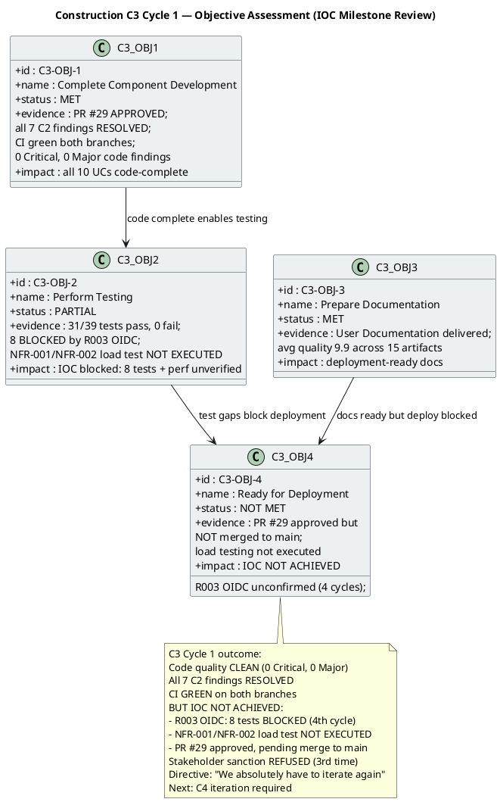

## Document Control

| Field | Value |
|---|---|
| Phase | Construction |
| Status | Active |
| Milestone Target | End-of-Construction (IOC) — NOT YET ACHIEVED |
| Iteration | 3 (Cycle 1) |
| Date | 2026-08-29 |
| Author | Project Manager (Project Management Discipline) |
| Prior Iteration | Construction C2 Cycle 3 — PR #28 APPROVED (all 7 C2 code-level findings RESOLVED); stakeholder sanction REFUSED 2nd time with PR synchronization directive |
| Evolution | C3 Cycle 1 Assessment: all 7 C2 findings RESOLVED (PR #29 APPROVED, CI green both branches); 0 Critical, 0 Major code findings; 31/39 tests pass, 0 fail, 8 BLOCKED by R003 OIDC; NFR-001/NFR-002 load testing NOT EXECUTED; PR #29 approved pending Integrator merge to main; stakeholder sanction REFUSED 3rd time; IOC NOT ACHIEVED — C4 iteration required |
| Stakeholder Sanction | **REFUSED (3rd time).** Directive: "We absolutely have to iterate again." Prior: REFUSED 2nd time (C2 Cycle 2). |
| Review Coordinator Verdict | **CONDITIONAL — IOC NOT ACHIEVED.** Code quality clean, all C2 findings resolved, CI green. 2 blockers: R003 OIDC (8 tests BLOCKED, 4th escalation cycle) and NFR-001/NFR-002 load testing not executed. PR #29 approved, pending Integrator merge to main. |
| Technical Lens | **PASS** — PR #29 APPROVED by Code Reviewer. All 7 C2 findings resolved. 0 new code findings. CI green on iteration/C3 (run 33250807692) and main (run 33251398612). |
| Management Lens | **2 new Major findings (IP-F5, RL-F5), 1 new Minor (IA-F1).** Prior IP-F4/RL-F2 RESOLVED. IP-F5: NFR load testing not executed. RL-F5: R003 OIDC risk not retired after 4 escalation cycles. IA-F1: stale Document Control fields (RESOLVED this update). |
| Business Lens | INACTIVE — BM discipline INACTIVE per DC §4 |
| Consolidated Verdict | **CONDITIONAL — IOC NOT ACHIEVED.** Stakeholder sanction REFUSED (3rd time). C4 iteration required. |

## Iteration Objectives Reached

The C3 Cycle 1 Iteration Plan defined 4 objectives: Complete Component Development, Perform Testing, Prepare Documentation, and Ready for Deployment. The Review Coordinator's verdict is **CONDITIONAL — IOC NOT ACHIEVED**. The stakeholder sanctioned REFUSED (3rd time) with directive: "We absolutely have to iterate again."

### C3 Cycle 1 Objective Detail

| Objective | Status | Evidence | C4 Action |
|---|---|---|---|
| C3-OBJ-1: Complete Component Development | **MET** | PR #29 APPROVED by Code Reviewer. All 7 C2 findings RESOLVED (C2-CRIT-1, C2-MAJ-1, C2-MAJ-2, C2-MIN-1..4). 0 new Critical, 0 new Major code findings. CI green on iteration/C3 (run 33250807692) and main (run 33251398612). All 10 UCs have code complete. | No action — code development complete |
| C3-OBJ-2: Perform Testing | **PARTIAL** | 31 of 39 tests pass, 0 failures, regression clean. 8 tests BLOCKED by R003 OIDC (STK-003 has not confirmed registration across 4 escalation cycles). NFR-001/NFR-002 load testing NOT EXECUTED — planned as work item 3 but not run (IP-F5). | C4: (1) resolve R003 OIDC or activate mock-auth contingency with stakeholder approval; (2) execute load testing decoupled from merge dependency |
| C3-OBJ-3: Prepare Documentation | **MET** | User Documentation delivered. Average artifact quality 9.9 across 15 artifacts. 15 artifacts produced, 15 agent invocations. | No action — documentation complete |
| C3-OBJ-4: Ready for Deployment | **NOT MET** | PR #29 approved but NOT merged to main (pending Integrator). R003 OIDC unconfirmed (4th cycle). Load testing not executed. 8 tests blocked. IOC cannot be achieved. | C4: merge PR #29 to main, unblock R003, execute load testing, re-review for IOC |

## Adherence to Plan

| Plan Element | Planned | Actual | Variance |
|---|---|---|---|
| C2 findings resolved | 7 of 7 | 7 of 7 (PR #29 APPROVED) | **ON TARGET** — all C2 code-level findings resolved |
| PR merge to main | PR #29 merged to main | PR #29 APPROVED, NOT merged | **DEFERRED** — Integrator merge pending |
| R003 OIDC escalation | STK-003 confirms registration | STK-003 still unconfirmed (4th cycle) | **BLOCKED** — external dependency, governance failure (RL-F5) |
| Tests passing | 39 of 39 | 31 of 39 (8 BLOCKED by R003) | **BLOCKED** — 8 tests cannot run without OIDC registration |
| NFR-001/NFR-002 load testing | Executed on merged main | NOT EXECUTED | **NOT MET** — IP-F5: load testing not run; dependency on merge cascaded |
| Budget box | ~18.84M tokens (C2 Cycle 2 baseline) | 12,752,568 tokens measured | **UNDER BUDGET** — 32% below C2 Cycle 2 baseline |
| Agent time | — | 1h 18m 10s | Measured actual |
| Stakeholder queue | — | 0s | No queue time this iteration |
| Mid-iteration checkpoints (IP-F4) | CP-1 through CP-4 | Checkpoints present in plan | **RESOLVED** — IP-F4 finding closed |

## Use Cases and Scenarios Implemented

| UC ID | Use Case | FR ID | C2/C3 Finding | Current Status |
|---|---|---|---|---|
| UC-001 | Clock In and Clock Out | FR-001 | C2-CRIT-1 + C2-MAJ-2 + C2-MIN-2 — ALL RESOLVED | Code complete; 8 OIDC-dependent tests BLOCKED |
| UC-002 | View Own Clocking History | FR-002 | No findings | Code complete; tests pass |
| UC-003 | View All Employee Clockings | FR-003 | No findings | Code complete; tests pass |
| UC-004 | Export Monthly Clocking Report | FR-004 | C2-MIN-4 — RESOLVED | Code complete; tests pass |
| UC-005 | Publish News | FR-005 | No findings | Code complete; OIDC-dependent tests BLOCKED |
| UC-006 | Edit Published News | FR-006 | C2-MAJ-1 — RESOLVED | Code complete; tests pass |
| UC-007 | Unpublish News | FR-007 | No findings | Code complete; tests pass |
| UC-008 | Read and Filter News | FR-008 | No findings | Code complete; tests pass |
| UC-009 | Search Employee Directory | FR-009 | C2-MIN-1 — DEFERRED (LDAP stub) | Code complete; LDAP adapter deferred to integration with real AD |
| UC-010 | Manage Worker Category | FR-010 | No findings | Code complete; OIDC-dependent tests BLOCKED |

> **All 10 UCs have code complete.** All 7 C2 findings resolved. Remaining gaps: (1) PR #29 not merged to main, (2) 8 tests blocked by R003 OIDC, (3) NFR-001/NFR-002 load testing not executed.

## Results Relative to Evaluation Criteria

| Exit Criterion (C3 Cycle 1) | Status | Evidence |
|---|---|---|
| All 7 C2 findings resolved — code quality clean | **MET** | PR #29 APPROVED; Code Reviewer confirms 0 Critical, 0 Major, 0 Minor new findings |
| CI build passes green on both branches | **MET** | iteration/C3: run 33250807692 GREEN; main: run 33251398612 GREEN |
| PR #29 merged to main | **NOT MET** | PR #29 APPROVED but pending Integrator merge to main |
| Integration testing on merged main — all tests pass | **PARTIAL** | 31/39 tests pass, 0 fail; 8 BLOCKED by R003 OIDC |
| NFR-001 load testing (<3s page load) | **NOT MET** | Load testing not executed (IP-F5) |
| NFR-002 load testing (<1s clocking response) | **NOT MET** | Load testing not executed (IP-F5) |
| R003 OIDC registration confirmed by STK-003 | **NOT MET** | STK-003 unconfirmed across 4 escalation cycles (RL-F5) |
| User Documentation delivered | **MET** | User Documentation artifact produced, avg quality 9.9 |
| Iteration Assessment produced | **MET** | This artifact |

## Test Results

| Test Category | Total | Pass | Fail | Blocked | Notes |
|---|---|---|---|---|---|
| ClockingServiceTests | 13 | 13 | 0 | 0 | All pass per PR #29 review |
| NewsServiceTests | — | — | — | — | Pass per PR #29 review |
| OfflineRetryTests | — | — | — | — | Pass per PR #29 review |
| DirectoryServiceTests | — | — | — | — | Pass per PR #29 review |
| WorkerCategoryServiceTests | — | — | — | — | Pass per PR #29 review |
| DomainTests | — | — | — | — | Pass per PR #29 review |
| OIDC-dependent tests | 8 | 0 | 0 | 8 | BLOCKED by R003 — STK-003 has not confirmed OIDC registration (4th cycle) |
| NFR-001 load test | — | — | — | — | NOT EXECUTED (IP-F5) |
| NFR-002 load test | — | — | — | — | NOT EXECUTED (IP-F5) |
| **Total** | **39** | **31** | **0** | **8** | 31 pass, 0 fail, 8 blocked by external dependency |

> **Measurement goal:** Test pass/block ratio enables the decision: can we achieve IOC with 8 blocked tests and unverified NFRs? Answer: **NO** — IOC cannot be achieved. 8 blocked tests cover authentication-dependent flows (UC-001 clocking, UC-005 news publish, UC-010 worker category management). NFR-001/NFR-002 performance requirements are unverified. Both must be resolved before IOC.

## External Changes

| Change | Source | Impact | Status |
|---|---|---|---|
| R003 OIDC registration | STK-003 (Infrastructure team) | 8 tests blocked; IOC achievement blocked | ESCALATED (4th cycle) — no response from STK-003. RL-F5: governance failure — perpetual escalation without decision. C4: hard deadline or mock-auth contingency to stakeholder. |
| Stakeholder PR sync directive | STK-001 feedback (C2 Cycle 2 review) | Integrator role added; PR #29 approved | ADDRESSED — PR #29 APPROVED; merge still pending |
| Stakeholder iteration directive | STK-001 feedback (C3 Cycle 1 review) | C4 iteration required | NEW — "We absolutely have to iterate again" |

## Rework Required

| Finding | Severity | Artifact | Status | Resolution |
|---|---|---|---|---|
| IP-F5 | Major | Iteration Plan | **OPEN** | NFR-001/NFR-002 load testing not executed. C4: decouple load testing from merge dependency; add fallback to test against iteration branch. |
| RL-F5 | Major | Risk List | **OPEN** | R003 OIDC risk not retired after 4 escalation cycles. C4: set hard deadline for STK-003; formally present mock-auth contingency to stakeholder for approval. |
| IA-F1 | Minor | Iteration Assessment | **RESOLVED** | Document Control fields updated with C3 Cycle 1 review results (this update). |
| IP-F4 | Minor | Iteration Plan | **RESOLVED** | Mid-iteration checkpoints added in C2 Cycle 3; preserved in C3 Cycle 1 |
| RL-F2 | Minor | Risk List | **RESOLVED** | R008 contingency activated in C2 Cycle 3; R008 now COMPLETE |
| DM-F1 | Minor | Design Model | **RESOLVED** | INT-003 office parameter updated (resolved by Code Reviewer) |
| TC-F2 | Minor | Test Case | **RESOLVED** | UnitTest1.cs placeholder removed (resolved by Code Reviewer) |

> **2 Major findings (IP-F5, RL-F5) remain OPEN and require C4 iteration work.** IA-F1 is RESOLVED by this update. All prior findings (IP-F4, RL-F2, DM-F1, TC-F2) are RESOLVED.

## Traceability

| Element | Traces From | Link Type | Traces To |
|---|---|---|---|
| C3-OBJ-1 (component dev) | Review Record C3 findings, PR #29 | Derives | PR #29 (APPROVED), all 10 UCs code-complete |
| C3-OBJ-2 (testing) | Iteration Plan C3 work items, NFR-001, NFR-002 | Derives | 31/39 tests pass, 8 BLOCKED, load test NOT EXECUTED |
| C3-OBJ-3 (documentation) | Iteration Plan C3 work items | Derives | User Documentation delivered |
| C3-OBJ-4 (deployment readiness) | All C3 objectives, IOC criteria | Derives | IOC NOT ACHIEVED — C4 required |
| IP-F5 (OPEN) | Review Record IP-F5, NFR-001, NFR-002 | Derives | C4 load testing work item |
| RL-F5 (OPEN) | Review Record RL-F5, R003, STK-003, CON-004 | Derives | C4 R003 hard deadline + mock-auth contingency |
| IA-F1 (RESOLVED) | Review Record IA-F1 | Resolved by | This Document Control update |
| R007 RESOLVED | Review Record C2 findings (all 7 resolved) | Resolved by | PR #29 |
| R008 COMPLETE | Stakeholder sanction refusal, rework cycles | Derives | C3 Cycle 1 (integration/IOC iteration) |
| R003 ESCALATION (4th) | R003, CON-004, STK-003, STK-001 | DependsOn | 8 blocked tests, IOC achievement |
| Stakeholder iteration directive | STK-001 feedback (C3 Cycle 1 review) | Refines | C4 iteration required (IOC not achieved) |