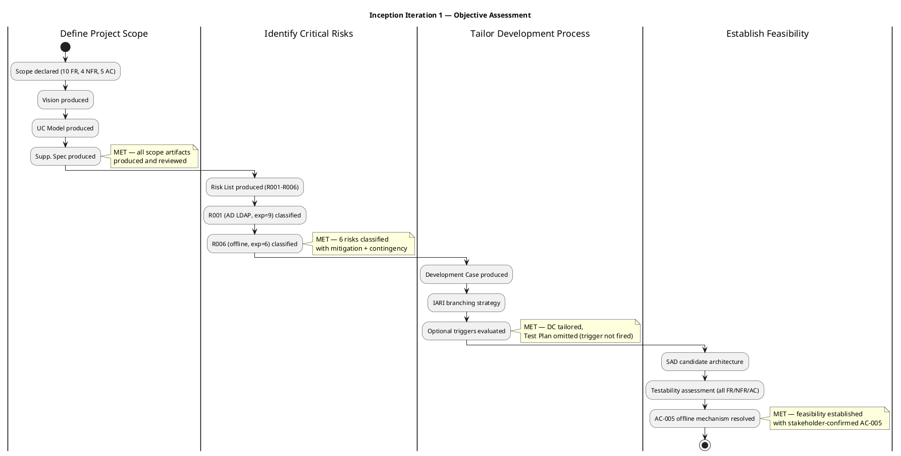
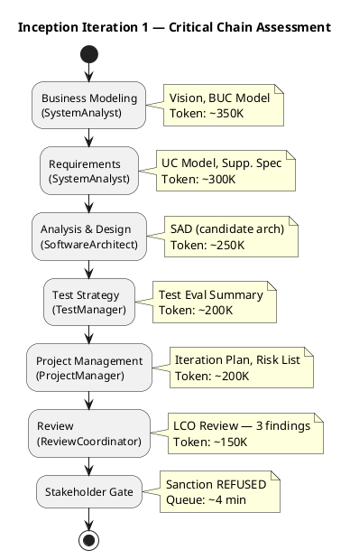
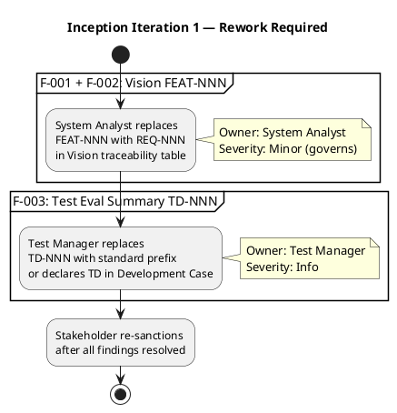

## Document Control

| Field | Value |
|---|---|
| Phase | Inception |
| Status | Draft |
| Milestone Target | End-of-Inception (LCO) |
| Iteration | 1 (Cycle 1) |
| Date | 2026-08-28 |
| Author | Project Manager (Project Management Discipline) |

## Iteration Objectives Reached

The Iteration Plan defined 4 objectives for Inception Iteration 1. The table below records the assessment of each, given the ReviewCoordinator's milestone verdict: **LCO: iteration REQUIRED (scope incomplete)**.

| # | Objective | Assessment | Evidence |
|---|---|---|---|
| 1 | Define Project Scope | **MET** | Vision (9 artifacts produced), Use-Case Model (UC-001–UC-010 mapping all FR-001–FR-010), Supplementary Specification (NFR-001–NFR-004, AC-001–AC-005). All scope artifacts produced and reviewed. |
| 2 | Identify Critical Risks | **MET** | Risk List produced with 6 risks (R001–R006), each classified by probability × impact = magnitude, with strategy, mitigation, and contingency. R001 (AD LDAP, exposure=9) and R006 (offline, exposure=6) are top-magnitude risks. |
| 3 | Tailor Development Process | **MET** | Development Case produced with IARI branching strategy. Optional triggers evaluated — Test Plan omitted (trigger not fired; Test Evaluation Summary is the deliverable). |
| 4 | Establish Feasibility | **MET** | SAD candidate architecture produced. Test Evaluation Summary confirms testability of all FR/NFR/AC. AC-005 offline mechanism resolved with stakeholder (server-side fault tolerance + bounded client-side localStorage retry for clocking POST, idempotency key, no PWA/service worker). |

**All 4 planned objectives were met.** The LCO milestone was NOT achieved because 3 open findings (F-001, F-002, F-003) remain unresolved and the stakeholder refused sanction until all findings are fixed. The objectives themselves were satisfied; the gate is blocked by finding resolution, not by objective failure.

## Adherence to Plan

### Iteration Metrics

| Metric | Value | Measurement Goal |
|---|---|---|
| Artifacts produced | 9 | **Evaluate** completeness of Inception deliverable set against Development Case sanctions |
| Agent invocations | 11 | **Monitor** agent role coverage across disciplines |
| User interactions | 12 | **Monitor** stakeholder engagement intensity — high for Inception is expected |
| Token spend | 1,909,799 | **Predict** baseline cost per iteration for Elaboration budget-box planning |
| Average quality score | 10.0 | **Evaluate** artifact quality against review bar — max score indicates no quality defects |
| Agent elapsed time | 1:23:33 | **Monitor** wall-clock agent work duration (excludes human queue time) |
| Human queue time | 0:04:14 | **Monitor** stakeholder response latency — low queue time indicates responsive stakeholders |

### Critical Chain

### Variance Analysis

| Planned | Actual | Variance | Root Cause |
|---|---|---|---|
| LCO milestone achieved at iteration close | LCO NOT achieved — iteration REQUIRED | Negative | 3 open findings (FEAT-NNN, TD-NNN prefix issues) + stakeholder refused sanction pending fix |
| 0 open findings at gate | 3 open findings (0 Critical, 0 Major, 1 Minor, 2 Info) | Negative | Non-standard ID prefixes (FEAT-NNN in Vision, TD-NNN in Test Evaluation Summary) not caught during self-review before artifact submission |
| Stakeholder sanction | REFUSED | Negative | Stakeholder directive: "Fix all findings even if they are minor findings" — sanction withheld until all 3 findings resolved |

**Root cause:** The iteration's substantive work (scope, risk, process tailoring, feasibility) was completed successfully. The gate block is caused by a documentation convention defect — non-standard element ID prefixes (FEAT-NNN, TD-NNN) that violate the standard ID conventions defined in the project's traceability framework. These are cosmetic findings (Info/Minor severity) with no impact on scope, architecture, or risk assessment, but the stakeholder's directive makes them gate-blocking.

## Use Cases and Scenarios Implemented

No use cases were implemented in code this iteration. Inception is a planning and assessment phase. The Use-Case Model (UC-001–UC-010) was produced, mapping all 10 functional requirements (FR-001–FR-010) to system use cases. Implementation begins in Elaboration.

| Use Case | FR | Status | Iteration Target |
|---|---|---|---|
| UC-001 Clock In/Out | FR-001 | Analyzed | Elaboration Iter 1 (PoC: offline + LDAP) |
| UC-002 View Clocking History | FR-002 | Analyzed | Construction Iter 1 |
| UC-003 View All Clockings | FR-003 | Analyzed | Construction Iter 1 |
| UC-004 Export CSV Report | FR-004 | Analyzed | Construction Iter 1 |
| UC-005 Publish News | FR-005 | Analyzed | Construction Iter 1 |
| UC-006 Edit News | FR-006 | Analyzed | Construction Iter 1 |
| UC-007 Unpublish News | FR-007 | Analyzed | Construction Iter 1 |
| UC-008 Read/Filter News | FR-008 | Analyzed | Construction Iter 2 |
| UC-009 Search Directory | FR-009 | Analyzed | Elaboration Iter 1 (PoC: AD LDAP) |
| UC-010 Manage Worker Category | FR-010 | Analyzed | Construction Iter 2 |

## Results Relative to Evaluation Criteria

The Iteration Plan carried 5 evaluation criteria. Assessment against each:

| # | Evaluation Criterion | Result | Evidence |
|---|---|---|---|
| 1 | All scope artifacts produced (Vision, UC Model, Supp. Spec, SAD, Risk List, Iteration Plan, Dev Case, Test Eval Summary) | **MET** | 9 artifacts listed and verified via `list_artifacts` |
| 2 | Risk List complete with R001–R006 classified (probability, impact, magnitude, strategy, mitigation, contingency) | **MET** | Risk List artifact produced with 6 risks, all classified |
| 3 | Coarse roadmap defined (6 iterations [1,2,2,1], milestone sequence LCO→LCA→IOC→PR, agent role profile) | **MET** | Iteration Plan "Plan and Milestones" section carries roadmap |
| 4 | LCO readiness assessed | **MET** | Iteration Plan "LCO Readiness Assessment" subsection produced |
| 5 | No open SCOPE_QUESTION blocking the gate | **MET** | No SCOPE_QUESTION raised — all scope is declared; AC-005 resolved by stakeholder |

## Test Results

No code was produced this iteration; no tests were executed. The Test Evaluation Summary established the test strategy foundation:

- **Testability confirmed** for all 10 FRs, 4 NFRs, and 5 ACs
- **6 testing risks** identified (R001–R006 mapped to test coverage)
- **AC-001–AC-005** mapped to future test coverage (Elaboration PoC → Construction functional → Transition UAT)
- **Test infrastructure dependency:** STK-003 must provide test AD and OIDC client before Elaboration PoC testing — not yet confirmed

| Test Artifact | Status | Finding |
|---|---|---|
| Test Evaluation Summary | Produced | F-003 (Info): TD-NNN prefix non-standard — must replace with standard prefix or declare in Development Case |

## External Changes

No external changes occurred during this iteration. The stakeholder confirmed: "Nothing else to add for this new iteration" — no additional requirements, corrections, or priorities beyond resolving the 3 open findings.

**AC-005 clarification (stakeholder decision, not a change):** The stakeholder resolved the AC-005 ambiguity — server-side fault tolerance plus bounded client-side localStorage retry for the clocking POST (up to 5 minutes, idempotency key, no PWA/service worker). This does not override CON-002 (Razor Pages) and is not the excluded sync work. This decision was captured in the Supplementary Specification and informs the Elaboration PoC plan.

## Rework Required

Three findings must be resolved before the LCO gate can close. The stakeholder directed: "Fix all findings even if they are minor findings."

| Finding ID | Artifact | Severity | Issue | Rework Action | Owner |
|---|---|---|---|---|---|
| F-001 | Vision | Info | FEAT-NNN prefix non-standard | Replace FEAT-NNN with REQ-NNN in Vision traceability table (subsumed by F-002) | System Analyst |
| F-002 | Vision | Minor | FEAT-NNN prefix non-standard (management lens — compromises RTM) | Replace FEAT-NNN with REQ-NNN in Vision traceability table | System Analyst |
| F-003 | Test Evaluation Summary | Info | TD-NNN prefix non-standard | Replace TD-NNN with standard prefix or declare TD in Development Case | Test Manager |

**Next pass scope:** Fix F-001/F-002 (Vision) and F-003 (Test Evaluation Summary). No other work items — stakeholder confirmed no additional requirements for the next pass. Once all 3 findings are resolved, the stakeholder re-sanctions and the LCO gate closes.

## Traceability

| Element | Traces From | Link Type | Traces To |
|---|---|---|---|
| Iteration Assessment | Iteration Plan (Inception Iter 1) | Derives | LCO Milestone Review (Review Coordinator) |
| Objective 1 (Define Scope) | Iteration Plan §Iteration Objectives | Refines | Vision, Use-Case Model, Supplementary Specification |
| Objective 2 (Identify Risks) | Iteration Plan §Iteration Objectives | Refines | Risk List (R001–R006) |
| Objective 3 (Tailor Process) | Iteration Plan §Iteration Objectives | Refines | Development Case |
| Objective 4 (Establish Feasibility) | Iteration Plan §Iteration Objectives | Refines | SAD, Test Evaluation Summary |
| F-001, F-002 | Review Record §Findings | Derives | Vision (rework: FEAT-NNN → REQ-NNN) |
| F-003 | Review Record §Findings | Derives | Test Evaluation Summary (rework: TD-NNN → standard prefix) |
| Metrics (token spend, quality) | Iteration facts (system-measured) | Derives | Elaboration Iteration Plan (budget-box baseline) |
| AC-005 decision | Stakeholder answer (System Analyst round) | Refines | Supplementary Specification, Elaboration PoC plan |