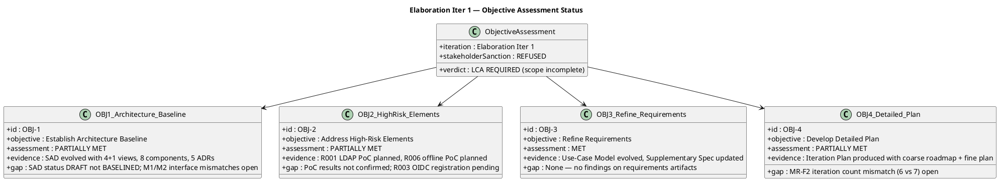
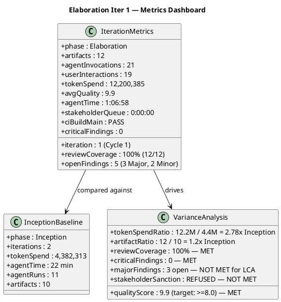
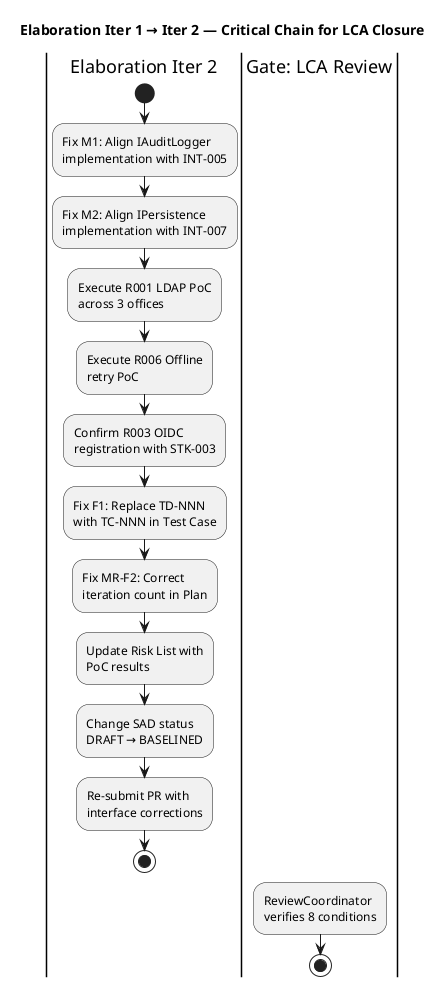

## Document Control

| Field | Value |
|---|---|
| Phase | Elaboration |
| Status | Final |
| Milestone Target | End-of-Elaboration (LCA) — NOT ACHIEVED |
| Iteration | 1 (Cycle 1) |
| Date | 2026-08-28 |
| Author | Project Manager (Project Management Discipline) |
| ReviewCoordinator Verdict | LCA: iteration REQUIRED (scope incomplete) |
| Management Verdict | CONDITIONAL — 8 conditions for LCA closure at end of Iter 2 |
| Stakeholder Sanction | REFUSED — STK-001: "We need to iterate again. There are issues to mitigate, pull requests to close, and findings to address, even if they're minor." |
| Consolidated Verdict | NOT ACHIEVED — 0 Critical, 3 Major (open), 2 Minor (open) |
| CI Build (main) | PASS — completed 2026-08-28 10:50:54Z |

## Iteration Objectives Reached

The Iteration Plan defined 4 objectives for Elaboration Iteration 1. The table below records the assessment of each, given the ReviewCoordinator's milestone verdict: **LCA: iteration REQUIRED (scope incomplete)**.

| # | Objective | Assessment | Evidence | Gap |
|---|---|---|---|---|
| 1 | Establish Architecture Baseline | **PARTIALLY MET** | SAD evolved from Inception candidate to Elaboration draft with 4+1 views, 8 components (COMP-001–COMP-008), 5 ADRs, 3 sequence diagrams. Design Model produced for top-3 UCs (UC-009, UC-001, UC-005). CI build PASS on main. | SAD status remains DRAFT — not BASELINED. M1 (IAuditLogger INT-005 signature mismatch) and M2 (IPersistence INT-007 transaction API mismatch) open — implementation diverges from Design Model interfaces. Architecture cannot be baselined with unresolved interface divergences. |
| 2 | Address High-Risk Elements | **PARTIALLY MET** | R001 (LDAP, exposure=9) and R006 (offline retry, exposure=6) mitigation plans defined in Risk List. PoC scope identified. R003 (OIDC registration) tracked as external dependency. | PoC results NOT confirmed — R001 and R006 remain in MITIGATING status without empirical evidence. R003 OIDC client registration pending with STK-003. MR-F1 (Major) raised: risk evidence insufficient for LCA closure. |
| 3 | Refine Requirements | **MET** | Use-Case Model evolved to Elaboration with all 10 UCs (UC-001–UC-010) mapped to FR-001–FR-010. Supplementary Specification updated with NFR-001–NFR-004, AC-001–AC-005. No findings raised against requirements artifacts. | None. |
| 4 | Develop Detailed Plan | **PARTIALLY MET** | Iteration Plan produced with coarse cross-iteration roadmap (6 iterations across 4 phases) and fine-grained Iter 1 plan with work items, owners, and token budgets. Risk List updated with Elaboration status. | MR-F2 (Minor): iteration count mismatch — narrative says "6 iterations" but roadmap table shows 7. Must correct before LCA closure. |

**Summary: 1 of 4 objectives fully met, 3 partially met.** The LCA milestone is NOT achieved. The ReviewCoordinator's verdict (iteration REQUIRED) and the stakeholder's refusal to sanction are consistent with this assessment: the architecture baseline is incomplete (interface divergences), PoC evidence is absent, and 5 findings remain open.

## Adherence to Plan

| Plan Element | Planned | Actual | Variance |
|---|---|---|---|
| Token budget box | ~3.0M tokens [ASSUMPTION — derived from Inception measured: 4.38M / 2 iters ≈ 2.19M/iter, inflated for Elaboration risk work] | 12,200,385 tokens | +307% over assumption — Elaboration's artifact surface (12 artifacts vs Inception's 10) and risk-driven PoC planning consumed significantly more reasoning effort than the Inception-derived baseline predicted. **This measured actual replaces the assumption for all future forecasts.** |
| Agent time | [ASSUMPTION — Inception: 22 min / 2 iters ≈ 11 min/iter] | 1:06:58 (66.98 min) | +508% over assumption — Elaboration's deeper analysis across 12 artifacts with 21 agent invocations vs Inception's 11 runs. **This measured actual replaces the assumption.** |
| Stakeholder queue | 0 (Inception baseline) | 0:00:00 | On target — no stakeholder queue incurred during iteration execution. |
| Artifacts produced | 12 planned | 12 produced | On target — 100% artifact production. |
| Agent invocations | [ASSUMPTION — Inception: 11 runs / 2 iters ≈ 5.5/iter] | 21 | +282% — Elaboration requires more agent rounds for architecture, design, test, and review work. |
| Avg quality score | Target ≥ 8.0 | 9.9 | Exceeds target — quality is high despite scope gaps. |
| CI build (main) | PASS | PASS | On target. |
| Review coverage | 100% | 100% (12/12) | On target. |
| Open findings at iteration close | 0 (target for LCA) | 5 (3 Major, 2 Minor) | NOT MET — 5 findings open, all assigned to Elaboration Iter 2. |

### Measured Actuals — Updated Project Record

| Phase | Iterations | Agent time | Stakeholder queue | Tokens | Agent runs | Artifacts |
|---|---|---|---|---|---|---|
| Inception | 2 | 22 min | 0s | 4,382,313 | 11 | 10 |
| Elaboration (Iter 1) | 1 | 1:06:58 | 0s | 12,200,385 | 21 | 12 |
| **Cumulative** | **3** | **1:28:58** | **0s** | **16,582,698** | **32** | **22** |

**Key insight:** Elaboration Iter 1 cost 2.78× the token spend of the entire Inception phase. This is the measured shape — not the assumed shape. The Inception-derived per-iteration assumption (2.19M tokens) is invalidated. Future iteration budgets must be sized from this measured actual, not from Inception rates. The cost driver is reasoning over the accumulated artifact surface (12 artifacts, each requiring re-reading and cross-referencing), not the volume of new artifacts emitted.

## Use Cases and Scenarios Implemented

| UC ID | Use Case | Design Model | Test Case | Implementation | Status |
|---|---|---|---|---|---|
| UC-001 | Clock In and Clock Out | Designed (CLS-001–CLS-005, SEQ-001) | TC-005 defined | Prototype PR #4 (interface divergences M1/M2) | PARTIALLY IMPLEMENTED — prototype exists but interfaces diverge from Design Model |
| UC-005 | Publish News | Designed (audit pattern, SEQ-002) | TC-004 defined | Prototype PR #4 (IAuditLogger mismatch) | PARTIALLY IMPLEMENTED — audit interface mismatch open |
| UC-009 | Search Employee Directory | Designed (LDAP integration, SEQ-003) | TC-001 defined | Prototype PR #4 | PARTIALLY IMPLEMENTED — pending PoC validation of LDAP attributes |
| UC-002 | View Own Clocking History | Designed | TC defined | Not implemented this iteration | DESIGNED ONLY |
| UC-003 | View All Employee Clockings | Designed | TC defined | Not implemented this iteration | DESIGNED ONLY |
| UC-004 | Export Monthly Clocking Report | Designed | TC defined | Not implemented this iteration | DESIGNED ONLY |
| UC-006 | Edit Published News | Designed | TC defined | Not implemented this iteration | DESIGNED ONLY |
| UC-007 | Unpublish News | Designed | TC defined | Not implemented this iteration | DESIGNED ONLY |
| UC-008 | Read and Filter News | Designed | TC defined | Not implemented this iteration | DESIGNED ONLY |
| UC-010 | Manage Worker Category | Designed | TC defined | Not implemented this iteration | DESIGNED ONLY |

**Elaboration scope:** 3 architecturally significant UCs (UC-001, UC-005, UC-009) targeted for design + prototype. All 10 UCs received design-level coverage. 3 UCs have prototype implementations with interface divergences. This is consistent with Elaboration's purpose (architecture validation, not feature completeness).

## Results Relative to Evaluation Criteria

The Iteration Plan defined evaluation criteria for this iteration. Each is assessed below against the evidence:

| # | Evaluation Criterion | Assessment | Evidence |
|---|---|---|---|
| 1 | SAD evolved from candidate to baseline (4+1 views, 8 components, 5 ADRs) | **NOT MET** | SAD produced with 4+1 views, 8 components, 5 ADRs — but status remains DRAFT, not BASELINED. M1/M2 interface divergences prevent baselining. |
| 2 | R001 LDAP PoC executed with results across 3 offices | **NOT MET** | PoC planned but results not confirmed. MR-F1 (Major) raised: risk evidence insufficient. |
| 3 | R006 offline retry PoC executed with results | **NOT MET** | PoC planned but results not confirmed. MR-F1 (Major) raised. |
| 4 | R003 OIDC registration confirmed with STK-003 | **NOT MET** | Registration pending with STK-003. External dependency not resolved. |
| 5 | R005 UI design compliance verified against CON-011 | **MET** | UI Designer verified Razor Pages compatibility with mandatory design. No findings raised against UI compliance. |
| 6 | Design Model produced for top-3 UCs (UC-009, UC-001, UC-005) | **MET** | Design Model covers all 3 UCs with class diagrams and sequence diagrams. |
| 7 | CI build passes on main | **MET** | Build PASS — completed 2026-08-28 10:50:54Z on main branch. |
| 8 | Review coverage 100% | **MET** | 12/12 artifacts reviewed across all lenses. |
| 9 | 0 Critical, 0 Major findings at iteration close | **NOT MET** | 0 Critical, 3 Major (M1, M2, MR-F1), 2 Minor (F1, MR-F2) — 5 open findings. |
| 10 | Stakeholder sanction to advance | **NOT MET** | STK-001 refused: "We need to iterate again." |

**Score: 4 of 10 criteria met.** The iteration produced substantial artifacts (12, avg quality 9.9) but did not achieve the risk-retirement and architecture-baselining objectives that define Elaboration's purpose. The LCA milestone requires another iteration.

## Test Results

| Test Config | UCs Covered | Risk/CR Addressed | Status | Evidence |
|---|---|---|---|---|
| TC-001 | UC-009 (Directory Search) | R001 (LDAP attributes) | DEFINED — not executed | Test Case defined; PoC execution deferred to Iter 2 |
| TC-002 | UC-001 (Clocking) | R004 (performance) | DEFINED — not executed | Performance test deferred to Construction |
| TC-003 | UC-001 (Offline retry) | R006 (offline), AC-005 | DEFINED — not executed | Offline retry PoC deferred to Iter 2 |
| TC-004 | UC-005 (News audit) | NFR-004 (audit trail) | DEFINED — not executed | Audit trail test defined; M1 interface mismatch blocks execution |
| TC-005 | UC-001, UC-005, UC-009 | AC-001, AC-002, AC-003 | DEFINED — not executed | Integration test deferred to Construction |

**Test execution status: 0 of 5 test configs executed.** All test cases are defined but none executed. The Test Evaluation Summary confirms: "Defect Removal Efficiency: 5 found in review / 0 found in test = 100% (test BLOCKED) — test execution blocked by PR #4 interface divergences." All defects were found by review, none by test. This is expected for Elaboration (architecture validation phase), but the M1/M2 interface mismatches must be resolved before any test execution can proceed in Iter 2.

### Metrics Dashboard

| Metric | Value | Decision Enabled |
|---|---|---|
| Token spend | 12,200,385 | Sizes Iter 2 budget box from measured actual, not Inception assumption |
| Agent time | 1:06:58 | Validates that Elaboration requires ~3× the per-iteration agent time of Inception |
| Avg quality | 9.9 | Confirms artifact quality is not the problem — scope completion is |
| Open findings | 5 (3 Major, 2 Minor) | Drives Iter 2 scope: all 5 findings must close before LCA gate |
| Test execution | 0/5 configs executed | M1/M2 resolution is prerequisite to any test execution in Iter 2 |
| CI build | PASS (main) | Prototype code compiles — infrastructure is sound despite interface divergences |

## External Changes

| Change | Source | Impact | Status |
|---|---|---|---|
| R003 OIDC client registration | STK-003 (Infrastructure team) | External dependency — portal cannot test authentication until registered | Pending — must be confirmed in Iter 2 |
| Stakeholder demand: all findings resolved | STK-001 (LCA consultation answer) | Even minor findings must be addressed before sanction | Active — drives Iter 2 scope to include F1 and MR-F2 |

No Change Requests were approved during this iteration. The 3 initial CRs (CR-001, CR-002, CR-003) from earlier context remain: 2 parked for Architect, 1 deferred to Iter 2.

## Rework Required

All 5 open findings require rework in Elaboration Iteration 2. None can be deferred.

```plantuml
@startuml
title Elaboration Iter 1 — Finding Disposition and Iter 2 Action Plan

skinparam classAttributeIconSize 0

class FindingTracker {
  + totalOpen : 5
  + critical : 0
  + major : 3
  + minor : 2
  + allAssigned : true
}

class M1_IAuditLogger {
  + key : M1
  + severity : MAJOR
  + artifact : PR #4 / Design Model
  + lens : Code Reviewer
  + finding : IAuditLogger LogAudit() signature mismatch
  + owner : Implementer
  + deadline : Elaboration Iter 2
  + status : Open - Assigned
  + iter2Action : Align implementation with Design Model INT-005
}

class M2_IPersistence {
  + key : M2
  + severity : MAJOR
  + artifact : PR #4 / Design Model
  + lens : Code Reviewer
  + finding : IPersistence transaction API mismatch
  + owner : Implementer
  + deadline : Elaboration Iter 2
  + status : Open - Assigned
  + iter2Action : Align implementation with Design Model INT-007
}

class MR_F1_RiskEvidence {
  + key : MR-F1
  + severity : MAJOR
  + artifact : Risk List
  + lens : Management Reviewer
  + finding : R001/R006 MITIGATING without PoC results; R003 pending
  + owner : Software Architect
  + deadline : Elaboration Iter 2
  + status : Open - Assigned
  + iter2Action : Execute PoCs, confirm R003 OIDC registration
}

class F1_TD_Prefix {
  + key : F1
  + severity : MINOR
  + artifact : Test Case
  + lens : Reviewer
  + finding : TD-NNN prefix non-standard
  + owner : Test Designer / Process Engineer
  + deadline : Elaboration Iter 2
  + status : Open - Assigned
  + iter2Action : Replace TD-NNN with TC-NNN or declare in Dev Case
}

class MR_F2_CountMismatch {
  + key : MR-F2
  + severity : MINOR
  + artifact : Iteration Plan
  + lens : Management Reviewer
  + finding : Iteration count mismatch (6 vs 7)
  + owner : Project Manager
  + deadline : Elaboration Iter 2
  + status : Open - Assigned
  + iter2Action : Correct roadmap table to match narrative (6 iterations)
}

FindingTracker --> M1_IAuditLogger
FindingTracker --> M2_IPersistence
FindingTracker --> MR_F1_RiskEvidence
FindingTracker --> F1_TD_Prefix
FindingTracker --> MR_F2_CountMismatch

@enduml
```

| Finding | Severity | Artifact | Owner | Rework Action | Blocks LCA? |
|---|---|---|---|---|---|
| M1 | Major | PR #4 / Design Model | Implementer | Align IAuditLogger implementation with INT-005 contract in Design Model | YES |
| M2 | Major | PR #4 / Design Model | Implementer | Align IPersistence implementation with INT-007 transaction API in Design Model | YES |
| MR-F1 | Major | Risk List | Software Architect | Execute R001 LDAP PoC and R006 offline PoC; confirm R003 OIDC registration; update Risk List with results | YES |
| F1 | Minor | Test Case | Test Designer / Process Engineer | Replace TD-NNN prefix with TC-NNN or declare convention in Development Case | NO (but stakeholder demands resolution) |
| MR-F2 | Minor | Iteration Plan | Project Manager | Correct iteration count in roadmap table to match narrative (6 iterations) | NO (but stakeholder demands resolution) |

### Iter 2 Critical Chain

### LCA Closure Conditions (from Management Reviewer)

The Management Reviewer defined 8 conditions that must all be satisfied for LCA closure at end of Iter 2:

| # | Condition | Owner | Current Status |
|---|---|---|---|
| 1 | R001 PoC results confirmed | Software Architect | Not started — PoC deferred |
| 2 | R006 PoC results confirmed | Software Architect | Not started — PoC deferred |
| 3 | M1 IAuditLogger interface mismatch resolved | Implementer | Open — assigned |
| 4 | M2 IPersistence interface mismatch resolved | Implementer | Open — assigned |
| 5 | Architecture status changed DRAFT → BASELINED | Software Architect | Blocked by conditions 1–4 |
| 6 | R003 OIDC registration confirmed | STK-003 / Software Architect | Pending — external dependency |
| 7 | F1 TD-NNN prefix resolved | Test Designer / Process Engineer | Open — assigned |
| 8 | MR-F2 iteration count corrected | Project Manager | Open — assigned |

## Lessons Learned

1. **Elaboration cost is not Inception cost scaled linearly.** Elaboration Iter 1 consumed 2.78× the tokens of the entire Inception phase. The cost driver is reasoning over the accumulated artifact surface (12 artifacts, each re-read and cross-referenced), not the volume of new artifacts. Future budget boxes must be sized from Elaboration measured actuals, not Inception rates.

2. **Interface divergences between Design Model and implementation block both testing and architecture baselining.** M1 and M2 are not cosmetic — they prevent test execution (0/5 configs run) and prevent SAD baselining. The Design Model is the contract; implementation must conform, not the reverse.

3. **PoC planning without execution is insufficient for risk retirement.** R001 and R006 have mitigation plans but no empirical evidence. The Management Reviewer correctly flagged this as a Major finding (MR-F1). Risk status MITIGATING without PoC results is a claim, not evidence.

4. **Stakeholder demands all findings resolved — even minor.** STK-001's refusal to sanction with "even if they're minor" means F1 and MR-F2 cannot be deferred. This is a project constraint, not a preference. The Iter 2 plan must include minor finding resolution in its scope.

5. **Quality (9.9) and scope completion are independent dimensions.** High artifact quality does not compensate for incomplete risk retirement. The LCA gate evaluates whether the architecture is baselined and risks are retired — not whether the artifacts are well-written.

## N+1 Adjustments for Elaboration Iteration 2

The following adjustments are required for the next Iteration Plan:

| Adjustment | Rationale | Impact |
|---|---|---|
| Budget box sized from measured actual | Inception-derived assumption (3.0M) invalidated by 12.2M actual | Iter 2 budget box: [ASSUMPTION — requires validation] ~6–8M tokens based on Elaboration Iter 1 measured at 12.2M, reduced by ~40–50% since PoC execution + interface fixes are narrower than full architecture design |
| Scope: all 5 findings must close | Stakeholder demands all findings resolved; LCA conditions 1–8 | Iter 2 scope is finding-driven, not feature-driven |
| R001 LDAP PoC execution is mandatory | LCA condition 1; MR-F1 (Major) | Software Architect must execute and document results |
| R006 offline retry PoC execution is mandatory | LCA condition 2; MR-F1 (Major) | Software Architect must execute and document results |
| R003 OIDC registration confirmation | LCA condition 6; external dependency | Escalate to STK-003 at iteration start; activate mock auth contingency if not registered |
| M1/M2 interface alignment + PR resubmission | LCA conditions 3–4; blocks test execution | Implementer must fix and re-submit PR |
| SAD status DRAFT → BASELINED | LCA condition 5; blocked by 1–4 | Software Architect updates after conditions 1–4 close |
| F1 TD-NNN → TC-NNN | Stakeholder demand; LCA condition 7 | Test Designer / Process Engineer resolves |
| MR-F2 iteration count correction | Stakeholder demand; LCA condition 8 | Project Manager resolves in Iteration Plan |
| Test execution unblocked after M1/M2 fix | 0/5 configs executed; all blocked by interface divergences | Test Designer executes TC-001 (LDAP) and TC-003 (offline) after PoCs complete |

## Traceability

| Element | Traces From | Link Type | Traces To |
|---|---|---|---|
| Iteration Assessment (Elaboration Iter 1) | Iteration Plan (Elaboration Iter 1) | Refines | Elaboration Iter 2 Iteration Plan |
| OBJ-1 (Architecture Baseline) | Iteration Plan §Iteration Objectives | Derives | SAD, Design Model, PR #4 |
| OBJ-2 (High-Risk Elements) | Iteration Plan §Iteration Objectives | Derives | Risk List (R001, R006, R003), PoC results |
| OBJ-3 (Refine Requirements) | Iteration Plan §Iteration Objectives | Derives | Use-Case Model, Supplementary Specification |
| OBJ-4 (Detailed Plan) | Iteration Plan §Iteration Objectives | Derives | Iteration Plan, Risk List |
| M1 finding | Review Record §Finding Tracker | Derives | Design Model INT-005, PR #4 |
| M2 finding | Review Record §Finding Tracker | Derives | Design Model INT-007, PR #4 |
| MR-F1 finding | Review Record §Finding Tracker | Derives | Risk List (R001, R006, R003) |
| F1 finding | Review Record §Finding Tracker | Derives | Test Case |
| MR-F2 finding | Review Record §Finding Tracker | Derives | Iteration Plan |
| LCA Conditions (1–8) | Management Reviewer verdict | Derives | Elaboration Iter 2 objectives |
| Measured actuals (tokens, time) | Iteration facts (system-measured) | Derives | Elaboration Iter 2 Iteration Plan (budget box) |
| Stakeholder sanction (REFUSED) | STK-001 answer (LCA consultation) | Refines | LCA milestone decision (NOT ACHIEVED) |
| CI build status (PASS) | scm_get_build_status (main) | Tests | PR #4, all source files |
| Lessons learned | Iteration 1 execution facts | Derives | Elaboration Iter 2 Plan, Risk List |