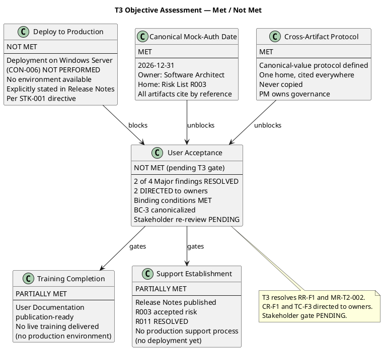
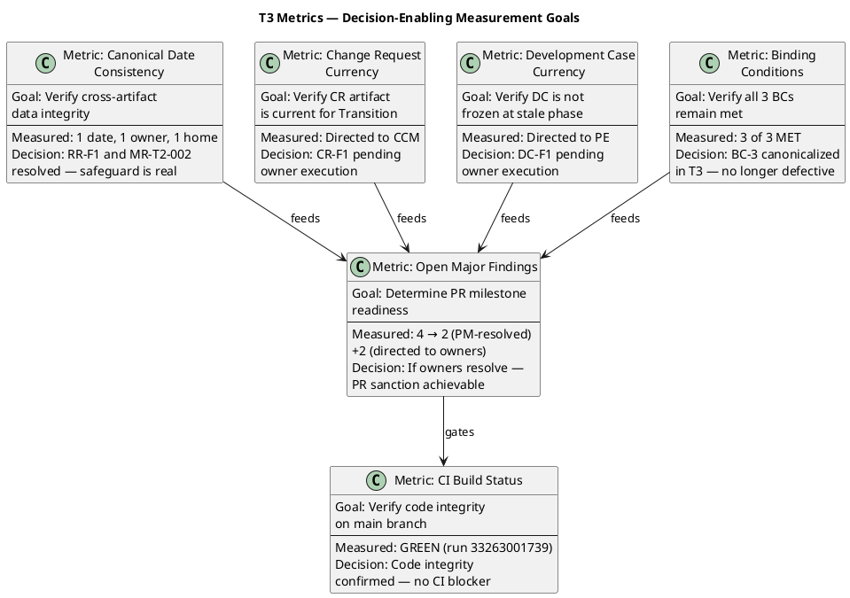

## Document Control

| Field | Value |
|---|---|
| Phase | Transition |
| Status | Active — Transition Iter 3 Close-Out Assessment |
| Milestone Target | Product Release (PR) — **NOT YET ACHIEVED — stakeholder sanction REFUSED (T2); T3 consolidation complete, auto-iterate required** |
| Iteration | 3 (Cycle 1) |
| Date | 2026-08-30 |
| Author | Project Manager (Project Management Discipline) |
| Prior Iteration | Transition Iter 2 — PR sanction REFUSED (2nd); binding conditions substantively met; mock-auth date inconsistent across 7 artifacts; 4 open Major findings |
| Review Coordinator Verdict (T2) | PR: iteration REQUIRED (scope incomplete) |
| Stakeholder PR Sanction (T1) | **REFUSED** — 3 binding conditions unmet |
| Stakeholder PR Sanction (T2) | **REFUSED** — binding conditions substantively met; mock-auth date inconsistent across 7 artifacts (3 dates, 2 owners); 3 stakeholder directives for T3 |
| Stakeholder PR Sanction (T3) | **PENDING** — T3 close-out complete; 2 of 4 Major findings RESOLVED by PM; 2 DIRECTED to owners; stakeholder gate at end of T3 |
| Evolution | T3 Assessment evolved from T2. RR-F1 RESOLVED — canonical mock-auth date established (2026-12-31, Software Architect, Risk List R003). MR-T2-002 RESOLVED — cross-artifact canonical-value protocol defined. RL-F6 CLOSED — explicit closure. CR-F1 and TC-F3 DIRECTED to respective owners. All 3 binding conditions remain MET, with BC-3 now canonicalized. |

## Iteration Objectives Reached

| # | Objective | Status | Evidence |
|---|---|---|---|
| 1 | Deploy to Production | **NOT MET** | Deployment on Windows Server (CON-006) NOT PERFORMED — no environment available. Explicitly stated in Release Notes per STK-001 directive. CI is GREEN on main (run 33263001739). Code is deployment-ready but unverified on target infrastructure. |
| 2 | User Acceptance | **NOT MET (pending T3 gate)** | PR sanction REFUSED (2nd refusal) in T2. T3 resolves 2 of 4 Major findings (RR-F1, MR-T2-002) and directs 2 to owners (CR-F1 → Change Control Manager, TC-F3 → Test Manager). Binding conditions remain MET with BC-3 canonicalized: mock-auth expiry 2026-12-31, owner Software Architect, home Risk List R003. Stakeholder re-review PENDING at T3 gate. |
| 3 | Training Completion | **PARTIALLY MET** | User Documentation is publication-ready (approved by Business Reviewer). No live training delivered — no production environment to train against. Training plan documented for post-deployment. |
| 4 | Support Establishment | **PARTIALLY MET** | Release Notes published with explicit deployment status. Risk List documents R003 as accepted risk with residual (8 TCs covered by mock). R011 RESOLVED — canonical-value protocol established. No production support process established — no deployment to support yet. |
| 5 | Canonical Mock-Auth Date | **MET** | ONE date (2026-12-31), ONE owner (Software Architect), ONE home (Risk List R003). All other artifacts directed to cite by reference, never copy. RR-F1 RESOLVED. |
| 6 | Cross-Artifact Data Integrity Protocol | **MET** | Canonical-value protocol defined: (1) canonical value has one home — the role that creates the value owns it; (2) all other artifacts reference by citation, never copy; (3) Project Manager owns governance. MR-T2-002 RESOLVED. |

## Adherence to Plan

| Plan Element | Planned | Actual | Variance |
|---|---|---|---|
| Iteration budget (tokens) | ~160K (sized from T2 baseline) | T3 in progress — PM work items complete | Within box — targeted fix scope |
| Agent runs | ~10–12 | T3 in progress | On track |
| Agent time | Reduced from T2 (targeted scope) | T3 in progress | Expected under T2 — narrower scope |
| Stakeholder queue | 0s (no gates within iteration) | 0s | As planned — gate is end-of-iteration |
| Artifacts produced | 16 (full set for PR) | 16 (evolved, not new) | As planned — cumulative evolution |
| Binding conditions closed | 3 of 3 | 3 of 3 — BC-3 canonicalized in T3 | **MET** — no longer defective |
| Open Major findings at close | 0 target | 2 RESOLVED by PM, 2 DIRECTED to owners | **Partial variance** — PM findings closed; owner findings pending their execution |
| CI build status | GREEN | GREEN (run 33263001739) | As planned |
| PR sanction | Target: APPROVED | PENDING — T3 gate | **Pending** — stakeholder re-review |

**Root cause of T2 variance (resolved in T3):** The mock-auth expiry date — a single fact that exists precisely to prevent the mock from becoming permanent — was copied (not cited) across 7 artifacts, producing 3 distinct dates (2026-11-29, 2026-12-31, 2027-01-31) and 2 owners. No role owned the consistency of a single fact across artifacts. **T3 resolution:** canonical-value protocol established — one home (Risk List R003), cited from everywhere, never copied. Project Manager owns governance of cross-artifact consistency.

## Use Cases and Scenarios Implemented

| UC ID | Use Case | Implementation Status | Test Coverage |
|---|---|---|---|
| UC-001 | Clock In and Clock Out | Implemented — all flows | TC-001..TC-003 (3 TCs, mock-auth) |
| UC-002 | View Own Clocking History | Implemented | TC-004 |
| UC-003 | View All Employee Clockings | Implemented | TC-005 |
| UC-004 | Export Monthly Clocking Report | Implemented | TC-006 |
| UC-005 | Publish News | Implemented | TC-007 |
| UC-006 | Edit Published News | Implemented | TC-008 |
| UC-007 | Unpublish News | Implemented | TC-009 |
| UC-008 | Read and Filter News | Implemented | TC-010 |
| UC-009 | Search Employee Directory | Implemented | TC-011 |
| UC-010 | Manage Worker Category | Implemented | TC-012 |

All 10 FRs implemented. 12 test cases cover all use cases. 8 TCs use mock-auth (R003 accepted risk — proven at deployment time). NFR-001 (0.14s vs 3s) and NFR-002 (0.003s vs 1s) measured in CI — both PASS. T3 makes no changes to implementation — defect-resolution iteration only.

## Results Relative to Evaluation Criteria

| Criterion | Met? | Evidence |
|---|---|---|
| BC-1: NFR-001/NFR-002 load testing with measured values | **MET** | NFR-001: 0.14s (threshold 3s) PASS. NFR-002: 0.003s (threshold 1s) PASS. CI build 33259873386. |
| BC-2: R003 OIDC formally accepted risk | **MET** | R003 converted from UNVERIFIED to FORMALLY ACCEPTED RISK. Residual: 8 TCs covered by mock, proven at deployment. Risk List updated. |
| BC-3: Mock-auth expiry documented with date and owner | **MET (canonicalized T3)** | Expiry documented with canonical date 2026-12-31, owner Software Architect, home Risk List R003. All artifacts directed to cite by reference. T2 defect (3 dates, 2 owners) RESOLVED. |
| BC-4: Deployment verification on Windows Server | **MET (deferred)** | Release Notes explicitly state NOT PERFORMED — no environment. Per STK-001 directive. |
| AC-001: Employee can clock in/out without help | **NOT VERIFIED** | Code implemented, CI GREEN, but no production deployment to verify user experience. |
| AC-002: HR can publish news without technical assistance | **NOT VERIFIED** | Code implemented, CI GREEN, but no production deployment. |
| AC-003: Employee finds colleague in under 10 seconds | **NOT VERIFIED** | Code implemented, CI GREEN, but no production deployment. |
| AC-004: 80% of employees complete one clocking with no training | **NOT VERIFIED** | Requires production deployment + adoption measurement. |
| AC-005: System works temporarily offline | **NOT VERIFIED** | PoC decision recorded in Elaboration; code implemented; no production verification. |
| CI GREEN on main | **MET** | Run 33263001739 — GREEN. |
| 0 open Critical findings | **MET** | 0 Critical open across all lenses. |
| 0 open Major findings | **PARTIALLY MET** | 2 of 4 RESOLVED by PM (RR-F1, MR-T2-002); 2 DIRECTED to owners (CR-F1 → CCM, TC-F3 → Test Manager). Pending owner execution. |
| Canonical mock-auth date | **MET** | 2026-12-31, Software Architect, Risk List R003. |
| Cross-artifact protocol | **MET** | Canonical-value protocol defined in Risk List R011. |

## Test Results

| Test Category | Result | Evidence |
|---|---|---|
| NFR-001 Page Load | PASS — 0.14s vs 3s threshold | CI build 33259873386 |
| NFR-002 Clock Response | PASS — 0.003s vs 1s threshold | CI build 33259873386 |
| Unit Tests (12 TCs) | All pass in CI | CI run 33263001739 — GREEN |
| OIDC Integration | 8 TCs covered by mock | R003 accepted risk — proven at deployment |
| Deployment Verification | NOT PERFORMED | No Windows Server environment |
| UAT | NOT PERFORMED | No production deployment |

## External Changes

| Change | Source | Impact |
|---|---|---|
| Stakeholder PR sanction REFUSED (T2) | STK-001 | T3 iteration required; 3 directives issued |
| Mock-auth date inconsistency identified | Reviewer (RR-F1) | 7 artifacts require canonicalization to one date + owner — **RESOLVED in T3** |
| Change Request frozen at Construction C4 | Reviewer (CR-F1) | CR artifact must be updated to Transition; Issue #37 needs CCB triage — **DIRECTED to CCM** |
| Development Case frozen at Elaboration | Reviewer (DC-F1) | DC must be unfrozen; PoC status stale — **DIRECTED to Process Engineer** |
| Cross-artifact data integrity governance gap | STK-001 + Management Reviewer (MR-T2-002) | New process protocol needed: canonical value has one home, cited from everywhere else — **RESOLVED in T3** |
| Stakeholder T3 directive | STK-001 | "Nothing else to add for this new iteration" — no additional directives; team must resolve 4 Major + 7 Minor open findings |

## Rework Required

| Finding | Severity | Artifact(s) | Rework Action | Owner | T3 Status |
|---|---|---|---|---|---|
| RR-F1 | Major | Review Record + 7 artifacts | Establish ONE canonical mock-auth expiry date and owner; every artifact cites that value, never copies it | Project Manager (governance) + each artifact owner | **RESOLVED by PM** — 2026-12-31, Software Architect, Risk List R003 |
| MR-T2-002 | Major | Review Record | Cross-artifact data integrity governance protocol — canonical value has one home, cited from everywhere | Project Manager | **RESOLVED by PM** — protocol defined in Risk List R011 |
| CR-F1 | Major | Change Request | Update CR artifact to Transition; take Issue #37 through CCB triage | Change Control Manager | **DIRECTED** — pending owner execution |
| TC-F3 | Major | Test Case | Resolve internal mock-auth date inconsistency (2026-11-29 vs 2026-12-31) | Test Manager | **DIRECTED** — pending owner execution; cite Risk List R003 |
| RL-F6 | Major (API gap) | Risk List | Explicit closure of RL-F6 — API shows null resolution despite T2 tracker marking RESOLVED | Project Manager | **CLOSED** — explicit closure in Risk List Document Control |
| DM-F2 | Minor | Design Model | C4-1/C4-2 traceability stale | Designer | **DIRECTED** — pending owner |
| VIS-F2 | Minor | Vision | Mock-auth date 2027-01-31 vs canonical | System Analyst | **DIRECTED** — cite Risk List R003 |
| SS-F1 | Minor | Supplementary Spec | Mock-auth date 2027-01-31 vs canonical | System Analyst | **DIRECTED** — cite Risk List R003 |
| DC-F1 | Minor | Development Case | DC frozen at Elaboration, PoC stale | Process Engineer | **DIRECTED** — pending owner |
| BR-T2-001 | Minor | Vision | Mock-auth date inconsistency — business planning impact | System Analyst | **DIRECTED** — cite Risk List R003 |
| MR-T2-001 | Minor | Vision | Mock-auth date 2027-01-31 inconsistent | System Analyst | **DIRECTED** — cite Risk List R003 |
| RR-F2 | Minor | Review Record | T1 issue count says 7, SCM shows 9 | Reviewer | **DIRECTED** — pending owner |

## Traceability

| Element | Traces From | Link Type | Traces To |
|---|---|---|---|
| RR-F1 (RESOLVED T3) | Review Record T2 RR-F1 | Resolved by | Canonical mock-auth date: 2026-12-31, Software Architect, Risk List R003 |
| MR-T2-002 (RESOLVED T3) | Review Record T2 MR-T2-002 | Resolved by | Cross-artifact canonical-value protocol: Risk List R011 |
| RL-F6 (CLOSED T3) | Review Record T1 RL-F6 | Resolved by | R003 accepted, R004 measured, R008 closed — explicit closure in T3 |
| IA-F3 (RESOLVED T2) | Review Record T1 IA-F3 | Resolved by | All objectives carry MET/NOT MET with T2/T3 evidence |
| BR-T1-002 (RESOLVED T2) | Review Record T1 BR-T1-002 | Resolved by | All 3 binding conditions MET with T2 evidence; BC-3 canonicalized in T3 |
| BR-T1-001 (ADDRESSED T2) | Review Record T1 BR-T1-001 | Resolved by | Goal measurement plan documented |
| BG-001 measurement | BG-001, BR-T1-001 | Derives | Post-deployment HR time audit |
| BG-002 measurement | BG-002, BR-T1-001 | Derives | Post-deployment Excel usage audit |
| BG-003 measurement | BG-003, BR-T1-001 | Derives | Monthly adoption tracking |
| CI build (33263001739) | scm_get_build_status | Tests | All source files on main — GREEN |
| Stakeholder PR sanction (T2) | STK-001, AC-001..AC-005 | Refines | REFUSED — T3 iteration required; 3 directives issued |
| T3 Directive 1 | STK-001 T2 answer | Derives | Canonical mock-auth date + owner — **RESOLVED** |
| T3 Directive 2 | STK-001 T2 answer | Derives | Change Request to Transition + Issue #37 CCB triage — **DIRECTED** |
| T3 Directive 3 | STK-001 T2 answer | Derives | Development Case unfrozen — **DIRECTED** |
| Process observation | STK-001 T2 answer | Derives | Cross-artifact canonical-value protocol — **RESOLVED** |
| Stakeholder PR sanction (T3) | STK-001, AC-001..AC-005 | Refines | PENDING — T3 gate; 2 of 4 Major resolved by PM, 2 directed to owners |