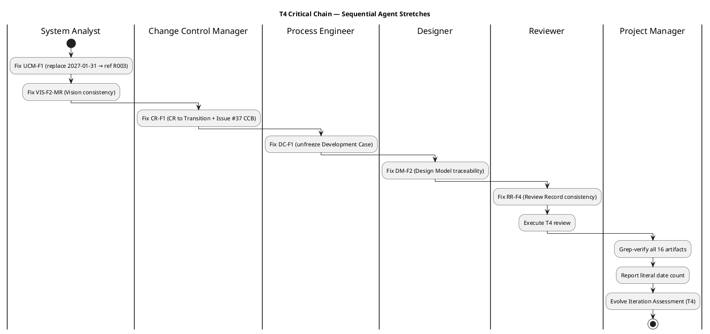

## Document Control

| Field | Value |
|---|---|
| Phase | Transition |
| Status | Active — Transition Iter 4 (T4) Plan — auto-iterate from T3 |
| Milestone Target | Product Release (PR) — **NOT YET ACHIEVED — stakeholder sanction REFUSED (3rd); T4 required** |
| Iteration | 4 (Cycle 1) |
| Date | 2026-08-30 |
| Author | Project Manager (Project Management Discipline) |
| Prior Phase | Transition T3 — PR sanction REFUSED (3rd); canonicalization correct but incomplete (UCM-F1); CR-F1 and DC-F1 persist; 4 Major + 2 Minor open |
| Evolution | T4 Plan evolved from T3. T3 resolved all PM-owned findings (RR-F1, MR-T2-002, RL-F6, TC-F3, SS-F1). T4 scope: 6 open findings directed to owners + PM grep-verify per STK-001 T3 directive. Budget sized from T3 measured actuals. |
| Measured Baseline | Inception: 2 iters, 4.38M tokens, 22 min, 11 runs, 10 artifacts. Elaboration: 2 iters, 20.87M tokens, 1.0h, 21 runs, 13 artifacts. Construction C3: 12.75M tokens, 1.3h, 15 runs, 15 artifacts. Construction C4: 10.95M tokens, 1.2h, 16 runs, 15 artifacts. Transition T2: 11.76M tokens, 19m 57s, 10 runs, 16 artifacts. Transition T3: 4.75M tokens, 1h 59m 45s, 10 runs, 16 artifacts. Cumulative: ~65.6M tokens, ~6.0h agent time, 83 runs, 16 artifacts. T4 budget sized from T3 measured baseline — reduced scope (6 targeted fixes + grep-verify). |
| CI Build | main: GREEN (run 33310220124, 2026-08-30 11:58:44Z) |

## Iteration Objectives

1. **UCM-F1 (Major) — System Analyst**: Replace literal date 2027-01-31 in Use-Case Model with reference to Risk List R003; correct owner from STK-003 to Software Architect. **Owner: System Analyst.**
2. **CR-F1 (Major) — Change Control Manager**: Update Change Request artifact from Construction C4 to Transition; take Issue #37 through CCB triage. **Owner: Change Control Manager.**
3. **RR-F4 (Major) — Reviewer**: Fix Review Record internal consistency (server error). **Owner: Reviewer.**
4. **VIS-F2-MR (Major) — System Analyst**: Fix Vision internal consistency (server error). **Owner: System Analyst.**
5. **DC-F1 (Minor) — Process Engineer**: Unfreeze Development Case from Elaboration; update to current phase. **Owner: Process Engineer.**
6. **DM-F2 (Minor) — Designer**: Update Design Model C4-1/C4-2 traceability. **Owner: Designer.**
7. **Grep-verify (PM)**: Grep all 16 artifacts for literal mock-auth date occurrences; prove only Risk List R003 holds a literal date; all others must be references. Report count. **Owner: Project Manager.**

## Plan and Milestones

### Cross-Iteration Roadmap (Coarse)

| Milestone | Phase | Iteration | Status |
|---|---|---|---|
| LCO | Inception | 2 | **ACHIEVED** — 0 open findings |
| LCA | Elaboration | 2 | **ACHIEVED** — 8 conditions met |
| IOC | Construction | 4 | **ACHIEVED** — feature-complete, CI GREEN |
| PR | Transition | 4 (T4) | **NOT YET ACHIEVED** — 3rd refusal; 4 Major + 2 Minor open |

### T4 Fine Plan (Gantt)

```plantuml
@startgantt
title Transition T4 — Targeted Fix Iteration
project starts the 1st day of the sprint
-- T4 Work Items --
[UCM-F1 fix] lasts 1 days
[CR-F1 fix] lasts 1 days
[RR-F4 fix] lasts 1 days
[VIS-F2-MR fix] lasts 1 days
[DC-F1 fix] lasts 1 days
[DM-F2 fix] lasts 1 days
[Grep-verify] lasts 1 days
[Review T4] lasts 1 days
[PR gate] lasts 1 days
[Review T4] happens at [Grep-verify]'s end
[PR gate] happens at [Review T4]'s end
@endgantt
```

### T4 Critical Chain



## Resources

| Agent Role | T4 Work Items | Token Budget | Basis |
|---|---|---|---|
| System Analyst | UCM-F1, VIS-F2-MR | [ASSUMPTION — ~500K tokens] | T3 System Analyst spend not separately recorded; 2 targeted fixes estimated from T3 per-fix cost |
| Change Control Manager | CR-F1 | [ASSUMPTION — ~200K tokens] | Single artifact update + Issue #37 triage |
| Process Engineer | DC-F1 | [ASSUMPTION — ~200K tokens] | Single artifact phase update |
| Designer | DM-F2 | [ASSUMPTION — ~200K tokens] | Traceability table update |
| Reviewer | RR-F4 + T4 review | [ASSUMPTION — ~500K tokens] | Review Record fix + full T4 review pass |
| Project Manager | Grep-verify + IA T4 | [ASSUMPTION — ~300K tokens] | Grep across 16 artifacts + assessment evolution |
| **Total** | 7 work items | **~1.9M tokens** | Sized from T3 measured baseline (4.75M for 10 runs); T4 is reduced scope (7 targeted fixes) |

**Human gates:** PR stakeholder sanction — [ASSUMPTION — 0 days queue time] based on T1/T2/T3 measured 0s queue time. The stakeholder has responded within the same session in all prior iterations.

## Use Cases and Scenarios Addressed

T4 is a correction/consolidation iteration. No new use cases are addressed. All 10 FRs (UC-001..UC-010) remain implemented and CI-green. T4 scope is exclusively finding resolution and grep-verification.

## Evaluation Criteria

| Criterion | Target | Measurement |
|---|---|---|
| EC-1: UCM-F1 resolved | UCM carries no literal date; references R003 | Grep-verify: 0 literal dates outside R003 |
| EC-2: CR-F1 resolved | Change Request artifact at Transition; Issue #37 triaged | Artifact phase = Transition; Issue #37 has CCB label |
| EC-3: DC-F1 resolved | Development Case unfrozen | Artifact phase = Transition or later |
| EC-4: RR-F4 resolved | Review Record internally consistent | No server errors; findings table consistent |
| EC-5: VIS-F2-MR resolved | Vision internally consistent | No server errors; mock-auth date references R003 |
| EC-6: DM-F2 resolved | Design Model traceability current | C4-1/C4-2 trace rows match current state |
| EC-7: Grep-verify complete | PM reports count of literal dates vs references | Grep output documented in Iteration Assessment T4 |
| EC-8: CI GREEN | main branch GREEN | scm_get_build_status |
| EC-9: PR sanction | STK-001 accepts | Stakeholder questionnaire |

## Traceability

| Element | Traces From | Link Type | Traces To |
|---|---|---|---|
| T4-1 (UCM-F1) | UCM-F1, STK-001 T3 directive | Derives | Use-Case Model (Transition T4) |
| T4-2 (CR-F1) | CR-F1, STK-001 T2 directive | Derives | Change Request (Transition T4) |
| T4-3 (RR-F4) | RR-F4, Review Record T3 | Derives | Review Record (Transition T4) |
| T4-4 (VIS-F2-MR) | VIS-F2-MR, Vision T3 | Derives | Vision (Transition T4) |
| T4-5 (DC-F1) | DC-F1, STK-001 T2 directive | Derives | Development Case (Transition T4) |
| T4-6 (DM-F2) | DM-F2, Design Model T3 | Derives | Design Model (Transition T4) |
| T4-7 (Grep-verify) | STK-001 T3 directive | Derives | Iteration Assessment (Transition T4) |
| T4-8 (Review) | T4-1..T4-7 | Derives | Review Record (T4) |
| T4-9 (PR gate) | AC-001..AC-005, STK-001 | Refines | PR milestone |
| BC-1 (NFR testing) | NFR-001, NFR-002 | Derives | CLOSED — measured 0.14s / 0.003s |
| BC-2 (OIDC) | CON-004, R003 | Derives | CLOSED — formally accepted risk |
| BC-3 (mock-auth expiry) | STK-001 binding condition #3 | Refines | MET — 2026-12-31, Risk List R003 |
| BC-4 (deployment) | CON-006, CON-007 | Derives | MET (deferred) — Release Notes explicit |
| CI build (33310220124) | scm_get_build_status | Tests | All source files on main — GREEN |
| Stakeholder PR gate | STK-001, AC-001..AC-005 | Refines | PR milestone re-review (T4) |