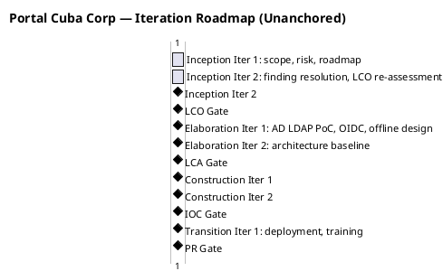
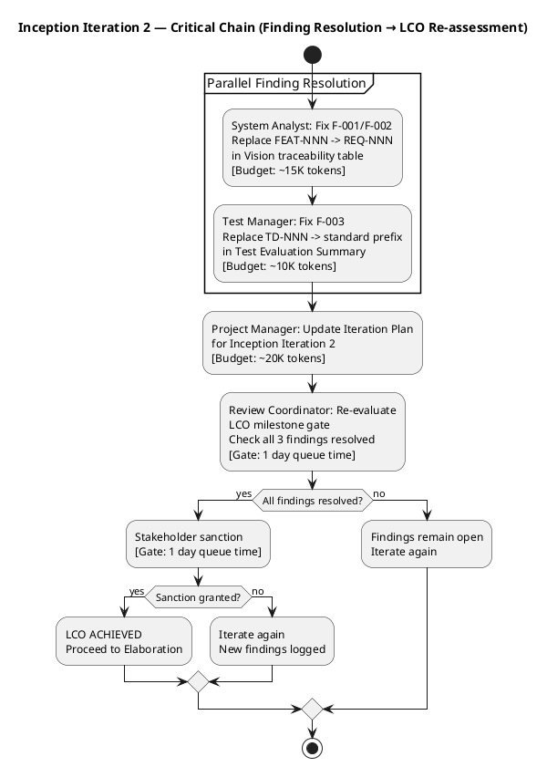

## Document Control

| Field | Value |
|---|---|
| Phase | Inception |
| Status | Draft |
| Milestone Target | End-of-Inception (LCO) |
| Iteration | 2 (Cycle 1) |
| Date | 2026-08-28 |
| Prior Iteration | 1 (Cycle 1) — all 4 objectives met; LCO blocked by 3 open findings (F-001, F-002, F-003) |
| Stakeholder Sanction | REFUSED (iteration 1) — directed: "Fix all findings even if they are minor findings" |
| Stakeholder Note (Cycle 2) | "Nothing else to add for this new iteration" — no additional scope beyond finding resolution |

## Iteration Objectives

1. **Resolve all open findings from iteration 1 review:** F-001/F-002 (Vision FEAT-NNN → REQ-NNN, owner: System Analyst) and F-003 (Test Evaluation Summary TD-NNN → standard prefix, owner: Test Manager). Stakeholder directive: "Fix all findings even if they are minor findings."
2. **Re-assess LCO milestone readiness:** Once all 3 findings are resolved, confirm that the LCO exit criteria are fully satisfied and present the corrected artifact set for stakeholder sanction.
3. **Maintain project planning artifacts:** Evolve the Iteration Plan to reflect iteration 2's scope and update the Iteration Assessment to record iteration 1's outcome as the factual basis for this iteration's plan.
4. **Preserve converged artifacts:** Risk List, Use-Case Model, Supplementary Specification, Software Architecture Document, and Development Case have no open findings — they are preserved unchanged.

## Plan and Milestones

### Coarse Cross-Iteration Roadmap

The project follows the RUP iterative lifecycle with **6 iterations** across 4 phases, consistent with the 6±3 rule for a moderate-complexity internal portal. The rubber profile starting point (Inception ~5%, Elaboration ~20%, Construction ~65%, Transition ~10%) is adjusted for this project's risk profile: R001 (AD LDAP, exposure=9) and R006 (offline operation, exposure=6) demand a robust Elaboration phase, so Elaboration receives 2 iterations rather than 1.

> **Roadmap update (iteration 2):** Inception now spans 2 iterations (iteration 1: scope/risk/roadmap; iteration 2: finding resolution + LCO re-assessment). The total iteration count remains 6 — the second Inception iteration is a corrective cycle, not a net-new iteration. The coarse roadmap for Elaboration, Construction, and Transition is unchanged.

| Phase | Iterations | Purpose | Milestone |
|---|---|---|---|
| Inception | 2 (Iter 1: scope/risk/roadmap; Iter 2: finding resolution + LCO re-assessment) | Scope, risk identification, project viability, initial roadmap | LCO (Life-Cycle Objectives) |
| Elaboration | 2 | Architecture baseline, AD LDAP PoC, offline mechanism design, OIDC integration, critical use-case analysis | LCA (Life-Cycle Architecture) |
| Construction | 2 | Implement all 10 functional requirements, audit trail, UI per CON-011, load testing | IOC (Initial Operational Capability) |
| Transition | 1 | User documentation, deployment to Windows Server, adoption tracking, stakeholder sign-off | PR (Product Release) |

**Total: 6 iterations** — within the 6±3 range, appropriate for a moderate-complexity intranet portal with 200 users.

**Milestone gates and human queue time:**

| Milestone | Gate Review | Human Queue Time | Decision |
|---|---|---|---|
| LCO | End of Inception Iter 2 | 2 days | Proceed to Elaboration? |
| LCA | End of Elaboration Iter 2 | 2 days | Architecture baseline stable? |
| IOC | End of Construction Iter 2 | 2 days | System operational for deployment? |
| PR | End of Transition Iter 1 | 2 days | Acceptance criteria met? Release? |

> **Note on units:** Iteration durations in the Gantt are relative ordering markers, not calendar projections. Agent work is measured in tokens and elapsed time; human gates are measured in days of queue time. No absolute dates are projected — the Gantt is unanchored by design.

### Fine Plan — Inception Iteration 2

This iteration is a **corrective cycle** triggered by the LCO review's 3 open findings and the stakeholder's refusal to sanction until all findings are resolved. Its scope is bounded by a **budget box of ~45K tokens** (assumption — iteration 1 measured actuals not yet available in this session; basis: 3 parallel finding-resolution stretches + PM plan evolution + review coordinator re-evaluation).

| Work Item | Owner (Agent Role) | Token Budget | Depends On | Output |
|---|---|---|---|---|
| Fix F-001/F-002: Vision FEAT-NNN → REQ-NNN | System Analyst | ~15K | Review Record findings | Corrected Vision traceability table |
| Fix F-003: Test Eval Summary TD-NNN → standard prefix | Test Manager | ~10K | Review Record findings | Corrected Test Evaluation Summary traceability table |
| Evolve Iteration Plan for iteration 2 | Project Manager | ~20K | Review Record, prior Iteration Plan | Updated Iteration Plan (this artifact) |
| LCO re-evaluation | Review Coordinator | ~5K | All corrected artifacts | LCO milestone verdict (re-assessed) |

**Budget box total: ~50K tokens** (assumption — no measured actuals from iteration 1 available in this session). Human gates: LCO re-evaluation = 1 day queue time; stakeholder sanction = 1 day queue time.

### LCO Readiness Assessment (Updated for Iteration 2)

The project is viable to proceed to Elaboration if:
- All 6 risks are classified with strategies and mitigation plans ✓ (Risk List produced, preserved)
- Scope is clearly bounded by 10 FRs, 4 NFRs, 5 ACs, 13 constraints ✓ (Declared Scope)
- Coarse roadmap with 6 iterations across 4 phases is defined ✓ (this plan, updated)
- No open SCOPE_QUESTION blocks the LCO gate ✓ (none raised)
- **All review findings resolved** ⏳ (3 open findings — F-001, F-002, F-003 — being resolved this iteration by System Analyst and Test Manager)
- **Stakeholder sanction granted** ⏳ (refused in iteration 1; pending finding resolution)

**Open items for LCO re-evaluation:**
- F-001/F-002 (Vision FEAT-NNN prefix) — System Analyst resolves this iteration
- F-003 (Test Evaluation Summary TD-NNN prefix) — Test Manager resolves this iteration
- Once both are resolved, the Review Coordinator re-evaluates the LCO gate and the stakeholder is re-approached for sanction

## Resources

### Agent Role Assignment Profile

| Phase | Iteration | Active Agent Roles | Budget Split |
|---|---|---|---|
| Inception | Iter 1 | Project Manager, System Analyst, Software Architect, Test Manager, Review Coordinator | PM: ~20K, SA: ~15K, Arch: ~10K, TM: ~5K, RC: ~5K [ASSUMPTION — first iteration, no measured actuals] |
| Inception | Iter 2 | System Analyst, Test Manager, Project Manager, Review Coordinator | SA: ~15K (F-001/F-002 fix), TM: ~10K (F-003 fix), PM: ~20K (plan evolution), RC: ~5K (re-evaluation) [ASSUMPTION — based on finding complexity] |
| Elaboration | Iter 1 | Software Architect, System Analyst, Designer, Project Manager, Review Coordinator | [ASSUMPTION — to be sized from Inception measured actuals] |
| Elaboration | Iter 2 | Software Architect, Designer, Test Designer, Project Manager, Review Coordinator | [ASSUMPTION — to be sized from Elaboration Iter 1 measured actuals] |
| Construction | Iter 1 | Designer, Implementer, Test Designer, Project Manager, Review Coordinator | [ASSUMPTION — to be sized from Elaboration measured actuals] |
| Construction | Iter 2 | Implementer, Test Designer, Deployment Manager, Project Manager, Review Coordinator | [ASSUMPTION — to be sized from Construction Iter 1 measured actuals] |
| Transition | Iter 1 | Deployment Manager, Test Designer, Technical Writer, Project Manager, Review Coordinator | [ASSUMPTION — to be sized from Construction measured actuals] |

> **Budget basis:** Inception iterations' budgets are explicit assumptions (no prior measured actuals exist). Every subsequent phase's budget will be sized from the MEASURED actuals of the phase that preceded it — not from this assumption. The rubber profile percentages (5/20/65/10) inform iteration COUNT only, not budget allocation.

### Parallelism Assessment

Inception Iteration 2 has **two parallel finding-resolution stretches** (System Analyst fixing Vision, Test Manager fixing Test Evaluation Summary) that are independent of each other. The Project Manager's plan evolution runs concurrently with these. The Review Coordinator's re-evaluation is sequential — it depends on all three corrections being complete. This is a short critical chain appropriate for a corrective cycle.

## Use Cases and Scenarios Addressed

This iteration does not implement use cases — it is a corrective cycle resolving review findings. The use case allocation from iteration 1 is preserved unchanged:

| Use Case | FR ID | Target Phase | Rationale |
|---|---|---|---|
| Clock In and Clock Out | FR-001 | Construction Iter 1 | Core functionality, highest user impact, NFR-002 performance requirement |
| View Own Clocking History | FR-002 | Construction Iter 1 | Depends on FR-001 data model |
| View All Employee Clockings | FR-003 | Construction Iter 1 | HR view, extends FR-001/FR-002 |
| Export Monthly Clocking Report | FR-004 | Construction Iter 2 | CSV export, lower risk |
| Publish News | FR-005 | Construction Iter 1 | Core HR function, audit trail (NFR-004) |
| Edit Published News | FR-006 | Construction Iter 1 | Extends FR-005, audit trail |
| Unpublish News | FR-007 | Construction Iter 1 | Extends FR-005, CON-013 no hard delete |
| Read and Filter News | FR-008 | Construction Iter 1 | Employee-facing, depends on FR-005 |
| Search Employee Directory | FR-009 | Elaboration Iter 1 | R001 risk — AD LDAP integration must be validated early |
| Manage Worker Category | FR-010 | Construction Iter 2 | Simple two-column table, lower risk |

**Risk-driven sequencing rationale:** FR-009 (Employee Directory) is allocated to Elaboration Iteration 1 because it directly confronts R001 (AD LDAP attribute inconsistency, exposure=9) — the highest-magnitude risk. The Elaboration phase must validate LDAP connectivity and attribute availability before Construction builds the full directory feature. FR-001 (Clock In/Out) is allocated to Construction Iteration 1 as the core feature with the most user impact and the NFR-002 performance requirement.

## Evaluation Criteria

### Layer 1: Declared Acceptance Criteria Status

| AC ID | Description | Addressed This Iteration | Evidence | Deferred To |
|---|---|---|---|---|
| AC-001 | Employee can clock in/out without HR help | No | Not implemented in Inception | Construction Iter 1 |
| AC-002 | HR can publish news without technical assistance | No | Not implemented in Inception | Construction Iter 1 |
| AC-003 | Employee finds colleague's phone/email in under 10 seconds | No | Not implemented in Inception | Elaboration Iter 1 (LDAP validation) → Construction Iter 1 (implementation) |
| AC-004 | 80% of employees complete at least one clocking with no prior training | No | Not implemented in Inception | Construction Iter 2 + Transition Iter 1 |
| AC-005 | System works temporarily offline, syncs on recovery | No | Not implemented in Inception — R006 identifies this as architecturally significant | Elaboration Iter 1 (architectural investigation) → Construction Iter 2 (implementation) |

> No acceptance criteria are addressed in Inception — this is expected. Inception establishes viability and planning, not implementation. All ACs are allocated to future iterations with explicit target phases.

### Layer 2: Inception Iteration 2 Exit Criteria

| Criterion | Met? | Evidence |
|---|---|---|
| F-001/F-002 resolved: Vision FEAT-NNN replaced with REQ-NNN | Pending | System Analyst to correct Vision traceability table this iteration |
| F-003 resolved: Test Evaluation Summary TD-NNN replaced with standard prefix | Pending | Test Manager to correct Test Evaluation Summary traceability table this iteration |
| Iteration Plan evolved for iteration 2 | Yes | This artifact — Document Control, Objectives, Fine Plan, Resources, Evaluation Criteria updated |
| Risk List preserved (no findings target it) | Yes | PRESERVED — no changes needed |
| LCO re-assessment ready for Review Coordinator | Yes | LCO Readiness Assessment subsection updated with finding resolution status |
| No open SCOPE_QUESTION blocking the gate | Yes | No SCOPE_QUESTION raised — all scope is declared |

## Traceability

| Element | Traces From | Link Type | Traces To |
|---|---|---|---|
| Iteration Plan (Iter 2) | Iteration Plan (Iter 1), Review Record (F-001, F-002, F-003) | Refines | Iteration Assessment (post-iteration), LCO Milestone Review (Review Coordinator) |
| Iteration 2 Objectives | Review Record §Findings, Stakeholder Directive | Derives | System Analyst (F-001/F-002 fix), Test Manager (F-003 fix) |
| Coarse Roadmap (updated) | Development Case (rubber profile, 6±3 rule) | Derives | All subsequent Iteration Plans |
| Use Case Allocation (FR-001 to FR-010) | Work Order FR-001 to FR-010 | Refines | Elaboration and Construction Iteration Plans |
| AC-001 to AC-005 | Work Order AC-001 to AC-005 | Refines | Construction and Transition Iteration Plans |
| LCO Readiness Assessment (updated) | All Inception artifacts, Review Record findings | Derives | LCO Milestone Re-evaluation (Review Coordinator) |
| Risk List (R001–R006) | Work Order R001, R002, CON-004, NFR-002, NFR-003, CON-011, CON-002, AC-005 | Refines | Elaboration Iteration Plan, Construction Iteration Plans |