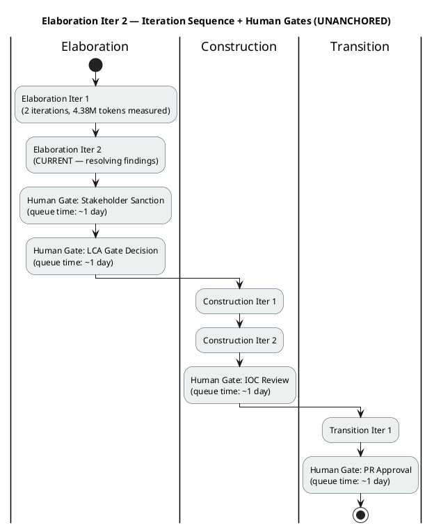
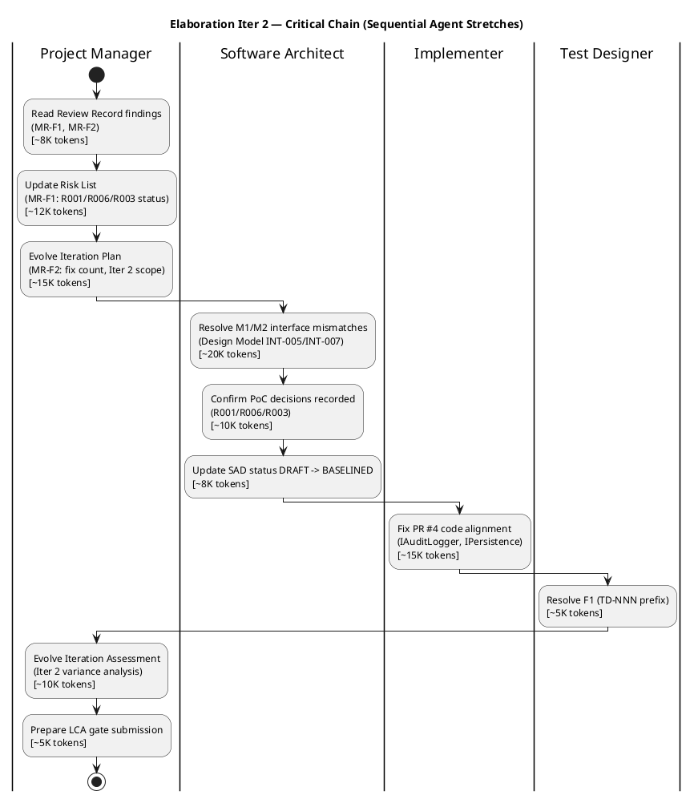

## Document Control

| Field | Value |
|---|---|
| Phase | Elaboration |
| Status | Draft |
| Milestone Target | End-of-Elaboration (LCA) |
| Iteration | 2 (Cycle 1) |
| Date | 2026-08-28 |
| Prior Phase | Inception (LCO achieved, 0 open findings, stakeholder sanction GRANTED) |
| Evolution | Elaboration Iter 1 Plan evolved for Iter 2: MR-F2 resolved (iteration count corrected 6→7); Iter 2 objectives defined to resolve all open findings and close LCA conditions; fine Gantt replaced with Iter 2 scope; coarse roadmap updated with Iter 1 measured status |
| Review Finding Resolved | MR-F2 (Minor) — Iteration count mismatch: narrative said "6 iterations" but roadmap table showed 7 (2+2+2+1). RESOLVED: narrative corrected to "7 iterations" |
| Measured Baseline | Inception: 2 iterations, 4,382,313 tokens, 22 min agent time, 11 runs, 10 artifacts. Elaboration Iter 1: [ASSUMPTION — requires validation; measured at iteration close] |

## Iteration Objectives

1. **Resolve all open Review Record findings (LCA conditions):** Close M1 (IAuditLogger signature mismatch), M2 (IPersistence transaction API mismatch), MR-F1 (risk evidence gap — RESOLVED in Risk List), MR-F2 (iteration count mismatch — RESOLVED in this plan), F1 (TD-NNN prefix convention). All 5 findings targeted for closure this iteration.
2. **Confirm PoC decisions for R001 and R006:** PoC decisions recorded in Architectural Proof-of-Concept artifact. Risk List updated: R001→MITIGATED, R006→MITIGATED. SAD status changed from DRAFT to BASELINED.
3. **Confirm R003 OIDC registration status:** PoC mode analysis-only. Mock auth contingency active. Monitor STK-003 registration timeline — escalate if not confirmed by Construction Iter 1.
4. **Baseline the architecture (LCA target):** SAD status changed from DRAFT to BASELINED. All 4+1 views addressed, 8 components, 5 ADRs. Design Model interface mismatches (M1/M2) resolved by Implementer aligning code to Design Model INT-005/INT-007.
5. **Design remaining UCs for Iter 2 scope:** UC-010 (Manage Worker Category), UC-004 (Export CSV), UC-002 (Clocking History), UC-003 (View All Clockings). These bridge local DB + LDAP and exercise read-only views.
6. **Produce Iteration Assessment for Iter 2:** Record variance analysis, objective achievement, and LCA gate readiness.

## Plan and Milestones

### Coarse Cross-Iteration Roadmap

The project follows the RUP iterative lifecycle with **7 iterations** across 4 phases, consistent with the 6±3 rule for a moderate-complexity internal portal. The rubber profile starting point (Inception ~5%, Elaboration ~20%, Construction ~65%, Transition ~10%) is adjusted for this project's risk profile: R001 (AD LDAP, exposure=9) and R006 (offline operation, exposure=6) demand a robust Elaboration phase, so Elaboration receives 2 iterations rather than 1.

> **Roadmap update (Elaboration Iter 2):** Inception is CLOSED with measured actuals: 2 iterations, 4,382,313 tokens, 22 min agent time, 11 agent runs, 10 artifacts. Elaboration Iter 1 is complete with findings — 5 open findings (3 Major, 2 Minor) targeted for Iter 2 resolution. Elaboration is allocated 2 iterations; Construction 2; Transition 1. The coarse roadmap for Construction and Transition is provisional — it will be baselined at LCA using measured Elaboration actuals.

| Phase | Iterations | Measured Tokens | Measured Agent Time | Agent Runs | Artifacts | Milestone |
|---|---|---|---|---|---|---|
| Inception (CLOSED) | 2 | 4,382,313 | 22 min | 11 | 10 | LCO ✅ ACHIEVED |
| Elaboration (CURRENT) | 2 | [ASSUMPTION — ~5M tokens; basis: Inception measured 4.38M for 2 iters of lower-intensity scope; Elaboration is higher-intensity (PoC + architecture baseline + design model), so ~2.5M per iteration × 2] | [ASSUMPTION — ~30 min; basis: Inception 22 min for 2 iters; Elaboration has more agent roles active in parallel] | [ASSUMPTION — ~15 runs; basis: Inception 11 runs, Elaboration activates more roles] | [ASSUMPTION — ~8 artifacts; basis: SAD evolution, Design Model, Risk List, Iteration Plan, Iteration Assessment + upstream artifacts] | LCA (target) |
| Construction (PLANNED) | 2 | [ASSUMPTION — requires validation at LCA] | [ASSUMPTION — requires validation at LCA] | [ASSUMPTION] | [ASSUMPTION] | IOC (target) |
| Transition (PLANNED) | 1 | [ASSUMPTION — requires validation at IOC] | [ASSUMPTION — requires validation at IOC] | [ASSUMPTION] | [ASSUMPTION] | PR (target) |
| **Total** | **7** | | | | | |

### Iteration Sequence + Human Gates

### Fine Gantt — Elaboration Iteration 2

### Elaboration Iter 2 — Work Items

| # | Work Item | Owner | Token Budget | Depends On | LCA Condition |
|---|---|---|---|---|---|
| 1 | Resolve MR-F1: Update Risk List with PoC decisions for R001/R006/R003 | Project Manager | ~12K | PoC artifact | Condition 1, 2, 3 |
| 2 | Resolve MR-F2: Fix iteration count mismatch in Iteration Plan | Project Manager | ~5K | — | — |
| 3 | Resolve M1: Align IAuditLogger (INT-005) implementation with Design Model | Implementer | ~10K | Design Model | Condition 3 |
| 4 | Resolve M2: Align IPersistence (INT-007) transaction API with Design Model | Implementer | ~10K | Design Model | Condition 3 |
| 5 | Confirm PoC decisions recorded for R001 (LDAP attribute consistency) | Software Architect | ~8K | PoC artifact | Condition 1 |
| 6 | Confirm PoC decisions recorded for R006 (offline retry mechanism) | Software Architect | ~8K | PoC artifact | Condition 2 |
| 7 | Confirm R003 OIDC registration status (analysis-only, mock auth active) | Software Architect | ~5K | STK-003 | Condition 4 |
| 8 | Update SAD status from DRAFT to BASELINED | Software Architect | ~5K | Items 3-6 | Condition 4 |
| 9 | Resolve F1: Fix TD-NNN prefix in Test Case (replace with TC-NNN or declare in Dev Case) | Test Designer | ~5K | — | — |
| 10 | Design UC-010 (Manage Worker Category), UC-004 (Export CSV), UC-002 (Clocking History), UC-003 (View All Clockings) | Designer | ~30K | SAD, Design Model | — |
| 11 | Evolve Iteration Assessment for Iter 2 | Project Manager | ~10K | All above | — |
| 12 | Prepare LCA gate submission package | Project Manager | ~5K | All above | — |

### Construction Roadmap (Provisional — baselined at LCA)

| Iteration | Use Cases | Purpose |
|---|---|---|
| Construction Iter 1 | UC-001–UC-005 (clocking cluster + news publish) | Core implementation: clocking, news publishing, audit trail, directory search |
| Construction Iter 2 | UC-006–UC-010 (news edit/unpublish, news read/filter, worker category) + load testing | Remaining UCs, integration, NFR-001/NFR-002 performance validation |

> This Construction roadmap is PROVISIONAL. It will be baselined at LCA using measured Elaboration actuals. Detailed work items for Construction iterations are NOT planned here — planning beyond the current horizon is waste.

## Resources

### Agent Role Profile — Elaboration Iteration 2

| Agent Role | Discipline | Active This Iteration | Token Budget | Parallelism |
|---|---|---|---|---|
| Project Manager | Project Management | Yes | ~200K (plan + risk + assessment) | Track 1 (PM track) |
| Software Architect | Analysis & Design | Yes | ~300K (SAD baseline + PoC confirm + M1/M2 resolution) | Track 2 (architecture track) |
| Implementer | Implementation | Yes | ~150K (PR #4 code alignment) | Track 3 (implementation track) — depends on Track 2 |
| Test Designer | Test | Yes | ~50K (F1 fix + test case evolution) | Track 4 (test track) — depends on Track 3 |
| Designer | Analysis & Design | Yes | ~200K (UC-010/UC-004/UC-002/UC-003 design) | Track 5 (design track) — depends on Track 2 |

**Budget split across agent roles:**

| Track | Agent Role(s) | Token Budget | % of Box |
|---|---|---|---|
| PM Track | Project Manager | 200K | 22.2% |
| Architecture Track | Software Architect | 300K | 33.3% |
| Implementation Track | Implementer | 150K | 16.7% |
| Test Track | Test Designer | 50K | 5.6% |
| Design Track | Designer | 200K | 22.2% |
| **Total** | **5 roles** | **900K** | **100%** |

> **Basis for budget:** Elaboration Iter 2 is a resolution iteration — fewer agent roles active (5 vs 8 in Iter 1) because the primary work is resolving findings and closing LCA conditions, not new artifact creation. The architecture track receives the largest share (33%) because M1/M2 interface resolution and SAD baselining are the critical-path items. This is an ASSUMPTION — it will be replaced by measured actuals at iteration close.

## Use Cases and Scenarios Addressed

| UC ID | Use Case | FR | Iteration | Status | Risk Addressed |
|---|---|---|---|---|---|
| UC-009 | Search Employee Directory | FR-009 | Elaboration Iter 1 | Design + PoC (COMPLETE) | R001 (LDAP attribute consistency) |
| UC-001 | Clock In / Clock Out | FR-001 | Elaboration Iter 1 | Design + PoC (COMPLETE) | R006 (offline retry mechanism) |
| UC-005 | Publish News | FR-005 | Elaboration Iter 1 | Design (COMPLETE — audit trail pattern) | NFR-004 (audit trail) |
| UC-010 | Manage Worker Category | FR-010 | Elaboration Iter 2 | Design (NEW) | R001 (LDAP + local DB bridge) |
| UC-004 | Export Monthly Clocking Report | FR-004 | Elaboration Iter 2 | Design (NEW) | NFR-001 (performance) |
| UC-002 | View Own Clocking History | FR-002 | Elaboration Iter 2 | Design (NEW) | — |
| UC-003 | View All Employee Clockings | FR-003 | Elaboration Iter 2 | Design (NEW) | — |
| UC-006 | Edit Published News | FR-006 | Construction | Deferred | — |
| UC-007 | Unpublish News | FR-007 | Construction | Deferred | — |
| UC-008 | Read and Filter News | FR-008 | Construction | Deferred | — |

## Evaluation Criteria

### Layer (a): Declared Acceptance Criteria Addressed This Iteration

| AC ID | Description | Addressed This Iteration? | Evidence / Reason |
|---|---|---|---|
| AC-001 | Employee can clock in/out without help | Partially — design + PoC for UC-001 validates the mechanism; full implementation in Construction | SAD Process View, Design Model UC-001, PoC code |
| AC-002 | HR can publish a news item without technical assistance | Partially — design for UC-005 establishes the audit trail pattern; full implementation in Construction | Design Model UC-005, SAD COMP-003/COMP-008 |
| AC-003 | Employee finds colleague's phone/email in under 10 seconds | Partially — PoC for UC-009 validates LDAP query performance; full implementation in Construction | PoC LDAP query results, SAD COMP-005 |
| AC-004 | 80% of employees complete at least one clocking with no prior training | Not addressed — Transition phase (adoption tracking) | Deferred to Transition |
| AC-005 | System works temporarily offline (5-min network drop, data syncs on recovery) | **Yes — PoC decisions recorded.** PoC for R006 validates localStorage clocking POST retry with idempotency key | PoC decisions, SAD Process View, Risk List R006 MITIGATED |

### Layer (b): Elaboration Iteration 2 Exit Criteria

| # | Exit Criterion | Verification Method | LCA Condition |
|---|---|---|---|
| 1 | R001 PoC decisions confirmed in Architectural PoC artifact | PoC artifact review — decisions recorded | Condition 1 |
| 2 | R006 PoC decisions confirmed in Architectural PoC artifact | PoC artifact review — decisions recorded | Condition 2 |
| 3 | M1 resolved — IAuditLogger (INT-005) implementation aligned with Design Model | Code review of PR #4 fix | Condition 3 |
| 4 | M2 resolved — IPersistence (INT-007) transaction API aligned with Design Model | Code review of PR #4 fix | Condition 3 |
| 5 | SAD status changed from DRAFT to BASELINED | SAD Document Control review | Condition 4 |
| 6 | R003 OIDC registration status confirmed (analysis-only, mock auth active) | Risk List R003 status = MONITORING | Condition 5 |
| 7 | MR-F1 resolved — Risk List updated with PoC decisions | Risk List review — R001/R006 = MITIGATED, R003 = MONITORING | Condition 6 |
| 8 | MR-F2 resolved — Iteration Plan iteration count corrected (7, not 6) | This plan — narrative says "7 iterations" | — |
| 9 | F1 resolved — TD-NNN prefix fixed in Test Case | Test Case artifact review | — |
| 10 | Iteration Assessment produced for Iter 2 with variance analysis | Iteration Assessment artifact | Condition 7 |

## Traceability

| Element | Traces From | Link Type | Traces To |
|---|---|---|---|
| Elaboration Iter 2 Plan | Elaboration Iter 1 Plan, Iter 1 Assessment, Review Record | Refines | Elaboration Iter 2 Assessment, LCA Milestone Review |
| Coarse Roadmap (updated) | Inception measured actuals, Development Case (rubber profile, 6±3 rule) | Derives | All subsequent Iteration Plans |
| MR-F2 (resolved) | Review Record Finding Tracker | Derives | Iteration Plan (iteration count corrected 6→7) |
| MR-F1 (resolved) | Review Record Finding Tracker | Derives | Risk List (R001/R006/R003 status updates) |
| M1 (targeted) | Review Record Finding Tracker | Derives | Design Model INT-005, PR #4 fix |
| M2 (targeted) | Review Record Finding Tracker | Derives | Design Model INT-007, PR #4 fix |
| F1 (targeted) | Review Record Finding Tracker | Derives | Test Case (TD-NNN prefix fix) |
| UC-010 (Manage Worker Category) | FR-010, R001 | Refines | Design Model, SAD COMP-005 |
| UC-004 (Export CSV) | FR-004, NFR-001 | Refines | Design Model |
| UC-002 (Clocking History) | FR-002 | Refines | Design Model |
| UC-003 (View All Clockings) | FR-003 | Refines | Design Model |
| Budget Box (~900K tokens) | Elaboration Iter 1 plan (reduced scope — resolution iteration) | Derives | Elaboration Iter 2 Assessment (measured vs planned) |
| R001 Mitigation (LDAP PoC) | Work Order R001, SAD COMP-005, ADR-003 | Refines | PoC decisions recorded, Risk List R001 MITIGATED |
| R006 Mitigation (Offline PoC) | AC-005, SAD Process View | Refines | PoC decisions recorded, Risk List R006 MITIGATED |
| R003 Mitigation (OIDC) | CON-004, SAD COMP-007, ADR-005 | Derives | Risk List R003 MONITORING, mock auth contingency |
| AC-005 (offline) | Work Order AC-005 | Refines | PoC decisions (offline retry), SAD Process View |
| AC-001 (clocking) | Work Order AC-001 | Refines | Design Model UC-001, Construction implementation |
| AC-002 (news publish) | Work Order AC-002 | Refines | Design Model UC-005, Construction implementation |
| AC-003 (directory search) | Work Order AC-003 | Refines | PoC UC-009, Construction implementation |