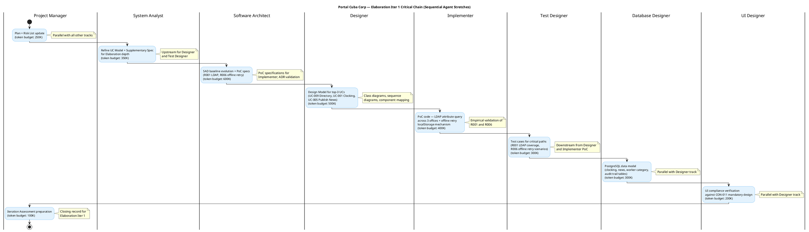

## Document Control

| Field | Value |
|---|---|
| Phase | Elaboration |
| Status | Draft |
| Milestone Target | End-of-Elaboration (LCA) |
| Iteration | 1 (Cycle 1) |
| Date | 2026-08-28 |
| Prior Phase | Inception (LCO achieved, 0 open findings, stakeholder sanction GRANTED) |
| Evolution | Inception Iteration Plan evolved: coarse roadmap updated with measured actuals; fine plan replaced with Elaboration Iter 1 scope |
| Measured Baseline | Inception: 2 iterations, 4,382,313 tokens, 22 min agent time, 11 runs, 10 artifacts |

## Iteration Objectives

1. **Retire R001 (AD LDAP attribute consistency, exposure=9):** Execute LDAP PoC querying AD across all 3 offices to verify job title, department, office, email, and extension fields are populated. Identify gaps, coordinate with STK-003. SAD COMP-005 (LDAP Directory Service) and ADR-003 (Novell.Directory.Ldap) are baselined — PoC validates them empirically.
2. **Retire R006 (offline retry mechanism, exposure=6):** Execute PoC for localStorage clocking POST retry with idempotency key, validating the SAD Process View mechanism for AC-005 (5-minute network drop). Confirm the mechanism works or trigger contingency scope reduction.
3. **Baseline the architecture (LCA target):** Evolve SAD from Inception candidate to Elaboration baseline — all 4+1 views addressed, 8 components, 5 ADRs, 3 sequence diagrams. Design Model produced for top-3 architecturally significant UCs (UC-009, UC-001, UC-005).
4. **Validate R003 (Keycloak OIDC registration):** Confirm with STK-003 that OIDC client registration is in progress or scheduled. If not registered by end of iteration, activate mock auth contingency for Iter 2.
5. **Validate R005 (UI design compliance):** UI Designer verifies CON-011 mandatory design against Razor Pages capabilities. Identify elements requiring client-side JS augmentation.

## Plan and Milestones

### Coarse Cross-Iteration Roadmap

The project follows the RUP iterative lifecycle with **6 iterations** across 4 phases, consistent with the 6±3 rule for a moderate-complexity internal portal. The rubber profile starting point (Inception ~5%, Elaboration ~20%, Construction ~65%, Transition ~10%) is adjusted for this project's risk profile: R001 (AD LDAP, exposure=9) and R006 (offline operation, exposure=6) demand a robust Elaboration phase, so Elaboration receives 2 iterations rather than 1.

> **Roadmap update (Elaboration Iter 1):** Inception is CLOSED with measured actuals: 2 iterations, 4,382,313 tokens, 22 min agent time, 11 agent runs, 10 artifacts. These measured figures replace all assumed shares in the forecast. Elaboration is allocated 2 iterations; Construction 2; Transition 1. The coarse roadmap for Construction and Transition is provisional — it will be baselined at LCA using measured Elaboration actuals.

| Phase | Iterations | Measured Tokens | Measured Agent Time | Agent Runs | Artifacts | Milestone |
|---|---|---|---|---|---|---|
| Inception (CLOSED) | 2 | 4,382,313 | 22 min | 11 | 10 | LCO ✅ ACHIEVED |
| Elaboration (CURRENT) | 2 | [ASSUMPTION — ~5M tokens; basis: Inception measured 4.38M for 2 iters of lower-intensity scope; Elaboration is higher-intensity (PoC + architecture baseline + design model), so ~2.5M per iteration × 2] | [ASSUMPTION — ~30 min; basis: Inception 22 min for 2 iters; Elaboration has more agent roles active in parallel] | [ASSUMPTION — ~15 runs; basis: Inception 11 runs, Elaboration activates more roles] | [ASSUMPTION — ~8 artifacts; basis: SAD evolution, Design Model, Risk List, Iteration Plan, Iteration Assessment + upstream artifacts] | LCA (target) |
| Construction (PLANNED) | 2 | [ASSUMPTION — requires validation at LCA] | [ASSUMPTION — requires validation at LCA] | [ASSUMPTION] | [ASSUMPTION] | IOC (target) |
| Transition (PLANNED) | 1 | [ASSUMPTION — requires validation at IOC] | [ASSUMPTION — requires validation at IOC] | [ASSUMPTION] | [ASSUMPTION] | PR (target) |

**Total: 6 iterations** — within the 6±3 range, appropriate for a moderate-complexity intranet portal with 200 users.

**Milestone gates and human queue time:**

| Milestone | Gate Review | Human Queue Time | Decision |
|---|---|---|---|
| LCO | End of Inception Iter 2 | 0 days (GRANTED) | ✅ Proceed to Elaboration |
| LCA | End of Elaboration Iter 2 | [ASSUMPTION — 2 days queue] stakeholder review of architecture baseline | Architecture baseline stable? Proceed to Construction? |
| IOC | End of Construction Iter 2 | [ASSUMPTION — 2 days queue] stakeholder go/no-go for production | System operational for deployment? |
| PR | End of Transition Iter 1 | [ASSUMPTION — 1 day queue] stakeholder sign-off for closeout | Acceptance criteria met? Release? |

> **Note on units:** Two currencies, never added. Agent work is denominated in tokens and measured elapsed time. Human gates are denominated in days of queue time (waiting, not working). The Gantt below is UNANCHORED — no absolute dates projected, because a date computed from an estimate reads downstream as an observation.

```plantuml
@startgantt
project starts the 1st of january 2026
saturday are closed
sunday are closed

[Inception Iter 1] lasts 7 days
[Inception Iter 2] lasts 7 days
[LCO Gate] lasts 1 day
[Inception Iter 2] happens at [LCO Gate]'s end

[Elaboration Iter 1] lasts 14 days
[Elaboration Iter 1] happens at [LCO Gate]'s end
[Elaboration Iter 2] lasts 14 days
[Elaboration Iter 2] happens at [Elaboration Iter 1]'s end
[LCA Gate] lasts 2 days
[LCA Gate] happens at [Elaboration Iter 2]'s end

[Construction Iter 1] lasts 30 days
[Construction Iter 1] happens at [LCA Gate]'s end
[Construction Iter 2] lasts 30 days
[Construction Iter 2] happens at [Construction Iter 1]'s end
[IOC Gate] lasts 2 days
[IOC Gate] happens at [Construction Iter 2]'s end

[Transition Iter 1] lasts 14 days
[Transition Iter 1] happens at [IOC Gate]'s end
[PR Gate] lasts 1 day
[PR Gate] happens at [Transition Iter 1]'s end

@endgantt
```

> **Gantt note:** Durations are relative ordering markers, not calendar projections. The Gantt is unanchored — no project start date, no absolute dates. Agent work is measured in tokens and elapsed time; human gates are quoted separately in days of queue time. The two clocks are never summed.

### Fine Plan — Elaboration Iteration 1

This iteration is the **first Elaboration iteration** — its primary purpose is to confront and retire the two highest-magnitude technical risks (R001 exposure=9, R006 exposure=6) through empirical PoCs, and to baseline the architecture for the LCA milestone. The scope is bounded by a **budget box of ~2,500,000 tokens** (assumption — basis: Inception measured 4,382,313 tokens across 2 iterations averaging ~2.19M each; Elaboration Iter 1 is higher-intensity with more agent roles active in parallel and PoC code execution, so +14% uplift per iteration).

| Work Item | Owner (Agent Role) | Token Budget | Depends On | Output | Risk Addressed |
|---|---|---|---|---|---|
| Evolve Iteration Plan + Risk List for Elaboration | Project Manager | ~250K | Inception actuals, SAD, Risk List | Elaboration Iteration Plan, updated Risk List | All |
| Refine UC Model + Supplementary Spec for Elaboration depth | System Analyst | ~350K | Inception UC Model, SAD Use-Case View | Elaborated UC Model, Supplementary Spec | — |
| SAD baseline evolution + PoC specifications (R001 LDAP, R006 offline retry) | Software Architect | ~600K | Inception SAD, Risk List R001/R006 | Baselined SAD (4+1 views), PoC specs | R001, R006 |
| Design Model for top-3 UCs (UC-009, UC-001, UC-005) | Designer | ~500K | SAD, UC Model, Supplementary Spec | Design Model (class diagrams, sequence diagrams) | R001, R006 |
| PoC code — LDAP attribute query + offline retry mechanism | Implementer | ~400K | SAD PoC specs, ADR-003, ADR-005 | PoC code artifacts, empirical test results | R001, R006 |
| Test cases for critical paths (LDAP coverage, offline retry) | Test Designer | ~300K | Design Model, PoC results, UC Model | Test cases for R001/R006 scenarios | R001, R006 |
| PostgreSQL data model (clocking, news, worker category, audit) | Database Designer | ~300K | SAD COMP-006, ADR-002, NFR-004 | Database schema, DDL scripts | — |
| UI compliance verification against CON-011 | UI Designer | ~200K | CON-011 mandatory design, SAD | UI compliance report, deviation list | R005 |
| Iteration Assessment preparation | Project Manager | ~100K | All work items, PoC results | Elaboration Iter 1 Assessment | — |

**Budget box total: ~3,000,000 tokens** [ASSUMPTION — requires validation; basis: Inception measured 4,382,313 tokens across 2 iterations; Elaboration Iter 1 activates 8 agent roles in parallel with PoC execution, so higher token spend per iteration is expected. This figure will be replaced by measured actuals at iteration close.]

> **Two clocks, never added:** Agent work above is denominated in tokens. Human gates for this iteration: LCA gate review at end of Elaboration Iter 2 = [ASSUMPTION — 2 days queue]. No human gate is inside this iteration — the LCA gate is at the end of Elaboration Iter 2.

### Use Case Allocation Across Elaboration Iterations

| Iteration | Use Cases Addressed | Risk Driver | Rationale |
|---|---|---|---|
| Elaboration Iter 1 (CURRENT) | UC-009 (Directory Search), UC-001 (Clock In/Out), UC-005 (Publish News) | R001 (exposure=9), R006 (exposure=6) | Top-3 architecturally significant UCs per SAD. UC-009 confronts R001 (LDAP). UC-001 confronts R006 (offline retry). UC-005 establishes audit trail pattern (NFR-004) reused by UC-006/007/010. |
| Elaboration Iter 2 | UC-010 (Manage Worker Category), UC-004 (Export CSV), UC-002 (Clocking History), UC-003 (View All Clockings) | R003 (OIDC registration), coverage | UC-010 bridges local DB + LDAP. UC-004 exercises CSV export performance. UC-002/UC-003 are read-only views with lower architectural risk. OIDC login testing if STK-003 confirms registration. |

### Construction Roadmap (Provisional — baselined at LCA)

| Iteration | Use Cases | Purpose |
|---|---|---|
| Construction Iter 1 | UC-001–UC-005 (clocking cluster + news publish) | Core implementation: clocking, news publishing, audit trail, directory search |
| Construction Iter 2 | UC-006–UC-010 (news edit/unpublish, news read/filter, worker category) + load testing | Remaining UCs, integration, NFR-001/NFR-002 performance validation |

> This Construction roadmap is PROVISIONAL. It will be baselined at LCA using measured Elaboration actuals. Detailed work items for Construction iterations are NOT planned here — planning beyond the current horizon is waste.

## Resources

### Agent Role Profile — Elaboration Iteration 1

| Agent Role | Discipline | Active This Iteration | Token Budget | Parallelism |
|---|---|---|---|---|
| Project Manager | Project Management | Yes | ~350K (250K plan + 100K assessment) | Track 1 (PM track) |
| System Analyst | Requirements | Yes | ~350K | Track 2 (requirements track) |
| Software Architect | Analysis & Design | Yes | ~600K | Track 3 (architecture track) |
| Designer | Analysis & Design | Yes | ~500K | Track 4 (design track) — depends on Track 3 |
| Implementer | Implementation | Yes | ~400K | Track 5 (PoC track) — depends on Track 3 |
| Test Designer | Test | Yes | ~300K | Track 6 (test track) — depends on Tracks 4+5 |
| Database Designer | Analysis & Design | Yes | ~300K | Track 7 (DB track) — parallel with Track 4 |
| UI Designer | Analysis & Design | Yes | ~200K | Track 8 (UI track) — parallel with Track 4 |

**Budget split across agent roles:**

| Track | Agent Role(s) | Token Budget | % of Box |
|---|---|---|---|
| PM Track | Project Manager | 350K | 11.7% |
| Requirements Track | System Analyst | 350K | 11.7% |
| Architecture Track | Software Architect | 600K | 20.0% |
| Design Track | Designer | 500K | 16.7% |
| PoC Track | Implementer | 400K | 13.3% |
| Test Track | Test Designer | 300K | 10.0% |
| DB Track | Database Designer | 300K | 10.0% |
| UI Track | UI Designer | 200K | 6.7% |
| **Total** | **8 roles** | **3,000K** | **100%** |

> **Basis for budget:** Inception measured 4,382,313 tokens across 2 iterations (avg ~2.19M each) with 11 agent runs. Elaboration Iter 1 activates 8 agent roles in parallel (vs Inception's ~5-6 active roles) with PoC code execution, so the budget box is set at ~3.0M tokens. This is an ASSUMPTION — it will be replaced by measured actuals at iteration close. The architecture track receives the largest share (20%) because R001 and R006 PoC specifications are the primary deliverables.

## Use Cases and Scenarios Addressed

| UC ID | Use Case | FR | Iteration | Status | Risk Addressed |
|---|---|---|---|---|---|
| UC-009 | Search Employee Directory | FR-009 | Elaboration Iter 1 | Design + PoC | R001 (LDAP attribute consistency) |
| UC-001 | Clock In / Clock Out | FR-001 | Elaboration Iter 1 | Design + PoC | R006 (offline retry mechanism) |
| UC-005 | Publish News | FR-005 | Elaboration Iter 1 | Design (audit trail pattern) | NFR-004 (audit trail) |
| UC-010 | Manage Worker Category | FR-010 | Elaboration Iter 2 | Deferred | R001 (LDAP + local DB bridge) |
| UC-004 | Export Monthly Clocking Report | FR-004 | Elaboration Iter 2 | Deferred | NFR-001 (performance) |
| UC-002 | View Own Clocking History | FR-002 | Elaboration Iter 2 | Deferred | — |
| UC-003 | View All Employee Clockings | FR-003 | Elaboration Iter 2 | Deferred | — |
| UC-006 | Edit Published News | FR-006 | Construction | Deferred | — |
| UC-007 | Unpublish News | FR-007 | Construction | Deferred | — |
| UC-008 | Read and Filter News | FR-008 | Construction | Deferred | — |

## Evaluation Criteria

### Layer (a): Declared Acceptance Criteria Addressed This Iteration

| AC ID | Description | Addressed This Iteration? | Evidence / Reason |
|---|---|---|---|
| AC-001 | Employee can clock in/out without help | Partially — design + PoC for UC-001 validates the mechanism; full implementation in Construction | SAD Process View, Design Model UC-001, PoC code |
| AC-002 | HR can publish a news item without technical assistance | Partially — design for UC-005 establishes the audit trail pattern; full implementation in Construction | Design Model UC-005, SAD COMP-003/COMP-008 |
| AC-003 | Employee finds colleague's phone/email in under 10 seconds | Partially — PoC for UC-009 validates LDAP query performance; full implementation in Construction | PoC LDAP query results, SAD COMP-005 |
| AC-004 | 80% of employees complete at least one clocking with no prior training | Not addressed — Transition phase (adoption tracking) | Deferred to Transition |
| AC-005 | System works temporarily offline (5-min network drop, data syncs on recovery) | **Yes — PRIMARY TARGET.** PoC for R006 validates localStorage clocking POST retry with idempotency key | PoC code, SAD Process View, test cases for offline retry |

### Layer (b): Elaboration Iteration 1 Exit Criteria

| # | Exit Criterion | Verification Method |
|---|---|---|
| 1 | R001 LDAP PoC executed across 3 offices — attribute coverage report produced | PoC test results: query AD for all employees, map attributes, report gaps |
| 2 | R006 offline retry PoC executed — localStorage POST retry validated for 5-min network drop | PoC test results: simulate network drop, verify retry + idempotency + data recovery |
| 3 | SAD baselined — all 4+1 views addressed, 8 components, 5 ADRs, 3 sequence diagrams | SAD artifact review |
| 4 | Design Model produced for UC-009, UC-001, UC-005 — class diagrams + sequence diagrams | Design Model artifact review |
| 5 | R003 OIDC client registration status confirmed with STK-003 | STK-003 confirmation or mock auth contingency activated |
| 6 | R005 UI design compliance verified against CON-011 | UI Designer compliance report |
| 7 | PostgreSQL data model designed (clocking, news, worker category, audit tables) | Database schema review |
| 8 | Iteration Assessment produced with variance analysis | Iteration Assessment artifact |

## Traceability

| Element | Traces From | Link Type | Traces To |
|---|---|---|---|
| Elaboration Iter 1 Plan | Inception Iteration Plan, Inception Iteration Assessment, Measured Actuals | Refines | Elaboration Iter 1 Assessment, LCA Milestone Review |
| Coarse Roadmap (updated) | Inception measured actuals, Development Case (rubber profile, 6±3 rule) | Derives | All subsequent Iteration Plans |
| UC-009 (Directory Search) | FR-009, R001 | Refines | SAD COMP-005, Design Model, PoC (LDAP) |
| UC-001 (Clock In/Out) | FR-001, AC-005, R006 | Refines | SAD Process View, Design Model, PoC (offline retry) |
| UC-005 (Publish News) | FR-005, NFR-004 | Refines | SAD COMP-003/COMP-008, Design Model (audit pattern) |
| Budget Box (~3.0M tokens) | Inception measured actuals (4,382,313 tokens / 2 iters) | Derives | Elaboration Iter 1 Assessment (measured vs planned) |
| R001 Mitigation (LDAP PoC) | Work Order R001, SAD COMP-005, ADR-003 | Refines | PoC results, Risk List update |
| R006 Mitigation (Offline PoC) | AC-005, SAD Process View | Refines | PoC results, Risk List update |
| R003 Mitigation (OIDC) | CON-004, SAD COMP-007, ADR-005 | Derives | STK-003 confirmation, Iteration Plan (external dependency) |
| R005 Mitigation (UI compliance) | CON-011, CON-002 | Derives | UI Designer compliance report |
| AC-005 (offline) | Work Order AC-005 | Refines | PoC (offline retry), SAD Process View |
| AC-001 (clocking) | Work Order AC-001 | Refines | Design Model UC-001, Construction implementation |
| AC-002 (news publish) | Work Order AC-002 | Refines | Design Model UC-005, Construction implementation |
| AC-003 (directory search) | Work Order AC-003 | Refines | PoC UC-009, Construction implementation |