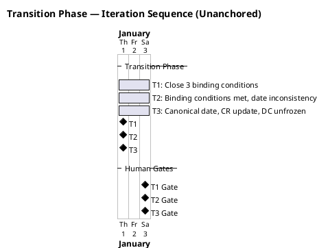
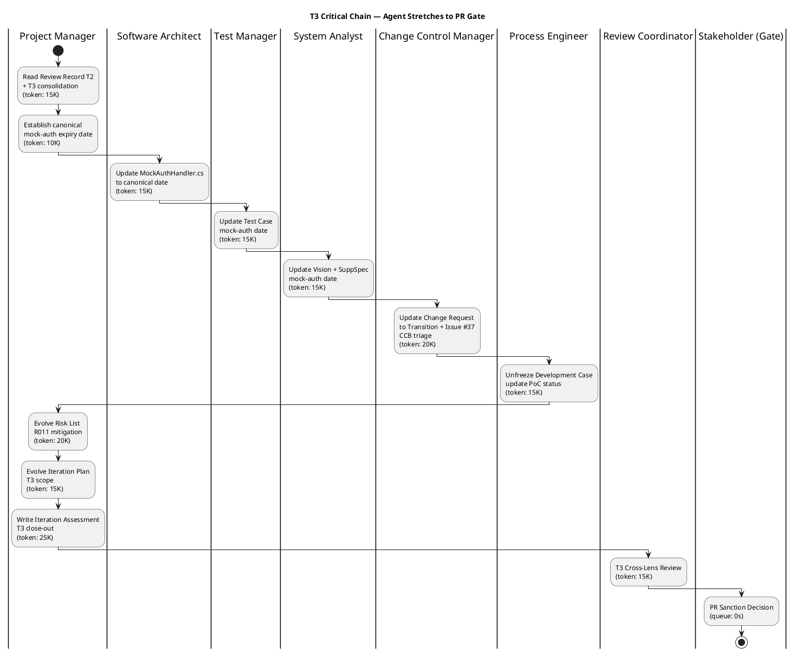

## Document Control

| Field | Value |
|---|---|
| Phase | Transition |
| Status | Active — Transition Iter 3 (T3) |
| Milestone Target | Product Release (PR) — **NOT YET ACHIEVED — stakeholder sanction REFUSED (T2); T3 iteration required** |
| Iteration | 3 (Cycle 1) |
| Date | 2026-08-30 |
| Prior Phase | Transition Iter 2 — PR sanction REFUSED (2nd); binding conditions substantively met; mock-auth date inconsistent across 7 artifacts; 4 open Major findings; stakeholder directed 3 T3 actions |
| Evolution | T3 Plan evolved from T2. All 3 binding conditions met in T2. T3 scope: (1) canonical mock-auth expiry date, (2) Change Request to Transition + Issue #37 CCB triage, (3) Development Case unfrozen. 4 open Major findings to close. Process observation: cross-artifact canonical-value protocol. |
| Measured Baseline | Inception: 2 iters, 4.38M tokens, 22 min, 11 runs, 10 artifacts. Elaboration: 2 iters, 20.87M tokens, 1.0h, 21 runs, 13 artifacts. Construction C3: 12.75M tokens, 1.3h, 15 runs, 15 artifacts. Construction C4: 10.95M tokens, 1.2h, 16 runs, 15 artifacts. Transition T2: 11.76M tokens, 19 min 57s, 10 runs, 16 artifacts. Cumulative: ~60.8M tokens, ~4.0h agent time, 73 runs, 16 artifacts. T3 budget sized from T2 measured baseline — reduced scope (3 targeted fixes + review). |
| CI Build | main: GREEN (run 33263001739, 2026-08-29 16:28:17Z) |

## Iteration Objectives

1. **Establish ONE canonical mock-auth expiry date and owner** — Pick one date, put it in one home, make every other artifact and MockAuthHandler.cs cite that value. Not "align them" — one home, everyone references it. Resolves RR-F1 (Major), TC-F3 (Major), VIS-F2 (Minor), SS-F1 (Minor), BR-T2-001 (Minor), MR-T2-001 (Minor), CR-T2-001 (Minor).
2. **Update Change Request artifact to Transition** — CR frozen at Construction C4. Bring up to Transition. Take Issue #37 through CCB triage instead of sitting cr:logged. Resolves CR-F1 (Major).
3. **Unfreeze Development Case** — DC frozen at Elaboration with obsolete PoC status. Update to current phase. Resolves DC-F1 (Minor).
4. **Close cross-artifact data integrity governance gap** — Define and implement canonical-value protocol: one home, cited from everywhere, never copied. Resolves MR-T2-002 (Major).
5. **Re-review for PR sanction** — All 4 Major findings closed; stakeholder re-reviews for PR sanction.

## Plan and Milestones

### Coarse Cross-Iteration Roadmap

| Milestone | Phase | Iteration | Status | Exit Criteria |
|---|---|---|---|---|
| LCO | Inception | 2 | **ACHIEVED** | All 10 LCO criteria pass — zero open findings |
| LCA | Elaboration | 2 | **ACHIEVED** | 8 LCA closure conditions met; SAD baselined; PoC decisions recorded |
| IOC | Construction | 4 | **ACHIEVED** | All 10 FRs implemented; CI GREEN; 0 Critical defects |
| PR | Transition | 3 (target) | **NOT YET ACHIEVED** | 4 Major findings closed; stakeholder sanctions release; product deployed (deferred) |

### T3 Fine Plan — Work Items

| ID | Work Item | Owner | Token Budget | Depends On | Resolves |
|---|---|---|---|---|---|
| T3-1 | Establish canonical mock-auth expiry date (one home, one owner) | Project Manager | 10K | — | RR-F1, MR-T2-002 |
| T3-2 | Update MockAuthHandler.cs to canonical date | Software Architect | 15K | T3-1 | CR-T2-001 |
| T3-3 | Update Test Case mock-auth date to canonical | Test Manager | 15K | T3-1 | TC-F3 |
| T3-4 | Update Vision + Supplementary Spec mock-auth date | System Analyst | 15K | T3-1 | VIS-F2, SS-F1, BR-T2-001, MR-T2-001 |
| T3-5 | Update Change Request to Transition + Issue #37 CCB triage | Change Control Manager | 20K | — | CR-F1 |
| T3-6 | Unfreeze Development Case, update PoC status | Process Engineer | 15K | — | DC-F1 |
| T3-7 | Update Review Record issue count (7→9) | Reviewer | 5K | — | RR-F2 |
| T3-8 | Evolve Risk List — R011 mitigation | Project Manager | 15K | T3-1 | RL-F6 (API gap) |
| T3-9 | Evolve Iteration Plan — T3 close-out | Project Manager | 10K | T3-1..T3-7 | — |
| T3-10 | Write Iteration Assessment — T3 close-out | Project Manager | 25K | T3-1..T3-8 | — |
| T3-11 | T3 Cross-Lens Review | Review Coordinator | 15K | T3-1..T3-10 | — |
| T3-12 | PR Sanction Re-Review | STK-001 (Gate) | 0s queue | T3-11 | PR milestone |

**Total token budget:** ~160K tokens (sized from T2 measured baseline of 11.76M, reduced for targeted fix scope)

## Resources

### Agent Role Profile — T3

| Role | Work Items | Token Budget | Parallelism |
|---|---|---|---|
| Project Manager | T3-1, T3-8, T3-9, T3-10 | 60K | Sequential (PM leads) |
| Software Architect | T3-2 | 15K | Parallel after T3-1 |
| Test Manager | T3-3 | 15K | Parallel after T3-1 |
| System Analyst | T3-4 | 15K | Parallel after T3-1 |
| Change Control Manager | T3-5 | 20K | Parallel (independent) |
| Process Engineer | T3-6 | 15K | Parallel (independent) |
| Reviewer | T3-7 | 5K | Parallel (independent) |
| Review Coordinator | T3-11 | 15K | After all work items |
| Stakeholder | T3-12 | 0s queue | Gate — end of iteration |

### Budget Split

| Category | Tokens | Basis |
|---|---|---|
| Agent work (T3-1..T3-11) | ~160K | T2 measured baseline (11.76M) reduced for targeted fix scope |
| Stakeholder queue (T3-12) | 0s | No gates within iteration; end-of-iteration approval only |
| **Total** | **~160K + 0s queue** | **Two clocks, never added** |

## Use Cases and Scenarios Addressed

T3 is a defect-resolution iteration — no new use cases are addressed. All 10 UCs (UC-001..UC-010) remain implemented from Construction. T3 focuses on closing 4 open Major findings to unblock PR sanction.

| UC ID | Use Case | T3 Action |
|---|---|---|
| UC-001..UC-010 | All use cases | No change — implementation stable, CI GREEN |

## Evaluation Criteria

| Criterion | Target | Measurement Method |
|---|---|---|
| 0 open Major findings | 4 → 0 | Review Coordinator T3 cross-lens review |
| Canonical mock-auth date | ONE date, ONE owner, ONE home | All 7 artifacts cite same value |
| Change Request updated | Transition phase, Issue #37 triaged | CR artifact updated, CCB disposition recorded |
| Development Case unfrozen | Current phase, PoC status updated | DC artifact updated |
| CI GREEN on main | Maintained | scm_get_build_status |
| PR sanction | APPROVED by STK-001 | Stakeholder gate at end of T3 |

## Traceability

| Element | Traces From | Link Type | Traces To |
|---|---|---|---|
| T3-1 (canonical date) | RR-F1, MR-T2-002, STK-001 T2 directive | Derives | All 7 artifacts + MockAuthHandler.cs |
| T3-2 (MockAuthHandler.cs) | CR-T2-001, T3-1 | Derives | CI build |
| T3-3 (Test Case) | TC-F3, T3-1 | Derives | Test Case (Transition) |
| T3-4 (Vision + SuppSpec) | VIS-F2, SS-F1, BR-T2-001, MR-T2-001, T3-1 | Derives | Vision, Supplementary Specification |
| T3-5 (Change Request) | CR-F1, STK-001 T2 directive | Derives | Change Request (Transition), Issue #37 |
| T3-6 (Development Case) | DC-F1, STK-001 T2 directive | Derives | Development Case |
| T3-7 (Review Record) | RR-F2 | Derives | Review Record |
| T3-8 (Risk List) | RL-F6, R011, T3-1 | Derives | Risk List (Transition) |
| T3-9 (Iteration Plan) | T3 scope, STK-001 T2 directives | Derives | Iteration Plan (Transition) |
| T3-10 (Iteration Assessment) | T3 results, T3-1..T3-9 | Derives | Iteration Assessment (Transition) |
| T3-11 (Review) | T3-1..T3-10 | Derives | Review Record (T3) |
| T3-12 (PR gate) | AC-001..AC-005, STK-001 | Refines | PR milestone |
| BC-1 (NFR testing) | NFR-001, NFR-002 | Derives | CLOSED — measured 0.14s / 0.003s |
| BC-2 (OIDC) | CON-004, R003 | Derives | CLOSED — formally accepted risk |
| BC-3 (mock-auth expiry) | STK-001 binding condition #3 | Refines | MET (with defect) — T3 canonicalizes |
| BC-4 (deployment) | CON-006, CON-007 | Derives | MET (deferred) — Release Notes explicit |
| CI build (33263001739) | scm_get_build_status | Tests | All source files on main — GREEN |
| Stakeholder PR gate | STK-001, AC-001..AC-005 | Refines | PR milestone re-review (T3) |