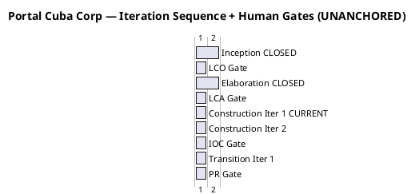
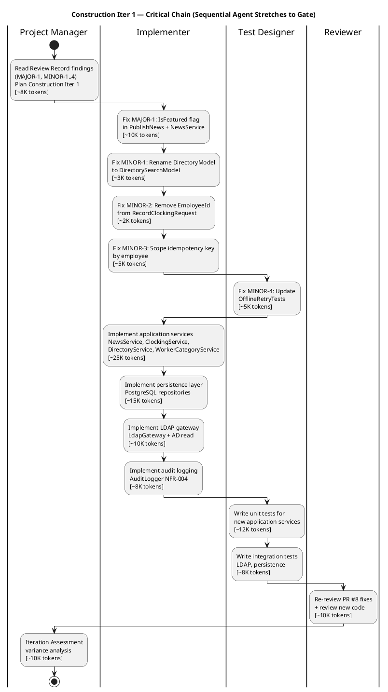

## Document Control

| Field | Value |
|---|---|
| Phase | Construction |
| Status | Active |
| Milestone Target | End-of-Construction (IOC) |
| Iteration | 1 (Cycle 1) |
| Date | 2026-08-28 |
| Prior Phase | Elaboration (LCA achieved, 0 open Critical/Major, stakeholder sanction GRANTED) |
| Evolution | Elaboration Iter 2 Plan evolved for Construction Iter 1: coarse roadmap baselined with measured Elaboration actuals; fine plan replaced with C1 scope (fix PR #8 findings + implement application/persistence/LDAP/audit layers); budget box sized from measured Elaboration per-iteration cost (~10.4M tokens average) |
| Measured Baseline | Inception: 2 iters, 4.38M tokens, 22 min, 11 runs, 10 artifacts. Elaboration: 2 iters, 20.87M tokens, 1.0h, 21 runs, 13 artifacts. Cumulative: 25.25M tokens, 2.5h, 53 runs, 23 artifacts. |

## Iteration Objectives

1. **Resolve all open Review Record findings from PR #8:** MAJOR-1 (IsFeatured flag never set — FR-008 featured banner non-functional) blocks merge. MINOR-1 (DirectoryModel naming), MINOR-2 (dead EmployeeId field), MINOR-3 (idempotency key not scoped by employee), MINOR-4 (test codifies MINOR-3 behavior). All 5 findings targeted for closure this iteration.
2. **Implement application services layer:** NewsService (publish/edit/unpublish with audit), ClockingService (record with idempotency + offline retry), DirectoryService (LDAP read), WorkerCategoryService (AD user id → category CRUD with audit).
3. **Implement persistence layer:** PostgreSQL repositories for Clocking, News, NewsAudit, WorkerCategory tables per SAD schema baseline.
4. **Implement LDAP gateway:** LdapGateway using Novell.Directory.Ldap (ADR-003) with ILdapConnection abstraction for testability. Missing AD attributes default to "N/A" (R001 mitigation).
5. **Implement audit logging:** AuditLogger (INT-005) for all publish/edit/unpublish/category operations per NFR-004.
6. **Expand test coverage:** Unit tests for new application services; integration tests for LDAP and persistence layers.
7. **Re-review and merge PR #8:** After fixes, Reviewer re-evaluates; CI must pass green.

## Plan and Milestones

### Coarse Cross-Iteration Roadmap

The project follows the RUP iterative lifecycle with **7 iterations** across 4 phases. Inception and Elaboration are CLOSED with measured actuals. Construction is allocated 2 iterations; Transition 1. The coarse roadmap is now baselined from measured Elaboration actuals.

| Phase | Iterations | Measured Tokens | Measured Agent Time | Agent Runs | Artifacts | Milestone |
|---|---|---|---|---|---|---|
| Inception (CLOSED) | 2 | 4,382,313 | 22 min | 11 | 10 | LCO ✅ ACHIEVED |
| Elaboration (CLOSED) | 2 | 20,867,327 | 1.0 h | 21 | 13 | LCA ✅ ACHIEVED |
| Construction (CURRENT) | 2 | [ASSUMPTION — ~10.4M tokens/iter; basis: Elaboration measured average per-iteration cost] | [ASSUMPTION — ~30 min/iter; basis: Elaboration measured average] | [ASSUMPTION — ~15 runs/iter] | [ASSUMPTION — ~10 artifacts] | IOC (target) |
| Transition (PLANNED) | 1 | [ASSUMPTION — ~5M tokens; basis: Transition is lighter, fewer architectural decisions] | [ASSUMPTION — ~15 min] | [ASSUMPTION — ~8 runs] | [ASSUMPTION — ~5 artifacts] | PR (target) |
| **Total** | **7** | **~51M (forecast)** | | | | |

### Iteration Sequence + Human Gates

> Gates are quoted in **days of queue time** (human waiting, not agent working). Agent work is denominated in tokens and measured elapsed time — never added to gate time.

### Fine Gantt — Construction Iteration 1 Critical Chain

### Construction Iter 1 — Work Items

| # | Work Item | Owner | Token Budget | Depends On | Acceptance Criterion |
|---|---|---|---|---|---|
| 1 | Fix MAJOR-1: Add isFeatured param to INewsService.Publish, set item.IsFeatured, update PublishNewsModel.OnPost | Implementer | ~10K | Review Record | FR-008 featured banner functional |
| 2 | Fix MINOR-1: Rename DirectoryModel → DirectorySearchModel (V007 conformance) | Implementer | ~3K | — | Design Model conformance |
| 3 | Fix MINOR-2: Remove EmployeeId from RecordClockingRequest DTO | Implementer | ~2K | — | No dead code in DTO |
| 4 | Fix MINOR-3: Scope idempotency key by employee (FindByIdempotencyKey(employeeId, key)) | Implementer | ~5K | — | Cross-employee collision impossible |
| 5 | Fix MINOR-4: Update OfflineRetryTests to assert both employees succeed independently | Test Designer | ~5K | Item 4 | Test validates correct behavior |
| 6 | Implement NewsService: publish/edit/unpublish with audit trail (NFR-004, CON-013) | Implementer | ~8K | Item 1 | AC-002, FR-005/006/007 |
| 7 | Implement ClockingService: record with idempotency + offline retry (AC-005) | Implementer | ~6K | Item 4 | AC-001, FR-001 |
| 8 | Implement DirectoryService: LDAP read with "N/A" fallback (R001 mitigation) | Implementer | ~5K | SAD COMP-005 | AC-003, FR-009 |
| 9 | Implement WorkerCategoryService: AD user id → category CRUD with audit | Implementer | ~5K | — | FR-010, NFR-004 |
| 10 | Implement persistence layer: PostgreSQL repositories (Clocking, News, NewsAudit, WorkerCategory) | Implementer | ~15K | SAD schema | NFR-002 response time |
| 11 | Implement LdapGateway: Novell.DirectoryLdap + ILdapConnection abstraction | Implementer | ~10K | SAD COMP-005, ADR-003 | R001 mitigation active |
| 12 | Implement AuditLogger: INT-005 conformance, all operations audited | Implementer | ~8K | Design Model INT-005 | NFR-004 compliance |
| 13 | Write unit tests for application services | Test Designer | ~12K | Items 6-9 | Dual coverage (black-box + white-box) |
| 14 | Write integration tests for LDAP + persistence | Test Designer | ~8K | Items 10-11 | Integration paths covered |
| 15 | Re-review PR #8 + new code | Reviewer | ~10K | All above | 0 Critical, 0 Major open |
| 16 | Iteration Assessment (variance analysis) | Project Manager | ~10K | All above | Objectives met/missed documented |

**Budget box: ~10.4M tokens** [ASSUMPTION — basis: Elaboration measured average per-iteration cost was ~10.4M tokens; Construction has more code volume but fewer architectural decisions, so this is a reasonable starting estimate. This figure will be replaced by measured actuals at iteration close.]

> The budget box is fixed. If work does not fit, overflow defers to Construction Iter 2 backlog. Scope adapts to the box; the box does not grow to fit scope.

## Resources

### Agent Role Profile — Construction Iter 1

| Role | Active | Work Items | Token Budget | Rationale |
|---|---|---|---|---|
| Project Manager | Yes | 1, 16 | ~18K | Plan, monitor, assess iteration |
| Implementer | Yes | 1-4, 6-12 | ~74K | Primary code production + finding fixes |
| Test Designer | Yes | 5, 13, 14 | ~25K | Test fixes + new test coverage |
| Reviewer | Yes | 15 | ~10K | Re-review PR #8 + new code |
| Software Architect | Advisory | — | ~0K | Architecture baseline stable; consultation only |
| UI Designer | Advisory | — | ~0K | Design Model complete; consultation only |

> **Parallelism discipline:** 4 active roles. No increase in parallelism is proposed to address schedule pressure. If the iteration falls behind, the first lever is scope reduction (defer work items to C2), not additional agent roles.

### Budget Split Across Agent Roles

| Role | Token Share | % of Budget Box |
|---|---|---|
| Implementer | ~74K | 71% |
| Test Designer | ~25K | 24% |
| Reviewer | ~10K | 10% |
| Project Manager | ~18K | 17% |
| **Total planned** | **~127K** | **(planned work items only; full budget box ~10.4M includes all agent reasoning over artifact surface)** |

> The token budgets above are for the **planned work items** — the specific code, test, and review tasks. The full budget box (~10.4M) accounts for all agent reasoning including re-reading accumulated artifacts, cross-referencing, and verification overhead. The Elaboration measured actuals showed that work-item budgets were ~1% of actual token spend; the cost driver is reasoning over the accumulated artifact surface, not the volume of new output.

## Use Cases and Scenarios Addressed

| UC ID | Use Case | FR ID | Iteration Scope | Status |
|---|---|---|---|---|
| UC-001 | Clock In and Clock Out | FR-001 | Presentation layer implemented (PR #8); application + persistence + audit this iteration | Fix MINOR-2/3 + implement service |
| UC-002 | View Own Clocking History | FR-002 | Presentation layer implemented (PR #8); application + persistence this iteration | Implement service |
| UC-003 | View All Employee Clockings | FR-003 | Presentation layer implemented (PR #8); application + persistence this iteration | Implement service |
| UC-004 | Export Monthly Clocking Report | FR-004 | Presentation layer implemented (PR #8); application + persistence this iteration | Implement service |
| UC-005 | Publish News | FR-005 | Presentation layer implemented (PR #8); **MAJOR-1 fix required** + application + audit this iteration | Fix MAJOR-1 + implement service |
| UC-006 | Edit Published News | FR-006 | Presentation layer implemented (PR #8); application + audit this iteration | Implement service |
| UC-007 | Unpublish News | FR-007 | Presentation layer implemented (PR #8); application + audit this iteration | Implement service |
| UC-008 | Read and Filter News | FR-008 | Presentation layer implemented (PR #8); **MAJOR-1 blocks featured banner** + application this iteration | Fix MAJOR-1 + implement service |
| UC-009 | Search Employee Directory | FR-009 | Presentation layer implemented (PR #8); **MINOR-1 naming fix** + LDAP gateway this iteration | Fix MINOR-1 + implement LDAP |
| UC-010 | Manage Worker Category | FR-010 | Presentation layer implemented (PR #8); application + audit this iteration | Implement service |

> **Scope variance note:** The prior provisional roadmap assigned UC-001–UC-005 to C1 and UC-006–UC-010 to C2. The Implementer produced presentation-layer code for all 10 UCs in PR #8. This iteration addresses finding fixes across all 10 UCs plus application/persistence/LDAP/audit service implementation. The C1/C2 split is re-baselined: C1 = fix findings + implement all service/persistence/audit layers; C2 = integration testing, NFR validation (NFR-001/NFR-002 load testing), OIDC integration (if STK-003 confirms), end-to-end test scenarios.

## Evaluation Criteria

### Layer (a): Declared Acceptance Criteria Addressed This Iteration

| AC ID | Description | Addressed This Iteration? | Evidence / Reason |
|---|---|---|---|
| AC-001 | Employee can clock in/out without help | Partially — application + persistence + audit implemented; full end-to-end validation in C2 | ClockingService, ClockingRepository, AuditLogger |
| AC-002 | HR can publish a news item without technical assistance | Partially — MAJOR-1 fix makes featured banner functional; NewsService + AuditLogger implemented; full validation in C2 | MAJOR-1 fix, NewsService, AuditLogger |
| AC-003 | Employee finds colleague's phone/email in under 10 seconds | Partially — LdapGateway implemented with "N/A" fallback; performance validation in C2 | LdapGateway, DirectoryService |
| AC-004 | 80% of employees complete at least one clocking with no prior training | Not addressed — Transition phase (adoption tracking) | Deferred to Transition |
| AC-005 | System works temporarily offline (5-min network drop, data syncs on recovery) | Partially — MINOR-3 fix scopes idempotency key by employee; ClockingService retry mechanism implemented; full offline test in C2 | MINOR-3/4 fixes, ClockingService |

### Layer (b): Construction Iteration 1 Exit Criteria

| # | Exit Criterion | Assessment Target | Evidence Required |
|---|---|---|---|
| 1 | MAJOR-1 resolved — IsFeatured flag set in Publish flow | MET | Code review confirms IsFeatured persisted; unit test verifies |
| 2 | MINOR-1 resolved — DirectoryModel renamed to DirectorySearchModel | MET | Code review confirms V007 conformance |
| 3 | MINOR-2 resolved — EmployeeId removed from RecordClockingRequest | MET | Code review confirms no dead code |
| 4 | MINOR-3 resolved — Idempotency key scoped by employee | MET | Code review confirms FindByIdempotencyKey(employeeId, key) |
| 5 | MINOR-4 resolved — OfflineRetryTests updated | MET | Test asserts both employees succeed independently |
| 6 | Application services implemented (News, Clocking, Directory, WorkerCategory) | MET | Code review confirms service layer complete |
| 7 | Persistence layer implemented (PostgreSQL repositories) | MET | Code review confirms repository pattern + schema conformance |
| 8 | LDAP gateway implemented with ILdapConnection abstraction | MET | Code review confirms ADR-003 conformance |
| 9 | Audit logging implemented (INT-005 conformance) | MET | Code review confirms NFR-004 compliance |
| 10 | CI build passes green | MET | scm_get_build_status confirms PASS |
| 11 | Re-review of PR #8 + new code: 0 Critical, 0 Major | MET | Review Record updated |
| 12 | Iteration Assessment produced with variance analysis | MET | This artifact at iteration close |

## Traceability

| Element | Traces From | Link Type | Traces To |
|---|---|---|---|
| Construction Iter 1 Plan | Elaboration Iter 2 Plan (coarse roadmap), Elaboration Iteration Assessment (measured actuals) | Refines | Construction Iter 1 Assessment |
| MAJOR-1 fix | Review Record MAJOR-1, FR-008, V004 (PublishNewsModel) | Derives | NewsService.Publish, PublishNews.cshtml.cs |
| MINOR-1 fix | Review Record MINOR-1, V007 (DirectorySearchModel) | Derives | Directory.cshtml.cs |
| MINOR-2 fix | Review Record MINOR-2, INT-001 (IClockingService) | Derives | ClockingApiController.cs |
| MINOR-3 fix | Review Record MINOR-3, AC-005, R006 | Derives | ClockingService.cs, IPersistence |
| MINOR-4 fix | Review Record MINOR-4, MINOR-3 | Derives | OfflineRetryTests.cs |
| NewsService | FR-005, FR-006, FR-007, NFR-004, CON-013, INT-005 | Derives | src/PortalCubaCorp.Application/NewsService.cs |
| ClockingService | FR-001, FR-002, AC-001, AC-005, R006 | Derives | src/PortalCubaCorp.Application/ClockingService.cs |
| DirectoryService | FR-009, R001, COMP-005, ADR-003 | Derives | src/PortalCubaCorp.Application/DirectoryService.cs |
| WorkerCategoryService | FR-010, NFR-004 | Derives | src/PortalCubaCorp.Application/WorkerCategoryService.cs |
| Persistence layer | CON-003, SAD schema, INT-007 | Derives | src/PortalCubaCorp.Infrastructure/ |
| LdapGateway | CON-005, CON-009, COMP-005, ADR-003, R001 | Derives | src/PortalCubaCorp.Infrastructure/LdapGateway.cs |
| AuditLogger | NFR-004, INT-005, COMP-008 | Derives | src/PortalCubaCorp.Infrastructure/AuditLogger.cs |
| Budget box (~10.4M tokens) | Elaboration measured actuals (per-iteration average) | Derives | Construction Iter 1 Assessment (measured vs planned) |
| AC-001 (clocking) | Work Order AC-001 | Refines | ClockingService, ClockingRepository |
| AC-002 (news publish) | Work Order AC-002 | Refines | NewsService, AuditLogger, MAJOR-1 fix |
| AC-003 (directory search) | Work Order AC-003 | Refines | LdapGateway, DirectoryService |
| AC-005 (offline) | Work Order AC-005 | Refines | ClockingService, MINOR-3/4 fixes |